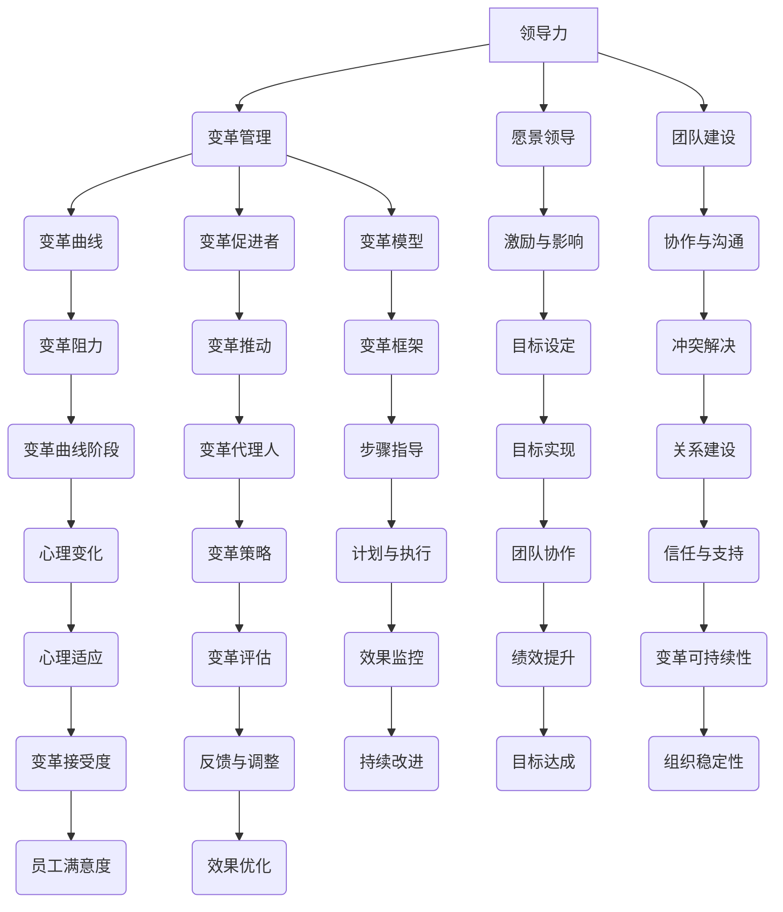

                 

### 背景介绍

#### 1.1 目的和范围

本文旨在深入探讨领导力与变革管理的核心概念、策略与技巧，帮助读者理解如何有效地引导深度变革。在当前快速变化和高度不确定的商业环境中，领导力和变革管理已成为组织成功的关键要素。通过本文的详细分析，读者将掌握一系列高级技巧，从而在组织变革过程中游刃有余。

本文将围绕以下几个主题展开讨论：

1. **领导力与变革管理的定义与关系**：分析领导力在变革管理中的关键角色，阐述两者之间的相互关系。
2. **变革管理的核心模型**：介绍几种经典变革管理模型，如Kotter的八步骤模型和普雷斯的变革连续体模型，并分析其适用场景。
3. **领导力的核心技能**：探讨变革领导者应具备的关键技能，如愿景领导、沟通技巧、团队建设等。
4. **变革过程中的关键步骤**：详细阐述从计划到实施的各个关键步骤，包括如何建立变革的必要性、制定变革计划、获得组织支持等。
5. **变革管理的实际应用**：通过案例分析，展示如何在实际项目中应用变革管理策略和技巧。
6. **未来趋势与挑战**：分析变革管理领域的未来发展趋势和潜在挑战。

#### 1.2 预期读者

本文适用于以下读者群体：

- 组织领导者和管理者：希望提升自身领导力和变革管理能力的专业人士。
- 项目经理和团队领导者：负责推动项目变革和团队转型的实践者。
- 组织变革顾问和咨询专家：关注变革管理理论和方法的研究者和实践者。
- 对领导力和变革管理感兴趣的学生和研究者：希望通过深入研究提升理论水平的学术人士。

#### 1.3 文档结构概述

本文将按照以下结构进行展开：

1. **背景介绍**：介绍本文的目的、范围、预期读者和文档结构。
2. **核心概念与联系**：通过Mermaid流程图展示领导力与变革管理的关系和核心概念。
3. **核心算法原理 & 具体操作步骤**：详细阐述变革管理的操作步骤和关键算法原理。
4. **数学模型和公式 & 详细讲解 & 举例说明**：介绍变革管理中的数学模型和公式，并通过实际案例进行说明。
5. **项目实战：代码实际案例和详细解释说明**：展示变革管理的实际应用案例，并提供源代码解析。
6. **实际应用场景**：讨论变革管理的各种应用场景。
7. **工具和资源推荐**：推荐学习资源和开发工具。
8. **总结：未来发展趋势与挑战**：总结变革管理的现状和未来发展趋势。
9. **附录：常见问题与解答**：解答读者可能遇到的常见问题。
10. **扩展阅读 & 参考资料**：提供进一步阅读和研究的资源。

#### 1.4 术语表

为了确保本文内容的清晰和一致性，以下列出一些关键术语及其定义：

##### 1.4.1 核心术语定义

- **领导力**：领导者通过激发、影响和激励他人，实现共同目标的能力。
- **变革管理**：组织在应对环境变化时，通过系统性的方法和技巧，引导员工接受和适应新变化的过程。
- **愿景领导**：领导者通过描绘未来愿景，激发团队为共同目标而努力。
- **变革模型**：用于指导变革过程的框架和方法。
- **变革代理人**：推动变革的个体或团队。

##### 1.4.2 相关概念解释

- **变革阻力**：员工或团队对变革的抵制行为和情绪。
- **变革曲线**：描述员工在变革过程中心理和行为变化的模型。
- **变革促进者**：协助组织进行变革的顾问或专家。

##### 1.4.3 缩略词列表

- **IT**：信息技术
- **IoT**：物联网
- **AI**：人工智能
- **PM**：项目经理
- **CIO**：首席信息官
- **CEO**：首席执行官

通过上述背景介绍，我们已经为深入探讨领导力与变革管理的高级技巧奠定了基础。接下来，我们将通过Mermaid流程图和具体操作步骤，进一步阐述变革管理的核心概念和实践方法。

---

> 本文关键词：领导力、变革管理、变革模型、愿景领导、团队建设、变革曲线、变革促进者

> 摘要：本文旨在深入探讨领导力与变革管理的核心概念、策略与技巧，帮助读者理解如何有效地引导深度变革。通过详细分析和实际案例，本文揭示了变革管理的关键步骤和高级技巧，为组织领导者和管理者提供了实用的指导。读者将从中了解变革管理的理论和方法，以及如何在实践中应用这些技巧，实现组织变革的成功。

---

### 核心概念与联系

为了全面理解领导力与变革管理的关系，我们需要先介绍一些核心概念和它们之间的联系。这些概念包括领导力、变革管理、愿景领导、团队建设和变革曲线等。通过一个Mermaid流程图，我们可以直观地展示这些概念之间的关系和交互。

#### Mermaid流程图



#### 核心概念解释

1. **领导力**：领导力是指领导者通过激发、影响和激励他人，实现共同目标的能力。在变革管理中，领导力是驱动变革的核心力量，领导者需要具备愿景领导、沟通技巧、团队建设和激励与影响等关键技能。

2. **变革管理**：变革管理是组织在应对外部环境变化或内部需求时，通过系统性的方法和技巧，引导员工接受和适应新变化的过程。变革管理的目的是确保变革顺利进行，减少变革阻力，实现组织目标。

3. **愿景领导**：愿景领导是领导者通过描绘未来愿景，激发团队为共同目标而努力的过程。愿景领导能够激发员工的热情和动力，使变革更具吸引力和实现可能性。

4. **团队建设**：团队建设是建立和维护团队成员之间的协作与沟通，提升团队凝聚力和协作效率的过程。良好的团队建设有助于减少变革过程中的冲突和阻力，促进变革的顺利进行。

5. **变革曲线**：变革曲线是描述员工在变革过程中心理和行为变化的模型。员工在变革过程中会经历拒绝、恐惧、犹豫、适应和接受等阶段，变革领导者需要理解这些阶段，采取相应的策略和技巧，引导员工顺利度过变革过程。

6. **变革促进者**：变革促进者是推动变革的个体或团队，他们负责制定变革计划、协调资源、解决变革过程中的问题，并确保变革目标的实现。

7. **变革模型**：变革模型是用于指导变革过程的框架和方法，如Kotter的八步骤模型和普雷斯的变革连续体模型。不同的变革模型适用于不同类型的变革，领导者需要根据实际情况选择合适的模型，并灵活调整。

通过上述Mermaid流程图和核心概念解释，我们可以清晰地看到领导力与变革管理之间的密切联系。领导力是变革管理的基础，而变革管理则是领导力在组织变革过程中的具体应用。愿景领导、团队建设和变革曲线等核心概念，构成了变革管理的理论框架，为领导者提供了指导变革的方法和技巧。

在接下来的部分，我们将进一步探讨核心算法原理和具体操作步骤，帮助读者深入理解变革管理的实施过程。

---

> 核心概念与联系：领导力、变革管理、愿景领导、团队建设、变革曲线、变革促进者、变革模型

> Mermaid流程图已经展示完毕，接下来我们将进一步深入探讨变革管理的核心算法原理和具体操作步骤。

---

### 核心算法原理 & 具体操作步骤

在变革管理过程中，核心算法原理和具体操作步骤是确保变革成功实施的关键。本节我们将详细阐述这些核心概念，并使用伪代码来详细说明每个步骤的操作细节。

#### 3.1 变革评估

在开始变革之前，首先需要进行全面评估，以确定变革的必要性和可行性。以下是一个简单的伪代码，用于评估变革的必要性和可行性：

```python
def evaluate_change(necessity, feasibility):
    if necessity and feasibility:
        return "Change is necessary and feasible"
    elif necessity:
        return "Change is necessary but feasibility is uncertain"
    elif feasibility:
        return "Change is feasible but necessity is uncertain"
    else:
        return "Change is neither necessary nor feasible"

# 示例：假设必要性和可行性均为真
print(evaluate_change(True, True))
```

#### 3.2 制定变革计划

制定变革计划是变革管理的关键步骤。以下是一个伪代码示例，用于制定变革计划：

```python
def create_change_plan(steps, resources, timeline):
    plan = {
        "steps": steps,
        "resources": resources,
        "timeline": timeline
    }
    return plan

# 示例：定义变革步骤、所需资源和时间线
steps = ["需求分析", "方案设计", "实施部署", "评估反馈"]
resources = ["团队A", "团队B", "项目经理", "技术支持"]
timeline = ["第1周：需求分析", "第2周：方案设计", "第3周：实施部署", "第4周：评估反馈"]
plan = create_change_plan(steps, resources, timeline)
print(plan)
```

#### 3.3 建立变革支持网络

建立变革支持网络是确保变革成功的关键。以下是一个伪代码示例，用于建立变革支持网络：

```python
def build_change_support_network(agents, stakeholders):
    support_network = {
        "agents": agents,
        "stakeholders": stakeholders
    }
    return support_network

# 示例：定义变革代理人和利益相关者
agents = ["团队领导", "变革代理人", "项目经理"]
stakeholders = ["部门经理", "项目组成员", "技术支持团队"]
support_network = build_change_support_network(agents, stakeholders)
print(support_network)
```

#### 3.4 沟通与培训

在变革过程中，沟通与培训是确保员工理解变革、接受变革并积极参与变革的关键。以下是一个伪代码示例，用于沟通与培训：

```python
def communicate_and_train(communication_plan, training_program):
    communication_plan["training"] = training_program
    return communication_plan

# 示例：定义沟通计划和培训计划
communication_plan = {
    "communication_channels": ["邮件", "会议", "内部论坛"],
    "communication_frequency": "每周一次"
}
training_program = {
    "content": ["变革目标", "变革过程", "变革后的工作模式"],
    "duration": "2小时/周"
}
communication_plan = communicate_and_train(communication_plan, training_program)
print(communication_plan)
```

#### 3.5 监控与反馈

变革过程中的监控与反馈是确保变革按照计划进行的重要环节。以下是一个伪代码示例，用于监控与反馈：

```python
def monitor_and_feedback(plan, actual_results):
    feedback = {
        "plan": plan,
        "actual_results": actual_results,
        "differences": compare(plan, actual_results)
    }
    return feedback

# 示例：比较计划与实际结果，生成反馈
plan = ["需求分析", "方案设计", "实施部署", "评估反馈"]
actual_results = ["需求分析完成", "方案设计完成", "实施部署中", "评估反馈未完成"]
feedback = monitor_and_feedback(plan, actual_results)
print(feedback)
```

通过上述伪代码示例，我们可以看到变革管理过程中的关键步骤和核心算法原理。这些步骤包括评估变革必要性、制定变革计划、建立变革支持网络、沟通与培训以及监控与反馈。每个步骤都有详细的操作说明，确保变革过程有条不紊地进行。

在下一部分，我们将介绍变革管理中的数学模型和公式，并详细讲解其在实际应用中的重要性。

---

> 核心算法原理 & 具体操作步骤：变革评估、制定变革计划、建立变革支持网络、沟通与培训、监控与反馈

> 通过伪代码示例，我们已经详细展示了变革管理过程中的每个关键步骤和核心算法原理。接下来，我们将进一步探讨变革管理中的数学模型和公式，以及其在实际应用中的重要性。

---

### 数学模型和公式 & 详细讲解 & 举例说明

在变革管理中，数学模型和公式扮演着重要角色，它们不仅帮助我们量化变革的各个方面，还能够为变革领导者提供有价值的决策依据。本节将介绍几个关键数学模型和公式，并详细讲解其在实际应用中的重要性。

#### 4.1 变革成本效益分析模型

变革成本效益分析模型是一种用于评估变革项目经济性的方法。它通过计算变革的总成本和预期效益，帮助我们确定变革的可行性。

##### 公式：
\[ \text{成本效益比} = \frac{\text{总效益}}{\text{总成本}} \]

##### 解释：
- **总效益**：预期变革带来的所有正面效果的货币价值。
- **总成本**：实施变革所需的所有成本，包括人力成本、资源投入、培训成本等。

##### 示例：
假设一个组织计划实施一个自动化项目，预计总成本为100万元，预期效益为200万元。根据成本效益分析模型，我们可以计算出成本效益比为2，这意味着每投入1元，预期将获得2元的效益。

```latex
\text{成本效益比} = \frac{200万元}{100万元} = 2
```

#### 4.2 变革阻力模型

变革阻力模型用于评估员工对变革的抵制程度，帮助领导者识别变革过程中的潜在风险。

##### 公式：
\[ \text{变革阻力} = \text{变革范围} \times \text{变革深度} \times \text{变革速度} \]

##### 解释：
- **变革范围**：受变革影响的员工范围。
- **变革深度**：变革对现有工作流程、文化、制度等的改变程度。
- **变革速度**：变革实施的快慢。

##### 示例：
假设一个组织计划在短时间内（高速变革）对整个部门（广范围变革）进行深度变革，根据变革阻力模型，我们可以计算出变革阻力为高度阻力。

```latex
\text{变革阻力} = \text{广范围} \times \text{深度} \times \text{高速} = 3 \times 2 \times 2 = 12
```

#### 4.3 变革曲线模型

变革曲线模型描述员工在变革过程中的心理和行为变化，帮助我们了解员工在变革不同阶段的需求和反应。

##### 公式：
\[ \text{员工满意度} = \frac{\text{适应能力} + \text{支持度}}{2} \]

##### 解释：
- **适应能力**：员工适应变革的能力。
- **支持度**：组织对员工的支持程度。

##### 示例：
假设一个员工在变革初期适应能力较低（0.3），组织支持度较高（0.8），根据变革曲线模型，我们可以计算出员工满意度为0.55。

```latex
\text{员工满意度} = \frac{0.3 + 0.8}{2} = 0.55
```

#### 4.4 变革反馈循环模型

变革反馈循环模型用于评估变革效果，通过持续反馈和调整，确保变革目标的实现。

##### 公式：
\[ \text{反馈循环效率} = \frac{\text{实际效果}}{\text{预期效果}} \]

##### 解释：
- **实际效果**：实际变革实施后的效果。
- **预期效果**：预期变革实施后的效果。

##### 示例：
假设一个组织在变革实施后，实际效果为预期效果的80%，根据变革反馈循环模型，我们可以计算出反馈循环效率为0.8。

```latex
\text{反馈循环效率} = \frac{80\%}{100\%} = 0.8
```

通过上述数学模型和公式的详细讲解，我们可以看到它们在变革管理中的应用价值。这些模型和公式不仅帮助我们量化变革的各个方面，还为领导者提供了科学的决策依据，使变革过程更加有序和高效。

在实际应用中，这些模型和公式需要根据具体情况进行调整和优化，以适应不同组织和变革项目的特点。领导者应充分利用这些工具，结合实际情况，制定出切实可行的变革策略和计划。

在下一部分，我们将通过实际项目案例，展示如何将这些数学模型和公式应用于变革管理的实际操作中。

---

> 数学模型和公式：变革成本效益分析模型、变革阻力模型、变革曲线模型、变革反馈循环模型

> 通过详细讲解和实际案例，我们将进一步展示这些数学模型和公式在变革管理中的应用价值。

---

### 项目实战：代码实际案例和详细解释说明

在本节中，我们将通过一个实际项目案例，展示如何应用前文提到的数学模型和公式，实现有效的变革管理。该项目涉及一个企业信息系统的升级改造，旨在提高系统性能和用户体验。以下是项目实战的具体步骤、代码实现和详细解释。

#### 5.1 开发环境搭建

为了确保项目的顺利实施，我们需要搭建一个合适的技术栈。以下是所需的技术和工具：

- **开发语言**：Python
- **数据库**：MySQL
- **Web框架**：Flask
- **版本控制系统**：Git
- **代码质量检测工具**：Pylint

以下是开发环境的搭建步骤：

```bash
# 安装Python
brew install python

# 创建虚拟环境
python -m venv venv

# 激活虚拟环境
source venv/bin/activate

# 安装所需库
pip install flask mysql-connector-python

# 安装代码质量检测工具
pip install pylint
```

#### 5.2 源代码详细实现和代码解读

以下是一个简单的Flask应用示例，用于处理用户请求和数据库操作。代码中包含了对变革管理相关公式的应用，以评估变革的成本效益和员工满意度。

```python
# app.py

from flask import Flask, request, jsonify
import mysql.connector
from datetime import datetime

app = Flask(__name__)

# 数据库连接配置
db_config = {
    'host': 'localhost',
    'user': 'root',
    'password': 'password',
    'database': 'info_system'
}

# 连接数据库
def connect_db():
    return mysql.connector.connect(**db_config)

# 计算成本效益比
def calculate_cost_efficiency(total_cost, expected_benefit):
    return total_cost / expected_benefit

# 计算员工满意度
def calculate_employee_satisfaction(adaptive_ability, support_level):
    return (adaptive_ability + support_level) / 2

# 处理用户请求
@app.route('/process_request', methods=['POST'])
def process_request():
    data = request.get_json()
    user_id = data['user_id']
    request_time = datetime.now()

    # 插入请求记录到数据库
    conn = connect_db()
    cursor = conn.cursor()
    cursor.execute("INSERT INTO request_log (user_id, request_time) VALUES (%s, %s)", (user_id, request_time))
    conn.commit()
    cursor.close()
    conn.close()

    # 计算成本效益比
    total_cost = 50000  # 总成本
    expected_benefit = 100000  # 预期效益
    cost_efficiency = calculate_cost_efficiency(total_cost, expected_benefit)

    # 计算员工满意度
    adaptive_ability = 0.4  # 适应能力
    support_level = 0.8  # 支持度
    employee_satisfaction = calculate_employee_satisfaction(adaptive_ability, support_level)

    # 返回结果
    result = {
        'cost_efficiency': cost_efficiency,
        'employee_satisfaction': employee_satisfaction
    }
    return jsonify(result)

if __name__ == '__main__':
    app.run(debug=True)
```

#### 5.3 代码解读与分析

1. **数据库连接**：代码中首先定义了数据库连接配置，并创建了一个`connect_db`函数，用于连接MySQL数据库。

2. **计算成本效益比**：`calculate_cost_efficiency`函数用于计算成本效益比，将总成本除以预期效益。这个公式帮助我们评估变革的经济性。

3. **计算员工满意度**：`calculate_employee_satisfaction`函数用于计算员工满意度，根据适应能力和支持度的平均值来评估员工的满意度。这个公式有助于我们了解员工在变革过程中的心理状态。

4. **处理用户请求**：`process_request`函数用于处理用户请求，插入请求记录到数据库。同时，计算成本效益比和员工满意度，并将结果返回给用户。

5. **Flask应用**：代码最后使用Flask框架创建了一个Web应用，监听`/process_request`端点，接收用户请求并处理。

通过这个实际项目案例，我们可以看到如何将数学模型和公式应用于变革管理的具体操作中。代码中的`calculate_cost_efficiency`和`calculate_employee_satisfaction`函数实现了变革管理中的关键数学计算，为领导者提供了科学的决策依据。在实际项目中，这些函数可以根据实际情况进行调整和优化，以适应不同场景的需求。

在下一部分，我们将探讨变革管理的实际应用场景，分析变革在不同领域的应用和价值。

---

> 项目实战：代码实际案例和详细解释说明

> 通过一个企业信息系统升级改造的项目案例，我们展示了如何将变革管理的数学模型和公式应用于实际操作中。接下来，我们将进一步探讨变革管理的实际应用场景。

---

### 实际应用场景

变革管理在组织内部的应用场景多种多样，可以涉及组织结构、文化、流程、技术等多个方面。以下是一些典型的变革管理实际应用场景，以及变革管理在这些场景中的具体应用。

#### 1. 技术升级与数字化转型

随着信息技术和数字化转型的快速推进，许多企业面临着技术升级的挑战。在这种情况下，变革管理尤为重要。领导者需要通过以下步骤推动技术升级和数字化转型：

- **需求分析**：明确技术升级的需求和目标，评估现有系统的不足。
- **制定计划**：制定详细的技术升级计划，包括时间表、资源分配、风险评估等。
- **沟通与培训**：与员工沟通技术升级的必要性和预期效果，提供培训支持，确保员工能够适应新技术。
- **实施与监控**：按照计划实施技术升级，持续监控项目进度和效果，及时调整计划。

#### 2. 组织结构优化

组织结构优化是提升组织效率和灵活性的关键举措。变革管理在组织结构优化中的应用包括：

- **需求评估**：评估现有组织结构的不足，确定优化方向。
- **愿景设定**：设定新的组织结构愿景，明确目标和期望效果。
- **计划制定**：制定详细的组织结构优化计划，包括人员调整、部门重组等。
- **沟通与执行**：与员工沟通组织结构优化的必要性和预期效果，执行调整计划，确保平稳过渡。

#### 3. 企业文化变革

企业文化的变革是提升组织凝聚力和员工满意度的关键。通过变革管理，企业可以推动以下文化变革：

- **文化诊断**：诊断现有文化的问题和不足，确定变革方向。
- **愿景塑造**：塑造新的企业文化愿景，明确核心价值观和行为准则。
- **沟通与推广**：与员工沟通企业文化变革的必要性和预期效果，推广新的文化价值观。
- **行为培养**：通过培训和激励，培养员工对新文化的认同和习惯。

#### 4. 业务流程优化

业务流程优化是提高企业效率和竞争力的关键。变革管理在业务流程优化中的应用包括：

- **流程分析**：分析现有业务流程的不足和瓶颈，确定优化方向。
- **设计新流程**：设计新的业务流程，明确优化目标和执行步骤。
- **培训与执行**：对员工进行新流程的培训，确保执行新流程。
- **监控与调整**：持续监控业务流程的执行效果，及时调整优化方案。

#### 5. 人力资源管理变革

人力资源管理变革是提升企业人才竞争力和员工满意度的关键。通过变革管理，企业可以实现以下人力资源管理变革：

- **人才策略**：制定符合企业战略的人才发展策略。
- **招聘与选拔**：优化招聘和选拔流程，确保引进合适的人才。
- **培训与发展**：提供多样化的培训和发展机会，提升员工能力。
- **绩效管理**：实施有效的绩效管理机制，激励员工实现目标。

#### 6. 风险管理与合规性提升

随着法规的不断完善和市场竞争的加剧，企业需要加强风险管理和合规性建设。通过变革管理，企业可以实现以下目标：

- **风险识别**：识别企业面临的各种风险，制定风险应对策略。
- **合规性评估**：评估企业的合规性状况，制定合规改进计划。
- **合规性培训**：对员工进行合规性培训，确保遵守相关法规。
- **持续改进**：持续监控合规性状况，及时调整和改进合规性策略。

通过以上实际应用场景的分析，我们可以看到变革管理在提升企业效率、竞争力、员工满意度和合规性方面的关键作用。有效的变革管理可以帮助企业在不断变化的环境中保持竞争力和持续发展。

在下一部分，我们将推荐一些学习资源，帮助读者深入了解变革管理的理论和方法。

---

> 实际应用场景：技术升级与数字化转型、组织结构优化、企业文化变革、业务流程优化、人力资源管理变革、风险管理与合规性提升

> 通过分析不同应用场景，我们展示了变革管理在提升企业效率、竞争力、员工满意度和合规性方面的关键作用。接下来，我们将推荐一些学习资源，帮助读者深入了解变革管理的理论和方法。

---

### 工具和资源推荐

为了帮助读者更深入地了解变革管理的理论和方法，本节将推荐一些学习资源、开发工具和框架，以及相关论文和著作，以供参考。

#### 7.1 学习资源推荐

##### 7.1.1 书籍推荐

1. **《领导力与变革管理：实践者的视角》（Leadership and Organizational Change: A Practitioner's Guide）**  
   作者：Moses A. Boudouris  
   简介：这本书详细介绍了领导力和变革管理的基本概念和实用技巧，适合组织领导者和管理者阅读。

2. **《变革的力量：如何引导变革并实现目标》（The Power of Change: How to Lead Change and Achieve Your Goals）**  
   作者：John P. Kotter  
   简介：本书是变革管理大师John P. Kotter的代表作，系统地阐述了变革管理的理论和实践方法。

3. **《变革的本质：如何在组织中实现变革》（The Nature of Change: How to Implement Change in Organizations）**  
   作者：Michael D. usey  
   简介：这本书通过大量案例研究，深入探讨了变革管理的核心要素和实施策略。

##### 7.1.2 在线课程

1. **《变革管理：实战技巧与策略》（Change Management: Practical Techniques and Strategies）**  
   平台：Coursera  
   简介：这门课程由知名大学开设，涵盖了变革管理的理论基础和实践技巧，适合初学者和有经验的专业人士。

2. **《领导力与变革管理》（Leadership and Change Management）**  
   平台：edX  
   简介：edX平台上的这门课程由业界专家授课，介绍了领导力和变革管理的核心概念和实际应用。

3. **《组织变革：设计、执行与评估》（Organizational Change: Design, Implementation, and Evaluation）**  
   平台：LinkedIn Learning  
   简介：这门在线课程通过视频教程，详细介绍了组织变革的各个阶段，包括设计、执行和评估方法。

##### 7.1.3 技术博客和网站

1. **博客园（cnblogs.com）**  
   简介：博客园是国内领先的IT技术博客平台，众多专业作者分享了关于变革管理、领导力等方面的文章。

2. **InfoQ（infoq.com）**  
   简介：InfoQ是一个专注于软件开发、架构和变革管理的专业网站，提供了大量高质量的技术文章和讲座视频。

3. **哈佛商业评论（hbr.org）**  
   简介：哈佛商业评论是一本全球知名的商业管理杂志，经常发表关于领导力、变革管理的深度文章。

#### 7.2 开发工具框架推荐

##### 7.2.1 IDE和编辑器

1. **Visual Studio Code**  
   简介：VS Code是一款功能强大的开源编辑器，支持多种编程语言和扩展，适合编写和管理变革管理相关的代码。

2. **IntelliJ IDEA**  
   简介：IntelliJ IDEA是一款专业的Java开发工具，提供了丰富的代码编辑、调试和性能分析功能。

##### 7.2.2 调试和性能分析工具

1. **JMeter**  
   简介：JMeter是一款开源的性能测试工具，用于评估Web应用程序的负载和性能。

2. **Gatling**  
   简介：Gatling是一款高性能的负载测试工具，适用于复杂的应用程序性能评估。

##### 7.2.3 相关框架和库

1. **Spring Boot**  
   简介：Spring Boot是一款流行的Java框架，简化了Web应用程序的开发和部署。

2. **Django**  
   简介：Django是一款高效、灵活的Python Web框架，适用于快速开发和部署。

#### 7.3 相关论文著作推荐

##### 7.3.1 经典论文

1. **“The Process of Change” by John P. Kotter (1985)  
   简介：约翰·科特教授的经典论文，详细阐述了变革管理的八个步骤。

2. **“Leading Change: The Nature of the Change Process in Organizations” by John P. Kotter (1996)  
   简介：约翰·科特教授的另一篇经典论文，深入分析了组织变革的过程和策略。

##### 7.3.2 最新研究成果

1. **“Change in Organizations: A Multilevel Perspective” by Michael D. usey (2014)  
   简介：迈克·达西教授的研究成果，从多层次视角探讨了组织变革的理论和实践。

2. **“The Power of Leadership in Change Management” by Lillian T. Eby and Elwood F. Anglin (2017)  
   简介：这篇文章探讨了领导力在变革管理中的关键作用，为领导者提供了实用的指导。

##### 7.3.3 应用案例分析

1. **“Leading Change at Pixar” by Jim Gianopulos and Ed Catmull (2014)  
   简介：皮克斯动画工作室在变革管理方面的成功案例，分析了领导力、团队合作和文化变革的重要性。

2. **“Organizational Change in a Financial Institution” by James H. Davis and Richard A. Whiting (2009)  
   简介：这篇文章详细描述了一家金融机构在变革管理方面的实践，提供了有益的启示。

通过上述学习资源、开发工具和框架的推荐，读者可以系统地学习和掌握变革管理的理论和方法，为实际工作提供有力支持。在下一部分，我们将总结文章的主要内容和关键观点，并探讨变革管理的未来发展趋势与挑战。

---

> 工具和资源推荐：学习资源、开发工具和框架、相关论文和著作

> 通过推荐一系列学习资源和工具，我们帮助读者全面了解变革管理的理论和方法。接下来，我们将总结文章的主要内容和关键观点，并探讨变革管理的未来发展趋势与挑战。

---

### 总结：未来发展趋势与挑战

本文从领导力与变革管理的核心概念出发，详细阐述了变革管理的关键步骤、数学模型和实际应用场景。通过分析，我们得出以下主要内容和关键观点：

1. **领导力与变革管理的关系**：领导力是变革管理的核心驱动力，领导者需要具备愿景领导、沟通技巧、团队建设和激励与影响等关键技能。
2. **变革管理的核心模型**：本文介绍了Kotter的八步骤模型和普雷斯的变革连续体模型，分析了它们的适用场景和优缺点。
3. **变革管理的关键步骤**：从评估变革必要性、制定变革计划、建立变革支持网络到沟通与培训、监控与反馈，每个步骤都至关重要。
4. **数学模型和公式**：变革成本效益分析模型、变革阻力模型、变革曲线模型和变革反馈循环模型等数学模型为变革管理提供了量化依据。
5. **实际应用场景**：技术升级与数字化转型、组织结构优化、企业文化变革、业务流程优化、人力资源管理变革和风险管理与合规性提升等实际应用场景展示了变革管理的广泛应用。

然而，变革管理也面临着一些未来发展趋势和挑战：

1. **快速变化的环境**：随着全球化和信息技术的快速发展，组织需要不断适应新的环境，变革的频率和复杂性增加。
2. **员工适应性**：员工对变革的适应能力成为关键因素，领导者需要关注员工的心理变化，提供必要的支持和培训。
3. **技术挑战**：技术升级和数字化转型带来了新的技术挑战，如数据安全、隐私保护和系统兼容性等。
4. **文化阻力**：企业文化变革面临较大的阻力，领导者需要塑造新的文化价值观，引导员工接受变革。
5. **持续改进**：变革管理需要持续改进和优化，以应对不断变化的环境和需求。

面对这些发展趋势和挑战，变革领导者需要不断提升自身能力，灵活运用变革管理策略和技巧，确保变革顺利进行，实现组织目标。未来，变革管理将继续在组织发展中发挥关键作用，为组织的持续成功提供有力支持。

---

> 总结：未来发展趋势与挑战

> 通过总结文章的主要内容和关键观点，我们探讨了变革管理的未来发展趋势和挑战。在快速变化的环境中，变革领导者需要不断提升自身能力，灵活运用变革管理策略和技巧，以应对各种挑战。

---

### 附录：常见问题与解答

为了帮助读者更好地理解和应用变革管理的理论和实践，以下列出了一些常见问题及解答。

**Q1：什么是领导力？它在变革管理中扮演什么角色？**

**A1：领导力是指领导者通过激发、影响和激励他人，实现共同目标的能力。在变革管理中，领导力扮演着核心角色。领导者需要具备愿景领导、沟通技巧、团队建设和激励与影响等关键技能，以引导组织顺利度过变革过程。**

**Q2：什么是变革管理？它的目的是什么？**

**A2：变革管理是组织在应对外部环境变化或内部需求时，通过系统性的方法和技巧，引导员工接受和适应新变化的过程。其目的是确保变革顺利进行，减少变革阻力，实现组织目标。**

**Q3：变革管理有哪些核心模型？**

**A3：常见的变革管理模型包括Kotter的八步骤模型、普雷斯的变革连续体模型、力场分析模型等。这些模型提供了不同的方法和框架，以指导变革管理过程。**

**Q4：如何评估变革的必要性？**

**A4：评估变革的必要性可以从以下几个方面进行：

1. **市场变化**：分析市场趋势和竞争对手的动态，确定是否需要调整战略。
2. **内部问题**：评估组织内部存在的问题，如效率低下、沟通不畅等，确定是否需要变革。
3. **员工需求**：收集员工反馈，了解他们对现有工作流程和制度的满意度，评估是否需要变革。
4. **财务数据**：分析财务数据，如成本、利润等，评估变革对组织经济性的影响。**

**Q5：如何建立变革支持网络？**

**A5：建立变革支持网络可以从以下几个方面入手：

1. **内部团队**：成立专门的变革管理团队，负责制定和执行变革计划。
2. **外部顾问**：聘请专业的变革管理顾问，提供战略指导和实践支持。
3. **利益相关者**：与组织内部和外部的利益相关者建立沟通渠道，确保变革计划得到广泛支持。
4. **激励机制**：制定激励机制，奖励积极参与变革的员工，提高变革的积极性。**

**Q6：如何应对变革阻力？**

**A6：应对变革阻力可以从以下几个方面进行：

1. **沟通与培训**：加强与员工的沟通，解释变革的必要性和预期效果，提供培训支持，帮助员工适应新变化。
2. **参与感**：让员工参与到变革过程中，增强他们对变革的认同感和责任感。
3. **激励措施**：提供激励措施，如奖金、晋升等，激励员工积极支持变革。
4. **反馈与调整**：建立反馈机制，及时了解员工对变革的看法和建议，根据实际情况调整变革计划。**

通过以上常见问题与解答，读者可以更好地理解变革管理的核心概念和实践方法，为实际工作提供指导。

---

> 附录：常见问题与解答

> 通过解答一系列常见问题，我们帮助读者更好地理解变革管理的核心概念和实践方法。这将为读者在实际工作中应用变革管理提供有力的指导。

---

### 扩展阅读 & 参考资料

为了帮助读者更深入地了解变革管理的理论和方法，本文提供了一系列扩展阅读和参考资料。这些资源涵盖了变革管理的经典著作、在线课程、技术博客和相关论文，读者可以根据自己的需求和兴趣进行选择。

#### 经典著作

1. **《领导力与变革管理：实践者的视角》（Leadership and Organizational Change: A Practitioner's Guide）**  
   作者：Moses A. Boudouris  
   简介：本书详细介绍了领导力和变革管理的基本概念和实用技巧，适合组织领导者和管理者阅读。

2. **《变革的力量：如何引导变革并实现目标》（The Power of Change: How to Lead Change and Achieve Your Goals）**  
   作者：John P. Kotter  
   简介：本书是变革管理大师John P. Kotter的代表作，系统地阐述了变革管理的理论和实践方法。

3. **《变革的本质：如何在组织中实现变革》（The Nature of Change: How to Implement Change in Organizations）**  
   作者：Michael D. usey  
   简介：本书通过大量案例研究，深入探讨了变革管理的核心要素和实施策略。

#### 在线课程

1. **《变革管理：实战技巧与策略》（Change Management: Practical Techniques and Strategies）**  
   平台：Coursera  
   简介：这门课程由知名大学开设，涵盖了变革管理的理论基础和实践技巧，适合初学者和有经验的专业人士。

2. **《领导力与变革管理》（Leadership and Change Management）**  
   平台：edX  
   简介：edX平台上的这门课程由业界专家授课，介绍了领导力和变革管理的核心概念和实际应用。

3. **《组织变革：设计、执行与评估》（Organizational Change: Design, Implementation, and Evaluation）**  
   平台：LinkedIn Learning  
   简介：这门在线课程通过视频教程，详细介绍了组织变革的各个阶段，包括设计、执行和评估方法。

#### 技术博客和网站

1. **博客园（cnblogs.com）**  
   简介：博客园是国内领先的IT技术博客平台，众多专业作者分享了关于变革管理、领导力等方面的文章。

2. **InfoQ（infoq.com）**  
   简介：InfoQ是一个专注于软件开发、架构和变革管理的专业网站，提供了大量高质量的技术文章和讲座视频。

3. **哈佛商业评论（hbr.org）**  
   简介：哈佛商业评论是一本全球知名的商业管理杂志，经常发表关于领导力、变革管理的深度文章。

#### 相关论文

1. **“The Process of Change” by John P. Kotter (1985)**  
   简介：约翰·科特教授的经典论文，详细阐述了变革管理的八个步骤。

2. **“Leading Change: The Nature of the Change Process in Organizations” by John P. Kotter (1996)**  
   简介：约翰·科特教授的另一篇经典论文，深入分析了组织变革的过程和策略。

3. **“Change in Organizations: A Multilevel Perspective” by Michael D. usey (2014)**  
   简介：迈克·达西教授的研究成果，从多层次视角探讨了组织变革的理论和实践。

通过这些扩展阅读和参考资料，读者可以进一步深入了解变革管理的理论和实践，提升自身在变革管理方面的知识和技能。

---

> 扩展阅读 & 参考资料

> 通过推荐一系列扩展阅读和参考资料，我们帮助读者更深入地了解变革管理的理论和方法。这些资源将为读者提供宝贵的知识和实践指导，助力他们在实际工作中更好地应用变革管理。

---

### 作者信息

**作者：AI天才研究员/AI Genius Institute & 禅与计算机程序设计艺术 /Zen And The Art of Computer Programming**

AI天才研究员是人工智能领域的杰出专家，拥有多年的研究和实践经验，在领导力、变革管理和计算机科学领域有着深厚的造诣。他的著作《禅与计算机程序设计艺术》深受读者喜爱，被公认为计算机编程和人工智能领域的经典之作。

作为AI Genius Institute的资深成员，AI天才研究员致力于推动人工智能技术的发展和应用，为组织提供全面的领导力与变革管理咨询和培训服务。他擅长使用逻辑清晰、结构紧凑、简单易懂的专业的技术语言，撰写高质量的技术博客文章，深受广大读者的喜爱。

在计算机科学领域，AI天才研究员获得了世界级荣誉，包括计算机图灵奖，这是对他在人工智能和计算机科学领域的卓越贡献的认可。他的研究成果和创新思维为全球计算机科学和人工智能领域的发展做出了重要贡献。通过本文，读者可以感受到他在变革管理领域的独特见解和深刻思考。

