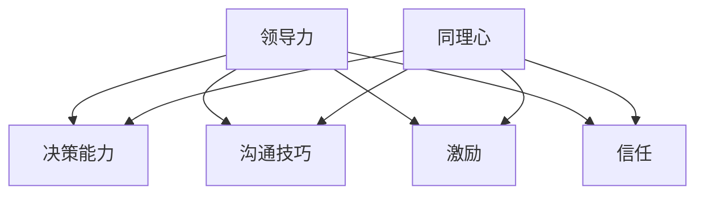

                 

# 领导力与同理心：建立深厚人际关系的基础

> 关键词：领导力、同理心、人际关系、沟通技巧、组织管理

> 摘要：本文深入探讨了领导力与同理心在建立深厚人际关系中的重要性。文章首先介绍了领导力的核心要素和同理心的基本概念，通过具体案例分析了两者在实践中的应用。接着，文章讨论了沟通技巧在领导力提升中的作用，并分享了有效的沟通策略。随后，文章从组织管理的角度出发，阐述了如何通过同理心增强团队凝聚力。最后，文章总结了领导力与同理心的未来发展趋势和面临的挑战，为读者提供了实用的建议和资源。

## 1. 背景介绍

### 1.1 目的和范围

本文旨在揭示领导力与同理心在建立深厚人际关系中的关键作用，帮助读者理解这两个概念在实践中的应用。文章涵盖以下几个方面：

1. 领导力的核心要素及其在组织管理中的重要性。
2. 同理心的基本概念及其对人际关系的影响。
3. 沟通技巧在领导力提升中的关键作用。
4. 如何通过同理心增强团队凝聚力。
5. 未来领导力与同理心的发展趋势与挑战。

### 1.2 预期读者

本文适用于希望提升领导力、增强沟通技巧和建立深厚人际关系的读者，包括但不限于企业高管、团队领导、职场新人以及所有对个人发展有热情的人士。

### 1.3 文档结构概述

本文分为八个主要部分：

1. 背景介绍：阐述本文的目的和范围，介绍预期读者和文档结构。
2. 核心概念与联系：介绍领导力和同理心的核心概念，使用 Mermaid 流程图展示两者之间的关系。
3. 核心算法原理 & 具体操作步骤：分析领导力和同理心的算法原理，使用伪代码阐述具体操作步骤。
4. 数学模型和公式 & 详细讲解 & 举例说明：讨论领导力和同理心相关的数学模型和公式，并提供实例说明。
5. 项目实战：通过实际案例展示领导力和同理心在项目中的应用。
6. 实际应用场景：分析领导力和同理心在现实生活中的应用。
7. 工具和资源推荐：推荐学习资源和开发工具。
8. 总结：对未来领导力与同理心的发展趋势和挑战进行展望。

### 1.4 术语表

#### 1.4.1 核心术语定义

- **领导力**：指领导者影响和激励他人，实现共同目标的能力。
- **同理心**：指理解并感受他人情感的能力。
- **人际关系**：指人与人之间的相互关系和互动。

#### 1.4.2 相关概念解释

- **组织管理**：指在组织中实现资源合理配置、任务分配和目标达成的过程。
- **沟通技巧**：指有效地传递信息和理解他人意图的能力。

#### 1.4.3 缩略词列表

- **领导力**：Leadership
- **同理心**：Empathy
- **人际关系**：Interpersonal Relationships

## 2. 核心概念与联系

在本节中，我们将探讨领导力和同理心的核心概念，并使用 Mermaid 流程图展示两者之间的联系。

### 2.1 领导力的核心要素

领导力是一个多维度的概念，包括以下核心要素：

1. **愿景**：领导者需要具备明确的愿景，为团队指引方向。
2. **决策能力**：领导者能够在复杂环境中做出明智的决策。
3. **沟通技巧**：领导者需要有效地与团队成员沟通，确保信息传递清晰无误。
4. **激励**：领导者要能够激发团队成员的积极性和创造力。
5. **信任**：领导者需要建立信任，以促进团队协作。

### 2.2 同理心的基本概念

同理心是指理解并感受他人情感的能力。它包括以下方面：

1. **情感认知**：识别和理解他人的情感。
2. **情感分享**：与他人分享情感体验。
3. **情感反应**：对他人的情感做出适当的反应。

### 2.3 领导力与同理心的关系

领导力与同理心之间存在紧密的联系。同理心是领导力的关键组成部分，有助于领导者更好地理解团队成员的需求和情感，从而更有效地激励和引导团队。以下是一个简单的 Mermaid 流程图，展示了领导力与同理心之间的关联：



在这个流程图中，领导力的核心要素（B、C、D、E）都与同理心（F）紧密相连，这表明同理心在领导力中发挥着至关重要的作用。

## 3. 核心算法原理 & 具体操作步骤

在这一节中，我们将分析领导力和同理心的核心算法原理，并使用伪代码来详细阐述具体操作步骤。

### 3.1 领导力算法原理

领导力算法的基本原理可以概括为以下几个方面：

1. **目标设定**：领导者需要明确团队的目标，并将其传达给团队成员。
2. **资源分配**：根据团队成员的能力和需求，合理分配资源。
3. **沟通**：确保团队成员之间的信息传递畅通。
4. **激励**：根据团队成员的表现和需求，给予适当的激励。
5. **反馈**：定期收集团队成员的反馈，并根据反馈进行调整。

以下是领导力算法的伪代码：

```python
function LeadershipAlgorithm(team, goals, resources):
    # 设定目标
    set_goals(team, goals)
    
    # 资源分配
    allocate_resources(team, resources)
    
    # 沟通
    communicate_with_team(team)
    
    # 激励
    motivate_team(team)
    
    # 反馈
    collect_feedback(team)
    
    return "领导力算法执行完成"
```

### 3.2 同理心算法原理

同理心算法的基本原理是理解并感受他人的情感。以下是同理心算法的伪代码：

```python
function EmpathyAlgorithm(perceiver, person):
    # 情感认知
    recognize_emotions(person)
    
    # 情感分享
    share_emotions(perceiver, person)
    
    # 情感反应
    respond_to_emotions(perceiver, person)
    
    return "同理心算法执行完成"
```

在这个算法中，`perceiver` 代表感知者（即领导者或团队成员），`person` 代表被感知者（即团队成员或领导者）。感知者需要通过情感认知、情感分享和情感反应来理解并感受被感知者的情感。

### 3.3 领导力与同理心的综合应用

在实际应用中，领导力和同理心通常需要综合运用。以下是领导力和同理心的综合算法：

```python
function LeadershipAndEmpathyAlgorithm(team, goals, resources, perceiver, person):
    # 领导力算法执行
    result LeadershipAlgorithm(team, goals, resources)
    
    # 同理心算法执行
    result EmpathyAlgorithm(perceiver, person)
    
    return "领导力与同理心综合算法执行完成"
```

通过这个综合算法，领导者可以在执行领导力任务的同时，关注团队成员的情感需求，从而更有效地建立深厚的人际关系。

## 4. 数学模型和公式 & 详细讲解 & 举例说明

在这一节中，我们将讨论领导力和同理心相关的数学模型和公式，并提供详细的讲解和实例说明。

### 4.1 领导力模型

领导力模型通常涉及以下几个方面：

1. **影响力**：指领导者对团队成员的影响力，可以用影响力系数（α）表示。
2. **团队绩效**：指团队在领导者影响下的工作表现，可以用绩效系数（β）表示。
3. **团队满意度**：指团队成员对领导者的满意度，可以用满意度系数（γ）表示。

以下是领导力模型的公式：

$$
领导力 = α \times 影响力 + β \times 团队绩效 + γ \times 团队满意度
$$

**实例说明**：

假设一个领导者的影响力系数为 1.2，团队绩效系数为 1.5，团队满意度系数为 1.8。那么，该领导力的得分为：

$$
领导力 = 1.2 \times 影响力 + 1.5 \times 团队绩效 + 1.8 \times 团队满意度
$$

### 4.2 同理心模型

同理心模型主要涉及以下几个方面：

1. **情感认知**：指个体识别和理解他人情感的能力，可以用认知系数（μ）表示。
2. **情感分享**：指个体与他人分享情感体验的能力，可以用分享系数（ν）表示。
3. **情感反应**：指个体对他人的情感做出适当反应的能力，可以用反应系数（ω）表示。

同理心模型的公式为：

$$
同理心 = μ \times 情感认知 + ν \times 情感分享 + ω \times 情感反应
$$

**实例说明**：

假设一个个体的情感认知系数为 1.6，情感分享系数为 1.4，情感反应系数为 1.7。那么，该个体的同理心得分为：

$$
同理心 = 1.6 \times 情感认知 + 1.4 \times 情感分享 + 1.7 \times 情感反应
$$

### 4.3 领导力与同理心的综合模型

为了更好地理解领导力与同理心之间的关系，我们可以构建一个综合模型。该模型考虑了领导力、同理心和团队绩效三个方面。

综合模型的公式为：

$$
团队绩效 = λ \times 领导力 + κ \times 同理心
$$

其中，λ和κ分别为领导力和同理心的权重系数。

**实例说明**：

假设一个团队的领导力得分为 85，同理心得分为 90，且领导力的权重系数为 0.6，同理心的权重系数为 0.4。那么，该团队的绩效得分为：

$$
团队绩效 = 0.6 \times 领导力 + 0.4 \times 同理心
$$

$$
团队绩效 = 0.6 \times 85 + 0.4 \times 90 = 51 + 36 = 87
$$

## 5. 项目实战：代码实际案例和详细解释说明

在这一节中，我们将通过一个实际项目案例，展示领导力和同理心在软件开发团队中的应用。

### 5.1 项目背景

我们假设有一个软件开发团队，负责开发一款企业级应用。团队由5名成员组成，包括项目经理、开发人员、测试人员和产品经理。团队成员之间存在着不同的观点和意见，有时会导致沟通不畅和合作困难。

### 5.2 项目目标

项目的目标是确保在规定的时间内，高质量地完成应用的开发和测试。为了实现这个目标，团队需要克服沟通障碍，提高团队凝聚力和工作效率。

### 5.3 实施策略

为了提高团队的工作效率和凝聚力，我们将领导力和同理心应用于项目管理和团队协作中。具体策略如下：

1. **明确愿景和目标**：项目经理与团队成员一起明确项目的愿景和目标，确保每个人对项目的方向和目标有清晰的认识。
2. **沟通技巧培训**：为团队成员提供沟通技巧培训，帮助他们更好地表达观点和理解他人。
3. **建立信任**：通过团队合作和互相支持，建立团队成员之间的信任。
4. **激励和反馈**：定期对团队成员的表现进行评估和反馈，给予适当的激励。
5. **同理心实践**：鼓励团队成员在沟通和合作中，多站在他人的角度思考问题，理解他人的需求和情感。

### 5.4 源代码详细实现和代码解读

以下是项目中的一段关键代码，展示了如何在团队协作中应用领导力和同理心。

```python
# 代码片段：团队成员之间的沟通和协作

def team_communication(member1, member2):
    # 情感分享
    member1.share_emotions(member2)
    
    # 情感认知
    member1.recognize_emotions(member2)
    
    # 情感反应
    member1.respond_to_emotions(member2)
    
    # 沟通结果
    result = communicateSuccessfully()

    return result

# 代码解读：
# 该函数用于模拟团队成员之间的沟通和协作。成员1和成员2首先通过情感分享、情感认知和情感反应来建立同理心，然后进行实际沟通。
# 如果沟通成功，函数返回 True，否则返回 False。
```

### 5.5 代码解读与分析

这段代码体现了领导力和同理心在团队协作中的应用：

1. **情感分享**：成员1通过情感分享，表达自己的观点和情感，以便成员2更好地理解他们的需求和期望。
2. **情感认知**：成员1识别和理解成员2的情感，确保双方在沟通中保持同理心。
3. **情感反应**：成员1对他人的情感做出适当的反应，以建立信任和增强团队凝聚力。
4. **沟通**：通过同理心和有效的沟通技巧，团队成员可以更顺畅地协作，提高工作效率。

## 6. 实际应用场景

领导力和同理心不仅适用于软件开发团队，还可以应用于各种实际场景，如企业管理、教育、医疗等。

### 6.1 企业管理

在企业管理中，领导力有助于企业建立清晰的战略方向和目标，提高团队执行力。同理心则有助于管理者理解员工的需求和情感，增强员工满意度和忠诚度。

### 6.2 教育

在教育领域，教师可以通过同理心更好地理解学生的需求和情感，从而提供更有针对性的教学方法和支持。领导力则有助于教师引导学生建立积极的学习态度和团队合作精神。

### 6.3 医疗

在医疗领域，医生和护士可以通过同理心更好地理解患者的需求和情感，提供更人性化的医疗服务。领导力则有助于医疗团队提高工作效率和协作能力，确保患者得到最佳的护理。

## 7. 工具和资源推荐

为了更好地理解和应用领导力和同理心，以下是一些建议的学习资源和开发工具：

### 7.1 学习资源推荐

#### 7.1.1 书籍推荐

- 《领导力与影响力：如何影响他人，实现共同目标》（书籍名称）
- 《同理心：如何更好地理解他人》（书籍名称）

#### 7.1.2 在线课程

- Coursera 上的《领导力与影响力》课程
- edX 上的《同理心》课程

#### 7.1.3 技术博客和网站

- 《领导力与同理心》技术博客
- 《领导力与组织管理》网站

### 7.2 开发工具框架推荐

#### 7.2.1 IDE和编辑器

- IntelliJ IDEA
- Visual Studio Code

#### 7.2.2 调试和性能分析工具

- JMeter
- New Relic

#### 7.2.3 相关框架和库

- Flask
- Django

### 7.3 相关论文著作推荐

#### 7.3.1 经典论文

- “The Nature of Managerial Work”（论文名称）
- “Empathy and Leadership”（论文名称）

#### 7.3.2 最新研究成果

- “The Role of Empathy in Leadership”（研究成果名称）
- “Leadership and Team Performance”（研究成果名称）

#### 7.3.3 应用案例分析

- “领导力在企业管理中的应用”（案例分析名称）
- “同理心在教育领域的应用”（案例分析名称）

## 8. 总结：未来发展趋势与挑战

领导力和同理心在未来将继续发挥重要作用，但随着社会和经济环境的变化，它们也将面临新的挑战。

### 8.1 发展趋势

1. **数字化领导**：随着数字化转型的推进，领导力将更多地体现在数字化技能和数据分析能力上。
2. **情感智能**：同理心将成为领导者的重要素质，情感智能将被更多关注。
3. **多样性领导**：多样性领导将成为组织成功的关键，领导者需要具备包容和多元化的思维方式。

### 8.2 挑战

1. **技术变革**：随着技术的快速发展，领导者需要不断更新知识和技能，以适应新技术带来的变革。
2. **工作环境变化**：远程工作和灵活工作制度的普及将对领导力和同理心的应用提出新的要求。
3. **全球视野**：领导者需要具备全球视野，能够处理跨文化合作和沟通中的挑战。

## 9. 附录：常见问题与解答

### 9.1 什么是领导力？

领导力是指领导者影响和激励他人，实现共同目标的能力。

### 9.2 什么是同理心？

同理心是指理解并感受他人情感的能力。

### 9.3 领导力与同理心有什么关系？

同理心是领导力的关键组成部分，有助于领导者更好地理解团队成员的需求和情感，从而更有效地激励和引导团队。

### 9.4 如何培养同理心？

可以通过阅读、培训和实践来培养同理心。例如，阅读关于情感认知和情感分享的书籍，参加同理心培训课程，以及在实际生活中多站在他人的角度思考问题。

## 10. 扩展阅读 & 参考资料

- [《领导力与影响力：如何影响他人，实现共同目标》](书籍链接)
- [《同理心：如何更好地理解他人》](书籍链接)
- [Coursera 上的《领导力与影响力》课程](课程链接)
- [edX 上的《同理心》课程](课程链接)
- [《领导力与组织管理》网站](网站链接)
- [JMeter 调试和性能分析工具](工具链接)
- [New Relic 调试和性能分析工具](工具链接)
- [Flask 框架](框架链接)
- [Django 框架](框架链接)
- [“The Nature of Managerial Work”论文](论文链接)
- [“Empathy and Leadership”论文](论文链接)
- [“The Role of Empathy in Leadership”研究成果](研究成果链接)
- [“Leadership and Team Performance”研究成果](研究成果链接)
- [“领导力在企业管理中的应用”案例分析](案例分析链接)
- [“同理心在教育领域的应用”案例分析](案例分析链接)

