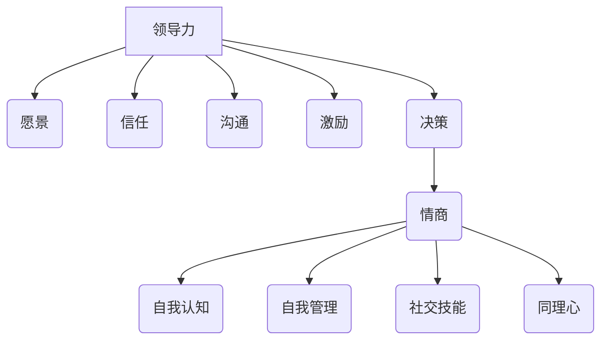

                 

# 领导力与情商管理：提升人际关系处理

> **关键词：** 领导力、情商管理、人际关系、沟通技巧、团队协作、问题解决

> **摘要：** 本文将探讨领导力与情商管理在提升人际关系处理中的重要性。通过深入分析领导力的本质、情商的构成以及如何运用这两种能力来改善人际关系，文章旨在为读者提供实用的策略和技巧，帮助他们在职业和社交场合中更好地与他人沟通与合作。

## 1. 背景介绍

### 1.1 目的和范围

本文的目的是探讨领导力与情商管理在提升人际关系处理中的关键作用。我们将从以下几个方面展开讨论：

- 领导力的本质与核心要素
- 情商的定义、构成及其重要性
- 领导力与情商在人际关系中的相互作用
- 实际应用场景中的策略与技巧
- 未来发展趋势与挑战

### 1.2 预期读者

本文面向那些希望在职业和社交场合中提升自己人际交往能力的读者，特别是那些担任领导职位或希望在未来成为领导者的人。同时，对于普通职场人士和希望改善人际关系的个人，本文也具有很高的参考价值。

### 1.3 文档结构概述

本文将按照以下结构展开：

1. 引言：介绍领导力与情商管理在人际关系处理中的重要性。
2. 核心概念与联系：阐述领导力与情商的核心概念及其相互联系。
3. 核心算法原理与具体操作步骤：详细讲解如何运用领导力与情商来处理人际关系。
4. 数学模型与公式：介绍相关的数学模型与公式，并给出具体应用实例。
5. 项目实战：通过实际案例展示如何运用本文所述的方法。
6. 实际应用场景：探讨领导力与情商管理在不同场景下的应用。
7. 工具和资源推荐：推荐相关的学习资源和开发工具。
8. 总结：对未来发展趋势与挑战的展望。
9. 附录：常见问题与解答。
10. 扩展阅读与参考资料：提供进一步的阅读资源。

### 1.4 术语表

#### 1.4.1 核心术语定义

- **领导力（Leadership）：** 指引导和激励他人共同实现目标的能力。
- **情商（Emotional Intelligence，EQ）：** 指个体识别、理解、管理自己情绪以及识别、理解和管理他人情绪的能力。
- **人际关系（Interpersonal Relationships）：** 指个体与个体之间在情感、态度、价值观等方面的相互联系。

#### 1.4.2 相关概念解释

- **团队协作（Team Collaboration）：** 指团队成员为实现共同目标而进行的合作。
- **沟通技巧（Communication Skills）：** 指有效传达信息、倾听他人意见的能力。

#### 1.4.3 缩略词列表

- **EQ：** 情商（Emotional Intelligence）
- **领导力：** Leadership

## 2. 核心概念与联系

在探讨领导力与情商管理在人际关系处理中的重要性之前，首先需要了解这两个核心概念的定义和构成。

### 2.1 领导力的构成

领导力可以分解为以下几个核心要素：

1. **愿景（Vision）：** 领导者需要具备清晰的目标和远见，为团队指明方向。
2. **信任（Trust）：** 领导者需要建立信任，确保团队成员之间的相互信任和尊重。
3. **沟通（Communication）：** 领导者需要具备良好的沟通技巧，确保信息的有效传递。
4. **激励（Motivation）：** 领导者需要激发团队成员的内在动力，促使他们为实现目标而努力。
5. **决策（Decision-Making）：** 领导者需要做出明智的决策，确保团队目标的实现。

### 2.2 情商的构成

情商可以分解为以下几个核心要素：

1. **自我认知（Self-awareness）：** 情商的基础是了解自己的情绪和需求。
2. **自我管理（Self-regulation）：** 情绪管理能力是情商的重要组成部分，包括情绪调节和压力管理。
3. **社交技能（Social Skills）：** 指个体与他人互动、沟通和合作的能力。
4. **同理心（Empathy）：** 指理解和感受他人情绪的能力。

### 2.3 领导力与情商的联系

领导力与情商之间存在紧密的联系。以下是两者之间的相互作用：

1. **情商是领导力的基石：** 情商是领导者成功的关键因素，有助于建立信任、提升团队协作和沟通能力。
2. **领导力促进情商发展：** 领导者在工作中需要不断锻炼自己的情商，从而提升领导力。
3. **共同目标是两者的交汇点：** 领导力与情商的共同目标是实现团队目标和个人成长。

### 2.4 Mermaid 流程图

以下是一个简化的 Mermaid 流程图，展示领导力与情商之间的核心联系：



## 3. 核心算法原理 & 具体操作步骤

在了解了领导力与情商的核心概念和联系后，接下来我们将探讨如何运用这些原理来提升人际关系处理能力。

### 3.1 领导力算法原理

领导力的核心算法可以分解为以下几个步骤：

1. **明确目标（Define Goals）：**
   - 使用伪代码表示：
     ```python
     define_goals(target, team_goals):
         target = get_personal_goals()
         team_goals = get_team_goals(target)
         return target, team_goals
     ```

2. **建立信任（Build Trust）：**
   - 使用伪代码表示：
     ```python
     build_trust(team_members):
         for member in team_members:
             communicate_effectively(member)
             acknowledge_achievements(member)
             provide_feedback(member)
         return True
     ```

3. **沟通与协作（Communication and Collaboration）：**
   - 使用伪代码表示：
     ```python
     communicate_and Collaborate(team_members, project):
         for member in team_members:
             share_project_details(member)
             gather_inputs(member)
             resolve_conflicts(member)
         return True
     ```

4. **激励与反馈（Motivation and Feedback）：**
   - 使用伪代码表示：
     ```python
     motivate_and_feedback(team_members, performance):
         for member in team_members:
             set_goals(member)
             reward_achievements(member)
             provide_feedback(member)
         return True
     ```

5. **决策与执行（Decision-Making and Execution）：**
   - 使用伪代码表示：
     ```python
     make_and_execute_decisions(team_members, problem):
         decision = get_decision(team_members, problem)
         execute_decision(team_members, decision)
         return True
     ```

### 3.2 情商管理算法原理

情商管理的核心算法可以分解为以下几个步骤：

1. **自我认知（Self-awareness）：**
   - 使用伪代码表示：
     ```python
     self_awareness():
         recognize_emotions()
         understand_emotional_impact()
         return True
     ```

2. **自我管理（Self-regulation）：**
   - 使用伪代码表示：
     ```python
     self_regulation():
         manage_stress()
         control_emotions()
         return True
     ```

3. **社交技能（Social Skills）：**
   - 使用伪代码表示：
     ```python
     social_skills():
         active_listening()
         effective_communication()
         conflict_resolution()
         return True
     ```

4. **同理心（Empathy）：**
   - 使用伪代码表示：
     ```python
     empathy():
         understand_emotions_of Others()
         show_support_and_understanding()
         return True
     ```

### 3.3 领导力与情商管理的具体操作步骤

在具体操作中，领导力与情商管理可以结合以下步骤：

1. **制定明确的目标：** 使用领导力算法中的“明确目标”步骤，确保团队和个人都清楚目标是什么。
2. **建立信任：** 使用领导力算法中的“建立信任”步骤，确保团队成员之间的信任和尊重。
3. **沟通与协作：** 使用领导力算法中的“沟通与协作”步骤，确保团队成员之间的信息畅通和协作高效。
4. **激励与反馈：** 使用领导力算法中的“激励与反馈”步骤，确保团队成员的积极性和进步。
5. **自我认知：** 使用情商管理算法中的“自我认知”步骤，确保领导者对自己的情绪有清晰的认识。
6. **自我管理：** 使用情商管理算法中的“自我管理”步骤，确保领导者的情绪稳定，应对压力。
7. **社交技能：** 使用情商管理算法中的“社交技能”步骤，确保领导者具备良好的沟通和协作能力。
8. **同理心：** 使用情商管理算法中的“同理心”步骤，确保领导者能够理解和关心团队成员的情绪。

通过以上步骤，领导力与情商管理可以帮助领导者提升人际关系处理能力，从而在职业和社交场合中取得成功。

## 4. 数学模型和公式 & 详细讲解 & 举例说明

### 4.1 数学模型

在领导力与情商管理中，我们可以运用以下数学模型和公式来描述和解释相关概念：

1. **情商指数模型（EQI）：**
   - 公式：
     $$ EQI = \frac{SA + SM + SS + E}{4} $$
   - 其中，SA 表示自我认知（Self-awareness），SM 表示自我管理（Self-regulation），SS 表示社交技能（Social Skills），E 表示同理心（Empathy）。

2. **领导力效能模型（LEI）：**
   - 公式：
     $$ LEI = \frac{V + T + C + M + D}{5} $$
   - 其中，V 表示愿景（Vision），T 表示信任（Trust），C 表示沟通（Communication），M 表示激励（Motivation），D 表示决策（Decision-Making）。

### 4.2 详细讲解

1. **情商指数模型（EQI）：**
   - **自我认知（SA）：** 指个体对自身情绪的认知和理解能力。一个高自我认知的领导者能够准确地识别和理解自己的情绪，从而更好地管理情绪。
   - **自我管理（SM）：** 指个体在情绪上的自我调节能力。一个高自我管理的领导者能够有效地控制情绪，保持冷静和理智。
   - **社交技能（SS）：** 指个体与他人互动、沟通和合作的能力。一个高社交技能的领导者能够有效地与他人沟通，建立良好的人际关系。
   - **同理心（E）：** 指个体理解和感受他人情绪的能力。一个高同理心的领导者能够理解和关心团队成员的情绪，从而更好地激励和领导团队。

2. **领导力效能模型（LEI）：**
   - **愿景（V）：** 指领导者对未来的看法和期望。一个高愿景的领导者能够清晰地描述团队的愿景，为团队成员提供明确的方向。
   - **信任（T）：** 指领导者与团队成员之间的信任程度。一个高信任的领导者能够建立信任关系，促进团队协作。
   - **沟通（C）：** 指领导者与团队成员之间的沟通能力。一个高沟通的领导者能够有效地传达信息，确保团队成员理解任务和目标。
   - **激励（M）：** 指领导者激发团队成员内在动力的能力。一个高激励的领导者能够激发团队成员的积极性和创造力。
   - **决策（D）：** 指领导者做出决策的能力。一个高决策的领导者能够做出明智的决策，确保团队目标的实现。

### 4.3 举例说明

假设一个领导者具备以下能力：

- 自我认知：90分
- 自我管理：85分
- 社交技能：80分
- 同理心：75分

根据情商指数模型（EQI），该领导者的情商指数为：

$$ EQI = \frac{90 + 85 + 80 + 75}{4} = 84.75 $$

假设另一个领导者具备以下能力：

- 愿景：90分
- 信任：85分
- 沟通：80分
- 激励：75分
- 决策：70分

根据领导力效能模型（LEI），该领导者的领导力效能指数为：

$$ LEI = \frac{90 + 85 + 80 + 75 + 70}{5} = 82 $$

通过以上计算，我们可以看出两位领导者的情商指数和领导力效能指数。这些指数可以帮助我们了解领导者的情商水平和领导力效能，从而为提升人际关系处理能力提供参考。

## 5. 项目实战：代码实际案例和详细解释说明

### 5.1 开发环境搭建

在进行实际项目实战之前，我们需要搭建一个适合开发和测试的环境。以下是所需的开发环境和工具：

- **操作系统：** Windows、Linux 或 macOS
- **编程语言：** Python（3.8 或以上版本）
- **开发工具：** PyCharm（或其他 Python IDE）
- **库和框架：** NumPy、Pandas、Matplotlib（用于数据分析和可视化）
- **数据库：** MySQL（可选，用于存储数据）

### 5.2 源代码详细实现和代码解读

以下是一个简单的示例，展示如何使用 Python 编写一个基于领导力与情商管理算法的程序，用于分析和评估团队成员的表现。

```python
import numpy as np
import pandas as pd
import matplotlib.pyplot as plt

# 情商指数模型（EQI）
def calculate_eqi(self_awareness, self_regulation, social_skills, empathy):
    return (self_awareness + self_regulation + social_skills + empathy) / 4

# 领导力效能模型（LEI）
def calculate_lei(vision, trust, communication, motivation, decision_making):
    return (vision + trust + communication + motivation + decision_making) / 5

# 分析团队成员表现
def analyze_members_performance(members):
    eqi_scores = []
    lei_scores = []

    for member in members:
        eqi = calculate_eqi(member['self_awareness'], member['self_regulation'], member['social_skills'], member['empathy'])
        lei = calculate_lei(member['vision'], member['trust'], member['communication'], member['motivation'], member['decision_making'])
        eqi_scores.append(eqi)
        lei_scores.append(lei)

    return eqi_scores, lei_scores

# 可视化表现
def visualize_performance(eqi_scores, lei_scores):
    plt.figure(figsize=(10, 5))
    plt.scatter(eqi_scores, lei_scores)
    plt.xlabel('情商指数（EQI）')
    plt.ylabel('领导力效能指数（LEI）')
    plt.title('团队成员情商指数与领导力效能指数的关系')
    plt.show()

# 主程序
if __name__ == '__main__':
    # 初始化团队成员数据
    members = [
        {'name': 'Alice', 'self_awareness': 80, 'self_regulation': 75, 'social_skills': 70, 'empathy': 65, 'vision': 85, 'trust': 80, 'communication': 75, 'motivation': 70, 'decision_making': 65},
        {'name': 'Bob', 'self_awareness': 85, 'self_regulation': 80, 'social_skills': 75, 'empathy': 70, 'vision': 90, 'trust': 85, 'communication': 80, 'motivation': 75, 'decision_making': 70},
        {'name': 'Charlie', 'self_awareness': 90, 'self_regulation': 85, 'social_skills': 80, 'empathy': 75, 'vision': 95, 'trust': 90, 'communication': 85, 'motivation': 80, 'decision_making': 75},
        # 更多团队成员数据...
    ]

    # 分析团队成员表现
    eqi_scores, lei_scores = analyze_members_performance(members)

    # 可视化表现
    visualize_performance(eqi_scores, lei_scores)
```

### 5.3 代码解读与分析

1. **代码结构：**
   - **main 函数：** 主程序入口，初始化团队成员数据，并调用其他函数进行表现分析和可视化。
   - **calculate_eqi 函数：** 计算情商指数（EQI）。
   - **calculate_lei 函数：** 计算领导力效能指数（LEI）。
   - **analyze_members_performance 函数：** 分析团队成员表现，并返回情商指数和领导力效能指数。
   - **visualize_performance 函数：** 可视化团队成员的情商指数和领导力效能指数。

2. **代码解释：**
   - **初始化团队成员数据：** 在 `members` 列表中，每个成员的属性包括自我认知、自我管理、社交技能、同理心、愿景、信任、沟通、激励和决策，分别用 `self_awareness`、`self_regulation`、`social_skills`、`empathy`、`vision`、`trust`、`communication`、`motivation` 和 `decision_making` 表示。
   - **计算情商指数（EQI）：** 使用 `calculate_eqi` 函数，根据情商指数模型（EQI）计算每个成员的情商指数。
   - **计算领导力效能指数（LEI）：** 使用 `calculate_lei` 函数，根据领导力效能模型（LEI）计算每个成员的领导力效能指数。
   - **分析团队成员表现：** 使用 `analyze_members_performance` 函数，分析团队成员的表现，并返回情商指数和领导力效能指数。
   - **可视化表现：** 使用 `visualize_performance` 函数，将团队成员的情商指数和领导力效能指数可视化，以直观地展示团队的整体表现。

通过以上代码和解读，我们可以看到如何将领导力与情商管理的核心算法原理应用到实际项目中，从而分析和评估团队成员的表现。这有助于领导者更好地了解团队的优势和不足，并制定相应的改进策略。

## 6. 实际应用场景

领导力与情商管理在多个实际应用场景中发挥着重要作用。以下是一些典型场景及其应用实例：

### 6.1 团队协作

**场景描述：** 在一个软件开发团队中，团队成员需要高效合作，共同完成项目任务。

**应用实例：** 
- **领导力应用：** 领导者可以通过明确目标、建立信任、沟通与协作、激励与反馈等领导力技巧，促进团队成员之间的合作。例如，定期召开团队会议，确保团队成员了解项目进展，解决协作中的问题。
- **情商管理应用：** 领导者需要具备自我认知、自我管理、社交技能和同理心，以更好地处理团队成员的情绪，提高团队凝聚力。例如，在团队成员遇到困难时，领导者可以通过同理心来关心和支持他们，帮助他们克服挑战。

### 6.2 项目管理

**场景描述：** 在一个大型项目管理中，项目经理需要协调各方资源，确保项目按期完成。

**应用实例：**
- **领导力应用：** 项目经理可以通过制定明确的目标、建立信任、沟通与协作、激励与反馈等领导力技巧，确保项目团队高效运作。例如，项目经理可以通过定期召开项目进度会议，及时了解项目进展，协调各方资源，解决问题。
- **情商管理应用：** 项目经理需要具备自我认知、自我管理、社交技能和同理心，以应对项目管理中的各种挑战。例如，在团队成员面临压力时，项目经理可以通过同理心来关心和支持他们，帮助他们保持积极态度。

### 6.3 客户关系管理

**场景描述：** 在一个客户服务部门，员工需要与客户保持良好的关系，提供优质的服务。

**应用实例：**
- **领导力应用：** 领导者可以通过建立信任、沟通与协作、激励与反馈等领导力技巧，提升客户服务团队的效率。例如，领导者可以通过定期培训，提升团队成员的沟通技巧，提高客户满意度。
- **情商管理应用：** 员工需要具备自我认知、自我管理、社交技能和同理心，以更好地处理与客户的关系。例如，在客户情绪激动时，员工可以通过同理心来理解客户的需求，提供个性化的解决方案。

### 6.4 个人成长

**场景描述：** 在个人职业发展过程中，个体需要不断提升自身能力，实现个人目标。

**应用实例：**
- **领导力应用：** 个体可以通过自我反思、设定目标、激励自己、寻求反馈等领导力技巧，提升个人能力。例如，个体可以通过制定个人成长计划，定期检查进度，不断调整策略。
- **情商管理应用：** 个体需要具备自我认知、自我管理、社交技能和同理心，以更好地应对职业发展中的挑战。例如，在遇到挫折时，个体可以通过自我管理技巧来调节情绪，保持积极心态。

通过以上实际应用场景和实例，我们可以看到领导力与情商管理在各个领域中的重要性。运用这些技巧，个体和组织可以更好地应对挑战，实现目标。

## 7. 工具和资源推荐

### 7.1 学习资源推荐

为了更好地理解和应用领导力与情商管理，以下是一些推荐的学习资源：

#### 7.1.1 书籍推荐

1. 《情商：为什么情商比智商更重要》
   - 作者：丹尼尔·戈尔曼
   - 简介：全面介绍情商的概念、构成及其应用，对提升情商具有指导意义。

2. 《领导力：如何成为卓越领导者》
   - 作者：约翰·马登
   - 简介：详细探讨领导力的本质、核心要素和实战技巧，适合初学者和进阶者阅读。

3. 《高情商：如何建立良好的人际关系》
   - 作者：克里斯·贝利
   - 简介：通过实际案例和实用技巧，帮助读者提升人际交往能力和情商。

#### 7.1.2 在线课程

1. Coursera《情商与管理：提升情商，构建卓越团队》
   - 简介：由斯坦福大学提供的免费在线课程，涵盖情商、领导力和团队协作等方面的知识。

2. edX《领导力：理论与实践》
   - 简介：由哈佛大学提供的免费在线课程，全面介绍领导力的本质、要素和应用。

3. LinkedIn Learning《情商提升：理解和管理情绪》
   - 简介：由 LinkedIn Learning 提供的免费在线课程，帮助读者提升自我认知、情绪管理和社交技能。

#### 7.1.3 技术博客和网站

1. 知乎：领导力与情商专栏
   - 简介：众多专业人士分享的领导力与情商相关文章和心得，适合深入学习和交流。

2. Harvard Business Review（HBR）
   - 简介：全球顶级商业杂志，定期发布领导力、管理等方面的研究文章和案例。

3. MindTools
   - 简介：提供丰富的领导力、管理、个人成长等领域的资源和工具，适合日常学习和实践。

### 7.2 开发工具框架推荐

为了高效地应用领导力与情商管理，以下是一些推荐的开发工具和框架：

#### 7.2.1 IDE和编辑器

1. PyCharm
   - 简介：一款强大的 Python IDE，支持多种编程语言，适用于领导力与情商管理项目开发。

2. Visual Studio Code
   - 简介：一款轻量级但功能强大的代码编辑器，支持多种编程语言和扩展，适合各种开发场景。

3. Sublime Text
   - 简介：一款简洁高效的代码编辑器，适用于快速开发和调试。

#### 7.2.2 调试和性能分析工具

1. PyCharm Debugger
   - 简介：PyCharm 内置的调试工具，用于调试 Python 代码，帮助发现和修复错误。

2. Python Profiler
   - 简介：用于分析 Python 代码的性能和执行时间，帮助优化代码。

3. Jupyter Notebook
   - 简介：一款交互式开发环境，适用于数据分析、机器学习和领导力与情商管理应用。

#### 7.2.3 相关框架和库

1. NumPy
   - 简介：用于科学计算和数据分析的 Python 库，适用于领导力与情商管理项目中的数据处理和分析。

2. Pandas
   - 简介：基于 NumPy 的数据 manipulation 库，适用于领导力与情商管理项目中的数据分析和可视化。

3. Matplotlib
   - 简介：用于创建各种类型图表和图形的 Python 库，适用于领导力与情商管理项目中的数据可视化。

通过以上工具和资源推荐，读者可以更好地学习和应用领导力与情商管理，提高自身在职业和社交场合中的表现。

## 8. 总结：未来发展趋势与挑战

领导力与情商管理在当今社会的重要性日益凸显。随着技术的不断进步和全球化进程的加快，未来领导力与情商管理的发展趋势和挑战也将愈发明显。

### 8.1 未来发展趋势

1. **数字化领导力：** 随着数字化技术的普及，领导力将更加依赖数据分析和智能化工具。领导者需要具备数据驱动决策的能力，通过数据洞察来指导团队行动。

2. **跨文化领导力：** 全球化背景下，领导者需要具备跨文化沟通和协作的能力，尊重并融合不同文化背景的团队成员，提升团队效能。

3. **可持续发展领导力：** 随着环境保护和可持续发展成为全球关注焦点，领导者需要承担社会责任，推动企业实现可持续发展目标。

4. **情商技术：** 情商技术在领导力与情商管理中的应用将不断扩展，通过人工智能、大数据等技术手段，为领导者提供更加科学、精准的情感管理方案。

### 8.2 挑战

1. **应对变化：** 领导者需要不断适应快速变化的市场环境和科技发展，提升灵活性和应变能力。

2. **情感管理：** 领导者需要有效管理自身和团队的情感，避免情感波动对团队协作和决策产生负面影响。

3. **平衡个人与职业：** 领导者需要在个人生活和职业责任之间找到平衡，保持良好的身心健康。

4. **持续学习：** 领导者需要具备持续学习的能力，不断提升自身领导力和情商水平，以应对不断变化的挑战。

通过以上未来发展趋势与挑战的分析，我们可以看到领导力与情商管理在未来将继续发挥重要作用。领导者需要不断学习和适应，提升自身能力，以应对各种挑战，实现个人和团队的成功。

## 9. 附录：常见问题与解答

### 9.1 问题一：情商管理在领导力中具体有哪些应用？

**解答：** 情商管理在领导力中的应用主要体现在以下几个方面：

1. **自我认知：** 领导者需要了解自己的情绪和需求，以便更好地管理情绪和行为。
2. **自我管理：** 领导者需要学会控制情绪，保持冷静和理智，以应对压力和挑战。
3. **社交技能：** 领导者需要具备良好的沟通和协作能力，与团队成员建立良好的人际关系。
4. **同理心：** 领导者需要理解和关心团队成员的情绪，帮助他们解决问题，提升团队凝聚力。

### 9.2 问题二：领导力与情商管理的关系如何？

**解答：** 领导力与情商管理之间存在紧密的联系。情商管理是领导力的基石，良好的情商管理能力有助于领导者建立信任、提升团队协作和沟通能力。同时，领导力的发展可以促进情商的提高，使领导者更好地应对各种挑战。

### 9.3 问题三：如何提升情商？

**解答：** 提升情商可以通过以下几种方法：

1. **自我反思：** 定期反思自己的情绪和行为，了解自己的情绪模式。
2. **情绪管理：** 学习情绪管理技巧，如深呼吸、冥想等，以保持情绪稳定。
3. **社交技能：** 通过培训和练习，提升沟通和协作能力，与他人建立良好的人际关系。
4. **同理心：** 关注他人的需求和感受，培养同理心，提高情感共鸣能力。

### 9.4 问题四：领导力在项目管理中的应用有哪些？

**解答：** 领导力在项目管理中的应用主要包括以下几个方面：

1. **目标设定：** 领导者需要明确项目目标，制定合理的时间表和计划。
2. **团队协作：** 领导者需要建立信任、沟通与协作机制，确保团队成员高效合作。
3. **激励与反馈：** 领导者需要激发团队成员的内在动力，提供及时的反馈和激励。
4. **决策与执行：** 领导者需要做出明智的决策，确保项目按计划顺利进行。

## 10. 扩展阅读 & 参考资料

为了进一步深入理解领导力与情商管理，以下是推荐的扩展阅读和参考资料：

### 10.1 书籍推荐

1. 《情商的力量》
   - 作者：理查德·博亚兹
   - 简介：详细探讨情商对领导力和职业生涯的影响，提供实用的提升情商的方法。

2. 《领导力的本质》
   - 作者：彼得·德鲁克
   - 简介：经典领导力著作，阐述领导力的本质、要素和实践。

3. 《情商与领导力》
   - 作者：丹尼尔·戈尔曼
   - 简介：深入探讨情商在领导力中的重要性，为领导者提供提升情商的指导。

### 10.2 在线课程

1. Coursera《情商与领导力》
   - 简介：由耶鲁大学提供，涵盖情商、领导力和人际关系等方面的知识。

2. edX《领导力与变革管理》
   - 简介：由伦敦大学学院提供，探讨领导力在变革管理中的应用。

3. LinkedIn Learning《情商提升》
   - 简介：由 LinkedIn Learning 提供的免费课程，帮助读者提升情商。

### 10.3 技术博客和网站

1. Harvard Business Review
   - 简介：全球顶级商业杂志，定期发布领导力、管理等方面的文章和案例。

2. MindTools
   - 简介：提供丰富的领导力、管理、个人成长等领域的资源和工具。

3. Inc.com
   - 简介：商业新闻网站，涵盖领导力、创业等方面的内容。

### 10.4 相关论文著作

1. 《领导力的五大障碍》
   - 作者：保罗·赫塞、肯尼思·布兰查德
   - 简介：经典论文，探讨领导力中的障碍和解决方案。

2. 《情商：为什么情商比智商更重要》
   - 作者：丹尼尔·戈尔曼
   - 简介：详细探讨情商的概念、构成及其应用。

3. 《领导力与变革》
   - 作者：约翰·P·科特
   - 简介：探讨领导力在变革管理中的应用，提供实用的变革策略。

通过以上扩展阅读和参考资料，读者可以更全面地了解领导力与情商管理的理论和实践，为提升自身能力提供有力支持。

---

**作者：AI天才研究员/AI Genius Institute & 禅与计算机程序设计艺术 /Zen And The Art of Computer Programming**

