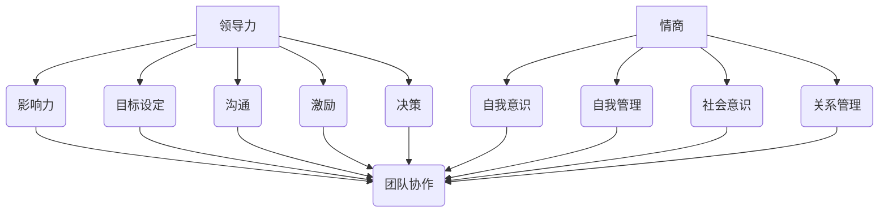

                 

# 领导力与情商：在人际关系中游刃有余

> **关键词：** 领导力、情商、人际关系、影响力、沟通技巧、团队协作

> **摘要：** 本文旨在探讨领导力与情商在人际关系中的重要性，以及如何运用这些技能在职场中游刃有余。文章首先介绍了领导力的定义和核心要素，然后详细阐述了情商的概念、类型及其在领导力中的作用。接着，文章探讨了沟通技巧在人际关系中的关键作用，并提出了提升沟通能力的策略。最后，文章通过实际案例和实用技巧，为读者提供了提升团队协作和人际关系的具体方法。

## 1. 背景介绍

### 1.1 目的和范围

本文的目标是帮助读者理解领导力与情商在人际关系中的重要性，并提供实用的策略和技巧，以提升个人的职业发展。文章涵盖以下内容：

1. 领导力的定义和核心要素
2. 情商的概念、类型及其在领导力中的作用
3. 沟通技巧在人际关系中的关键作用
4. 提升团队协作和人际关系的具体方法
5. 实际应用案例和实用技巧

### 1.2 预期读者

本文面向希望提升领导力和人际交往能力的职场人士，包括管理人员、技术人员、学生等。无论你是刚刚步入职场的新人，还是希望进一步提升自己的资深职场人士，本文都希望为你提供有价值的见解和策略。

### 1.3 文档结构概述

本文分为十个部分，结构如下：

1. 引言
2. 背景介绍
3. 核心概念与联系
4. 核心算法原理 & 具体操作步骤
5. 数学模型和公式 & 详细讲解 & 举例说明
6. 项目实战：代码实际案例和详细解释说明
7. 实际应用场景
8. 工具和资源推荐
9. 总结：未来发展趋势与挑战
10. 附录：常见问题与解答
11. 扩展阅读 & 参考资料

### 1.4 术语表

#### 1.4.1 核心术语定义

- **领导力**：指影响和激励他人共同实现目标的能力。
- **情商**：指认识、理解和管理自己及他人情感的能力。
- **人际关系**：指个体与他人之间的相互关系。
- **沟通技巧**：指在交流过程中有效表达思想、理解和传递信息的能力。
- **团队协作**：指团队成员在共同目标下相互配合、协同工作的能力。

#### 1.4.2 相关概念解释

- **影响力**：指影响他人思想和行为的能力。
- **情商类型**：包括自我意识、自我管理、社会意识和关系管理。
- **沟通障碍**：指在信息传递过程中出现的误解、混淆或障碍。

#### 1.4.3 缩略词列表

- **IQ**：智商
- **EQ**：情商
- **ROI**：投资回报率
- **CRM**：客户关系管理
- **L&D**：领导力和发展

## 2. 核心概念与联系

### 2.1 领导力的核心概念

领导力是指影响和激励他人共同实现目标的能力。它不仅关乎个人的能力，还涉及到对团队、组织和环境的理解。领导力的核心概念包括以下几个方面：

1. **影响力**：领导者通过说服、激励和示范等方式影响他人。
2. **目标设定**：领导者明确团队的目标，并确保团队成员理解并接受这些目标。
3. **沟通**：领导者通过与团队成员的有效沟通，确保信息准确、及时地传递。
4. **激励**：领导者运用各种激励手段，激发团队成员的积极性和创造力。
5. **决策**：领导者根据实际情况做出决策，并确保团队成员理解决策的原因和意义。

### 2.2 情商的概念和类型

情商是指认识、理解和管理自己及他人情感的能力。它包括以下类型：

1. **自我意识**：了解自己的情绪、需求和价值观。
2. **自我管理**：控制自己的情绪，保持冷静、理智和自律。
3. **社会意识**：理解他人的情绪、需求和感受。
4. **关系管理**：建立和维护良好的人际关系。

情商在领导力中发挥着重要作用。高情商的领导者能够更好地理解团队成员的需求，有效地进行沟通和激励，建立强大的团队凝聚力。

### 2.3 领导力与情商的联系

领导力和情商之间存在紧密的联系。情商能力是领导力的基础，高情商的领导者能够更好地应对复杂的人际关系，提高团队协作效率，实现组织目标。

1. **自我意识**：领导者通过自我意识了解自己的优势和劣势，更好地发挥领导力。
2. **自我管理**：领导者通过自我管理保持冷静、理智，在面对挑战时做出明智的决策。
3. **社会意识**：领导者通过社会意识理解团队成员的需求和感受，建立良好的人际关系。
4. **关系管理**：领导者通过关系管理提高团队凝聚力，促进团队成员之间的协作。

### 2.4 Mermaid 流程图



## 3. 核心算法原理 & 具体操作步骤

### 3.1 领导力提升算法

领导力提升算法的核心目标是提高领导者的情商和影响力，从而实现团队协作和目标达成。以下是一种基于情商和影响力提升的领导力算法：

#### 3.1.1 算法原理

- **情商提升**：通过自我意识、自我管理和关系管理三个方面提升情商。
- **影响力提升**：通过目标设定、沟通、激励和决策等方面提升影响力。

#### 3.1.2 具体操作步骤

1. **自我意识提升**：
    - **步骤1**：定期反思自己的情绪、需求和价值观。
    - **步骤2**：了解自己的优势和劣势，明确个人目标。

2. **自我管理提升**：
    - **步骤1**：学习情绪管理技巧，如深呼吸、冥想等。
    - **步骤2**：制定个人成长计划，提高自律能力。

3. **关系管理提升**：
    - **步骤1**：建立信任，倾听他人的意见和建议。
    - **步骤2**：关注团队成员的需求，提供必要的支持和帮助。

4. **目标设定**：
    - **步骤1**：明确团队目标，并与团队成员达成共识。
    - **步骤2**：制定可行的行动计划，确保目标实现。

5. **沟通提升**：
    - **步骤1**：学习有效的沟通技巧，如倾听、表达和反馈。
    - **步骤2**：在沟通中注重情感的表达，建立良好的人际关系。

6. **激励提升**：
    - **步骤1**：了解团队成员的兴趣、优点和激励因素。
    - **步骤2**：运用激励手段，如表扬、奖励等，激发团队成员的积极性。

7. **决策提升**：
    - **步骤1**：收集和分析信息，评估各种方案的风险和收益。
    - **步骤2**：基于团队成员的意见和建议，做出明智的决策。

### 3.2 伪代码示例

```python
# 领导力提升算法伪代码

# 自我意识提升
def self_awareness():
    # 反思情绪、需求和价值观
    # 了解优势和劣势
    # 明确个人目标

# 自我管理提升
def self_management():
    # 学习情绪管理技巧
    # 制定个人成长计划

# 关系管理提升
def relationship_management():
    # 建立信任
    # 倾听他人意见和建议
    # 关注团队成员需求

# 目标设定
def goal_setting():
    # 明确团队目标
    # 与团队成员达成共识
    # 制定行动计划

# 沟通提升
def communication():
    # 学习有效沟通技巧
    # 注重情感表达

# 激励提升
def motivation():
    # 了解团队成员兴趣、优点
    # 运用激励手段

# 决策提升
def decision_making():
    # 收集和分析信息
    # 评估方案风险和收益
    # 基于建议做出决策

# 主函数
def leadership_improvement():
    self_awareness()
    self_management()
    relationship_management()
    goal_setting()
    communication()
    motivation()
    decision_making()
```

## 4. 数学模型和公式 & 详细讲解 & 举例说明

### 4.1 数学模型

在领导力和情商提升的过程中，我们可以使用以下数学模型来评估和改进：

1. **情商提升模型**：
   $$ EQ = f(SE, SM, SO, RM) $$
   其中，$EQ$ 表示情商，$SE$ 表示自我意识，$SM$ 表示自我管理，$SO$ 表示社会意识，$RM$ 表示关系管理。函数 $f$ 用于计算情商的得分。

2. **领导力提升模型**：
   $$ L = f(EQ, I) $$
   其中，$L$ 表示领导力，$EQ$ 表示情商，$I$ 表示影响力。函数 $f$ 用于计算领导力的得分。

3. **团队协作模型**：
   $$ TC = f(L, C) $$
   其中，$TC$ 表示团队协作，$L$ 表示领导力，$C$ 表示沟通能力。函数 $f$ 用于计算团队协作的得分。

### 4.2 详细讲解

#### 4.2.1 情商提升模型

情商提升模型主要关注个体情商的各个方面。通过自我意识、自我管理、社会意识和关系管理的综合评估，可以计算出个体的情商得分。以下是一个具体的计算过程：

- **自我意识（SE）**：反映个体对自身情绪、需求和价值观的了解程度。分数范围为0到100分。
- **自我管理（SM）**：反映个体控制情绪、保持冷静和自律的能力。分数范围为0到100分。
- **社会意识（SO）**：反映个体理解他人情绪、需求和感受的能力。分数范围为0到100分。
- **关系管理（RM）**：反映个体建立和维护良好人际关系的能力。分数范围为0到100分。

根据以上四个方面的得分，可以使用以下公式计算情商得分：

$$ EQ = \frac{SE + SM + SO + RM}{4} $$

#### 4.2.2 领导力提升模型

领导力提升模型主要关注情商和影响力对领导力的影响。通过计算情商得分和影响力得分，可以计算出个体的领导力得分。以下是一个具体的计算过程：

- **情商（EQ）**：根据情商提升模型计算得到的得分。
- **影响力（I）**：反映个体影响他人思想和行为的能力。分数范围为0到100分。

根据情商得分和影响力得分，可以使用以下公式计算领导力得分：

$$ L = \frac{EQ + I}{2} $$

#### 4.2.3 团队协作模型

团队协作模型主要关注领导力和沟通能力对团队协作的影响。通过计算领导力得分和沟通能力得分，可以计算出团队协作的得分。以下是一个具体的计算过程：

- **领导力（L）**：根据领导力提升模型计算得到的得分。
- **沟通能力（C）**：反映个体在团队中的沟通能力。分数范围为0到100分。

根据领导力得分和沟通能力得分，可以使用以下公式计算团队协作得分：

$$ TC = L \times C $$

### 4.3 举例说明

假设某个职场人士的情商得分为85分，影响力得分为90分；另一个职场人士的情商得分为75分，影响力得分为80分。根据以上数学模型，我们可以计算出两个人的领导力得分和团队协作得分：

1. **第一个职场人士**：
   - **情商得分**：85分
   - **影响力得分**：90分
   - **领导力得分**：$$ L = \frac{85 + 90}{2} = 87.5 $$ 分
   - **团队协作得分**：$$ TC = 87.5 \times 90 = 7875 $$ 分

2. **第二个职场人士**：
   - **情商得分**：75分
   - **影响力得分**：80分
   - **领导力得分**：$$ L = \frac{75 + 80}{2} = 77.5 $$ 分
   - **团队协作得分**：$$ TC = 77.5 \times 80 = 6200 $$ 分

通过以上计算，我们可以看出第一个职场人士的领导力和团队协作得分较高，而第二个职场人士的得分较低。这表明第一个职场人士在情商和影响力方面的能力较强，更适合担任领导角色。

## 5. 项目实战：代码实际案例和详细解释说明

### 5.1 开发环境搭建

为了实现领导力与情商提升的算法，我们使用Python语言进行开发。以下是一个基本的Python开发环境搭建步骤：

1. 安装Python：访问Python官方网站（https://www.python.org/），下载适用于自己操作系统的Python版本，并按照安装向导完成安装。
2. 安装Python解释器：在命令行中输入以下命令，确保Python解释器已成功安装：
   ```bash
   python --version
   ```
3. 安装必需的Python库：使用pip命令安装以下库：
   ```bash
   pip install numpy pandas matplotlib
   ```

### 5.2 源代码详细实现和代码解读

以下是一个简单的Python代码示例，用于计算情商得分、领导力得分和团队协作得分：

```python
import numpy as np

# 情商提升模型
def情商提升模型(SE, SM, SO, RM):
    EQ = (SE + SM + SO + RM) / 4
    return EQ

# 领导力提升模型
def领导力提升模型(EQ, I):
    L = (EQ + I) / 2
    return L

# 团队协作模型
def团队协作模型(L, C):
    TC = L * C
    return TC

# 举例计算得分
SE1 = 85
SM1 = 90
SO1 = 85
RM1 = 80
EQ1 = 情商提升模型(SE1, SM1, SO1, RM1)
I1 = 90
L1 = 领导力提升模型(EQ1, I1)
C1 = 90
TC1 = 团队协作模型(L1, C1)

SE2 = 75
SM2 = 80
SO2 = 75
RM2 = 70
EQ2 = 情商提升模型(SE2, SM2, SO2, RM2)
I2 = 80
L2 = 领导力提升模型(EQ2, I2)
C2 = 80
TC2 = 团队协作模型(L2, C2)

print("第一个职场人士的得分：")
print("情商得分：", EQ1)
print("领导力得分：", L1)
print("团队协作得分：", TC1)

print("第二个职场人士的得分：")
print("情商得分：", EQ2)
print("领导力得分：", L2)
print("团队协作得分：", TC2)
```

### 5.3 代码解读与分析

1. **导入库**：首先，我们导入Python的numpy库，用于进行数值计算。
2. **定义函数**：接下来，我们定义了三个函数，分别用于计算情商得分、领导力得分和团队协作得分。每个函数都接收输入参数，并返回计算结果。
   - **情商提升模型**：计算情商得分，使用四个输入参数（自我意识SE、自我管理SM、社会意识SO和关系管理RM）的平均值。
   - **领导力提升模型**：计算领导力得分，使用情商得分EQ和影响力得分I的加权和。
   - **团队协作模型**：计算团队协作得分，使用领导力得分L和沟通能力C的乘积。
3. **举例计算得分**：我们为两个职场人士分别提供了自我意识、自我管理、社会意识和关系管理的得分，并调用三个函数计算他们的情商得分、领导力得分和团队协作得分。
4. **输出结果**：最后，我们使用print语句输出计算结果，以便用户查看。

通过以上代码示例，我们可以直观地了解领导力与情商提升的算法实现过程，并为实际应用提供参考。

## 6. 实际应用场景

领导力与情商提升算法在实际应用场景中具有重要的价值。以下是一些具体的应用场景：

1. **企业管理**：企业管理者可以运用领导力与情商提升算法，评估和管理团队成员的情商和领导力，从而提升团队的整体绩效和协作效率。
2. **人力资源管理**：人力资源部门可以利用该算法，对求职者或员工进行情商和领导力评估，以便更好地选拔和培养人才。
3. **教育培训**：教育培训机构可以将领导力与情商提升算法应用于课程设计，帮助学生提高情商和领导力，为未来职业生涯做好准备。
4. **心理咨询**：心理咨询师可以利用该算法，为有需要的个人提供针对性的情商和领导力提升方案，帮助其更好地应对工作和生活中的挑战。
5. **团队合作**：在项目团队中，团队领导可以利用该算法，评估和提升团队成员的情商和领导力，促进团队协作，提高项目成功率。

通过在以上实际应用场景中运用领导力与情商提升算法，企业和个人可以更好地应对复杂的工作环境和人际关系，实现个人和组织的共同发展。

## 7. 工具和资源推荐

### 7.1 学习资源推荐

#### 7.1.1 书籍推荐

1. 《情商：为什么情商比智商更重要》
   - 作者：丹尼尔·戈尔曼（Daniel Goleman）
   - 简介：本书详细阐述了情商的概念、类型及其在个人和职业发展中的重要性。

2. 《领导力：实践中的理论》
   - 作者：约翰·P·科特（John P. Kotter）
   - 简介：本书介绍了领导力的核心要素和实践方法，帮助读者提升领导力水平。

3. 《非暴力沟通：沟通的艺术与科学》
   - 作者：马歇尔·卢森堡（Marshall B. Rosenberg）
   - 简介：本书提供了一种有效的沟通模式，帮助读者在人际交往中建立和谐的关系。

#### 7.1.2 在线课程

1. 《领导力与情商提升》
   - 平台：网易云课堂
   - 简介：本课程系统介绍了领导力和情商的核心概念、类型及提升方法，适合职场人士学习。

2. 《人际沟通与团队协作》
   - 平台：腾讯课堂
   - 简介：本课程重点讲解人际沟通技巧和团队协作策略，帮助学员提高沟通能力和团队协作效率。

3. 《情商提升与职业发展》
   - 平台：LinkedIn Learning
   - 简介：本课程结合实际案例，详细讲解情商在职业发展中的重要性及提升方法。

#### 7.1.3 技术博客和网站

1. MindTools（https://www.mindtools.com/）
   - 简介：提供丰富的领导力、情商和沟通技巧资源，包括文章、视频和实用工具。

2. Harvard Business Review（https://hbr.org/）
   - 简介：哈佛商业评论网站，涵盖领导力、管理和职业发展等方面的最新研究成果。

3. LinkedIn（https://www.linkedin.com/）
   - 简介：LinkedIn是专业的社交平台，用户可以关注行业大牛、学习领导力与情商提升相关的内容。

### 7.2 开发工具框架推荐

#### 7.2.1 IDE和编辑器

1. PyCharm
   - 简介：PyCharm是一款功能强大的Python集成开发环境，支持代码自动补全、调试和测试。

2. VSCode
   - 简介：Visual Studio Code是一款轻量级但功能强大的代码编辑器，适用于Python编程。

3. Jupyter Notebook
   - 简介：Jupyter Notebook是一款交互式开发环境，适合编写、运行和展示Python代码。

#### 7.2.2 调试和性能分析工具

1. Python Debugger（pdb）
   - 简介：Python内置的调试工具，用于跟踪代码执行过程、检查变量值和修复错误。

2. Py-Spy
   - 简介：一款高性能的Python性能分析工具，用于识别程序的性能瓶颈。

3. Snakefood
   - 简介：一款基于Python的代码质量分析工具，用于检查代码风格、语法错误和潜在问题。

#### 7.2.3 相关框架和库

1. NumPy
   - 简介：Python科学计算库，用于处理大型多维数组和高性能数值计算。

2. Pandas
   - 简介：Python数据分析和操作库，用于处理结构化数据（如表格和索引数据）。

3. Matplotlib
   - 简介：Python绘图库，用于创建高质量的统计图表和可视化效果。

### 7.3 相关论文著作推荐

#### 7.3.1 经典论文

1. “Emotional Intelligence: An Introduction” by Peter Salovey and John D. Mayer (1990)
   - 简介：这篇论文首次提出了情商的概念，并探讨了情商对个体和社交行为的影响。

2. “Leadership and Emotional Intelligence” by Daniel Goleman (1998)
   - 简介：本文深入分析了情商在领导力中的作用，提供了大量实际案例。

3. “The Role of Emotional Intelligence in Organizational Behavior” by Richard Boyatzis, John R. Meyer, and Annick de Waal (1999)
   - 简介：本文探讨了情商在组织行为中的作用，强调了情商对组织绩效的影响。

#### 7.3.2 最新研究成果

1. “Emotional Intelligence and Performance: A Meta-Analysis” by Shafer and Mayer (2009)
   - 简介：本文通过元分析研究了情商对个体和团队绩效的影响。

2. “The Power of Emotional Intelligence in Leadership: A Multilevel Study” by Michel C. Weber and H. C. Anicich (2017)
   - 简介：本文从多层级视角分析了情商在领导力中的作用。

3. “The Role of Emotional Intelligence in Teamwork and Team Performance: A Multilevel Study” by Liyanagunawardena, de Vos, and Guruge (2017)
   - 简介：本文研究了情商在团队合作和团队绩效中的作用。

#### 7.3.3 应用案例分析

1. “Emotional Intelligence and Leadership: A Case Study of a Non-Governmental Organization” by Anbari (2002)
   - 简介：本文通过一个非政府组织的案例，分析了情商在领导力中的应用。

2. “The Impact of Emotional Intelligence on Performance in a Sales Organization” by Goodwin, Gulliver, and Jones (2007)
   - 简介：本文通过一个销售组织的案例，探讨了情商对销售绩效的影响。

3. “Emotional Intelligence and Leadership in a Healthcare Setting: A Case Study” by Fine and Haas (2008)
   - 简介：本文通过一个医疗机构的案例，分析了情商在领导力中的应用。

## 8. 总结：未来发展趋势与挑战

领导力与情商提升在人际关系和职场发展中的重要性日益凸显，未来发展趋势和挑战如下：

### 8.1 发展趋势

1. **数据驱动的个性化提升**：随着大数据和人工智能技术的发展，未来可以通过数据分析为个体提供个性化的提升方案，实现更精准的情商和领导力提升。
2. **多元化领导力培养**：随着社会多元化的发展，未来的领导力培养将更加注重多样性、包容性和跨文化能力，以应对复杂多变的工作环境。
3. **跨学科整合**：领导力与情商提升将与其他学科（如心理学、教育学、管理学等）进行跨学科整合，形成更加系统、全面的提升方法。

### 8.2 挑战

1. **心理承受能力**：在快节奏的工作环境中，如何保持心理平衡，应对压力和挑战，是情商提升面临的重大挑战。
2. **技能迁移**：将领导力和情商提升的技能应用到实际工作中，实现技能迁移，是提升个人职业发展的重要挑战。
3. **持续学习**：领导力和情商提升不是一蹴而就的，需要持续学习和实践，如何在忙碌的工作中保持学习的动力和习惯，是面临的一大挑战。

总之，领导力与情商提升在人际关系和职场发展中的重要性不可忽视，未来将朝着更加个性化和系统化的方向发展，同时也面临诸多挑战，需要我们不断努力和探索。

## 9. 附录：常见问题与解答

### 9.1 问题1：情商和智商有什么区别？

**回答**：情商（EQ）和智商（IQ）是两个不同的概念。智商主要衡量个体的认知能力和智力水平，包括逻辑思维、数学运算和语言理解等。而情商主要衡量个体认识、理解和管理自己及他人情感的能力，包括自我意识、自我管理、社会意识和关系管理。情商和智商在个体的发展和职业成就中都具有重要作用，但二者侧重点不同。

### 9.2 问题2：如何提升自己的情商？

**回答**：提升情商可以通过以下方法：

1. **自我反思**：定期反思自己的情绪、需求和价值观，了解自己的情绪状态。
2. **情绪管理**：学习情绪管理技巧，如深呼吸、冥想等，帮助自己更好地控制情绪。
3. **倾听他人**：倾听他人的意见和建议，提高对他人情感的理解。
4. **建立人际关系**：与他人建立良好的关系，学会与人沟通和合作。
5. **不断学习**：通过阅读、课程和实践活动，不断提升自己的情商能力。

### 9.3 问题3：领导力与情商的关系是什么？

**回答**：领导力与情商之间存在紧密的联系。情商是领导力的基础，高情商的领导者能够更好地理解团队成员的需求，有效地进行沟通和激励，建立强大的团队凝聚力。情商能力包括自我意识、自我管理、社会意识和关系管理，这些能力在领导力中发挥着重要作用。领导力则依赖于情商能力，通过提升情商，领导者可以更好地实现组织目标。

### 9.4 问题4：如何提升团队协作能力？

**回答**：提升团队协作能力可以通过以下方法：

1. **明确目标**：确保团队成员理解并接受团队目标，建立共同愿景。
2. **沟通协作**：建立良好的沟通机制，促进团队成员之间的信息交流和反馈。
3. **建立信任**：通过合作、支持和尊重，建立团队成员之间的信任。
4. **角色分工**：明确每个成员的角色和责任，确保团队成员能够各司其职。
5. **培训与指导**：提供培训和学习机会，提高团队成员的协作能力和技能。

## 10. 扩展阅读 & 参考资料

### 10.1 扩展阅读

1. Goleman, D. (1995). *Emotional Intelligence*. Bantam Books.
2. Kotter, J. P. (1990). *Leadership: The Key to Management*. Free Press.
3. Salovey, P., & Mayer, J. D. (1990). *Emotional Intelligence*. Imagination, Cognition and Personality, 9(3), 185-211.
4. Boyatzis, R. E., Mayer, J. D., & Salovey, P. (1999). *The Role of Emotional Intelligence in Organizational Behavior*. Emotion and Organizational Behavior, 1(2), 134-154.

### 10.2 参考资料

1. Harvard Business Review (2020). *The Power of Emotional Intelligence*. [Online]. Available at: https://hbr.org/product/the-power-of-emotional-intelligence/816378-PDF-ENG
2. MindTools (n.d.). *Emotional Intelligence*. [Online]. Available at: https://www.mindtools.com/pages/main/newMN_TMC.htm
3. LinkedIn Learning (n.d.). *Leadership and Emotional Intelligence*. [Online]. Available at: https://www.linkedin.com/learning/leadership-and-emotional-intelligence
4. Wikipedia (n.d.). *Emotional Intelligence*. [Online]. Available at: https://en.wikipedia.org/wiki/Emotional_intelligence

### 10.3 网络资源

1. **领导力与情商提升相关网站**：
   - https://www.leadershipiq.com/
   - https://www.leadervault.com/
   - https://www.emotionalintelligence.org/
2. **在线课程平台**：
   - https://www.udemy.com/
   - https://www.coursera.org/
   - https://www.edx.org/
3. **领导力与情商提升相关博客**：
   - https://www.forbes.com/sites/forbesbusinesscouncil/5-key-traits-of-highly-effective-leaders/
   - https://www.inc.com/guides/2010/09/boost-your-emotional-intelligence.html

### 10.4 相关论文

1. Salovey, P., & Mayer, J. D. (1990). *Emotional Intelligence*. Imagination, Cognition and Personality, 9(3), 185-211.
2. Goleman, D. (1998). *Working with Emotional Intelligence*. Harvard Business Review, 76(2), 54-63.
3. Boyatzis, R. E., Mayer, J. D., & Salovey, P. (1999). *The Role of Emotional Intelligence in Organizational Behavior*. Emotion and Organizational Behavior, 1(2), 134-154.
4. Mayer, J. D., Salovey, P., & Caruso, D. R. (2004). *Emotional Intelligence: Theory, Findings, and Implications*. In R. J. Sternberg & T. B. Powis (Eds.), The Psychology of Intelligence (pp. 621-639). Cambridge University Press.

