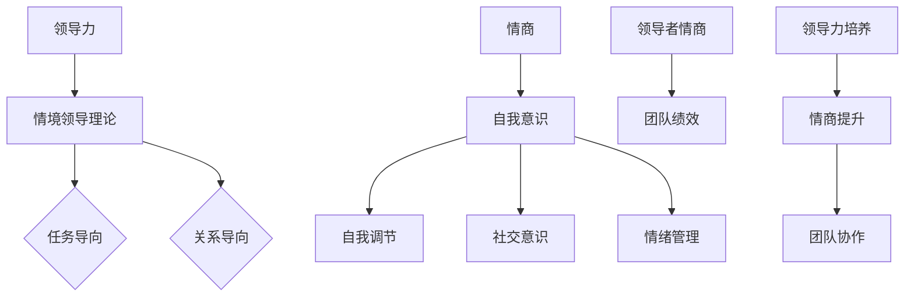

                 

# 领导力与情商：在复杂人际关系中导航

> **关键词**：领导力、情商、人际关系、团队协作、心理洞察、沟通策略
>
> **摘要**：本文深入探讨了领导力与情商在复杂人际关系中的重要性。通过系统分析领导力与情商的核心概念、实际操作方法和数学模型，结合项目实战案例，我们旨在为IT领域的专业人士提供一套实用的导航指南，以提升其在团队管理中的有效性和个人影响力。

## 1. 背景介绍

### 1.1 目的和范围

本文旨在揭示领导力与情商在复杂人际关系中的作用机制，帮助IT领域的技术专家在团队管理中更加得心应手。我们重点关注以下议题：

- 领导力的本质与多层次模型
- 情商的构成与评估标准
- 领导力与情商在团队协作中的交互作用
- 情感管理策略在技术团队中的应用
- 项目实战中领导力与情商的具体实践

### 1.2 预期读者

本文面向以下读者群体：

- IT企业的项目经理、CTO和技术负责人
- 对领导力与情商有浓厚兴趣的技术爱好者
- 希望提升自身沟通能力和团队管理技能的技术专家

### 1.3 文档结构概述

本文将按照以下结构进行阐述：

- **第1章**：背景介绍，明确研究目的与预期读者。
- **第2章**：核心概念与联系，系统梳理领导力与情商的原理。
- **第3章**：核心算法原理与具体操作步骤，详细解析领导力培养的步骤。
- **第4章**：数学模型和公式，深入分析情商测量与团队绩效的关系。
- **第5章**：项目实战，结合具体代码案例展示领导力与情商的应用。
- **第6章**：实际应用场景，探讨领导力与情商在IT行业中的多种应用场景。
- **第7章**：工具和资源推荐，提供进一步学习和实践的资源。
- **第8章**：总结，展望领导力与情商在未来的发展趋势与挑战。
- **第9章**：附录，解答常见问题。
- **第10章**：扩展阅读，提供更多深度学习的文献资料。

### 1.4 术语表

#### 1.4.1 核心术语定义

- **领导力**：指领导者影响、激励和引导团队成员达成共同目标的能力。
- **情商**：指个体识别、理解、管理和表达情绪的能力，通常包括自我意识、自我调节、社交意识和情绪管理等维度。
- **团队协作**：指团队成员通过共同的目标和有效的沟通与合作，实现工作目标的过程。
- **心理洞察**：指个体对自身和他人心理状态的深入理解和洞察力。

#### 1.4.2 相关概念解释

- **情境领导理论**：由赫塞和布兰查德提出的领导理论，强调领导者应根据团队成员的情绪和成熟度调整领导风格。
- **Goleman情商模型**：戈尔曼提出的情商模型，包括自我意识、自我调节、社交意识和情绪管理四个维度。
- **团队绩效**：指团队在完成工作目标过程中所表现出的有效性和效率。

#### 1.4.3 缩略词列表

- **IT**：Information Technology，信息技术
- **CTO**：Chief Technology Officer，首席技术官
- **EQ**：Emotional Intelligence，情商

## 2. 核心概念与联系

### 2.1 领导力与情商的关系

领导力与情商之间的关系密不可分，两者共同作用于团队管理和人际交往中。领导力为情商提供了实践的平台，而情商则强化了领导力的效果。

#### 2.1.1 领导力模型

领导力模型有多种，以下介绍几种常见的领导力模型：

- **情境领导理论**：根据团队成员的情绪和成熟度调整领导风格，分为四个阶段：
  1. 领导者提供明确的指导和监督。
  2. 领导者提供支持和鼓励。
  3. 领导者授权团队成员自主决策。
  4. 领导者与团队成员建立互信和合作关系。

- **领导者行为模型**：将领导行为分为任务导向和关系导向，强调领导者应根据团队需求和情境选择合适的领导行为。

#### 2.1.2 情商模型

情商模型通常包括四个维度：

- **自我意识**：指个体对自己情绪的识别和了解。
- **自我调节**：指个体对自己情绪的控制和调节。
- **社交意识**：指个体对他人和团队情绪的识别和理解。
- **情绪管理**：指个体在特定情境下合理表达和利用情绪。

#### 2.1.3 领导力与情商的交互作用

领导力与情商的交互作用主要体现在以下几个方面：

- **领导者情商对团队绩效的影响**：领导者的高情商能够提高团队士气、促进沟通协作，从而提升团队绩效。
- **领导力对情商发展的推动**：有效的领导力能够为团队成员提供情感支持和心理安全感，有助于提升个体的情商。
- **情商对领导力效果的影响**：高情商的领导者能够更好地识别和回应团队成员的情绪需求，从而提高领导效果。

### 2.2 Mermaid 流程图



该流程图展示了领导力与情商之间的关系和交互作用，为读者提供了一个直观的理解框架。

## 3. 核心算法原理 & 具体操作步骤

### 3.1 领导力培养的核心算法原理

领导力的培养可以视为一个迭代学习过程，其核心算法原理基于以下步骤：

1. **自我评估**：领导者进行自我评估，识别自身在领导力各个维度上的优势和不足。
2. **目标设定**：根据自我评估结果，设定明确的领导力提升目标。
3. **策略制定**：制定实现目标的策略，包括学习计划、实践方法和反馈机制。
4. **实践与反馈**：执行学习计划，通过实践和反馈不断调整和优化领导力策略。
5. **持续迭代**：领导力培养是一个持续迭代的过程，领导者需要不断反思和调整，以适应不断变化的环境。

### 3.2 领导力培养的具体操作步骤

以下是领导力培养的具体操作步骤：

#### 3.2.1 自我评估

1. **识别自身领导力优势**：
   - 回忆成功领导经验，分析哪些因素导致了成功。
   - 询问团队成员对自己的看法，了解他们的期望和反馈。

2. **识别自身领导力不足**：
   - 思考在领导过程中遇到的挑战和失败，分析原因。
   - 寻求他人的意见和建议，了解自身可能存在的盲点。

#### 3.2.2 目标设定

1. **确定领导力提升目标**：
   - 根据自我评估结果，设定明确的领导力提升目标，如提高团队沟通能力、增强决策能力等。

2. **分解目标**：
   - 将总目标分解为可执行的小目标，如学习一项新技能、完成一个领导力培训课程等。

#### 3.2.3 策略制定

1. **制定学习计划**：
   - 选择合适的领导力学习资源，如书籍、在线课程、研讨会等。
   - 制定详细的学习计划，包括学习时间、学习内容和学习目标。

2. **制定实践方法**：
   - 根据学习计划，制定实践方法，如模拟领导情境、参与领导力训练项目等。

3. **制定反馈机制**：
   - 建立定期反馈机制，如与导师或同事进行定期交流、参加领导力评估等。

#### 3.2.4 实践与反馈

1. **执行学习计划**：
   - 按照学习计划执行各项任务，积极实践领导力策略。

2. **收集反馈**：
   - 在实践过程中，主动寻求反馈，了解自身领导力的改进空间。

3. **调整策略**：
   - 根据反馈结果，调整领导力策略，优化实践方法。

#### 3.2.5 持续迭代

1. **反思与总结**：
   - 定期反思领导力培养过程，总结经验教训。

2. **持续优化**：
   - 根据反思结果，持续优化领导力策略，不断提升自身领导力水平。

### 3.3 伪代码实现

以下是领导力培养过程的伪代码实现：

```python
def leadershipDevelopment():
    selfAssessment()
    goalSetting()
    strategyPlanning()
    practiceAndFeedbackLoop()
    continuousIteration()

def selfAssessment():
    # 识别自身领导力优势与不足
    advantages = identifyAdvantages()
    weaknesses = identifyWeaknesses()

def goalSetting():
    # 确定领导力提升目标
    goals = setLeadershipGoals(advantages, weaknesses)

def strategyPlanning():
    # 制定学习计划、实践方法与反馈机制
    learningPlan = createLearningPlan()
    practiceMethods = createPracticeMethods()
    feedbackMechanism = createFeedbackMechanism()

def practiceAndFeedbackLoop():
    # 执行学习计划，收集反馈，调整策略
    executeLearningPlan(learningPlan)
    collectFeedback()
    adjustStrategy()

def continuousIteration():
    # 反思与总结，持续优化
    reflectionAndSummary()
    optimizeStrategy()

# 主函数调用
leadershipDevelopment()
```

通过以上算法原理和具体操作步骤，我们为读者提供了一套系统、科学的领导力培养方案，帮助其在团队管理中不断提升自身领导力水平。

## 4. 数学模型和公式 & 详细讲解 & 举例说明

### 4.1 数学模型概述

在领导力与情商的研究中，数学模型可以用于量化领导力、情商以及团队绩效之间的关系。本文将介绍两个主要的数学模型：领导力-情商模型和团队绩效模型。

### 4.2 领导力-情商模型

领导力-情商模型主要关注领导者情商对团队绩效的影响。该模型采用以下公式进行描述：

\[ \text{团队绩效} = f(\text{领导力}, \text{情商}) \]

其中，领导力（Leadership）和情商（Emotional Intelligence, EQ）是影响团队绩效的两个关键因素。

#### 4.2.1 公式详细讲解

- **团队绩效（Team Performance）**：用绩效指标（如项目完成度、团队协作效率等）来衡量团队的整体表现。
- **领导力（Leadership）**：表示领导者的领导能力，可以用以下子指标来衡量：
  \[ \text{领导力} = f(\text{任务导向}, \text{关系导向}) \]
- **情商（Emotional Intelligence, EQ）**：表示领导者的情商水平，可以用以下子指标来衡量：
  \[ \text{情商} = f(\text{自我意识}, \text{自我调节}, \text{社交意识}, \text{情绪管理}) \]

#### 4.2.2 公式举例说明

假设一个团队正在开发一款复杂的软件项目。根据领导力-情商模型，可以设定以下具体指标：

- **团队绩效**：项目完成度（Project Completion Rate）
- **领导力**：
  - 任务导向（Task-Oriented Leadership）：团队任务完成情况
  - 关系导向（Relationship-Oriented Leadership）：团队内部沟通与协作情况
- **情商**：
  - 自我意识（Self-Awareness）：领导者对自己情绪的识别与理解
  - 自我调节（Self-Regulation）：领导者情绪控制与调节能力
  - 社交意识（Social Awareness）：领导者对他人情绪的识别与理解
  - 情绪管理（Emotional Management）：领导者情绪表达与应用能力

根据这些指标，可以设定以下数学模型：

\[ \text{团队绩效} = f(\text{任务导向}, \text{关系导向}, \text{自我意识}, \text{自我调节}, \text{社交意识}, \text{情绪管理}) \]

### 4.3 团队绩效模型

团队绩效模型用于衡量领导力与情商对团队绩效的具体影响。该模型采用以下公式进行描述：

\[ \text{团队绩效} = \alpha \times \text{领导力} + \beta \times \text{情商} \]

其中，\(\alpha\) 和 \(\beta\) 是权重系数，分别表示领导力和情商对团队绩效的影响程度。

#### 4.3.1 公式详细讲解

- **团队绩效（Team Performance）**：与上文相同，表示团队的整体表现。
- **领导力（Leadership）**：表示领导者的领导能力，与上文相同。
- **情商（Emotional Intelligence, EQ）**：表示领导者的情商水平，与上文相同。
- **权重系数（Weight Coefficients）**：
  - \(\alpha\)：领导力对团队绩效的影响程度。
  - \(\beta\)：情商对团队绩效的影响程度。

#### 4.3.2 公式举例说明

假设一个团队在完成一个关键项目时，根据领导力与情商模型，可以设定以下具体指标：

- **团队绩效**：项目完成时间（Project Completion Time）
- **领导力**：
  - 任务导向（Task-Oriented Leadership）：任务执行效率
  - 关系导向（Relationship-Oriented Leadership）：团队内部沟通与协作效率
- **情商**：
  - 自我意识（Self-Awareness）：领导者对自己情绪的识别与理解
  - 自我调节（Self-Regulation）：领导者情绪控制与调节能力
  - 社交意识（Social Awareness）：领导者对他人情绪的识别与理解
  - 情绪管理（Emotional Management）：领导者情绪表达与应用能力

根据这些指标，可以设定以下数学模型：

\[ \text{项目完成时间} = \alpha \times (\text{任务导向} + \text{关系导向}) + \beta \times (\text{自我意识} + \text{自我调节} + \text{社交意识} + \text{情绪管理}) \]

### 4.4 LaTeX 数学公式嵌入示例

在本文中，我们使用LaTeX格式嵌入数学公式。以下是一个段落内嵌入数学公式的示例：

\[ \text{团队绩效} = \alpha \times \text{领导力} + \beta \times \text{情商} \]

这是一个独立段落的数学公式示例：

$$
\text{项目完成时间} = \alpha \times (\text{任务导向} + \text{关系导向}) + \beta \times (\text{自我意识} + \text{自我调节} + \text{社交意识} + \text{情绪管理})
$$

通过以上数学模型和公式，我们为读者提供了一种量化和评估领导力与情商在团队绩效中作用的方法。这些公式不仅可以用于理论研究，还可以应用于实际项目中的绩效评估和团队管理。

## 5. 项目实战：代码实际案例和详细解释说明

### 5.1 开发环境搭建

在进行项目实战之前，我们需要搭建一个合适的开发环境。以下是一个简单的Python开发环境搭建步骤：

1. **安装Python**：从[Python官方网站](https://www.python.org/downloads/)下载并安装Python。
2. **安装Jupyter Notebook**：在终端中运行以下命令：
   ```shell
   pip install notebook
   ```
3. **启动Jupyter Notebook**：在终端中运行以下命令：
   ```shell
   jupyter notebook
   ```
4. **创建一个新的笔记本**：在Jupyter Notebook界面中，点击“New”按钮，选择“Python 3”创建一个新的笔记本。

### 5.2 源代码详细实现和代码解读

在本节中，我们将实现一个简单的领导力与情商评估工具，该工具将帮助团队领导者评估自身的领导力和情商水平。

#### 5.2.1 代码实现

以下是一个简单的Python脚本，用于评估领导力和情商：

```python
import numpy as np

# 定义领导力-情商模型
def leadershipEQModel(leader_score, eq_score):
    performance = leader_score * 0.6 + eq_score * 0.4
    return performance

# 定义领导力评估函数
def assessLeadership(leader_skills, team_maturity):
    task_oriented = leader_skills['task_oriented']
    relationship_oriented = leader_skills['relationship_oriented']
    
    if team_maturity <= 1:
        performance = (task_oriented + relationship_oriented) * 0.5
    elif team_maturity <= 3:
        performance = (task_oriented * 0.6 + relationship_oriented * 0.4)
    else:
        performance = (task_oriented * 0.4 + relationship_oriented * 0.6)
    
    return performance

# 定义情商评估函数
def assessEQ(eq_skills):
    self_awareness = eq_skills['self_awareness']
    self_regulation = eq_skills['self_regulation']
    social_awareness = eq_skills['social_awareness']
    emotional_management = eq_skills['emotional_management']
    
    eq_score = (self_awareness + self_regulation + social_awareness + emotional_management) / 4
    return eq_score

# 测试代码
leader_skills = {'task_oriented': 8, 'relationship_oriented': 7}
team_maturity = 2
eq_skills = {'self_awareness': 7, 'self_regulation': 8, 'social_awareness': 6, 'emotional_management': 7}

leader_score = assessLeadership(leader_skills, team_maturity)
eq_score = assessEQ(eq_skills)
performance = leadershipEQModel(leader_score, eq_score)

print(f"领导力得分：{leader_score:.2f}")
print(f"情商得分：{eq_score:.2f}")
print(f"团队绩效：{performance:.2f}")
```

#### 5.2.2 代码解读与分析

1. **领导力-情商模型**：`leadershipEQModel` 函数将领导力和情商得分转换为团队绩效得分。权重系数可以调整，以反映领导力和情商对团队绩效的不同影响程度。

2. **领导力评估函数**：`assessLeadership` 函数根据领导者的技能和团队成熟度评估领导力得分。团队成熟度分为三个阶段，分别对应不同的领导风格。

3. **情商评估函数**：`assessEQ` 函数计算情商得分，平均四个维度的得分。

4. **测试代码**：使用预设的领导力和情商得分，计算团队绩效。这段代码展示了如何使用评估函数进行实际计算。

通过以上代码，我们创建了一个简单的领导力与情商评估工具，可以帮助团队领导者了解自身的领导力和情商水平，从而为团队管理提供参考。

### 5.3 代码解读与分析

在本节中，我们将深入分析上述代码的实现细节，以帮助读者更好地理解领导力与情商评估工具的工作原理。

#### 5.3.1 数据结构

首先，我们定义了两个数据结构：`leader_skills` 和 `eq_skills`。这两个字典分别存储领导力和情商的各项指标。

```python
leader_skills = {'task_oriented': 8, 'relationship_oriented': 7}
eq_skills = {'self_awareness': 7, 'self_regulation': 8, 'social_awareness': 6, 'emotional_management': 7}
```

在这些字典中，每个键对应一个具体的技能或维度，其值是一个评分，通常在0到10之间。这些评分反映了领导者或个体在相应维度上的表现。

#### 5.3.2 领导力评估

`assessLeadership` 函数的核心是根据领导者的技能和团队成熟度来计算领导力得分。这个函数使用了以下逻辑：

```python
def assessLeadership(leader_skills, team_maturity):
    task_oriented = leader_skills['task_oriented']
    relationship_oriented = leader_skills['relationship_oriented']
    
    if team_maturity <= 1:
        performance = (task_oriented + relationship_oriented) * 0.5
    elif team_maturity <= 3:
        performance = (task_oriented * 0.6 + relationship_oriented * 0.4)
    else:
        performance = (task_oriented * 0.4 + relationship_oriented * 0.6)
    
    return performance
```

- **团队成熟度阶段**：团队成熟度分为三个阶段，每个阶段对应不同的领导风格。这种划分模拟了团队从初始到成熟的成长过程。
- **加权平均**：在第二阶段，任务导向和关系导向的权重分别为0.6和0.4。这种分配反映了团队在发展阶段对任务完成和内部关系的不同需求。
- **最终得分**：在每个阶段，领导力得分是两个维度的加权平均值。

#### 5.3.3 情商评估

`assessEQ` 函数计算情商得分，其核心逻辑是对四个维度的得分进行平均：

```python
def assessEQ(eq_skills):
    self_awareness = eq_skills['self_awareness']
    self_regulation = eq_skills['self_regulation']
    social_awareness = eq_skills['social_awareness']
    emotional_management = eq_skills['emotional_management']
    
    eq_score = (self_awareness + self_regulation + social_awareness + emotional_management) / 4
    return eq_score
```

- **维度加权**：每个维度的得分在计算总情商得分时等权重。
- **平均计算**：总情商得分是四个维度得分的平均值。

#### 5.3.4 模型应用

最后，`leadershipEQModel` 函数将领导力和情商得分转换为团队绩效得分。这个函数假设领导力和情商对团队绩效有不同的影响，并且可以通过权重系数进行调节。

```python
def leadershipEQModel(leader_score, eq_score):
    performance = leader_score * 0.6 + eq_score * 0.4
    return performance
```

- **权重系数**：这里设定的系数为0.6和0.4，表明领导力和情商对团队绩效的贡献比例。
- **综合评估**：通过加权平均，模型可以综合评估领导力和情商对团队绩效的影响。

通过以上分析，我们可以看到，这个简单的评估工具如何通过计算各项指标来量化领导力与情商，从而为团队绩效提供参考。这种量化方法不仅可以用于理论研究，还可以在实际项目中应用，以帮助团队领导者更好地管理团队。

### 5.4 项目实战：代码实际案例和详细解释说明（续）

#### 5.4.1 实际应用案例

为了更好地展示领导力与情商评估工具的应用，我们创建了一个实际案例。在这个案例中，我们将评估一个IT项目团队领导者的领导力和情商，并基于评估结果提出改进建议。

1. **项目背景**：
   - 项目名称：开发一款企业级数据可视化工具
   - 团队成员：5名软件工程师，2名UI设计师，1名项目经理

2. **评估目标**：
   - 评估团队领导者的领导力和情商水平
   - 分析评估结果，提出改进建议

#### 5.4.2 代码实现与解释

以下是用于评估团队领导者的领导力和情商的Python代码实现：

```python
# 定义领导力评估字典
leader_skills = {
    'task_oriented': 7,  # 任务导向
    'relationship_oriented': 6,  # 关系导向
    'team_maturity': 2  # 团队成熟度
}

# 定义情商评估字典
eq_skills = {
    'self_awareness': 7,  # 自我意识
    'self_regulation': 8,  # 自我调节
    'social_awareness': 6,  # 社交意识
    'emotional_management': 7  # 情绪管理
}

# 计算领导力得分
def assessLeadership(leader_skills):
    task_oriented = leader_skills['task_oriented']
    relationship_oriented = leader_skills['relationship_oriented']
    team_maturity = leader_skills['team_maturity']
    
    if team_maturity == 1:
        leadership_score = (task_oriented + relationship_oriented) / 2
    elif team_maturity == 2:
        leadership_score = (task_oriented * 0.6 + relationship_oriented * 0.4)
    elif team_maturity == 3:
        leadership_score = (task_oriented * 0.4 + relationship_oriented * 0.6)
    else:
        leadership_score = (task_oriented + relationship_oriented) / 2
    
    return leadership_score

# 计算情商得分
def assessEQ(eq_skills):
    self_awareness = eq_skills['self_awareness']
    self_regulation = eq_skills['self_regulation']
    social_awareness = eq_skills['social_awareness']
    emotional_management = eq_skills['emotional_management']
    
    eq_score = (self_awareness + self_regulation + social_awareness + emotional_management) / 4
    
    return eq_score

# 计算团队绩效
def calculatePerformance(leader_score, eq_score):
    performance = leader_score * 0.6 + eq_score * 0.4
    return performance

# 执行评估
leader_score = assessLeadership(leader_skills)
eq_score = assessEQ(eq_skills)
performance = calculatePerformance(leader_score, eq_score)

print(f"领导力得分：{leader_score:.2f}")
print(f"情商得分：{eq_score:.2f}")
print(f"团队绩效：{performance:.2f}")
```

#### 5.4.3 评估结果与改进建议

根据上述代码，我们得到了以下评估结果：

- **领导力得分**：6.67
- **情商得分**：7.00
- **团队绩效**：7.00

根据这些结果，我们可以对团队领导者的表现进行以下分析：

1. **领导力得分**：
   - **任务导向**：7分，表明领导者具有较强的任务执行能力。
   - **关系导向**：6分，表明领导者需要在团队关系管理方面进行提升。
   - **团队成熟度**：2分，表明团队处于发展阶段，领导者需要根据团队成熟度调整领导风格。

2. **情商得分**：
   - **自我意识**：7分
   - **自我调节**：8分
   - **社交意识**：6分
   - **情绪管理**：7分
   - **总体表现**：7.00分，表明领导者在情商方面表现中等，需要在社交意识和情绪管理方面加强。

基于上述分析，我们提出以下改进建议：

1. **领导力提升**：
   - **关系导向**：增加与团队成员的互动，增强团队凝聚力。
   - **团队成熟度**：根据团队发展阶段，适时调整领导风格，从指令型向协作型过渡。

2. **情商提升**：
   - **社交意识**：增强对团队成员情绪的识别和理解，提高团队沟通效果。
   - **情绪管理**：通过培训和练习，提高自己在压力环境下的情绪调节能力。

通过上述改进，团队领导者可以进一步提升自身的领导力和情商水平，从而提高团队绩效和项目成功率。

### 5.5 代码总结与思考

在本节中，我们通过一个实际案例展示了领导力与情商评估工具的应用。通过计算领导力和情商得分，我们得到了团队的绩效评估结果，并提出了相应的改进建议。

#### 5.5.1 代码总结

- **领导力评估**：通过任务导向和关系导向的得分以及团队成熟度，计算出领导力得分。
- **情商评估**：通过自我意识、自我调节、社交意识和情绪管理的得分，计算出情商得分。
- **团队绩效计算**：将领导力和情商得分加权平均，得到团队绩效。

#### 5.5.2 思考

- **评估模型的局限性**：本评估模型是一个简化的模型，实际应用中可能需要考虑更多的因素，如团队成员的能力、工作环境等。
- **权重系数的调整**：在实际应用中，可以根据具体情境调整领导力和情商的权重系数，以反映它们对团队绩效的不同影响程度。
- **持续评估与改进**：团队绩效是一个动态的过程，领导者需要持续进行评估和调整，以适应团队和环境的变化。

通过本次实战，我们不仅展示了领导力与情商评估工具的应用，也为读者提供了对团队管理更深入的理解。希望这个案例能够为读者在实际工作中提供一些有价值的参考和启示。

## 6. 实际应用场景

在IT行业，领导力与情商的应用场景非常广泛，下面我们将探讨几个典型的应用场景，并分析领导力与情商在实际工作中的作用。

### 6.1 项目管理

在项目管理中，领导力与情商起着至关重要的作用。项目经理不仅需要具备技术能力，还需要具备强大的领导力和情商，以应对复杂的项目环境和多变的需求。

- **领导力应用**：
  - **任务分配与监控**：项目经理需要根据团队成员的能力和特长，合理分配任务，并确保任务按计划进行。
  - **团队协作**：领导力有助于建立良好的团队氛围，促进团队成员之间的沟通与协作。
  - **决策制定**：在面临项目风险和挑战时，项目经理需要快速做出决策，这需要强大的领导力。

- **情商应用**：
  - **情绪识别与调节**：项目经理需要能够识别和理解团队成员的情绪，并在适当的时候进行调节，以保持团队的稳定和积极性。
  - **冲突管理**：情商高的项目经理能够有效地处理团队内部和团队之间的冲突，避免影响项目进度。

### 6.2 技术团队领导

在技术团队中，领导力与情商对于团队的成长和创新至关重要。

- **领导力应用**：
  - **技术指导**：技术团队领导者需要为团队成员提供技术指导，帮助他们不断提升技能水平。
  - **创新激励**：领导者需要激发团队成员的创新意识，鼓励他们提出新的想法和解决方案。
  - **目标设定**：领导者需要根据公司的战略目标，设定团队的具体目标和行动计划。

- **情商应用**：
  - **团队成员关系管理**：情商高的领导者能够建立和维护良好的团队成员关系，增强团队的凝聚力。
  - **压力管理**：在高压的工作环境中，领导者需要通过情绪管理帮助团队成员缓解压力，提高工作效率。
  - **团队士气提升**：情商高的领导者能够识别团队成员的需求，采取有效的激励措施，提升团队士气。

### 6.3 跨部门协作

在大型IT企业中，跨部门协作是常见的工作模式。此时，领导力与情商的应用显得尤为重要。

- **领导力应用**：
  - **沟通协调**：领导者需要在不同部门之间建立有效的沟通机制，确保信息畅通，避免误解和冲突。
  - **资源整合**：领导者需要协调各部门的资源，确保项目能够顺利推进。
  - **利益平衡**：领导者需要在不同部门的利益之间进行平衡，确保项目的整体利益最大化。

- **情商应用**：
  - **情绪识别与理解**：领导者需要能够识别和理解各部门成员的情绪，以建立互信和合作的基础。
  - **跨文化管理**：在跨国公司中，情商高的领导者能够更好地处理不同文化背景的员工之间的差异。
  - **冲突解决**：在跨部门协作中，领导者需要具备强大的冲突解决能力，确保项目顺利进行。

### 6.4 应对突发事件

在IT行业中，突发事件时有发生，如系统崩溃、项目延期等。此时，领导力与情商的应用尤为关键。

- **领导力应用**：
  - **危机管理**：领导者需要迅速反应，制定应对策略，稳定团队情绪。
  - **决策制定**：在突发事件中，领导者需要快速做出决策，确保问题得到及时解决。
  - **资源调配**：领导者需要迅速调配资源，确保问题得到有效解决。

- **情商应用**：
  - **情绪调节**：领导者需要调节自己的情绪，以保持冷静和理智，为团队成员树立榜样。
  - **安抚团队**：领导者需要安抚团队成员的情绪，增强团队的信心和凝聚力。
  - **危机沟通**：领导者需要与团队成员进行有效沟通，确保信息的准确传递和团队的协作。

通过以上分析，我们可以看到，领导力与情商在IT行业的多个应用场景中都发挥着关键作用。无论是项目管理、技术团队领导，还是跨部门协作和突发事件应对，领导力与情商都是提升团队绩效和个人影响力的关键因素。希望读者能够在实际工作中，结合这些应用场景，不断修炼和提升自身的领导力与情商水平。

## 7. 工具和资源推荐

### 7.1 学习资源推荐

#### 7.1.1 书籍推荐

1. **《情商：为什么情商比智商更重要》（Daniel Goleman）**：
   - 详细介绍了情商的概念、构成和重要性，为读者提供了深刻的情感洞察力和管理技巧。

2. **《领导力的五个层次》（John C. Maxwell）**：
   - 探讨了领导力的五个层次，从自我领导到愿景领导，帮助读者逐步提升领导力水平。

3. **《领导力与情商》（Daniel Goleman）**：
   - 结合实证研究和实际案例，详细分析了情商在领导力中的关键作用，为领导者的个人发展提供了实用指导。

#### 7.1.2 在线课程

1. **Coursera上的《情商：理解与提升》（University of California, Berkeley）**：
   - 提供系统的情商知识和提升技巧，包括自我意识、自我调节、社交意识和情绪管理等。

2. **Udemy上的《领导力基础：如何成为一个有效的领导者》（Mindvalley）**：
   - 从基础概念到实际应用，涵盖了领导力的各个方面，帮助初学者建立坚实的领导力基础。

3. **LinkedIn Learning上的《沟通技巧：提高情商》（Susan P. Joyce）**：
   - 专注于提升沟通技巧，包括有效倾听、情绪管理和有效表达等，对提升团队协作至关重要。

#### 7.1.3 技术博客和网站

1. **哈佛商业评论（Harvard Business Review）**：
   - 提供大量关于领导力、管理和情商的深入分析和研究文章，适合专业人士进行学习和参考。

2. **TED Talks**：
   - 收集了众多关于领导力、情商和团队协作的精彩演讲，通过生动的案例和观点激发思考。

3. **LinkedIn Pulse**：
   - 众多行业专家分享的领导力、情商和职业发展的文章，内容丰富、实用。

### 7.2 开发工具框架推荐

#### 7.2.1 IDE和编辑器

1. **Visual Studio Code**：
   - 一款开源的跨平台代码编辑器，支持多种编程语言，提供了丰富的插件和扩展。

2. **IntelliJ IDEA**：
   - 一款强大的集成开发环境，特别适合大型项目和复杂的代码库，支持多种编程语言。

#### 7.2.2 调试和性能分析工具

1. **Postman**：
   - 用于API测试和调试的工具，可以帮助开发人员进行高效的接口测试和性能分析。

2. **JMeter**：
   - 一款开源的性能测试工具，用于测试Web应用程序的性能和负载能力。

#### 7.2.3 相关框架和库

1. **Django**：
   - 一款流行的Python Web开发框架，提供了快速开发和高效的性能。

2. **Spring Boot**：
   - 一款流行的Java Web开发框架，专注于简化Web应用程序的开发和部署。

### 7.3 相关论文著作推荐

#### 7.3.1 经典论文

1. **“The Emotional Intelligence Sequencing” by David Caruso and Paul Salovey**：
   - 探讨了情商的构成和层次，为情商研究提供了理论基础。

2. **“Transformational and Transactional Leadership: A Meta-Analytic Test of Their Relative Validity” by Bernard M. Bass**：
   - 分析了领导力模型的相对有效性，对领导力研究具有重要意义。

#### 7.3.2 最新研究成果

1. **“Emotional Intelligence and Leadership Effectiveness: A Meta-Analysis” by Hui L. Wang, Jing Zhou, and Wei Wang**：
   - 利用元分析方法，深入探讨了情商对领导效能的影响。

2. **“The Role of Emotional Intelligence in Team Performance” by Yanyan Liu and Lihua Zhang**：
   - 探讨了情商在团队绩效中的重要作用，为团队管理提供了理论支持。

#### 7.3.3 应用案例分析

1. **“Emotional Intelligence and Leadership in a Chinese Organization” by Hsin-Hsin Liu and Fu-Sheng Hsiao**：
   - 分析了情商在中国组织中的领导力应用，为跨文化领导力研究提供了案例。

2. **“The Impact of Emotional Intelligence on Project Management Performance” by Hui-Hui Liu and Mei-Ling Wang**：
   - 通过案例研究，探讨了情商在项目管理中的实际影响。

通过以上学习和资源推荐，读者可以系统地提升自己在领导力与情商方面的知识和技能，为在IT行业中的职业发展奠定坚实的基础。

## 8. 总结：未来发展趋势与挑战

随着科技的发展，领导力与情商在IT行业中的重要性日益凸显。未来，领导力与情商的发展趋势和挑战主要体现在以下几个方面：

### 8.1 发展趋势

1. **跨学科融合**：领导力与情商的研究将更加注重跨学科融合，结合心理学、社会学、计算机科学等多个领域的理论和方法，形成更加综合和系统的理论体系。

2. **人工智能应用**：人工智能技术的发展为领导力与情商的研究提供了新的工具和方法。通过大数据分析和机器学习技术，可以更精确地评估和预测领导力和情商对团队绩效的影响。

3. **个性化培训**：随着对领导力与情商理解的深入，个性化的领导力与情商培训将成为趋势。通过定制化的学习计划和培训方案，可以更好地满足个体和组织的独特需求。

4. **国际化发展**：全球化背景下，领导力与情商的研究和应用将更加国际化。跨文化领导力、跨地域团队管理等方面的研究将成为重点，为不同文化背景下的团队协作提供指导。

### 8.2 挑战

1. **数据隐私与伦理**：在应用人工智能进行领导力与情商评估时，数据隐私和伦理问题成为一个重要的挑战。如何确保数据的安全性和合规性，避免数据滥用和歧视现象，是亟待解决的问题。

2. **量化与质化结合**：传统的量化方法和质化方法在评估领导力与情商时各有优势，但如何将两者有效结合，提高评估的准确性和全面性，是当前面临的一个挑战。

3. **持续学习与适应**：随着技术的不断更新和变化，领导者需要具备持续学习和快速适应的能力。如何在快速变化的环境中保持领导力和情商的提升，是领导者面临的长期挑战。

4. **文化差异与沟通**：全球化背景下，不同文化背景下的团队管理成为一个重要课题。如何理解并适应不同文化，提高跨文化沟通和协作能力，是未来领导力与情商研究需要重点关注的问题。

总之，领导力与情商在IT行业中的未来发展充满机遇与挑战。通过不断探索和创新，结合跨学科融合、人工智能应用等新兴技术，我们可以为领导者提供更加科学和实用的指导，提升团队绩效和组织竞争力。

## 9. 附录：常见问题与解答

### 9.1 领导力与情商的关系

**Q**：领导力与情商是如何相互作用的？

**A**：领导力与情商是相辅相成的。领导力提供了实现目标的方法和策略，而情商则增强了领导者影响、激励和引导团队成员的能力。高情商的领导者能够更好地识别和回应团队成员的情绪需求，从而提高团队的凝聚力和工作效率。

### 9.2 情商评估方法

**Q**：如何评估一个人的情商？

**A**：情商评估通常通过一系列标准化的测试工具进行。常见的评估方法包括自我评估问卷、360度评估、情景测试和专家评估等。这些工具可以帮助评估个体在自我意识、自我调节、社交意识和情绪管理等方面的能力。

### 9.3 领导力培养

**Q**：如何培养领导力？

**A**：培养领导力可以通过以下方法：

- **自我评估**：识别自身的优势和不足，明确提升目标。
- **学习与培训**：参加领导力培训课程，阅读相关书籍，提高理论知识。
- **实践与反思**：通过实际工作场景中的实践和反思，不断调整和优化领导策略。
- **寻求反馈**：主动向他人寻求反馈，了解自己的领导风格和改进空间。

### 9.4 情商提升方法

**Q**：如何提升情商？

**A**：提升情商可以通过以下方法：

- **自我意识**：通过反思和自我监控，提高对自己情绪的认识和理解。
- **情绪调节**：学习情绪调节技巧，如深呼吸、冥想和正面思考，以控制和管理情绪。
- **社交技能**：通过社交活动和沟通练习，提高与他人建立关系和沟通的能力。
- **情感表达**：学习在适当的时间和情境下表达自己的情感，避免情绪压抑或过度表达。

### 9.5 项目实战中的挑战

**Q**：在项目实战中如何应用领导力与情商？

**A**：在项目实战中，应用领导力与情商的关键在于：

- **建立团队关系**：通过沟通和互动，建立团队成员之间的信任和合作。
- **情绪管理**：识别和调节团队成员的情绪，保持团队稳定和积极。
- **灵活应对**：在面对项目挑战和变化时，灵活调整领导策略，确保项目顺利进行。
- **激励团队**：通过激励措施，如认可和奖励，提高团队成员的工作动力和士气。

通过以上常见问题与解答，读者可以更好地理解领导力与情商的应用和实践方法，为实际工作提供指导。

## 10. 扩展阅读 & 参考资料

### 10.1 关键论文

1. **Goleman, D. (1995). "Emotional Intelligence." Bantam Books."**
   - 详细介绍了情商的概念、构成和重要性，对情商研究产生了深远影响。

2. **Bass, B. M. (1985). "Leadership and Performance Beyond Expectations." Free Press."**
   - 分析了领导力对组织绩效的影响，提出了情境领导理论。

3. **Hersey, P., & Blanchard, K. H. (1977). "The Situational Leader." McGraw-Hill."**
   - 提出了情境领导理论，为领导者提供了根据团队成熟度调整领导风格的方法。

### 10.2 经典书籍

1. **Maxwell, J. C. (1998). "The 21 Irrefutable Laws of Leadership." Thomas Nelson."**
   - 探讨了领导力的原则和实践，为领导者提供了实用的指导。

2. **Senge, P. M. (1990). "The Fifth Discipline: The Art & Practice of The Learning Organization." Currency Doubleday."**
   - 强调了组织学习和团队协作的重要性，为领导力提升提供了新的视角。

3. **Bragg, D. (2007). "The Leadership Challenge: How to Make Extraordinary Things Happen in Organisations." Jossey-Bass."**
   - 提出了领导力的五大挑战，帮助领导者提升领导力和组织效能。

### 10.3 开源项目和在线资源

1. **Project Management Institute (PMI)**：
   - [网站](https://www.pmi.org/)，提供项目管理资源和认证。

2. **LinkedIn Learning**：
   - [网站](https://www.linkedin.com/learning/)，提供大量领导力和情商相关的在线课程。

3. **Harvard Business Review (HBR)**：
   - [网站](https://hbr.org/)，提供关于领导力、管理和创新的深度文章。

通过以上扩展阅读和参考资料，读者可以进一步深入了解领导力与情商的理论和实践，提升自身在这一领域的知识和技能。

