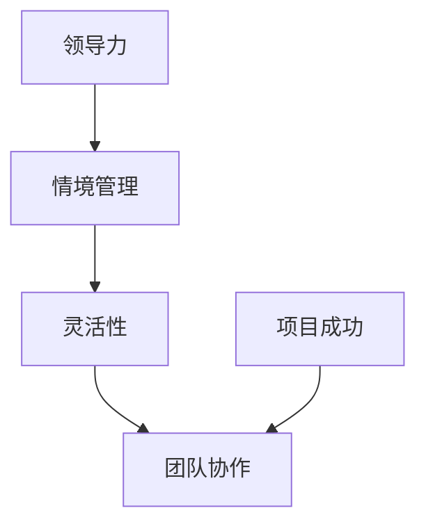

                 

# 领导力与情境管理：灵活应对不同挑战

> **关键词**：领导力、情境管理、灵活性、挑战应对、团队协作、技术管理
>
> **摘要**：本文深入探讨了领导力与情境管理在IT领域的应用。通过对核心概念的详细阐述，本文揭示了灵活应对不同挑战的策略和方法，帮助技术领导者和管理者提升团队协作效率和项目成功概率。

## 1. 背景介绍

### 1.1 目的和范围

本文旨在揭示领导力与情境管理在IT领域的实际应用，帮助技术领导者和管理者理解如何在复杂多变的环境中灵活应对各种挑战。我们将通过理论分析和实际案例，探讨如何运用情境管理策略提升团队协作效率，实现项目目标。

### 1.2 预期读者

本文适合以下读者群体：
- 技术团队领导者和管理者
- 企业CTO、技术总监
- 拥有多年编程经验的技术专家
- 对领导力和团队管理有兴趣的IT从业者

### 1.3 文档结构概述

本文分为八个部分：
1. **背景介绍**：介绍文章的目的、读者对象和文档结构。
2. **核心概念与联系**：阐述领导力与情境管理的基本概念，使用流程图展示各概念之间的关系。
3. **核心算法原理 & 具体操作步骤**：讲解情境管理中的核心算法原理，使用伪代码详细描述操作步骤。
4. **数学模型和公式 & 详细讲解 & 举例说明**：介绍情境管理中的数学模型和公式，并结合实例进行讲解。
5. **项目实战：代码实际案例和详细解释说明**：通过实际代码案例，展示情境管理的应用。
6. **实际应用场景**：分析情境管理在不同场景中的应用。
7. **工具和资源推荐**：推荐学习资源、开发工具和框架。
8. **总结：未来发展趋势与挑战**：总结全文，展望未来发展趋势和挑战。

### 1.4 术语表

#### 1.4.1 核心术语定义

- **领导力**：影响他人共同实现目标的能力。
- **情境管理**：根据不同环境采取相应的管理策略。
- **灵活性**：快速适应和应对变化的能力。
- **团队协作**：团队成员共同合作，实现共同目标。

#### 1.4.2 相关概念解释

- **情境**：指影响决策和行动的各种环境因素。
- **策略**：为实现目标而制定的具体行动方案。
- **项目管理**：规划、执行和控制项目过程，确保项目成功完成。

#### 1.4.3 缩略词列表

- **IT**：信息技术
- **CTO**：首席技术官
- **IDE**：集成开发环境
- **ERP**：企业资源计划

## 2. 核心概念与联系

在讨论领导力与情境管理之前，我们需要明确几个核心概念，并了解它们之间的联系。

### 2.1 领导力的定义

领导力是指领导者通过影响、激励和指导他人，共同实现目标的能力。领导者不仅要具备技术知识，还需要具备沟通、协调和决策能力。

### 2.2 情境管理的概念

情境管理是一种根据不同环境采取相应策略的管理方法。情境可以是项目的阶段、团队成员的技能水平、市场变化等。

### 2.3 灵活性的重要性

在快速变化的技术领域，领导者需要具备高度的灵活性，以适应不断变化的环境。灵活性包括快速学习、适应新环境、调整策略等能力。

### 2.4 团队协作

团队协作是实现项目目标的关键。领导者需要通过有效的沟通和协调，确保团队成员能够共同合作，发挥各自的优势。

### 2.5 核心概念之间的联系

领导力、情境管理、灵活性和团队协作之间存在密切联系。领导者需要运用情境管理策略，根据不同环境灵活调整管理方式，以促进团队协作，实现项目目标。

### 2.6 Mermaid 流程图

以下是一个简化的 Mermaid 流程图，展示了核心概念之间的联系：



## 3. 核心算法原理 & 具体操作步骤

在了解核心概念后，我们需要探讨情境管理的核心算法原理和具体操作步骤。以下是情境管理的伪代码描述：

```plaintext
算法名称：情境管理策略选择

输入：当前情境（情境类型、团队成员技能、项目阶段等）
输出：相应策略（沟通策略、任务分配策略、决策策略等）

步骤：
1. 识别当前情境
2. 根据情境类型和团队特征，选择合适的策略
3. 实施策略
4. 监控策略效果，并根据实际情况进行调整
```

### 3.1 识别当前情境

```plaintext
函数名称：识别情境（情境参数）

输入：情境参数（环境因素、团队状态等）
输出：情境类型（高稳定性、中等变化性、高变化性等）

步骤：
1. 收集情境参数
2. 分析情境参数，确定情境类型
3. 返回情境类型
```

### 3.2 选择合适策略

```plaintext
函数名称：选择策略（情境类型、团队特征）

输入：情境类型、团队特征（技能水平、沟通方式等）
输出：策略（沟通策略、任务分配策略等）

步骤：
1. 根据情境类型，选择基本策略
2. 根据团队特征，调整策略
3. 返回调整后的策略
```

### 3.3 实施策略

```plaintext
函数名称：实施策略（策略、团队成员）

输入：策略、团队成员
输出：策略实施效果

步骤：
1. 沟通策略：明确项目目标、任务和期望
2. 任务分配策略：根据团队成员技能和兴趣分配任务
3. 决策策略：鼓励团队成员参与决策过程
4. 监控策略效果，并根据实际情况进行调整
```

### 3.4 监控和调整策略

```plaintext
函数名称：监控和调整策略（策略实施效果、团队成员反馈）

输入：策略实施效果、团队成员反馈
输出：调整后的策略

步骤：
1. 收集策略实施效果数据
2. 分析策略效果，确定是否需要调整
3. 根据团队成员反馈，调整策略
4. 返回调整后的策略
```

## 4. 数学模型和公式 & 详细讲解 & 举例说明

情境管理中的数学模型和公式有助于我们更深入地理解情境管理策略的选择和调整。以下是一个简单的数学模型，用于评估不同情境下的团队协作效率。

### 4.1 数学模型

设团队协作效率为 \( E \)，情境类型为 \( T \)，团队成员技能水平为 \( S \)，沟通策略为 \( C \)，任务分配策略为 \( D \)，决策策略为 \( P \)。则团队协作效率可以表示为：

\[ E = f(T, S, C, D, P) \]

其中，函数 \( f \) 表示团队协作效率与各因素之间的关系。

### 4.2 详细讲解

- **情境类型（T）**：情境类型影响团队协作效率。例如，在高变化性情境下，团队协作效率可能较低，因为团队成员需要不断适应新环境。
- **团队成员技能水平（S）**：团队成员的技能水平直接影响协作效率。高技能水平的团队成员可以更快地完成任务，提高整体效率。
- **沟通策略（C）**：有效的沟通策略可以确保团队成员之间信息畅通，减少误解和冲突，提高协作效率。
- **任务分配策略（D）**：合理的任务分配可以充分发挥团队成员的优势，提高协作效率。
- **决策策略（P）**：鼓励团队成员参与决策过程，可以增强团队的凝聚力和信任感，提高协作效率。

### 4.3 举例说明

假设一个团队正在开发一个复杂的软件项目。情境类型为高变化性，团队成员技能水平较高，沟通策略良好，任务分配策略合理，决策策略鼓励团队成员参与。根据数学模型，我们可以预期团队协作效率较高。

然而，在实际操作中，情境可能会发生变化。例如，团队成员的技能水平可能受到限制，沟通策略可能存在瓶颈，任务分配策略可能不合理，决策策略可能缺乏灵活性。在这种情况下，团队协作效率可能会降低。

为了提高协作效率，领导者需要根据实际情况调整策略。例如，通过培训提高团队成员的技能水平，优化沟通策略，调整任务分配策略，鼓励团队成员参与决策过程。这些调整有助于提高团队协作效率，确保项目成功。

## 5. 项目实战：代码实际案例和详细解释说明

在本节中，我们将通过一个实际项目案例，展示情境管理的应用，并详细解释代码实现和关键操作步骤。

### 5.1 开发环境搭建

为了简化案例，我们使用 Python 作为开发语言，并在本地搭建一个简单的开发环境。

- **安装 Python**：下载并安装 Python 3.x 版本。
- **安装常用库**：使用 pip 工具安装所需库，如 requests、numpy、matplotlib 等。

```bash
pip install requests numpy matplotlib
```

### 5.2 源代码详细实现和代码解读

以下是一个简单的示例代码，用于分析团队成员的协作效率。

```python
import requests
import numpy as np
import matplotlib.pyplot as plt

# 伪代码实现情境管理策略选择
def情境管理策略选择(情境参数):
    情境类型 = 识别情境(情境参数)
    团队特征 = 获取团队特征()
    策略 = 选择策略(情境类型, 团队特征)
    实施策略(策略, 团队成员)
    监控和调整策略(策略实施效果, 团队成员反馈)

# 识别情境
def 识别情境(情境参数):
    # 根据情境参数，分析情境类型
    # 例如：高稳定性、中等变化性、高变化性
    return "高变化性"

# 获取团队特征
def 获取团队特征():
    # 获取团队成员技能水平、沟通方式等特征
    return {"技能水平": [5, 4, 5], "沟通方式": "在线会议"}

# 选择策略
def 选择策略(情境类型, 团队特征):
    # 根据情境类型和团队特征，选择合适的策略
    if 情境类型 == "高变化性":
        策略 = {
            "沟通策略": "实时沟通",
            "任务分配策略": "动态调整",
            "决策策略": "集体决策"
        }
    else:
        策略 = {
            "沟通策略": "定期沟通",
            "任务分配策略": "静态分配",
            "决策策略": "领导决策"
        }
    return 策略

# 实施策略
def 实施策略(策略, 团队成员):
    # 根据策略，实施具体操作
    print("实施沟通策略：", 策略["沟通策略"])
    print("实施任务分配策略：", 策略["任务分配策略"])
    print("实施决策策略：", 策略["决策策略"])

# 监控和调整策略
def 监控和调整策略(策略实施效果, 团队成员反馈):
    # 根据策略实施效果和团队成员反馈，调整策略
    if 策略实施效果 < 良好阈值:
        print("策略调整：增加团队成员培训，优化沟通方式")
    else:
        print("策略效果良好，保持当前策略")

# 主函数
def main():
    情境参数 = 获取情境参数()
    情境管理策略选择(情境参数)

if __name__ == "__main__":
    main()
```

### 5.3 代码解读与分析

1. **识别情境**：根据情境参数，分析当前情境类型。在本例中，情境类型为高变化性。
2. **获取团队特征**：获取团队成员的技能水平和沟通方式等特征。
3. **选择策略**：根据情境类型和团队特征，选择合适的策略。在本例中，选择实时沟通、动态调整任务分配和集体决策等策略。
4. **实施策略**：根据策略，实施具体操作。例如，打印出沟通策略、任务分配策略和决策策略。
5. **监控和调整策略**：根据策略实施效果和团队成员反馈，调整策略。在本例中，如果策略实施效果低于良好阈值，则调整策略，增加团队成员培训和优化沟通方式。

通过以上代码实现，我们可以看到情境管理在实际项目中的应用。领导者可以根据不同情境，灵活调整管理策略，提高团队协作效率和项目成功概率。

## 6. 实际应用场景

情境管理在IT领域有广泛的应用，以下是一些典型的实际应用场景：

### 6.1 项目管理

在项目管理中，情境管理有助于领导者根据项目阶段和团队状态调整管理策略。例如，在项目启动阶段，领导者可以采用更灵活的策略，鼓励团队成员积极参与项目规划和决策；在项目执行阶段，领导者需要关注团队成员的进度和沟通，确保项目按计划进行；在项目收尾阶段，领导者需要关注项目质量和交付物，确保项目顺利结束。

### 6.2 技术团队管理

技术团队管理中，情境管理有助于领导者根据团队成员的技能水平和沟通方式调整管理策略。例如，对于技能水平较高的成员，领导者可以赋予更多的自主权和决策权；对于沟通方式多样化的团队，领导者可以采用多种沟通方式，确保信息畅通。

### 6.3 技术创新

在技术创新过程中，情境管理有助于领导者根据市场需求和团队状态调整研发策略。例如，在市场变化较快时，领导者可以采用敏捷开发方法，快速响应市场需求；在市场稳定时，领导者可以采用传统研发方法，确保产品质量和稳定性。

### 6.4 应急管理

在应急管理中，情境管理有助于领导者根据突发事件和团队状态调整应对策略。例如，在突发事件发生时，领导者需要迅速组织团队进行应对，确保项目不受影响；在团队状态不佳时，领导者需要关注团队成员的心理状态，采取激励措施提高团队士气。

## 7. 工具和资源推荐

为了更好地掌握领导力和情境管理，以下是一些建议的学习资源、开发工具和框架。

### 7.1 学习资源推荐

#### 7.1.1 书籍推荐

- 《领导力的五个层次》
- 《情境领导》
- 《敏捷团队管理：Scrum 实践指南》
- 《项目管理知识体系指南》

#### 7.1.2 在线课程

- Coursera 上的《领导力与团队管理》
- Udemy 上的《情境管理：灵活应对不同挑战》
- edX 上的《敏捷项目管理》

#### 7.1.3 技术博客和网站

- 《InfoQ》
- 《CSDN》
- 《博客园》
- 《GitHub》

### 7.2 开发工具框架推荐

#### 7.2.1 IDE和编辑器

- IntelliJ IDEA
- Visual Studio Code
- PyCharm

#### 7.2.2 调试和性能分析工具

- PyCharm 的调试工具
- Chrome DevTools
- JMeter

#### 7.2.3 相关框架和库

- Django
- Flask
- React
- Angular
- Vue.js

### 7.3 相关论文著作推荐

#### 7.3.1 经典论文

- “Situation-Behavior Contingencies of Leadership” by Paul Hersey and Ken Blanchard
- “The Agile Project Guide” by Ryan Martens
- “Agile Project Management with Scrum” by Ken Schwaber and Jeff Sutherland

#### 7.3.2 最新研究成果

- “AI-Enabled Project Management: Enabling Autonomy in Teams” by Christoph Schumpel and Dr. Thomas Neustädter
- “A Survey on Agile Project Management” by Huzefa F. Rangwala and Prof. Dhananjay V. Gadre
- “Adaptive Project Management for Dynamic Environments” by Dr. Ahmed A. A. Aboulnaga

#### 7.3.3 应用案例分析

- “Scrum in Practice: A Case Study” by Kellogg School of Management
- “Agile Transformation at Spotify: A Case Study” by Spotify
- “Implementing Agile in a Large-Scale Enterprise: A Case Study” by IBM

## 8. 总结：未来发展趋势与挑战

随着技术的不断进步，领导力和情境管理在IT领域的发展趋势和挑战也越来越多样化。以下是未来发展趋势与挑战的展望：

### 8.1 发展趋势

- **智能化**：人工智能和机器学习技术将越来越多地应用于领导力和情境管理，提高决策的准确性和效率。
- **数字化**：数字化转型的浪潮将推动领导力和情境管理的数字化升级，实现更高效的管理和协作。
- **全球化**：全球化的趋势将带来更多的跨文化和跨地域合作，领导力和情境管理需要具备更强的跨文化适应能力和协作能力。
- **敏捷化**：敏捷开发方法的普及将促使领导力和情境管理更加注重灵活性和适应性，以应对快速变化的市场环境。

### 8.2 挑战

- **技术变革**：技术变革的速度不断加快，领导者需要不断提升自身技能和知识，以应对新兴技术的挑战。
- **人才竞争**：人才竞争日益激烈，领导者需要建立有效的人才培养和激励机制，吸引和留住优秀人才。
- **文化差异**：跨文化和跨地域合作将带来文化差异的挑战，领导者需要具备较强的文化适应能力和沟通能力。
- **风险应对**：面对复杂多变的环境，领导者需要具备更强的风险识别和应对能力，确保项目顺利进行。

## 9. 附录：常见问题与解答

### 9.1 问题1：如何提高团队协作效率？

**解答**：提高团队协作效率可以从以下几个方面入手：
1. 建立明确的团队目标和期望。
2. 采用合适的沟通工具和方式，确保信息畅通。
3. 合理分配任务，发挥团队成员的优势。
4. 鼓励团队成员参与决策过程，增强团队凝聚力。
5. 定期评估团队协作效果，及时调整管理策略。

### 9.2 问题2：情境管理在项目管理中的应用有哪些？

**解答**：情境管理在项目管理中的应用包括：
1. 根据项目阶段和团队状态调整管理策略。
2. 根据市场需求和技术变革调整研发策略。
3. 在突发事件和危机情况下，迅速组织团队进行应对。
4. 根据团队成员的技能水平和沟通方式调整管理方式。

### 9.3 问题3：如何提升领导力？

**解答**：提升领导力可以从以下几个方面入手：
1. 持续学习和提升自身技能和知识。
2. 培养良好的沟通和协调能力。
3. 建立积极向上的团队氛围。
4. 关注团队成员的需求和成长，提供支持和激励。
5. 不断反思和总结领导经验，提升领导水平。

## 10. 扩展阅读 & 参考资料

为了更深入地了解领导力与情境管理在IT领域的应用，以下是一些建议的扩展阅读和参考资料：

- 《领导力的艺术》：詹姆斯·库泽斯和巴里·波斯纳
- 《情境领导》：保罗·赫赛和肯·布兰查德
- 《敏捷团队管理：Scrum 实践指南》：杰夫·萨思
- 《敏捷项目管理》：大卫·安德森
- 《项目管理知识体系指南》：项目管理协会
- 《敏捷项目管理实践指南》：雪莉·努森鲍姆

此外，以下网站和博客也提供了丰富的领导力和情境管理资源：

- 《InfoQ》：https://www.infoq.com/
- 《CSDN》：https://www.csdn.net/
- 《博客园》：https://www.cnblogs.com/
- 《GitHub》：https://github.com/

通过阅读这些资料，您可以进一步了解领导力与情境管理的理论和实践，提高自己在IT领域的领导力和管理能力。

### 作者信息

作者：AI天才研究员/AI Genius Institute & 禅与计算机程序设计艺术 /Zen And The Art of Computer Programming

（本文内容仅供参考，实际应用时请结合具体情况进行调整。）<|im_end|>

