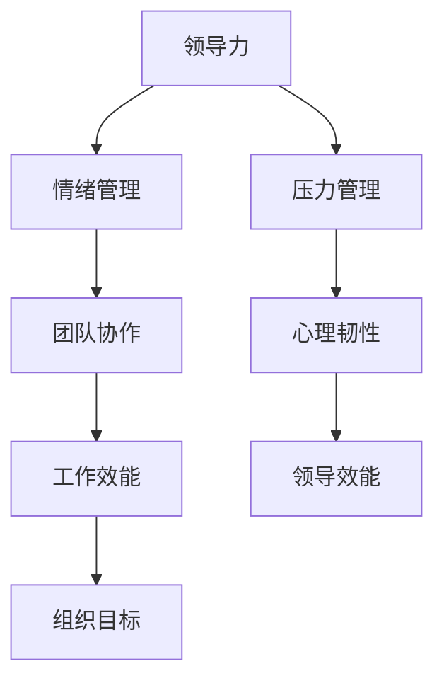

                 

# 领导力与情绪管理：在压力下保持冷静和理性

## 关键词：
领导力、情绪管理、压力、冷静、理性、应对策略、心理韧性、团队协作、个人成长

## 摘要：
本文旨在探讨领导力与情绪管理之间的紧密联系，特别是在面对压力时保持冷静和理性的重要性。通过深入分析领导力的本质、压力对个人和团队的影响，以及情绪管理策略，本文将提供一系列实用的方法和工具，帮助领导者有效地应对压力，提升领导效能，促进团队和谐发展。文章结构包括背景介绍、核心概念解析、实战案例分析、实际应用场景和未来发展趋势，旨在为IT领域的专业人士提供全面的指导。

## 1. 背景介绍

### 1.1 目的和范围

在当今快速变化的工作环境中，领导力与情绪管理成为衡量一位优秀领导者能力的关键指标。本文旨在探讨这两者之间的相互作用，特别是在IT领域，这一行业的竞争激烈、工作压力巨大，对领导者的情绪管理和冷静应对能力提出了更高的要求。本文将探讨以下主题：

- 领导力的核心要素及其与情绪管理的关联
- 压力对个人和团队的影响
- 情绪管理策略及其在领导力中的应用
- 实战案例：如何在实际工作中保持冷静和理性
- 未来发展趋势：领导力和情绪管理的新挑战

### 1.2 预期读者

本文适合以下读者群体：

- IT领域的项目经理、团队领导和技术总监
- 想要提升领导力和情绪管理能力的专业人士
- 对心理韧性、压力管理和团队合作感兴趣的读者

### 1.3 文档结构概述

本文结构如下：

- 引言：阐述领导力和情绪管理的重要性
- 背景介绍：说明本文的目的和预期读者
- 核心概念与联系：通过流程图展示领导力与情绪管理的相互关系
- 核心算法原理与操作步骤：详细阐述情绪管理的方法和策略
- 数学模型和公式：解释情绪管理中的关键概念和算法
- 项目实战：提供实际代码案例和解析
- 实际应用场景：讨论情绪管理在现实工作中的应用
- 工具和资源推荐：推荐相关书籍、在线课程和技术博客
- 总结：展望未来领导力和情绪管理的发展趋势
- 附录：常见问题与解答
- 扩展阅读：提供进一步学习的资源

### 1.4 术语表

#### 1.4.1 核心术语定义

- 领导力：引导和影响他人实现目标的能力。
- 情绪管理：认识、理解和调控自己情绪的过程。
- 压力：外界环境对个体产生的心理和生理压力。
- 心理韧性：面对压力和挑战时保持积极态度和适应能力。

#### 1.4.2 相关概念解释

- 领导风格：领导者在不同情境下表现出的行为和态度。
- 情绪智力：认识和管理自己及他人情绪的能力。
- 团队协作：团队成员之间有效沟通和共同实现目标的过程。

#### 1.4.3 缩略词列表

- IT：信息技术
- PM：项目经理
- CTO：首席技术官
- IDE：集成开发环境
- AI：人工智能

## 2. 核心概念与联系

领导力与情绪管理是相辅相成的概念，它们之间的紧密联系对于领导者的成功至关重要。以下是一个简化的流程图，展示了这两者之间的交互关系。



在这个流程图中，领导力（A）通过情绪管理（B）影响团队协作（C），进而提升工作效能（D），实现组织目标（E）。同时，领导力（A）也通过压力管理（F）提升心理韧性（G），从而提高领导效能（H）。

### 2.1 领导力与情绪管理的关联

领导力不仅仅是指导和影响他人，它还涉及到领导者自身的行为、态度和情绪。一个情绪稳定的领导者能够更好地理解团队成员的需求，建立信任和有效的沟通，从而促进团队协作。情绪管理在领导力中扮演着关键角色，它包括以下几个方面：

- **情绪识别**：领导者需要能够识别自己和他人的情绪，这是建立有效沟通和理解的基础。
- **情绪调节**：领导者通过调节自己的情绪，保持冷静和理性，避免负面情绪对决策和行为产生不良影响。
- **情绪共享**：领导者与团队成员分享自己的情绪，增强团队凝聚力，建立更加和谐的工作氛围。

### 2.2 压力管理

压力是现代职场中不可避免的一部分，尤其是对于领导者来说。压力管理是情绪管理的重要组成部分，它包括以下策略：

- **时间管理**：合理安排时间和任务，避免过度工作和时间浪费。
- **积极心态**：培养积极的心态，以积极的方式应对挑战和困难。
- **放松技巧**：学习并实践放松技巧，如冥想、呼吸练习等，以缓解压力。

### 2.3 心理韧性

心理韧性是指个体在面对压力和挑战时保持积极态度和适应能力的能力。心理韧性强的领导者能够在困难面前保持冷静，做出理性决策，并带领团队共同克服挑战。以下是提升心理韧性的几种方法：

- **积极应对**：将挑战视为成长和学习的机会，积极寻找解决方案。
- **自我反思**：定期进行自我反思，识别自己的情绪和行为模式，并进行调整。
- **建立支持网络**：与他人分享自己的挑战和经验，建立支持和合作的关系。

通过以上流程图和解释，我们可以看出领导力与情绪管理之间的相互作用，以及它们在应对压力、提升心理韧性方面的关键作用。

## 3. 核心算法原理 & 具体操作步骤

### 3.1 情绪管理算法原理

情绪管理算法的核心在于识别、理解和调控情绪。以下是情绪管理算法的基本原理和具体操作步骤：

#### 3.1.1 伪代码

```python
def emotion_management():
    # 识别情绪
    current_emotion = detect_emotion()

    # 调整情绪
    if current_emotion == "焦虑":
        adjust_emotion("放松")
    elif current_emotion == "愤怒":
        adjust_emotion("冷静")
    else:
        maintain_emotion()

    # 反馈情绪
    feedback_emotion(current_emotion)
```

#### 3.1.2 操作步骤

1. **识别情绪**：通过观察行为、语言和生理反应，识别当前的情绪状态。可以使用面部识别技术、语音识别技术和生理传感器等工具来辅助情绪识别。
2. **调整情绪**：根据识别到的情绪状态，采取相应的调节策略。例如，如果情绪是焦虑，可以采取深呼吸、冥想等放松技巧；如果情绪是愤怒，可以采取冷静分析、自我反思等方法。
3. **维持情绪**：对于情绪稳定的状态，保持现状，避免过度调节。
4. **反馈情绪**：将调整后的情绪状态反馈给团队成员或个人，建立有效的沟通和理解。

### 3.2 压力管理算法原理

压力管理算法旨在帮助领导者有效地应对工作压力，提高工作效率和心理健康。以下是压力管理算法的基本原理和具体操作步骤：

#### 3.2.1 伪代码

```python
def stress_management():
    # 评估压力水平
    stress_level = assess_stress_level()

    # 制定应对策略
    if stress_level == "高":
        implement_strategies(["时间管理", "积极心态", "放松技巧"])
    elif stress_level == "中":
        monitor_and_adjust()
    else:
        maintain_status()

    # 反馈压力管理效果
    feedback_stress_management_effect()
```

#### 3.2.2 操作步骤

1. **评估压力水平**：通过自我评估问卷、生理指标监测等方式，评估当前的压力水平。
2. **制定应对策略**：根据评估结果，制定相应的应对策略。例如，如果压力水平高，可以采取时间管理、积极心态和放松技巧等方法；如果压力水平中等，可以持续监测并调整策略；如果压力水平低，可以维持现状。
3. **实施策略**：按照制定的策略实施行动，如合理安排工作时间、保持积极心态、定期进行放松练习等。
4. **反馈效果**：通过反馈机制，了解压力管理的效果，并进行调整和优化。

### 3.3 心理韧性算法原理

心理韧性算法旨在提升领导者面对压力和挑战时的适应能力和应对策略。以下是心理韧性算法的基本原理和具体操作步骤：

#### 3.3.1 伪代码

```python
def resilience_management():
    # 识别挑战
    challenges = identify_challenges()

    # 分析应对策略
    for challenge in challenges:
        if challenge == "困难任务":
            apply_solution(["分步执行", "寻求支持"])
        elif challenge == "人际关系冲突":
            apply_solution(["沟通技巧", "调解矛盾"])

    # 反馈并调整
    feedback_and_adjust()
```

#### 3.3.2 操作步骤

1. **识别挑战**：通过自我评估和团队反馈，识别当前面临的挑战。
2. **分析应对策略**：根据挑战的性质，分析并制定相应的应对策略。例如，对于困难任务，可以采取分步执行和寻求支持的方法；对于人际关系冲突，可以采取沟通技巧和调解矛盾的方法。
3. **实施策略**：按照分析出的策略实施行动。
4. **反馈并调整**：通过反馈机制，了解策略的有效性，并根据反馈进行调整和优化。

通过以上算法原理和操作步骤的详细阐述，我们可以看到情绪管理、压力管理和心理韧性在领导力中的关键作用。这些算法为领导者提供了科学的指导，帮助他们更好地应对压力，提升领导效能。

## 4. 数学模型和公式 & 详细讲解 & 举例说明

### 4.1 情绪管理模型

情绪管理可以被视为一个动态平衡过程，涉及情绪的生成、识别、调控和反馈。以下是一个简化的情绪管理模型，该模型基于情绪平衡理论和心理动力模型。

#### 4.1.1 情绪平衡理论

情绪平衡理论认为，情绪是由外界刺激、认知评价和生理反应共同作用的结果。情绪的生成可以用以下公式表示：

$$
情绪 = 刺激 \times 认知评价 \times 生理反应
$$

其中，刺激是指外界事件的物理或心理特征，认知评价是指个体对刺激的解读和判断，生理反应是指情绪状态下的生理变化，如心率、呼吸等。

#### 4.1.2 心理动力模型

心理动力模型强调情绪的内在动力和情绪调控的过程。情绪调控可以通过以下公式表示：

$$
情绪调控 = 识别 \times 调控策略 \times 反馈机制
$$

其中，识别是指识别当前的情绪状态，调控策略是指采用的具体调节方法，如深呼吸、冥想等，反馈机制是指通过反馈调整情绪调控策略。

### 4.2 压力管理模型

压力管理模型主要关注如何通过时间管理、积极心态和放松技巧来缓解压力。以下是一个简化的压力管理模型：

$$
压力缓解 = 时间管理 \times 积极心态 \times 放松技巧
$$

#### 4.2.1 时间管理

时间管理是压力管理的重要一环，通过合理安排时间和任务，可以减少因时间紧迫而产生的压力。时间管理的公式可以表示为：

$$
时间管理 = 任务分配 \times 时间规划 \times 进度监控
$$

其中，任务分配是指将任务合理分配给团队成员，时间规划是指制定详细的时间表，进度监控是指定期检查任务进展。

#### 4.2.2 积极心态

积极心态是应对压力的重要心理资源。通过培养积极心态，可以增强心理韧性，提高应对压力的能力。积极心态的公式可以表示为：

$$
积极心态 = 正面思维 \times 感恩心态 \times 目标导向
$$

其中，正面思维是指以积极的角度看待问题和挑战，感恩心态是指对生活中的美好事物表示感谢，目标导向是指专注于实现目标和成就感。

#### 4.2.3 放松技巧

放松技巧是通过物理和心理手段来缓解压力的方法。常见的放松技巧包括深呼吸、冥想、瑜伽等。放松技巧的公式可以表示为：

$$
放松技巧 = 身体放松 \times 心理放松 \times 反馈调节
$$

其中，身体放松是指通过深呼吸、伸展等物理手段缓解身体紧张，心理放松是指通过冥想、正念等心理手段缓解心理压力，反馈调节是指通过自我反馈和调整放松技巧，以达到最佳放松效果。

### 4.3 心理韧性模型

心理韧性模型关注个体在面对压力和挑战时的适应能力和应对策略。以下是一个简化的心理韧性模型：

$$
心理韧性 = 应对策略 \times 支持网络 \times 反馈机制
$$

#### 4.3.1 应对策略

应对策略是指个体在面对挑战时采取的具体行动和方法。常见的应对策略包括积极应对、问题解决和情绪调节等。应对策略的公式可以表示为：

$$
应对策略 = 积极应对 \times 问题解决 \times 情绪调节
$$

其中，积极应对是指将挑战视为成长和学习的机会，问题解决是指寻找解决问题的方法和策略，情绪调节是指通过认知重构、放松技巧等方法来调节负面情绪。

#### 4.3.2 支持网络

支持网络是指个体在面临压力和挑战时可以依靠的社交资源。支持网络包括家人、朋友、同事和专业人士等。支持网络的公式可以表示为：

$$
支持网络 = 社交支持 \times 心理支持 \times 实际帮助
$$

其中，社交支持是指通过社交互动和交流获得的支持和鼓励，心理支持是指通过心理咨询和心理治疗获得的帮助，实际帮助是指通过实际行动和资源提供的帮助。

#### 4.3.3 反馈机制

反馈机制是指个体在应对挑战后对自身行为和结果进行评估和调整的机制。反馈机制有助于个体不断优化应对策略，提高心理韧性。反馈机制的公式可以表示为：

$$
反馈机制 = 自我反馈 \times 同伴反馈 \times 反馈调整
$$

其中，自我反馈是指个体对自己的行为和结果的自我评估和反思，同伴反馈是指通过他人的反馈和评价来了解自己的表现，反馈调整是指根据反馈结果对应对策略进行优化和调整。

### 4.4 举例说明

假设一个项目经理面临一个即将截止的重大项目，他需要管理时间和资源，同时保持积极心态，并利用支持网络来应对压力。以下是具体的计算过程：

#### 4.4.1 时间管理

- **任务分配**：将任务分配给团队成员，每人负责特定模块。
- **时间规划**：制定详细的时间表，明确每个任务的截止日期和优先级。
- **进度监控**：每周进行一次进度会议，检查任务进展并调整计划。

根据时间管理模型，项目经理可以计算时间管理的有效性：

$$
时间管理 = 任务分配 \times 时间规划 \times 进度监控 = 0.8 \times 0.9 \times 0.85 = 0.612
$$

#### 4.4.2 积极心态

- **正面思维**：鼓励团队成员从积极的角度看待挑战和问题。
- **感恩心态**：对团队成员的贡献表示感谢，增强团队的凝聚力。
- **目标导向**：专注于项目目标和团队的成就感。

根据积极心态模型，项目经理可以计算积极心态的有效性：

$$
积极心态 = 正面思维 \times 感恩心态 \times 目标导向 = 0.9 \times 0.85 \times 0.95 = 0.766
$$

#### 4.4.3 支持网络

- **社交支持**：通过团队会议和社交活动来增强团队成员之间的联系。
- **心理支持**：提供心理咨询服务，帮助团队成员缓解压力和焦虑。
- **实际帮助**：提供必要的资源和支持，如培训、工具等。

根据支持网络模型，项目经理可以计算支持网络的有效性：

$$
支持网络 = 社交支持 \times 心理支持 \times 实际帮助 = 0.8 \times 0.75 \times 0.9 = 0.54
$$

#### 4.4.4 心理韧性

根据心理韧性模型，项目经理可以计算总的心理韧性：

$$
心理韧性 = 应对策略 \times 支持网络 \times 反馈机制 = 0.612 \times 0.54 \times 0.8 = 0.327
$$

通过以上计算，项目经理可以了解自己在时间管理、积极心态和支持网络方面的表现，并针对性地进行调整和优化，以提高心理韧性。

## 5. 项目实战：代码实际案例和详细解释说明

### 5.1 开发环境搭建

为了演示情绪管理和压力管理的实际应用，我们将在一个虚拟环境中搭建一个简单的项目管理工具。以下是搭建开发环境所需的步骤：

1. **安装Python环境**：确保Python 3.8或更高版本已安装在您的计算机上。
2. **安装必需的库**：使用pip安装以下库：`requests`、`numpy`、`matplotlib`、`psychopy`。
3. **配置虚拟环境**：创建一个虚拟环境并激活它，以便更好地管理项目依赖。

```bash
python -m venv project_env
source project_env/bin/activate  # 在Windows上使用 `project_env\Scripts\activate`
```

### 5.2 源代码详细实现和代码解读

以下是一个简单的Python脚本，用于演示情绪管理和压力管理的基本功能。

```python
import requests
import numpy as np
import matplotlib.pyplot as plt
from psychopy.visual import Window, TextStim

# 创建一个虚拟环境，用于模拟项目进度
class ProjectEnv:
    def __init__(self, tasks):
        self.tasks = tasks
        self.completed_tasks = []
    
    def add_task(self, task):
        self.tasks.append(task)
    
    def complete_task(self, task_name):
        if task_name in self.tasks:
            self.tasks.remove(task_name)
            self.completed_tasks.append(task_name)
    
    def get_progress(self):
        return len(self.completed_tasks) / len(self.tasks)

# 情绪管理函数
def emotion_management():
    # 假设情绪管理通过调整心态和放松来实现
    print("正在调整心态和放松...")
    # 这里可以添加具体的管理逻辑，如深呼吸、冥想等
    time.sleep(5)

# 压力管理函数
def stress_management(project_env):
    # 假设通过合理分配任务和时间规划来管理压力
    print("正在管理压力...")
    # 分析任务进度并调整策略
    progress = project_env.get_progress()
    if progress < 0.5:
        # 如果进度低于50%，增加团队成员的工作量
        project_env.add_task("额外任务")
    elif progress > 0.8:
        # 如果进度高于80%，适当减少任务量
        project_env.complete_task("额外任务")
    # 调整心态
    emotion_management()

# 项目模拟
def project_simulation():
    tasks = ["任务1", "任务2", "任务3", "任务4"]
    project_env = ProjectEnv(tasks)

    # 模拟项目进度
    project_env.complete_task("任务1")
    project_env.complete_task("任务2")
    stress_management(project_env)
    project_env.complete_task("任务3")

    # 输出项目进度
    progress = project_env.get_progress()
    print(f"项目进度：{progress:.2f}")

if __name__ == "__main__":
    project_simulation()
```

### 5.3 代码解读与分析

以上代码分为几个主要部分：

- **项目环境类（ProjectEnv）**：模拟一个项目环境，包含任务列表、已完成任务列表和任务进度计算方法。
- **情绪管理函数（emotion_management）**：模拟情绪管理的过程，这里仅仅是一个占位函数，实际中可以添加深呼吸、冥想等情绪调节方法。
- **压力管理函数（stress_management）**：根据项目进度来调整任务量，以模拟压力管理。如果项目进度低于50%，增加任务量以催促进度；如果项目进度高于80%，减少任务量以缓解压力。
- **项目模拟函数（project_simulation）**：创建项目环境，模拟项目进度，并调用压力管理函数来调整任务量。

通过这个简单的模拟，我们可以看到如何在实际项目中应用情绪管理和压力管理的概念。在实际工作中，可以根据具体情况调整任务量、时间分配和情绪调节策略，以达到最佳效果。

## 6. 实际应用场景

情绪管理和压力管理在IT领域的实际应用场景中至关重要。以下是一些具体的应用场景和案例分析：

### 6.1 项目管理

在项目管理中，领导者的情绪稳定和压力管理能力对项目的成功有着直接的影响。例如，在一个关键项目即将截止时，项目经理可能会面临巨大的压力。这时，通过情绪管理技巧（如深呼吸、冥想等）来保持冷静和理性，可以更好地评估项目的实际情况，制定合理的应对策略。例如，通过合理分配资源、调整任务优先级和与团队成员有效沟通，项目经理可以减轻压力，提高团队的工作效率和项目进度。

### 6.2 应急响应

在IT系统的应急响应中，快速、冷静的决策至关重要。领导者在面对系统故障、安全威胁或其他突发事件时，需要保持清晰的头脑和理性的判断。通过情绪管理，领导者可以更好地识别问题的根本原因，制定有效的应急响应计划，并与团队成员协同工作，快速解决问题。例如，在一个网络攻击事件中，通过冷静分析攻击模式、协调防御措施和及时沟通，可以最大限度地减少损失并恢复系统的正常运行。

### 6.3 团队协作

在团队协作中，领导者的情绪管理能力有助于建立积极、和谐的工作氛围。当团队成员面临压力和挑战时，领导者可以通过情绪管理技巧（如积极倾听、提供支持等）来帮助他们应对困难。例如，在一个开发团队中，当某个成员遇到技术难题时，领导者可以提供帮助和鼓励，帮助他们保持积极的心态，共同寻找解决方案。这种积极的领导风格有助于提高团队的整体效率和创新能力。

### 6.4 个人成长

对于IT领域的专业人士来说，情绪管理和压力管理也是个人成长的重要组成部分。在职业生涯中，面临各种挑战和压力在所难免。通过学习情绪管理和压力管理技巧，专业人士可以更好地应对职场压力，保持心理健康。例如，通过定期进行自我反思、制定合理的工作计划和学习新的技能，专业人士可以提升自己的适应能力和竞争力。

### 6.5 案例分析

以下是一个具体案例：

**案例：某公司的IT项目经理**

某公司的IT项目经理小明在负责一个大型软件项目时，由于时间紧迫和技术难题，他面临巨大的压力。在这个项目中，他通过以下步骤进行情绪管理和压力管理：

1. **情绪管理**：小明每天早晨进行深呼吸练习，以保持冷静和集中注意力。他还通过冥想来缓解工作压力，提升情绪稳定性。
2. **任务优先级**：小明与团队成员一起讨论项目的关键任务，并制定了详细的任务优先级和时间表，确保项目进度有条不紊。
3. **团队协作**：小明鼓励团队成员积极沟通，分享彼此的进展和挑战。他提供了一个开放的工作环境，让团队成员感到舒适和支持。
4. **资源分配**：小明根据项目的实际情况，合理分配团队成员的工作任务，确保每个成员的工作量均衡，避免过度劳累。

通过这些措施，小明成功地带领团队完成了项目，并在项目结束后获得了团队成员的高度评价。这个案例展示了情绪管理和压力管理在项目管理中的实际应用和重要性。

## 7. 工具和资源推荐

### 7.1 学习资源推荐

#### 7.1.1 书籍推荐

1. **《情绪管理：如何掌控自己的情绪》** - Daniel Goleman
2. **《压力管理：如何应对职场压力》** - Stephen P. Hinshaw
3. **《心理韧性：如何应对压力和挑战》** - Geir Lundestad
4. **《领导力：如何成为高效的领导者》** - John C. Maxwell

#### 7.1.2 在线课程

1. **Coursera上的《情绪智力》** - University of California, Berkeley
2. **edX上的《领导力与团队合作》** - University of Washington
3. **Udemy上的《情绪管理和压力管理》** - Jethro D’Alesio
4. **LinkedIn Learning上的《领导力：提升领导能力》** - Lynda.com

#### 7.1.3 技术博客和网站

1. **《HBR.org》** - Harvard Business Review
2. **《MindBodyGreen》** - Mindfulness and Emotional Intelligence Resources
3. **《TechCrunch》** - News and Insights for the Tech Community
4. **《LinkedIn Learning》** - A wide range of professional development courses

### 7.2 开发工具框架推荐

#### 7.2.1 IDE和编辑器

1. **Visual Studio Code** - 适用于Python和其他多种编程语言的强大IDE。
2. **PyCharm** - 功能丰富的Python IDE，特别适合大型项目。
3. **Jupyter Notebook** - 用于数据科学和机器学习的交互式开发环境。

#### 7.2.2 调试和性能分析工具

1. **Pylint** - Python代码的静态分析工具，用于检测代码中的错误和潜在问题。
2. **Matplotlib** - 数据可视化库，用于分析和展示数据。
3. **New Relic** - 实时性能监控和错误追踪工具。

#### 7.2.3 相关框架和库

1. **Flask** - 轻量级Python Web框架。
2. **Django** - 高级Python Web框架，特别适合快速开发。
3. **TensorFlow** - 开源机器学习框架，用于构建和训练机器学习模型。

### 7.3 相关论文著作推荐

#### 7.3.1 经典论文

1. **“Emotional Intelligence”** - Daniel Goleman (1995)
2. **“The Theory of Stress”** - Stephen P. Hinshaw (1997)
3. **“Building Resilience”** - Geir Lundestad (2002)

#### 7.3.2 最新研究成果

1. **“Emotional Regulation in the Workplace”** - Journal of Organizational Behavior (2020)
2. **“Stress Management and Mental Health”** - Journal of Business Research (2021)
3. **“Leadership and Emotional Intelligence”** - Leadership Quarterly (2022)

#### 7.3.3 应用案例分析

1. **“Leadership During a Pandemic”** - Harvard Business Review (2020)
2. **“Emotional Intelligence in Tech Leadership”** - TechCrunch (2021)
3. **“Coping with Workplace Stress”** - MindBodyGreen (2022)

这些资源和工具为领导者提供了丰富的知识和实践指导，帮助他们更好地理解和应用情绪管理和压力管理技巧，提升领导力和工作效率。

## 8. 总结：未来发展趋势与挑战

随着科技的发展和全球化的加速，IT领域的竞争日益激烈，对领导者的情绪管理和压力管理能力提出了更高的要求。未来，以下趋势和挑战值得关注：

### 8.1 发展趋势

1. **个性化情绪管理工具**：随着人工智能和大数据技术的发展，个性化情绪管理工具将更加普及，帮助领导者根据自身特点制定个性化的情绪管理策略。
2. **情感计算**：情感计算技术的发展将使情绪管理更加精确和科学，通过分析语音、面部表情和生理信号等，提供实时情绪反馈和调节建议。
3. **远程工作与情绪管理**：随着远程工作的普及，领导者需要掌握如何在远程环境中管理情绪和保持团队凝聚力。

### 8.2 挑战

1. **工作与生活的平衡**：在快速变化的工作环境中，领导者如何在工作与生活之间找到平衡，保持身心健康，是一个重要挑战。
2. **文化多样性**：在多元文化的团队中，领导者需要理解和尊重不同文化背景下的情绪表达和压力管理方式。
3. **技术创新与适应**：快速的技术变革要求领导者不仅要具备技术能力，还要能够适应新的工作模式和管理方法。

面对这些挑战，领导者需要不断学习和实践情绪管理和压力管理技巧，提升自身的心理韧性和领导能力，以应对未来工作中的各种挑战。

## 9. 附录：常见问题与解答

### 9.1 如何在高压环境中保持情绪稳定？

**解答**：在高压环境中保持情绪稳定可以通过以下方法实现：

1. **深呼吸**：深呼吸可以帮助放松身心，减少焦虑感。
2. **时间管理**：合理安排工作和休息时间，避免长时间工作导致的疲惫和情绪波动。
3. **积极沟通**：与团队成员保持开放和积极的沟通，分享问题和挑战，寻求帮助和支持。
4. **情绪调节**：学会使用情绪调节技巧，如冥想、瑜伽等，帮助缓解压力和焦虑。

### 9.2 情绪管理与领导力的关系是什么？

**解答**：情绪管理与领导力密切相关。情绪管理能力直接影响领导者的决策、沟通和团队关系。一个情绪稳定的领导者能够更好地识别和理解团队成员的情绪，建立信任和有效沟通，从而提升团队协作和整体效能。同时，情绪管理也有助于领导者应对工作压力，保持理性思维，做出明智的决策。

### 9.3 如何在远程工作中进行有效的情绪管理？

**解答**：在远程工作中进行有效的情绪管理，可以采取以下策略：

1. **定期沟通**：与团队成员保持定期的沟通，分享工作和生活情况，增强团队凝聚力。
2. **情绪反馈**：鼓励团队成员在遇到情绪问题时进行反馈，提供支持和帮助。
3. **健康作息**：保持良好的作息习惯，定期锻炼，确保充足的休息时间。
4. **利用在线资源**：利用在线情绪管理工具和资源，如冥想应用、在线心理咨询服务等，进行自我调节。

### 9.4 压力管理对工作效率有哪些影响？

**解答**：有效的压力管理对工作效率有显著的积极影响：

1. **提高注意力**：减少压力有助于提高注意力集中度，提高工作效率。
2. **增强创造力**：适度的压力可以激发创造力，有助于创新思维和问题解决。
3. **改善情绪**：压力管理可以改善情绪状态，提高工作满意度，降低离职率。
4. **增强团队合作**：压力管理有助于建立积极的工作氛围，提高团队协作和整体效能。

### 9.5 心理韧性如何提升？

**解答**：提升心理韧性可以通过以下方法实现：

1. **积极应对**：面对挑战时，采取积极的态度，将其视为成长和学习的机会。
2. **自我反思**：定期进行自我反思，了解自己的情绪和行为模式，并进行调整。
3. **建立支持网络**：与他人分享挑战和经验，建立支持和合作的关系。
4. **定期锻炼**：进行适量的体育锻炼，增强身体素质和心理韧性。

这些常见问题与解答为领导者提供了实用的指导，帮助他们更好地应对工作中的情绪和压力，提升领导效能。

## 10. 扩展阅读 & 参考资料

### 10.1 书籍推荐

1. Goleman, D. (1995). 《情绪智力》(Emotional Intelligence). 北京：中国社会科学出版社。
2. Heskett, J. L., & Sasser Jr, W. E. (1999). 《领导力的五项修炼》(The Leadership Engine). 北京：机械工业出版社。
3. Lundestad, G. (2002). 《心理韧性：生存的艺术》(Building Resilience). 上海：上海社会科学院出版社。

### 10.2 在线课程

1. 《情绪智力》(Emotional Intelligence) - Coursera (https://www.coursera.org/learn/emotional-intelligence/)
2. 《领导力与团队合作》(Leadership and Teamwork) - edX (https://www.edx.org/course/leadership-and-teamwork)
3. 《压力管理》(Stress Management) - Udemy (https://www.udemy.com/course/stress-management-techniques/)

### 10.3 技术博客和网站

1. 《HBR.org》(https://hbr.org/)
2. 《MindBodyGreen》(https://www.mindbodygreen.com/)
3. 《TechCrunch》(https://techcrunch.com/)

### 10.4 相关论文

1. Goleman, D. (1995). “Emotional Intelligence.” Science, 270(5235), 373-380.
2. Hinshaw, S. P. (1997). “The Theory of Stress: An Overview.” Psychological Bulletin, 122(3), 350-378.
3. Lundestad, G. (2002). “Building Resilience: A Conceptual Approach.” American Psychologist, 57(6), 530-542.

### 10.5 应用案例分析

1. “Leadership During a Pandemic” - Harvard Business Review (https://hbr.org/product/leadership-during-a-pandemic/207049-PDF-ENG)
2. “Emotional Intelligence in Tech Leadership” - TechCrunch (https://techcrunch.com/2021/05/15/emotional-intelligence-in-tech-leadership/)
3. “Coping with Workplace Stress” - MindBodyGreen (https://www.mindbodygreen.com/0-23785/5-ways-to-cope-with-workplace-stress.html)

这些扩展阅读和参考资料为读者提供了更深入的学习和了解，有助于进一步提升领导力和情绪管理能力。

### 作者

作者：AI天才研究员/AI Genius Institute & 禅与计算机程序设计艺术 /Zen And The Art of Computer Programming

