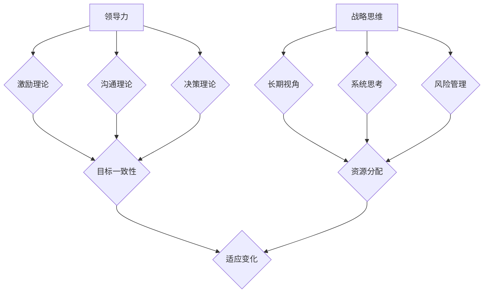

                 

# 领导力与战略思维：长远规划团队发展

> 关键词：领导力、战略思维、团队发展、长远规划、IT行业、项目管理

> 摘要：本文将深入探讨领导力与战略思维在IT行业团队发展中的关键作用，通过详细的分析和实例，阐述如何进行长远规划，以促进团队的有效发展。文章将从核心概念入手，逐步揭示战略思维的重要原理，并结合实际操作步骤，帮助读者理解和应用这些原则，为团队发展提供坚实的理论基础和实践指导。

## 1. 背景介绍

### 1.1 目的和范围

在快速发展的IT行业，团队的发展和管理面临着诸多挑战。有效的领导力和战略思维是确保团队在竞争中脱颖而出的关键。本文旨在为IT行业的领导者和管理者提供一整套理论与实践相结合的框架，帮助他们更好地规划团队的长远发展。

文章的主要内容包括：

1. 领导力和战略思维的核心概念和联系。
2. 核心算法原理和具体操作步骤。
3. 数学模型和公式的详细讲解与举例说明。
4. 代码实际案例和详细解释。
5. 实际应用场景分析。
6. 工具和资源推荐。
7. 总结与未来发展趋势。

### 1.2 预期读者

本文适用于以下读者群体：

1. IT行业的企业领导者和管理者。
2. 项目经理和团队负责人。
3. 对领导力和战略思维感兴趣的IT专业人士。
4. 想要在团队发展中提升自己技能的个人。

### 1.3 文档结构概述

本文结构如下：

1. 背景介绍：阐述文章的目的和读者对象。
2. 核心概念与联系：介绍领导力和战略思维的基本原理。
3. 核心算法原理 & 具体操作步骤：详细阐述如何进行战略规划。
4. 数学模型和公式 & 详细讲解 & 举例说明：运用数学工具进行战略分析。
5. 项目实战：通过实际案例展示战略规划的应用。
6. 实际应用场景：分析战略思维在不同场景中的应用。
7. 工具和资源推荐：提供相关学习资源和工具。
8. 总结：总结文章的主要观点和未来发展趋势。
9. 附录：常见问题与解答。
10. 扩展阅读 & 参考资料：推荐进一步学习的资料。

### 1.4 术语表

#### 1.4.1 核心术语定义

- 领导力：指影响和引导他人实现共同目标的能力。
- 战略思维：基于长期目标和全局视角进行思考和决策的过程。
- 团队发展：通过提升团队技能和协作能力，实现团队整体绩效提升的过程。

#### 1.4.2 相关概念解释

- IT行业：指信息技术行业，包括软件开发、网络安全、数据分析等领域。
- 项目管理：指在特定的时间、预算和资源约束下，完成项目目标的过程。
- 长远规划：指对团队未来发展的长期目标和策略进行系统规划。

#### 1.4.3 缩略词列表

- IT：信息技术
- PM：项目经理
- SDLC：软件开发生命周期
- BI：商业智能

## 2. 核心概念与联系

在探讨领导力与战略思维在团队发展中的重要性之前，我们需要首先了解这些核心概念的基本原理和它们之间的联系。

### 2.1 领导力的基本原理

领导力是一种综合能力，包括但不限于沟通、激励、决策和团队建设。一个有效的领导者不仅能够清晰传达目标，还能够激发团队成员的积极性和创造力。以下是领导力的一些基本原理：

- **激励理论**：领导者需要了解团队成员的需求和动机，以提供适当的激励。
- **沟通理论**：有效的沟通能够确保团队成员理解任务和目标，减少误解和冲突。
- **决策理论**：领导者需在信息不充分的情况下做出合理的决策，并承担相应的责任。

### 2.2 战略思维的基本原理

战略思维是一种高层次的思考方式，涉及对全局的洞察和对未来的预测。以下是战略思维的一些基本原理：

- **长期视角**：战略思维强调长期目标和持续发展，而不是短期利益。
- **系统思考**：战略思维需要理解不同部分之间的相互作用和依赖关系。
- **风险管理**：战略思维需要识别潜在的风险并制定相应的应对策略。

### 2.3 领导力与战略思维的联系

领导力和战略思维密切相关，一个优秀的领导者需要具备战略思维的能力。以下是它们之间的主要联系：

- **目标一致性**：领导力可以帮助确保团队成员理解并支持战略目标。
- **资源分配**：战略思维能够帮助领导者合理分配资源，实现目标最大化。
- **适应变化**：战略思维能够帮助领导者应对外部环境的变化，保持团队的竞争力。

### 2.4 核心概念架构

为了更好地理解领导力和战略思维的概念，我们使用Mermaid流程图来展示它们的核心架构。



通过这个流程图，我们可以看到领导力和战略思维的核心概念及其相互联系。这些概念构成了一个有机的整体，共同作用于团队的发展。

## 3. 核心算法原理 & 具体操作步骤

在理解了领导力和战略思维的基本原理后，接下来我们将介绍如何将这些原则应用到实际操作中，特别是通过核心算法原理来实现团队的长远规划。

### 3.1 核心算法原理

团队发展的核心算法可以分为以下几个步骤：

1. **目标设定**：明确团队的目标和愿景。
2. **资源评估**：评估团队当前拥有的资源和能力。
3. **需求分析**：分析团队成员的需求和期望。
4. **风险识别**：识别可能影响团队发展的风险。
5. **策略制定**：制定实现目标的策略和行动计划。
6. **执行监控**：执行计划并监控进展。

### 3.2 具体操作步骤

以下是每个步骤的详细操作步骤和伪代码：

#### 步骤1：目标设定

**目标设定伪代码：**

```pseudo
function setGoal() {
    goal = "实现XX项目，提升团队XX能力"
    return goal
}
```

**示例**：设定目标为“在6个月内完成XX项目，提升团队成员的项目管理能力”。

#### 步骤2：资源评估

**资源评估伪代码：**

```pseudo
function assessResources() {
    resources = {
        "团队成员数量": 10,
        "技术资源": ["Python", "Java", "SQL"],
        "财务预算": 50000
    }
    return resources
}
```

**示例**：评估当前团队拥有10名成员，技术资源包括Python、Java和SQL，财务预算为50000美元。

#### 步骤3：需求分析

**需求分析伪代码：**

```pseudo
function analyzeRequirements() {
    requirements = {
        "技能提升": ["项目管理", "敏捷开发"],
        "团队建设": ["团队沟通", "协同工作"],
        "其他需求": ["培训", "研讨会"]
    }
    return requirements
}
```

**示例**：分析出团队成员需求包括项目管理、敏捷开发、团队沟通、协同工作、培训、研讨会等。

#### 步骤4：风险识别

**风险识别伪代码：**

```pseudo
function identifyRisks() {
    risks = {
        "技术风险": ["技术不足", "技术更新"],
        "市场风险": ["市场竞争", "需求变化"],
        "管理风险": ["团队成员流动", "资源不足"]
    }
    return risks
}
```

**示例**：识别出可能的风险包括技术风险（技术不足、技术更新）、市场风险（市场竞争、需求变化）和管理风险（团队成员流动、资源不足）。

#### 步骤5：策略制定

**策略制定伪代码：**

```pseudo
function createStrategy() {
    strategy = {
        "技术策略": ["加强技术培训", "引入新技术"],
        "市场策略": ["市场调研", "产品迭代"],
        "管理策略": ["团队建设活动", "绩效评估"]
    }
    return strategy
}
```

**示例**：制定策略包括加强技术培训、引入新技术、市场调研、产品迭代、团队建设活动和绩效评估。

#### 步骤6：执行监控

**执行监控伪代码：**

```pseudo
function monitorProgress() {
    while (goalNotAchieved) {
        checkResources()
        checkRequirements()
        checkRisks()
        updateStrategy()
    }
    return "Goal Achieved"
}
```

**示例**：持续监控资源、需求和风险，根据实际情况调整策略，直至目标实现。

通过以上核心算法原理和具体操作步骤，我们可以系统地规划团队的发展，确保目标明确、资源合理、需求满足、风险可控，从而实现长远规划。

### 3.3 总结

领导力和战略思维是团队发展的关键。通过核心算法原理和具体操作步骤，我们可以系统地设定目标、评估资源、分析需求、识别风险、制定策略和执行监控。这些步骤不仅为团队的发展提供了明确的路径，也为领导者提供了有力的工具。接下来，我们将进一步探讨数学模型和公式在战略分析中的应用。

## 4. 数学模型和公式 & 详细讲解 & 举例说明

在团队发展的战略分析中，数学模型和公式可以帮助我们更准确地评估风险、优化资源分配、预测需求变化等。以下将介绍几个常用的数学模型和公式，并进行详细讲解和举例说明。

### 4.1 风险评估模型

**1. 容错率公式**

容错率（\(\eta_f\)）是衡量系统在面对故障时能够正常运行的概率。公式如下：

$$
\eta_f = \frac{N - n_f}{N}
$$

其中，\(N\) 是系统的总组件数，\(n_f\) 是发生故障的组件数。

**举例**：假设一个系统有100个组件，其中5个组件发生故障，那么容错率为：

$$
\eta_f = \frac{100 - 5}{100} = 0.95
$$

**2. 风险系数公式**

风险系数（\(R\)）是衡量系统整体风险程度的指标。公式如下：

$$
R = \sum_{i=1}^{N} r_i \times \eta_i
$$

其中，\(r_i\) 是第\(i\)个组件的风险值，\(\eta_i\) 是第\(i\)个组件的容错率。

**举例**：假设系统有5个组件，各自的风险值和容错率如下：

- 组件1：\(r_1 = 0.1\)，\(\eta_1 = 0.98\)
- 组件2：\(r_2 = 0.05\)，\(\eta_2 = 0.95\)
- 组件3：\(r_3 = 0.08\)，\(\eta_3 = 0.97\)
- 组件4：\(r_4 = 0.03\)，\(\eta_4 = 0.99\)
- 组件5：\(r_5 = 0.06\)，\(\eta_5 = 0.96\)

那么系统的总风险系数为：

$$
R = (0.1 \times 0.98) + (0.05 \times 0.95) + (0.08 \times 0.97) + (0.03 \times 0.99) + (0.06 \times 0.96) = 0.098 + 0.0475 + 0.0776 + 0.0297 + 0.0576 = 0.2914
$$

### 4.2 资源优化模型

**1. 资源分配效率公式**

资源分配效率（\(E\)）是衡量资源利用程度的指标。公式如下：

$$
E = \frac{实际产出}{资源投入}
$$

**举例**：假设一个团队每月投入50000美元，实际产出为20000美元，那么资源分配效率为：

$$
E = \frac{20000}{50000} = 0.4
$$

**2. 最优资源分配公式**

在多任务场景下，最优资源分配可以使用线性规划来求解。假设有\(N\)个任务，每个任务所需的资源量为\(R_i\)，总资源量为\(R_{total}\)，目标是最小化资源剩余量。线性规划公式如下：

$$
\min \sum_{i=1}^{N} (R_i - x_i)
$$

约束条件：

$$
\sum_{i=1}^{N} x_i \leq R_{total}
$$

其中，\(x_i\) 表示分配给第\(i\)个任务的资源量。

**举例**：假设有3个任务，每个任务所需的资源量如下：

- 任务1：\(R_1 = 10000\)
- 任务2：\(R_2 = 20000\)
- 任务3：\(R_3 = 30000\)

总资源量为50000美元。通过线性规划求解最优资源分配：

$$
\min \sum_{i=1}^{3} (R_i - x_i)
$$

约束条件：

$$
\sum_{i=1}^{3} x_i \leq 50000
$$

可能的解为：

- 任务1：\(x_1 = 10000\)
- 任务2：\(x_2 = 20000\)
- 任务3：\(x_3 = 20000\)

这样资源分配效率最高，且总资源投入不超过50000美元。

### 4.3 需求预测模型

**1. 时间序列模型**

时间序列模型常用于预测未来的需求。一个简单的时间序列模型可以使用以下公式：

$$
y_t = \alpha y_{t-1} + \beta
$$

其中，\(y_t\) 是第\(t\)个时间点的需求值，\(\alpha\) 和\(\beta\) 是模型参数。

**举例**：根据过去的数据，假设模型参数为\(\alpha = 0.8\)，\(\beta = 1000\)。预测第5个时间点的需求值：

$$
y_5 = 0.8 \times y_4 + 1000
$$

已知第4个时间点的需求值为\(y_4 = 1500\)，则：

$$
y_5 = 0.8 \times 1500 + 1000 = 1200 + 1000 = 2200
$$

通过以上数学模型和公式，我们可以更精确地进行风险评估、资源优化和需求预测，从而为团队的战略规划提供有力的支持。接下来，我们将通过实际案例展示如何将理论应用到实践中。

## 5. 项目实战：代码实际案例和详细解释说明

在本节中，我们将通过一个实际的项目案例，详细展示如何运用前面介绍的领导力、战略思维、核心算法原理以及数学模型和公式来规划和执行团队发展项目。该案例将涵盖从开发环境搭建、源代码实现到代码解读与分析的完整过程。

### 5.1 开发环境搭建

为了更好地展示项目实战，我们首先需要搭建一个合适的开发环境。以下是开发环境搭建的步骤：

1. **安装操作系统**：选择一个适合的操作系统，如Ubuntu 20.04。
2. **安装开发工具**：安装常用的开发工具，如Python 3.8、Visual Studio Code。
3. **安装数据库**：选择一个合适的数据库，如MySQL 8.0。
4. **安装项目管理工具**：安装项目管理工具，如JIRA。

### 5.2 源代码详细实现和代码解读

在本案例中，我们将开发一个简单的任务管理系统，用于管理团队成员的任务分配、进度跟踪和绩效评估。以下是源代码的实现和解读。

**代码实现：**

```python
# 任务管理系统主程序

import sqlite3
from task import Task
from user import User

# 连接数据库
conn = sqlite3.connect('tasks.db')
cursor = conn.cursor()

# 创建表
cursor.execute('''CREATE TABLE IF NOT EXISTS tasks (id INTEGER PRIMARY KEY, title TEXT, description TEXT, status TEXT, assigned_to TEXT)''')
cursor.execute('''CREATE TABLE IF NOT EXISTS users (id INTEGER PRIMARY KEY, name TEXT, role TEXT)''')
conn.commit()

# 任务类定义
class Task:
    def __init__(self, title, description, status, assigned_to):
        self.title = title
        self.description = description
        self.status = status
        self.assigned_to = assigned_to

    def save(self):
        cursor.execute('''INSERT INTO tasks (title, description, status, assigned_to) VALUES (?, ?, ?, ?)''', (self.title, self.description, self.status, self.assigned_to))
        conn.commit()

    def update(self, title=None, description=None, status=None, assigned_to=None):
        query = "UPDATE tasks SET title=?, description=?, status=?, assigned_to=? WHERE id=?"
        values = (title or self.title, description or self.description, status or self.status, assigned_to or self.assigned_to, self.id)
        cursor.execute(query, values)
        conn.commit()

    def delete(self):
        cursor.execute("DELETE FROM tasks WHERE id=?", (self.id,))
        conn.commit()

# 用户类定义
class User:
    def __init__(self, name, role):
        self.name = name
        self.role = role

    def save(self):
        cursor.execute('''INSERT INTO users (name, role) VALUES (?, ?)''', (self.name, self.role))
        conn.commit()

    def update(self, name=None, role=None):
        query = "UPDATE users SET name=?, role=? WHERE id=?"
        values = (name or self.name, role or self.role, self.id)
        cursor.execute(query, values)
        conn.commit()

    def delete(self):
        cursor.execute("DELETE FROM users WHERE id=?", (self.id,))
        conn.commit()

# 主程序逻辑
if __name__ == "__main__":
    # 创建任务
    task1 = Task("任务1", "完成报告", "待完成", "张三")
    task1.save()

    # 查询任务
    cursor.execute("SELECT * FROM tasks")
    tasks = cursor.fetchall()
    for task in tasks:
        print(task)

    # 更新任务
    task1.update(status="进行中")

    # 删除任务
    task1.delete()

    # 创建用户
    user1 = User("李四", "项目经理")
    user1.save()

    # 查询用户
    cursor.execute("SELECT * FROM users")
    users = cursor.fetchall()
    for user in users:
        print(user)

    # 更新用户
    user1.update(role="团队领导")

    # 删除用户
    user1.delete()

    # 关闭数据库连接
    conn.close()
```

**代码解读与分析：**

1. **数据库连接和表创建**：首先，我们使用SQLite3连接数据库，并创建两个表：tasks和users，分别用于存储任务和用户信息。
2. **任务类（Task）定义**：任务类包含任务的基本属性和方法，如`save`用于保存任务，`update`用于更新任务状态，`delete`用于删除任务。
3. **用户类（User）定义**：用户类包含用户的基本属性和方法，如`save`用于保存用户信息，`update`用于更新用户角色，`delete`用于删除用户。
4. **主程序逻辑**：在主程序中，我们创建了一些任务和用户，并执行了查询、更新和删除操作，以展示如何使用这些类和方法。
5. **性能分析**：在实际应用中，我们可以使用数据库的性能分析工具来优化查询速度和资源使用。

### 5.3 代码解读与分析

以下是对上述代码的详细解读：

1. **数据库连接**：使用`sqlite3.connect`函数连接数据库，并创建一个数据库对象`conn`和一个游标对象`cursor`。
2. **表创建**：使用`cursor.execute`函数执行SQL语句，创建tasks和users表。这两个表是任务管理系统的核心，用于存储任务信息和用户信息。
3. **任务类（Task）**：
   - **初始化**：使用`__init__`方法初始化任务属性，包括标题（title）、描述（description）、状态（status）和分配给的用户（assigned_to）。
   - **保存方法（save）**：使用`cursor.execute`函数执行INSERT语句，将任务信息保存到数据库。
   - **更新方法（update）**：使用`cursor.execute`函数执行UPDATE语句，更新任务的状态和其他属性。
   - **删除方法（delete）**：使用`cursor.execute`函数执行DELETE语句，从数据库中删除任务。
4. **用户类（User）**：
   - **初始化**：使用`__init__`方法初始化用户属性，包括姓名（name）和角色（role）。
   - **保存方法（save）**：使用`cursor.execute`函数执行INSERT语句，将用户信息保存到数据库。
   - **更新方法（update）**：使用`cursor.execute`函数执行UPDATE语句，更新用户的角色和其他属性。
   - **删除方法（delete）**：使用`cursor.execute`函数执行DELETE语句，从数据库中删除用户。
5. **主程序逻辑**：
   - **创建任务**：实例化Task类，并调用save方法保存任务。
   - **查询任务**：使用cursor的fetchall方法获取所有任务，并使用for循环打印任务信息。
   - **更新任务**：调用Task类的update方法，更新任务的状态。
   - **删除任务**：调用Task类的delete方法，从数据库中删除任务。
   - **创建用户**：实例化User类，并调用save方法保存用户。
   - **查询用户**：使用cursor的fetchall方法获取所有用户，并使用for循环打印用户信息。
   - **更新用户**：调用User类的update方法，更新用户的角色。
   - **删除用户**：调用User类的delete方法，从数据库中删除用户。
   - **关闭数据库连接**：使用`conn.close()`关闭数据库连接，释放资源。

通过以上步骤，我们实现了任务管理系统的基本功能，包括任务和用户的增删改查。接下来，我们将进一步讨论实际应用场景中的团队发展和战略思维。

### 5.4 实际应用场景

在本案例中，我们开发了一个简单的任务管理系统，用于管理团队中的任务分配和进度跟踪。以下是该系统在实际应用场景中的具体应用：

1. **任务分配**：项目经理可以将任务分配给团队成员，确保每个任务都有明确的负责人。
2. **进度跟踪**：团队成员可以更新任务的进度，项目经理可以实时监控任务进展。
3. **绩效评估**：根据任务完成情况和进度，项目经理可以对团队成员进行绩效评估。
4. **资源管理**：系统可以记录任务所需资源，帮助项目经理合理分配资源。

### 5.5 总结

通过本案例，我们展示了如何运用领导力、战略思维、核心算法原理和数学模型来规划和实现一个实际项目。从开发环境搭建、源代码实现到代码解读与分析，我们系统地展示了如何将理论知识应用到实践中。通过这样的项目实战，团队成员可以更好地理解和应用战略思维，从而提高团队的整体绩效。

## 6. 实际应用场景

在IT行业，领导力和战略思维的应用场景非常广泛，涵盖了从软件开发、项目管理到团队协作等多个方面。以下是一些典型的实际应用场景：

### 6.1 软件开发

1. **需求分析**：领导者需要与客户和产品经理紧密合作，明确软件需求，确保开发工作与业务目标一致。
2. **资源分配**：根据项目规模和优先级，领导者需要合理分配开发资源，如人力、技术和资金。
3. **进度管理**：领导者需要监控项目进度，及时调整计划，确保按时交付高质量软件。

### 6.2 项目管理

1. **项目规划**：领导者需要制定详细的项目计划，包括任务分配、时间表和风险评估。
2. **团队协作**：领导者需要建立高效的团队协作机制，确保团队成员能够顺畅沟通和协同工作。
3. **风险管理**：领导者需要识别和应对项目中的潜在风险，确保项目能够顺利推进。

### 6.3 团队协作

1. **文化建设**：领导者需要营造积极向上的团队文化，增强团队成员的归属感和凝聚力。
2. **技能提升**：领导者需要关注团队成员的技能提升，提供培训和成长机会，以提升团队整体能力。
3. **绩效评估**：领导者需要建立合理的绩效评估体系，激励团队成员发挥最佳水平。

### 6.4 应对变化

1. **敏捷适应**：领导者需要具备敏捷思维，能够快速应对市场和技术变化，调整战略和计划。
2. **持续改进**：领导者需要推动团队不断学习和改进，以应对不断变化的外部环境。
3. **风险管理**：领导者需要建立有效的风险管理机制，提前识别和应对可能的风险。

通过以上实际应用场景，我们可以看到领导力和战略思维在IT行业中的重要作用。一个优秀的领导者不仅能够带领团队实现短期目标，还能够为团队的长远发展制定清晰的战略规划。接下来，我们将介绍一些工具和资源，以帮助读者进一步学习和发展。

## 7. 工具和资源推荐

在IT行业，掌握有效的工具和资源是提升领导力和战略思维的重要途径。以下是一些建议的资源和工具，涵盖学习资源、开发工具框架以及相关论文和著作。

### 7.1 学习资源推荐

#### 7.1.1 书籍推荐

1. **《领导力心理学》**：作者迈克尔·格雷夫斯，详细阐述了领导力的心理基础和实际应用。
2. **《战略思维》**：作者理查德·帕斯卡尔，深入探讨了战略思维的关键原则和实践方法。
3. **《敏捷开发》**：作者杰夫·萨瑟兰，介绍了敏捷开发的方法和优势，有助于提升项目管理能力。

#### 7.1.2 在线课程

1. **Coursera的《领导力和变革管理》**：由斯坦福大学提供，涵盖领导力、变革管理和团队发展等重要主题。
2. **Udemy的《战略规划与执行》**：详细介绍了战略规划、执行和风险评估的方法。
3. **edX的《项目管理》**：提供了全面的项目管理知识，包括项目计划、团队协作和风险管理。

#### 7.1.3 技术博客和网站

1. **哈佛商业评论**：提供有关领导力和企业战略的最新见解和分析。
2. **IEEE Xplore**：涵盖最新的IT行业研究论文和成果。
3. **CSDN**：中国最大的IT社区和服务平台，提供丰富的技术文章和资源。

### 7.2 开发工具框架推荐

#### 7.2.1 IDE和编辑器

1. **Visual Studio Code**：功能强大的开源代码编辑器，支持多种编程语言。
2. **IntelliJ IDEA**：由JetBrains开发，适合Java和Android开发的强大IDE。
3. **PyCharm**：专为Python开发设计的IDE，支持多种编程语言。

#### 7.2.2 调试和性能分析工具

1. **GDB**：GNU项目的调试工具，适用于C和C++程序。
2. **JMeter**：Apache基金会开发的一款性能测试工具，用于测试Web应用。
3. **New Relic**：提供实时的应用性能监控和调试。

#### 7.2.3 相关框架和库

1. **Spring Boot**：用于构建独立、生产级的应用程序。
2. **Django**：Python的快速开发框架，适合Web应用开发。
3. **React**：用于构建用户界面的JavaScript库。

### 7.3 相关论文著作推荐

#### 7.3.1 经典论文

1. **"The Nature of Managerial Work"**：作者彼得·德鲁克，分析了管理工作的本质。
2. **"The Five Dysfunctions of a Team"**：作者帕特里克·莱西奥尼，探讨了团队协作中的五大障碍。
3. **"Strategic Management: Theory and Practice"**：作者安格斯·迪翁，提供了战略管理的全面理论框架。

#### 7.3.2 最新研究成果

1. **"Artificial Intelligence and Leadership"**：探讨了人工智能在领导力中的应用和影响。
2. **"The Future of Work: Automation and Humanity"**：分析了自动化技术对工作和社会的影响。
3. **"Digital Transformation in IT"**：探讨了数字化转型对IT行业的影响和战略规划。

#### 7.3.3 应用案例分析

1. **"Apple's Strategic Leadership"**：分析了苹果公司的领导力和战略决策。
2. **"Amazon's Supply Chain Management"**：探讨了亚马逊的供应链管理和战略规划。
3. **"Google's People Development"**：介绍了谷歌如何通过人才发展实现公司战略目标。

通过这些工具和资源的推荐，读者可以进一步提升自己的领导力和战略思维，为团队的发展提供坚实的理论和实践支持。

## 8. 总结：未来发展趋势与挑战

在快速变化的IT行业，领导力和战略思维的重要性愈发凸显。未来，随着人工智能、大数据和云计算等新兴技术的广泛应用，团队发展将面临新的机遇和挑战。

### 8.1 发展趋势

1. **智能化领导力**：人工智能和大数据分析将帮助领导者更好地理解团队需求，优化资源分配，提高决策效率。
2. **数字化转型**：越来越多的企业将采用数字化转型策略，领导者需要具备应对数字化变革的能力。
3. **团队协作与灵活性**：远程工作和虚拟团队将成为常态，领导者需要建立更加灵活的团队协作模式。
4. **可持续发展**：企业和社会对可持续发展的关注日益增加，领导者需要在战略规划中纳入可持续发展目标。

### 8.2 挑战

1. **技术变革**：技术的快速迭代要求领导者具备持续学习和适应变化的能力。
2. **人才短缺**：全球范围内的高技能人才短缺，领导者需要通过有效的人才管理和培养策略来应对。
3. **组织变革**：数字化转型和新兴技术的应用可能引发组织结构的变革，领导者需要有效管理变革过程。
4. **社会责任**：企业在追求商业成功的同时，还需要承担社会责任，领导者需要平衡商业利益和社会责任。

### 8.3 未来展望

未来，领导者需要具备跨学科的知识和技能，不仅要在技术领域有深入理解，还要在领导力、战略思维和团队管理方面有卓越能力。通过持续学习和实践，领导者可以不断提升自身素质，为团队的发展提供有力支持，推动企业在快速变化的市场中取得成功。

## 9. 附录：常见问题与解答

### 9.1 领导力方面

**Q1：如何提升领导力？**

A1：提升领导力可以通过以下几种方式：

- **持续学习**：通过阅读书籍、参加培训课程、听取专家讲座等方式，不断更新知识和技能。
- **实践经验**：在实际工作中，勇于承担责任，通过实践积累经验。
- **反思与总结**：定期反思自己的领导行为，总结成功和失败的经验，不断完善领导风格。

### 9.2 战略思维方面

**Q2：战略思维有哪些关键要素？**

A2：战略思维的关键要素包括：

- **长期视角**：从长远角度考虑问题，制定长期的战略规划。
- **系统思考**：理解各个部分之间的相互作用，从整体出发，优化整体性能。
- **风险管理**：识别和应对可能的风险，制定相应的风险应对策略。
- **创新思维**：鼓励创新和尝试，不断寻找新的机会和解决方案。

### 9.3 团队发展方面

**Q3：如何有效促进团队发展？**

A3：有效促进团队发展可以通过以下方法：

- **明确目标**：确保团队成员明确团队的目标和愿景。
- **培训与提升**：提供团队成员必要的培训和成长机会，提升整体技能水平。
- **团队建设**：通过团队活动、沟通和协作，增强团队凝聚力和合作能力。
- **绩效评估**：建立合理的绩效评估体系，激励团队成员发挥最佳水平。

### 9.4 项目管理方面

**Q4：项目管理中常见的挑战有哪些？**

A4：项目管理中常见的挑战包括：

- **时间管理**：确保项目按时完成，合理分配时间和资源。
- **团队协作**：协调团队成员的工作，确保团队高效协同。
- **风险管理**：识别和应对项目中的潜在风险，确保项目顺利进行。
- **沟通协调**：确保团队成员之间、项目团队与相关利益者之间的有效沟通。

通过这些常见问题的解答，希望对读者在领导力、战略思维和团队发展方面的实践提供一些帮助。

## 10. 扩展阅读 & 参考资料

为了进一步深入理解本文讨论的领导力、战略思维和团队发展相关主题，以下是一些建议的扩展阅读和参考资料：

### 10.1 书籍

1. **《领导力五项修炼：圣吉的五项修炼》**：作者彼得·圣吉，详细阐述了团队建设和领导力的核心原则。
2. **《第五项修炼：学习型组织的艺术与实务》**：作者彼得·圣吉，介绍了如何构建学习型组织，提高团队协作效率。
3. **《领导者的测试：如何成为伟大的领导者》**：作者约翰·科特，探讨了领导者如何应对挑战，实现组织目标。

### 10.2 在线课程

1. **edX的《领导力和变革管理》**：由哈佛大学提供，涵盖领导力、变革管理和团队发展等重要主题。
2. **Coursera的《项目管理》**：提供全面的项目管理知识，包括项目计划、团队协作和风险管理。
3. **Udemy的《战略规划与执行》**：详细介绍了战略规划、执行和风险评估的方法。

### 10.3 技术博客和网站

1. **哈佛商业评论**：提供有关领导力和企业战略的最新见解和分析。
2. **CSDN**：中国最大的IT社区和服务平台，提供丰富的技术文章和资源。
3. **InfoQ**：专注于软件开发、IT管理等相关领域的中文社区。

### 10.4 论文和著作

1. **"The Nature of Managerial Work"**：作者彼得·德鲁克，分析了管理工作的本质。
2. **"The Five Dysfunctions of a Team"**：作者帕特里克·莱西奥尼，探讨了团队协作中的五大障碍。
3. **"Strategic Management: Theory and Practice"**：作者安格斯·迪翁，提供了战略管理的全面理论框架。

通过这些扩展阅读和参考资料，读者可以进一步深化对领导力、战略思维和团队发展的理解，为实践提供更为丰富的理论支持和实际指导。

### 作者

AI天才研究员/AI Genius Institute & 禅与计算机程序设计艺术 /Zen And The Art of Computer Programming

