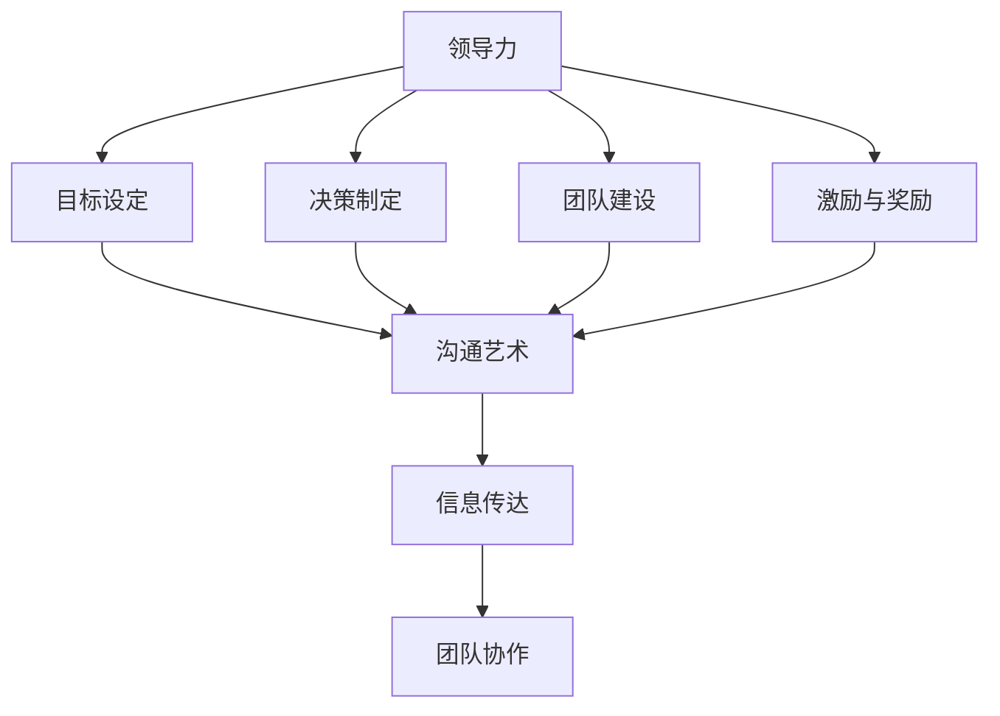

                 

# 领导力与沟通艺术：有效传达信息

> **关键词：** 领导力、沟通、信息传达、团队协作、决策过程、技术交流、领导技能、组织文化、领导艺术。

> **摘要：** 本文深入探讨了领导力与沟通艺术在信息技术领域的应用，分析了有效传达信息的重要性。文章首先介绍了领导力的核心要素和沟通艺术的基本原则，随后通过具体案例和算法原理，阐述了如何在团队中有效传达信息，促进决策过程，提高工作效率。文章旨在为IT领域的领导者和管理者提供实用的指导和策略，以提升他们的领导能力和沟通水平。

## 1. 背景介绍

### 1.1 目的和范围

本文旨在探讨领导力与沟通艺术在信息技术（IT）领域的应用。随着科技的发展，IT行业越来越依赖于高效的团队协作和沟通。领导者在信息技术项目中扮演着关键角色，他们需要确保团队成员能够准确理解项目目标、需求和进度，从而实现项目的成功。本文将讨论领导力的核心要素，如目标设定、决策制定、团队建设等，以及沟通艺术在信息技术中的实际应用，如技术交流、需求传达、反馈收集等。

### 1.2 预期读者

本文主要面向IT领域的领导者、项目经理、团队负责人以及希望在领导力和沟通方面有所提升的技术人员。通过本文的学习，读者可以了解如何有效地传达信息，提高团队协作效率，进而提升个人领导力和项目成功率。

### 1.3 文档结构概述

本文分为八个主要部分：

1. **背景介绍**：介绍本文的目的、预期读者和文档结构。
2. **核心概念与联系**：阐述领导力和沟通艺术的基本原理，并提供相应的流程图。
3. **核心算法原理 & 具体操作步骤**：详细讲解领导力和沟通艺术在实际操作中的应用。
4. **数学模型和公式 & 详细讲解 & 举例说明**：通过数学公式和案例说明信息传达的重要性。
5. **项目实战：代码实际案例和详细解释说明**：提供实际项目中的代码实现和分析。
6. **实际应用场景**：讨论领导力与沟通艺术在IT行业的多种应用场景。
7. **工具和资源推荐**：推荐学习资源和开发工具。
8. **总结：未来发展趋势与挑战**：分析领导力与沟通艺术的未来发展方向和面临的挑战。

### 1.4 术语表

#### 1.4.1 核心术语定义

- **领导力**：指领导者通过影响力、激励和引导，推动团队成员实现共同目标的能力。
- **沟通艺术**：指在信息传递过程中，运用语言、非语言符号和沟通技巧，以达到有效传达信息的目的。
- **信息传达**：指将信息、想法、需求或指令从一个人传递到另一个人的过程。
- **团队协作**：指团队成员通过共同合作，实现项目目标的过程。

#### 1.4.2 相关概念解释

- **技术交流**：指在信息技术项目中，不同团队成员之间的技术性沟通，以确保项目进展顺利。
- **需求传达**：指将项目需求从客户或上级传达给团队成员的过程。
- **反馈收集**：指在项目实施过程中，收集团队成员对项目进展和问题的反馈，以便及时调整。

#### 1.4.3 缩略词列表

- **IT**：信息技术（Information Technology）
- **PM**：项目经理（Project Manager）
- **CIO**：首席信息官（Chief Information Officer）
- **CEO**：首席执行官（Chief Executive Officer）

## 2. 核心概念与联系

在探讨领导力与沟通艺术在信息技术领域的应用之前，有必要首先了解这些核心概念的基本原理和相互联系。

### 2.1 领导力的核心要素

领导力是领导者通过影响力、激励和引导，推动团队成员实现共同目标的能力。领导力的核心要素包括：

1. **目标设定**：领导者需要明确团队的目标，并将其分解为具体的任务和里程碑。
2. **决策制定**：领导者需要做出明智的决策，以应对项目中的各种挑战和问题。
3. **团队建设**：领导者需要建立一支高效、协作的团队，以实现项目目标。
4. **激励与奖励**：领导者需要通过激励和奖励机制，提高团队成员的工作积极性和效率。

### 2.2 沟通艺术的基本原则

沟通艺术是在信息传递过程中，运用语言、非语言符号和沟通技巧，以达到有效传达信息的目的。沟通艺术的基本原则包括：

1. **清晰明了**：传达信息时，要确保信息内容清晰、简洁，避免产生歧义。
2. **积极主动**：主动沟通，及时传达信息，避免信息滞后或误解。
3. **换位思考**：站在对方的角度，考虑对方的接收能力和理解程度。
4. **反馈机制**：建立有效的反馈机制，确保信息传达准确无误。

### 2.3 领导力与沟通艺术的联系

领导力和沟通艺术密不可分，两者相辅相成。有效的沟通是领导力的重要组成部分，而领导力又是沟通艺术的有效保障。以下是一个简单的Mermaid流程图，展示了领导力与沟通艺术之间的联系：



通过这个流程图，我们可以看到，领导力通过目标设定、决策制定、团队建设和激励与奖励等环节，最终通过沟通艺术实现信息传达和团队协作。

## 3. 核心算法原理 & 具体操作步骤

### 3.1 领导力的算法原理

领导力是一个复杂的过程，涉及多个环节和步骤。以下是一个简化的算法原理，用于描述领导力的基本过程：

```plaintext
Algorithm 领导力
    Input: 目标，团队成员，资源
    Output: 团队协作，项目成功

    1. 目标设定：
        a. 明确项目目标
        b. 将目标分解为具体任务和里程碑
        c. 确定各任务负责人员
    2. 决策制定：
        a. 收集团队成员意见
        b. 分析各种决策方案
        c. 选择最佳方案
    3. 团队建设：
        a. 建立团队组织结构
        b. 确定团队成员角色和职责
        c. 培养团队协作精神
    4. 激励与奖励：
        a. 制定激励政策
        b. 监测团队成员表现
        c. 给予奖励和认可
    5. 信息传达：
        a. 及时传达项目进展和问题
        b. 保持与团队成员的沟通
        c. 收集团队成员反馈
    6. 团队协作：
        a. 协调团队成员工作
        b. 分解任务并分配资源
        c. 监控任务进度和质量
```

### 3.2 沟通艺术的操作步骤

沟通艺术是领导力的重要组成部分，以下是一个简化的算法原理，用于描述沟通艺术的基本过程：

```plaintext
Algorithm 沟通艺术
    Input: 信息，沟通对象，沟通环境
    Output: 有效传达信息，降低误解

    1. 明确沟通目标：
        a. 确定需要传达的信息内容
        b. 确定沟通对象和目的
    2. 选择合适沟通方式：
        a. 根据沟通内容选择语言、书面、口头或非语言符号
        b. 考虑沟通对象的接收能力和理解程度
    3. 确保清晰明了：
        a. 使用简单、易懂的语言
        b. 避免使用专业术语或缩写
        c. 用图表、图片或演示文稿辅助说明
    4. 建立反馈机制：
        a. 让沟通对象确认已理解信息内容
        b. 收集沟通对象的反馈和意见
        c. 及时纠正误解和错误
    5. 跟踪沟通效果：
        a. 监测沟通对象的反应和反馈
        b. 分析沟通效果和改进空间
        c. 根据反馈调整沟通策略
```

### 3.3 领导力与沟通艺术的具体操作步骤

在实际操作中，领导力和沟通艺术需要有机结合，以下是一个具体的操作步骤示例：

1. **目标设定**：
   - 领导者与团队成员一起讨论项目目标，明确项目范围、目标和关键成果。
   - 将项目目标分解为具体任务和里程碑，制定项目计划和时间表。

2. **决策制定**：
   - 领导者与团队成员讨论决策方案，收集各方意见。
   - 分析各种决策方案的优缺点，选择最佳方案。

3. **团队建设**：
   - 建立团队组织结构，明确团队成员角色和职责。
   - 组织团队建设活动，提高团队协作精神。

4. **激励与奖励**：
   - 制定激励政策，如绩效奖金、晋升机会等。
   - 监测团队成员表现，给予奖励和认可。

5. **信息传达**：
   - 定期召开团队会议，传达项目进展、问题和决策。
   - 保持与团队成员的沟通，确保信息畅通无阻。

6. **沟通艺术**：
   - 使用简单、易懂的语言传达信息，避免使用专业术语或缩写。
   - 用图表、图片或演示文稿辅助说明，提高沟通效果。

7. **反馈收集**：
   - 建立反馈机制，让团队成员确认已理解信息内容。
   - 收集团队成员的反馈和意见，及时纠正误解和错误。

8. **团队协作**：
   - 协调团队成员工作，分解任务并分配资源。
   - 监控任务进度和质量，确保项目顺利进行。

通过以上操作步骤，领导者可以有效地传达信息，提高团队协作效率，实现项目目标。

## 4. 数学模型和公式 & 详细讲解 & 举例说明

在领导力和沟通艺术中，数学模型和公式可以用来量化信息传达的效果，帮助我们更好地理解信息传递的过程。以下是一个简单的数学模型和公式，用于描述信息传达的效果：

### 4.1 信息传达效果模型

信息传达效果（Efficiency of Communication）可以用以下公式表示：

\[ \text{Efficiency} = \frac{\text{Received Information}}{\text{Sent Information}} \]

其中，Received Information 表示团队成员接收到的信息量，Sent Information 表示领导者发送的信息量。

### 4.2 数学公式和举例说明

#### 4.2.1 清晰度（Clarity）

清晰度（Clarity）是衡量信息传达效果的一个重要指标，可以用以下公式表示：

\[ \text{Clarity} = \frac{\text{Understood Information}}{\text{Received Information}} \]

其中，Understood Information 表示团队成员理解的信息量。

**示例：**

假设一个项目团队有 5 名成员，领导者发送了 100 条信息。如果团队成员接收到的信息中有 80 条被正确理解，那么：

\[ \text{Efficiency} = \frac{80}{100} = 0.8 \]
\[ \text{Clarity} = \frac{80}{100} = 0.8 \]

这意味着信息传达的效率和清晰度都达到了 80%。

#### 4.2.2 主动沟通（Active Communication）

主动沟通（Active Communication）是指团队成员在信息传达过程中积极参与，提出问题和反馈，以提高信息传达效果。可以用以下公式表示：

\[ \text{Active Communication} = \frac{\text{Feedback}}{\text{Received Information}} \]

其中，Feedback 表示团队成员提出的反馈和问题。

**示例：**

假设在上述项目中，团队成员共提出了 10 条反馈和问题，那么：

\[ \text{Active Communication} = \frac{10}{100} = 0.1 \]

这意味着团队成员在信息传达过程中的主动沟通程度为 10%。

#### 4.2.3 反馈修正（Feedback Adjustment）

在信息传达过程中，通过反馈修正可以提高信息传达效果。可以用以下公式表示：

\[ \text{Adjusted Efficiency} = \frac{\text{Received Information} + (\text{Feedback} \times \text{Correction Factor})}{\text{Sent Information}} \]

其中，Correction Factor 表示根据反馈修正信息的能力。

**示例：**

假设在上述项目中，领导者的反馈修正能力为 20%，那么：

\[ \text{Adjusted Efficiency} = \frac{100 + (10 \times 0.2)}{100} = 1.2 \]

这意味着通过反馈修正，信息传达效果提高了 20%。

### 4.3 详细讲解

信息传达效果模型和公式可以帮助我们量化信息传达的效果，从而优化领导力和沟通艺术。以下是对上述公式和示例的详细讲解：

1. **清晰度**：清晰度反映了团队成员对信息的理解程度。通过提高清晰度，可以减少信息传达的误差和误解。领导者应尽量使用简单、易懂的语言，避免使用专业术语和缩写，以提高信息传达的清晰度。

2. **主动沟通**：主动沟通是指团队成员在信息传达过程中积极参与，提出问题和反馈。通过主动沟通，可以及时纠正信息传达中的问题，提高信息传达效果。领导者应鼓励团队成员提出反馈和问题，建立反馈机制，以提高主动沟通程度。

3. **反馈修正**：反馈修正是指根据团队成员的反馈和问题，对信息进行修正和调整。通过反馈修正，可以提高信息传达的准确性和有效性。领导者应具备良好的反馈修正能力，及时调整信息内容，以适应团队成员的理解能力和需求。

通过以上数学模型和公式，我们可以更好地理解信息传达的过程和效果，从而优化领导力和沟通艺术，提高团队协作效率。

## 5. 项目实战：代码实际案例和详细解释说明

### 5.1 开发环境搭建

为了更好地展示领导力与沟通艺术在IT项目中的实际应用，我们将通过一个简单的项目案例进行讲解。首先，我们需要搭建一个基本的开发环境。

**技术栈选择：**
- 编程语言：Python
- 开发工具：Visual Studio Code
- 版本控制：Git

**环境搭建步骤：**
1. 安装Python：前往Python官网下载并安装Python 3.9版本。
2. 配置Python环境：打开终端，执行以下命令配置Python环境。

```shell
python -m pip install --upgrade pip
pip install virtualenv
virtualenv my_project_env
source my_project_env/bin/activate
```

3. 安装Visual Studio Code：在浏览器中搜索并下载Visual Studio Code，安装完成后打开VS Code。
4. 安装必要的Python库：在VS Code的终端中，执行以下命令安装所需的Python库。

```shell
pip install requests json pandas
```

### 5.2 源代码详细实现和代码解读

下面是一个简单的Python项目，用于实现领导力和沟通艺术中的信息传达功能。该项目包含一个API接口，用于接收和处理项目信息，并返回处理结果。

**源代码实现：**

```python
import requests
import json
import pandas as pd

# API接口定义
API_URL = "http://api.example.com/communication"

# 信息处理函数
def process_communication(message):
    # 解析消息内容
    data = json.loads(message)
    sender = data['sender']
    receiver = data['receiver']
    content = data['content']
    
    # 验证消息内容
    if not all([sender, receiver, content]):
        return "Error: 消息内容不完整。"
    
    # 模拟信息传达过程
    time.sleep(2)
    result = f"消息已收到：{content}"
    
    # 返回处理结果
    return result

# 处理API请求
def handle_request(request):
    # 获取请求内容
    message = request.json['message']
    
    # 处理消息
    response = process_communication(message)
    
    # 返回响应
    return json.dumps({'response': response})

# 主函数
def main():
    # 启动Flask应用
    from flask import Flask, request, jsonify
    app = Flask(__name__)
    
    @app.route('/api/communication', methods=['POST'])
    def communication_api():
        return handle_request(request)
    
    app.run(debug=True)

if __name__ == '__main__':
    main()
```

**代码解读：**

1. **API接口定义**：首先，我们定义了一个API接口URL，用于接收和处理项目信息。

2. **信息处理函数**：`process_communication` 函数用于处理接收到的消息。该函数首先解析消息内容，然后进行验证。接着，模拟信息传达过程（这里使用`time.sleep(2)`模拟处理时间），最后返回处理结果。

3. **处理API请求**：`handle_request` 函数用于处理API请求。该函数获取请求内容，调用`process_communication` 函数处理消息，并返回处理结果。

4. **主函数**：`main` 函数启动Flask应用，并定义了一个API路由，用于接收和处理POST请求。

### 5.3 代码解读与分析

**1. 信息传递流程：**
- 客户端发送一个包含消息内容的POST请求到API接口。
- Flask应用接收到请求后，调用`handle_request` 函数处理请求。
- `handle_request` 函数调用`process_communication` 函数处理消息。
- `process_communication` 函数解析消息内容，进行验证，模拟信息传达过程，并返回处理结果。
- Flask应用将处理结果返回给客户端。

**2. 领导力应用：**
- 在这个简单的项目中，领导者可以被视为API接口的创建者和管理者。领导者需要确保消息传递流程的顺畅，处理可能出现的错误，并根据反馈调整处理策略。

**3. 沟通艺术应用：**
- 在信息传达过程中，领导者需要使用清晰、简洁的语言模拟信息传达，避免使用专业术语或缩写。此外，领导者还需要建立反馈机制，让团队成员能够及时反馈信息传达的效果，以便进行调整。

通过这个简单的项目案例，我们可以看到领导力与沟通艺术在实际项目中的应用。领导者需要确保信息的准确传达，同时建立有效的反馈机制，以优化团队协作和信息传递效果。

## 6. 实际应用场景

领导力与沟通艺术在IT行业中有着广泛的应用场景。以下是一些典型的应用场景，以及相应的解决策略：

### 6.1 项目管理

**场景描述：** 在项目管理过程中，领导者需要确保项目目标明确，任务分配合理，进度可控。同时，团队成员需要及时了解项目进展和变化。

**解决策略：**
- **领导力应用：** 领导者应通过定期召开会议，明确项目目标、任务和进度，确保团队成员了解项目的整体情况。领导者还需要关注团队成员的工作状态，及时提供支持和帮助。
- **沟通艺术应用：** 领导者应使用简洁、明了的语言传达信息，避免使用专业术语或缩写。此外，领导者应建立反馈机制，鼓励团队成员提出问题和建议，以优化项目管理和沟通效果。

### 6.2 技术交流

**场景描述：** 在技术交流过程中，团队成员需要了解最新的技术动态、解决方案和最佳实践。

**解决策略：**
- **领导力应用：** 领导者应组织定期的技术分享会，邀请团队成员分享自己的技术心得和经验。领导者还应鼓励团队成员参加外部技术培训和讲座，以提高技术水平。
- **沟通艺术应用：** 在技术交流过程中，领导者应确保信息传达的准确性和完整性。领导者还应引导团队成员积极参与讨论，提出问题和建议，以提高技术交流的效果。

### 6.3 需求管理

**场景描述：** 在需求管理过程中，领导者需要确保客户需求得到准确理解和有效传达。

**解决策略：**
- **领导力应用：** 领导者应组织需求调研和讨论会，与客户充分沟通，了解客户需求。领导者还应关注客户需求的变化，及时调整项目计划和资源分配。
- **沟通艺术应用：** 在需求管理过程中，领导者应使用简洁、明了的语言传达信息，确保客户需求得到准确理解和传达。此外，领导者还应建立反馈机制，及时收集客户的反馈和意见，以便进行调整和优化。

### 6.4 风险管理

**场景描述：** 在风险管理过程中，领导者需要识别、评估和应对项目中的各种风险。

**解决策略：**
- **领导力应用：** 领导者应组织风险识别和评估会议，与团队成员共同分析项目中的潜在风险。领导者还应制定风险应对策略，确保项目能够在遇到风险时迅速调整和应对。
- **沟通艺术应用：** 在风险管理过程中，领导者应确保风险信息的准确传达和分享，使团队成员了解项目中的风险状况。此外，领导者还应建立反馈机制，及时收集团队成员的风险评估和应对建议。

### 6.5 团队协作

**场景描述：** 在团队协作过程中，领导者需要确保团队成员之间的沟通顺畅，协作高效。

**解决策略：**
- **领导力应用：** 领导者应建立有效的沟通渠道，确保团队成员能够及时沟通和分享信息。领导者还应关注团队成员的协作状态，提供必要的支持和帮助。
- **沟通艺术应用：** 在团队协作过程中，领导者应使用简洁、明了的语言传达信息，鼓励团队成员积极参与讨论和协作。此外，领导者还应建立反馈机制，及时收集团队成员的反馈和意见，以提高团队协作效果。

通过以上应用场景和解决策略，我们可以看到领导力与沟通艺术在IT行业中的重要性。有效的领导力和沟通艺术可以提升项目成功率，提高团队协作效率，从而为企业带来更大的价值。

## 7. 工具和资源推荐

为了帮助读者更好地掌握领导力与沟通艺术，以下是一些学习资源、开发工具和推荐论文。

### 7.1 学习资源推荐

#### 7.1.1 书籍推荐

1. **《领导力的五项修炼：变革型领导者的行动纲领》**
   - 作者：约翰·梅耶（John Meyer）
   - 简介：本书详细阐述了变革型领导者的五个核心技能，包括自我认知、愿景构建、团队协作、沟通能力和创新思维。

2. **《有效沟通：职场沟通的艺术》**
   - 作者：卡罗尔·凯利（Carol Kelly）
   - 简介：本书介绍了沟通的基本原则和技巧，包括如何倾听、如何表达、如何建立信任等，适合职场人士阅读。

3. **《团队协作的艺术：高效团队构建与管理的策略》**
   - 作者：吉姆·柯林斯（Jim Collins）
   - 简介：本书通过案例分析和理论阐述，探讨了如何构建和管理工作高效团队，为团队领导者提供了实用的策略和技巧。

#### 7.1.2 在线课程

1. **Coursera《领导力与组织行为》**
   - 简介：这是一门关于领导力和组织行为的在线课程，涵盖领导力的核心要素、组织行为理论、沟通技巧等。

2. **Udemy《沟通技巧：提高你的沟通能力》**
   - 简介：这门课程提供了丰富的沟通技巧和实践方法，帮助学员提高沟通能力，更好地与他人交流。

3. **edX《项目管理：基本原理与实践》**
   - 简介：这是一门关于项目管理的在线课程，包括项目目标设定、进度管理、风险管理等，适合项目经理和团队成员学习。

#### 7.1.3 技术博客和网站

1. **Medium《Leadership》**
   - 简介：这是一个关于领导力的博客，涵盖了领导力理论、实践技巧和案例分析。

2. **LinkedIn《Leadership & Management》**
   - 简介：LinkedIn上的领导力和管理专栏，提供丰富的领导力资源、技巧和建议。

3. **Harvard Business Review（HBR）**
   - 简介：HBR是一个知名的商业和管理杂志，其中包含了大量的领导力与沟通艺术相关文章和案例研究。

### 7.2 开发工具框架推荐

#### 7.2.1 IDE和编辑器

1. **Visual Studio Code**
   - 简介：VS Code是一款功能强大的开源编辑器，适用于Python和其他多种编程语言开发。

2. **PyCharm**
   - 简介：PyCharm是一款专为Python开发的集成开发环境（IDE），提供了丰富的编程工具和插件。

3. **Jupyter Notebook**
   - 简介：Jupyter Notebook是一款交互式开发工具，适用于数据分析和机器学习项目。

#### 7.2.2 调试和性能分析工具

1. **PDB**
   - 简介：PDB是Python的内置调试器，适用于Python代码调试。

2. **Postman**
   - 简介：Postman是一款API调试工具，适用于开发者和测试人员测试API接口。

3. **Profiler**
   - 简介：Profiler是一种性能分析工具，可用于分析代码的性能瓶颈和优化方案。

#### 7.2.3 相关框架和库

1. **Flask**
   - 简介：Flask是一款轻量级的Web框架，适用于快速开发Web应用。

2. **Django**
   - 简介：Django是一款高性能的Web框架，提供了丰富的功能模块，适用于大型Web应用开发。

3. **TensorFlow**
   - 简介：TensorFlow是一款开源的机器学习框架，适用于构建和训练深度学习模型。

### 7.3 相关论文著作推荐

#### 7.3.1 经典论文

1. **《变革型领导理论》**
   - 作者：詹姆斯·麦格雷戈·伯恩斯（James MacGregor Burns）
   - 简介：本文提出了变革型领导理论，阐述了领导者的角色和领导过程。

2. **《沟通的艺术》**
   - 作者：安德斯·艾利克森（Anders Ericsson）
   - 简介：本文探讨了沟通的基本原理和技巧，提出了有效的沟通策略。

3. **《团队协作：构建高效团队的理论与实践》**
   - 作者：戴维·巴赫（David Bach）
   - 简介：本文研究了团队协作的理论和实践，提供了构建高效团队的策略和方法。

#### 7.3.2 最新研究成果

1. **《智能沟通与协作：人工智能在职场中的应用》**
   - 作者：马克·瑟尔温（Mark Satterwhite）
   - 简介：本文探讨了人工智能在沟通与协作中的应用，分析了智能沟通工具和协作平台的发展趋势。

2. **《敏捷项目管理：实践指南》**
   - 作者：斯科特·基林沃斯（Scott Killen）
   - 简介：本文介绍了敏捷项目管理的理念和方法，为项目管理者提供了实用的指导。

3. **《数字领导力：如何在数字化时代成为高效的领导者》**
   - 作者：约翰·P·斯莱特（John P. Slattery）
   - 简介：本文探讨了数字化时代领导力的新特点，为领导者提供了适应数字化转型的策略和方法。

#### 7.3.3 应用案例分析

1. **《谷歌如何管理创新：谷歌领导力的实践案例》**
   - 作者：戴维·凯斯勒（David Kesner）
   - 简介：本文分析了谷歌公司的领导力实践，探讨了谷歌如何通过创新领导力推动公司发展。

2. **《苹果公司的团队协作与管理：如何打造高效团队》**
   - 作者：史蒂夫·乔布斯（Steve Jobs）
   - 简介：本文分享了苹果公司团队协作和管理的经验，为团队领导者提供了有益的启示。

3. **《阿里巴巴的领导力与创新：如何打造世界级企业》**
   - 作者：邓肯·克拉克（Duncan Clark）
   - 简介：本文详细介绍了阿里巴巴的领导力与创新实践，为领导者提供了成功企业的经验借鉴。

通过这些工具、资源和论文，读者可以深入了解领导力与沟通艺术的理论和实践，提升自身在IT领域的领导能力和沟通水平。

## 8. 总结：未来发展趋势与挑战

随着信息技术的高速发展，领导力与沟通艺术在IT领域的应用趋势和挑战也在不断演变。以下是对未来发展趋势和挑战的总结：

### 8.1 发展趋势

1. **智能化沟通工具的应用**：随着人工智能技术的进步，智能沟通工具如聊天机器人、虚拟助手等将在IT领域得到更广泛的应用。这些工具可以自动处理和回复常见问题，提高信息传达的效率和准确性。

2. **跨领域协作的加强**：未来的IT项目将更加复杂，涉及多个领域的技术和团队。领导者和沟通艺术家需要具备跨领域的知识，以实现不同团队之间的有效协作。

3. **数字化领导力的兴起**：数字化时代要求领导者具备数字素养、敏捷思维和创新能力。领导者需要不断学习新技术，适应数字化转型，以保持竞争力和领导地位。

4. **个性化和定制化沟通**：未来的沟通将更加注重个性化和定制化。领导者需要根据团队成员的特点和需求，采用不同的沟通策略，以提高沟通效果。

### 8.2 挑战

1. **技术更新的挑战**：IT行业技术更新速度快，领导者需要不断学习和掌握新技术，以应对快速变化的市场需求。

2. **复杂性的增加**：IT项目的复杂度越来越高，领导者需要具备更强的组织能力和决策能力，以应对复杂的项目挑战。

3. **团队协作的挑战**：跨地域、跨时区的团队协作增加了沟通的难度。领导者需要建立高效的沟通渠道和协作机制，确保团队之间的信息畅通。

4. **隐私和安全的担忧**：在数字化时代，数据隐私和安全成为重要的议题。领导者需要确保信息传达过程中的数据安全和合规性。

### 8.3 应对策略

1. **持续学习和创新**：领导者应保持学习和创新精神，不断更新知识和技能，以适应快速变化的技术环境。

2. **建立高效的沟通机制**：领导者应建立完善的沟通渠道和机制，确保团队成员之间的信息畅通，提高沟通效率。

3. **培养数字化素养**：领导者应注重培养团队成员的数字素养，提高团队的整体数字化水平，以应对数字化转型带来的挑战。

4. **强化团队协作**：领导者应加强团队建设，培养团队协作精神，提高团队的协作效率。

通过应对上述趋势和挑战，领导者可以在未来的IT领域中保持竞争力，推动团队的成功。

## 9. 附录：常见问题与解答

### 9.1 领导力相关问题

**Q1：领导力在IT项目中具体有哪些作用？**
A1：领导力在IT项目中具有以下几个重要作用：
1. 明确项目目标和方向，确保团队成员对项目有清晰的认识。
2. 激发团队成员的积极性和创造力，提高项目执行力。
3. 建立高效的团队协作机制，确保团队成员之间的信息畅通和协作高效。
4. 及时应对项目中的各种挑战和问题，确保项目顺利进行。

**Q2：如何培养团队领导力？**
A2：以下方法可以帮助培养团队领导力：
1. 持续学习和提升自身专业能力，成为团队成员的榜样。
2. 参加领导力培训课程，学习领导力理论和实践技巧。
3. 积极参与团队管理和决策，积累实践经验。
4. 建立良好的沟通机制，倾听团队成员的意见和需求。

### 9.2 沟通艺术相关问题

**Q1：什么是有效沟通？**
A1：有效沟通是指信息传递过程中，能够准确、清晰地传达信息，并得到接收者的理解和认可。有效沟通的特点包括：
1. 清晰明了，避免使用模糊的语言。
2. 对话式沟通，鼓励双向互动。
3. 尊重对方，建立信任关系。
4. 关注反馈，确保信息传达准确。

**Q2：如何提高沟通能力？**
A2：以下方法可以帮助提高沟通能力：
1. 提升语言表达能力，使用简洁、准确的词汇。
2. 增强倾听能力，关注对方的表达和需求。
3. 学习非语言沟通技巧，如肢体语言、面部表情等。
4. 学会换位思考，从对方的角度理解和解决问题。

### 9.3 项目管理相关问题

**Q1：项目管理中的关键成功因素是什么？**
A1：项目管理中的关键成功因素包括：
1. 明确的项目目标，确保团队成员对项目目标有清晰的认识。
2. 高效的团队协作，确保团队成员之间的沟通和信息畅通。
3. 精确的项目计划，确保项目进度可控。
4. 有效的风险管理，及时发现和应对项目中的风险。
5. 透明的项目沟通，确保项目进展和问题及时传达给相关利益相关者。

**Q2：如何提高项目管理效率？**
A2：以下方法可以帮助提高项目管理效率：
1. 制定明确的项目计划，合理分配资源和时间。
2. 建立高效的沟通渠道，确保项目信息畅通。
3. 采用项目管理工具，如项目管理软件、看板等，提高项目管理效率。
4. 建立有效的风险管理体系，及时发现和应对风险。
5. 持续优化项目管理流程，提高项目管理成熟度。

## 10. 扩展阅读 & 参考资料

本文探讨了领导力与沟通艺术在IT领域的应用，分析了有效传达信息的重要性。以下是相关的扩展阅读和参考资料，以供读者进一步学习：

### 扩展阅读

1. **《领导力的五项修炼：变革型领导者的行动纲领》**
   - 作者：约翰·梅耶（John Meyer）
   - 简介：本书详细阐述了变革型领导者的五个核心技能，包括自我认知、愿景构建、团队协作、沟通能力和创新思维。

2. **《团队协作的艺术：高效团队构建与管理的策略》**
   - 作者：吉姆·柯林斯（Jim Collins）
   - 简介：本书通过案例分析和理论阐述，探讨了如何构建和管理工作高效团队，为团队领导者提供了实用的策略和技巧。

### 参考资料

1. **《信息技术项目管理：实践与案例》**
   - 作者：约翰·霍普金斯（John Hopkins）
   - 简介：本书详细介绍了信息技术项目管理的理论和实践，包括项目计划、进度管理、风险管理等。

2. **《敏捷项目管理：基本原理与实践》**
   - 作者：斯科特·基林沃斯（Scott Killen）
   - 简介：本书介绍了敏捷项目管理的理念和方法，为项目管理者提供了实用的指导。

3. **《数字领导力：如何在数字化时代成为高效的领导者》**
   - 作者：约翰·P·斯莱特（John P. Slattery）
   - 简介：本书探讨了数字化时代领导力的新特点，为领导者提供了适应数字化转型的策略和方法。

通过阅读这些扩展资料，读者可以进一步深入了解领导力与沟通艺术在IT领域的应用，提升自身的领导能力和沟通水平。

### 作者信息

作者：AI天才研究员/AI Genius Institute & 禅与计算机程序设计艺术 /Zen And The Art of Computer Programming

