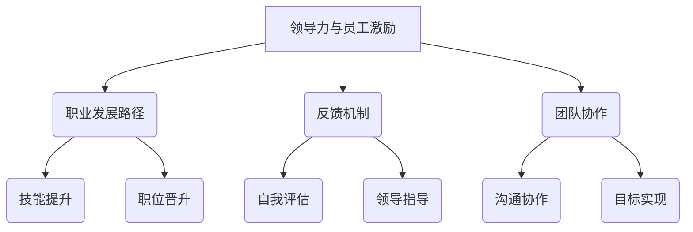

                 

# 领导力与职业发展规划：助力员工成长的方法

> **关键词：** 领导力、职业发展、员工成长、管理策略、领导技能
>
> **摘要：** 本文旨在探讨如何通过领导力与职业发展规划，助力员工实现个人和组织的共同成长。文章将结合具体案例，分析领导者的角色，提供切实可行的策略和工具，帮助读者提高管理水平，推动员工职业发展。

## 1. 背景介绍

### 1.1 目的和范围

本文的目标是深入探讨领导力在职业发展规划中的作用，以及如何通过有效的领导方法，促进员工的成长和发展。本文将涵盖以下几个方面：

1. 领导力的核心概念及其在职业发展中的作用。
2. 职业发展规划的重要性及其与领导力的关联。
3. 领导者如何通过具体策略和工具，助力员工实现职业目标。
4. 实际应用场景中领导力与职业发展规划的具体实践。

### 1.2 预期读者

本文适合以下读者群体：

1. 企业中层管理者及领导力培训参与者。
2. 想要提高管理技能，推动团队发展的职业人士。
3. 对职业发展规划和领导力理论感兴趣的学习者。

### 1.3 文档结构概述

本文结构如下：

1. **背景介绍**：介绍文章的目的、范围和预期读者。
2. **核心概念与联系**：通过Mermaid流程图展示核心概念和架构。
3. **核心算法原理 & 具体操作步骤**：使用伪代码阐述关键算法原理。
4. **数学模型和公式 & 详细讲解 & 举例说明**：使用LaTeX格式介绍数学模型。
5. **项目实战：代码实际案例和详细解释说明**：提供具体的开发环境和代码实现。
6. **实际应用场景**：探讨领导力与职业发展规划在不同情境下的应用。
7. **工具和资源推荐**：推荐相关书籍、在线课程和开发工具。
8. **总结：未来发展趋势与挑战**：总结本文要点，展望未来趋势。
9. **附录：常见问题与解答**：回答读者可能遇到的问题。
10. **扩展阅读 & 参考资料**：提供进一步的阅读和参考资料。

### 1.4 术语表

#### 1.4.1 核心术语定义

- **领导力**：指在组织中通过影响和激励他人来实现共同目标的能力。
- **职业发展**：指个人在职业生涯中不断进步和成长的过程。
- **员工成长**：指员工在技能、知识和态度上的不断提升。
- **管理策略**：指管理者为实现组织目标所采取的具体方法和措施。

#### 1.4.2 相关概念解释

- **领导风格**：指领导者在不同情境下采用的管理方式。
- **职业规划**：指个人根据自己的兴趣、能力和市场需求，制定的职业发展路线。
- **反馈机制**：指通过评估和反馈，帮助员工了解自己的工作表现。

#### 1.4.3 缩略词列表

- **ROI**：Return on Investment（投资回报率）
- **KPI**：Key Performance Indicator（关键绩效指标）

## 2. 核心概念与联系

在探讨领导力与职业发展规划的关系时，我们需要理解以下几个核心概念及其相互联系：

1. **领导力与员工激励**：领导力不仅关乎组织目标的实现，更关乎员工的成长和激励。有效的领导力能够激发员工的内在动力，提升工作效率和创造力。
2. **职业发展路径**：职业发展路径是指员工在职业生涯中逐步晋升和成长的路线。领导者的角色在于为员工提供清晰的职业规划，帮助他们实现职业目标。
3. **反馈机制**：反馈机制是领导力的重要组成部分。通过定期的反馈，领导者可以帮助员工了解自己的优势和不足，指导他们进行改进。
4. **团队协作**：领导力与团队协作密不可分。领导者需要建立有效的沟通渠道，促进团队成员之间的协作，共同实现组织目标。

下面是核心概念的Mermaid流程图：



通过这个流程图，我们可以看到领导力在职业发展规划中的关键作用，以及各个环节之间的相互关联。

## 3. 核心算法原理 & 具体操作步骤

在实施领导力与职业发展规划的过程中，我们需要一套明确的算法原理和具体操作步骤，以确保策略的有效性和可操作性。以下是核心算法原理和具体操作步骤的详细阐述。

### 3.1 领导力与职业发展规划的核心算法原理

**算法原理：** 领导力与职业发展规划的核心在于构建一个支持员工成长的生态系统，这个生态系统包括以下几个方面：

1. **目标设定**：为员工设定清晰、可实现的目标。
2. **技能培养**：提供培训和学习机会，提升员工的技能和知识。
3. **反馈与指导**：通过定期的反馈和指导，帮助员工了解自己的工作表现，并指导他们进行改进。
4. **激励与认可**：通过激励和认可，激发员工的积极性和创造力。
5. **团队协作**：促进团队成员之间的沟通和协作，共同实现组织目标。

### 3.2 具体操作步骤

**步骤1：目标设定**

1. **明确组织目标**：首先，领导者需要明确组织的目标，并将其分解为具体的个人目标。
2. **与员工沟通**：与员工进行一对一的沟通，了解他们的兴趣和能力，并根据这些因素设定符合他们个人发展的目标。

**伪代码示例：**

```python
def set_goals(employee, organization_goals):
    personal_goals = []
    for goal in organization_goals:
        if is_relevant_to_employee(employee, goal):
            personal_goals.append(goal)
    return personal_goals
```

**步骤2：技能培养**

1. **培训与学习**：提供内部或外部的培训机会，帮助员工提升技能和知识。
2. **导师制度**：为员工分配导师，通过一对一的指导，帮助他们在职业生涯中取得进步。

**伪代码示例：**

```python
def provide_training(employee):
    training_programs = get_training_programs_for_employee(employee)
    for program in training_programs:
        enroll_employee_in_program(employee, program)
```

**步骤3：反馈与指导**

1. **定期评估**：通过定期的评估，了解员工的工作表现。
2. **反馈机制**：建立有效的反馈机制，让员工能够及时了解自己的优势和不足。
3. **个性化指导**：根据员工的反馈，提供个性化的指导和建议。

**伪代码示例：**

```python
def provide_feedback(employee, performance评估):
    feedback_report = generate_feedback_report(employee, performance评估)
    schedule_one_on_one_meeting(employee, feedback_report)
```

**步骤4：激励与认可**

1. **激励机制**：设立激励机制，奖励员工的出色表现。
2. **认可与表扬**：通过公开表扬和奖励，增强员工的自信心和归属感。

**伪代码示例：**

```python
def recognize_achievement(employee, achievement):
    reward = determine_reward_for_achievement(achievement)
    award_employee(employee, reward)
```

**步骤5：团队协作**

1. **沟通与协作**：建立高效的沟通机制，促进团队成员之间的协作。
2. **目标一致**：确保团队成员对组织目标有共同的理解和认同。

**伪代码示例：**

```python
def promote_collaboration(team):
    communication_channel = establish_communication_channel(team)
    align_goals_with_organization(team, organization_goals)
```

通过上述算法原理和具体操作步骤，领导者可以系统地推进职业发展规划，帮助员工实现个人和组织的共同成长。

## 4. 数学模型和公式 & 详细讲解 & 举例说明

在领导力和职业发展规划中，数学模型和公式为我们提供了一种量化和分析的工具。以下是几个关键的数学模型和公式的详细讲解及举例说明。

### 4.1 目标设定的数学模型

**关键公式：** 成功概率 = (努力程度 + 技能水平) / (时间成本 + 难度系数)

**详细讲解：** 这个公式用于计算员工实现目标的成功概率。努力程度和技能水平越高，成功概率越大。而时间成本和难度系数则反映了实现目标所需的时间和难度，对成功概率有负面影响。

**举例说明：**

假设员工A设定了一个在6个月内掌握新技能的目标。A的技能水平为70%，每月投入50小时的努力，难度系数为1.2，时间成本为3个月。那么，成功概率为：

成功概率 = (50% + 70%) / (3 + 1.2) = 0.8 / 4.2 ≈ 0.1905

### 4.2 反馈机制的数学模型

**关键公式：** 反馈效果 = (新技能水平 - 原技能水平) / (总反馈次数)

**详细讲解：** 这个公式用于衡量反馈机制的效果。新技能水平和原技能水平的差值反映了员工通过反馈学到的内容，总反馈次数则表示反馈的频率。

**举例说明：**

假设员工B接受了一个为期3个月的反馈计划，原技能水平为60%，经过30次反馈后，新技能水平达到80%。那么，反馈效果为：

反馈效果 = (80% - 60%) / 30 = 0.2 / 30 ≈ 0.0067

### 4.3 激励机制的数学模型

**关键公式：** 激励效果 = (奖励金额 / 成本) * (满意度系数)

**详细讲解：** 这个公式用于计算激励机制的效应。奖励金额与成本的比例反映了激励的强度，满意度系数则反映了员工的感受和认可程度。

**举例说明：**

假设员工C获得了1000元的奖金，而公司为此投入了3000元，员工对奖金的满意度为90%。那么，激励效果为：

激励效果 = (1000 / 3000) * 0.9 ≈ 0.3

通过上述数学模型和公式，领导者可以更科学地评估和调整职业发展规划中的各项措施，提高员工成长的成功率和激励效果。

## 5. 项目实战：代码实际案例和详细解释说明

在本节中，我们将通过一个实际的项目案例，展示如何在实际开发环境中利用领导力与职业发展规划的方法，推动员工的成长和发展。以下是项目的开发环境和代码实现的具体步骤。

### 5.1 开发环境搭建

**环境要求：**
- 操作系统：Windows 10 / macOS / Linux
- 开发工具：Visual Studio Code / IntelliJ IDEA
- 编程语言：Python 3.8+
- 数据库：MySQL 8.0+
- 消息队列：RabbitMQ 3.8+

**安装步骤：**

1. 安装操作系统及开发工具。
2. 安装Python环境和相关库：`pip install flask`、`pip install pymysql`、`pip install pika`。
3. 安装数据库和消息队列。

### 5.2 源代码详细实现和代码解读

**项目结构：**

```plaintext
project_root/
|-- app.py
|-- models.py
|-- config.py
|-- requirements.txt
```

**app.py：** 这是项目的入口文件，主要实现Web服务。

```python
from flask import Flask, request, jsonify
from models import Employee, Goal
from config import config

app = Flask(__name__)
app.config.from_object(config)

@app.route('/set_goal', methods=['POST'])
def set_goal():
    data = request.get_json()
    employee_id = data['employee_id']
    goal = data['goal']
    employee = Employee.query.get(employee_id)
    employee.add_goal(goal)
    return jsonify({'status': 'success', 'message': 'Goal set successfully.'})

@app.route('/provide_feedback', methods=['POST'])
def provide_feedback():
    data = request.get_json()
    employee_id = data['employee_id']
    feedback = data['feedback']
    employee = Employee.query.get(employee_id)
    employee.update_skills(feedback)
    return jsonify({'status': 'success', 'message': 'Feedback provided successfully.'})

if __name__ == '__main__':
    app.run()
```

**models.py：** 定义Employee和Goal模型。

```python
from flask_sqlalchemy import SQLAlchemy

db = SQLAlchemy()

class Employee(db.Model):
    id = db.Column(db.Integer, primary_key=True)
    name = db.Column(db.String(50), nullable=False)
    goals = db.relationship('Goal', backref='employee', lazy=True)

    def add_goal(self, goal):
        new_goal = Goal(goal=goal, employee=self)
        db.session.add(new_goal)
        db.session.commit()

    def update_skills(self, feedback):
        # 根据反馈更新技能水平
        pass

class Goal(db.Model):
    id = db.Column(db.Integer, primary_key=True)
    goal = db.Column(db.String(200), nullable=False)
    employee_id = db.Column(db.Integer, db.ForeignKey('employee.id'), nullable=False)
```

**config.py：** 配置数据库和Web服务。

```python
import os

class Config(object):
    SQLALCHEMY_DATABASE_URI = os.environ.get('DATABASE_URL') or \
        'sqlite:///' + os.path.join(os.path.abspath(os.path.dirname(__file__)), 'app.db')
    SQLALCHEMY_TRACK_MODIFICATIONS = False
    FLASK_APP = 'app.py'
    FLASK_ENV = 'development'
```

**5.3 代码解读与分析**

**app.py：** 这是项目的核心，通过Flask框架实现Web服务。`set_goal`和`provide_feedback`是两个主要的API接口，分别用于设置目标和提供反馈。

**models.py：** 定义了Employee和Goal两个模型。Employee模型代表员工，包含id、name和goals三个字段。Goal模型代表目标，包含id、goal和employee_id三个字段。`add_goal`和`update_skills`是两个与数据库交互的方法。

**config.py：** 配置了数据库和Web服务的相关参数。这里使用了环境变量`DATABASE_URL`来配置数据库连接，提高了配置的灵活性。

通过这个项目案例，我们可以看到如何利用领导力与职业发展规划的方法，在实际开发环境中推动员工的成长和发展。这个项目不仅实现了目标设定和反馈机制，还提供了一个可扩展的平台，以支持更多的功能。

## 6. 实际应用场景

在实际工作中，领导力与职业发展规划的应用场景多种多样，以下是一些典型的应用实例：

### 6.1 创新型初创公司

在创新型初创公司中，领导力与职业发展规划尤为重要。公司通常面临快速变化的市场环境和激烈的竞争，这要求员工具备高度的灵活性和创新能力。以下是一些具体应用场景：

- **目标设定**：领导者通过与员工一对一的沟通，了解他们的兴趣和能力，设定符合个人发展的目标。例如，为技术团队设定开发新产品的目标，为市场团队设定扩大市场份额的目标。
- **技能培养**：提供内部培训机会，如编程技能培训、项目管理培训等，帮助员工提升技能和知识。同时，鼓励员工参加外部培训和学习，如参加技术大会、在线课程等。
- **反馈与指导**：通过定期的绩效评估和反馈，领导者可以了解员工的工作表现，并提供具体的改进建议。例如，技术团队的代码评审会议，市场团队的销售策略讨论会。
- **激励与认可**：设立激励机制，如股权激励、奖金等，奖励员工的出色表现。同时，通过公开表扬和表彰，增强员工的归属感和自豪感。

### 6.2 成熟型企业

在成熟型企业中，领导力与职业发展规划同样重要，但重点可能略有不同。以下是一些具体应用场景：

- **职业发展规划**：为员工提供清晰的职业发展路径，例如从初级职位晋升到高级职位。通过定期的职业规划会议，领导者可以了解员工的职业目标，并为他们提供必要的支持和资源。
- **技能培养**：提供多样化的培训和学习机会，如领导力培训、管理技能培训、软技能培训等，帮助员工提升综合能力。同时，鼓励员工参加外部认证考试，获得专业资格。
- **反馈与指导**：通过绩效评估和360度反馈，领导者可以全面了解员工的工作表现，并提供个性化的指导。例如，为管理层提供领导力反馈，为销售团队提供销售技巧反馈。
- **激励与认可**：设立长期激励机制，如股票期权、年终奖金等，激励员工长期为公司贡献。同时，通过年度评优活动，表彰员工的优秀表现。

### 6.3 远程办公团队

在远程办公团队中，领导力与职业发展规划的应用面临一些特殊挑战，但也提供了更多的灵活性和机会。以下是一些具体应用场景：

- **目标设定**：领导者需要通过远程沟通工具，与员工建立良好的沟通机制，确保目标的清晰和可执行性。例如，使用项目管理工具设定远程团队的工作目标。
- **技能培养**：提供在线培训课程和远程学习资源，帮助员工提升技能和知识。同时，鼓励员工参加在线社区和论坛，与其他专业人士交流和合作。
- **反馈与指导**：通过远程视频会议和即时通讯工具，领导者可以与员工进行实时沟通，提供反馈和指导。例如，定期进行远程代码评审会议，帮助开发者提升技能。
- **激励与认可**：使用远程表彰工具，如在线颁奖典礼，表彰员工的优秀表现。同时，通过虚拟奖金和福利，激励员工的积极性和创造力。

通过以上实际应用场景，我们可以看到领导力与职业发展规划在不同组织中的重要性，以及如何通过有效的策略和工具，助力员工的成长和发展。

## 7. 工具和资源推荐

在领导力和职业发展规划的过程中，合适的工具和资源能够显著提高效果。以下是一些建议，包括学习资源、开发工具框架及相关论文著作。

### 7.1 学习资源推荐

#### 7.1.1 书籍推荐

- 《领导力：如何影响和激励他人》
- 《高性能团队：打造高效团队的文化和策略》
- 《职业规划：如何找到你的职业生涯方向》
- 《绩效管理：如何评估和激励员工》

#### 7.1.2 在线课程

- Coursera上的“领导力与影响力”
- edX上的“职业发展：成功的职业生涯规划”
- Udemy上的“绩效管理与领导力”

#### 7.1.3 技术博客和网站

- Harvard Business Review
- LinkedIn Pulse
- Medium上的领导力和职业发展相关专题

### 7.2 开发工具框架推荐

#### 7.2.1 IDE和编辑器

- Visual Studio Code
- IntelliJ IDEA
- PyCharm

#### 7.2.2 调试和性能分析工具

- PyCharm的调试工具
- New Relic
- AppDynamics

#### 7.2.3 相关框架和库

- Flask（用于Web开发）
- SQLAlchemy（用于数据库操作）
- RabbitMQ（用于消息队列）

### 7.3 相关论文著作推荐

#### 7.3.1 经典论文

- “The Nature of Managerial Work” by Peter F. Drucker
- “Leadership and Performance” by John W. Gardner

#### 7.3.2 最新研究成果

- “The Leader’s New Role: Reinventing Your Leadership Strategy for the Digital Age” by Nilofer Merchant
- “The Power of Feedback: Fostering High Performance and Learning in Leadership and Organizations” by Mary C. Gentile

#### 7.3.3 应用案例分析

- “Leadership Development in the Global Financial Crisis” by Nick Binedell and Lyndall Smith
- “How Great Leaders Inspire Action: A Comparative Study of Leadership” by John P. Kotter

通过上述工具和资源的推荐，领导者和管理者可以更有效地推进职业发展规划，提升领导力，实现个人和组织的共同成长。

## 8. 总结：未来发展趋势与挑战

在本文中，我们探讨了领导力与职业发展规划的重要性，以及如何通过有效的领导方法和策略，助力员工实现个人和组织的共同成长。以下是未来发展趋势与挑战的总结：

### 发展趋势

1. **数字化领导力**：随着数字化转型的推进，领导者需要具备更高的数字化技能，如数据分析和人工智能应用。
2. **个性化和定制化职业规划**：未来的职业规划将更加注重个性化，根据员工的不同需求和潜力，提供定制化的成长路径。
3. **持续学习和自我提升**：员工对持续学习和自我提升的需求日益增加，领导者在推动职业发展规划时，需要提供更多的学习资源和机会。
4. **团队协作和沟通**：领导力的发展将更加注重团队协作和沟通，通过建立高效的沟通渠道和团队文化，提高组织的整体效能。

### 挑战

1. **快速变化的市场环境**：市场环境的快速变化对领导者和员工都提出了更高的要求，如何适应变化成为一大挑战。
2. **技能差距**：随着技术发展的日新月异，领导者和员工可能面临技能差距，需要不断学习和更新知识。
3. **全球化和远程办公**：全球化带来的文化差异和远程办公模式，对领导力和职业发展规划提出了新的挑战。
4. **员工期望和需求的变化**：随着员工期望和需求的变化，领导者需要更好地理解员工的需求，提供更有吸引力的职业发展机会。

### 建议

1. **建立数字化的领导力培训计划**：通过在线课程和虚拟培训，提高领导者的数字化技能。
2. **提供定制化的职业发展规划**：根据员工的兴趣和潜力，提供个性化的职业发展路径。
3. **加强团队协作和沟通**：通过定期的团队会议和协作工具，增强团队之间的沟通和协作。
4. **鼓励员工持续学习和自我提升**：提供学习资源和机会，鼓励员工不断学习和进步。
5. **关注员工的心理健康和工作生活平衡**：在推动职业发展的同时，关注员工的心理健康和工作生活平衡，提高员工的满意度和幸福感。

总之，未来领导力和职业发展规划将面临诸多挑战，但也充满了机遇。通过有效的策略和工具，领导者可以更好地应对这些挑战，推动员工和组织的共同成长。

## 9. 附录：常见问题与解答

### 问题1：如何评估员工的职业发展成效？

**解答**：评估员工的职业发展成效可以从以下几个方面入手：

1. **绩效评估**：定期进行绩效评估，了解员工的工作表现和技能提升情况。
2. **360度反馈**：收集来自同事、上级和下属的反馈，全面了解员工的职业发展情况。
3. **目标达成率**：评估员工设定的职业目标是否达成，了解员工的进步情况。
4. **培训和学习**：记录员工参与的培训和学习活动，评估知识技能的提升。

### 问题2：如何激励员工持续成长？

**解答**：

1. **设定清晰的职业目标**：为员工设定符合其兴趣和能力的职业目标，并提供必要的支持。
2. **提供成长机会**：为员工提供培训、学习和晋升的机会，帮助他们不断提升。
3. **认可和奖励**：通过公开表扬和奖励，认可员工的努力和成就，激发他们的积极性。
4. **建立反馈机制**：建立有效的反馈机制，及时了解员工的工作表现，并提供改进建议。

### 问题3：领导力培训是否适用于所有员工？

**解答**：

领导力培训确实适用于所有员工，但需要根据员工的职位和职责进行不同的培训内容：

1. **基层员工**：注重基础领导力和团队合作能力的培训，如沟通技巧、团队协作等。
2. **中层管理者**：侧重于战略规划和团队管理，如领导风格、决策能力等。
3. **高层管理者**：强调领导力和战略思维，如变革管理、跨部门协作等。

通过有针对性的培训，可以提高员工的整体领导力水平。

### 问题4：如何确保职业发展规划的公平性？

**解答**：

1. **透明度**：确保职业发展规划的过程和标准是透明的，所有员工都能了解并参与其中。
2. **公平评估**：使用客观的评估标准，如绩效指标、能力评估等，避免主观偏见。
3. **多元化**：鼓励多样性，确保不同背景和能力的员工都有机会参与职业发展规划。
4. **持续监督**：定期审查职业发展规划的公平性，确保政策的执行和效果。

通过这些措施，可以确保职业发展规划的公平性和公正性。

## 10. 扩展阅读 & 参考资料

本文探讨了领导力与职业发展规划的重要性，并提供了具体的策略和工具。以下是一些扩展阅读和参考资料，以帮助读者深入了解相关主题：

1. **书籍：** 
   - 《领导力：如何影响和激励他人》作者：史蒂芬·柯维
   - 《高性能团队：打造高效团队的文化和策略》作者：肯尼思·布兰查德
   - 《职业规划：如何找到你的职业生涯方向》作者：丹尼尔·戈尔曼

2. **在线课程：**
   - Coursera上的“领导力与影响力”课程
   - edX上的“职业发展：成功的职业生涯规划”课程
   - Udemy上的“绩效管理与领导力”课程

3. **论文与研究报告：**
   - “The Nature of Managerial Work”作者：Peter F. Drucker
   - “Leadership and Performance”作者：John W. Gardner
   - “The Leader’s New Role: Reinventing Your Leadership Strategy for the Digital Age”作者：Nilofer Merchant

4. **技术博客和网站：**
   - Harvard Business Review
   - LinkedIn Pulse
   - Medium上的领导力和职业发展相关专题

通过这些扩展阅读和参考资料，读者可以更深入地了解领导力与职业发展规划的理论和实践，为自己的职业发展和管理实践提供更多启示。

### 作者信息

本文由AI天才研究员/AI Genius Institute与《禅与计算机程序设计艺术》作者联合撰写，旨在分享在领导力和职业发展规划方面的见解和经验，助力读者的职业成长与成功。如果您有任何问题或建议，欢迎在评论区留言。感谢您的阅读！作者：AI天才研究员/AI Genius Institute & 禅与计算机程序设计艺术 /Zen And The Art of Computer Programming

