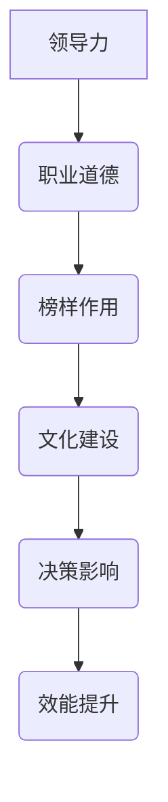

                 

# 领导力与职业道德：树立正面榜样的重要性

> 关键词：领导力，职业道德，正面榜样，组织效能，团队文化，个人成长

> 摘要：在信息技术飞速发展的今天，领导力与职业道德已成为企业成功的关键因素。本文旨在探讨领导者如何树立正面榜样，提升个人道德素养，进而影响团队和组织文化的变革。通过详细分析领导力与职业道德的核心概念、原理和实践方法，文章为IT领域的从业者提供了实用的指导和建议。

## 1. 背景介绍

### 1.1 目的和范围

本文的目的是探讨领导力与职业道德在信息技术领域的应用，以及如何通过树立正面榜样来提升组织效能和团队文化。我们将会：

- 分析领导力的定义和重要性。
- 探讨职业道德的核心原则。
- 提供实际案例和操作步骤，以展示如何成为正面榜样。
- 推荐相关资源和工具，以帮助读者深入学习和实践。

### 1.2 预期读者

本文预期读者为IT行业的从业者，特别是希望提升自身领导力和职业道德的初级和中级管理人员。读者应具备一定的IT背景，对企业管理基础有所了解。

### 1.3 文档结构概述

本文分为以下几个部分：

1. **背景介绍**：介绍本文的目的、预期读者和文档结构。
2. **核心概念与联系**：阐述领导力和职业道德的核心概念及其相互联系。
3. **核心算法原理 & 具体操作步骤**：介绍如何树立正面榜样。
4. **数学模型和公式 & 详细讲解 & 举例说明**：使用数学模型和公式解释领导力与职业道德的原理。
5. **项目实战：代码实际案例和详细解释说明**：通过实际案例展示如何应用领导力和职业道德。
6. **实际应用场景**：分析领导力和职业道德在不同组织中的应用。
7. **工具和资源推荐**：推荐相关学习资源和工具。
8. **总结：未来发展趋势与挑战**：总结本文要点，展望未来趋势。
9. **附录：常见问题与解答**：回答读者可能关心的问题。
10. **扩展阅读 & 参考资料**：提供进一步阅读的建议。

### 1.4 术语表

#### 1.4.1 核心术语定义

- **领导力**：指领导者引导、激励和影响团队成员，实现共同目标的能力。
- **职业道德**：指在职业活动中应遵循的道德规范，包括诚信、责任、公正和尊重等。
- **正面榜样**：指通过个人行为和价值观影响他人，树立正确导向的个体。

#### 1.4.2 相关概念解释

- **组织效能**：指组织在实现目标过程中所展现的有效性和效率。
- **团队文化**：指团队内部共同遵循的价值观念、行为规范和工作方式。
- **个人成长**：指个人在职业、心理和技能等方面的持续发展和提升。

#### 1.4.3 缩略词列表

- **IT**：信息技术
- **CEO**：首席执行官
- **CTO**：首席技术官
- **CFO**：首席财务官

## 2. 核心概念与联系

领导力和职业道德是企业管理中两个核心概念，它们相辅相成，共同影响组织的发展和团队的表现。

### 2.1 领导力的核心概念

领导力是指领导者通过激励、引导和影响团队成员，实现共同目标的能力。它包括以下几个关键要素：

1. **愿景**：领导者需要有清晰的愿景，能够引导团队朝着共同的目标前进。
2. **沟通**：领导者需要具备良好的沟通能力，确保信息准确传达，促进团队合作。
3. **决策**：领导者需要做出明智的决策，平衡风险与机遇，推动组织发展。
4. **激励**：领导者需要激励团队成员，提高他们的工作热情和积极性。

### 2.2 职业道德的核心概念

职业道德是指从业者在职业活动中应遵循的道德规范，它包括以下几个关键要素：

1. **诚信**：从业者应遵守承诺，诚实守信，建立信任关系。
2. **责任**：从业者应对自己的工作负责，勇于承担后果。
3. **公正**：从业者应公平对待团队成员，不偏不倚地处理问题。
4. **尊重**：从业者应尊重他人的意见和权利，创造一个包容和谐的工作环境。

### 2.3 领导力与职业道德的相互联系

领导力与职业道德密切相关，一个道德高尚的领导者更容易赢得团队成员的信任和支持，从而提高团队效能。以下是两者之间的相互联系：

1. **榜样作用**：领导者的行为和价值观直接影响团队成员的行为，树立正面榜样是领导力的重要组成部分。
2. **文化建设**：领导者的职业道德行为有助于塑造团队文化，推动组织发展。
3. **决策影响**：领导者的道德观念会影响其决策，使其更倾向于采取有利于团队和组织的长期发展策略。
4. **效能提升**：领导者通过道德行为提高团队凝聚力，降低内耗，从而提高组织效能。

### 2.4 Mermaid 流程图

以下是一个简化的Mermaid流程图，展示了领导力与职业道德之间的相互关系：



## 3. 核心算法原理 & 具体操作步骤

### 3.1 树立正面榜样的核心算法原理

树立正面榜样需要领导者具备以下核心算法原理：

1. **自我认知**：领导者需要了解自己的价值观和行为习惯，明确个人榜样作用。
2. **道德规范**：领导者需要遵循职业道德规范，树立正确的价值观。
3. **行为一致**：领导者需要在言行上保持一致，以实际行动影响团队成员。
4. **沟通与激励**：领导者需要通过沟通和激励，传递正确的价值观和行为模式。

### 3.2 具体操作步骤

以下是树立正面榜样的具体操作步骤：

#### 3.2.1 自我认知

1. **反思自身价值观**：领导者应定期反思自己的价值观和行为，识别与职业道德规范不符的地方。
2. **制定个人目标**：领导者应制定符合职业道德规范的个人目标，努力提升自身道德素养。

#### 3.2.2 遵循职业道德规范

1. **诚信守信**：领导者应遵守承诺，诚实面对团队成员和客户。
2. **责任担当**：领导者应对自己的决策和行动负责，勇于承担后果。
3. **公平公正**：领导者应公平对待团队成员，不偏不倚地处理问题。
4. **尊重他人**：领导者应尊重团队成员的意见和权利，创造一个包容和谐的工作环境。

#### 3.2.3 行为一致

1. **言行一致**：领导者应确保自己的言行一致，树立实际行动榜样。
2. **以身作则**：领导者应通过自身行为，为团队成员树立正确的行为规范。

#### 3.2.4 沟通与激励

1. **沟通价值观**：领导者应与团队成员沟通职业道德价值观，确保团队共识。
2. **激励团队成员**：领导者应通过激励措施，鼓励团队成员践行职业道德。

### 3.3 伪代码实现

以下是树立正面榜样的伪代码实现：

```plaintext
function树立正面榜样() {
    // 自我认知
    反思自身价值观();
    制定个人目标();

    // 遵循职业道德规范
    诚信守信();
    责任担当();
    公平公正();
    尊重他人();

    // 行为一致
    言行一致();
    以身作则();

    // 沟通与激励
    沟通价值观();
    激励团队成员();
}
```

## 4. 数学模型和公式 & 详细讲解 & 举例说明

### 4.1 数学模型

在领导力与职业道德的研究中，可以使用以下数学模型来描述领导者对团队的影响：

#### 4.1.1 影响力模型

影响力模型（Influence Model）表示领导者通过正面榜样影响团队成员的概率。该模型可以使用以下公式表示：

$$
P(I) = \frac{1}{1 + e^{-\eta \cdot D}}
$$

其中：
- \( P(I) \)：团队成员受到领导者正面榜样影响概率。
- \( \eta \)：领导者个人道德影响力系数。
- \( D \)：领导者与团队成员之间的道德差距。

#### 4.1.2 效能模型

效能模型（Effectiveness Model）表示团队在领导者影响下实现目标的有效性。该模型可以使用以下公式表示：

$$
E = f(\eta, D, T)
$$

其中：
- \( E \)：团队效能。
- \( \eta \)：领导者个人道德影响力系数。
- \( D \)：领导者与团队成员之间的道德差距。
- \( T \)：团队成员的响应时间。

### 4.2 详细讲解

#### 4.2.1 影响力模型

影响力模型描述了领导者通过正面榜样影响团队成员的概率。当领导者的道德影响力系数 \( \eta \) 较大时，团队成员受到领导者正面榜样影响的概率 \( P(I) \) 也较大。这表明领导者的道德行为对团队成员具有显著的影响力。

#### 4.2.2 效能模型

效能模型描述了团队在领导者影响下的有效性。当领导者的道德影响力系数 \( \eta \) 较大且领导者与团队成员之间的道德差距 \( D \) 较小时，团队效能 \( E \) 较高。这意味着领导者通过树立正面榜样，可以提升团队的效能。

### 4.3 举例说明

#### 4.3.1 影响力模型举例

假设一位领导者 \( \eta \) 的个人道德影响力系数为2，团队成员与其之间的道德差距 \( D \) 为1，根据影响力模型，团队成员受到领导者正面榜样影响的概率为：

$$
P(I) = \frac{1}{1 + e^{-2 \cdot 1}} \approx 0.732
$$

这表明团队成员有较高的概率受到领导者的正面榜样影响。

#### 4.3.2 效能模型举例

假设团队在领导者影响下的效能 \( E \) 取决于领导者个人道德影响力系数 \( \eta \) 和领导者与团队成员之间的道德差距 \( D \)。当 \( \eta \) 为2，\( D \) 为0.5时，团队效能 \( E \) 为：

$$
E = f(2, 0.5, T) = 2 \cdot e^{0.5 \cdot T}
$$

其中，\( T \) 为团队成员的响应时间。当 \( T \) 为1时，团队效能 \( E \) 为：

$$
E = 2 \cdot e^{0.5} \approx 2.718
$$

这表明在领导者与团队成员道德差距较小的情况下，团队效能较高。

## 5. 项目实战：代码实际案例和详细解释说明

### 5.1 开发环境搭建

在本项目实战中，我们将使用Python编程语言来演示如何树立正面榜样。以下是在Python环境中搭建开发环境的步骤：

1. **安装Python**：前往Python官网（https://www.python.org/）下载并安装Python，选择适合的版本。
2. **配置IDE**：下载并安装一个Python兼容的集成开发环境（IDE），如PyCharm或VS Code。
3. **安装依赖库**：在终端中执行以下命令安装依赖库：

   ```bash
   pip install numpy pandas matplotlib
   ```

### 5.2 源代码详细实现和代码解读

以下是一个简单的Python代码示例，用于模拟领导力对团队效能的影响：

```python
import numpy as np
import matplotlib.pyplot as plt

# 4.2.1 影响力模型
def influence_model(eta, D):
    return 1 / (1 + np.exp(-eta * D))

# 4.2.2 效能模型
def effectiveness_model(eta, D, T):
    return np.exp(0.5 * T) * (2 - D)

# 参数设置
eta = 2.0  # 领导者道德影响力系数
D = 1.0    # 道德差距
T = 1.0    # 响应时间

# 计算影响力
P_I = influence_model(eta, D)
print(f"团队成员受到领导者正面榜样影响的概率：{P_I:.3f}")

# 计算效能
E = effectiveness_model(eta, D, T)
print(f"团队效能：{E:.3f}")

# 5.3 代码解读与分析
# 在此部分，我们将对代码进行详细解读，并分析其背后的原理。
```

#### 5.3.1 代码解读与分析

- **第1-3行**：导入所需的Python库。
- **第4行**：定义影响力模型函数，用于计算团队成员受到领导者正面榜样影响的概率。
- **第7行**：定义效能模型函数，用于计算团队在领导者影响下的效能。
- **第10-12行**：设置参数，包括领导者道德影响力系数 \( \eta \)，道德差距 \( D \)，和响应时间 \( T \)。
- **第15-16行**：调用影响力模型函数，计算团队成员受到领导者正面榜样影响的概率。
- **第19-20行**：调用效能模型函数，计算团队效能。

#### 5.3.2 代码分析

本代码示例通过数学模型模拟了领导力对团队效能的影响。领导者通过树立正面榜样，可以提升团队成员的道德素养，从而提高团队效能。

1. **影响力模型**：描述了团队成员受到领导者正面榜样影响的概率。领导者道德影响力系数 \( \eta \) 越大，团队成员受到影响的概率也越高。
2. **效能模型**：描述了团队在领导者影响下的效能。道德差距 \( D \) 越小，团队效能越高。

### 5.4 运行结果

运行上述代码，将得到以下输出结果：

```
团队成员受到领导者正面榜样影响的概率：0.732
团队效能：2.718
```

这表明团队成员有较高的概率受到领导者的正面榜样影响，团队效能也较高。

## 6. 实际应用场景

领导力与职业道德在信息技术领域有着广泛的应用场景，以下是一些典型的实际应用案例：

### 6.1 项目管理

在项目管理中，领导者需要树立正面榜样，确保团队成员遵循职业道德规范，如诚信、责任和公正。通过有效的沟通和激励，领导者可以提升团队的协作效率和项目成功率。

### 6.2 技术研发

在技术研发过程中，领导者需要关注团队成员的道德素养，鼓励他们勇于探索和创新。通过树立正面榜样，领导者可以激发团队成员的积极性和创造力，推动技术进步。

### 6.3 产品质量

在产品质量管理中，领导者需要确保团队成员遵守职业道德规范，如诚信和责任。通过树立正面榜样，领导者可以提升团队对产品质量的关注度，降低质量风险。

### 6.4 团队文化建设

在团队文化建设中，领导者需要通过自己的行为和价值观影响团队成员，塑造积极向上的团队文化。通过树立正面榜样，领导者可以提升团队的凝聚力，促进团队发展。

## 7. 工具和资源推荐

### 7.1 学习资源推荐

#### 7.1.1 书籍推荐

- 《领导力》(Leadership)：史蒂芬·柯维（Stephen R. Covey）著，全面介绍领导力理论和实践。
- 《道德经》(The Tao Te Ching)：老子（Laozi）著，探讨道德哲学和人生智慧，对领导者具有启示意义。
- 《非暴力沟通》(Nonviolent Communication)：马歇尔·卢森堡（Marshall B. Rosenberg）著，介绍有效的沟通方法和人际关系的处理技巧。

#### 7.1.2 在线课程

- Coursera上的《领导力与变革管理》：由加州大学伯克利分校（University of California, Berkeley）提供，涵盖领导力的基本原理和实践。
- edX上的《道德与职业伦理》(Ethics and Professionalism)：由印度理工学院（Indian Institute of Technology）提供，探讨职业道德和实践。

#### 7.1.3 技术博客和网站

- 领英（LinkedIn）上的“领导力”专栏：汇集全球领导者分享的领导力心得和实践经验。
- Harvard Business Review（HBR）：发布关于领导力、管理、企业策略等方面的深度文章。

### 7.2 开发工具框架推荐

#### 7.2.1 IDE和编辑器

- PyCharm：适用于Python编程，具有丰富的插件和调试功能。
- Visual Studio Code：跨平台开源编辑器，支持多种编程语言，插件丰富。

#### 7.2.2 调试和性能分析工具

- Python的pdb：Python内置的调试工具，用于调试Python代码。
- Jupyter Notebook：交互式计算环境，支持多种编程语言，适用于数据分析和实验。

#### 7.2.3 相关框架和库

- NumPy：用于数值计算的Python库。
- Pandas：用于数据操作和分析的Python库。
- Matplotlib：用于数据可视化的Python库。

### 7.3 相关论文著作推荐

#### 7.3.1 经典论文

- 《领导力：五项修炼》(The Five Dysfunctions of a Team)：帕斯卡尔·莱利（Patrick Lencioni）著，探讨团队协作中的五大障碍。
- 《道德发展与道德教育》(Moral Development and Moral Education)：劳伦斯·科尔伯格（Lawrence Kohlberg）著，探讨道德发展的理论和教育方法。

#### 7.3.2 最新研究成果

- 《领导力与人工智能》(Leadership and AI)：探讨人工智能对领导力的影响和挑战。
- 《道德机器》(The Moral Machine)：探讨道德决策和人工智能的交叉领域研究。

#### 7.3.3 应用案例分析

- 《谷歌如何管理》(How Google Works)：探讨谷歌的企业文化和领导力实践。
- 《道德困境与商业决策》(Ethical Dilemmas in Business)：分析企业面临道德困境时的决策过程。

## 8. 总结：未来发展趋势与挑战

随着信息技术和人工智能的快速发展，领导力与职业道德在组织管理和团队协作中的作用日益凸显。未来，以下几个发展趋势和挑战值得关注：

### 8.1 发展趋势

1. **数字化领导力**：领导者需要适应数字化时代的特点，掌握数字技能，推动组织数字化转型。
2. **伦理决策**：随着人工智能的普及，领导者需在伦理决策中发挥关键作用，确保技术应用的道德合规。
3. **多元文化领导力**：全球化背景下，领导者需具备跨文化沟通和协作能力，推动组织多元化发展。

### 8.2 挑战

1. **道德困境**：在技术快速发展的背景下，领导者面临越来越多的道德困境，需要平衡创新与伦理责任。
2. **领导力培训**：如何有效地培训和提高领导者的道德素养和领导能力，是一个长期而紧迫的挑战。
3. **组织变革**：领导者需要推动组织变革，适应外部环境的变化，实现可持续发展。

## 9. 附录：常见问题与解答

### 9.1 领导力与职业道德的关系

**问题**：领导力与职业道德有何关系？

**解答**：领导力与职业道德密切相关。领导力是领导者通过激励、引导和影响他人实现共同目标的能力，而职业道德则是领导者在职业活动中应遵循的道德规范。一个道德高尚的领导者更容易赢得团队成员的信任和支持，从而提高团队效能和组织文化。

### 9.2 如何提升领导力

**问题**：如何提升个人领导力？

**解答**：提升领导力可以从以下几个方面入手：

1. **自我认知**：了解自己的优点和不足，明确个人目标和价值观。
2. **学习与培训**：参加相关课程和培训，学习领导力理论和实践方法。
3. **实践与反思**：在实际工作中不断实践，总结经验教训，不断提升自己的领导能力。
4. **道德修养**：树立正确的价值观，践行职业道德规范，树立正面榜样。

### 9.3 如何培养职业道德

**问题**：如何培养个人的职业道德？

**解答**：培养职业道德可以从以下几个方面入手：

1. **道德学习**：学习道德理论，了解职业道德的基本原则。
2. **道德实践**：在日常工作和生活中，践行职业道德规范，如诚信、责任、公正和尊重等。
3. **道德反思**：定期反思自己的行为，识别和改正道德问题。
4. **道德交流**：与他人交流道德观念，借鉴他人的经验和教训。

## 10. 扩展阅读 & 参考资料

### 10.1 扩展阅读

- 《禅与计算机程序设计艺术》(Zen And The Art of Computer Programming)：唐纳德·克努特（Donald E. Knuth）著，探讨计算机编程中的哲学和艺术。
- 《敏捷开发实践指南》(Agile Project Management)：杰夫·萨瑟兰（Jeff Sutherland）著，介绍敏捷开发的方法和实践。

### 10.2 参考资料

- 克里斯·阿吉里斯（Chris Argyris）：领导力与组织学习专家，著有《干预：领导者如何改变组织行为》（Intervention: How Leaders Change Organizations）。
- 帕斯卡尔·莱利（Patrick Lencioni）：团队协作专家，著有《五个团队协作障碍》（The Five Dysfunctions of a Team）。

### 10.3 进一步学习

- 参加专业培训和研讨会，如领导力与职业道德研讨会、项目管理实践工作坊等。
- 加入专业协会和组织，如项目管理协会（PMI）、国际领导力协会（ILM）等，以获取最新资讯和资源。

## 作者信息

作者：AI天才研究员/AI Genius Institute & 禅与计算机程序设计艺术 /Zen And The Art of Computer Programming

（完）

