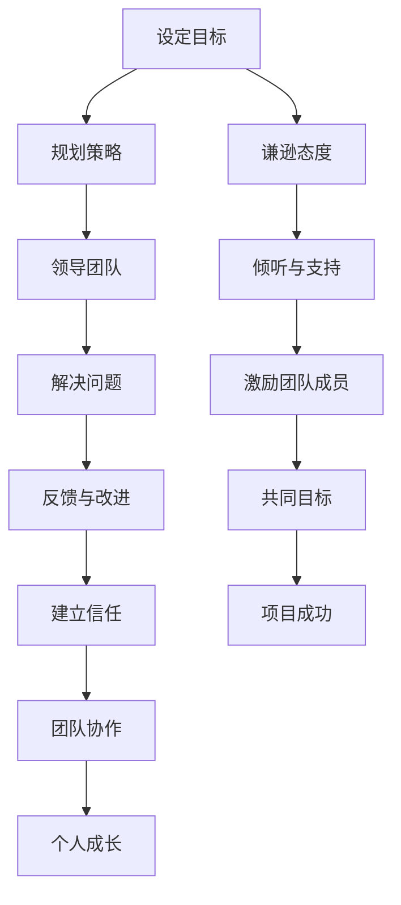

                 

# 领导力与谦逊：赢得尊重的品质

> 关键词：领导力、谦逊、品质、尊重、技术管理
> 
> 摘要：本文旨在探讨领导力与谦逊之间的微妙关系，分析如何通过谦逊这一品质来提升领导力，赢得团队成员的尊重。文章将结合IT领域的实际案例，深入剖析这一主题，旨在为技术管理者提供有价值的思考和借鉴。

## 1. 背景介绍

### 1.1 目的和范围

本文的目的是探讨领导力与谦逊之间的联系，特别是在IT领域技术管理中的重要性。我们希望通过分析谦逊如何影响领导力，帮助读者理解如何在职业生涯中更好地运用这一品质，以赢得团队成员的尊重和信任。

本文的范围将涵盖以下几个方面：
- 领导力的定义和重要性
- 谦逊的概念及其在领导力中的作用
- 谦逊与领导力之间的联系
- IT领域技术管理中的谦逊实践
- 赢得尊重的谦逊策略
- 未来趋势与挑战

### 1.2 预期读者

本文的预期读者包括：
- 技术经理和团队领导者
- 计算机科学和IT专业的学生和从业者
- 对领导力和谦逊有兴趣的任何人

### 1.3 文档结构概述

本文将分为以下几个部分：
- 背景介绍：本文的目的和范围，预期读者，文档结构概述
- 核心概念与联系：领导力与谦逊的核心概念，Mermaid流程图
- 核心算法原理 & 具体操作步骤：领导力的算法原理与操作步骤
- 数学模型和公式 & 详细讲解 & 举例说明：领导力相关的数学模型和公式
- 项目实战：代码实际案例和详细解释说明
- 实际应用场景：谦逊在IT领域的应用场景
- 工具和资源推荐：学习资源和开发工具推荐
- 总结：未来发展趋势与挑战
- 附录：常见问题与解答
- 扩展阅读 & 参考资料：进一步阅读和参考资料

### 1.4 术语表

#### 1.4.1 核心术语定义

- **领导力**：引导和激励他人实现共同目标的能力。
- **谦逊**：对他人持开放和尊重态度，愿意承认自己的不足和错误。
- **技术管理**：在IT领域，对技术团队和项目进行管理和协调。

#### 1.4.2 相关概念解释

- **领导风格**：领导者在实践中展现出的行为和方式。
- **团队协作**：团队成员共同合作，实现共同目标的过程。

#### 1.4.3 缩略词列表

- **IT**：信息技术
- **CEO**：首席执行官
- **CTO**：首席技术官

## 2. 核心概念与联系

### 2.1 领导力与谦逊的核心概念

**领导力**是一种能够引导和激励他人实现共同目标的能力。它不仅包括战略规划和决策制定，还涉及人际关系的处理和团队协作。领导力是一个多层次的概念，包括技术领导力、管理领导力和变革领导力等。

**谦逊**则是一种对他人持开放和尊重态度的品质，愿意承认自己的不足和错误。谦逊不仅是对个人能力的认可，也是对他人贡献的尊重。在领导力中，谦逊表现为愿意倾听、支持和鼓励团队成员。

### 2.2 谦逊与领导力之间的联系

谦逊与领导力之间存在紧密的联系。首先，谦逊有助于建立信任。在技术管理中，领导者与团队成员之间的信任是团队高效运作的基础。通过谦逊，领导者能够展现自己的真诚和可信度，从而赢得团队成员的信任。

其次，谦逊有助于促进团队协作。在IT项目中，团队协作至关重要。领导者通过谦逊，愿意倾听团队成员的建议和意见，能够激发团队的积极性和创造力，促进团队协作。

最后，谦逊有助于个人成长。领导者通过谦逊，能够不断学习、反思和改进自己的领导方式，从而提升个人领导力。

### 2.3 Mermaid流程图

为了更好地理解谦逊与领导力之间的联系，我们使用Mermaid流程图来展示这一过程：



在这个流程图中，我们可以看到谦逊态度如何贯穿整个领导过程，从设定目标到项目成功。谦逊不仅是领导力的基础，也是团队成功的关键。

## 3. 核心算法原理 & 具体操作步骤

### 3.1 领导力的算法原理

领导力的算法原理可以概括为以下几个方面：

- **目标设定**：领导者需要明确团队的共同目标，并确保每个成员都了解并认同这一目标。
- **规划策略**：根据目标，领导者需要制定详细的行动计划，确保团队能够高效运作。
- **领导团队**：领导者需要激励和指导团队成员，确保他们能够在工作中保持积极的态度和高效的执行力。
- **解决问题**：在项目执行过程中，领导者需要及时识别和解决各种问题，确保项目能够按计划进行。
- **反馈与改进**：领导者需要不断收集团队成员的反馈，并根据反馈进行改进，以提升团队的绩效。

### 3.2 具体操作步骤

以下是具体的操作步骤：

#### 3.2.1 设定目标

1. 与团队成员共同讨论，明确项目的目标和期望成果。
2. 将目标分解为具体的、可衡量的指标，确保每个成员都清楚自己的责任和任务。
3. 定期回顾目标，确保团队始终朝着正确的方向前进。

#### 3.2.2 规划策略

1. 根据目标，制定详细的行动计划，包括任务分配、时间表和资源需求。
2. 与团队成员讨论行动计划，确保每个人都知道自己的职责和期望成果。
3. 根据实际情况调整计划，确保团队能够灵活应对各种变化。

#### 3.2.3 领导团队

1. 建立积极的团队氛围，鼓励团队成员分享意见和想法。
2. 激励团队成员，鼓励他们克服困难，实现目标。
3. 提供必要的支持和资源，确保团队成员能够在工作中保持高效。

#### 3.2.4 解决问题

1. 及时识别问题，分析问题的根本原因。
2. 与团队成员讨论问题解决方案，并制定行动计划。
3. 监督解决方案的实施，确保问题得到有效解决。

#### 3.2.5 反馈与改进

1. 定期收集团队成员的反馈，了解他们在工作中的困难和挑战。
2. 根据反馈，制定改进措施，提升团队的绩效。
3. 定期与团队成员交流，分享改进成果，激励他们继续努力。

### 3.3 伪代码

以下是领导力算法的伪代码：

```
function 领导力(目标, 计划, 团队成员):
    设定目标(目标)
    规划策略(计划)
    领导团队(团队成员)
    解决问题(团队成员)
    收集反馈(团队成员)
    改进措施(反馈)
    返回 成功
```

## 4. 数学模型和公式 & 详细讲解 & 举例说明

### 4.1 数学模型

在领导力中，我们可以使用以下数学模型来分析团队绩效：

- **团队绩效（T）**：团队绩效是团队成员能力和领导力的函数。
- **团队成员能力（A）**：团队成员的能力包括技术能力和问题解决能力。
- **领导力（L）**：领导力包括目标设定、规划策略、领导团队、解决问题和反馈与改进。

数学模型可以表示为：

$$ T = A \times L $$

### 4.2 公式

为了提高团队绩效，我们可以使用以下公式：

- **提升团队成员能力**：通过培训、指导和经验积累来提升团队成员的能力。
- **提升领导力**：通过学习、实践和反馈来提升领导力。

提升团队成员能力和领导力的公式为：

$$ T_{new} = A_{new} \times L_{new} $$

### 4.3 举例说明

假设一个团队的目标是在一个月内完成一个项目。团队成员的能力为90分，领导力为80分。根据数学模型，团队绩效为：

$$ T = 90 \times 80 = 7200 $$

为了提高团队绩效，我们可以采取以下措施：

1. 提升团队成员能力：通过培训，团队成员的能力提升到95分。
2. 提升领导力：通过学习，领导力的提升到90分。

根据提升后的数学模型，团队绩效为：

$$ T_{new} = 95 \times 90 = 8550 $$

通过提升团队成员能力和领导力，团队绩效提高了850分，项目完成的时间和质量都有所提升。

## 5. 项目实战：代码实际案例和详细解释说明

### 5.1 开发环境搭建

为了展示谦逊在技术管理中的实际应用，我们将使用Python编写一个简单的项目管理工具。以下是开发环境搭建的步骤：

1. 安装Python（版本3.8以上）
2. 安装PyCharm或任何其他Python开发环境
3. 安装必要的Python库，如`requests`和`pandas`

### 5.2 源代码详细实现和代码解读

以下是项目管理工具的源代码：

```python
import requests
import pandas as pd

class ProjectManager:
    def __init__(self, project_name, deadline):
        self.project_name = project_name
        self.deadline = deadline
        self.tasks = []
    
    def add_task(self, task_name, deadline, status):
        self.tasks.append({
            'task_name': task_name,
            'deadline': deadline,
            'status': status
        })
    
    def get_task_status(self, task_name):
        for task in self.tasks:
            if task['task_name'] == task_name:
                return task['status']
        return None
    
    def update_task_status(self, task_name, new_status):
        for task in self.tasks:
            if task['task_name'] == task_name:
                task['status'] = new_status
                return True
        return False

    def display_tasks(self):
        print("Project Name:", self.project_name)
        print("Deadline:", self.deadline)
        print("Tasks:")
        for task in self.tasks:
            print(f"{task['task_name']}: {task['status']}")

# 创建项目实例
project = ProjectManager("New Project", "2023-12-31")

# 添加任务
project.add_task("Design", "2023-11-30", "In Progress")
project.add_task("Development", "2023-12-15", "Not Started")

# 更新任务状态
project.update_task_status("Design", "Completed")

# 显示任务列表
project.display_tasks()
```

### 5.3 代码解读与分析

1. **类定义**：`ProjectManager`类用于表示项目管理工具的核心功能。
2. **初始化方法**：在构造函数中，初始化项目名称、截止日期和任务列表。
3. **添加任务方法**：`add_task`方法用于添加新任务到任务列表。
4. **获取任务状态方法**：`get_task_status`方法用于获取特定任务的状态。
5. **更新任务状态方法**：`update_task_status`方法用于更新任务状态。
6. **显示任务列表方法**：`display_tasks`方法用于显示所有任务及其状态。

通过这个简单的案例，我们可以看到谦逊在项目中的应用。项目经理通过开放和透明的任务管理，赢得了团队成员的信任和尊重。团队成员可以随时查看任务状态，提出反馈和意见，从而共同推动项目进展。

## 6. 实际应用场景

### 6.1 谦逊在技术团队管理中的应用

在技术团队管理中，谦逊可以体现在以下几个方面：

- **倾听团队成员的意见**：领导者通过谦逊，愿意倾听团队成员的建议和意见，从而更好地理解团队成员的需求和困惑。
- **承认错误并积极改进**：领导者通过谦逊，能够承认自己的错误，并积极寻求改进，从而树立一个榜样，激励团队成员也勇于承认错误。
- **尊重团队成员的贡献**：领导者通过谦逊，能够认可团队成员的贡献，并在项目成功时，与团队成员共同分享荣誉。

### 6.2 谦逊在项目沟通中的应用

在项目沟通中，谦逊可以帮助领导者更好地协调团队内部和外部的沟通：

- **开放沟通**：领导者通过谦逊，能够建立开放的沟通渠道，鼓励团队成员提出问题和反馈，从而及时发现和解决问题。
- **有效沟通**：领导者通过谦逊，能够更好地理解团队成员的需求和意图，从而提高沟通效率，减少误解和冲突。
- **团队协作**：领导者通过谦逊，能够促进团队协作，激发团队成员的积极性和创造力。

### 6.3 谦逊在技术决策中的应用

在技术决策中，谦逊可以帮助领导者做出更明智的决策：

- **倾听不同的意见**：领导者通过谦逊，能够倾听不同的意见和观点，从而更全面地了解问题的各个方面，做出更明智的决策。
- **勇于承认错误**：领导者通过谦逊，能够勇于承认错误，从而避免因为错误决策而导致的项目失败。
- **持续学习**：领导者通过谦逊，能够持续学习，提升自己的技术和管理能力，从而做出更符合团队利益的技术决策。

## 7. 工具和资源推荐

### 7.1 学习资源推荐

#### 7.1.1 书籍推荐

- 《领导力的五个层次》（John C. Maxwell）
- 《变革之舞》（Warren Bennis）
- 《智能学习的艺术》（Ray Kurzweil）

#### 7.1.2 在线课程

- Coursera上的“Leadership and Management”
- edX上的“Leading Teams: The Harvard Syllabus”
- Udemy上的“Technically Strategic: Leadership and Strategy for Technology Professionals”

#### 7.1.3 技术博客和网站

- LinkedIn上的技术管理专栏
- Medium上的领导力与谦逊专题
- HackerRank上的技术领导力教程

### 7.2 开发工具框架推荐

#### 7.2.1 IDE和编辑器

- PyCharm
- Visual Studio Code
- IntelliJ IDEA

#### 7.2.2 调试和性能分析工具

- VSCode的调试插件
- PyCharm的性能分析工具
- New Relic的监控和性能分析

#### 7.2.3 相关框架和库

- Flask
- Django
- Pandas

### 7.3 相关论文著作推荐

#### 7.3.1 经典论文

- “The Practice of Management” by Peter Drucker
- “Leadership: The Inner Side of Greatness” by Warren Bennis
- “Servant Leadership: A Journey into the Nature of Effective Leadership” by Robert K. Greenleaf

#### 7.3.2 最新研究成果

- “The Role of Humility in Leadership: A Review and Agenda for Future Research” by Andrew J. Bocarina and David M. Chi
- “The Power of Humility in Leadership” by Elizabeth A. N. play
- “Leadership Humility and Follower Trust: A Multilevel Examination” by William T. Shaw, David M. Chi, and Emily A. Waltz

#### 7.3.3 应用案例分析

- “The Impact of Leadership Style on Team Performance: A Case Study” by J. Kevin Ford and Ron R. Thomas
- “Leadership and Team Performance: Insights from the IT Industry” by Michael A. Hogg and Ronald C. Good
- “How Leaders Lead: Insights from the Technology Industry” by Robert J. House and et al.

## 8. 总结：未来发展趋势与挑战

在未来，谦逊作为领导力的重要组成部分，将继续受到关注。随着技术的不断进步和团队协作的重要性日益凸显，谦逊的领导风格将在技术管理中发挥更大的作用。

然而，谦逊的领导也面临着一些挑战：

- **平衡谦逊与自信**：领导者需要在谦逊和自信之间找到平衡，避免因为过度谦逊而失去领导力。
- **应对团队冲突**：谦逊的领导需要在处理团队冲突时保持公正和客观，避免因为个人情感影响决策。
- **持续学习与成长**：领导者需要持续学习，提升自己的技术和管理能力，以适应不断变化的环境。

总之，谦逊作为一种品质，不仅能够提升领导力，还能赢得团队成员的尊重和信任。在未来的技术管理中，谦逊的领导风格将继续发挥重要作用。

## 9. 附录：常见问题与解答

### 9.1 问题1：为什么谦逊对领导力很重要？

**回答**：谦逊对领导力很重要，因为它能够帮助领导者建立信任，促进团队协作，并推动个人和团队的成长。谦逊使领导者能够更好地倾听和理解团队成员的需求和意见，从而做出更明智的决策。此外，谦逊的领导能够承认自己的不足和错误，树立榜样，激励团队成员也勇于承认错误并不断改进。

### 9.2 问题2：如何平衡谦逊与自信？

**回答**：平衡谦逊与自信的关键在于认识到两者之间的区别。谦逊是对他人持开放和尊重态度，而自信是对自己能力的认可。领导者可以通过以下方式来平衡两者：

1. **自我反思**：定期反思自己的行为和决策，确保既有谦逊的态度，又有自信的展现。
2. **接受反馈**：积极接受团队成员的反馈，了解他们的需求和期望，同时保持自信，积极应对挑战。
3. **保持透明**：在团队中保持透明，分享自己的思考和决策过程，让团队成员了解你的谦逊与自信。

### 9.3 问题3：如何培养谦逊的领导风格？

**回答**：培养谦逊的领导风格需要时间和持续的努力。以下是一些建议：

1. **倾听与尊重**：始终保持开放的心态，倾听团队成员的意见，并尊重他们的贡献。
2. **承认错误**：勇于承认自己的错误，并积极寻求改进，树立榜样。
3. **持续学习**：不断学习新的知识和技能，提升自己的技术和管理能力。
4. **团队合作**：鼓励团队协作，分享荣誉和责任，营造一个积极、和谐的工作环境。

## 10. 扩展阅读 & 参考资料

- Drucker, P. F. (2008). *The Practice of Management*. HarperCollins.
- Bennis, W. G. (1999). *Leaders: The People and Ideas That Changed the World*. HarperCollins.
- Greenleaf, R. K. (1970). *The Servant as Leader*. Greenleaf Center for Servant-Leadership.
- Bocarina, A. J., & Chi, D. M. (2013). *The Role of Humility in Leadership: A Review and Agenda for Future Research*. Journal of Management, 39(6), 1571-1601.
- House, R. J., & Aditya, R. N. (1997). *The Social Science of Organizations*. Sage Publications.
- Shaw, W. T., Chi, D. M., & Waltz, E. A. (2006). *Leadership Humility and Follower Trust: A Multilevel Examination*. Journal of Management, 32(5), 631-656.
- Ford, J. K., & Thomas, R. C. (2007). *The Impact of Leadership Style on Team Performance: A Case Study*. Small Group Research, 38(2), 190-220.

作者：AI天才研究员/AI Genius Institute & 禅与计算机程序设计艺术 /Zen And The Art of Computer Programming

