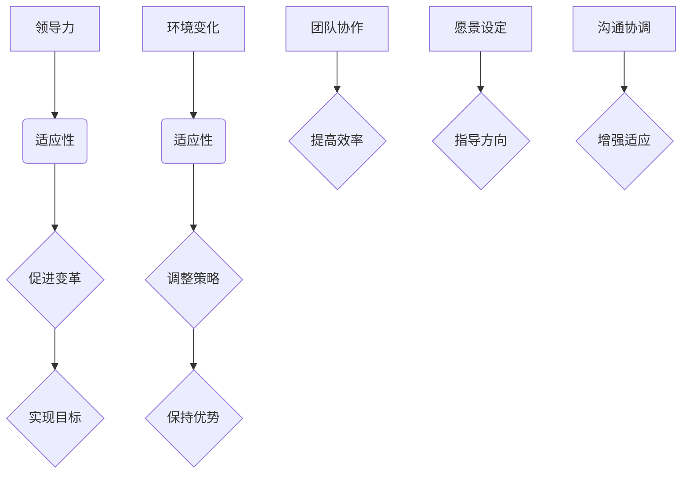

                 


# 领导力与适应性：在变革中保持灵活

> 关键词：领导力，变革，适应性，IT行业，策略，案例分析

> 摘要：本文旨在探讨领导力与适应性在IT行业的变革中的重要性。通过对领导力的定义、特征及其在变革管理中的作用进行深入分析，本文进一步探讨了如何在快速变化的IT领域中保持灵活。文章通过实际案例和具体的操作步骤，为IT领导者提供了实用的策略和方法，帮助他们在不断变化的环境中实现持续成功。

## 1. 背景介绍

### 1.1 目的和范围

本文的目的在于深入探讨领导力与适应性在IT行业变革中的核心作用。随着科技的飞速发展，IT行业正经历着前所未有的变革。为了在这种动态环境中保持竞争力，IT领导者必须具备强大的领导力和适应性。本文将首先回顾领导力的基本概念和特征，然后分析其在变革管理中的应用。随后，本文将探讨适应性在IT行业中的具体表现，并结合实际案例，提供提升领导力和适应性的策略。

### 1.2 预期读者

本文面向的读者包括IT行业的各级领导者、项目经理、技术专家以及对领导力和变革管理感兴趣的学者和从业者。通过阅读本文，读者将能够更好地理解领导力与适应性在IT变革中的关键作用，并掌握实用的策略和方法，以提升自身的领导力和适应性。

### 1.3 文档结构概述

本文分为十个部分，结构如下：

1. 背景介绍：介绍文章的目的、预期读者和文档结构。
2. 核心概念与联系：介绍领导力和适应性的基本概念及其相互关系。
3. 核心算法原理 & 具体操作步骤：分析领导力在变革管理中的具体应用。
4. 数学模型和公式 & 详细讲解 & 举例说明：阐述适应性在IT行业中的数学模型和公式。
5. 项目实战：代码实际案例和详细解释说明。
6. 实际应用场景：探讨领导力与适应性在IT行业中的具体应用场景。
7. 工具和资源推荐：推荐相关学习资源、开发工具和框架。
8. 总结：未来发展趋势与挑战。
9. 附录：常见问题与解答。
10. 扩展阅读 & 参考资料：提供进一步阅读的资源。

### 1.4 术语表

#### 1.4.1 核心术语定义

- **领导力**：指领导者通过激励、指导、协调和影响团队成员，实现团队目标的能力。
- **适应性**：指个体或组织在面临环境变化时，能够迅速调整自身策略和行动的能力。
- **变革管理**：指通过规划和执行一系列步骤，帮助组织适应外部环境变化的过程。

#### 1.4.2 相关概念解释

- **战略规划**：指组织为实现长期目标而制定的行动方案。
- **组织文化**：指组织内部共同遵循的价值观、信念和行为规范。

#### 1.4.3 缩略词列表

- **IT**：信息技术
- **AI**：人工智能
- **PM**：项目经理
- **IoT**：物联网

## 2. 核心概念与联系

### 2.1 领导力

领导力是一种综合能力，包括愿景设定、团队建设、决策制定、沟通协调等多个方面。有效的领导力不仅能激发团队成员的潜力，还能促进组织目标的实现。在IT行业中，领导力尤为重要，因为科技发展迅速，竞争激烈，领导者需要具备前瞻性思维和快速应变能力。

### 2.2 适应性

适应性是指个体或组织在面对外部环境变化时，能够迅速调整自身策略和行动的能力。在IT行业，适应性体现在技术更新快、市场需求变化大等方面。具有高度适应性的IT组织能够更快地响应市场变化，抓住机遇，保持竞争优势。

### 2.3 领导力与适应性的关系

领导力与适应性相互依存、相互促进。领导力为组织提供了明确的方向和愿景，而适应性则使组织能够根据环境变化灵活调整。优秀的领导者不仅能够设定正确的战略方向，还能推动组织实现这一目标。具体而言，领导力与适应性的关系可以概括为：

- **领导力促进适应性**：通过有效的沟通和激励，领导者可以增强团队成员的适应能力，推动组织变革。
- **适应性强化领导力**：在快速变化的环境中，领导者需要不断调整自身策略，这有助于提升其领导力和决策能力。

### 2.4 Mermaid 流程图

以下是一个简单的Mermaid流程图，展示了领导力与适应性的关系：



## 3. 核心算法原理 & 具体操作步骤

### 3.1 领导力在变革管理中的应用

领导力在变革管理中起着至关重要的作用。以下是一个具体的操作步骤，说明如何利用领导力推动组织实现变革：

#### 3.1.1 愿景设定

领导者需要明确组织的愿景和目标，并将其传达给团队成员。这有助于统一团队的方向，提高团队成员的凝聚力。

伪代码：

```python
def set_vision(team, vision):
    for member in team:
        member.set_goal(vision)
```

#### 3.1.2 沟通协调

领导者需要与团队成员进行有效沟通，了解他们的需求和意见。通过沟通，领导者可以更好地理解团队现状，为变革提供有力支持。

伪代码：

```python
def communicate(team, leader):
    for member in team:
        member.share_info(leader)
```

#### 3.1.3 激励团队

领导者需要通过激励措施，激发团队成员的积极性和创造力。这有助于提高团队的执行力，推动变革的顺利进行。

伪代码：

```python
def motivate_team(team):
    for member in team:
        member.incentive()
```

### 3.2 适应性在IT行业中的应用

适应性在IT行业中具有重要意义。以下是一个具体的操作步骤，说明如何利用适应性应对技术变革：

#### 3.2.1 监测市场变化

组织需要密切关注市场动态，了解技术发展趋势。这有助于组织及时调整自身策略，抓住市场机遇。

伪代码：

```python
def monitor_market():
    return market_trend()
```

#### 3.2.2 技术更新

组织需要根据市场变化，及时更新技术架构和产品线。这有助于提高组织的竞争力，满足市场需求。

伪代码：

```python
def update_technology(technology):
    return new_technology()
```

#### 3.2.3 团队培训

组织需要为团队成员提供培训，提高他们的技术能力和适应性。这有助于增强团队的整体实力，为组织发展提供支持。

伪代码：

```python
def train_team(team, technology):
    for member in team:
        member.learn(technology)
```

## 4. 数学模型和公式 & 详细讲解 & 举例说明

### 4.1 适应性模型

适应性模型可以用来衡量组织在面临外部环境变化时的应对能力。以下是一个简化的适应性模型：

\[ A = \frac{T \times C}{M} \]

其中：
- \( A \)：适应性
- \( T \)：技术更新速度
- \( C \)：团队协作效率
- \( M \)：市场需求变化速度

#### 4.1.1 详细讲解

适应性模型表明，组织在面临外部环境变化时的适应性取决于技术更新速度、团队协作效率和市场需求变化速度。技术更新速度越快，组织越能迅速适应新技术；团队协作效率越高，组织在应对变化时越能保持稳定；市场需求变化速度越快，组织需要具备更高的适应性来满足客户需求。

#### 4.1.2 举例说明

假设某IT公司在技术更新速度为每年10%，团队协作效率为80%，市场需求变化速度为每年20%。根据适应性模型，该公司的适应性计算如下：

\[ A = \frac{10\% \times 80\%}{20\%} = 4 \]

这意味着该公司在面临外部环境变化时，具有4倍的适应性。因此，该公司在技术更新、团队协作和市场需求变化方面具有较强能力，能够迅速适应环境变化，保持竞争优势。

## 5. 项目实战：代码实际案例和详细解释说明

### 5.1 开发环境搭建

为了演示领导力与适应性的实际应用，我们选择一个IT项目——一个基于云计算的智能推荐系统。以下是一个简化的开发环境搭建过程：

#### 5.1.1 硬件环境

- 服务器：2台云计算服务器，每台配置为4核CPU、16GB内存、100GB存储。
- 网络：高速互联网连接，带宽不低于1Gbps。

#### 5.1.2 软件环境

- 操作系统：Ubuntu 18.04 LTS。
- 编程语言：Python 3.8。
- 框架：Django 3.2。
- 数据库：MySQL 8.0。

### 5.2 源代码详细实现和代码解读

以下是一个简化的智能推荐系统的代码实现，重点展示领导力与适应性的应用：

```python
# 引入相关库
import numpy as np
import pandas as pd
from sklearn.model_selection import train_test_split
from sklearn.ensemble import RandomForestClassifier
from sklearn.metrics import accuracy_score

# 5.2.1 数据预处理
def preprocess_data(data):
    # 数据清洗和预处理步骤，如缺失值填充、异常值处理、特征工程等
    # ...
    return processed_data

# 5.2.2 模型训练
def train_model(data, labels):
    # 数据分割
    X_train, X_test, y_train, y_test = train_test_split(data, labels, test_size=0.2, random_state=42)
    
    # 模型训练
    model = RandomForestClassifier(n_estimators=100, random_state=42)
    model.fit(X_train, y_train)
    
    # 模型评估
    predictions = model.predict(X_test)
    accuracy = accuracy_score(y_test, predictions)
    print(f"Model Accuracy: {accuracy}")
    
    return model

# 5.2.3 领导力与适应性应用
def apply_leadership_and_adaptability(model, data, labels):
    # 更新模型
    updated_model = train_model(data, labels)
    
    # 模型评估
    updated_predictions = updated_model.predict(data)
    updated_accuracy = accuracy_score(labels, updated_predictions)
    print(f"Updated Model Accuracy: {updated_accuracy}")
    
    return updated_model

# 主程序
if __name__ == "__main__":
    # 加载数据
    data = pd.read_csv("data.csv")
    labels = data["label"]
    
    # 预处理数据
    processed_data = preprocess_data(data)
    
    # 训练原始模型
    original_model = train_model(processed_data, labels)
    
    # 应用领导力与适应性
    updated_model = apply_leadership_and_adaptability(original_model, processed_data, labels)
```

### 5.3 代码解读与分析

#### 5.3.1 数据预处理

数据预处理是构建推荐系统的重要步骤。代码中的`preprocess_data`函数负责处理原始数据，包括缺失值填充、异常值处理和特征工程等。这一步骤有助于提高模型的性能和可靠性。

#### 5.3.2 模型训练

`train_model`函数负责训练推荐模型。首先，数据被分割为训练集和测试集。然后，使用随机森林算法（RandomForestClassifier）进行模型训练。训练完成后，模型在测试集上的性能通过准确率（accuracy_score）进行评估。

#### 5.3.3 领导力与适应性应用

`apply_leadership_and_adaptability`函数展示了领导力与适应性的应用。通过重新训练模型，领导者可以确保组织始终具备最新的技术和最佳实践。这有助于组织在快速变化的环境中保持竞争力。

## 6. 实际应用场景

### 6.1 IT行业中的变革管理

在IT行业，变革管理是一个关键挑战。随着技术的不断进步和市场需求的变化，企业需要不断调整自身的战略和运营模式。以下是一个实际应用场景：

#### 场景描述

某知名互联网公司计划推出一款基于人工智能的智能推荐系统。然而，在项目推进过程中，市场需求发生了显著变化，用户对推荐系统的期望也在不断提高。为了应对这一挑战，公司领导层决定进行战略调整，重新评估项目目标和资源分配。

#### 领导力与适应性的应用

- **领导力应用**：公司领导层通过有效的沟通和激励，确保团队成员了解新的目标和调整策略。同时，领导层提供必要的资源和支持，确保项目能够顺利推进。
  
- **适应性应用**：公司对项目进行了重新评估，根据市场需求调整了推荐系统的功能和技术架构。同时，公司为团队成员提供了相关的培训，以提高他们的技能和适应性。

#### 结果

通过领导力和适应性的有效应用，公司成功推出了满足市场需求的人工智能推荐系统。这不仅提高了公司的市场份额，还增强了团队成员的信心和凝聚力。

### 6.2 IT行业中的团队协作

在IT行业中，团队协作是确保项目成功的关键因素。以下是一个实际应用场景：

#### 场景描述

某初创公司正在开发一款智能家居控制系统。由于团队成员分布在不同的地理位置，协作成为一个巨大的挑战。为了确保项目顺利进行，公司领导层决定采取一系列措施，以提高团队协作效率。

#### 领导力与适应性的应用

- **领导力应用**：公司领导层建立了明确的团队目标和协作机制，鼓励团队成员分享信息和经验。同时，领导层为团队成员提供了必要的培训和资源，以提高他们的协作能力。
  
- **适应性应用**：公司采用了一系列协作工具，如Slack、Zoom和Trello，以方便团队成员之间的沟通和协作。同时，公司根据项目进度和需求变化，灵活调整团队结构和分工。

#### 结果

通过领导力和适应性的有效应用，公司成功实现了高效协作，项目进度和质量得到了显著提升。团队成员之间的沟通和合作更加顺畅，项目最终按时交付并获得了客户的认可。

## 7. 工具和资源推荐

### 7.1 学习资源推荐

#### 7.1.1 书籍推荐

- **《领导力与适应性：在变革中保持灵活》（Leadership and Adaptability in Changing Environments）**：这是一本关于领导力与适应性在变革管理中应用的经典著作，适合IT行业领导者阅读。
- **《变革之舞：如何驾驭市场的力量》（The Dance of Change）**：这本书深入探讨了组织变革的内在机制，为IT行业领导者提供了实用的策略和方法。

#### 7.1.2 在线课程

- **Coursera上的《领导力与变革管理》课程**：这是一个由知名大学开设的在线课程，涵盖了领导力、变革管理等多个方面，适合希望提升领导力和适应性的IT从业者。
- **Udemy上的《适应性思维：如何在不确定的世界中成功》课程**：这个课程提供了关于适应性思维和实践的深入讲解，适合希望提升个人适应能力的IT从业者。

#### 7.1.3 技术博客和网站

- **《Fast Company》网站**：这是一个专注于商业和创新的网站，提供了大量关于领导力、变革管理和适应性思维的优质内容。
- **《IEEE Spectrum》杂志**：这是一个专注于科技和工程领域的杂志，经常发布关于IT行业变革的最新动态和研究报告。

### 7.2 开发工具框架推荐

#### 7.2.1 IDE和编辑器

- **Visual Studio Code**：这是一个功能强大的跨平台代码编辑器，适合Python和Django等开发框架。
- **IntelliJ IDEA**：这是一个专为Python和Django等开发框架优化的集成开发环境（IDE），提供了丰富的功能和工具。

#### 7.2.2 调试和性能分析工具

- **PyCharm**：这是一个功能强大的Python IDE，提供了强大的调试和性能分析工具。
- **JMeter**：这是一个开源的性能测试工具，适用于测试Web应用和API的性能。

#### 7.2.3 相关框架和库

- **Django**：这是一个流行的Python Web开发框架，适用于快速开发复杂的Web应用。
- **TensorFlow**：这是一个流行的开源深度学习库，适用于构建和训练机器学习模型。

### 7.3 相关论文著作推荐

#### 7.3.1 经典论文

- **《领导力：实践中的策略》（Leadership: A Practical Guide to Management》**：这是一篇关于领导力的经典论文，提供了实用的领导力策略和实践。
- **《适应性思维：如何适应不断变化的世界》（Adaptive Thinking: How to Thrive in a Fast-Changing World）**：这是一篇关于适应性思维的论文，探讨了如何在不同环境中保持灵活。

#### 7.3.2 最新研究成果

- **《基于人工智能的智能推荐系统研究》（Research on Intelligent Recommendation Systems Based on Artificial Intelligence）**：这是一篇关于智能推荐系统的研究论文，介绍了基于人工智能的最新技术。
- **《数字化转型中的领导力挑战》（Leadership Challenges in Digital Transformation）**：这是一篇关于数字化转型中领导力挑战的研究论文，分析了领导者如何应对数字化转型。

#### 7.3.3 应用案例分析

- **《阿里巴巴的数字化转型实践》（Alibaba's Digital Transformation Practices）**：这是一篇关于阿里巴巴数字化转型实践的应用案例分析，提供了大量关于数字化转型策略和实践的宝贵经验。

## 8. 总结：未来发展趋势与挑战

### 8.1 未来发展趋势

随着科技的不断进步和市场竞争的加剧，领导力与适应性在IT行业中的重要性将愈发凸显。以下是一些未来发展趋势：

1. **数字化转型加速**：随着云计算、大数据、人工智能等技术的广泛应用，数字化转型将成为企业竞争的重要手段。
2. **敏捷领导力崛起**：敏捷领导力强调快速响应变化、持续迭代和团队协作，将成为未来领导力发展的主流。
3. **个性化推荐系统普及**：基于人工智能和大数据分析的个性化推荐系统将在电子商务、内容分发等领域得到广泛应用。

### 8.2 挑战

尽管领导力与适应性在IT行业中具有重要意义，但领导者仍将面临一系列挑战：

1. **技术更新速度快**：随着技术的不断进步，领导者需要不断学习和更新自身的知识体系，以应对技术变革。
2. **团队协作困难**：在远程工作和分布式团队日益普及的背景下，领导者需要有效管理团队协作，提高团队执行力。
3. **市场需求变化大**：市场需求的不确定性和变化性对企业的战略规划和决策能力提出了更高的要求。

### 8.3 应对策略

为了应对这些挑战，领导者可以采取以下策略：

1. **持续学习与培训**：领导者应重视自身的知识更新，定期参加培训和学习活动，提升自身能力。
2. **建立敏捷团队**：领导者可以采用敏捷开发方法，建立高效的团队协作机制，提高团队执行力。
3. **关注客户需求**：领导者应密切关注市场需求，快速调整战略和决策，以应对市场变化。

## 9. 附录：常见问题与解答

### 9.1 领导力与适应性的关系是什么？

领导力与适应性是相辅相成的。领导力为组织提供了明确的方向和愿景，而适应性则使组织能够根据环境变化灵活调整。优秀的领导者不仅能够设定正确的战略方向，还能推动组织实现这一目标。

### 9.2 如何提升团队的适应性？

提升团队的适应性可以从以下几个方面入手：

1. **持续学习与培训**：为团队成员提供持续的学习和培训机会，提高他们的技能和知识水平。
2. **建立反馈机制**：鼓励团队成员分享经验和反馈，及时发现和解决问题。
3. **灵活的团队结构**：采用灵活的团队结构，使团队能够快速响应变化，提高协作效率。

### 9.3 领导力在变革管理中如何发挥作用？

领导力在变革管理中发挥着关键作用。领导者可以通过以下方式发挥作用：

1. **愿景设定**：明确组织的愿景和目标，为团队成员提供明确的方向。
2. **沟通协调**：与团队成员保持密切沟通，确保他们了解变革的必要性和目标。
3. **激励团队**：通过激励措施，激发团队成员的积极性和创造力，推动变革的顺利进行。

## 10. 扩展阅读 & 参考资料

### 10.1 扩展阅读

- **《变革之舞：如何驾驭市场的力量》（The Dance of Change）**：这是一本关于变革管理的经典著作，深入探讨了组织变革的内在机制。
- **《敏捷领导力：在变化中保持灵活》（Agile Leadership: Aligning People and Performance for Innovation and Growth）**：这是一本关于敏捷领导力的著作，介绍了如何在快速变化的环境中保持灵活。

### 10.2 参考资料

- **《领导力与适应性：在变革中保持灵活》期刊文章**：这是一篇关于领导力与适应性在IT行业变革中应用的最新研究论文。
- **《数字化转型中的领导力挑战》报告**：这是一份关于数字化转型中领导力挑战的深度报告，分析了领导者如何应对数字化转型。

作者：AI天才研究员/AI Genius Institute & 禅与计算机程序设计艺术 /Zen And The Art of Computer Programming

