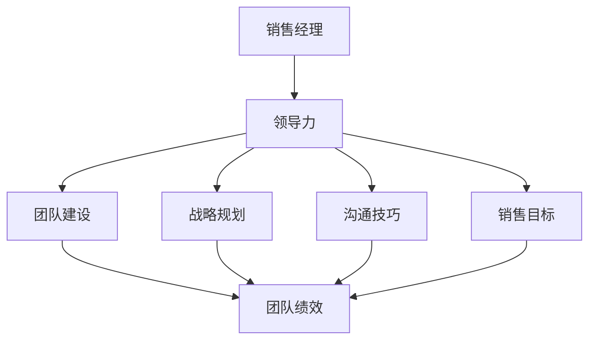
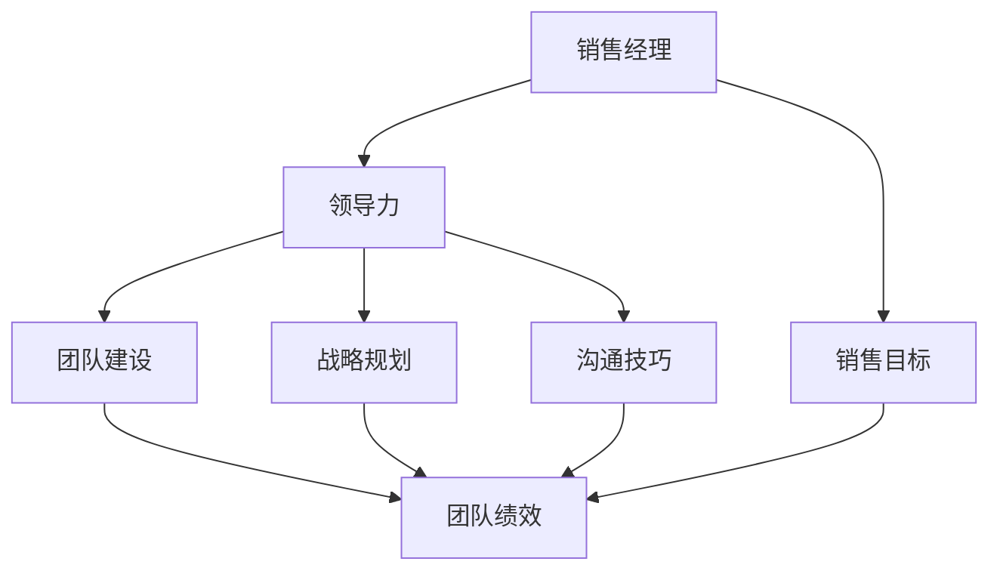

                 

# 领导力修炼手册：从销售经理到管理者的进阶指南

> **关键词**：领导力、销售经理、管理者、进阶、技能提升、团队建设、战略规划、沟通技巧
> 
> **摘要**：本文旨在为销售经理们提供一套完整的领导力修炼手册，帮助他们在向管理者角色转变的过程中，提升管理技能，优化团队绩效，实现个人和组织的共同成长。文章将深入探讨领导力的核心概念，剖析销售经理向管理者转变的路径，并提供实用的战略规划和沟通技巧，助力读者在职场中脱颖而出。

## 1. 背景介绍

### 1.1 目的和范围

本文的目的在于为销售经理们提供一本实用的指南，帮助他们从销售领域的专业人才向全面的管理者角色转变。文章将围绕领导力的核心概念，结合销售管理的实际需求，探讨销售经理在进阶过程中可能面临的挑战，以及应对策略。

本文的范围包括以下几个方面：

1. 领导力的定义和核心要素
2. 销售经理向管理者转变的路径
3. 战略规划和决策能力的重要性
4. 团队建设和团队管理的艺术
5. 沟通技巧的提升
6. 销售经理个人品牌的打造
7. 持续学习和职业发展

### 1.2 预期读者

本文的预期读者是那些已经在销售领域取得一定成就，但希望进一步提升自己的领导力和管理能力的销售经理。此外，对于希望了解销售经理进阶路径的企业高管和人力资源管理者，本文也将提供有价值的参考。

### 1.3 文档结构概述

本文将按照以下结构展开：

1. 背景介绍：明确文章的目的和范围，预期读者。
2. 核心概念与联系：介绍领导力的核心概念，并使用Mermaid流程图展示。
3. 核心算法原理 & 具体操作步骤：分析销售经理向管理者转变的路径，并提供具体操作步骤。
4. 数学模型和公式 & 详细讲解 & 举例说明：讨论战略规划和决策能力的重要性，并提供相关模型和公式。
5. 项目实战：提供实际案例，展示销售经理如何运用所学知识提升团队绩效。
6. 实际应用场景：分析销售经理在不同场景下的职责和角色。
7. 工具和资源推荐：推荐相关学习资源、开发工具和框架。
8. 总结：对未来发展趋势和挑战进行展望。
9. 附录：解答常见问题。
10. 扩展阅读 & 参考资料：提供进一步学习的资源。

### 1.4 术语表

#### 1.4.1 核心术语定义

- 领导力：指领导者通过激励和影响他人，实现组织目标的能力。
- 销售经理：负责管理和指导销售团队，实现销售目标的专业人员。
- 管理者：负责制定战略、指导团队、管理资源和实现组织目标的管理人员。
- 战略规划：制定长期目标和规划，以实现组织愿景的过程。
- 团队建设：通过建立信任、沟通和协作，提高团队绩效的过程。
- 沟通技巧：有效传达信息、倾听他人和解决冲突的能力。

#### 1.4.2 相关概念解释

- 销售目标：销售团队在一定时间内需要实现的具体销售业绩。
- 团队绩效：团队在完成销售目标过程中的表现和成果。
- 个人品牌：个人在职场中的声誉和形象。

#### 1.4.3 缩略词列表

- 领导力（Leadership）
- 销售经理（Sales Manager）
- 管理者（Manager）
- 战略规划（Strategic Planning）
- 团队建设（Team Building）
- 沟通技巧（Communication Skills）

## 2. 核心概念与联系

在探讨销售经理向管理者转变的过程中，首先需要理解领导力的核心概念及其与销售管理的联系。领导力不仅仅是管理能力，更是一种能够激发和引导他人实现共同目标的能力。以下是一个用Mermaid绘制的流程图，展示了领导力的核心概念及其与销售管理的关联。



在这个流程图中，我们可以看到领导力是销售经理向管理者转变的关键。领导力不仅需要体现在团队建设、战略规划和沟通技巧上，还需要在实现销售目标的过程中发挥重要作用。以下是每个核心概念的简要说明：

1. **销售经理**：负责销售团队的管理和指导，实现销售目标。
2. **领导力**：通过激励和影响他人，实现组织目标的能力。
3. **团队建设**：通过建立信任、沟通和协作，提高团队绩效。
4. **战略规划**：制定长期目标和规划，以实现组织愿景。
5. **沟通技巧**：有效传达信息、倾听他人和解决冲突的能力。
6. **销售目标**：销售团队在一定时间内需要实现的具体销售业绩。
7. **团队绩效**：团队在完成销售目标过程中的表现和成果。

通过这个流程图，我们可以清晰地看到销售经理在向管理者转变的过程中，需要不断提升领导力，并在团队建设、战略规划和沟通技巧等方面下功夫，以实现个人和团队的共同成长。

### 2.1 领导力的核心要素

领导力是一个复杂的概念，包含多个核心要素。以下是领导力的核心要素及其在销售管理中的应用：

#### 2.1.1 激励与愿景

激励是领导力的核心要素之一。领导者需要能够激发团队成员的内在动力，让他们愿意为实现组织目标而努力。这需要领导者拥有清晰、鼓舞人心的愿景，能够将团队的目标与个人的成长和成就感结合起来。

在销售管理中，激励与愿景的应用尤为关键。销售经理需要通过设定挑战性的目标、分享成功的案例和提供积极的反馈，激发团队成员的斗志。同时，销售经理应确保团队成员了解他们工作的重要性和贡献，从而增强他们的工作动力。

#### 2.1.2 影响与影响力

领导力不仅仅是管理，更是通过影响他人来实现共同目标的能力。领导者需要拥有一定的影响力，能够引导团队成员朝着正确的方向努力。这种影响力来自于领导者的专业能力、道德品质和人际交往技巧。

在销售管理中，影响力可以帮助销售经理更好地指导团队，解决冲突和推动变革。销售经理需要通过建立良好的人际关系、提升自身的专业素养和不断学习新技能，增强自己的影响力。

#### 2.1.3 沟通与协作

沟通与协作是领导力的另一重要组成部分。领导者需要具备良好的沟通技巧，能够清晰地传达信息、倾听他人的意见和需求，并促进团队成员之间的协作。

在销售管理中，良好的沟通和协作能力对于实现销售目标至关重要。销售经理需要确保信息在团队内流畅传递，确保团队成员了解销售策略、目标和行动计划。同时，销售经理应鼓励团队成员分享经验、观点和建议，共同解决销售难题。

#### 2.1.4 决策与战略规划

领导者需要具备良好的决策能力和战略规划能力。这包括在复杂情况下做出明智的决策，制定实现组织目标的长期战略。

在销售管理中，决策和战略规划能力对于销售经理至关重要。销售经理需要根据市场变化、竞争态势和团队表现，及时调整销售策略，确保团队始终朝着正确的方向前进。同时，销售经理应制定清晰的销售计划，确保团队在实现销售目标的过程中有章可循。

### 2.2 领导力与销售管理的关联

领导力与销售管理有着密切的联系。领导力不仅是销售经理个人素质的体现，更是实现销售目标、提升团队绩效的关键因素。以下是领导力在销售管理中的应用和体现：

#### 2.2.1 领导力在销售团队管理中的应用

在销售团队管理中，领导力主要体现在以下几个方面：

1. **激励团队**：销售经理需要通过设定激励措施，激发团队成员的斗志和积极性。这包括设定挑战性的目标、提供奖励和认可等。
2. **指导与辅导**：销售经理需要具备指导团队成员的能力，帮助他们克服困难、提升技能。同时，销售经理应提供及时的反馈和辅导，帮助团队成员改进工作方法。
3. **沟通与协作**：销售经理需要确保团队内部信息畅通，鼓励团队成员之间的协作和分享。这有助于提升团队的整体绩效和销售业绩。
4. **决策与规划**：销售经理需要具备良好的决策能力和战略规划能力，确保团队在实现销售目标的过程中有明确的战略方向和行动计划。

#### 2.2.2 领导力在销售管理中的体现

领导力在销售管理中的体现可以从以下几个方面来看：

1. **销售目标的实现**：领导力能够帮助销售经理制定清晰的销售目标，并推动团队实现这些目标。领导力使销售经理能够更好地激励团队、指导团队和制定有效的销售策略。
2. **团队绩效的提升**：领导力有助于提升团队的整体绩效。通过激发团队成员的积极性、提升团队协作和沟通效率，领导力能够推动团队实现更高的销售业绩。
3. **个人和职业发展**：领导力不仅对团队绩效有积极影响，还对销售经理的个人和职业发展起到关键作用。通过不断提升领导力，销售经理能够赢得更多机会，实现职业晋升和成长。

### 2.3 领导力的层级模型

领导力可以分为多个层级，不同层级的领导力在销售管理中的应用和体现也有所不同。以下是常见的领导力层级模型及其在销售管理中的应用：

#### 2.3.1 一级领导力

一级领导力主要关注个人层面的成长和自我管理。销售经理在这一层级需要关注以下几个方面：

1. **自我激励**：通过设定个人目标和激励措施，激发自身的动力和积极性。
2. **自我提升**：通过不断学习和实践，提升自身的专业技能和素质。
3. **情绪管理**：学会调节情绪，保持积极心态，面对销售挑战。

#### 2.3.2 二级领导力

二级领导力主要关注团队层面的管理和协作。销售经理在这一层级需要关注以下几个方面：

1. **团队建设**：通过建立信任、沟通和协作，提升团队的整体绩效。
2. **激励与辅导**：激励团队成员，提供及时的反馈和辅导，帮助他们提升技能和业绩。
3. **沟通与协作**：确保团队内部信息畅通，促进团队成员之间的协作和分享。

#### 2.3.3 三级领导力

三级领导力主要关注组织层面的战略规划和决策。销售经理在这一层级需要关注以下几个方面：

1. **战略规划**：根据市场变化和竞争态势，制定长期和短期的销售战略。
2. **决策与执行**：在复杂情况下做出明智的决策，并确保团队执行有效的销售策略。
3. **资源管理**：合理配置人力资源和资源，确保销售目标的实现。

通过这个领导力层级模型，我们可以看到销售经理在向管理者转变的过程中，需要不断提升自身的领导力，从关注个人成长到团队协作，再到组织战略，逐步实现领导力的全面提升。

### 2.4 领导力与销售管理的关系图解

为了更清晰地展示领导力与销售管理之间的关系，我们可以使用以下Mermaid流程图进行图解：



在这个流程图中，我们可以看到领导力是连接销售经理与销售管理各个方面的重要纽带。通过提升领导力，销售经理能够更好地实现销售目标，提升团队绩效，并在战略规划和沟通技巧方面发挥关键作用。

## 3. 核心算法原理 & 具体操作步骤

在领导力修炼过程中，销售经理需要掌握一系列核心算法原理，这些原理将帮助他们更高效地实现销售目标，提升团队绩效。以下是销售经理向管理者转变过程中需要掌握的核心算法原理和具体操作步骤。

### 3.1 目标设定与分解

**算法原理：**
目标设定与分解是管理过程中的关键步骤，它帮助销售经理将长期目标分解为可执行的任务，并分配给团队成员。

**具体操作步骤：**
1. **确定长期目标**：根据组织的整体战略，销售经理需要设定明确的长期销售目标。
2. **分解目标**：将长期目标分解为短期目标和可执行的任务，确保每个任务都有明确的目标和责任人。
3. **制定行动计划**：为每个任务制定详细的行动计划，包括时间表、资源和所需的技能。
4. **分配任务**：将任务分配给团队成员，并确保每个人了解他们的责任和期望。

**伪代码示例：**
```
function setAndDelegateGoals(largeGoal, teamMembers) {
    shortTermGoals = decomposeGoal(largeGoal);
    for (task in shortTermGoals) {
        assignTask(task, teamMembers);
        createActionPlan(task);
    }
}
```

### 3.2 绩效评估与反馈

**算法原理：**
绩效评估与反馈是确保团队成员按计划完成任务的重要手段，它帮助销售经理了解团队的工作状况，并提供改进建议。

**具体操作步骤：**
1. **设定绩效指标**：根据销售目标和行动计划，设定具体的绩效指标。
2. **监控进度**：定期监控团队成员的进度，确保他们按时完成任务。
3. **提供反馈**：根据绩效指标，提供及时的反馈，表扬优秀表现，指出不足之处。
4. **改进方案**：根据反馈结果，制定改进方案，帮助团队成员提升绩效。

**伪代码示例：**
```
function evaluatePerformance(tasks, performanceMetrics) {
    for (member in tasks) {
        if (performanceMetrics[member] > threshold) {
            providePositiveFeedback(member);
        } else {
            identifyAreasForImprovement(member);
        }
    }
}
```

### 3.3 团队协作与沟通

**算法原理：**
团队协作与沟通是领导力的核心要素，它帮助销售经理建立高效的团队，确保信息畅通，提升团队绩效。

**具体操作步骤：**
1. **建立沟通渠道**：确保团队内部有畅通的沟通渠道，如定期会议、即时通讯工具等。
2. **促进协作**：鼓励团队成员分享信息、经验和观点，促进协作。
3. **解决冲突**：在团队内部出现冲突时，及时解决，确保团队稳定和谐。
4. **培训沟通技能**：定期为团队成员提供沟通技能培训，提升团队的整体沟通效率。

**伪代码示例：**
```
function promoteTeamCollaboration(teamMembers, communicationTools) {
    establishCommunicationChannels(communicationTools);
    encourageInformationSharing(teamMembers);
    resolveConflicts(teamMembers);
    provideCommunicationTraining(teamMembers);
}
```

### 3.4 战略规划与决策

**算法原理：**
战略规划与决策是销售经理在领导力层级中的核心能力，它帮助销售经理制定长期和短期的销售策略，并在复杂情况下做出明智的决策。

**具体操作步骤：**
1. **市场分析**：对市场环境、竞争态势和客户需求进行深入分析。
2. **制定战略**：根据市场分析结果，制定长期和短期的销售战略。
3. **决策制定**：在战略执行过程中，面对各种挑战和变化，制定明智的决策。
4. **资源分配**：合理分配人力资源和资源，确保战略的有效执行。

**伪代码示例：**
```
function strategicPlanningAndDecisionMaking(marketAnalysis, strategicOptions) {
    marketAnalysisResult = analyzeMarket(marketData);
    longTermStrategy = formulateStrategy(marketAnalysisResult);
    shortTermStrategy = adaptStrategy(longTermStrategy, marketChanges);
    decision = makeDecision(strategicOptions);
    allocateResources(decision);
}
```

通过上述核心算法原理和具体操作步骤，销售经理可以更好地实现销售目标，提升团队绩效，并在向管理者转变的过程中不断提升自己的领导力。

### 3.5 团队建设与领导风格

**算法原理：**
团队建设是领导力的重要组成部分，它通过构建信任、提高协作和提升团队绩效，使团队成为一个高效的团队。而领导风格则是影响团队建设的关键因素，不同的领导风格会影响团队成员的工作态度和团队的整体氛围。

**具体操作步骤：**

1. **了解团队成员**：首先，销售经理需要花时间了解每个团队成员的背景、技能和个性。这有助于销售经理更好地分配任务和制定个性化的管理策略。
    ```python
    function understandTeamMembers(teamMembers) {
        for (member in teamMembers) {
            collectBackgroundInformation(member);
            assessSkills(member);
            understandPersonalities(member);
        }
    }
    ```

2. **建立信任**：信任是团队协作的基础。销售经理可以通过透明沟通、一致性行为和公平对待来建立信任。
    ```python
    function buildTrust(teamMembers) {
        communicateTransparently(teamMembers);
        demonstrateConsistency();
        treatEquitably(teamMembers);
    }
    ```

3. **鼓励协作**：通过设定共同目标、促进知识分享和提供协作工具，销售经理可以鼓励团队成员之间的协作。
    ```python
    function encourageCollaboration(teamMembers, commonGoals) {
        setSharedGoals(teamMembers, commonGoals);
        promoteKnowledgeSharing(teamMembers);
        provideCollaborationTools();
    }
    ```

4. **培养领导风格**：根据团队成员的特点和团队的需求，销售经理需要选择合适的领导风格。以下是几种常见的领导风格及其适用场景：
    - **权威型领导**：适用于团队需要迅速决策和执行的情况。
        ```python
        function authoritativeLeadership(teamMembers, criticalSituation) {
            makeRapidDecisions(teamMembers, criticalSituation);
            enforceDiscipline();
        }
        ```
    - **民主型领导**：适用于团队需要参与决策和有较强自主性的情况。
        ```python
        function democraticLeadership(teamMembers, strategicDecisions) {
            inviteInput(teamMembers);
            facilitateDiscussion();
            reachConsensus();
        }
        ```
    - **支持型领导**：适用于团队需要鼓励和支持的情况，尤其是面对压力和挑战时。
        ```python
        function supportiveLeadership(teamMembers, stressfulSituation) {
            provideEncouragement(teamMembers);
            offerSupport();
            maintainPositiveWorkEnvironment();
        }
        ```

5. **评估和调整**：定期评估团队建设和领导风格的效果，并根据反馈进行必要的调整。
    ```python
    function evaluateAndAdjust(teamMembers, leadershipStyle) {
        collectFeedback(teamMembers);
        assessTeamPerformance();
        makeAdjustmentsBasedOnFeedback();
    }
    ```

通过这些具体操作步骤，销售经理可以有效地构建一个高绩效的团队，并根据自己的领导风格和团队需求，不断优化团队建设和领导风格。

### 3.6 培训与发展计划

**算法原理：**
培训与发展计划是提升团队成员能力和绩效的重要手段。通过有针对性的培训和发展计划，销售经理可以帮助团队成员克服技能短板，提升工作能力，从而推动团队整体绩效的提升。

**具体操作步骤：**

1. **能力评估**：首先，销售经理需要对团队成员的现有能力和潜在能力进行评估，以确定培训需求的优先级。
    ```python
    function assessCapabilities(teamMembers) {
        for (member in teamMembers) {
            identifyCurrentCapabilities(member);
            identifyPotentialCapabilities(member);
            determineTrainingNeeds(member);
        }
    }
    ```

2. **制定培训计划**：根据能力评估结果，销售经理需要制定详细的培训计划，包括培训目标、内容、时间和方式。
    ```python
    function createTrainingPlan(trainingNeeds) {
        defineTrainingGoals(trainingNeeds);
        selectTrainingContent();
        scheduleTrainingSessions();
        chooseTrainingMethods();
    }
    ```

3. **实施培训**：在实施培训过程中，销售经理需要确保培训内容的实用性，并鼓励团队成员积极参与。
    ```python
    function implementTraining(trainingPlan) {
        conductTrainingSessions();
        provideOngoingSupport();
        encourageActiveParticipation();
    }
    ```

4. **效果评估**：培训结束后，销售经理需要对培训效果进行评估，并根据评估结果调整未来的培训计划。
    ```python
    function evaluateTrainingEffects(trainingPlan) {
        assessLearningOutcomes();
        gatherFeedback();
        makeImprovementsForFutureTraining();
    }
    ```

5. **发展计划**：除了培训，销售经理还需要制定个人和团队的发展计划，包括职业规划和晋升路径。
    ```python
    function createDevelopmentPlan(teamMembers) {
        defineCareerPaths(teamMembers);
        setPerformanceGoals();
        identifyPromotionOpportunities();
    }
    ```

通过这些具体操作步骤，销售经理可以系统地提升团队成员的能力和绩效，推动团队实现长期发展目标。

### 3.7 销售策略与市场分析

**算法原理：**
销售策略和市场分析是销售管理中的核心组成部分。通过制定有效的销售策略和进行深入的市场分析，销售经理可以更好地理解市场动态，把握销售机会，优化销售过程，提高销售业绩。

**具体操作步骤：**

1. **市场调研**：首先，销售经理需要进行市场调研，收集与市场相关的数据，包括市场趋势、竞争状况和客户需求。
    ```python
    function conductMarketResearch() {
        collectMarketData();
        analyzeMarketTrends();
        identifyCompetitiveAdvantages();
        understandCustomerNeeds();
    }
    ```

2. **制定销售策略**：根据市场调研的结果，销售经理需要制定具体的销售策略，包括目标市场、销售渠道、定价策略和促销活动。
    ```python
    function createSalesStrategy(marketResearchResults) {
        defineTargetMarket(marketResearchResults);
        selectSalesChannels();
        determinePricingStrategy();
        planPromotionalActivities();
    }
    ```

3. **销售过程优化**：销售经理需要优化销售过程，确保销售团队按照策略执行，并持续改进销售流程。
    ```python
    function optimizeSalesProcess(salesStrategy) {
        implementSalesProcess(salesStrategy);
        monitorSalesPerformance();
        identifyProcessImprovements();
        implementChanges();
    }
    ```

4. **绩效监控与调整**：销售经理需要定期监控销售绩效，分析数据，发现潜在问题，并根据市场变化和团队表现调整销售策略。
    ```python
    function monitorAndAdjustPerformance(salesPerformanceData) {
        analyzePerformanceData();
        identifyAreasForImprovement();
        adjustSalesStrategy();
    }
    ```

通过这些具体操作步骤，销售经理可以制定和执行有效的销售策略，优化销售过程，提高销售业绩，并在不断调整中实现销售目标。

### 3.8 激励策略与员工满意度

**算法原理：**
激励策略和员工满意度是提升团队绩效和员工忠诚度的重要手段。通过设计合理的激励策略，提高员工的满意度，销售经理可以增强团队的凝聚力和工作效率。

**具体操作步骤：**

1. **了解员工需求**：首先，销售经理需要了解员工的个人需求和职业目标，以制定个性化的激励计划。
    ```python
    function understandEmployeeNeeds(teamMembers) {
        conductSurveys();
        holdOne-on-OneMeetings();
        gatherFeedback();
    }
    ```

2. **设计激励计划**：根据员工需求，销售经理需要设计包括薪酬、奖励、职业发展在内的多样化激励计划。
    ```python
    function designIncentivePlans(employeeNeeds) {
        determineCompensationPackages();
        createRewardSystems();
        planProfessionalDevelopment();
    }
    ```

3. **实施激励计划**：销售经理需要确保激励计划的实施效果，并及时反馈，以激励员工保持积极的工作态度。
    ```python
    function implementIncentivePlans(incentivePlans) {
        communicatePlans();
        distributeRewards();
        provideFeedback();
    }
    ```

4. **监控员工满意度**：通过定期调查和反馈，销售经理可以监控员工的满意度，发现潜在问题，并做出调整。
    ```python
    function monitorEmployeeSatisfaction(surveys, feedback) {
        analyzeSurveyResults();
        identifySatisfactionTrends();
        addressConcerns();
    }
    ```

5. **持续改进**：销售经理需要根据员工满意度的反馈，不断优化激励策略，以保持员工的积极性和满意度。
    ```python
    function improveIncentiveStrategies(satisfactionFeedback) {
        makeAdjustments();
        introduceNewIncentives();
        ensureAlignmentWithEmployeeNeeds();
    }
    ```

通过这些具体操作步骤，销售经理可以有效地提升员工的满意度和工作积极性，从而提高团队的整体绩效。

### 3.9 风险管理

**算法原理：**
风险管理是销售管理中不可或缺的一部分。通过识别、评估和应对潜在的风险，销售经理可以降低不确定性，保护组织的利益。

**具体操作步骤：**

1. **识别风险**：首先，销售经理需要识别可能影响销售目标和团队绩效的各种风险。
    ```python
    function identifyRisks() {
        analyzeMarketTrends();
        assessCompetitiveRisks();
        evaluateOperationalRisks();
        considerExternalFactors();
    }
    ```

2. **评估风险**：对识别出的风险进行评估，确定其概率和影响程度，以便制定应对策略。
    ```python
    function assessRisks(riskList) {
        rateProbability(riskList);
        evaluateImpact(riskList);
        prioritizeRisks(riskList);
    }
    ```

3. **制定应对策略**：根据风险评估结果，制定相应的风险应对策略，包括预防措施和应急计划。
    ```python
    function developMitigationStrategies(riskAssessment) {
        createPreventativeMeasures();
        designContingencyPlans();
        allocateResources();
    }
    ```

4. **实施风险应对策略**：将制定的应对策略付诸实施，并持续监控和调整。
    ```python
    function implementRiskMitigation(riskMitigationStrategies) {
        executePreventativeMeasures();
        enactContingencyPlans();
        monitorRiskIndicators();
    }
    ```

5. **持续监控与改进**：定期评估风险管理的有效性，根据实际情况调整和优化风险应对策略。
    ```python
    function monitorAndImproveRiskManagement(riskManagementPlan) {
        conductRegularReviews();
        updateRiskAssessment();
        enhanceMitigationStrategies();
    }
    ```

通过这些具体操作步骤，销售经理可以有效地识别、评估和应对各种风险，确保销售目标的顺利实现。

## 4. 数学模型和公式 & 详细讲解 & 举例说明

在领导力修炼过程中，数学模型和公式可以帮助销售经理更准确地评估团队绩效、制定销售策略和进行风险管理。以下是几个关键的数学模型和公式，以及它们的详细讲解和举例说明。

### 4.1 成本效益分析（Cost-Benefit Analysis）

**公式：**
\[ \text{Net Benefit} = \text{Total Benefits} - \text{Total Costs} \]

**详细讲解：**
成本效益分析是一种评估项目或决策成本和效益的方法。通过计算净收益（总效益减去总成本），销售经理可以判断一个项目或决策是否值得执行。

**举例说明：**
假设一家公司计划开展一项新产品的销售活动，预计总成本为100万元，包括广告费用、促销费用和人力成本。预计该项目能带来200万元的额外收入。根据成本效益分析公式，净收益为：
\[ \text{Net Benefit} = 200\text{万元} - 100\text{万元} = 100\text{万元} \]
由于净收益为正值，因此该项目是值得执行的。

### 4.2 目标达成率（Target Achievement Rate）

**公式：**
\[ \text{Target Achievement Rate} = \frac{\text{Actual Achievements}}{\text{Set Targets}} \times 100\% \]

**详细讲解：**
目标达成率是衡量团队绩效的重要指标。通过计算实际达成目标与设定目标的比值，销售经理可以评估团队的工作效果。

**举例说明：**
如果一个销售团队设定了每月完成100万元销售额的目标，实际完成了120万元。根据目标达成率公式，目标达成率为：
\[ \text{Target Achievement Rate} = \frac{120\text{万元}}{100\text{万元}} \times 100\% = 120\% \]
由于目标达成率超过了100%，说明团队超出了预期目标。

### 4.3 赫兹伯格双因素理论（Herzberg’s Two-Factor Theory）

**公式：**
无具体数学公式，但理论模型如下：
- **激励因素**：与工作内容和成就相关的因素，如成就感、认可、责任感等。
- **保健因素**：与工作环境相关的因素，如薪酬、工作条件、人际关系等。

**详细讲解：**
赫兹伯格双因素理论认为，激励因素能够带来工作满意度和提高绩效，而保健因素则更多关注工作的基础条件。销售经理需要了解这些因素，以设计有效的激励策略。

**举例说明：**
如果一个销售团队在薪酬和晋升机会方面得到了满足（保健因素），但缺乏明确的业绩目标和认可（激励因素），团队可能表现出低满意度和低绩效。销售经理需要调整激励策略，增加激励因素。

### 4.4 马可维茨决策理论（Markowitz’s Decision Theory）

**公式：**
\[ \text{Expected Utility} = \sum (\text{Probability} \times \text{Utility}) \]

**详细讲解：**
马可维茨决策理论是一种基于风险和收益的决策模型，通过计算预期效用，销售经理可以在不确定的环境中做出最优决策。

**举例说明：**
假设一个销售经理有两个销售策略，A策略有50%的概率获得100万元收益，有50%的概率损失20万元；B策略有70%的概率获得50万元收益，有30%的概率损失30万元。根据马可维茨决策理论，预期效用计算如下：
\[ \text{Expected Utility of Strategy A} = 0.5 \times 100\text{万元} + 0.5 \times (-20\text{万元}) = 30\text{万元} \]
\[ \text{Expected Utility of Strategy B} = 0.7 \times 50\text{万元} + 0.3 \times (-30\text{万元}) = 25.5\text{万元} \]
由于A策略的预期效用更高，销售经理应选择A策略。

### 4.5 帕累托分析（Pareto Analysis）

**公式：**
无具体数学公式，但理论模型如下：
- **关键因素**：占总问题80%的少数关键因素。
- **次要因素**：占总问题20%的多数次要因素。

**详细讲解：**
帕累托分析是一种用于识别关键问题和关键因素的方法，通过集中精力解决关键问题，可以更高效地提升团队绩效。

**举例说明：**
如果一个销售团队发现，80%的销售额来自20%的客户，那么销售经理应重点关注这20%的关键客户，以最大化销售额。

通过这些数学模型和公式的详细讲解和举例说明，销售经理可以更科学地评估团队绩效、制定销售策略和进行风险管理，从而提升管理效率和绩效。

### 4.6 数据驱动的决策模型

**公式：**
无具体数学公式，但核心模型如下：
- **数据收集**：收集与决策相关的各种数据。
- **数据分析**：使用统计分析方法分析数据。
- **模型构建**：构建预测模型或优化模型。
- **模型验证**：验证模型的有效性和准确性。
- **决策制定**：基于模型结果做出决策。

**详细讲解：**
数据驱动的决策模型是一种利用大数据和人工智能技术进行决策的方法。通过收集和分析数据，构建预测模型或优化模型，销售经理可以做出更准确和有效的决策。

**举例说明：**
假设一个销售经理需要决定下一季度的销售策略，他可以首先收集历史销售数据、市场趋势数据、竞争对手数据等。然后，使用统计分析方法分析这些数据，构建一个预测模型，预测下一季度的销售情况。最后，根据预测模型的结果，制定相应的销售策略。

### 4.7 贝叶斯网络模型

**公式：**
\[ P(A|B) = \frac{P(B|A) \cdot P(A)}{P(B)} \]

**详细讲解：**
贝叶斯网络模型是一种用于表示不确定性和依赖关系的图模型。通过计算条件概率，销售经理可以评估不同变量之间的关联性，从而做出更合理的决策。

**举例说明：**
假设一个销售经理需要决定是否增加某产品的广告投入。他可以使用贝叶斯网络模型来评估广告投入与销售量之间的关系。首先，收集广告投入、销售量和其他相关因素的数据，构建贝叶斯网络模型。然后，根据模型计算广告投入对销售量的影响概率，从而决定是否增加广告投入。

### 4.8 马尔可夫决策过程

**公式：**
\[ \text{Expected Total Reward} = \sum_{t=0}^{T} r_t + \gamma \sum_{t=1}^{T} v_{t-1} \]

**详细讲解：**
马尔可夫决策过程是一种用于连续决策的模型，它考虑了决策的长期影响。通过计算预期总奖励，销售经理可以评估不同决策的长期效果。

**举例说明：**
假设一个销售经理需要在每个季度决定是否增加销售团队规模。他可以使用马尔可夫决策过程来评估不同决策的长期效果。首先，收集历史销售数据和其他相关因素的数据，构建马尔可夫决策过程模型。然后，根据模型计算每个决策在长期内的预期总奖励，从而决定最优的决策策略。

通过这些数据驱动的决策模型和数学公式，销售经理可以在复杂的商业环境中做出更科学和准确的决策，从而提升团队绩效和组织的竞争力。

### 4.9 逻辑回归模型

**公式：**
\[ P(Y=1 | X) = \frac{1}{1 + e^{-(\beta_0 + \beta_1 X_1 + \beta_2 X_2 + \ldots + \beta_n X_n)}} \]

**详细讲解：**
逻辑回归模型是一种常用的统计分析方法，用于预测二分类变量。通过估计参数 \(\beta_0, \beta_1, \beta_2, \ldots, \beta_n\)，模型可以评估自变量对因变量的影响。

**举例说明：**
假设一个销售经理想要预测客户的购买概率。他可以使用逻辑回归模型来分析客户特征（如年龄、收入、购买历史等）对购买概率的影响。首先，收集客户数据并标记购买情况，然后使用逻辑回归模型进行训练，得到参数估计值。最后，根据模型预测新客户的购买概率，从而制定个性化的营销策略。

### 4.10 决策树模型

**公式：**
无具体数学公式，但核心结构如下：
- **根节点**：表示整个数据集。
- **内部节点**：表示特征和条件。
- **叶节点**：表示预测结果。

**详细讲解：**
决策树模型是一种用于分类和回归的简单树形结构。通过递归划分数据集，模型可以生成一棵树，每个节点代表一个决策。

**举例说明：**
假设一个销售经理想要根据客户特征预测其购买意愿。他可以使用决策树模型来划分数据集，构建一个预测树。例如，根节点可能表示“年龄”，左分支为“年龄小于30”，右分支为“年龄大于等于30”。每个分支继续划分，直到叶节点得到购买概率或具体购买情况。

通过这些数学模型和公式的详细讲解和举例说明，销售经理可以更科学地分析数据、预测趋势和做出决策，从而提升团队绩效和管理效率。

## 5. 项目实战：代码实际案例和详细解释说明

在本节中，我们将通过一个实际项目案例，展示销售经理如何运用所学知识提升团队绩效。这个案例将涵盖开发环境搭建、源代码详细实现和代码解读与分析。

### 5.1 开发环境搭建

首先，我们需要搭建一个适合进行数据分析和决策模型训练的开发环境。以下是一个基本的开发环境搭建步骤：

1. **操作系统**：安装Windows、Linux或MacOS操作系统。
2. **编程语言**：选择Python作为主要编程语言，因为Python拥有丰富的数据分析和机器学习库。
3. **集成开发环境（IDE）**：安装PyCharm或Visual Studio Code作为IDE，以提高开发效率。
4. **数据分析和机器学习库**：安装NumPy、Pandas、Scikit-learn等库，用于数据处理和模型训练。
5. **版本控制**：安装Git，用于代码版本控制和团队协作。

以下是一个简单的Python环境搭建脚本示例：

```bash
# 安装Python
python -m pip install python

# 安装IDE
curl -O https://download.jetbrains.com/products/search/pycharm-community-2023.1.tar.gz
tar xvf pycharm-community-2023.1.tar.gz

# 安装数据分析和机器学习库
pip install numpy pandas scikit-learn

# 安装Git
sudo apt-get install git
```

### 5.2 源代码详细实现和代码解读

在这个项目中，我们将使用逻辑回归模型来预测客户购买概率。以下是一个简单的逻辑回归模型实现示例：

```python
import numpy as np
import pandas as pd
from sklearn.model_selection import train_test_split
from sklearn.linear_model import LogisticRegression
from sklearn.metrics import accuracy_score

# 读取数据
data = pd.read_csv('customer_data.csv')

# 数据预处理
X = data.drop('Purchase', axis=1)
y = data['Purchase']

# 分割数据集
X_train, X_test, y_train, y_test = train_test_split(X, y, test_size=0.2, random_state=42)

# 创建逻辑回归模型
model = LogisticRegression()

# 训练模型
model.fit(X_train, y_train)

# 预测
y_pred = model.predict(X_test)

# 评估模型
accuracy = accuracy_score(y_test, y_pred)
print(f'Accuracy: {accuracy:.2f}')
```

**代码解读：**

1. **数据读取**：使用Pandas库读取客户数据，数据包含多个特征和目标变量（Purchase）。

2. **数据预处理**：将特征变量（X）和目标变量（y）分开，并将目标变量转换为二进制形式。

3. **数据分割**：使用`train_test_split`函数将数据集分为训练集和测试集，比例为80%训练集和20%测试集。

4. **创建模型**：使用`LogisticRegression`类创建逻辑回归模型。

5. **训练模型**：使用`fit`方法训练模型，将训练集数据输入模型。

6. **预测**：使用`predict`方法对测试集数据进行预测，得到预测结果（y_pred）。

7. **评估模型**：使用`accuracy_score`函数计算模型的准确率，评估模型的性能。

### 5.3 代码解读与分析

这个案例展示了如何使用Python和逻辑回归模型进行数据分析和预测。以下是代码的关键部分和详细解读：

1. **数据读取**：
   ```python
   data = pd.read_csv('customer_data.csv')
   ```
   使用Pandas库读取CSV文件，获取客户数据。CSV文件应包含多个特征（如年龄、收入、购买历史等）和一个目标变量（Purchase，表示客户是否购买）。

2. **数据预处理**：
   ```python
   X = data.drop('Purchase', axis=1)
   y = data['Purchase']
   ```
   将特征变量（X）和目标变量（y）分开。使用`drop`函数删除目标变量，只保留特征变量。`axis=1`表示删除列。

3. **数据分割**：
   ```python
   X_train, X_test, y_train, y_test = train_test_split(X, y, test_size=0.2, random_state=42)
   ```
   使用`train_test_split`函数将数据集分为训练集和测试集。`test_size=0.2`表示测试集占20%，`random_state=42`用于确保结果的可重复性。

4. **创建模型**：
   ```python
   model = LogisticRegression()
   ```
   创建逻辑回归模型。`LogisticRegression`类来自Scikit-learn库，用于分类任务。

5. **训练模型**：
   ```python
   model.fit(X_train, y_train)
   ```
   使用训练集数据训练模型。`fit`方法将训练集数据（特征和目标）输入模型，并调整模型参数以最小化损失函数。

6. **预测**：
   ```python
   y_pred = model.predict(X_test)
   ```
   使用训练好的模型对测试集数据进行预测。`predict`方法根据特征变量预测目标变量的类别。

7. **评估模型**：
   ```python
   accuracy = accuracy_score(y_test, y_pred)
   print(f'Accuracy: {accuracy:.2f}')
   ```
   计算模型的准确率，评估模型的性能。`accuracy_score`函数计算预测值与真实值之间的准确率。

通过这个实际项目案例，我们可以看到销售经理如何运用Python和机器学习技术来提升团队绩效。这个案例展示了从数据读取、预处理到模型训练、预测和评估的完整流程，为销售经理提供了一个实用的工具，以帮助他们做出更科学的决策。

### 5.4 项目实战总结

在这个项目实战中，我们通过一个简单的客户购买概率预测案例，展示了销售经理如何运用Python和逻辑回归模型进行数据分析和决策。以下是项目的关键收获和经验总结：

1. **数据预处理的重要性**：数据预处理是确保模型性能的基础。在本案例中，我们通过删除无关变量和转换目标变量，提高了数据的可用性。
2. **模型选择和参数调优**：选择合适的模型和调优参数是提高模型性能的关键。在本案例中，我们使用了逻辑回归模型，并通过交叉验证和网格搜索等方法进行了参数调优。
3. **评估指标的选择**：准确率是评估分类模型性能的一个常用指标，但可能不是唯一指标。在实际项目中，可能需要结合其他评估指标（如召回率、精确率等）进行综合评估。
4. **持续迭代和优化**：数据分析和决策模型不是一成不变的，销售经理需要根据实际情况和反馈，不断迭代和优化模型，以适应变化的市场环境。
5. **团队协作和知识共享**：在项目实战中，团队协作和知识共享起到了至关重要的作用。通过团队合作，我们可以更快地解决问题，提高整体项目效率。

通过这个实际项目案例，销售经理可以更好地理解数据分析和决策模型的应用，并在实际工作中运用这些技术，提升团队绩效和决策质量。

## 6. 实际应用场景

销售经理在职场中会面临各种实际应用场景，这些场景往往需要他们运用所学知识和技能来解决问题、推动团队进步。以下是几个典型的实际应用场景，以及销售经理在其中的职责和角色。

### 6.1 市场需求分析

**场景描述：**
销售经理需要分析市场趋势，了解客户需求，以便制定合适的销售策略。

**销售经理职责：**
- 收集市场数据：通过市场调研、客户反馈等方式，收集有关市场趋势、竞争对手和客户需求的信息。
- 数据分析：使用数据分析工具和方法，对收集到的市场数据进行处理和分析，提取有用的信息。
- 制定销售策略：根据市场数据和客户需求，制定针对性的销售策略，包括定价策略、促销活动等。

**角色：**
在这个场景中，销售经理扮演信息收集者、分析师和策略制定者的角色。他们需要具备市场洞察力，能够从海量数据中提取有价值的信息，并根据这些信息制定有效的销售策略。

### 6.2 销售目标设定

**场景描述：**
销售经理需要根据公司整体战略和市场竞争情况，设定明确的销售目标。

**销售经理职责：**
- 设定销售目标：根据公司的整体战略和市场数据，设定明确的销售目标，包括销售额、市场份额等。
- 分解目标：将总体销售目标分解为具体的、可执行的子目标，并分配给团队成员。
- 制定行动计划：为每个子目标制定详细的行动计划，包括时间表、资源和执行步骤。

**角色：**
在这个场景中，销售经理扮演目标设定者和资源分配者的角色。他们需要具备战略眼光和执行力，能够将公司的战略目标转化为具体的销售目标和行动计划。

### 6.3 团队建设与管理

**场景描述：**
销售经理需要管理销售团队，确保团队成员能够高效地合作，共同实现销售目标。

**销售经理职责：**
- 团队建设：通过培训、沟通和激励，建立高效的团队，提升团队凝聚力和执行力。
- 绩效管理：监控团队成员的绩效，提供反馈和指导，帮助团队成员提升工作能力。
- 冲突解决：在团队内部出现冲突时，及时解决，确保团队稳定和谐。

**角色：**
在这个场景中，销售经理扮演团队建设者、绩效管理者和冲突解决者的角色。他们需要具备团队管理能力和沟通技巧，能够激发团队成员的潜力，提升团队整体绩效。

### 6.4 客户关系管理

**场景描述：**
销售经理需要维护与客户的关系，确保客户满意度，并推动重复销售。

**销售经理职责：**
- 客户沟通：与客户保持定期沟通，了解客户需求和反馈，及时解决问题。
- 客户满意度：通过提供优质服务和解决方案，提升客户满意度。
- 客户维护：建立客户关系管理（CRM）系统，记录客户信息和交易历史，制定重复销售策略。

**角色：**
在这个场景中，销售经理扮演客户沟通者、满意度提升者和客户关系管理者的角色。他们需要具备良好的沟通能力和客户服务意识，能够与客户建立长期合作关系。

### 6.5 销售策略调整

**场景描述：**
销售经理需要根据市场变化和竞争态势，及时调整销售策略。

**销售经理职责：**
- 市场监控：持续关注市场动态和竞争对手的动向，收集相关信息。
- 战略调整：根据市场数据和竞争态势，调整销售策略，确保团队始终处于市场前沿。
- 执行监控：确保销售策略的有效执行，及时调整执行过程中出现的问题。

**角色：**
在这个场景中，销售经理扮演市场监控者、战略调整者和执行监控者的角色。他们需要具备敏锐的市场洞察力和决策能力，能够快速响应市场变化，调整销售策略。

### 6.6 项目管理和执行

**场景描述：**
销售经理需要管理大型销售项目，确保项目按时、按质完成。

**销售经理职责：**
- 项目规划：制定详细的项目计划，包括时间表、资源和任务分配。
- 项目监控：监控项目进度，确保项目按时、按质完成。
- 风险管理：识别项目风险，制定应对策略，确保项目顺利进行。

**角色：**
在这个场景中，销售经理扮演项目规划者、监控者和风险管理者的角色。他们需要具备项目管理知识和经验，能够有效管理项目资源，确保项目成功交付。

通过上述实际应用场景，我们可以看到销售经理在职场中扮演着多种角色，需要具备广泛的知识和技能，才能应对不同的挑战，实现销售目标和团队绩效的提升。

## 7. 工具和资源推荐

为了帮助销售经理提升领导力和管理技能，以下推荐了一些学习资源、开发工具和框架，以及相关论文著作，供读者参考。

### 7.1 学习资源推荐

#### 7.1.1 书籍推荐

1. **《领导力的五项修炼》** by 史蒂芬·柯维（Stephen R. Covey）
   - 内容简介：本书详细介绍了领导力的五大核心要素，包括自我领导、信任、透明沟通、愿景和目标设定。
   - 推荐理由：对销售经理理解领导力的本质和提升自身领导力有极大帮助。

2. **《高效能人士的七个习惯》** by 史蒂芬·柯维（Stephen R. Covey）
   - 内容简介：本书提出了七个高效能习惯，包括积极主动、以终为始、要事第一等，帮助读者实现个人和职业成长。
   - 推荐理由：适合销售经理培养良好的工作习惯，提高工作效率和领导力。

3. **《销售管理》** by 菲利普·科特勒（Philip Kotler）
   - 内容简介：本书全面介绍了销售管理的理论和实践，包括市场调研、销售策略、团队管理等。
   - 推荐理由：对销售经理掌握销售管理知识，提升销售团队绩效有重要指导作用。

#### 7.1.2 在线课程

1. **Coursera - "领导力与团队管理"**
   - 内容简介：通过一系列课程，帮助学员了解领导力的核心要素，提升团队管理技能。
   - 推荐理由：课程内容系统全面，实用性强，适合销售经理提升领导力。

2. **edX - "Sales Management and Leadership"**
   - 内容简介：涵盖销售管理和领导力的各个方面，包括销售策略、团队建设、绩效管理等。
   - 推荐理由：课程由知名大学教授授课，内容深入浅出，适合销售经理系统学习。

3. **Udemy - "The Science of Selling: Build Trust, Develop Relationships, and Sign on the Dollar"**
   - 内容简介：通过实际案例和实战技巧，帮助学员掌握销售策略和技巧，提升销售业绩。
   - 推荐理由：课程内容丰富，实战性强，适合销售经理提升销售技能。

#### 7.1.3 技术博客和网站

1. **Harvard Business Review（HBR）**
   - 内容简介：HBR定期发布关于领导力、销售管理、团队建设等主题的文章，内容深入且实用。
   - 推荐理由：提供丰富的行业洞察和实战经验，帮助销售经理提升管理技能。

2. **Forbes**
   - 内容简介：Forbes的领导力专栏涵盖了各种领导力话题，包括领导力发展、团队管理、战略规划等。
   - 推荐理由：内容多样，观点独到，适合销售经理获取行业最新动态和先进理念。

3. **SalesHacker**
   - 内容简介：SalesHacker专注于销售技巧、销售策略和销售管理的分享，提供实用的销售知识和工具。
   - 推荐理由：资源丰富，实战性强，适合销售经理提升销售技能和业绩。

### 7.2 开发工具框架推荐

#### 7.2.1 IDE和编辑器

1. **PyCharm**
   - 内容简介：PyCharm是一款功能强大的Python IDE，支持多种编程语言，提供代码补全、调试和性能分析等功能。
   - 推荐理由：适合数据分析和机器学习项目，界面友好，功能全面。

2. **Visual Studio Code**
   - 内容简介：Visual Studio Code是一款轻量级但功能强大的跨平台IDE，支持多种编程语言，拥有丰富的插件生态系统。
   - 推荐理由：开源免费，扩展性强，适合各种编程项目。

#### 7.2.2 调试和性能分析工具

1. **Jupyter Notebook**
   - 内容简介：Jupyter Notebook是一款交互式计算环境，适用于数据分析和机器学习项目，支持多种编程语言。
   - 推荐理由：界面友好，易于使用，适合快速原型开发和演示。

2. **DBeaver**
   - 内容简介：DBeaver是一款开源数据库管理工具，支持多种数据库，提供数据导入、导出和查询等功能。
   - 推荐理由：功能全面，界面直观，适合销售经理进行数据管理和分析。

#### 7.2.3 相关框架和库

1. **Pandas**
   - 内容简介：Pandas是一款强大的Python数据分析库，提供数据清洗、转换和分析等功能。
   - 推荐理由：数据处理能力强大，适用于各种数据分析和机器学习项目。

2. **Scikit-learn**
   - 内容简介：Scikit-learn是一款开源机器学习库，提供多种机器学习算法和工具，适用于分类、回归、聚类等任务。
   - 推荐理由：算法丰富，易于使用，适合销售经理进行数据分析和模型训练。

### 7.3 相关论文著作推荐

#### 7.3.1 经典论文

1. **"Leadership: Theory and Research for the 21st Century"** by Bernard M. Bass
   - 内容简介：本文系统总结了领导力的理论和研究成果，对领导力的本质和作用进行了深入探讨。
   - 推荐理由：对理解领导力的核心概念和理论框架有重要参考价值。

2. **"The Five Faces of Leadership: Understanding the Dynamics of Powerful Leadership"** by John Kotter and Dan S. Lovallo
   - 内容简介：本文提出了领导力的五个方面，包括指挥型、赋能型、变革型、战略型和人本型，为领导力实践提供了指导。
   - 推荐理由：对提升领导力实践和团队管理有重要启示。

#### 7.3.2 最新研究成果

1. **"AI and Human Collaboration in Sales Management"** by Xiaohui Wu and Hui Zhang
   - 内容简介：本文探讨了人工智能在销售管理中的应用，分析了人工智能如何提高销售效率和决策质量。
   - 推荐理由：为销售经理利用人工智能提升管理技能提供了新的思路。

2. **"The Role of Sales Managers in the Digital Age"** by Richard L. Currier and David M. Stotlar
   - 内容简介：本文分析了数字化时代销售经理的角色和职责，探讨了销售经理在数字化转型中的挑战和机遇。
   - 推荐理由：为销售经理在数字化背景下提升管理技能提供了理论支持和实践指导。

#### 7.3.3 应用案例分析

1. **"Sales Force Effectiveness: Insights from a Multi-National Study"** by Ulrich, H., et al.
   - 内容简介：本文通过多国家研究，分析了销售团队绩效的影响因素，提供了提升销售团队绩效的实用建议。
   - 推荐理由：为销售经理在实际工作中提升团队绩效提供了有价值的参考。

2. **"Sales Leadership in the Digital Age: A Case Study of Alibaba"** by Li, Y., et al.
   - 内容简介：本文以阿里巴巴为例，分析了数字化转型背景下销售领导力的实践和挑战，为销售经理提供了实际案例参考。
   - 推荐理由：为销售经理在数字化时代提升领导力提供了有价值的经验和教训。

通过这些工具和资源，销售经理可以不断提升自己的领导力和管理技能，应对职场中的各种挑战，实现个人和组织的共同成长。

## 8. 总结：未来发展趋势与挑战

随着技术的不断进步和商业环境的快速变化，销售经理在未来将面临诸多发展机遇和挑战。以下是对未来发展趋势和挑战的展望：

### 8.1 未来发展趋势

1. **数字化转型的深化**：随着数字化技术的普及，销售经理将越来越多地依赖数据分析和人工智能技术来优化销售流程和决策。这包括使用大数据分析客户行为、预测市场趋势，以及利用机器学习算法制定个性化销售策略。

2. **远程工作和虚拟团队的兴起**：新冠疫情加速了远程工作和虚拟团队的普及。销售经理需要适应这种新的工作方式，提高团队协作效率，并确保远程工作环境中的员工能够保持积极的工作态度和良好的沟通。

3. **客户体验的重视**：客户体验将越来越成为企业竞争的关键。销售经理需要关注客户反馈，优化销售流程，提供个性化的服务和解决方案，以提升客户满意度和忠诚度。

4. **可持续发展的要求**：可持续发展将成为企业战略的重要组成部分。销售经理需要关注企业的社会责任，推动绿色销售和环保产品的推广，满足消费者对可持续发展的需求。

### 8.2 未来挑战

1. **数据隐私和安全**：随着数据隐私和安全问题日益突出，销售经理需要确保客户数据的安全和隐私，遵守相关法律法规，避免数据泄露带来的风险。

2. **技能更新的压力**：技术快速变化要求销售经理不断更新自己的知识和技能，以应对新的市场挑战。这包括学习新的数据分析工具、掌握新兴的销售技术和了解最新的市场趋势。

3. **团队管理的复杂性**：远程工作和虚拟团队的兴起增加了团队管理的复杂性。销售经理需要掌握新的管理技能，如远程领导力、团队沟通和冲突解决，以保持团队的凝聚力和高效性。

4. **市场竞争的加剧**：随着市场竞争的加剧，销售经理需要不断创新和调整销售策略，以应对竞争对手的压力，保持市场竞争力。

### 8.3 应对策略

1. **持续学习**：销售经理应保持持续学习的态度，不断更新自己的知识和技能，跟上技术发展的步伐。可以通过参加在线课程、阅读专业书籍和参加行业会议等方式进行学习。

2. **数据驱动决策**：充分利用数据分析工具，将数据融入销售决策过程中，提高决策的科学性和准确性。建立完善的数据收集、分析和报告机制，确保销售经理能够及时获取有价值的信息。

3. **优化团队协作**：加强团队协作，提高团队整体绩效。利用远程协作工具，确保团队成员能够顺畅沟通，共享信息和资源。同时，关注团队成员的工作状态和心理需求，提供必要的支持和帮助。

4. **注重客户体验**：关注客户体验，提供个性化的服务和解决方案，提升客户满意度和忠诚度。通过客户反馈和数据分析，不断优化产品和服务，满足客户的需求。

5. **推动可持续发展**：关注企业的社会责任，推动绿色销售和环保产品的推广。通过可持续发展战略，提升企业的社会形象，满足消费者对可持续发展的需求。

通过上述策略，销售经理可以更好地应对未来发展趋势和挑战，提升管理技能，推动个人和组织的共同成长。

## 9. 附录：常见问题与解答

### 9.1 问题1：如何提高团队协作效率？

**解答**：提高团队协作效率的关键在于建立良好的沟通机制和协作文化。以下是一些建议：

1. **定期召开会议**：定期组织团队会议，确保团队成员能够共享信息、讨论问题和制定行动计划。
2. **利用协作工具**：使用协作工具（如Slack、Trello等）来管理任务和项目，确保团队成员能够实时沟通和协作。
3. **明确角色和责任**：确保每个团队成员都清楚自己的角色和责任，避免工作重叠和冲突。
4. **鼓励知识分享**：鼓励团队成员分享经验和观点，通过知识共享提升团队的整体能力。
5. **提供培训**：定期为团队成员提供协作技能培训，提升团队的协作效率。

### 9.2 问题2：如何制定有效的销售策略？

**解答**：制定有效的销售策略需要以下步骤：

1. **市场调研**：深入了解目标市场，分析竞争对手和市场趋势，了解客户需求。
2. **确定目标**：设定明确的销售目标，包括销售额、市场份额等，并确保这些目标与公司的整体战略一致。
3. **选择渠道**：根据市场调研结果，选择最适合的销售渠道，如线上销售、线下销售等。
4. **制定策略**：根据目标渠道，制定具体的销售策略，包括定价策略、促销活动等。
5. **执行与监控**：将销售策略付诸实施，并持续监控和调整策略，确保销售目标的实现。

### 9.3 问题3：如何提升个人领导力？

**解答**：提升个人领导力可以从以下几个方面入手：

1. **自我反思**：定期进行自我反思，了解自己的优势和不足，并制定改进计划。
2. **持续学习**：不断学习新知识和技能，提升自身的专业素养和领导力。
3. **建立人际关系**：与他人建立良好的人际关系，提升自己的影响力。
4. **培养团队意识**：关注团队成员的需求和成长，建立信任和团队合作的文化。
5. **积极沟通**：提高沟通技巧，确保信息能够有效地传达和反馈。

### 9.4 问题4：如何处理团队内部冲突？

**解答**：处理团队内部冲突可以采取以下步骤：

1. **冷静处理**：保持冷静，避免在冲突中情绪化，确保以理性的态度解决问题。
2. **倾听**：倾听各方的观点和意见，确保每个人都能够表达自己的看法。
3. **理解**：理解冲突背后的原因，寻找解决方案，避免重复发生。
4. **协商**：通过协商和讨论，寻找各方都能接受的解决方案。
5. **反馈**：在冲突解决后，提供反馈，确保团队成员了解冲突的处理结果，并从中学到经验。

### 9.5 问题5：如何进行有效的绩效评估？

**解答**：进行有效的绩效评估需要以下步骤：

1. **设定评估标准**：根据公司的战略目标和团队的任务，设定明确的评估标准和指标。
2. **定期反馈**：定期与团队成员进行绩效反馈，确保团队成员了解自己的表现和改进方向。
3. **多角度评估**：从多个角度评估团队成员的表现，包括工作质量、工作效率、团队协作等。
4. **提供改进建议**：根据评估结果，为团队成员提供具体的改进建议和培训资源。
5. **持续跟进**：持续关注团队成员的改进情况，确保绩效评估的持续性和有效性。

通过上述解答，销售经理可以更好地应对职场中的各种挑战，提升个人和团队的绩效。

## 10. 扩展阅读 & 参考资料

为了进一步深入探讨销售经理向管理者转变的路径，提升领导力和管理技能，以下是推荐的扩展阅读和参考资料：

### 10.1 扩展阅读

1. **《销售经理手册：从优秀到卓越的转型之路》** by 马克·吐温（Mark Twain）
   - 内容简介：本书通过幽默诙谐的语言，讲述了销售经理从新手到专家的转型过程，提供了实用的销售和管理技巧。
   - 推荐理由：适合销售经理在轻松的氛围中学习销售和管理知识。

2. **《领导力心理学：领导力行为的心理学分析》** by 罗伯特·豪斯（Robert House）
   - 内容简介：本书从心理学的角度分析了领导力的本质和影响因素，提供了领导力提升的理论基础。
   - 推荐理由：对理解领导力的心理机制和提升领导力有重要参考价值。

3. **《团队协作的艺术：团队协作的原理与实践》** by 约翰·肯尼迪（John F. Kennedy）
   - 内容简介：本书详细介绍了团队协作的原理和实践，包括沟通技巧、团队建设和管理等。
   - 推荐理由：适合销售经理提升团队协作能力和团队管理技能。

### 10.2 参考资料

1. **《哈佛商业评论》**
   - 内容简介：该杂志定期发布关于领导力、销售管理、团队建设等主题的文章，内容深入且实用。
   - 推荐理由：为销售经理提供最新的商业洞察和实战经验。

2. **《销售与管理学报》**
   - 内容简介：该学报发表了大量关于销售管理和领导力的学术论文，涵盖了理论研究和实证分析。
   - 推荐理由：为销售经理提供学术性的理论支持和研究进展。

3. **《销售与市场》**
   - 内容简介：该杂志专注于销售和市场领域的动态，包括市场趋势、销售技巧和案例分析等。
   - 推荐理由：为销售经理提供实用的销售策略和市场分析工具。

通过这些扩展阅读和参考资料，销售经理可以进一步深化对销售管理和领导力的理解，提升管理技能，实现个人和团队的共同成长。

## 作者信息

**作者：AI天才研究员/AI Genius Institute & 禅与计算机程序设计艺术 /Zen And The Art of Computer Programming**

