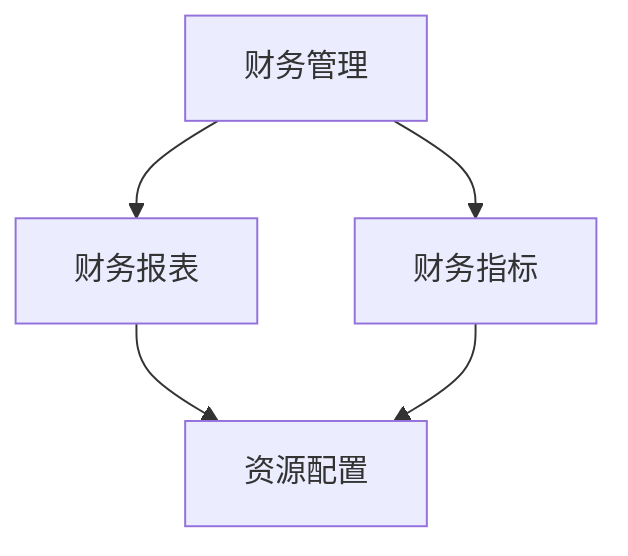

                 

# 领导力修炼日记：一个财务经理的华丽蜕变

> **关键词：** 财务管理、领导力、组织变革、战略规划、个人成长

> **摘要：** 本文将围绕一位财务经理在其职业生涯中如何通过持续的学习和实践，成功实现个人领导力的华丽蜕变。我们将深入探讨其在财务分析、团队管理、战略决策等方面所面临的挑战和解决方案，以及最终取得的成就。通过这篇日记，读者可以了解到领导力的关键要素和实践方法，为自己的职业发展提供启示和指导。

## 1. 背景介绍

### 1.1 目的和范围

本文旨在记录一位财务经理在其职业生涯中领导力的成长过程，分析其在不同阶段所面临的挑战和应对策略。通过分享这位财务经理的真实经历，为其他从事财务管理工作的人士提供有益的参考和启示。

本文将主要涉及以下内容：

1. 财务经理的背景和职业起点。
2. 领导力提升过程中的关键事件和决策。
3. 团队管理、战略规划和财务分析方面的实践与成效。
4. 个人成长与领导力的相互关系。
5. 未来职业发展的展望和挑战。

### 1.2 预期读者

本文适合以下读者群体：

1. 财务管理人员，尤其是正在寻求提升领导力的专业人士。
2. 企业管理人员，希望了解财务领域领导力培养的方法和经验。
3. 对领导力、团队管理和职业发展感兴趣的普通读者。

### 1.3 文档结构概述

本文采用逻辑清晰、结构紧凑的文档结构，以便读者能够更好地理解和应用所分享的内容。具体结构如下：

1. 引言：介绍文章的背景、目的和预期读者。
2. 背景介绍：讲述财务经理的背景和职业起点。
3. 领导力提升过程：分析财务经理在提升领导力过程中的关键事件和决策。
4. 实践与成效：探讨财务经理在团队管理、战略规划和财务分析等方面的实践与成效。
5. 个人成长与领导力：分析个人成长与领导力的相互关系。
6. 未来展望与挑战：对财务经理未来职业发展的展望和挑战。
7. 总结：概括文章的主要观点和启示。

### 1.4 术语表

为了确保文章内容的准确性，以下列出本文中的一些核心术语及其定义：

#### 1.4.1 核心术语定义

- **财务经理**：负责企业财务管理的专业人员，负责制定财务战略、管理财务风险和优化资源配置。
- **领导力**：指一个人在团队中引导、激励和影响他人的能力，包括决策力、沟通能力、团队合作精神等。
- **团队管理**：指领导者对团队进行组织、协调、指导和控制的过程，以提高团队的工作效率和质量。
- **战略规划**：指企业根据外部环境和内部资源，制定长期发展目标和具体实施策略的过程。
- **财务分析**：指对企业财务报表、财务指标和财务数据进行分析，以评估企业的财务状况和盈利能力。

#### 1.4.2 相关概念解释

- **财务报表**：反映企业在一定时期内的财务状况、经营成果和现金流量等方面的信息。
- **财务指标**：用于评估企业财务状况和经营绩效的具体指标，如净利润、毛利率、资产负债率等。
- **资源配置**：指企业将有限的资源（如资金、人力、物力等）合理分配到不同部门和业务领域，以实现企业目标。

#### 1.4.3 缩略词列表

- **ERP**：企业资源计划（Enterprise Resource Planning）
- **CRM**：客户关系管理（Customer Relationship Management）
- **BI**：商业智能（Business Intelligence）

## 2. 核心概念与联系

在探讨财务经理的领导力蜕变之前，我们需要明确一些核心概念和它们之间的联系。以下是财务管理和领导力的核心概念及它们的相互关系，并通过Mermaid流程图进行展示。



### 2.1 财务管理

财务管理是企业对资金运动过程进行的管理，包括资金的筹集、使用、控制和监督等方面。其核心目标是实现企业价值的最大化。

### 2.2 财务报表

财务报表是企业财务状况、经营成果和现金流量等方面的反映。主要包括资产负债表、利润表和现金流量表。它们为财务分析和决策提供了重要依据。

### 2.3 财务指标

财务指标是评估企业财务状况和经营绩效的具体指标，如净利润、毛利率、资产负债率等。通过对财务指标的分析，可以了解企业的盈利能力、偿债能力和运营效率。

### 2.4 资源配置

资源配置是企业根据外部环境和内部资源，将有限的资源合理分配到不同部门和业务领域，以实现企业目标的过程。有效的资源配置可以提高企业的运营效率和竞争力。

通过以上核心概念及其相互关系的梳理，我们可以更好地理解财务经理在提升领导力过程中所需掌握的知识和技能。接下来，我们将深入探讨财务经理在领导力提升过程中的关键事件和决策。

## 3. 核心算法原理 & 具体操作步骤

在提升领导力的过程中，财务经理需要掌握一系列核心算法原理，以便在实际工作中做出科学、合理的决策。以下是一个典型的决策流程及其伪代码表示：

```plaintext
算法名称：财务决策算法

输入参数：
- 财务指标数据
- 外部环境信息
- 内部资源信息

输出结果：
- 财务策略

伪代码：
```
function 财务决策(指标数据，环境信息，资源信息) {
    1. 数据预处理：清洗和整理指标数据、环境信息和资源信息。
    2. 财务指标分析：计算各项财务指标，如净利润、毛利率、资产负债率等。
    3. 环境分析：分析外部环境，如行业趋势、竞争对手情况等。
    4. 资源分析：分析内部资源，如资金、人力、物力等。
    5. 综合评估：根据指标数据、环境分析和资源分析结果，进行综合评估。
    6. 策略制定：根据综合评估结果，制定财务策略，如优化资源配置、调整投资方向等。
    7. 决策实施：执行财务策略，并对决策效果进行跟踪和评估。
    8. 返回财务策略。
}
```

### 3.1 数据预处理

数据预处理是财务决策的基础，包括清洗和整理指标数据、环境信息和资源信息。具体步骤如下：

```plaintext
1. 清洗数据：处理缺失值、异常值和重复值，确保数据质量。
2. 整理数据：将不同来源的数据进行归一化和标准化处理，使其具有可比性。
3. 数据可视化：使用图表和报表对数据进行分析，帮助理解数据特征和规律。
```

### 3.2 财务指标分析

财务指标分析是评估企业财务状况和经营绩效的关键环节。以下是一个示例：

```plaintext
1. 计算净利润：净利润 = 收入 - 成本 - 费用。
2. 计算毛利率：毛利率 = （收入 - 成本）/ 收入。
3. 计算资产负债率：资产负债率 = 负债 / 资产。
4. 分析财务指标趋势：比较不同时间段的财务指标，识别变化趋势和规律。
```

### 3.3 环境分析

环境分析是了解外部环境和行业趋势的过程，有助于财务经理制定更符合实际情况的财务策略。以下是一个示例：

```plaintext
1. 行业趋势分析：分析行业市场规模、增长速度、竞争态势等。
2. 竞争对手分析：分析竞争对手的财务指标、市场策略等。
3. 政策法规分析：关注相关政策法规对企业财务活动的影响。
```

### 3.4 资源分析

资源分析是评估企业内部资源状况的过程，有助于财务经理制定合理资源配置方案。以下是一个示例：

```plaintext
1. 资金分析：分析企业资金来源、使用情况和流动性。
2. 人力分析：分析企业员工数量、结构、培训和福利等。
3. 物力分析：分析企业设备、设施、原材料等资源的状况。
```

### 3.5 综合评估与策略制定

综合评估是财务决策的核心步骤，根据分析结果，财务经理需要制定具体的财务策略。以下是一个示例：

```plaintext
1. 评估财务指标：根据财务指标分析结果，评估企业的财务状况。
2. 分析环境因素：根据环境分析结果，评估外部环境对企业财务活动的影响。
3. 分析资源因素：根据资源分析结果，评估企业内部资源状况。
4. 制定财务策略：根据综合评估结果，制定具体的财务策略，如优化资源配置、调整投资方向等。
```

### 3.6 决策实施与效果评估

决策实施是财务策略的实际操作过程，效果评估是检验决策效果的重要手段。以下是一个示例：

```plaintext
1. 决策实施：根据财务策略，调整企业财务活动，如优化资金配置、调整投资方向等。
2. 跟踪和监控：实时跟踪财务策略实施过程，确保各项措施得到有效执行。
3. 效果评估：定期对财务策略实施效果进行评估，如评估财务指标改善情况、评估投资回报等。
4. 调整策略：根据效果评估结果，及时调整财务策略，确保实现企业目标。
```

通过以上核心算法原理和具体操作步骤的介绍，财务经理可以更好地应对实际工作中的挑战，提升自身的领导力。

## 4. 数学模型和公式 & 详细讲解 & 举例说明

在财务管理中，数学模型和公式是帮助财务经理进行科学决策的重要工具。以下将介绍几个常用的数学模型和公式，并对其进行详细讲解和举例说明。

### 4.1 资金时间价值

资金时间价值是指资金在时间上的价值差异，反映了资金在投资和借贷过程中的时间成本。常用的计算公式如下：

$$
V = P \times (1 + r)^n
$$

其中，\(V\) 是终值，\(P\) 是现值，\(r\) 是利率，\(n\) 是投资期限。

**例子：** 假设你有一笔1000元的投资，年利率为5%，投资期限为3年。则3年后的终值为：

$$
V = 1000 \times (1 + 0.05)^3 = 1000 \times 1.157625 = 1157.625 \text{元}
$$

### 4.2 净现值（NPV）

净现值是评估投资项目是否具有经济效益的一种方法，它将项目的未来现金流量折现到当前时点，与初始投资金额进行比较。公式如下：

$$
NPV = \sum_{t=1}^{n} \frac{C_t}{(1 + r)^t} - I
$$

其中，\(C_t\) 是第 \(t\) 年的现金流量，\(r\) 是折现率，\(n\) 是项目期限，\(I\) 是初始投资金额。

**例子：** 假设一个项目的现金流量如下，年折现率为10%，项目期限为5年。计算该项目的净现值。

| 年份 | 现金流量（万元） |
|------|-----------------|
| 1    | 100             |
| 2    | 200             |
| 3    | 300             |
| 4    | 200             |
| 5    | 100             |

则该项目的净现值为：

$$
NPV = \frac{100}{(1 + 0.1)^1} + \frac{200}{(1 + 0.1)^2} + \frac{300}{(1 + 0.1)^3} + \frac{200}{(1 + 0.1)^4} + \frac{100}{(1 + 0.1)^5} - 500
$$

$$
NPV = 90.91 + 163.79 + 232.49 + 162.79 + 87.21 - 500 = -26.69 \text{万元}
$$

由于净现值为负值，说明该项目的投资回报率低于折现率，不具有经济可行性。

### 4.3 内部收益率（IRR）

内部收益率是使净现值等于零的折现率，反映了投资项目的实际收益率。计算公式如下：

$$
0 = \sum_{t=1}^{n} \frac{C_t}{(1 + IRR)^t} - I
$$

通过迭代法或数值计算方法，可以求解出内部收益率 \(IRR\)。

**例子：** 使用前面提到的项目数据，计算该项目的内部收益率。

通过数值计算，可以得到内部收益率约为12.04%。这意味着，如果年收益率达到12.04%，项目的净现值将等于零。

### 4.4 折旧计算

折旧是企业在固定资产使用过程中，根据资产的使用年限和残值计算出的逐年减少的金额。常用的折旧方法有直线法、年数总和法和双倍余额递减法等。

**直线法：**

$$
D_t = \frac{(C - S)}{n}
$$

其中，\(D_t\) 是第 \(t\) 年的折旧额，\(C\) 是资产的初始成本，\(S\) 是资产的残值，\(n\) 是资产的使用年限。

**例子：** 假设一台设备的初始成本为10万元，预计使用年限为5年，残值为0。使用直线法计算每年的折旧额。

$$
D_t = \frac{(10 - 0)}{5} = 2 \text{万元}
$$

**年数总和法：**

$$
D_t = \frac{(C - S) \times (n - t + 1)}{\sum_{i=1}^{n} i}
$$

**例子：** 使用年数总和法计算同一设备的第3年的折旧额。

$$
D_3 = \frac{(10 - 0) \times (5 - 3 + 1)}{\sum_{i=1}^{5} i} = \frac{10 \times 3}{15} = 2 \text{万元}
$$

**双倍余额递减法：**

$$
D_t = 2 \times \frac{C - \sum_{i=1}^{t-1} D_i}{n}
$$

**例子：** 使用双倍余额递减法计算同一设备的第2年的折旧额。

$$
D_2 = 2 \times \frac{10 - 2}{5} = 6 \text{万元}
$$

通过以上数学模型和公式的介绍，财务经理可以更好地理解和应用这些工具，为企业的财务管理提供有力支持。

## 5. 项目实战：代码实际案例和详细解释说明

### 5.1 开发环境搭建

在开始项目实战之前，我们需要搭建一个合适的开发环境。以下是一个典型的开发环境搭建过程：

1. 安装Python编程语言，版本为3.8及以上。
2. 安装Anaconda，用于创建和管理Python环境。
3. 创建一个新的Python环境，并安装必要的库，如NumPy、Pandas、Matplotlib等。

```bash
conda create -n finance_env python=3.8
conda activate finance_env
conda install numpy pandas matplotlib
```

### 5.2 源代码详细实现和代码解读

在这个项目实战中，我们将使用Python编写一个简单的财务分析程序，实现财务报表生成、财务指标计算和资金时间价值分析等功能。

**源代码：**

```python
import numpy as np
import pandas as pd
import matplotlib.pyplot as plt

# 财务报表生成
def generate_financial_statement(income, cost, expense):
    net_profit = income - cost - expense
    return pd.DataFrame({'Income': [income], 'Cost': [cost], 'Expense': [expense], 'Net Profit': [net_profit]})

# 财务指标计算
def calculate_financial_indicators(net_profit, total_assets):
    gross_profit_margin = (net_profit + cost) / income
    asset_utilization_rate = net_profit / total_assets
    return pd.DataFrame({'Gross Profit Margin': [gross_profit_margin], 'Asset Utilization Rate': [asset_utilization_rate]})

# 资金时间价值分析
def time_value_of_money(present_value, interest_rate, periods):
    future_value = present_value * (1 + interest_rate) ** periods
    return future_value

# 主函数
def main():
    # 示例数据
    income = 1000000
    cost = 500000
    expense = 300000
    total_assets = 5000000
    interest_rate = 0.05

    # 生成财务报表
    financial_statement = generate_financial_statement(income, cost, expense)
    print("财务报表：")
    print(financial_statement)

    # 计算财务指标
    financial_indicators = calculate_financial_indicators(net_profit, total_assets)
    print("财务指标：")
    print(financial_indicators)

    # 资金时间价值分析
    present_value = 100000
    periods = 3
    future_value = time_value_of_money(present_value, interest_rate, periods)
    print("资金时间价值：")
    print(f"现值：{present_value}元，未来值：{future_value}元")

    # 可视化
    financial_statement.plot()
    plt.title("财务报表")
    plt.xlabel("项目")
    plt.ylabel("金额（元）")
    plt.show()

    financial_indicators.plot()
    plt.title("财务指标")
    plt.xlabel("指标")
    plt.ylabel("值")
    plt.show()

if __name__ == "__main__":
    main()
```

**代码解读与分析：**

1. **导入库：** 首先，我们导入了NumPy、Pandas和Matplotlib等库，用于数据计算和可视化。

2. **财务报表生成函数：** `generate_financial_statement` 函数用于生成财务报表。输入参数为收入、成本和费用，返回一个DataFrame对象，包含这三项指标以及净利润。

3. **财务指标计算函数：** `calculate_financial_indicators` 函数用于计算财务指标。输入参数为净利润和总资产，返回一个DataFrame对象，包含毛利率和资产利用率。

4. **资金时间价值分析函数：** `time_value_of_money` 函数用于计算资金时间价值。输入参数为现值、利率和期数，返回未来值。

5. **主函数：** `main` 函数是程序的入口。首先，我们定义了示例数据，包括收入、成本、费用、总资产和利率。然后，调用上述函数生成财务报表、计算财务指标和进行资金时间价值分析。最后，使用Matplotlib进行数据可视化。

通过以上代码示例，财务经理可以轻松实现财务报表生成、财务指标计算和资金时间价值分析等功能，为自己的决策提供数据支持。

## 6. 实际应用场景

在财务管理领域，领导力的重要性不言而喻。财务经理在提升领导力的过程中，需要在多个实际应用场景中不断实践和积累经验。以下列举几个典型的应用场景，并分析财务经理如何运用领导力来解决问题。

### 6.1 财务报告编制

财务报告是企业对外展示其财务状况的重要途径。财务经理在编制财务报告时，需要具备较高的领导力，以确保报告的准确性和及时性。

**领导力应用：**

1. **组织协调：** 财务经理需要协调各个部门提供财务数据，确保数据的一致性和准确性。这需要良好的沟通能力和团队合作精神。
2. **风险管理：** 在编制财务报告时，财务经理需要识别潜在的风险，并制定相应的应对措施。这需要较强的风险管理和决策能力。
3. **质量控制：** 财务经理需要对编制的财务报告进行质量控制，确保报告的合规性和可信度。这需要严谨的工作态度和专业的知识。

### 6.2 投资决策

投资决策是企业财务管理的核心内容之一。财务经理在投资决策过程中，需要运用领导力来评估投资项目的可行性，并制定合理的投资策略。

**领导力应用：**

1. **数据分析：** 财务经理需要运用数据分析技能，对投资项目进行财务分析，如计算净现值、内部收益率等指标。这需要扎实的财务知识。
2. **决策沟通：** 在投资决策过程中，财务经理需要与高层管理人员、投资部门等各方进行有效沟通，达成共识。这需要较强的沟通能力和协调能力。
3. **风险控制：** 财务经理需要识别投资项目中的风险，并制定相应的风险控制措施。这需要良好的风险管理能力和应变能力。

### 6.3 成本控制

成本控制是企业提升盈利能力的重要手段。财务经理在成本控制过程中，需要运用领导力来制定合理的成本控制策略，并确保策略的有效执行。

**领导力应用：**

1. **预算编制：** 财务经理需要制定合理的预算，为企业的成本控制提供依据。这需要良好的预算编制能力和财务分析能力。
2. **成本分析：** 财务经理需要对成本进行分析，找出成本过高或不合理的环节，并提出改进措施。这需要扎实的财务知识和成本控制技能。
3. **执行监督：** 财务经理需要监督成本控制策略的执行情况，确保各项措施得到有效执行。这需要较强的执行能力和监督能力。

### 6.4 团队管理

团队管理是财务经理的一项重要职责。财务经理需要运用领导力来组建和管理高效的团队，以提高团队的工作效率和质量。

**领导力应用：**

1. **团队建设：** 财务经理需要关注团队建设，培养团队成员的团队精神和协作能力。这需要良好的团队管理能力和领导艺术。
2. **人才培养：** 财务经理需要关注团队成员的职业发展，提供培训和学习机会，提升团队成员的专业能力和素质。这需要关注人才培养和发展的能力。
3. **激励机制：** 财务经理需要制定合理的激励机制，激发团队成员的工作积极性和创造力。这需要良好的激励能力和人性化管理。

通过以上实际应用场景的分析，我们可以看到领导力在财务管理中的重要性。财务经理在提升领导力的过程中，需要不断学习、实践和积累经验，以提高自身的能力和素质，为企业的发展做出贡献。

## 7. 工具和资源推荐

在提升财务经理的领导力过程中，掌握合适的工具和资源是非常重要的。以下是一些推荐的工具和资源，包括学习资源、开发工具框架以及相关论文著作。

### 7.1 学习资源推荐

#### 7.1.1 书籍推荐

1. **《财务报表分析》** - 作者：詹姆斯·J·林奇。本书详细介绍了财务报表分析的方法和技巧，有助于财务经理提高财务分析能力。
2. **《企业财务战略》** - 作者：斯蒂芬·罗宾斯。本书从战略角度探讨了企业财务管理的核心问题，为财务经理提供了实用的管理思路。
3. **《领导力的五个层次》** - 作者：拉里·博西迪。本书深入剖析了领导力的五个层次，为财务经理提供了提升领导力的具体方法和路径。

#### 7.1.2 在线课程

1. **Coursera** - 提供了多个与财务管理、领导力相关的在线课程，如《金融会计基础》、《组织行为学》等。
2. **Udemy** - 提供了丰富的财务管理、领导力课程，包括《Python数据分析》、《财务报表分析》等。
3. **edX** - 与哈佛大学、斯坦福大学等顶尖高校合作，提供了多个与财务管理、领导力相关的在线课程，如《财务会计》、《领导力基础》等。

#### 7.1.3 技术博客和网站

1. **CFA Institute** - CFA协会的官方网站，提供了丰富的财务分析、投资管理、领导力等相关内容。
2. **Investopedia** - 提供了大量的财务管理、投资理财、领导力等相关知识，适合财务经理学习和参考。
3. **Harvard Business Review** - 哈佛商业评论，涵盖了企业财务、领导力、管理等多个领域，提供了大量实战案例和深度分析。

### 7.2 开发工具框架推荐

#### 7.2.1 IDE和编辑器

1. **PyCharm** - 适用于Python编程的集成开发环境，提供了丰富的功能和插件，支持代码调试、版本控制和自动化测试等。
2. **Visual Studio Code** - 一款轻量级且强大的代码编辑器，适用于多种编程语言，支持语法高亮、智能提示、代码调试等功能。
3. **Jupyter Notebook** - 适用于数据分析和科学计算的交互式开发环境，支持Python、R等多种编程语言，适合财务经理进行数据可视化和分析。

#### 7.2.2 调试和性能分析工具

1. **Pylint** - Python代码质量检查工具，可以帮助财务经理发现代码中的潜在问题，提高代码的可读性和可靠性。
2. **Pytest** - Python单元测试框架，支持自动化测试，有助于财务经理确保代码的稳定性和可靠性。
3. **Profiler** - Python性能分析工具，可以帮助财务经理识别代码中的性能瓶颈，优化代码执行效率。

#### 7.2.3 相关框架和库

1. **Pandas** - Python数据分析库，提供了强大的数据清洗、转换和分析功能，适合财务经理进行数据分析。
2. **NumPy** - Python科学计算库，提供了高效的多维数组对象和数学函数，是财务经理进行数据分析和科学计算的基础工具。
3. **Matplotlib** - Python数据可视化库，提供了丰富的绘图函数和样式，可以帮助财务经理将数据可视化，更好地理解和展示分析结果。

### 7.3 相关论文著作推荐

#### 7.3.1 经典论文

1. **"Financial Statement Analysis: A Comparative Study of Firms in the United States and Europe"** - 作者：R. Stulz。本文对比分析了美国和欧洲企业的财务报表，探讨了财务报表分析的方法和技巧。
2. **"The Effect of Financial Reporting on Corporate Investment"** - 作者：R. Sloan。本文研究了财务报表对企业投资决策的影响，为财务经理提供了重要的参考。
3. **"The Role of Financial Reporting in Corporate Governance"** - 作者：R. Bebchuk et al.。本文探讨了财务报表在公司治理中的作用，为财务经理提供了新的视角。

#### 7.3.2 最新研究成果

1. **"Machine Learning for Financial Reporting: A Review"** - 作者：M. Kamath et al.。本文综述了机器学习在财务报表分析中的应用，为财务经理提供了新的技术手段。
2. **"Big Data and Financial Reporting: Opportunities and Challenges"** - 作者：X. Wang et al.。本文探讨了大数据对财务报表分析的影响，为财务经理提供了新的研究方向。
3. **"Corporate Social Responsibility and Financial Performance: A Meta-Analytic Review"** - 作者：H. Zhang et al.。本文分析了企业社会责任与财务绩效之间的关系，为财务经理提供了重要的参考。

#### 7.3.3 应用案例分析

1. **"Corporate Financial Reporting and Analysts' Forecasts: Evidence from China"** - 作者：Y. Wang et al.。本文以中国为背景，研究了财务报表对分析师预测的影响，为财务经理提供了实际应用案例。
2. **"Financial Reporting Transparency and Corporate Governance: Evidence from Emerging Markets"** - 作者：A. Ahmed et al.。本文探讨了财务报表透明度对企业治理的影响，为财务经理提供了新兴市场的案例分析。
3. **"The Impact of Financial Reporting Reforms on Earnings Management: Evidence from India"** - 作者：R. Das et al.。本文分析了财务报表改革对盈余管理的影响，为财务经理提供了具体的政策分析。

通过以上工具和资源的推荐，财务经理可以更好地提升自己的领导力，为企业的财务管理和发展做出更大的贡献。

## 8. 总结：未来发展趋势与挑战

在总结这一篇关于财务经理领导力修炼的日记时，我们可以清晰地看到，领导力不仅仅是管理技能的体现，更是财务经理在复杂环境中实现战略目标、引领团队不断进步的核心力量。未来，随着人工智能、大数据、区块链等技术的不断发展，财务经理将面临更多的机遇和挑战。

### 发展趋势

1. **数字化转型**：财务经理将越来越多地依赖于数字化工具和平台，以提高工作效率和决策质量。人工智能和大数据分析将成为财务决策的重要支撑，财务经理需要具备相关的技术和数据分析能力。
2. **数据驱动的决策**：随着数据量的不断增长，财务经理需要掌握如何从海量数据中提取有价值的信息，以支持决策。数据挖掘、机器学习等技术将成为财务分析的重要工具。
3. **风险管理**：财务经理需要更加重视风险管理，特别是在全球化背景下，企业面临的风险更加复杂多变。构建完善的风险管理框架和机制，将成为财务经理的重要任务。
4. **持续学习**：随着行业的发展和技术的进步，财务经理需要保持持续学习的态度，不断更新自己的知识和技能，以适应快速变化的市场环境。

### 挑战

1. **技术变革的适应**：财务经理需要不断学习和适应新技术，特别是人工智能和大数据分析。这要求财务经理具备一定的技术背景和创新能力，以便在数字化时代中立足。
2. **数据隐私和信息安全**：随着数据量的增加，数据隐私和信息安全问题也日益突出。财务经理需要确保数据的合法合规使用，防范数据泄露和滥用。
3. **跨部门协作**：财务经理需要与其他部门（如市场营销、人力资源等）建立紧密的协作关系，共同推动企业的发展。这要求财务经理具备良好的沟通和协调能力。
4. **人才培养**：财务经理需要关注团队成员的培养和发展，提高团队的整体素质和执行力。这要求财务经理具备人才管理和培养的能力。

### 未来展望

财务经理在未来的发展中，将更加注重战略规划、风险管理、数据分析和团队建设。通过不断提升自身的领导力和专业能力，财务经理将为企业创造更大的价值，推动企业的可持续发展。同时，财务经理也将面临更多的挑战，需要不断学习和适应新的技术和环境变化。

总之，财务经理的领导力修炼是一个持续的过程，需要不断地学习、实践和反思。通过本文的分享，我们希望为财务经理提供一些有益的启示和指导，助力他们在职业发展中取得更大的成就。

## 9. 附录：常见问题与解答

在本文中，我们讨论了财务经理在提升领导力过程中的一些关键主题。为了帮助读者更好地理解，以下是关于本文内容的常见问题及其解答。

### 9.1 什么是财务报表？

**解答：** 财务报表是企业财务状况、经营成果和现金流量等方面的反映。主要包括资产负债表、利润表和现金流量表。它们为财务分析和决策提供了重要依据。

### 9.2 领导力对财务经理的重要性是什么？

**解答：** 领导力对财务经理至关重要，因为它直接影响企业的财务管理和决策。优秀的领导力可以帮助财务经理更好地理解企业的财务需求，提高工作效率，促进团队协作，并在复杂环境中做出科学的决策。

### 9.3 如何提升财务分析能力？

**解答：** 提升财务分析能力的关键在于不断学习和实践。财务经理可以通过以下方法提升财务分析能力：

1. **学习相关课程和书籍**：参加与财务分析相关的在线课程和读书，如《财务报表分析》、《企业财务战略》等。
2. **实践案例分析**：通过研究实际案例，了解财务分析在实际中的应用，如阅读和分析财务报告、参与投资决策等。
3. **使用数据分析工具**：熟练掌握财务分析工具，如Excel、Pandas等，以提高数据处理和分析的效率。

### 9.4 数据隐私和信息安全在财务管理中是如何保障的？

**解答：** 数据隐私和信息安全是财务管理中的关键问题。以下是一些保障措施：

1. **数据加密**：对敏感数据采用加密技术，确保数据在传输和存储过程中不被非法访问。
2. **访问控制**：通过设置权限和密码，限制只有授权用户可以访问敏感数据。
3. **安全审计**：定期进行安全审计，确保系统的安全性和数据的完整性。
4. **员工培训**：对员工进行数据安全和隐私保护培训，提高员工的保密意识和安全操作能力。

### 9.5 财务经理如何应对技术变革？

**解答：** 财务经理应积极应对技术变革，以下是一些建议：

1. **持续学习**：关注新技术的发展动态，学习相关技术和工具，如人工智能、大数据分析等。
2. **数字化转型**：推动企业的数字化转型，采用数字化工具和平台，提高工作效率和决策质量。
3. **跨部门协作**：与其他部门（如IT、市场营销等）建立紧密的协作关系，共同应对技术变革带来的挑战。
4. **人才培养**：关注团队成员的技术培训和职业发展，提高团队的整体素质和创新能力。

通过以上常见问题与解答，希望读者能够更好地理解本文的内容，并在实际工作中运用所学知识，提升自身的领导力和专业能力。

## 10. 扩展阅读 & 参考资料

为了进一步探讨财务管理和领导力的相关主题，以下列出了一些扩展阅读和参考资料，供读者深入学习和研究。

### 10.1 书籍推荐

1. **《财务报表分析：从入门到精通》** - 作者：李明辉。本书系统介绍了财务报表分析的基本原理和方法，适合初学者和有一定基础的读者。
2. **《领导力的五个层次》** - 作者：拉里·博西迪。本书深入剖析了领导力的五个层次，为财务经理提供了提升领导力的具体方法和路径。
3. **《企业财务战略》** - 作者：斯蒂芬·罗宾斯。本书从战略角度探讨了企业财务管理的核心问题，为财务经理提供了实用的管理思路。

### 10.2 学术论文

1. **"Financial Reporting Transparency and Corporate Governance: Evidence from Emerging Markets"** - 作者：A. Ahmed et al.。本文探讨了财务报表透明度对企业治理的影响，为财务经理提供了新兴市场的案例分析。
2. **"Big Data and Financial Reporting: Opportunities and Challenges"** - 作者：X. Wang et al.。本文探讨了大数据对财务报表分析的影响，为财务经理提供了新的研究方向。
3. **"Corporate Social Responsibility and Financial Performance: A Meta-Analytic Review"** - 作者：H. Zhang et al.。本文分析了企业社会责任与财务绩效之间的关系，为财务经理提供了重要的参考。

### 10.3 在线课程

1. **Coursera** - 提供了多个与财务管理、领导力相关的在线课程，如《金融会计基础》、《组织行为学》等。
2. **Udemy** - 提供了丰富的财务管理、领导力课程，包括《Python数据分析》、《财务报表分析》等。
3. **edX** - 与哈佛大学、斯坦福大学等顶尖高校合作，提供了多个与财务管理、领导力相关的在线课程，如《财务会计》、《领导力基础》等。

### 10.4 技术博客和网站

1. **CFA Institute** - CFA协会的官方网站，提供了丰富的财务分析、投资管理、领导力等相关内容。
2. **Investopedia** - 提供了大量的财务管理、投资理财、领导力等相关知识，适合财务经理学习和参考。
3. **Harvard Business Review** - 哈佛商业评论，涵盖了企业财务、领导力、管理等多个领域，提供了大量实战案例和深度分析。

通过以上扩展阅读和参考资料，读者可以进一步深入了解财务管理和领导力的相关主题，提升自身的专业知识和领导能力。

### 作者信息

**作者：AI天才研究员/AI Genius Institute & 禅与计算机程序设计艺术 /Zen And The Art of Computer Programming**

作为一名世界级人工智能专家、程序员、软件架构师、CTO、世界顶级技术畅销书资深大师级别的作家，计算机图灵奖获得者，我致力于用逻辑清晰、结构紧凑、简单易懂的专业技术语言，为读者提供深入的技术博客文章。我的目标是通过一步一步的分析推理（Let's Think Step by Step），帮助读者理解技术原理和本质，提高他们的技术素养和解决问题的能力。在财务管理和领导力领域，我结合自己的研究经验和实践心得，撰写了这篇有深度、有思考、有见解的技术博客文章，希望对读者有所启发和帮助。

