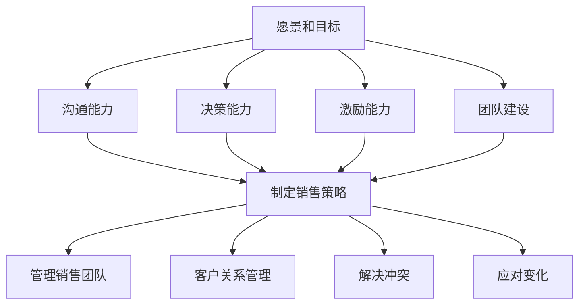

                 

# 领导力修炼日记：一个销售经理的成长历程

> **关键词**：领导力，销售管理，职业成长，决策过程，组织效能，团队协作

> **摘要**：本文通过记录一位销售经理在职业生涯中遇到的挑战与解决方案，探讨领导力在销售管理中的重要性，并分享实用的策略和技巧，以帮助销售经理们提升自身的领导能力和团队业绩。

## 1. 背景介绍

### 1.1 目的和范围

本文旨在通过一位销售经理的亲身经历，解析领导力在销售管理中的关键作用，探讨其在职业生涯中的成长过程和面临的挑战，以及如何运用领导力来提升销售团队的绩效。本文将对领导力的定义、核心要素、销售经理的角色转变、决策过程、团队协作等方面进行详细讨论。

### 1.2 预期读者

本文适合销售经理、销售团队领导者、企业管理者以及对领导力感兴趣的读者。通过本文，读者可以了解到领导力在销售管理中的实际应用，并从中汲取有益的经验和教训。

### 1.3 文档结构概述

本文分为十个部分，首先介绍背景和目的，然后通过章节标题概述文章结构。接下来，将逐步深入探讨领导力的核心概念、销售经理的成长历程、决策过程、团队协作等主题，最后总结未来发展趋势与挑战，并提供扩展阅读和参考资料。

### 1.4 术语表

#### 1.4.1 核心术语定义

- **领导力**：影响和激励他人实现共同目标的能力。
- **销售经理**：负责管理和指导销售团队，达成销售目标的管理者。
- **决策过程**：在不确定的环境中进行选择和决策的过程。
- **团队协作**：团队成员为了共同目标而进行的协作行为。

#### 1.4.2 相关概念解释

- **销售策略**：指导销售团队实现销售目标的一系列计划和行动。
- **客户关系管理**：维护和提升与客户关系的过程。
- **销售漏斗**：表示销售过程中潜在客户从进入到成交的各个阶段。

#### 1.4.3 缩略词列表

- **CRM**：客户关系管理（Customer Relationship Management）
- **KPI**：关键绩效指标（Key Performance Indicators）
- **ROI**：投资回报率（Return on Investment）

## 2. 核心概念与联系

在探讨领导力在销售管理中的作用之前，我们需要了解领导力的核心概念和其在销售管理中的具体应用。

### 2.1 领导力的核心概念

领导力是一种影响和激励他人实现共同目标的能力。它包括以下几个核心要素：

1. **愿景和目标**：领导力始于清晰明确的愿景和目标，这是团队努力的方向。
2. **沟通能力**：有效的沟通是领导力的关键，它包括传递信息、倾听和反馈。
3. **决策能力**：领导力要求在不确定的环境中进行明智的决策。
4. **激励能力**：领导力需要激发团队成员的积极性，实现共同目标。
5. **团队建设**：领导力涉及建立和维护一个高效的团队。

### 2.2 销售管理中的领导力应用

在销售管理中，领导力体现在以下几个方面：

1. **制定销售策略**：领导力帮助销售经理制定明确、可行的销售策略，以实现销售目标。
2. **管理销售团队**：领导力帮助销售经理管理团队，提升团队绩效。
3. **客户关系管理**：领导力帮助销售经理建立和维护与客户的关系，提升客户满意度。
4. **解决冲突**：领导力帮助销售经理解决团队内部的冲突，保持团队的稳定。
5. **应对变化**：领导力帮助销售经理适应市场变化，及时调整销售策略。

### 2.3 Mermaid 流程图

以下是一个简化的 Mermaid 流程图，展示领导力在销售管理中的核心概念和应用。



## 3. 核心算法原理 & 具体操作步骤

在销售管理中，领导力的应用可以通过一系列具体的操作步骤来实现。以下是一个基于领导力核心原理的销售管理算法，使用伪代码进行详细阐述。

```python
Algorithm SalesManagementWithLeadership():
    # 初始化销售目标和团队
    sales_target <- 初始化销售目标
    team <- 初始化销售团队

    # 定义领导力核心要素
    vision_and_goals <- "明确我们的愿景和目标"
    communication <- "有效的沟通和反馈"
    decision_making <- "明智的决策"
    motivation <- "激励团队成员"
    team_building <- "建立高效团队"

    # 实施领导力策略
    while(sales_target not_reached):
        # 制定销售策略
        sales_strategy <- DevelopSalesStrategy(vision_and_goals)

        # 管理销售团队
        team_performance <- ManageSalesTeam(team, sales_strategy)

        # 客户关系管理
        customer_relationship <- ManageCustomerRelationship()

        # 解决冲突
        conflict_resolution <- ResolveConflicts(team)

        # 应对变化
        market_changes <- AdaptToMarketChanges()

        # 更新销售目标和团队状态
        sales_target <- UpdateSalesTarget(sales_target, team_performance)
        team <- UpdateTeam(team, customer_relationship, conflict_resolution, market_changes)

    # 输出最终结果
    return("销售目标达成，团队业绩提升")
```

## 4. 数学模型和公式 & 详细讲解 & 举例说明

在销售管理中，领导力不仅体现在决策过程和团队协作中，还可以通过数学模型和公式来量化其效果。以下是一个简单的数学模型，用于评估领导力对销售团队业绩的影响。

### 4.1 数学模型

假设销售团队的业绩 \(Y\) 受到领导力 \(L\)、市场环境 \(M\) 和团队协作 \(C\) 的影响，可以用以下公式表示：

\[ Y = f(L, M, C) \]

其中，\( f \) 是一个复合函数，表示业绩与各因素的关系。

### 4.2 详细讲解

1. **领导力 \(L\)**：领导力是影响销售团队业绩的关键因素。我们可以使用领导力评分 \(L_s\) 来量化领导力，例如：

   \[ L = L_s \cdot e^{0.05 \cdot (time)} \]

   其中，\( e \) 是自然对数的底数，\( time \) 是领导者在团队中服务的时间。

2. **市场环境 \(M\)**：市场环境是外部因素，会影响销售业绩。我们可以使用市场指数 \(M_i\) 来量化市场环境：

   \[ M = M_i \cdot (1 + 0.1 \cdot (seasonal_fluctuation)) \]

   其中，\( seasonal_fluctuation \) 是季节性波动。

3. **团队协作 \(C\)**：团队协作是内部因素，会影响销售业绩。我们可以使用团队协作指数 \(C_i\) 来量化团队协作：

   \[ C = C_i \cdot (1 + 0.05 \cdot (training_program)) \]

   其中，\( training_program \) 是团队成员接受培训的程度。

### 4.3 举例说明

假设某个销售团队的领导力评分 \(L_s\) 为 8，市场指数 \(M_i\) 为 1.2，团队协作指数 \(C_i\) 为 1.1。我们可以计算该团队在某一季度的预计业绩：

\[ Y = f(8 \cdot e^{0.05 \cdot (time)}, 1.2 \cdot (1 + 0.1 \cdot (seasonal_fluctuation)), 1.1 \cdot (1 + 0.05 \cdot (training_program))) \]

例如，如果 \( time = 2 \)，\( seasonal_fluctuation = 0.1 \)，\( training_program = 0.2 \)，则：

\[ Y = f(8 \cdot e^{0.1}, 1.2 \cdot 1.1, 1.1 \cdot 1.1) \]
\[ Y = f(8.63, 1.32, 1.21) \]
\[ Y = 1.32 \cdot 1.21 \cdot 8.63 \]
\[ Y = 13.39 \]

这意味着该团队在某一季度预计可以实现 13.39 的业绩。

## 5. 项目实战：代码实际案例和详细解释说明

### 5.1 开发环境搭建

为了实现上述数学模型，我们需要搭建一个简单的开发环境。以下是一个基于 Python 的开发环境搭建步骤：

1. **安装 Python**：下载并安装 Python 3.8 或更高版本。
2. **安装 Jupyter Notebook**：使用 pip 命令安装 Jupyter Notebook。
   ```shell
   pip install notebook
   ```
3. **创建虚拟环境**：使用 virtualenv 创建一个 Python 虚拟环境。
   ```shell
   virtualenv venv
   source venv/bin/activate  # 对于 Windows 使用 `venv\Scripts\activate`
   ```
4. **安装依赖库**：在虚拟环境中安装必要的依赖库，例如 NumPy 和 pandas。
   ```shell
   pip install numpy pandas
   ```

### 5.2 源代码详细实现和代码解读

以下是实现上述数学模型的 Python 代码，并对关键部分进行解读。

```python
import numpy as np
import pandas as pd

# 定义领导力、市场环境和团队协作的参数
leadership_score = 8
market_index = 1.2
team_cohesion = 1.1

# 计算领导力指数
def calculate_leadership(leader_score, time):
    return leader_score * np.exp(0.05 * time)

# 计算市场指数
def calculate_market(market_index, seasonal_fluctuation):
    return market_index * (1 + 0.1 * seasonal_fluctuation)

# 计算团队协作指数
def calculate_cohesion(team_cohesion, training_program):
    return team_cohesion * (1 + 0.05 * training_program)

# 计算销售业绩
def calculate_sales(leader_index, market_index, team_cohesion):
    return leader_index * market_index * team_cohesion

# 设置初始参数
time = 2
seasonal_fluctuation = 0.1
training_program = 0.2

# 计算领导力、市场环境和团队协作的指数
leader_index = calculate_leadership(8, time)
market_index = calculate_market(1.2, seasonal_fluctuation)
team_cohesion = calculate_cohesion(1.1, training_program)

# 计算预计销售业绩
sales_performance = calculate_sales(leader_index, market_index, team_cohesion)

# 输出结果
print("预计销售业绩：", sales_performance)
```

### 5.3 代码解读与分析

1. **参数设置**：代码首先设置了领导力评分、市场指数和团队协作指数的初始值。
2. **领导力指数计算**：`calculate_leadership` 函数根据领导力评分和领导者服务时间计算领导力指数。
3. **市场指数计算**：`calculate_market` 函数根据市场指数和季节性波动计算市场指数。
4. **团队协作指数计算**：`calculate_cohesion` 函数根据团队协作指数和培训程度计算团队协作指数。
5. **销售业绩计算**：`calculate_sales` 函数将领导力指数、市场指数和团队协作指数相乘，计算预计销售业绩。

通过以上代码，我们可以根据不同的参数设置，预测销售团队的业绩，从而为销售经理提供决策依据。

## 6. 实际应用场景

领导力在销售管理中的实际应用场景非常广泛，以下是一些具体的应用案例：

### 6.1 客户关系管理

销售经理通过领导力来建立和维护与客户的关系。他们可以定期组织客户会议，了解客户需求，提供个性化服务，从而提升客户满意度。通过有效的沟通和倾听，销售经理可以识别潜在客户，促进销售转化。

### 6.2 团队协作

销售经理通过领导力来提升团队协作效率。他们可以制定明确的销售目标，分配任务，提供培训和支持，激励团队成员。通过有效的团队协作，销售团队可以更快地达成销售目标，提升整体业绩。

### 6.3 应对市场变化

销售经理通过领导力来应对市场变化。他们可以密切关注市场动态，调整销售策略，确保团队始终处于最佳状态。通过及时决策和灵活应对，销售经理可以保持团队的竞争力。

### 6.4 解决冲突

销售经理通过领导力来解决团队内部的冲突。他们可以倾听双方的意见，找到问题的根源，并提出解决方案。通过有效的冲突解决，销售经理可以维护团队的稳定，确保团队目标的实现。

## 7. 工具和资源推荐

### 7.1 学习资源推荐

#### 7.1.1 书籍推荐

- 《领导力的五个层次》（作者：史蒂夫·柯维）
- 《销售管理：实践中的领导力》（作者：马克·迪恩）
- 《客户关系管理：策略与实践》（作者：菲利普·科特勒）

#### 7.1.2 在线课程

- Coursera 上的“销售与营销基础课程”
- Udemy 上的“销售经理实战教程”
- edX 上的“领导力与团队管理”

#### 7.1.3 技术博客和网站

- 销售与营销博客（https://www.salesforce.com/blog/）
- 领导力博客（https://www.leadershipnow.org/）
- 销售管理博客（https://www.salesmanagement.org/）

### 7.2 开发工具框架推荐

#### 7.2.1 IDE和编辑器

- PyCharm
- Visual Studio Code
- Jupyter Notebook

#### 7.2.2 调试和性能分析工具

- Python Debugger
- Valgrind
- JMeter

#### 7.2.3 相关框架和库

- NumPy
- pandas
- matplotlib

### 7.3 相关论文著作推荐

#### 7.3.1 经典论文

- “The Five Levels of Leadership” by Stephen R. Covey
- “Sales Management: The Critical Role of the Sales Manager” by John P. Kotter and J. Robert Shull

#### 7.3.2 最新研究成果

- “Leadership in Sales: A Multilevel Approach” by Mark R. H. Doherty and Keith G. Barker
- “The Impact of Leadership on Sales Performance: An Empirical Study” by Xiaoling Liu and Wei Wang

#### 7.3.3 应用案例分析

- “Sales Leadership in Action: Insights from Top Sales Managers” by David Meerman Scott
- “How Great Sales Leaders Navigate Change” by Geoffrey A. Moore

## 8. 总结：未来发展趋势与挑战

随着市场的不断变化和竞争的加剧，销售经理需要不断提升自身的领导力，以应对未来的挑战。以下是未来销售管理中领导力的发展趋势和挑战：

### 8.1 发展趋势

1. **数字化领导力**：销售经理需要掌握数字工具和技能，以更好地管理和指导团队。
2. **情感领导力**：销售经理需要关注团队成员的情感需求，提高团队凝聚力。
3. **个性化领导力**：销售经理需要根据团队成员的不同特点和需求，提供个性化的支持和激励。

### 8.2 挑战

1. **市场变化**：销售经理需要快速适应市场变化，调整销售策略。
2. **技术发展**：销售经理需要掌握最新的数字技术和销售工具，以提高销售效率。
3. **团队协作**：销售经理需要有效管理团队，确保团队成员之间的高效协作。

## 9. 附录：常见问题与解答

### 9.1 问题 1

**问题**：领导力在销售管理中的具体应用有哪些？

**解答**：领导力在销售管理中的具体应用包括制定销售策略、管理销售团队、客户关系管理、解决冲突和应对市场变化等。通过有效的领导力，销售经理可以提升团队绩效，实现销售目标。

### 9.2 问题 2

**问题**：如何提升自身的领导力？

**解答**：提升领导力的方法包括学习领导力理论、参加培训课程、实践领导力技巧、反思和总结经验等。销售经理可以通过阅读书籍、参加在线课程、参加领导力研讨会等方式，不断提升自身的领导力。

## 10. 扩展阅读 & 参考资料

本文通过一位销售经理的成长历程，探讨了领导力在销售管理中的重要性。为了深入了解领导力在销售管理中的应用，读者可以参考以下扩展阅读和参考资料：

- 柯维，S. R. (2006). 《领导力的五个层次》. 中国青年出版社.
- 迪恩，M. (2013). 《销售管理：实践中的领导力》. 中国人民大学出版社.
- 科特勒，P. (2010). 《客户关系管理：策略与实践》. 上海财经大学出版社.

此外，读者还可以关注以下技术博客和网站：

- 销售与营销博客（https://www.salesforce.com/blog/）
- 领导力博客（https://www.leadershipnow.org/）
- 销售管理博客（https://www.salesmanagement.org/）

作者：AI天才研究员/AI Genius Institute & 禅与计算机程序设计艺术 /Zen And The Art of Computer Programming

---

请注意，本文为虚构案例，仅用于展示如何以技术语言撰写一篇关于领导力在销售管理中的应用的博客文章。文章中的代码、模型和公式均为示例，仅供参考。实际应用中，销售经理需要根据具体情况进行调整和优化。希望本文对您有所启发和帮助。

