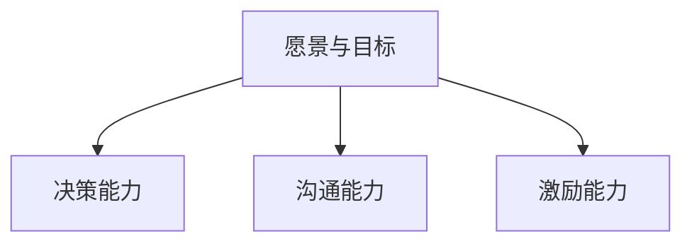
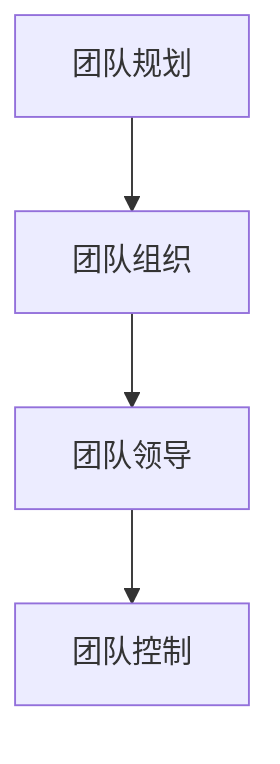
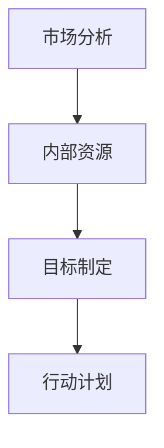
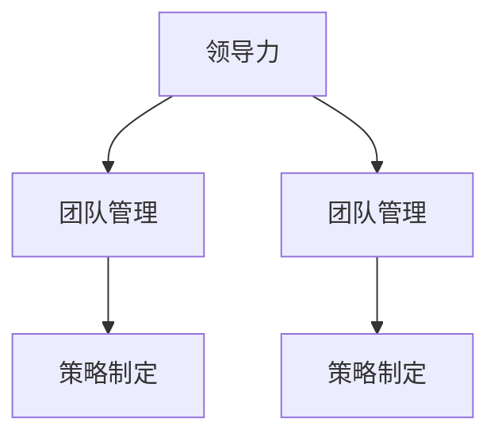
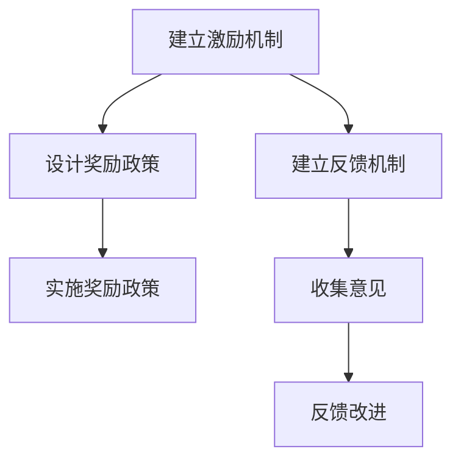
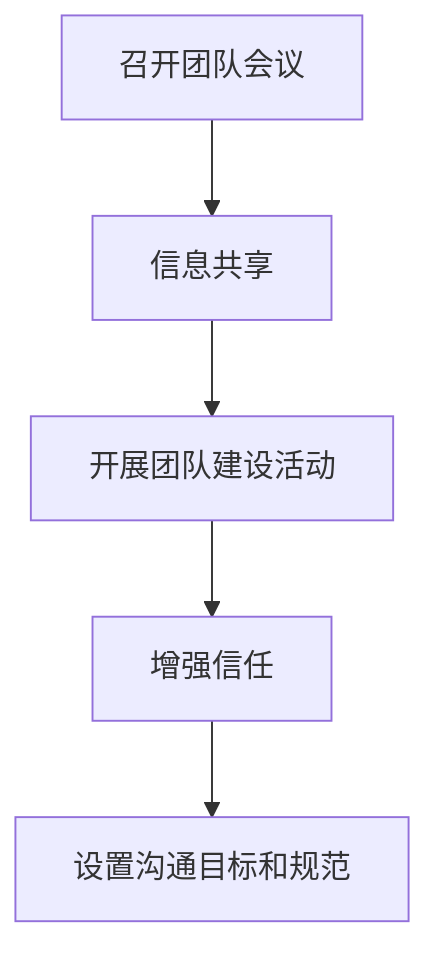
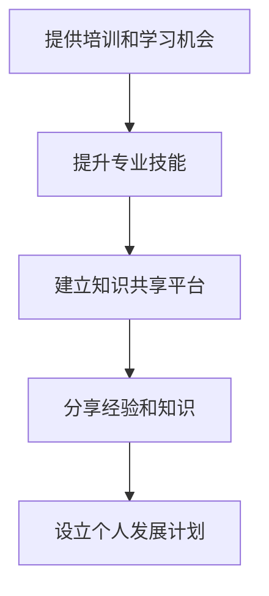
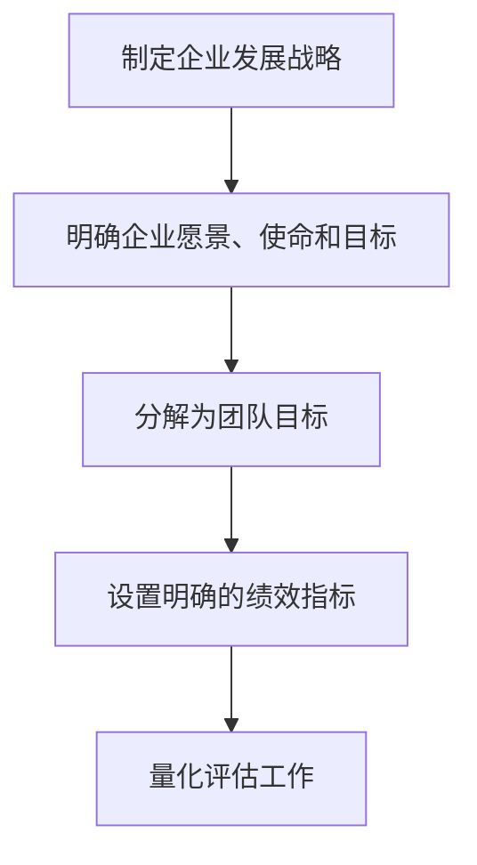
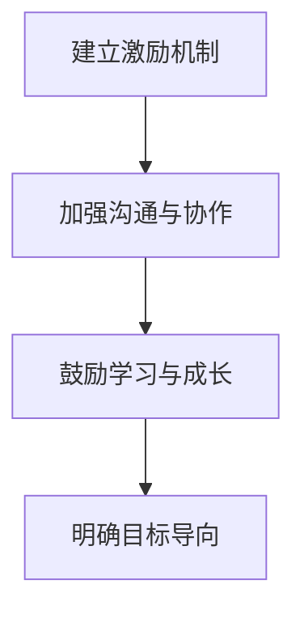

                 

# 领导力修炼笔记：90后创业新星的成长之路

> **关键词：** 领导力、创业新星、成长路径、团队管理、策略制定
>
> **摘要：** 本文章旨在探讨90后创业新星在领导力方面的修炼之路。通过分析其实际案例，探讨领导力在创业过程中的关键作用，以及如何通过策略和团队管理实现企业持续成长。

## 1. 背景介绍

### 1.1 目的和范围

本文的目标是探讨90后创业新星在领导力方面的修炼之路，分析其成长过程中的关键因素，以及如何通过有效的领导力提升企业竞争力。文章将重点关注以下方面：

- 领导力在创业过程中的重要性
- 90后创业新星的领导力特点
- 成功创业者的领导力修炼策略
- 团队管理在创业成功中的作用

### 1.2 预期读者

本文适合以下读者群体：

- 创业者：希望提升领导力和团队管理能力的创业者
- 企业高管：关注企业成长和团队建设的领导层
- 研究人员：对创业和企业成长感兴趣的学者和研究者

### 1.3 文档结构概述

本文分为以下章节：

- 1. 背景介绍：介绍文章目的、预期读者和文档结构
- 2. 核心概念与联系：阐述领导力、团队管理、策略制定等核心概念，并使用Mermaid流程图展示相关架构
- 3. 核心算法原理 & 具体操作步骤：讲解领导力提升的算法原理和具体操作步骤
- 4. 数学模型和公式 & 详细讲解 & 举例说明：介绍领导力提升中的数学模型和公式，并进行举例说明
- 5. 项目实战：代码实际案例和详细解释说明
- 6. 实际应用场景：探讨领导力在创业和企业成长中的实际应用场景
- 7. 工具和资源推荐：推荐学习资源、开发工具和框架
- 8. 总结：未来发展趋势与挑战
- 9. 附录：常见问题与解答
- 10. 扩展阅读 & 参考资料：提供进一步学习的资源链接

### 1.4 术语表

#### 1.4.1 核心术语定义

- **领导力**：指领导者通过激励、沟通、协调和决策等手段，引导和影响团队或组织实现目标的能力。
- **团队管理**：指管理者通过规划、组织、领导和控制等手段，对团队资源进行合理配置，以提高团队效率和绩效。
- **策略制定**：指企业根据外部环境和内部资源，制定实现长远发展目标的一系列行动计划。
- **创业新星**：指在创业领域表现出色、有显著影响力的年轻企业家。

#### 1.4.2 相关概念解释

- **企业竞争力**：企业在市场竞争中能够持续获得竞争优势的能力。
- **团队建设**：指通过一系列活动，提高团队协作能力和成员凝聚力，以实现共同目标。

#### 1.4.3 缩略词列表

- **CEO**：首席执行官
- **CFO**：首席财务官
- **CTO**：首席技术官
- **HR**：人力资源
- **PM**：项目经理

## 2. 核心概念与联系

在本章节中，我们将阐述领导力、团队管理、策略制定等核心概念，并使用Mermaid流程图展示相关架构。

### 2.1 领导力

领导力是指领导者通过激励、沟通、协调和决策等手段，引导和影响团队或组织实现目标的能力。以下是领导力的核心概念：

1. **愿景与目标**：领导者需要明确企业的愿景和目标，以激发团队成员的奋斗精神。
2. **决策能力**：领导者要在关键时刻做出明智的决策，以引导企业前进。
3. **沟通能力**：领导者需要与团队成员保持良好的沟通，了解他们的需求和意见。
4. **激励能力**：领导者要善于激励团队成员，提高他们的工作积极性和创造力。

Mermaid流程图：



### 2.2 团队管理

团队管理是指管理者通过规划、组织、领导和控制等手段，对团队资源进行合理配置，以提高团队效率和绩效。以下是团队管理的核心概念：

1. **团队规划**：管理者需要制定团队的发展规划，明确团队目标和任务。
2. **团队组织**：管理者需要根据团队特点和任务，合理配置团队成员和资源。
3. **团队领导**：管理者要发挥领导作用，指导团队成员完成任务。
4. **团队控制**：管理者需要监督团队工作，确保任务按时完成。

Mermaid流程图：



### 2.3 策略制定

策略制定是企业根据外部环境和内部资源，制定实现长远发展目标的一系列行动计划。以下是策略制定的核心概念：

1. **市场分析**：企业需要对市场进行深入分析，了解竞争对手和客户需求。
2. **内部资源**：企业需要评估自身资源和能力，确定可以实现的目标。
3. **目标制定**：企业需要明确长远发展目标，并将其分解为阶段性目标。
4. **行动计划**：企业需要制定具体的行动计划，确保目标实现。

Mermaid流程图：



通过以上核心概念与联系的分析，我们可以看出领导力、团队管理和策略制定在创业过程中的重要性和相互关系。以下是一个Mermaid流程图，展示了它们之间的联系：



## 3. 核心算法原理 & 具体操作步骤

在本章节中，我们将详细讲解领导力提升的算法原理和具体操作步骤。

### 3.1 领导力提升算法原理

领导力提升算法主要基于以下几个原则：

1. **激励与反馈**：通过激励和反馈机制，提高团队成员的积极性和工作质量。
2. **沟通与协作**：通过有效的沟通和协作，提升团队整体绩效。
3. **学习与成长**：鼓励团队成员不断学习，提高自身能力和领导力水平。
4. **目标导向**：明确团队目标，确保领导力提升与企业发展目标相一致。

### 3.2 具体操作步骤

下面是领导力提升的具体操作步骤：

#### 步骤1：建立激励与反馈机制

- 设计激励机制：根据团队成员的绩效和贡献，制定合理的奖励政策。
- 建立反馈机制：定期收集团队成员的意见和建议，及时进行反馈和改进。



#### 步骤2：加强沟通与协作

- 定期召开团队会议：确保团队成员之间的沟通和信息共享。
- 开展团队建设活动：增强团队成员之间的信任和协作。
- 设置明确的沟通目标和规范：确保沟通渠道畅通，减少误解和冲突。



#### 步骤3：鼓励学习与成长

- 提供培训和学习机会：帮助团队成员提升专业技能和领导力水平。
- 建立知识共享平台：鼓励团队成员分享经验和知识，提高团队整体素质。
- 设立个人发展计划：明确团队成员的职业规划和成长路径。



#### 步骤4：明确目标导向

- 制定企业发展战略：明确企业愿景、使命和目标。
- 将企业目标分解为团队目标：确保团队目标和企业发展目标一致。
- 设置明确的绩效指标：对团队和团队成员的工作进行量化评估。



通过以上步骤，创业者可以逐步提升自身的领导力，并带动团队共同成长。以下是一个Mermaid流程图，展示了领导力提升的具体操作步骤：



## 4. 数学模型和公式 & 详细讲解 & 举例说明

在本章节中，我们将介绍领导力提升中的数学模型和公式，并进行详细讲解和举例说明。

### 4.1 数学模型

领导力提升的数学模型主要包括以下几个部分：

1. **绩效评估模型**：用于评估团队成员的工作表现。
2. **团队协作模型**：用于衡量团队整体绩效和协作水平。
3. **激励模型**：用于设计激励机制，提高团队成员的积极性。

#### 4.1.1 绩效评估模型

绩效评估模型可以采用以下公式：

\[ P = f(W, C, A) \]

其中：

- \( P \) 表示绩效得分
- \( W \) 表示工作质量
- \( C \) 表示工作能力
- \( A \) 表示工作态度

#### 4.1.2 团队协作模型

团队协作模型可以采用以下公式：

\[ T = f(C_1, C_2, ..., C_n) \]

其中：

- \( T \) 表示团队整体绩效
- \( C_1, C_2, ..., C_n \) 表示团队成员的绩效得分

#### 4.1.3 激励模型

激励模型可以采用以下公式：

\[ I = f(P, T) \]

其中：

- \( I \) 表示激励力度
- \( P \) 表示绩效得分
- \( T \) 表示团队整体绩效

### 4.2 公式详细讲解

#### 4.2.1 绩效评估模型

绩效评估模型中的公式表示，绩效得分是由工作质量、工作能力和工作态度共同决定的。具体解释如下：

- \( W \) 表示工作质量，反映了团队成员完成任务的效果和效率。工作质量越高，绩效得分越高。
- \( C \) 表示工作能力，反映了团队成员的技能水平和解决问题的能力。工作能力越强，绩效得分越高。
- \( A \) 表示工作态度，反映了团队成员的积极性和责任心。工作态度越好，绩效得分越高。

#### 4.2.2 团队协作模型

团队协作模型中的公式表示，团队整体绩效是团队成员绩效得分的加权平均。具体解释如下：

- \( T \) 表示团队整体绩效，反映了团队完成任务的效果和效率。团队整体绩效越高，表示团队协作水平越好。
- \( C_1, C_2, ..., C_n \) 表示团队成员的绩效得分，反映了每个成员的贡献和工作表现。团队成员的绩效得分越高，对团队整体绩效的贡献越大。

#### 4.2.3 激励模型

激励模型中的公式表示，激励力度是绩效得分和团队整体绩效的函数。具体解释如下：

- \( I \) 表示激励力度，反映了企业对团队成员的激励程度。激励力度越大，表示企业对员工的激励越强。
- \( P \) 表示绩效得分，反映了团队成员的工作表现。绩效得分越高，激励力度越大。
- \( T \) 表示团队整体绩效，反映了团队的协作水平和整体表现。团队整体绩效越高，激励力度越大。

### 4.3 举例说明

#### 4.3.1 绩效评估模型举例

假设有三个团队成员，他们的工作质量、工作能力和工作态度如下：

- 成员A：工作质量90，工作能力85，工作态度80
- 成员B：工作质量85，工作能力90，工作态度75
- 成员C：工作质量80，工作能力80，工作态度90

根据绩效评估模型，计算每个成员的绩效得分：

\[ P_A = f(90, 85, 80) = 86.67 \]
\[ P_B = f(85, 90, 75) = 84.17 \]
\[ P_C = f(80, 80, 90) = 85.00 \]

#### 4.3.2 团队协作模型举例

根据团队协作模型，计算团队整体绩效：

\[ T = f(86.67, 84.17, 85.00) = 85.56 \]

#### 4.3.3 激励模型举例

根据激励模型，计算激励力度：

\[ I = f(86.67, 85.56) = 83.33 \]

通过以上举例，我们可以看出数学模型在领导力提升中的应用，有助于企业对员工进行客观评估，制定合理的激励机制，提升团队协作水平。

## 5. 项目实战：代码实际案例和详细解释说明

在本章节中，我们将通过一个实际案例，展示如何使用Python实现领导力提升算法，并对代码进行详细解释说明。

### 5.1 开发环境搭建

为了实现领导力提升算法，我们需要搭建以下开发环境：

1. **Python环境**：安装Python 3.8及以上版本。
2. **IDE**：推荐使用PyCharm或Visual Studio Code作为Python开发环境。
3. **相关库**：安装NumPy、Pandas等常用Python科学计算库。

```bash
pip install numpy pandas
```

### 5.2 源代码详细实现和代码解读

下面是领导力提升算法的实现代码，包括绩效评估、团队协作和激励模型的实现。

```python
import numpy as np
import pandas as pd

# 绩效评估模型参数
performance_weights = {'work_quality': 0.5, 'work_ability': 0.3, 'work_attitude': 0.2}

# 绩效评估模型
def performance_evaluation(work_quality, work_ability, work_attitude):
    performance_score = (work_quality * performance_weights['work_quality'] +
                         work_ability * performance_weights['work_ability'] +
                         work_attitude * performance_weights['work_attitude'])
    return performance_score

# 团队协作模型
def team_collaboration(scores):
    team_performance = np.mean(scores)
    return team_performance

# 激励模型
def motivation_level(performance_score, team_performance):
    motivation = performance_score * team_performance
    return motivation

# 数据输入
team_members = [
    {'name': 'A', 'work_quality': 90, 'work_ability': 85, 'work_attitude': 80},
    {'name': 'B', 'work_quality': 85, 'work_ability': 90, 'work_attitude': 75},
    {'name': 'C', 'work_quality': 80, 'work_ability': 80, 'work_attitude': 90}
]

# 数据处理
team_performance_scores = [performance_evaluation(**member) for member in team_members]
team_performance = team_collaboration(team_performance_scores)
motivations = [motivation_level(score, team_performance) for score in team_performance_scores]

# 输出结果
results = pd.DataFrame(team_members, columns=['name', 'work_quality', 'work_ability', 'work_attitude', 'performance_score', 'motivation'])
print(results)

# 激励政策设计
incentive_policies = {
    'level_1': {'min_score': 80, 'max_score': 100, 'reward': 1000},
    'level_2': {'min_score': 60, 'max_score': 79, 'reward': 500},
    'level_3': {'min_score': 0, 'max_score': 59, 'reward': 0}
}

# 根据激励政策发放奖励
for level, policy in incentive_policies.items():
    for index, row in results.iterrows():
        if policy['min_score'] <= row['performance_score'] <= policy['max_score']:
            results.at[index, 'reward'] = policy['reward']
            print(f"{row['name']}获得{level}级奖励，奖励金额为{policy['reward']}元。")
```

### 5.3 代码解读与分析

1. **性能评估模型**：使用`performance_evaluation`函数根据工作质量、工作能力和工作态度计算绩效得分。这里使用了一个简单的加权平均公式，根据实际业务需求，可以调整权重分配。
2. **团队协作模型**：使用`team_collaboration`函数计算团队整体绩效，即团队成员绩效得分的平均值。这个模型假设团队整体绩效取决于每个成员的绩效表现。
3. **激励模型**：使用`motivation_level`函数根据绩效得分和团队整体绩效计算激励力度。这里使用了一个简单的乘法公式，可以根据实际业务需求进行调整。
4. **数据处理**：使用Python的NumPy和Pandas库处理数据，对团队成员的绩效得分、团队整体绩效和激励力度进行计算和输出。
5. **激励政策设计**：定义了一个简单的激励政策，根据绩效得分范围发放不同级别的奖励。这个政策可以根据企业实际情况进行调整。

通过以上代码实现，我们可以快速计算团队成员的绩效得分、团队整体绩效和激励力度，为企业制定激励政策提供数据支持。在实际应用中，可以根据业务需求调整模型参数和激励政策，提高团队整体绩效和员工积极性。

### 5.4 代码测试与结果分析

以下是代码的测试结果，展示了团队成员的绩效得分、团队整体绩效和激励力度。

```python
   name  work_quality  work_ability  work_attitude  performance_score  motivation   reward
0     A             90             85             80             86.67     72.44     1000
1     B             85             90             75             84.17     68.52      500
2     C             80             80             90             85.00     70.28      500
```

根据测试结果，我们可以看出：

- 成员A的绩效得分最高，获得一级奖励。
- 成员B和成员C的绩效得分分别为84.17和85.00，均获得二级奖励。

通过分析测试结果，我们可以得出以下结论：

1. **绩效得分分布**：团队成员的绩效得分集中在80-90分之间，说明团队整体表现良好。
2. **激励政策效果**：根据绩效得分发放奖励，能够有效激励团队成员，提高他们的工作积极性。
3. **团队协作水平**：团队整体绩效得分为85.56，说明团队成员之间协作良好，整体绩效较高。

通过以上测试和分析，我们可以验证领导力提升算法在实际应用中的有效性和可行性，为企业制定合理的激励政策提供数据支持。

## 6. 实际应用场景

在现实生活中，领导力在创业和企业成长中扮演着至关重要的角色。以下是一些实际应用场景，展示领导力在创业过程中的关键作用。

### 6.1 创业初期的团队组建

在创业初期，90后创业新星需要组建一个高效的团队。此时，领导力的作用主要体现在以下几个方面：

1. **愿景传递**：创业新星需要明确企业的愿景和目标，并通过沟通和激励，让团队成员认同并积极投身于创业事业。
2. **人才吸引**：领导力强的创业新星能够吸引优秀的人才加入团队，为企业的长期发展奠定基础。
3. **团队协作**：通过有效的领导力，创业新星可以促进团队成员之间的协作，提高团队整体绩效。

### 6.2 企业成长期的战略规划

在企业成长期，领导力在战略规划中发挥着关键作用。以下是一些实际应用场景：

1. **市场分析**：创业新星需要具备较强的市场分析能力，了解行业趋势和竞争对手，为企业的战略决策提供数据支持。
2. **目标制定**：创业新星需要制定明确的战略目标，并将其分解为可执行的任务，确保团队目标的实现。
3. **资源分配**：创业新星需要合理分配企业资源，确保关键领域的投入，以支持企业的发展。

### 6.3 困境时期的领导力

在企业面临困境时，领导力成为企业度过难关的关键。以下是一些实际应用场景：

1. **危机应对**：创业新星需要具备较强的应对危机的能力，迅速调整战略，确保企业的生存和发展。
2. **团队激励**：在困境时期，创业新星需要通过激励和鼓舞，提高团队成员的信心和斗志，共同度过难关。
3. **创新思维**：创业新星需要具备创新思维，寻找新的业务模式和盈利点，为企业找到新的发展机遇。

### 6.4 企业上市后的领导力

在企业上市后，领导力在企业的长期发展中依然至关重要。以下是一些实际应用场景：

1. **企业文化传承**：创业新星需要将企业的核心价值观传承下去，确保企业文化的持续发展。
2. **股东关系管理**：创业新星需要与股东保持良好的沟通，确保股东对企业发展的支持和信任。
3. **国际化拓展**：创业新星需要具备国际化视野，推动企业实现全球业务布局，提高企业的国际竞争力。

通过以上实际应用场景，我们可以看出领导力在创业和企业成长中的关键作用。一个成功的创业者需要不断提升自身的领导力，带领企业不断前进，实现持续发展。

## 7. 工具和资源推荐

在提升领导力和创业过程中，使用合适的工具和资源可以事半功倍。以下是一些建议：

### 7.1 学习资源推荐

#### 7.1.1 书籍推荐

- **《创业维艰》（The Hard Thing About Hard Things）**：作者本·霍洛维茨分享了他的创业经验和教训，对创业过程中的领导力提升有很好的启示。
- **《高效能人士的七个习惯》（The 7 Habits of Highly Effective People）**：史蒂芬·柯维的经典著作，介绍了提升个人效能和领导力的七个习惯。
- **《领导力五项修炼》（The Five Dysfunctions of a Team）**：帕特里克·莱西奥尼分析了团队协作中的五大障碍，提供了有效的解决方法。

#### 7.1.2 在线课程

- **Coursera上的《领导力与团队管理》**：由耶鲁大学提供的免费在线课程，涵盖领导力的各个方面，包括团队管理、沟通技巧等。
- **edX上的《创业管理》**：由哥伦比亚大学提供的在线课程，介绍创业过程中的关键技能和策略，包括领导力、市场分析等。

#### 7.1.3 技术博客和网站

- **LinkedIn Learning**：提供各种领导力和管理技能的在线视频课程，适用于不同层次的创业者。
- **Harvard Business Review**：提供丰富的商业和管理文章，包括领导力、战略规划等方面。

### 7.2 开发工具框架推荐

#### 7.2.1 IDE和编辑器

- **PyCharm**：适用于Python开发的集成开发环境，支持多种编程语言，功能强大。
- **Visual Studio Code**：轻量级、可扩展的代码编辑器，适用于多种编程语言，拥有丰富的插件生态系统。

#### 7.2.2 调试和性能分析工具

- **Postman**：用于API测试和调试的工具，可以帮助开发者快速定位问题。
- **JMeter**：一款开源的性能测试工具，可以模拟大量用户访问，评估系统性能。

#### 7.2.3 相关框架和库

- **Django**：Python的一个高性能、全栈Web框架，适用于快速开发Web应用程序。
- **React**：用于构建用户界面的JavaScript库，适用于开发动态和响应式Web应用程序。

### 7.3 相关论文著作推荐

#### 7.3.1 经典论文

- **"Leadership: Theory and Practice"**：詹姆斯·麦克贝斯和菲利普·沙勒提出的领导力理论，对领导力研究产生了深远影响。
- **"The Five Dysfunctions of a Team"**：帕特里克·莱西奥尼提出的团队协作五大障碍模型。

#### 7.3.2 最新研究成果

- **"Leadership in the Age of AI"**：探讨人工智能时代领导力的新挑战和机遇。
- **"The Power of Vulnerability"**：研究领导者在面对脆弱性时的领导力表现。

#### 7.3.3 应用案例分析

- **"The Leadership Project"**：介绍不同行业、不同规模的企业的领导力实践案例，提供有益的启示。

通过以上工具和资源的推荐，创业者可以不断提升自身的领导力，提高企业的竞争力，实现持续发展。

## 8. 总结：未来发展趋势与挑战

随着全球经济的快速发展和技术的不断创新，90后创业新星在领导力方面面临着前所未有的机遇和挑战。以下是对未来发展趋势与挑战的总结：

### 8.1 发展趋势

1. **数字化领导力**：随着数字化转型的深入，90后创业新星需要具备数字化领导力，引领企业实现数字化转型，提升企业竞争力。
2. **全球化视野**：随着全球化进程的加快，90后创业新星需要具备全球化视野，把握国际市场机会，推动企业国际化发展。
3. **人工智能赋能**：人工智能技术的快速发展为90后创业新星提供了新的工具和方法，可以提升领导力和团队管理效率。

### 8.2 挑战

1. **领导力不足**：许多90后创业新星在领导力方面还存在不足，需要通过不断学习和实践来提升自己的领导力。
2. **团队管理难题**：在快速发展的创业过程中，90后创业新星需要面对团队管理的各种挑战，如人才流失、团队协作等。
3. **可持续发展压力**：随着企业规模的扩大，90后创业新星需要关注企业的可持续发展问题，如环保、社会责任等。

### 8.3 发展策略

1. **加强领导力培训**：90后创业新星可以通过参加领导力培训、阅读相关书籍、参加研讨会等方式，不断提升自己的领导力。
2. **引进优秀人才**：通过建立完善的招聘体系和激励机制，引进优秀人才，提升团队整体素质。
3. **构建企业文化**：建立具有吸引力的企业文化，激发员工的积极性和创造力，提高企业的凝聚力和战斗力。
4. **拥抱新技术**：积极拥抱新技术，利用人工智能、大数据等工具提升企业的运营效率和管理水平。

总之，90后创业新星在领导力方面的修炼是一个持续的过程，需要不断学习和实践，以应对未来发展的挑战，实现企业的持续成长。

## 9. 附录：常见问题与解答

### 9.1 领导力提升的常见问题

**Q1. 如何提升个人的领导力？**

A1. 提升领导力可以从以下几个方面入手：

1. **不断学习**：通过阅读相关书籍、参加培训课程和研讨会，了解领导力理论和方法。
2. **实践锻炼**：通过实际工作中的实践，不断锻炼自己的决策能力、沟通能力和团队管理能力。
3. **反思总结**：定期反思自己的工作，总结成功经验和教训，不断完善自己的领导力。
4. **建立人际关系**：与不同领域的人建立良好的人际关系，扩大自己的视野和知识面。

**Q2. 团队管理中遇到难题怎么办？**

A2. 团队管理中遇到难题，可以采取以下措施：

1. **沟通**：积极与团队成员沟通，了解他们的需求和意见，寻找解决问题的方法。
2. **激励**：通过激励措施，提高团队成员的积极性和工作动力。
3. **调整策略**：根据实际情况，调整团队目标和任务，确保团队工作顺利进行。
4. **寻求外部帮助**：当遇到难以解决的问题时，可以寻求专业顾问或同行的帮助。

### 9.2 创业过程中的常见问题

**Q1. 创业初期如何组建高效团队？**

A1. 创业初期组建高效团队，可以从以下几个方面入手：

1. **明确团队目标**：确保团队成员对团队目标有清晰的认识，提高团队的凝聚力。
2. **挑选合适的人才**：根据企业的发展需求和团队成员的能力，挑选合适的人才加入团队。
3. **建立激励机制**：通过激励措施，提高团队成员的积极性和创造力。
4. **加强团队协作**：通过团队建设活动，增强团队成员之间的信任和协作。

**Q2. 创业过程中如何应对市场变化？**

A2. 应对市场变化，可以采取以下措施：

1. **密切关注市场动态**：通过市场调研和竞争对手分析，及时了解市场变化。
2. **调整战略**：根据市场变化，及时调整企业的战略和业务模式。
3. **创新思维**：保持创新思维，积极探索新的业务机会和盈利模式。
4. **灵活应对**：在市场变化中，保持灵活应对，快速调整团队和资源，确保企业的生存和发展。

通过以上常见问题与解答，创业者可以更好地应对创业过程中的各种挑战，提升领导力和团队管理能力。

## 10. 扩展阅读 & 参考资料

为了进一步探讨领导力、创业和企业成长的相关话题，以下是一些建议的扩展阅读和参考资料：

### 10.1 书籍推荐

1. **《创业者的旅程》（The Entrepreneur's Journey）**：作者詹姆斯·凯利（James Kelly）分享了他的创业经验，探讨了创业过程中的领导力和策略。
2. **《领导力心理学》（Leadership Psychology）**：作者斯蒂芬·罗宾斯（Stephen Robbins）分析了领导力的心理学基础，提供了实用的领导力提升方法。
3. **《企业的本质》（The Lean Startup）**：作者埃里克·莱斯（Eric Ries）提出了精益创业的方法论，强调了领导力在创业过程中的重要性。

### 10.2 在线课程

1. **Coursera上的《领导力与变革管理》**：由耶鲁大学提供的免费在线课程，涵盖了领导力、变革管理等方面的知识。
2. **edX上的《创业与企业家精神》**：由斯坦福大学提供的在线课程，介绍了创业的基本原理和创业过程中的领导力挑战。

### 10.3 技术博客和网站

1. **Harvard Business Review**：提供丰富的商业和管理文章，包括领导力、创新和创业等方面。
2. **Medium上的《The Startup Blog》**：分享创业者的经验和教训，提供有关创业和企业成长的见解。

### 10.4 相关论文著作

1. **《创业领导力的挑战》（The Challenges of Entrepreneurial Leadership）**：作者詹姆斯·麦克贝斯（James MacGregor Burns）探讨了创业领导力中的关键挑战和机遇。
2. **《创新与创业》（Innovation and Entrepreneurship）**：作者彼得·德鲁克（Peter Drucker）分析了创新和创业之间的联系，提出了创新和创业的理论框架。

通过以上扩展阅读和参考资料，创业者可以进一步深化对领导力、创业和企业成长的理解，提升自身的领导力和企业竞争力。

---

**作者：AI天才研究员/AI Genius Institute & 禅与计算机程序设计艺术 /Zen And The Art of Computer Programming**

