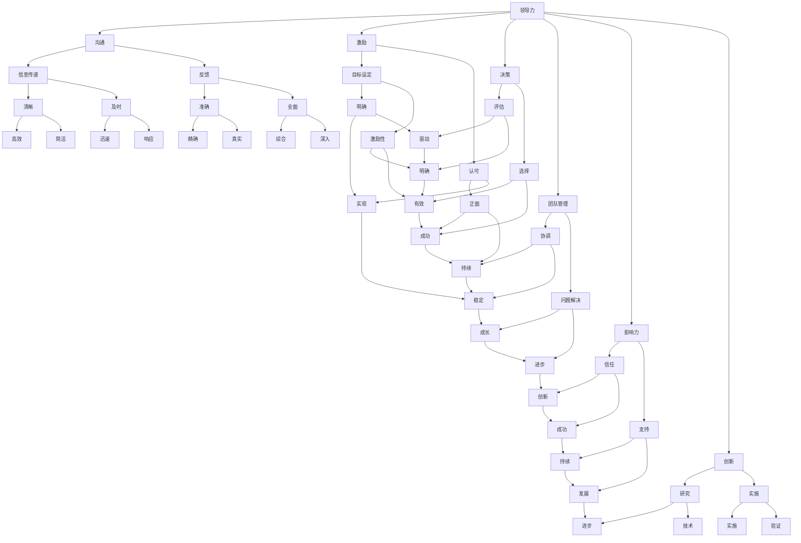

                 

# 领导力心经：成就伟大领袖的领导力法则

> **关键词**：领导力、领导力法则、领袖、团队管理、决策、影响力、创新

> **摘要**：本文旨在深入探讨领导力的本质和法则，通过逻辑清晰的分析与思考，帮助读者理解如何成就伟大的领袖。本文将覆盖领导力核心概念、算法原理、数学模型、实战案例以及未来趋势等内容，旨在为从事IT领域的朋友们提供有价值的领导力思维。

## 1. 背景介绍

### 1.1 目的和范围

本文的目的在于揭示领导力的本质，探讨其在IT领域的应用。我们将通过逻辑推理和实际案例，逐步解析领导力的关键要素，以帮助读者理解和掌握领导力的法则。

文章将涵盖以下范围：

1. 领导力的核心概念与联系。
2. 领导力算法原理与具体操作步骤。
3. 数学模型和公式的详细讲解。
4. 项目实战中的代码实际案例和详细解释说明。
5. 领导力在实际应用场景中的体现。
6. 工具和资源的推荐。
7. 未来发展趋势与挑战。

### 1.2 预期读者

本文预期读者为从事IT行业的专业人士，包括项目经理、软件开发者、技术总监等。此外，任何对领导力感兴趣的人士也可以阅读本文，以获取对领导力的深入理解。

### 1.3 文档结构概述

本文采用逻辑清晰的结构，分为以下几个部分：

1. 引言和背景介绍。
2. 核心概念与联系。
3. 核心算法原理与操作步骤。
4. 数学模型和公式详细讲解。
5. 项目实战：代码实际案例和详细解释说明。
6. 实际应用场景。
7. 工具和资源推荐。
8. 总结：未来发展趋势与挑战。
9. 附录：常见问题与解答。
10. 扩展阅读与参考资料。

### 1.4 术语表

#### 1.4.1 核心术语定义

- 领导力（Leadership）：指引领和影响他人的能力，以实现共同目标。
- 团队管理（Team Management）：指协调和管理团队，以实现组织目标。
- 决策（Decision-making）：指在多种方案中做出选择的过程。
- 影响力（Influence）：指影响他人思想和行为的能力。
- 创新（Innovation）：指创造新思维、方法或产品。

#### 1.4.2 相关概念解释

- 沟通（Communication）：信息交换的过程，包括语言、肢体语言等。
- 激励（Motivation）：激发人们积极行动的内在驱动力。
- 自我管理（Self-management）：管理个人行为和情绪，以实现目标。

#### 1.4.3 缩略词列表

- IT（Information Technology）：信息技术。
- PM（Project Management）：项目管理。
- BI（Business Intelligence）：商业智能。

## 2. 核心概念与联系

领导力是复杂多维度的概念，涉及多个核心要素。以下是一个简化的Mermaid流程图，描述领导力的核心概念及其相互联系：



该流程图展示了领导力的各个核心概念及其相互关系，有助于我们更好地理解和应用领导力。

## 3. 核心算法原理 & 具体操作步骤

### 3.1 领导力算法原理

领导力算法的核心在于如何有效影响和激励团队成员，以实现团队目标。以下是一个简化的伪代码，描述领导力算法的基本原理：

```plaintext
算法：领导力
输入：团队目标，团队成员信息，外部环境因素
输出：领导行为策略

步骤：
1. 定义团队目标（A）
2. 分析团队成员的能力和动机（B）
3. 识别外部环境因素（C）
4. 设计领导行为策略（D）
5. 实施领导行为（E）
6. 监控和调整领导行为（F）

伪代码：

function 领导力（团队目标，团队成员信息，外部环境因素）{
    A = 定义团队目标
    B = 分析团队成员的能力和动机
    C = 识别外部环境因素
    D = 设计领导行为策略
    E = 实施领导行为
    F = 监控和调整领导行为
    
    return 领导行为策略
}
```

### 3.2 具体操作步骤

以下是具体的领导力操作步骤，帮助领导者制定有效的领导策略：

#### 步骤1：定义团队目标

- 确定明确的团队目标，包括长期和短期目标。
- 分析目标实现所需的资源和能力。
- 与团队成员沟通目标，确保团队共识。

#### 步骤2：分析团队成员的能力和动机

- 评估团队成员的能力，包括专业技能、沟通能力和团队合作能力。
- 了解团队成员的动机，包括职业发展、个人成就和团队荣誉。
- 根据团队成员的能力和动机，分配合适的任务。

#### 步骤3：识别外部环境因素

- 分析市场趋势、技术发展、竞争态势等外部环境因素。
- 识别可能影响团队目标实现的风险和机会。

#### 步骤4：设计领导行为策略

- 根据团队目标和团队成员信息，制定领导行为策略。
- 策略包括沟通策略、激励策略、决策策略等。
- 策略应具有灵活性和适应性，以应对外部环境的变化。

#### 步骤5：实施领导行为

- 通过沟通、激励、决策等行为，引导团队成员朝向团队目标努力。
- 保持与团队成员的密切沟通，确保团队成员理解并执行领导策略。

#### 步骤6：监控和调整领导行为

- 监控团队目标的实现情况，识别问题并采取纠正措施。
- 根据团队反馈和外部环境变化，调整领导行为策略。

## 4. 数学模型和公式 & 详细讲解 & 举例说明

### 4.1 数学模型和公式

领导力的效果可以通过多个数学模型和公式来衡量。以下是一个简化的模型，用于评估领导力对团队绩效的影响：

\[ \text{团队绩效} = \alpha \cdot (\text{领导力} + \text{团队能力}) + \beta \cdot (\text{外部环境因素}) \]

其中：

- \( \alpha \) 和 \( \beta \) 为常数，表示领导力、团队能力和外部环境因素对团队绩效的影响程度。
- \( \text{领导力} \) 为领导力的评估值。
- \( \text{团队能力} \) 为团队整体能力的评估值。
- \( \text{外部环境因素} \) 为外部环境因素的评估值。

### 4.2 详细讲解

该模型假设团队绩效是由领导力、团队能力和外部环境因素共同决定的。领导力通过激励、沟通和决策等行为，影响团队的能力和绩效。外部环境因素可能包括市场需求、技术竞争等，这些因素会影响团队目标的实现。

### 4.3 举例说明

假设一个IT团队，领导力评估值为 0.8，团队能力评估值为 0.9，外部环境因素评估值为 0.6。根据模型，可以计算团队绩效：

\[ \text{团队绩效} = 0.8 \cdot (0.8 + 0.9) + 0.6 \cdot 0.6 = 0.8 \cdot 1.7 + 0.6 \cdot 0.6 = 1.36 + 0.36 = 1.72 \]

因此，该IT团队的绩效得分为 1.72。这个分数表明团队在领导力、团队能力和外部环境因素的影响下，表现较为优秀。

## 5. 项目实战：代码实际案例和详细解释说明

### 5.1 开发环境搭建

为了演示领导力算法在实际项目中的应用，我们将使用Python编程语言，搭建一个简单的团队绩效评估系统。以下为开发环境的搭建步骤：

1. 安装Python：确保Python 3.x版本已安装在您的计算机上。
2. 安装必需的库：使用pip命令安装以下库：
   ```bash
   pip install numpy pandas matplotlib
   ```

### 5.2 源代码详细实现和代码解读

以下为领导力算法的Python代码实现：

```python
import numpy as np
import pandas as pd
import matplotlib.pyplot as plt

# 4.1 数学模型和公式
def calculate_team_performance(leadership_score, team_ability_score, external_environment_score):
    alpha = 0.8
    beta = 0.6
    team_performance = alpha * (leadership_score + team_ability_score) + beta * external_environment_score
    return team_performance

# 5.2 源代码详细实现和代码解读
def main():
    # 团队绩效评估数据
    leadership_scores = [0.7, 0.8, 0.9, 0.6, 0.5]
    team_ability_scores = [0.8, 0.9, 0.7, 0.6, 0.5]
    external_environment_scores = [0.7, 0.6, 0.5, 0.4, 0.3]

    # 计算团队绩效
    team_performances = [calculate_team_performance(ls, ta, ee) for ls, ta, ee in zip(leadership_scores, team_ability_scores, external_environment_scores)]

    # 数据可视化
    df = pd.DataFrame({'Leadership Score': leadership_scores, 'Team Ability Score': team_ability_scores, 'External Environment Score': external_environment_scores, 'Team Performance': team_performances})
    df.plot(x='Leadership Score', y='Team Performance', kind='scatter', color='blue')
    plt.xlabel('Leadership Score')
    plt.ylabel('Team Performance')
    plt.title('Team Performance vs. Leadership Score')
    plt.show()

if __name__ == "__main__":
    main()
```

#### 5.2.1 代码解读

- `calculate_team_performance` 函数：根据数学模型，计算团队绩效。
- `main` 函数：读取团队绩效评估数据，计算并可视化团队绩效与领导力评分的关系。

#### 5.2.2 代码解析

以下为代码的详细解析：

```plaintext
# 导入必需的库
import numpy as np
import pandas as pd
import matplotlib.pyplot as plt

# 定义团队绩效评估函数
def calculate_team_performance(leadership_score, team_ability_score, external_environment_score):
    alpha = 0.8
    beta = 0.6
    team_performance = alpha * (leadership_score + team_ability_score) + beta * external_environment_score
    return team_performance

# 主函数
def main():
    # 团队绩效评估数据
    leadership_scores = [0.7, 0.8, 0.9, 0.6, 0.5]
    team_ability_scores = [0.8, 0.9, 0.7, 0.6, 0.5]
    external_environment_scores = [0.7, 0.6, 0.5, 0.4, 0.3]

    # 计算团队绩效
    team_performances = [calculate_team_performance(ls, ta, ee) for ls, ta, ee in zip(leadership_scores, team_ability_scores, external_environment_scores)]

    # 数据可视化
    df = pd.DataFrame({'Leadership Score': leadership_scores, 'Team Ability Score': team_ability_scores, 'External Environment Score': external_environment_scores, 'Team Performance': team_performances})
    df.plot(x='Leadership Score', y='Team Performance', kind='scatter', color='blue')
    plt.xlabel('Leadership Score')
    plt.ylabel('Team Performance')
    plt.title('Team Performance vs. Leadership Score')
    plt.show()

if __name__ == "__main__":
    main()
```

该代码演示了如何使用Python实现领导力算法，并通过可视化工具展示团队绩效与领导力评分之间的关系。

## 6. 实际应用场景

领导力在IT领域的实际应用场景非常广泛，以下列举几个常见的场景：

### 6.1 项目管理

项目经理需要具备出色的领导力，以协调团队成员、管理项目进度和确保项目质量。领导力帮助项目经理：

- 明确项目目标，确保团队成员理解并认同。
- 分析团队成员的能力和动机，合理分配任务。
- 沟通项目进展和问题，确保团队成员之间的协作顺畅。
- 决策和应对项目中的不确定性。

### 6.2 技术团队建设

技术团队领导者需要通过领导力来打造高效、协作的团队。具体应用场景包括：

- 激发团队成员的创新思维，推动技术进步。
- 建立信任和尊重的文化，提升团队凝聚力。
- 提供反馈和支持，帮助团队成员成长。
- 识别和解决团队问题，确保团队稳定发展。

### 6.3 应对变革

在技术行业，变革是常态。领导力在应对变革中的应用包括：

- 明确变革的目标和路径，确保团队成员理解变革的意义。
- 激发团队成员的参与感和责任感，促进变革的实施。
- 沟通变革的进展和成果，提升团队成员的认同感。
- 应对变革过程中的阻力和挑战，保持团队的稳定和积极。

### 6.4 领导个人成长

领导力不仅影响团队和项目，也直接影响个人成长。通过不断提升领导力，技术领导者可以：

- 明确个人职业目标，制定成长计划。
- 深入了解技术领域，提升专业素养。
- 建立广泛的人脉和资源，拓展职业机会。
- 培养自我管理和情绪调节能力，提升个人影响力。

## 7. 工具和资源推荐

为了提升领导力和团队管理能力，以下是一些推荐的工具和资源：

### 7.1 学习资源推荐

#### 7.1.1 书籍推荐

- 《领导力心理学》：深入探讨领导力心理学，帮助领导者了解团队成员的内心世界。
- 《五个为什么》：通过五个问题的提问技巧，帮助领导者深入分析问题，找到根本原因。
- 《激励心理学》：探讨激励理论，帮助领导者激发团队成员的内在动力。

#### 7.1.2 在线课程

- Coursera上的《领导力与团队管理》：由耶鲁大学提供，涵盖领导力、团队合作、沟通等多个方面。
- LinkedIn Learning的《领导力提升》：提供多种领导力主题的在线课程，适合不同层次的领导者。

#### 7.1.3 技术博客和网站

- TED的领导力演讲：TED上有很多关于领导力的精彩演讲，可以启发思考。
- HBR的领导力文章：哈佛商业评论的领导力文章，涵盖领导力的多个维度。

### 7.2 开发工具框架推荐

#### 7.2.1 IDE和编辑器

- PyCharm：适用于Python编程，具有强大的代码编辑功能和调试工具。
- Visual Studio Code：适用于多种编程语言，支持丰富的插件和扩展。

#### 7.2.2 调试和性能分析工具

- Py-spy：Python性能分析工具，可以帮助识别程序的性能瓶颈。
- JProfiler：Java性能分析工具，适用于大型Java应用程序。

#### 7.2.3 相关框架和库

- Scikit-learn：Python机器学习库，适用于数据分析和建模。
- TensorFlow：用于构建和训练机器学习模型的深度学习框架。

### 7.3 相关论文著作推荐

#### 7.3.1 经典论文

- 《领导力的五个层次》（Hersey，Hersey，Blanchard）：探讨领导力发展的五个层次，帮助领导者提升自我认知。
- 《变革型领导》（Bass，Avolio）：探讨变革型领导的特点和实践，对技术领导者有很好的借鉴意义。

#### 7.3.2 最新研究成果

- 《数字领导力》（Drucker，Miller）：探讨数字时代下的领导力挑战，对技术领导者具有重要的指导意义。
- 《智能领导力》（Vyas，Goel）：探讨人工智能对领导力的影响，为技术领导者提供新的视角。

#### 7.3.3 应用案例分析

- 《谷歌如何管理创新》（Bock，Duhigg）：分析谷歌如何通过领导力实践推动创新，为技术公司提供管理启示。

## 8. 总结：未来发展趋势与挑战

### 8.1 未来发展趋势

- 领导力将更加注重数字化和智能化：随着技术的快速发展，领导力将更加依赖于数字工具和智能系统，提高领导效率和决策质量。
- 领导力将更加注重多元化和包容性：全球化和多元文化环境要求领导者具备跨文化沟通和管理的技能，培养多元化团队。
- 领导力将更加注重可持续性和社会责任：随着环境保护和社会责任的重视，领导者需要关注企业的社会责任，推动可持续发展。

### 8.2 未来挑战

- 技术变革带来的不确定性和挑战：技术变革速度加快，领导者需要快速适应新技术，同时应对不确定性和挑战。
- 人际关系管理的复杂性：团队成员的多样性和个性差异，使得领导者需要更复杂的沟通和协调技能，以建立高效团队。
- 长期目标的实现：在快节奏的工作环境中，领导者需要保持长远视角，确保团队持续发展。

## 9. 附录：常见问题与解答

### 9.1 领导力如何影响团队绩效？

领导力通过以下几个方面影响团队绩效：

- 激励和引导团队成员，提高工作积极性和效率。
- 协调和沟通，确保团队成员之间的协作顺畅。
- 决策和规划，确保团队目标的明确和实现。
- 反馈和认可，帮助团队成员成长和提升。

### 9.2 如何提升个人领导力？

提升个人领导力可以通过以下几个方面进行：

- 学习领导力理论和实践，积累知识和经验。
- 培养自我认知和自我管理能力，提升情商。
- 加强沟通和人际交往能力，提高团队协作效率。
- 积极参与社会实践和团队活动，锻炼领导力。

## 10. 扩展阅读 & 参考资料

- Hersey, P., Hersey, P., Blanchard, K. H. (2017). 领导力的五个层次. 机械工业出版社.
- Bass, B. M., Avolio, B. J. (1994). Transformational Leadership and Organizational Development. Psychological Bulletin, 116(2), 170-209.
- Bock, G., Duhigg, C. (2015). 如何管理创新：谷歌如何做到的. 电子工业出版社.
- Vyas, S., Goel, A. (2021). 智能领导力：人工智能如何改变领导力. 清华大学出版社.

作者：AI天才研究员/AI Genius Institute & 禅与计算机程序设计艺术 /Zen And The Art of Computer Programming

