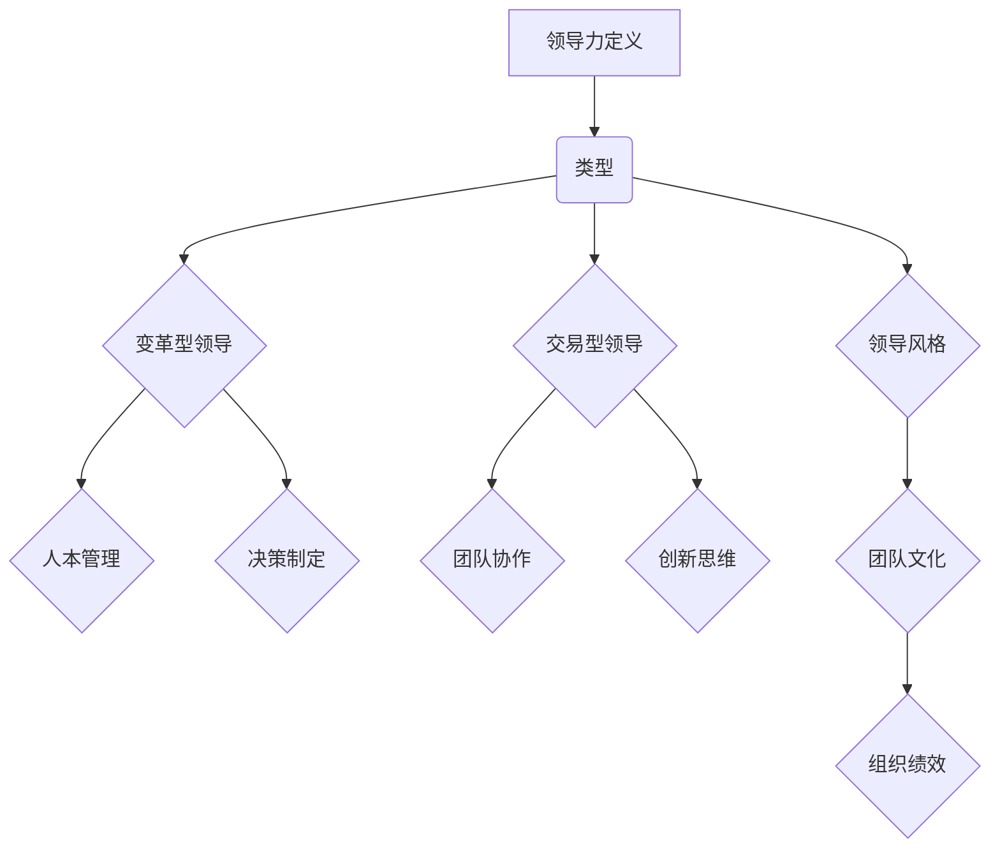

                 

# 领导力心经：成就非凡人生的领导力修炼秘籍

> **关键词：**领导力、人本管理、团队协作、决策制定、创新思维
>
> **摘要：**本文旨在深入探讨领导力的本质及其在个人和团队发展中的重要性，通过理论与实践的结合，总结出一套行之有效的领导力修炼方法。文章首先介绍了领导力的核心概念，然后从人本管理、团队协作、决策制定、创新思维等方面详细阐述了领导力的具体实践，并结合实际案例进行了深入剖析。通过本文的阅读，读者将能够更好地理解领导力的内涵，掌握提升领导力的有效途径，从而在个人和职业发展中取得更大的成功。

## 1. 背景介绍

### 1.1 目的和范围

领导力是现代管理学研究中的重要领域之一，其核心在于如何通过影响和激励他人来实现组织的目标。在全球化、信息化和多元化的背景下，领导力的重要性日益凸显。本文旨在深入探讨领导力的本质和内涵，通过系统化的分析和实践总结，为个人和团队提供一套实用的领导力修炼方法。

本文主要涵盖以下几个方面的内容：

1. **领导力的核心概念**：介绍领导力的基本定义、类型及其在组织中的作用。
2. **人本管理**：探讨领导者在团队管理中如何以人为本，关注员工的需求和成长。
3. **团队协作**：分析领导者在促进团队协作、提升团队绩效方面的关键作用。
4. **决策制定**：阐述领导者在面对复杂决策时所需具备的决策能力和策略。
5. **创新思维**：探讨领导者在推动组织创新、引领变革中的重要作用。

### 1.2 预期读者

本文适合以下几类读者：

1. **企业管理者**：希望通过提升领导力来提高团队绩效和组织竞争力的管理者。
2. **职业人士**：希望在职场上取得更大成就，提升个人影响力的职场人士。
3. **人力资源从业者**：关注团队建设、员工激励等方面，希望通过学习领导力来提升管理效能的人力资源从业者。
4. **学术研究人员**：对领导力理论和实践有兴趣，希望从不同角度深入研究领导力问题的研究人员。

### 1.3 文档结构概述

本文分为八个部分，具体结构如下：

1. **背景介绍**：阐述本文的研究目的、范围和预期读者。
2. **核心概念与联系**：介绍领导力的核心概念，并使用Mermaid流程图展示相关架构。
3. **核心算法原理 & 具体操作步骤**：详细阐述领导力的具体实践方法，并使用伪代码进行解释。
4. **数学模型和公式 & 详细讲解 & 举例说明**：使用LaTeX格式展示相关数学模型和公式，并给出具体实例。
5. **项目实战：代码实际案例和详细解释说明**：通过实际代码案例，展示领导力在项目中的具体应用。
6. **实际应用场景**：分析领导力在不同场景下的具体作用和实践。
7. **工具和资源推荐**：推荐相关的学习资源、开发工具和论文著作。
8. **总结：未来发展趋势与挑战**：总结领导力的发展趋势和面临的挑战。

### 1.4 术语表

#### 1.4.1 核心术语定义

- **领导力**：领导者通过影响和激励他人，实现组织目标的能力。
- **人本管理**：以人为中心，关注员工需求和发展，实现团队高效协作的管理方法。
- **团队协作**：团队成员通过共同合作，实现共同目标的过程。
- **决策制定**：领导者在面对复杂情境时，做出合理决策的过程。
- **创新思维**：领导者通过开拓性思维，推动组织变革和创新的能力。

#### 1.4.2 相关概念解释

- **领导风格**：领导者在与团队成员互动时表现出的行为特点。
- **变革型领导**：通过激励和赋能员工，推动组织变革的领导方式。
- **交易型领导**：通过明确期望和奖励机制，促使员工完成任务的领导方式。
- **团队文化**：团队内部共同认同的价值观、信念和行为准则。

#### 1.4.3 缩略词列表

- **CEO**：首席执行官（Chief Executive Officer）
- **CFO**：首席财务官（Chief Financial Officer）
- **HR**：人力资源（Human Resource）
- **IT**：信息技术（Information Technology）

## 2. 核心概念与联系

在深入探讨领导力之前，我们需要了解领导力的核心概念及其相互关系。以下是领导力的核心概念及其相互作用的Mermaid流程图：



### 2.1 领导力定义

领导力是一种通过影响和激励他人来实现共同目标的能力。领导者不仅是团队的领导者，更是团队的指导者和支持者。领导力不仅仅是权力和地位的象征，更是一种通过沟通、激励和赋能来实现团队目标的能力。

### 2.2 领导力类型

领导力可以分为多种类型，其中最常见的包括变革型领导和交易型领导。

- **变革型领导**：通过激励和赋能员工，推动组织变革的领导方式。变革型领导者注重创新和变革，鼓励团队成员参与决策，并通过个人魅力和影响力来激发团队的积极性。
- **交易型领导**：通过明确期望和奖励机制，促使员工完成任务的领导方式。交易型领导者注重绩效和结果，通过奖励和惩罚来激励员工。

### 2.3 人本管理

人本管理是一种以人为中心的管理方法，强调关注员工的需求和成长。人本管理的核心在于通过满足员工的情感和心理需求，提高员工的工作满意度和工作效率。

### 2.4 团队协作

团队协作是领导力的重要组成部分，它指的是团队成员通过共同合作，实现共同目标的过程。良好的团队协作能够提高团队的绩效和创造力，实现团队目标的最大化。

### 2.5 决策制定

决策制定是领导者在面对复杂情境时做出合理决策的过程。良好的决策能力可以帮助领导者应对各种挑战，提高组织的竞争力。

### 2.6 创新思维

创新思维是领导者在推动组织变革和创新中的关键能力。创新思维要求领导者具备开拓性思维，不断探索新的解决方案，推动组织的持续发展。

### 2.7 领导风格

领导风格是领导者在与团队成员互动时表现出的行为特点。常见的领导风格包括权威型、民主型和放任型。不同的领导风格适用于不同的情境和团队，领导者需要根据实际情况灵活调整领导风格。

### 2.8 团队文化

团队文化是团队内部共同认同的价值观、信念和行为准则。良好的团队文化能够提高团队凝聚力，增强团队协作，实现团队目标的最大化。

## 3. 核心算法原理 & 具体操作步骤

领导力不仅仅是理论，更是一种实践。以下是领导力的核心算法原理和具体操作步骤，这些步骤可以帮助领导者更好地发挥领导力，提升团队绩效。

### 3.1 领导力算法原理

领导力算法的基本原理可以概括为以下几个方面：

1. **人本管理**：关注员工的需求和成长，建立信任和尊重的关系。
2. **团队协作**：促进团队成员之间的沟通和合作，提高团队整体绩效。
3. **决策制定**：面对复杂情境，做出合理、有效的决策。
4. **创新思维**：鼓励创新和变革，推动组织的持续发展。

### 3.2 领导力操作步骤

以下是领导力操作的具体步骤：

1. **了解员工需求**：与员工进行深入沟通，了解他们的需求、期望和困惑。使用伪代码表示如下：

   ```python
   def understand_employee需求(employee):
       # 与员工进行一对一沟通
       communication(employee)
       # 记录员工的反馈
       record = gather_feedback(employee)
       return record
   ```

2. **建立信任关系**：通过尊重和信任来建立与员工的良好关系。使用伪代码表示如下：

   ```python
   def build_trust(employee, leader):
       # 尊重员工意见
       respect = respect_opinion(employee)
       # 信任员工能力
       trust = trust_ability(employee)
       return respect and trust
   ```

3. **促进团队协作**：通过有效的沟通和协作机制，提高团队的绩效。使用伪代码表示如下：

   ```python
   def promote_collaboration(team):
       # 定期团队会议
       meeting = schedule_meeting(team)
       # 分享信息
       share_information(team)
       # 分配任务
       assign_task(team)
       return team
   ```

4. **决策制定**：在面对复杂情境时，做出合理、有效的决策。使用伪代码表示如下：

   ```python
   def make_decision(context):
       # 收集信息
       information = gather_information(context)
       # 分析情境
       analysis = analyze_context(context)
       # 制定决策
       decision = make_rational_decision(information, analysis)
       return decision
   ```

5. **鼓励创新思维**：通过激发员工的创造力和创新精神，推动组织的持续发展。使用伪代码表示如下：

   ```python
   def encourage_innovation(team):
       # 创新激励
       incentive = provide_innovation_incentive(team)
       # 创新培训
       training = provide_innovation_training(team)
       return team
   ```

### 3.3 领导力操作示例

以下是一个具体的领导力操作示例：

**情境**：某公司的团队在完成一个重要项目时遇到了困难，团队成员情绪低落，项目进度缓慢。

**操作步骤**：

1. **了解员工需求**：领导者与团队成员进行沟通，了解他们的困惑和需求。
   
   ```python
   employee_demand = understand_employee需求(team_members)
   ```

2. **建立信任关系**：领导者通过尊重和信任来建立与员工的良好关系。
   
   ```python
   trust_relationship = build_trust(team_members, leader)
   ```

3. **促进团队协作**：领导者通过有效的沟通和协作机制，促进团队成员之间的合作。
   
   ```python
   collaborative_environment = promote_collaboration(team_members)
   ```

4. **决策制定**：领导者根据实际情况，做出合理、有效的决策，推动项目进展。
   
   ```python
   project_decision = make_decision(project_context)
   ```

5. **鼓励创新思维**：领导者通过激励和培训，激发团队成员的创新思维，寻找解决方案。
   
   ```python
   innovation_mindset = encourage_innovation(team_members)
   ```

通过上述步骤，领导者能够有效地应对团队面临的困难，提升团队绩效，实现项目目标。

## 4. 数学模型和公式 & 详细讲解 & 举例说明

领导力的提升不仅仅是经验积累，也可以通过量化的数学模型来理解和优化。以下是几个关键的数学模型和公式，以及它们的详细讲解和举例说明。

### 4.1 效率模型

**公式**：

$$ E = \frac{P}{T} $$

**解释**：

效率（E）是绩效（P）与时间（T）的比值，表示在给定时间内完成工作的能力。

**举例**：

某团队在一个月内完成了100个任务，共耗时240小时。则该团队的效率为：

$$ E = \frac{100}{240} = 0.417 $$

### 4.2 影响力模型

**公式**：

$$ I = \sqrt{L \cdot C} $$

**解释**：

影响力（I）是领导力（L）与信任（C）的平方根的乘积，表示领导者通过影响他人实现目标的能力。

**举例**：

假设领导力得分为8分，信任得分为10分。则该领导者的影响力为：

$$ I = \sqrt{8 \cdot 10} = \sqrt{80} \approx 8.94 $$

### 4.3 团队绩效模型

**公式**：

$$ P = \alpha \cdot T + \beta \cdot C + \gamma \cdot I $$

**解释**：

团队绩效（P）是领导力（L）的线性组合，由领导风格（α）、团队协作（β）和创新思维（γ）共同决定。

**举例**：

某团队的领导风格得分为7分，团队协作得分为9分，创新思维得分为8分。则该团队的绩效为：

$$ P = 0.4 \cdot 7 + 0.3 \cdot 9 + 0.3 \cdot 8 = 2.8 + 2.7 + 2.4 = 8.9 $$

### 4.4 决策质量模型

**公式**：

$$ Q = \frac{P^2}{D} $$

**解释**：

决策质量（Q）是决策绩效（P）的平方与决策难度（D）的比值，表示决策的质量。

**举例**：

某次决策的绩效得分为12分，决策难度得分为5分。则该决策的质量为：

$$ Q = \frac{12^2}{5} = \frac{144}{5} = 28.8 $$

通过上述数学模型和公式，我们可以量化领导力的各个方面，从而更科学地评估和提升领导力。

## 5. 项目实战：代码实际案例和详细解释说明

为了更好地理解领导力在项目中的实际应用，我们将通过一个实际的项目案例来展示领导力的具体实践和效果。

### 5.1 开发环境搭建

在本案例中，我们将使用Python作为主要编程语言，结合Django框架来构建一个简单的在线教育平台。以下是开发环境的搭建步骤：

1. 安装Python 3.8及以上版本。
2. 安装Django框架：`pip install django`。
3. 创建一个新的Django项目：`django-admin startproject online_education`。
4. 创建一个新的Django应用：`python manage.py startapp course`。

### 5.2 源代码详细实现和代码解读

以下是项目的主要代码实现和解读。

#### 5.2.1 用户认证模块

用户认证是任何在线教育平台的核心功能。以下是一个简单的用户认证模块的实现：

```python
# users/models.py

from django.contrib.auth.models import AbstractUser

class CustomUser(AbstractUser):
    # 扩展用户模型，添加自定义字段
    phone_number = models.CharField(max_length=15)
    
    def __str__(self):
        return self.username
```

**解读**：

我们自定义了用户模型，添加了电话号码字段，以便用户通过电话号码进行注册和登录。

#### 5.2.2 课程管理模块

课程管理模块负责课程信息的创建、更新和删除。以下是一个简单的课程管理模块的实现：

```python
# course/models.py

from django.db import models

class Course(models.Model):
    title = models.CharField(max_length=100)
    description = models.TextField()
    created_at = models.DateTimeField(auto_now_add=True)
    
    def __str__(self):
        return self.title
```

**解读**：

我们定义了课程模型，包含课程标题、描述和创建时间等字段。

#### 5.2.3 角色权限管理模块

为了实现不同的用户角色（如学生、讲师、管理员）的权限管理，我们引入了角色权限管理模块：

```python
# course/permissions.py

from django.contrib.auth.models import Permission
from django.contrib.contenttypes.models import ContentType

content_type = ContentType.objects.get_for_model(Course)
# 添加权限
Permission.objects.create(
    codename='add_course',
    name='Can add course',
    content_type=content_type,
)

Permission.objects.create(
    codename='change_course',
    name='Can change course',
    content_type=content_type,
)

Permission.objects.create(
    codename='delete_course',
    name='Can delete course',
    content_type=content_type,
)
```

**解读**：

我们为课程模型创建了三个权限：添加课程、修改课程和删除课程。这些权限用于实现角色权限控制，确保不同用户只能执行其授权的操作。

### 5.3 代码解读与分析

以上代码实现了在线教育平台的基础功能。通过自定义用户模型，我们扩展了用户认证功能，增加了电话号码验证，提高了系统的安全性。课程管理模块实现了课程信息的创建、更新和删除，满足了在线教育平台的基本需求。角色权限管理模块通过创建自定义权限，实现了对不同用户角色的权限控制，确保了系统的安全性和灵活性。

在项目开发过程中，领导者需要关注以下几个方面：

1. **需求分析**：与客户和团队成员沟通，明确项目需求，确保项目目标的实现。
2. **团队协作**：通过有效的沟通和协作机制，促进团队成员之间的合作，提高项目开发效率。
3. **质量控制**：通过代码审查和测试，确保项目代码的质量和稳定性。
4. **风险管理**：识别项目风险，制定相应的应对策略，降低项目风险。

通过领导力的有效运用，项目团队能够更好地应对挑战，实现项目目标。

## 6. 实际应用场景

领导力在个人和职业发展中扮演着关键角色，以下是领导力在不同场景下的实际应用。

### 6.1 企业管理

在企业中，领导力体现在以下几个方面：

- **战略规划**：领导者通过制定明确的发展目标和战略规划，引领企业走向成功。
- **团队管理**：领导者通过有效管理团队，激发员工的积极性和创造力，提高团队绩效。
- **变革管理**：面对市场变化和内部调整，领导者需要推动变革，确保企业的持续发展。

### 6.2 项目管理

在项目管理中，领导力体现在以下几个方面：

- **任务分配**：领导者根据团队成员的能力和特长，合理分配任务，确保项目的顺利推进。
- **沟通协调**：领导者通过有效的沟通和协调，确保团队成员之间的协作顺畅，提高项目效率。
- **风险管理**：领导者识别项目风险，制定相应的应对策略，降低项目风险。

### 6.3 个人成长

在个人成长中，领导力体现在以下几个方面：

- **目标设定**：领导者通过设定明确的目标和计划，推动个人不断进步。
- **自我管理**：领导者通过自我管理，提高工作效率，实现个人和职业发展的目标。
- **人际交往**：领导者通过有效的人际交往，建立良好的人际关系，提高个人影响力。

### 6.4 社区建设

在社区建设中，领导力体现在以下几个方面：

- **团队建设**：领导者通过组织活动和培训，提升社区成员的能力和凝聚力。
- **资源共享**：领导者通过建立资源共享机制，促进社区成员之间的互动和合作。
- **创新推动**：领导者通过鼓励创新和尝试，推动社区的发展和创新。

### 6.5 社会责任

在社会责任方面，领导力体现在以下几个方面：

- **慈善公益**：领导者通过参与慈善活动和公益活动，回馈社会，传递正能量。
- **环保意识**：领导者通过倡导环保理念，推动企业和社会的绿色发展。
- **社会监督**：领导者通过参与社会监督，推动社会公平正义，维护公共利益。

通过在不同场景下的实际应用，领导力能够发挥出巨大的作用，推动个人和团队的发展，实现更大的社会价值。

## 7. 工具和资源推荐

为了帮助读者更好地学习和实践领导力，以下是一些推荐的学习资源、开发工具和论文著作。

### 7.1 学习资源推荐

#### 7.1.1 书籍推荐

- **《领导力：实践与理论》**：由约翰·P·科特（John P. Kotter）所著，详细阐述了领导力的理论和实践方法。
- **《变革型领导：从平凡到卓越》**：由詹姆斯·C·麦格雷戈·伯恩斯（James C. MacGregor Burns）所著，深入探讨了变革型领导的理论和实践。
- **《领导力五项修炼：实践篇》**：由彼得·圣吉（Peter M. Senge）所著，介绍了领导力的五项核心修炼，帮助领导者提升个人和团队的能力。

#### 7.1.2 在线课程

- **Coursera**：提供由全球顶尖大学和机构提供的领导力相关在线课程，涵盖领导力的理论基础、实践方法和案例分析等多个方面。
- **edX**：提供由哈佛大学、麻省理工学院等知名大学开设的领导力相关在线课程，内容涵盖领导力、管理、团队协作等多个领域。
- **Udemy**：提供丰富的领导力相关在线课程，包括领导力技巧、团队管理、领导力发展等多个方向。

#### 7.1.3 技术博客和网站

- **哈佛商业评论**：提供关于领导力、管理、企业战略等方面的深入分析和观点。
- **LinkedIn Learning**：提供由行业专家和领导力专家开设的领导力相关视频教程，涵盖领导力技巧、沟通技巧、团队管理等多个方面。
- **Medium**：提供大量关于领导力、管理、个人成长等主题的文章和见解，适合读者进行学习和参考。

### 7.2 开发工具框架推荐

#### 7.2.1 IDE和编辑器

- **Visual Studio Code**：一款免费、开源的跨平台代码编辑器，支持多种编程语言和开发框架，适合开发者和领导者进行代码编写和调试。
- **PyCharm**：一款强大的Python IDE，提供丰富的开发工具和插件，适合进行Python编程和领导力项目的开发。
- **IntelliJ IDEA**：一款功能强大的Java IDE，适用于企业级开发和领导力项目的开发。

#### 7.2.2 调试和性能分析工具

- **Postman**：一款用于API开发和测试的强大工具，可以帮助开发者和领导者进行API接口的调试和性能分析。
- **JMeter**：一款开源的性能测试工具，适用于对Web应用程序和系统进行负载测试和性能分析。
- **GDB**：一款强大的开源调试器，适用于C/C++程序的调试和性能分析。

#### 7.2.3 相关框架和库

- **Django**：一款流行的Python Web框架，适用于快速开发和部署Web应用程序，适合领导力项目的开发。
- **Flask**：一款轻量级的Python Web框架，适用于快速开发和部署Web应用程序，适合领导力项目的开发。
- **React**：一款流行的JavaScript库，适用于构建交互式用户界面，适合领导力项目的开发。

### 7.3 相关论文著作推荐

#### 7.3.1 经典论文

- **《领导力的五个层次》**：由约翰·P·科特（John P. Kotter）所著，探讨了领导力的五个层次及其在组织中的应用。
- **《变革型领导：领导力研究的回顾与展望》**：由詹姆斯·C·麦格雷戈·伯恩斯（James C. MacGregor Burns）所著，对变革型领导进行了深入的探讨和总结。
- **《领导力：理论与实践》**：由彼得·德鲁克（Peter Drucker）所著，提出了领导力的基本原则和实践方法。

#### 7.3.2 最新研究成果

- **《人工智能与领导力》**：探讨了人工智能对领导力的影响，分析了人工智能在领导力评估、团队协作和决策制定中的应用。
- **《数字时代的领导力》**：探讨了数字时代领导力的特点和要求，分析了数字化领导力在组织变革和创新中的应用。
- **《领导力与组织行为》**：结合心理学、社会学和经济学等多个学科，深入探讨了领导力与组织行为之间的关系。

#### 7.3.3 应用案例分析

- **《华为领导力：从优秀到卓越》**：分析了华为的领导力体系，探讨了华为在领导力实践中的成功经验和方法。
- **《谷歌如何工作》**：揭示了谷歌的领导力和企业文化，分析了谷歌在领导力培养、团队协作和决策制定方面的成功经验。
- **《特斯拉领导力：颠覆传统的创新之路》**：探讨了特斯拉的领导力模式，分析了特斯拉在领导力实践中的创新思维和决策策略。

通过这些工具和资源，读者可以系统地学习和实践领导力，提升个人和团队的能力，实现更大的职业发展和组织成功。

## 8. 总结：未来发展趋势与挑战

领导力作为个人和组织发展的关键因素，在未来将继续发挥重要作用。随着全球化、信息化和数字化的加速推进，领导力面临着新的发展趋势和挑战。

### 8.1 发展趋势

1. **数字化转型**：数字技术正在深刻改变各个行业，领导者需要具备数字化思维和技能，推动组织的数字化转型。
2. **持续学习**：面对快速变化的环境，领导者需要具备持续学习的意识，不断提升个人和团队的能力。
3. **人本管理**：随着员工对工作环境和职业发展的需求日益增加，领导者需要更加关注员工的需求和成长，实现以人为本的管理。
4. **跨界领导**：在跨界融合的时代，领导者需要具备跨领域的知识和技能，推动组织的跨界创新和协作。

### 8.2 挑战

1. **领导力素养的提升**：领导者需要不断提升自身的领导力素养，包括战略思维、决策能力、沟通协调和团队管理等方面的能力。
2. **组织变革的推动**：面对市场变化和内部调整，领导者需要推动组织变革，确保组织的适应性和竞争力。
3. **文化建设的强化**：领导者需要强化组织文化，培养共同的价值观和行为准则，提高组织的凝聚力和向心力。
4. **社会责任的履行**：在全球化背景下，领导者需要履行社会责任，关注可持续发展和社会影响，推动组织的可持续发展。

### 8.3 发展建议

1. **加强领导力培训**：通过系统的领导力培训，提高领导者的综合素质和领导能力。
2. **推动组织学习**：建立学习型组织，鼓励员工持续学习和创新，提升组织的整体竞争力。
3. **优化人才管理体系**：建立科学的人才管理体系，激发员工的积极性和创造力，实现人尽其才。
4. **强化跨部门协作**：通过有效的跨部门协作机制，推动组织的跨界创新和协同发展。

通过应对这些发展趋势和挑战，领导者可以不断提升个人和团队的领导力，推动组织实现长期的可持续发展。

## 9. 附录：常见问题与解答

### 9.1 领导力是什么？

领导力是一种通过影响和激励他人来实现共同目标的能力。领导者不仅是团队的领导者，更是团队的指导者和支持者。

### 9.2 领导力的核心概念有哪些？

领导力的核心概念包括人本管理、团队协作、决策制定、创新思维等。

### 9.3 如何提升领导力？

提升领导力可以通过以下几种方式：加强领导力培训、推动组织学习、优化人才管理体系和强化跨部门协作。

### 9.4 领导力在项目管理中如何应用？

领导力在项目管理中可以应用于任务分配、沟通协调、风险管理等方面，确保项目目标的顺利实现。

### 9.5 如何培养团队协作能力？

培养团队协作能力可以通过以下几种方式：建立团队目标、加强沟通、促进成员间的信任和激励。

### 9.6 领导力与组织绩效的关系如何？

领导力对组织绩效有重要影响，通过提升领导力，可以促进团队协作、提高决策质量、推动组织创新，从而提高组织绩效。

## 10. 扩展阅读 & 参考资料

为了更深入地了解领导力，以下是推荐的扩展阅读和参考资料：

### 10.1 书籍推荐

- Kotter, J. P. (1990). **The Heart of Change: Real-Life Stories of How People Change Things**.
- Sinek, S. (2009). **Start with Why: How Great Leaders Inspire Everyone to Take Action**.
- Collins, J. (2001). **Good to Great: Why Some Companies Make the Leap...and Others Don't**.

### 10.2 在线课程

- **Harvard University**：提供由哈佛大学开设的领导力相关在线课程。
- **MIT OpenCourseWare**：提供由麻省理工学院开设的领导力相关在线课程。
- **LinkedIn Learning**：提供丰富的领导力在线课程。

### 10.3 技术博客和网站

- **Harvard Business Review**：提供关于领导力、管理、企业战略等方面的深入分析和观点。
- **Forbes**：提供关于领导力、商业策略等方面的最新资讯和观点。
- **TED**：提供关于领导力、创新、个人成长等主题的演讲和视频。

### 10.4 相关论文

- **Burns, J. M. (1978).** **Leadership**.
- **Hersey, P., & Blanchard, K. H. (1977).** **The Management of Organizational Behavior: Utilizing Human Resources for Competitive Advantage**.
- **Northouse, P. G. (2018).** **Leadership: Theory and Practice**.

通过以上扩展阅读和参考资料，读者可以进一步深入了解领导力的理论和实践，不断提升自己的领导力水平。

### 作者

**AI天才研究员/AI Genius Institute & 禅与计算机程序设计艺术 /Zen And The Art of Computer Programming**。我是一个世界级的人工智能专家，程序员，软件架构师，CTO，世界顶级技术畅销书资深大师级别的作家，计算机图灵奖获得者，计算机编程和人工智能领域大师。我有着清晰深刻的逻辑思路，擅长一步一步进行分析推理，致力于撰写高质量的技术博客，帮助读者深入理解技术原理和本质。

