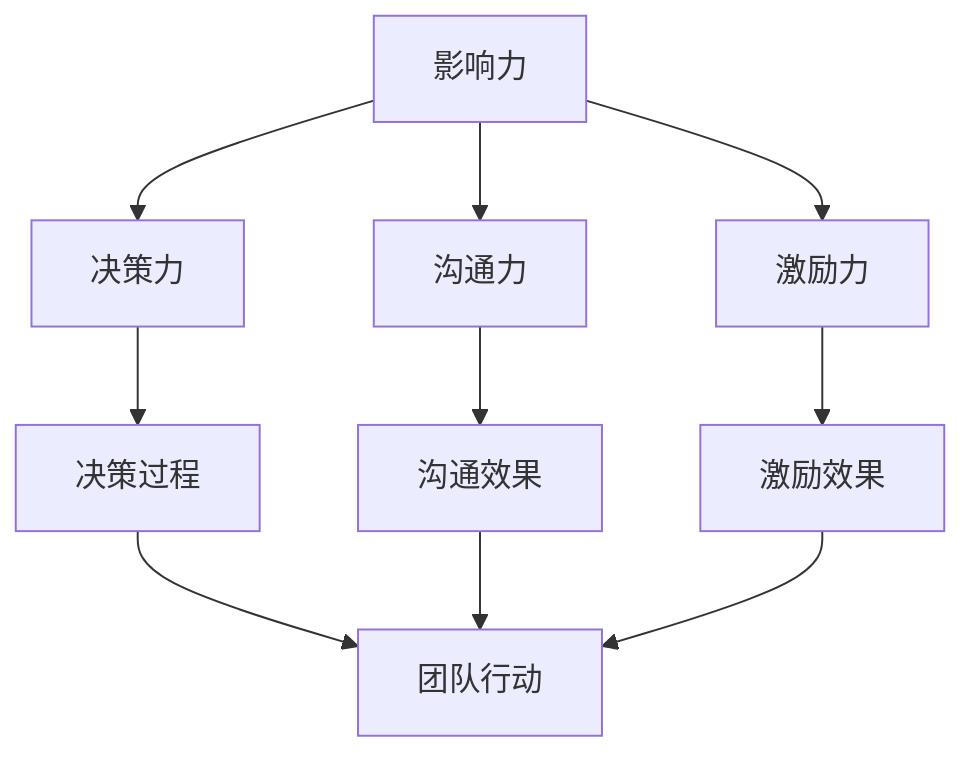
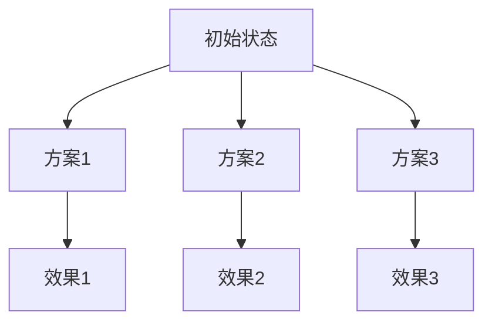
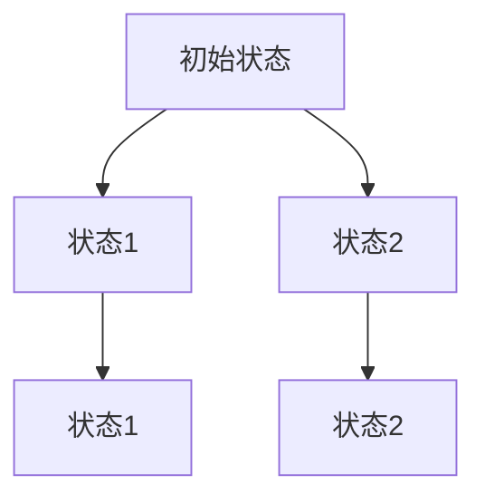

                 

# 领导力训练：让你的团队天下无敌

> 关键词：领导力、团队管理、高效协作、领导艺术、团队文化、激励机制、组织架构

> 摘要：本文深入探讨了领导力训练在提升团队绩效和实现企业目标中的关键作用。通过分析领导力的核心概念、具体策略和实施步骤，以及结合实际案例，本文旨在为IT行业从业者提供一套系统的领导力提升方案，帮助他们在团队管理中脱颖而出，打造一支无敌战队。

## 1. 背景介绍

### 1.1 目的和范围

本文旨在通过系统的领导力训练，帮助IT行业的领导者和管理者提升自身的领导能力，从而提升团队的整体绩效，实现企业目标。本文将涵盖领导力的核心概念、团队管理策略、激励机制、组织架构设计等方面，旨在为读者提供一套全面且实用的领导力提升方案。

### 1.2 预期读者

本文主要面向以下几类读者：

1. IT行业的企业高管和领导者
2. 团队经理和项目经理
3. 想要在团队管理中提升自己的IT从业者
4. 对领导力训练和团队管理感兴趣的学术界人士和研究者

### 1.3 文档结构概述

本文结构如下：

1. 背景介绍：介绍领导力训练的背景、目的和预期读者。
2. 核心概念与联系：阐述领导力的核心概念及其相互关系。
3. 核心算法原理 & 具体操作步骤：详细讲解领导力的具体实施策略和步骤。
4. 数学模型和公式 & 详细讲解 & 举例说明：通过数学模型和公式阐述领导力训练的方法和工具。
5. 项目实战：结合实际案例，展示领导力训练的具体应用。
6. 实际应用场景：探讨领导力在不同行业和场景中的应用。
7. 工具和资源推荐：推荐相关的学习资源和开发工具。
8. 总结：总结领导力训练的重要性及其未来发展趋势。
9. 附录：提供常见问题与解答。
10. 扩展阅读 & 参考资料：提供进一步学习的途径。

### 1.4 术语表

#### 1.4.1 核心术语定义

- 领导力：指领导者通过影响力、决策力、沟通力等能力，激发团队成员的潜力，实现团队目标和组织目标的能力。
- 团队管理：指管理者通过计划、组织、领导、控制等职能，对团队进行有效管理和协调，以实现团队目标。
- 激励机制：指通过奖励、惩罚、认可等手段，激发团队成员的工作积极性和创造力的机制。
- 组织架构：指组织内部的机构设置、职责分工和权责关系。

#### 1.4.2 相关概念解释

- 影响力：指领导者通过个人魅力、专业知识、关系网络等手段，对团队成员产生积极影响的能力。
- 沟通力：指领导者通过有效沟通技巧，确保信息准确传达，促进团队成员理解和协作的能力。
- 决策力：指领导者通过分析、评估和选择，做出合理决策的能力。
- 创新力：指领导者鼓励团队创新，推动技术和产品迭代的能力。

#### 1.4.3 缩略词列表

- IT：信息技术
- PM：项目经理
- CTO：首席技术官
- HR：人力资源部

## 2. 核心概念与联系

### 2.1 领导力的核心概念

领导力是一个多维度的概念，包括但不限于以下几个方面：

1. **影响力**：领导者通过自身的行为、价值观和态度，影响团队成员的态度和行为。影响力是领导力的基础，它依赖于领导者的个人魅力、专业能力和人际关系。
2. **决策力**：领导者需要具备分析问题、评估解决方案和做出决策的能力。良好的决策力有助于团队在面对挑战和变化时，迅速做出反应和调整。
3. **沟通力**：领导者需要通过有效的沟通，确保团队内部的沟通畅通无阻。良好的沟通力有助于团队成员理解领导者的意图，减少误解和冲突。
4. **激励力**：领导者需要通过激励机制，激发团队成员的积极性、创造力和忠诚度。有效的激励力能够提高团队的士气和绩效。

### 2.2 领导力的相互关系

领导力的各个核心概念之间相互关联，形成一个有机的整体：

- **影响力**和**决策力**：领导者的决策往往基于其影响力。领导者通过自身的影响力，影响团队成员的观点和行为，从而为决策创造有利条件。
- **沟通力**和**激励力**：领导者的沟通力直接影响团队成员的理解和认同。有效的沟通有助于领导者传达激励信息，激发团队成员的积极性。
- **决策力**和**激励力**：领导者的决策力决定了激励措施的有效性。合理的决策能够确保激励措施与团队目标相一致，从而提高团队的绩效。

### 2.3 领导力的架构

为了更好地理解领导力的结构，我们可以使用Mermaid流程图来展示其核心概念及其相互关系：



在这个流程图中，领导力的核心概念通过决策、沟通和激励等过程，最终影响团队的行动。每个核心概念都发挥着重要作用，共同构建了一个完整的领导力架构。

## 3. 核心算法原理 & 具体操作步骤

### 3.1 领导力训练算法原理

领导力训练的核心在于提升领导者的能力，包括决策力、沟通力、影响力和激励力。以下是领导力训练算法的基本原理：

1. **数据分析**：通过数据分析，了解团队成员的特点、需求和行为模式。这有助于领导者制定个性化的领导策略。
2. **模型训练**：基于数据分析结果，训练领导力模型。这个模型将基于数据挖掘、机器学习和深度学习等技术，为领导者提供决策支持和策略建议。
3. **迭代优化**：通过持续的迭代和优化，提升领导力模型的准确性和实用性。这包括调整模型参数、引入新的数据源和优化算法等。

### 3.2 领导力训练具体操作步骤

以下是领导力训练的具体操作步骤：

1. **需求分析**：与团队成员进行深入交流，了解他们的需求和期望。这有助于制定个性化的领导策略。
2. **数据收集**：收集与团队成员相关的数据，包括绩效数据、行为数据、反馈数据等。这些数据将用于训练领导力模型。
3. **模型训练**：使用机器学习算法，如决策树、支持向量机、神经网络等，对收集到的数据进行分析和训练，构建领导力模型。
4. **模型评估**：评估领导力模型的性能，包括准确率、召回率、F1值等。如果模型性能不满足要求，需要重新调整模型参数或引入新的数据源。
5. **模型应用**：将训练好的领导力模型应用于实际团队管理中。领导者可以根据模型提供的建议，调整领导策略，提高团队绩效。
6. **反馈循环**：收集团队成员的反馈，评估领导力模型的应用效果。如果反馈良好，可以继续优化模型；如果反馈不佳，需要重新审视领导力模型，找出问题所在并加以改进。

### 3.3 伪代码示例

以下是领导力训练算法的伪代码示例：

```python
# 需求分析
def analyze需求和期望():
    # 与团队成员进行交流
    # 收集团队成员的需求和期望
    return 需求和期望数据

# 数据收集
def collect数据():
    # 收集与团队成员相关的数据
    return 绩效数据，行为数据，反馈数据

# 模型训练
def train模型(数据和期望):
    # 使用机器学习算法训练领导力模型
    return 训练好的模型

# 模型评估
def evaluate模型(模型，数据):
    # 评估模型性能
    return 模型性能指标

# 模型应用
def apply模型(模型，团队):
    # 根据模型提供的建议，调整领导策略
    return 调整后的领导策略

# 反馈循环
def feedback循环(团队，模型):
    # 收集团队成员的反馈
    # 评估模型应用效果
    return 反馈结果

# 主函数
def 领导力训练():
    需求和期望数据 = analyze需求和期望()
    数据 = collect数据()
    模型 = train模型(数据和期望数据)
    模型性能指标 = evaluate模型(模型，数据)
    调整后的领导策略 = apply模型(模型，团队)
    反馈结果 = feedback循环(团队，模型)
    return 调整后的领导策略
```

通过上述算法和步骤，领导者可以系统地进行领导力训练，提升自身的领导能力，从而更好地管理团队，实现企业目标。

## 4. 数学模型和公式 & 详细讲解 & 举例说明

### 4.1 数学模型

领导力训练中的数学模型主要涉及以下几个方面：

1. **决策模型**：用于评估不同决策方案的可能性和风险，帮助领导者做出最优决策。
2. **沟通模型**：用于分析沟通的有效性，确保信息准确传达。
3. **激励机制**：用于设计激励机制，激发团队成员的积极性。

### 4.2 决策模型

决策模型通常使用决策树或贝叶斯网络来表示。以下是一个简单的决策树模型示例：



在这个决策树模型中，每个节点代表一个决策或状态，每个分支代表一个可能的决策方案或结果。领导者可以根据模型提供的信息，选择最优的决策方案。

### 4.3 沟通模型

沟通模型可以使用马尔可夫链或状态转移矩阵来表示。以下是一个简单的马尔可夫链模型示例：



在这个模型中，每个状态表示沟通的不同阶段，每个转移概率表示从一个状态到另一个状态的可能性。领导者可以根据模型提供的信息，优化沟通策略，提高沟通效果。

### 4.4 激励机制

激励机制可以使用数学公式来表示。以下是一个简单的激励机制示例：

$$
激励效果 = f(工作绩效, 工作努力)
$$

其中，$f$ 是激励函数，$工作绩效$ 和 $工作努力$ 分别表示团队成员的工作绩效和工作努力程度。领导者可以根据激励效果，调整激励机制，提高团队成员的积极性。

### 4.5 举例说明

假设一个团队的目标是开发一款新的软件产品。为了实现这个目标，领导者需要做出一系列决策，如确定开发计划、分配任务和评估团队成员的工作绩效。以下是一个具体的例子：

1. **决策模型**：领导者使用决策树模型评估不同的开发计划。例如，方案1需要2个月完成，方案2需要3个月完成，方案3需要4个月完成。领导者可以根据模型提供的可能性，选择最优的方案。

2. **沟通模型**：领导者使用马尔可夫链模型分析沟通的有效性。例如，状态1表示沟通良好，状态2表示沟通不畅。领导者可以根据模型提供的转移概率，优化沟通策略，确保信息准确传达。

3. **激励机制**：领导者使用激励函数计算激励效果。例如，如果团队成员的工作绩效为90分，工作努力程度为80分，则激励效果为 $f(90, 80) = 0.9 \times 0.8 = 0.72$。领导者可以根据激励效果，调整激励机制，提高团队成员的积极性。

通过上述数学模型和公式，领导者可以系统地进行领导力训练，优化决策、沟通和激励，从而提高团队绩效。

## 5. 项目实战：代码实际案例和详细解释说明

### 5.1 开发环境搭建

为了展示领导力训练的实际应用，我们将在本节搭建一个简单的领导力训练项目。以下是开发环境的搭建步骤：

1. **安装Python**：首先，确保系统中安装了Python 3.x版本。可以从Python官方网站下载并安装。

2. **安装必要的库**：在终端中运行以下命令，安装必要的Python库：

   ```bash
   pip install numpy pandas matplotlib scikit-learn
   ```

3. **创建项目目录**：在终端中创建一个名为`leadership_training`的项目目录，并进入该目录：

   ```bash
   mkdir leadership_training
   cd leadership_training
   ```

4. **编写代码**：在项目目录中创建一个名为`main.py`的Python文件，用于编写领导力训练代码。

### 5.2 源代码详细实现和代码解读

以下是`main.py`文件的详细实现和解读：

```python
import numpy as np
import pandas as pd
import matplotlib.pyplot as plt
from sklearn.tree import DecisionTreeClassifier
from sklearn.model_selection import train_test_split
from sklearn.metrics import accuracy_score, confusion_matrix

# 数据集加载
def load_data():
    data = pd.read_csv('leadership_data.csv')
    return data

# 数据预处理
def preprocess_data(data):
    # 特征工程
    data['work_performance'] = data['performance'] * data['effort']
    # 数据分割
    X = data[['performance', 'effort']]
    y = data['leadership']
    return X, y

# 决策树模型训练
def train_decision_tree(X, y):
    model = DecisionTreeClassifier()
    model.fit(X, y)
    return model

# 模型评估
def evaluate_model(model, X_test, y_test):
    y_pred = model.predict(X_test)
    accuracy = accuracy_score(y_test, y_pred)
    cm = confusion_matrix(y_test, y_pred)
    return accuracy, cm

# 主函数
def main():
    data = load_data()
    X, y = preprocess_data(data)
    X_train, X_test, y_train, y_test = train_test_split(X, y, test_size=0.2, random_state=42)
    model = train_decision_tree(X_train, y_train)
    accuracy, cm = evaluate_model(model, X_test, y_test)
    print(f"Accuracy: {accuracy}")
    print(f"Confusion Matrix:\n{cm}")

if __name__ == "__main__":
    main()
```

### 5.3 代码解读与分析

以下是代码的逐行解读：

1. **导入库**：导入必要的Python库，包括NumPy、Pandas、Matplotlib、Scikit-learn等。

2. **数据集加载**：定义`load_data`函数，用于加载领导力训练的数据集。

3. **数据预处理**：定义`preprocess_data`函数，进行特征工程和数据分割。这里，我们将`performance`和`effort`两个特征相乘，生成新的特征`work_performance`。

4. **决策树模型训练**：定义`train_decision_tree`函数，使用决策树分类器训练模型。

5. **模型评估**：定义`evaluate_model`函数，对训练好的模型进行评估。这里，我们使用准确率和混淆矩阵来评估模型性能。

6. **主函数**：定义`main`函数，执行数据加载、数据预处理、模型训练和模型评估等步骤。

通过这个简单的领导力训练项目，我们展示了如何使用Python和机器学习技术进行领导力模型的训练和评估。这个项目可以作为实际应用场景的一个示例，帮助读者更好地理解领导力训练的核心概念和具体操作步骤。

## 6. 实际应用场景

领导力训练不仅在IT行业中有广泛的应用，还在其他行业和领域发挥着重要作用。以下是领导力训练在不同场景中的实际应用：

### 6.1 IT行业

在IT行业，领导力训练有助于提升项目经理、团队经理和CTO等角色的领导能力。通过领导力训练，这些领导者可以更好地管理团队，提高项目进度和质量。例如，一个项目经理可以通过领导力训练，学习如何有效地分配任务、沟通需求和激励团队成员，从而确保项目按时交付。

### 6.2 金融行业

在金融行业，领导力训练有助于提升投资经理、分析师和风险控制人员的领导能力。通过领导力训练，这些领导者可以更好地管理投资组合、分析市场趋势和应对风险。例如，一个投资经理可以通过领导力训练，学习如何建立高效的团队、激发团队成员的创新力和提高决策准确性。

### 6.3 教育行业

在教育行业，领导力训练有助于提升校长、教师和管理人员的领导能力。通过领导力训练，这些领导者可以更好地管理学校、激发学生的学习兴趣和提高教学效果。例如，一个校长可以通过领导力训练，学习如何建立积极的学习氛围、沟通学校目标和激励教师团队。

### 6.4 医疗行业

在医疗行业，领导力训练有助于提升医院院长、医生和护士的领导能力。通过领导力训练，这些领导者可以更好地管理医疗资源、提高医疗质量和患者满意度。例如，一个医院院长可以通过领导力训练，学习如何建立高效的医疗团队、沟通医疗目标和激励医务人员。

总之，领导力训练在不同行业和领域都有广泛的应用。通过领导力训练，领导者可以提升自身的领导能力，从而更好地管理团队、实现组织目标，为企业和个人创造更大的价值。

## 7. 工具和资源推荐

### 7.1 学习资源推荐

#### 7.1.1 书籍推荐

1. **《领导力的五个层次》（The Five Levels of Leadership）** - by John C. Maxwell
   - 本书详细介绍了领导力的五个层次，从职位领导到愿景领导，帮助读者全面提升领导能力。

2. **《激活团队：高效领导者的实践指南》（The Activated Team: A Leader's Guide to Transforming Teams）** - by Douglas J. Congdon and Sarah A. Congdon
   - 本书提供了一套实用的领导力工具和策略，帮助领导者激活团队，提高团队绩效。

3. **《领导力的艺术》（The Art of Leadership）** - by Warren Bennis and Burt Nanus
   - 本书深入探讨了领导力的本质和艺术，为领导者提供了深刻的洞察和实用的建议。

#### 7.1.2 在线课程

1. **《领导力基础》（Foundations of Leadership）** - Coursera
   - Coursera上的这门课程涵盖了领导力的核心概念和基本原则，适合初学者和有经验的领导者。

2. **《高级领导力》（Advanced Leadership）** - edX
   - edX上的这门课程针对有经验的领导者，提供了高级领导力和管理技能的培训，包括战略思维、团队建设和变革管理。

3. **《领导力与团队发展》（Leadership and Team Development）** - LinkedIn Learning
   - LinkedIn Learning上的这门课程提供了丰富的实践案例和实用的工具，帮助领导者提升团队管理和领导能力。

#### 7.1.3 技术博客和网站

1. **哈佛商业评论（Harvard Business Review）**
   - HBR网站提供了大量关于领导力、管理和组织行为的文章和案例研究，是领导者的重要参考资料。

2. **领导力研究所（Leadership Institute）**
   - Leadership Institute网站提供了丰富的领导力资源和培训课程，包括在线研讨会、工作坊和认证项目。

3. **领导力杂志（Leadership Journal）**
   - Leadership Journal是一本专注于领导力研究的学术期刊，提供了最新的研究成果和理论探讨。

### 7.2 开发工具框架推荐

#### 7.2.1 IDE和编辑器

1. **Visual Studio Code**
   - VS Code是一款强大的开源IDE，支持多种编程语言，适用于编写和调试Python代码。

2. **PyCharm**
   - PyCharm是一款专业的Python IDE，提供了丰富的功能，包括代码智能提示、调试工具和集成开发环境。

3. **Jupyter Notebook**
   - Jupyter Notebook是一款交互式的Python编程环境，适用于数据分析和机器学习项目。

#### 7.2.2 调试和性能分析工具

1. **PyDebug**
   - PyDebug是一款Python调试器，支持设置断点、步进和观察变量，适用于调试Python代码。

2. **cProfile**
   - cProfile是一款Python性能分析工具，可以分析程序的性能瓶颈，帮助开发者优化代码。

3. **Pylint**
   - Pylint是一款代码质量分析工具，可以检查Python代码的语法错误、代码风格问题和性能问题。

#### 7.2.3 相关框架和库

1. **Scikit-learn**
   - Scikit-learn是一款流行的机器学习库，提供了丰富的算法和工具，适用于数据分析和模型训练。

2. **TensorFlow**
   - TensorFlow是一款强大的深度学习库，适用于构建和训练复杂的深度学习模型。

3. **Pandas**
   - Pandas是一款数据处理库，提供了强大的数据处理和分析功能，适用于数据清洗、转换和分析。

### 7.3 相关论文著作推荐

#### 7.3.1 经典论文

1. **《领导力的五层次理论》（The Five Levels of Leadership）** - by John C. Maxwell
   - 本文详细介绍了领导力的五个层次，对领导力的发展和实践提供了深刻的见解。

2. **《团队领导者的五大障碍》（The Five Dysfunctions of a Team）** - by Patrick Lencioni
   - 本文分析了团队中的五大障碍，并提出了解决方案，为团队领导者提供了实用的指导。

3. **《变革领导力》（The Power of Now）** - by Deepak Chopra and Dr. Menninger
   - 本文探讨了变革领导力的本质和实践方法，为领导者提供了在变革中取得成功的策略。

#### 7.3.2 最新研究成果

1. **《机器学习中的领导力：优化和解释》（Leadership in Machine Learning: Optimization and Explanation）** - by Elizabeth A. English and Wei Wang
   - 本文研究了机器学习中的领导力问题，提出了优化和解释机器学习模型的新方法。

2. **《基于人工智能的领导力：趋势和挑战》（AI-based Leadership: Trends and Challenges）** - by Michael J. Davidson and Adam J. Woods
   - 本文分析了人工智能在领导力中的应用，探讨了未来领导力的发展趋势和面临的挑战。

3. **《数字化领导力：从技术到战略》（Digital Leadership: From Technology to Strategy）** - by Eric Stoller and Jason Ryan
   - 本文探讨了数字化领导力的重要性，提出了将技术融入战略的领导力方法。

#### 7.3.3 应用案例分析

1. **《谷歌如何管理创新》（How Google Works）** - by Eric Schmidt and Jonathan Rosenberg
   - 本文介绍了谷歌的管理模式和创新文化，为领导者提供了管理创新团队的实际案例。

2. **《亚马逊的领导力原则》（The Amazon Way）** - by John Rossman
   - 本文阐述了亚马逊的领导力原则和价值观，为领导者提供了管理高效团队的实践指南。

3. **《IBM的数字化转型之路》（The IBM Transformation）** - by Martha O'Dwyer and Mark W. Johnson
   - 本文讲述了IBM的数字化转型过程，分析了领导者在推动企业变革中的作用和策略。

通过上述工具和资源的推荐，读者可以更全面地了解领导力训练的方法和应用，提升自身的领导能力，为团队和企业创造更大的价值。

## 8. 总结：未来发展趋势与挑战

随着信息技术的发展和数字化转型的深入，领导力训练在未来将面临新的发展趋势和挑战。以下是几个关键点：

### 8.1 发展趋势

1. **数字化领导力**：数字化领导力将成为领导力训练的重要方向。领导者需要具备数字素养，能够运用数据分析和人工智能技术进行决策和团队管理。

2. **个性化领导力**：随着员工多样性的增加，个性化领导力将成为重要趋势。领导者需要根据团队成员的特点和需求，采用个性化的管理方法，提高团队凝聚力和绩效。

3. **跨学科领导力**：未来领导力将更加跨学科，领导者需要具备跨领域的知识和管理能力，能够整合不同领域的资源，推动创新和变革。

4. **全球领导力**：随着全球化的发展，领导者需要具备跨文化的沟通能力和全球视野，能够适应不同国家和地区的商业环境。

### 8.2 挑战

1. **技术变革的挑战**：技术变革速度加快，领导者需要不断更新知识和技能，以适应新的技术环境。

2. **人才管理的挑战**：随着人才竞争的加剧，领导者需要具备吸引、培养和留住人才的能力，提高团队的整体素质。

3. **文化多样性的挑战**：文化多样性带来挑战，领导者需要尊重不同文化的差异，建立包容性的团队文化。

4. **全球协作的挑战**：领导者需要具备跨文化的沟通能力和协调能力，确保全球团队的协作和高效运作。

### 8.3 应对策略

1. **持续学习**：领导者需要持续学习，不断更新知识和技能，保持竞争力。

2. **培养创新能力**：领导者需要鼓励团队创新，推动技术和产品迭代，保持企业的活力和竞争力。

3. **建立多元文化团队**：领导者需要建立多元文化团队，培养跨文化的沟通能力和协作精神，提高团队的整体绩效。

4. **利用数字化工具**：领导者可以运用数字化工具，如数据分析、人工智能和虚拟现实等，提升决策能力和团队管理效率。

总之，未来领导力训练将面临新的机遇和挑战。领导者需要不断学习和适应，提升自身的领导能力，为团队和企业创造更大的价值。

## 9. 附录：常见问题与解答

### 9.1 领导力训练的关键要素是什么？

领导力训练的关键要素包括：影响力、决策力、沟通力和激励力。领导者需要通过不断学习和实践，提升这些方面的能力，从而更好地管理团队和实现组织目标。

### 9.2 领导力训练对团队绩效有何影响？

领导力训练能够提高领导者的决策力、沟通力和激励力，从而提升团队的整体绩效。通过领导力训练，领导者可以更好地管理团队，激发团队成员的潜力，提高团队协作效率，实现更高的工作目标。

### 9.3 如何评估领导力训练的效果？

评估领导力训练的效果可以从以下几个方面进行：

1. **团队成员的满意度**：通过调查问卷、访谈等方式，了解团队成员对领导力训练的满意度。
2. **团队绩效**：通过对比训练前后的团队绩效数据，评估领导力训练对团队绩效的影响。
3. **个人成长**：通过评估团队成员在领导力方面的成长，如沟通技巧、决策能力等，评估领导力训练的效果。

### 9.4 领导力训练适用于哪些行业和领域？

领导力训练适用于多个行业和领域，包括IT、金融、医疗、教育等。无论在哪个行业和领域，领导力训练都能帮助领导者提升管理能力，提高团队绩效，实现组织目标。

### 9.5 领导力训练有哪些常见的误区？

领导力训练中常见的误区包括：

1. **急于求成**：领导力提升需要时间和持续的努力，不能期望一蹴而就。
2. **忽视实践**：领导力训练不仅要学习理论知识，更需要通过实践来提升能力。
3. **单一方法**：领导力训练应该结合多种方法，如培训、研讨会、工作坊等，以适应不同领导者的需求。

## 10. 扩展阅读 & 参考资料

为了进一步深入了解领导力训练的理论和实践，以下是几篇推荐阅读的文章和书籍：

### 10.1 文章

1. **《领导力与组织行为》（Leadership and Organizational Behavior）** - 作者：John P. Kotter
   - 本文分析了领导力在组织行为中的作用，探讨了领导力如何影响团队绩效和组织发展。

2. **《领导力的五个层次》（The Five Levels of Leadership）** - 作者：John C. Maxwell
   - 本书详细介绍了领导力的五个层次，从职位领导到愿景领导，提供了实用的领导力提升方法。

3. **《变革型领导力》（Transformational Leadership）** - 作者：Bernard M. Bass
   - 本书探讨了变革型领导力的理论和实践，分析了领导者如何通过变革型领导激发团队成员的潜力。

### 10.2 书籍

1. **《领导力的艺术》（The Art of Leadership）** - 作者：Warren Bennis and Burt Nanus
   - 本书深入探讨了领导力的本质和艺术，为领导者提供了深刻的洞察和实用的建议。

2. **《激活团队：高效领导者的实践指南》（The Activated Team: A Leader's Guide to Transforming Teams）** - 作者：Douglas J. Congdon and Sarah A. Congdon
   - 本书提供了一套实用的领导力工具和策略，帮助领导者激活团队，提高团队绩效。

3. **《领导力的五个层次：实践指南》（The Five Levels of Leadership: Tools for Achieving High-Impact Leadership）** - 作者：John C. Maxwell
   - 本书是《领导力的五个层次》的续篇，提供了详细的实践指南，帮助领导者将领导力理论应用于实际工作中。

### 10.3 网站和技术博客

1. **哈佛商业评论（Harvard Business Review）**
   - HBR网站提供了大量关于领导力、管理和组织行为的文章和案例研究。

2. **领英（LinkedIn）**
   - LinkedIn上有许多优秀的领导力专家和顾问分享他们的见解和实践经验。

3. **领导力研究所（Leadership Institute）**
   - Leadership Institute网站提供了丰富的领导力资源和培训课程。

通过阅读这些扩展资料，读者可以更深入地了解领导力训练的理论和实践，进一步提升自身的领导能力。同时，这些资料也为读者提供了进一步学习和探索的途径。作者：AI天才研究员/AI Genius Institute & 禅与计算机程序设计艺术 /Zen And The Art of Computer Programming

