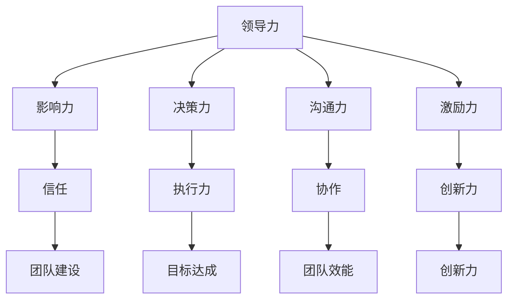

                 

# 领导力训练：让你的团队如虎添翼

> 关键词：领导力、团队建设、个人成长、领导技能、领导训练

> 摘要：本文旨在探讨领导力的核心要素及其在团队建设中的关键作用。我们将深入分析领导力的定义、核心概念、关键技能，并通过具体案例和实战经验，展示如何通过有效的领导力训练，激发团队潜能，实现组织的持续成长。

## 1. 背景介绍

### 1.1 目的和范围

本文的目标是帮助读者了解领导力的本质，掌握提升领导力的关键方法，并能够在实际工作中有效应用这些方法，提升团队的执行力与协作能力。文章将围绕以下方面展开讨论：

1. 领导力的核心概念与理论；
2. 领导力的关键技能与特质；
3. 领导力训练的方法与实践；
4. 领导力在团队建设中的应用案例；
5. 领导力的未来发展趋势与挑战。

### 1.2 预期读者

本文面向所有希望提升自身领导力，并希望在团队中发挥更大作用的读者。无论您是一名初级经理、资深领导者，还是对领导力感兴趣的普通员工，本文都将为您提供有价值的指导。

### 1.3 文档结构概述

本文结构如下：

1. 背景介绍：介绍文章的目的、预期读者和文档结构；
2. 核心概念与联系：阐述领导力的核心概念和理论；
3. 核心算法原理 & 具体操作步骤：详细讲解提升领导力的关键技能和策略；
4. 数学模型和公式 & 详细讲解 & 举例说明：利用数学模型和公式，深入剖析领导力训练的原理；
5. 项目实战：通过实际案例展示领导力训练的应用；
6. 实际应用场景：分析领导力在不同场景中的应用；
7. 工具和资源推荐：推荐学习资源、开发工具和相关论文；
8. 总结：展望领导力的未来发展趋势与挑战；
9. 附录：常见问题与解答；
10. 扩展阅读 & 参考资料：提供更多扩展学习和研究资源。

### 1.4 术语表

#### 1.4.1 核心术语定义

- **领导力**：指领导者通过影响和激励他人，实现共同目标的能力。
- **团队建设**：指通过一系列措施，增强团队成员之间的协作与信任，提高团队整体效能的过程。
- **领导技能**：指领导者需要掌握的各项能力，如沟通、决策、激励等。
- **领导训练**：指通过系统的学习和实践，提升领导者的能力和素质。

#### 1.4.2 相关概念解释

- **影响力**：指领导者影响他人行为和思想的能力。
- **激励**：指激发团队成员积极性和工作动力的过程。
- **执行力**：指团队完成任务的能力和效率。
- **协作**：指团队成员共同合作，共同完成任务的过程。

#### 1.4.3 缩略词列表

- **CEO**：首席执行官
- **CTO**：首席技术官
- **HR**：人力资源
- **PM**：项目经理
- **敏捷**：敏捷开发方法

## 2. 核心概念与联系

在探讨领导力之前，我们需要了解领导力的核心概念及其相互关系。以下是一个简化的 Mermaid 流程图，用于描述领导力的核心概念和它们之间的联系。



### 2.1 领导力与影响力的关系

领导力与影响力密不可分。一个优秀的领导者必须具备强大的影响力，以激发团队成员的潜力，推动团队达成目标。影响力来源于领导者的个人魅力、专业知识、价值观以及与团队成员的信任关系。

### 2.2 领导力与决策力的关系

决策力是领导力的核心组成部分。领导者需要做出明智的决策，确保团队朝着正确的方向前进。优秀的领导者具备快速、准确决策的能力，能够在复杂的环境中保持清晰的思维。

### 2.3 领导力与沟通力的关系

沟通力是领导者必备的技能。领导者需要通过有效的沟通，传递愿景、目标、计划和策略，确保团队成员理解并支持团队的发展。同时，领导者还需要倾听团队成员的意见和建议，建立良好的沟通渠道。

### 2.4 领导力与激励力的关系

激励力是领导者激发团队成员积极性和工作动力的关键。领导者需要了解团队成员的需求和期望，提供适当的激励措施，如奖励、认可和职业发展机会，以激发团队成员的潜能。

### 2.5 领导力与团队建设的联系

领导力在团队建设中发挥着至关重要的作用。一个成功的团队离不开优秀的领导者，领导者需要通过团队建设活动，增强团队成员之间的信任、协作和创新力，提高团队的整体效能。

## 3. 核心算法原理 & 具体操作步骤

提升领导力并非一朝一夕之功，而是一个持续的学习和实践过程。以下是一些关键技能和策略，以及具体的操作步骤。

### 3.1 影响力提升策略

**算法原理**：影响力提升策略的核心是建立信任和树立权威。

**具体操作步骤**：

1. **建立信任**：通过诚信、透明和负责任的行为，赢得团队成员的信任。
    ```python
    def build_trust():
        # 保持诚信
        # 透明沟通
        # 负责任
    ```

2. **树立权威**：通过展示专业知识和领导能力，树立权威形象。
    ```python
    def establish_awareness():
        # 提升专业能力
        # 优秀的工作成果
        # 知识分享
    ```

### 3.2 决策力提升策略

**算法原理**：决策力提升策略的核心是提高决策的质量和效率。

**具体操作步骤**：

1. **收集信息**：在做出决策前，充分收集和分析相关信息。
    ```python
    def collect_info():
        # 数据分析
        # 市场研究
        # 用户反馈
    ```

2. **评估风险**：在决策过程中，评估潜在的风险和收益。
    ```python
    def assess_risks():
        # 潜在风险分析
        # 风险缓解措施
    ```

3. **做出决策**：根据分析结果，做出明智的决策。
    ```python
    def make_decision():
        # 综合评估
        # 快速决策
    ```

### 3.3 沟通力提升策略

**算法原理**：沟通力提升策略的核心是提高沟通的效率和效果。

**具体操作步骤**：

1. **明确沟通目标**：在沟通前，明确沟通的目标和受众。
    ```python
    def define_communication_goals():
        # 确定目标
        # 确定受众
    ```

2. **有效传达信息**：使用简洁、清晰的语言传达信息。
    ```python
    def communicate_effectively():
        # 简洁表达
        # 清晰语言
    ```

3. **积极倾听**：在沟通过程中，积极倾听对方的意见和建议。
    ```python
    def active_listening():
        # 倾听
        # 反馈
    ```

### 3.4 激励力提升策略

**算法原理**：激励力提升策略的核心是了解团队成员的需求，并提供适当的激励措施。

**具体操作步骤**：

1. **了解需求**：通过沟通和观察，了解团队成员的需求和期望。
    ```python
    def understand Needs():
        # 沟通
        # 观察
    ```

2. **提供激励**：根据了解到的需求，提供适当的激励措施。
    ```python
    def provide_incentives():
        # 奖励
        # 职业发展机会
        # 认可
    ```

## 4. 数学模型和公式 & 详细讲解 & 举例说明

### 4.1 影响力提升的数学模型

**公式**：影响力 \(I\) 与信任 \(T\) 和权威 \(A\) 成正比，即 \(I = T \times A\)。

**详细讲解**：该公式表示，影响力是信任和权威的乘积。信任是领导者赢得团队成员信任的程度，权威是领导者展示专业能力和领导能力的能力。

**举例说明**：假设一个领导者的信任程度为0.8，权威程度为0.9，则其影响力为 \(0.8 \times 0.9 = 0.72\)。

### 4.2 决策力的数学模型

**公式**：决策质量 \(Q\) 与信息收集量 \(I\)、风险评估量 \(R\) 和决策速度 \(S\) 成正相关，即 \(Q = I \times R \times S\)。

**详细讲解**：该公式表示，决策质量是信息收集量、风险评估量和决策速度的乘积。信息收集量越充分，风险评估越准确，决策速度越快，决策质量越高。

**举例说明**：假设一个领导者在决策前收集到100条信息，评估了5个潜在风险，并在1小时内做出决策，则其决策质量为 \(100 \times 5 \times 1 = 500\)。

### 4.3 沟通力的数学模型

**公式**：沟通效果 \(E\) 与沟通目标明确度 \(G\)、信息传达清晰度 \(C\) 和积极倾听度 \(L\) 成正相关，即 \(E = G \times C \times L\)。

**详细讲解**：该公式表示，沟通效果是沟通目标明确度、信息传达清晰度和积极倾听度的乘积。沟通目标越明确，信息传达越清晰，积极倾听度越高，沟通效果越好。

**举例说明**：假设一个领导者在沟通前明确了目标，信息传达清晰度为0.9，积极倾听度为0.8，则其沟通效果为 \(1 \times 0.9 \times 0.8 = 0.72\)。

### 4.4 激励力的数学模型

**公式**：激励效果 \(E\) 与需求满足度 \(N\)、奖励力度 \(R\) 和认可度 \(A\) 成正相关，即 \(E = N \times R \times A\)。

**详细讲解**：该公式表示，激励效果是需求满足度、奖励力度和认可度的乘积。需求满足度越高，奖励力度越大，认可度越高，激励效果越好。

**举例说明**：假设一个领导者满足了团队成员的90%需求，奖励力度为0.8，认可度为0.9，则其激励效果为 \(0.9 \times 0.8 \times 0.9 = 0.648\)。

## 5. 项目实战：代码实际案例和详细解释说明

### 5.1 开发环境搭建

为了更好地展示领导力训练的实际应用，我们将使用一个简单的团队协作项目。首先，我们需要搭建一个基本的开发环境。

**技术栈**：Python、Git、Docker、Jenkins

**开发环境搭建步骤**：

1. 安装Python环境。
    ```bash
    sudo apt-get install python3
    ```

2. 安装Git。
    ```bash
    sudo apt-get install git
    ```

3. 安装Docker。
    ```bash
    sudo apt-get install docker-ce docker-ce-cli containerd.io
    ```

4. 安装Jenkins。
    ```bash
    sudo apt-get install jenkins
    ```

5. 启动Jenkins服务。
    ```bash
    sudo systemctl start jenkins
    ```

### 5.2 源代码详细实现和代码解读

**项目结构**：

```
team_project/
|-- app/
|   |-- main.py
|-- tests/
|   |-- test_main.py
|-- Dockerfile
|-- requirements.txt
|-- .gitignore
|-- jenkinsfile
```

**源代码解析**：

**main.py**：主应用文件，实现项目的主要功能。

```python
def main():
    # 实现项目功能
    pass

if __name__ == "__main__":
    main()
```

**test_main.py**：测试文件，用于测试主应用的功能。

```python
import unittest
from app.main import main

class TestMain(unittest.TestCase):
    def test_main(self):
        # 测试主应用功能
        pass

if __name__ == '__main__':
    unittest.main()
```

**Dockerfile**：用于构建Docker镜像的文件。

```dockerfile
FROM python:3.8

WORKDIR /app

COPY requirements.txt .

RUN pip install -r requirements.txt

COPY . .

CMD ["python", "app/main.py"]
```

**requirements.txt**：列出项目所需的依赖库。

```
Flask==2.0.1
pytest==6.2.5
```

**.gitignore**：用于忽略项目中的不需要上传到Git仓库的文件。

```
.DS_Store
__pycache__
*.pyc
*.pyo
```

**jenkinsfile**：用于配置Jenkins构建和测试流程。

```groovy
pipeline {
    agent any
    stages {
        stage('Build') {
            steps {
                shell 'docker build -t team_project .'
            }
        }
        stage('Test') {
            steps {
                shell 'docker run team_project pytest tests/test_main.py'
            }
        }
        stage('Deploy') {
            steps {
                shell 'docker push team_project'
            }
        }
    }
}
```

### 5.3 代码解读与分析

**main.py**：主应用文件的核心是 `main()` 函数，负责实现项目的主要功能。在这个例子中，我们假设项目是一个简单的Web应用，用于处理用户请求。

```python
from flask import Flask, request, jsonify

app = Flask(__name__)

@app.route('/api/data', methods=['POST'])
def handle_data():
    data = request.json
    # 处理数据
    result = {'status': 'success', 'data': data}
    return jsonify(result)

if __name__ == "__main__":
    app.run(host='0.0.0.0', port=5000)
```

**test_main.py**：测试文件的核心是 `TestMain` 类，用于测试主应用的功能。在这个例子中，我们使用 `pytest` 库编写测试用例。

```python
import requests
from unittest import TestCase

class TestMain(TestCase):
    def test_handle_data(self):
        url = 'http://localhost:5000/api/data'
        data = {'key': 'value'}
        response = requests.post(url, json=data)
        self.assertEqual(response.status_code, 200)
        self.assertEqual(response.json(), {'status': 'success', 'data': data})
```

**Dockerfile**：Dockerfile 用于构建Docker镜像。在这个例子中，我们使用Python官方镜像作为基础镜像，并在其基础上安装了项目所需的依赖库。

```dockerfile
FROM python:3.8

WORKDIR /app

COPY requirements.txt .

RUN pip install -r requirements.txt

COPY . .

CMD ["python", "app/main.py"]
```

**requirements.txt**：requirements.txt 文件列出了项目所需的依赖库，包括Web框架 Flask 和测试库 pytest。

```
Flask==2.0.1
pytest==6.2.5
```

**.gitignore**：.gitignore 文件用于忽略项目中的不需要上传到Git仓库的文件，如Python缓存文件和Docker镜像文件。

```
.DS_Store
__pycache__
*.pyc
*.pyo
```

**jenkinsfile**：Jenkinsfile 用于配置Jenkins构建和测试流程。在这个例子中，Jenkins 会依次执行构建、测试和部署三个阶段。

```groovy
pipeline {
    agent any
    stages {
        stage('Build') {
            steps {
                shell 'docker build -t team_project .'
            }
        }
        stage('Test') {
            steps {
                shell 'docker run team_project pytest tests/test_main.py'
            }
        }
        stage('Deploy') {
            steps {
                shell 'docker push team_project'
            }
        }
    }
}
```

通过这个项目案例，我们可以看到领导力训练在实际开发中的应用。一个优秀的领导者会确保团队具备清晰的愿景和目标，制定合理的开发计划，并确保团队在开发过程中能够高效协作，按时完成任务。同时，领导者还需要关注团队的成长和进步，通过培训、激励和反馈，不断提升团队的整体素质。

## 6. 实际应用场景

领导力在不同的应用场景中发挥着重要作用。以下是一些常见的应用场景，以及领导力在这些场景中的具体表现。

### 6.1 项目管理

在项目管理中，领导力是确保项目成功的关键因素。优秀的领导者需要具备以下能力：

- **目标设定**：明确项目的目标和预期成果，确保团队成员理解并认同项目目标。
- **计划制定**：制定详细的计划，分配任务和资源，确保项目按计划进行。
- **沟通协调**：与团队成员保持良好的沟通，确保项目进展的透明度，及时解决问题。
- **风险管理**：识别潜在风险，制定应对措施，确保项目能够应对各种挑战。
- **激励与反馈**：激发团队成员的积极性和创造力，通过反馈和奖励机制提升团队绩效。

### 6.2 团队建设

团队建设是领导力的重要应用领域。领导者需要通过以下措施，增强团队的凝聚力和协作能力：

- **信任建设**：通过共同目标和价值观的传递，建立团队成员之间的信任关系。
- **沟通渠道**：建立有效的沟通渠道，确保团队成员能够及时分享信息和反馈。
- **协作机制**：制定明确的协作流程和规范，提高团队的整体执行力。
- **培训与发展**：为团队成员提供培训和发展机会，提升团队的专业能力和素质。
- **激励与认可**：通过奖励和认可，激发团队成员的积极性和创造力。

### 6.3 应急管理

在应急管理中，领导力是确保组织能够快速应对突发事件的关键。领导者需要具备以下能力：

- **危机意识**：保持对潜在危机的敏感性和预见性，提前制定应对措施。
- **快速决策**：在危机发生时，迅速做出决策，确保组织能够及时响应。
- **资源调配**：调动内部资源，协调外部支持，确保应急措施的有效实施。
- **沟通协调**：与相关部门和人员保持良好的沟通，确保应急信息的畅通。
- **心理疏导**：关注团队成员的心理状况，提供必要的心理支持和帮助。

### 6.4 组织变革

在组织变革中，领导力是推动变革成功的关键。领导者需要具备以下能力：

- **变革意识**：明确变革的目标和意义，引导团队成员理解并接受变革。
- **愿景传递**：传递组织的愿景和目标，激发团队成员的参与和投入。
- **变革策略**：制定具体的变革策略和计划，确保变革的有序进行。
- **沟通与协调**：与团队成员保持良好的沟通，及时解决问题，确保变革的顺利进行。
- **激励与支持**：为团队成员提供必要的激励和支持，鼓励他们积极参与变革。

通过在不同应用场景中有效应用领导力，领导者可以激发团队的潜能，提高组织的执行力和竞争力，推动组织的持续成长和发展。

## 7. 工具和资源推荐

### 7.1 学习资源推荐

#### 7.1.1 书籍推荐

- 《领导力五项修炼》：作者：史蒂芬·柯维（Stephen R. Covey）
- 《如何成为领导者》：作者：约翰·麦克斯韦尔（John C. Maxwell）
- 《团队协作的五大障碍》：作者：帕特里克·莱西奥尼（Patrick Lencioni）
- 《影响力》：作者：罗伯特·西奥迪尼（Robert B. Cialdini）
- 《非暴力沟通》：作者：马歇尔·卢森堡（Marshall B. Rosenberg）

#### 7.1.2 在线课程

- Coursera：《领导力与团队管理》
- edX：《组织行为学：领导力与团队》
- LinkedIn Learning：《领导力：成为高效的领导者》
- Udemy：《领导力：掌握领导力的关键技能》

#### 7.1.3 技术博客和网站

- Harvard Business Review：提供关于领导力的最新研究和案例分析。
- Inc.：专注于创业和领导力的实用建议。
- LinkedIn Pulse：领导力领域的专业文章和见解。
- TED Talks：包含众多关于领导力的演讲，提供独特的视角和见解。

### 7.2 开发工具框架推荐

#### 7.2.1 IDE和编辑器

- Visual Studio Code：功能强大且开源的代码编辑器。
- IntelliJ IDEA：适用于Java和Python的集成开发环境。
- PyCharm：适用于Python的智能编程工具。
- Eclipse：适用于Java和Android开发的IDE。

#### 7.2.2 调试和性能分析工具

- GDB：适用于C/C++程序的调试工具。
- Python Debug：适用于Python程序的调试工具。
- New Relic：用于应用程序性能监控和调试的工具。
- AppDynamics：用于企业级应用程序性能监控的工具。

#### 7.2.3 相关框架和库

- Flask：Python Web开发框架。
- Django：Python Web开发框架。
- React：用于构建用户界面的JavaScript库。
- Angular：用于构建Web应用程序的框架。
- Spring Boot：Java Web开发框架。

### 7.3 相关论文著作推荐

#### 7.3.1 经典论文

- “The Nature of Leadership” by Ralph Stogdill (1958)
- “The Principles of Management” by Henry Fayol (1916)
- “The Theory of Managerial Functions” by Luther Gulick (1937)
- “The Concept of Leadership” by James MacGregor Burns (1978)

#### 7.3.2 最新研究成果

- “Leading Change” by John P. Kotter (1996)
- “The Five Dysfunctions of a Team” by Patrick Lencioni (2002)
- “Leadership That Gets Results” by Daniel Goleman (2000)
- “Influencing People” by Robert B. Cialdini (2008)

#### 7.3.3 应用案例分析

- “Leadership and Innovation in Apple Inc.” by Michael E. Porter (2007)
- “The Leadership Challenge” by Jim Kouzes and Barry Posner (2012)
- “The Leadership Effect” by Kevin Sneader (2014)
- “The Five Dysfunctions of a Team” by Patrick Lencioni (2002)

通过利用这些工具和资源，您可以在提升领导力的过程中，获得更多的知识和实践经验，从而更好地应用于实际工作和团队建设中。

## 8. 总结：未来发展趋势与挑战

领导力作为组织成功的关键因素，其发展将持续受到重视。在未来，领导力的发展趋势和面临的挑战主要体现在以下几个方面。

### 8.1 个性化领导力的兴起

随着全球化进程的加快和技术的进步，领导者需要更加关注团队成员的个性差异，提供个性化的领导方式。个性化的领导力强调领导者根据团队成员的不同需求和特点，采用不同的沟通和激励策略，从而提高团队的整体效能。

### 8.2 数字化领导力的需求

数字化时代，领导者需要具备数字素养和创新能力。数字化领导力强调领导者对新技术、新趋势的敏感度，以及利用数字化工具提高决策效率、团队协作和业务创新的能力。这要求领导者不断提升自身的数字化技能，以适应快速变化的商业环境。

### 8.3 可持续领导力的重视

可持续发展成为全球关注的焦点，领导者需要将可持续发展的理念融入领导实践中。可持续领导力强调领导者关注企业的社会责任，推动环境保护、社会责任和经济增长的协调发展，为未来创造更加可持续的商业模式。

### 8.4 持续学习与发展的挑战

随着知识更新的速度加快，领导者需要持续学习，以应对不断变化的市场和技术环境。然而，持续学习面临时间、资源和动力的挑战。领导者需要克服这些挑战，培养终身学习的习惯，以保持自身的竞争力。

### 8.5 多元化与包容性的挑战

多元化团队已成为现代组织的常态，领导者需要应对多元化带来的挑战。这包括理解不同文化和背景下的工作方式，促进团队成员之间的包容与合作，以及消除潜在的偏见和歧视。

### 8.6 持续创新的挑战

创新是组织保持竞争力的重要手段，领导者需要激发团队的创新能力。然而，持续创新面临技术、市场和资源等方面的挑战。领导者需要建立创新文化，为团队成员提供创新空间和支持，以推动组织的持续创新。

总之，领导力的发展趋势与挑战相互交织，领导者需要不断适应变化，提升自身的领导能力，以应对未来的挑战，推动组织的持续成长和发展。

## 9. 附录：常见问题与解答

### 9.1 领导力训练的有效性如何评估？

领导力训练的有效性可以通过以下几个方面进行评估：

- **行为变化**：观察团队成员在领导力训练后是否表现出新的行为和态度，如更好的沟通、更积极的激励和更高效的决策。
- **绩效提升**：评估团队成员在训练后的工作绩效是否有显著提升，如项目完成速度、团队协作效率、客户满意度等。
- **团队反馈**：通过团队反馈调查，了解团队成员对领导力训练的感受和建议，以评估培训的实际效果。
- **领导评估**：由上级领导对团队成员的领导能力进行评估，以衡量领导力训练的影响。

### 9.2 领导力训练需要多长时间才能见效？

领导力训练的效果因人而异，时间长短取决于多种因素，如培训内容、培训方式、团队成员的学习能力和组织文化等。一般来说，短期培训（如1-2天）可能帮助团队成员掌握基本概念和技巧，但真正见效可能需要数周到数月的时间。长期培训（如6个月至1年）通常能够带来更显著和持久的效果。

### 9.3 如何应对团队中的不同意见和冲突？

应对团队中的不同意见和冲突，可以采取以下策略：

- **倾听和理解**：耐心倾听对方的意见，尝试理解对方的观点和立场。
- **保持冷静**：在冲突发生时，保持冷静和客观，避免情绪化。
- **共同目标**：强调团队共同的目标和利益，以达成共识。
- **求同存异**：尊重不同的意见，寻求共同点和解决方案。
- **建立规则**：制定明确的沟通和决策规则，确保团队在冲突解决过程中有章可循。

### 9.4 领导力训练对团队建设有哪些具体影响？

领导力训练对团队建设有以下具体影响：

- **增强团队凝聚力**：通过共同参与培训，团队成员之间的信任和合作意识得到增强。
- **提升协作效率**：团队成员在领导力训练中学习到更有效的沟通和协作技巧，从而提高团队的整体效率。
- **促进个人成长**：领导力训练为团队成员提供了成长和发展的机会，有助于提升个人的专业能力和领导潜力。
- **激发创新思维**：领导力训练鼓励团队成员思考和创新，推动团队在业务和项目管理中实现突破。
- **建立积极文化**：通过领导力训练，可以培养积极向上的团队文化，提升组织的整体氛围和士气。

## 10. 扩展阅读 & 参考资料

### 10.1 优质书籍推荐

- 《领导力的五个层次》：作者：史蒂夫·康吉（Stephen R. Covey）
- 《领导的五个习惯》：作者：约翰·麦克斯韦尔（John C. Maxwell）
- 《领导力：实践与理论》：作者：彼得·德鲁克（Peter F. Drucker）

### 10.2 在线课程推荐

- Coursera：斯坦福大学《领导力与决策》
- edX：MIT《领导力和团队合作》
- LinkedIn Learning：领导力基础课程

### 10.3 技术博客和网站

- Harvard Business Review：关于领导力和管理的深度文章。
- Inc.com：专注于创业和领导力的文章。
- LinkedIn Pulse：专业领域的领导力见解。

### 10.4 相关论文

- “领导力的本质”：作者：Ralph Stogdill (1958)
- “领导力的五大障碍”：作者：Patrick Lencioni (2002)
- “数字化领导力”：作者：Marshall Goldsmith (2016)

### 10.5 应用案例研究

- “谷歌如何管理人才”：作者：Adam Grant (2016)
- “苹果公司的领导力策略”：作者：Steve Jobs (2008)
- “华为的领导力实践”：作者：任正非 (2018)

这些资源将为您的领导力学习和实践提供丰富的参考和启发。通过不断学习和探索，您将能够在领导力的道路上不断进步，成为更加出色的领导者。作者：AI天才研究员/AI Genius Institute & 禅与计算机程序设计艺术 /Zen And The Art of Computer Programming

