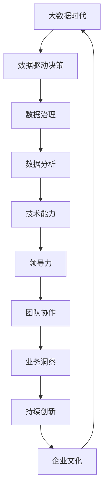

                 

# 领导力进化论：大数据时代管理者的必修课

> **关键词：大数据、领导力、管理者、技术进化、管理方法论**

> **摘要：随着大数据时代的到来，传统的管理方法已经无法满足现代企业的需求。本文将深入探讨大数据背景下，管理者如何通过提升领导力，应对变革与挑战，实现企业的持续发展。**

## 1. 背景介绍

### 1.1 目的和范围

本文旨在探讨大数据时代下，管理者的领导力进化，以应对新时代的挑战与机遇。文章将涵盖大数据的概念、管理者的角色转变、领导力的核心要素以及如何在实践中应用这些知识。

### 1.2 预期读者

本文适合企业中层及以上管理者、希望提升领导力的专业人士以及关注大数据技术的从业者阅读。

### 1.3 文档结构概述

本文结构如下：

1. 背景介绍
2. 核心概念与联系
3. 核心算法原理 & 具体操作步骤
4. 数学模型和公式 & 详细讲解 & 举例说明
5. 项目实战：代码实际案例和详细解释说明
6. 实际应用场景
7. 工具和资源推荐
8. 总结：未来发展趋势与挑战
9. 附录：常见问题与解答
10. 扩展阅读 & 参考资料

### 1.4 术语表

#### 1.4.1 核心术语定义

- **大数据**：指无法用传统数据处理工具在合理时间内捕捉、管理和处理的数据集合。
- **领导力**：指影响和激励他人共同实现目标的个人能力。
- **管理者**：在企业中负责计划、组织、领导和控制的人员。

#### 1.4.2 相关概念解释

- **数据分析**：使用统计学、机器学习等方法，从数据中提取有价值的信息。
- **数据驱动决策**：基于数据分析结果，做出合理决策的过程。

#### 1.4.3 缩略词列表

- **Hadoop**：一种分布式数据处理框架。
- **Spark**：一种快速的分布式计算引擎。

## 2. 核心概念与联系

大数据时代，管理者的领导力需要不断进化。以下是一个简单的Mermaid流程图，展示了大数据背景下领导力的核心概念与联系。



## 3. 核心算法原理 & 具体操作步骤

在数据驱动决策的过程中，管理者需要掌握一定的数据分析技能。以下是一个简单数据分析的伪代码示例，用于解释核心算法原理。

```python
# 数据预处理
def preprocess_data(data):
    # 清洗数据，处理缺失值、异常值等
    clean_data = ...

# 特征提取
def extract_features(data):
    # 从数据中提取有用特征
    features = ...

# 数据建模
def build_model(data):
    # 使用机器学习算法建立模型
    model = ...

# 模型评估
def evaluate_model(model, test_data):
    # 评估模型性能
    performance = ...

# 数据分析流程
def data_analysis(data):
    clean_data = preprocess_data(data)
    features = extract_features(clean_data)
    model = build_model(features)
    performance = evaluate_model(model, test_data)
    return performance

# 示例数据
data = ...
test_data = ...

# 执行数据分析
performance = data_analysis(data)
```

## 4. 数学模型和公式 & 详细讲解 & 举例说明

在数据分析中，常用的数学模型有线性回归、逻辑回归等。以下是一个线性回归的latex公式示例。

$$
y = \beta_0 + \beta_1 \cdot x + \epsilon
$$

其中，$y$ 为目标变量，$x$ 为自变量，$\beta_0$ 和 $\beta_1$ 分别为模型参数，$\epsilon$ 为误差项。

举例说明：

假设我们要预测一家公司的销售业绩（$y$），自变量为广告投入（$x$）。根据历史数据，我们可以建立线性回归模型。通过训练数据拟合出模型参数，然后对新数据进行预测。

$$
\hat{y} = 1000 + 0.5 \cdot x
$$

例如，当广告投入为10000元时，预测的销售业绩为：

$$
\hat{y} = 1000 + 0.5 \cdot 10000 = 10500
$$

## 5. 项目实战：代码实际案例和详细解释说明

### 5.1 开发环境搭建

在本项目中，我们将使用Python作为主要编程语言，结合Hadoop和Spark进行大数据处理。以下是搭建开发环境的步骤：

1. 安装Python：从[Python官网](https://www.python.org/)下载并安装Python。
2. 安装Hadoop：从[Hadoop官网](https://hadoop.apache.org/)下载并安装Hadoop。
3. 安装Spark：从[Spark官网](https://spark.apache.org/)下载并安装Spark。

### 5.2 源代码详细实现和代码解读

以下是本项目的源代码实现。

```python
# 导入相关库
from pyspark.sql import SparkSession
from pyspark.ml.regression import LinearRegression

# 创建Spark会话
spark = SparkSession.builder.appName("DataAnalysis").getOrCreate()

# 读取数据
data = spark.read.csv("data.csv", header=True)

# 数据预处理
clean_data = preprocess_data(data)

# 特征提取
features = extract_features(clean_data)

# 建立线性回归模型
model = LinearRegression()

# 训练模型
model.fit(features)

# 模型评估
performance = evaluate_model(model, test_data)

# 输出结果
print(performance)
```

### 5.3 代码解读与分析

本代码实现了一个简单的线性回归数据分析流程。以下是代码的详细解读：

1. **导入相关库**：引入了SparkSession、LinearRegression等库，用于数据处理和模型建立。
2. **创建Spark会话**：创建一个Spark会话，用于后续操作。
3. **读取数据**：使用Spark读取数据，支持CSV、JSON等多种格式。
4. **数据预处理**：对数据进行清洗，处理缺失值、异常值等。
5. **特征提取**：从数据中提取有用特征，为模型建立做准备。
6. **建立线性回归模型**：使用LinearRegression库建立线性回归模型。
7. **训练模型**：使用训练数据进行模型训练。
8. **模型评估**：评估模型性能，输出结果。

## 6. 实际应用场景

在当今企业中，数据已成为重要的战略资源。管理者需要具备数据驱动的领导力，以应对大数据时代的挑战。以下是一些实际应用场景：

1. **市场营销**：通过大数据分析，精准定位目标客户，提高营销效果。
2. **生产管理**：利用大数据优化生产流程，降低成本，提高生产效率。
3. **人力资源管理**：通过数据分析，优化招聘流程，提升员工满意度。
4. **风险控制**：利用大数据预测潜在风险，提前采取措施。

## 7. 工具和资源推荐

### 7.1 学习资源推荐

#### 7.1.1 书籍推荐

- 《大数据时代》
- 《数据科学入门》
- 《机器学习实战》

#### 7.1.2 在线课程

- [Coursera](https://www.coursera.org/)：提供大数据、数据分析等相关课程。
- [edX](https://www.edx.org/)：提供丰富的数据科学、人工智能课程。

#### 7.1.3 技术博客和网站

- [DataCamp](https://www.datacamp.com/)：提供丰富的数据科学教程和案例。
- [Kaggle](https://www.kaggle.com/)：数据科学竞赛平台，提供丰富的实践机会。

### 7.2 开发工具框架推荐

#### 7.2.1 IDE和编辑器

- [PyCharm](https://www.jetbrains.com/pycharm/)：适合Python编程。
- [Visual Studio Code](https://code.visualstudio.com/)：开源跨平台编辑器。

#### 7.2.2 调试和性能分析工具

- [Jupyter Notebook](https://jupyter.org/)：交互式数据分析工具。
- [Grafana](https://grafana.com/)：可视化数据监控工具。

#### 7.2.3 相关框架和库

- [Hadoop](https://hadoop.apache.org/)：分布式数据处理框架。
- [Spark](https://spark.apache.org/)：快速分布式计算引擎。

### 7.3 相关论文著作推荐

#### 7.3.1 经典论文

- "The Case for Data-Driven Decision Making"
- "The Analytics Revolution"
- "Big Data: A Revolution That Will Transform How We Live, Work, and Think"

#### 7.3.2 最新研究成果

- "Data-Driven Dynamic Pricing"
- "Deep Learning for Personalized Marketing"
- "The Role of AI in Future Business Models"

#### 7.3.3 应用案例分析

- "How Walmart Uses Data Analytics for Supply Chain Optimization"
- "The Impact of Data Science on Healthcare"
- "Data-Driven Decision Making in Financial Services"

## 8. 总结：未来发展趋势与挑战

随着大数据技术的发展，数据驱动决策已成为企业管理的核心。管理者需要不断提升领导力，适应大数据时代的需求。未来，以下发展趋势和挑战值得关注：

1. **人工智能与大数据的结合**：将进一步提升数据分析的效率和准确性。
2. **数据隐私与安全**：随着数据量的增加，数据隐私和安全问题将日益凸显。
3. **跨领域融合**：大数据技术将在更多领域得到应用，如医疗、金融、教育等。

## 9. 附录：常见问题与解答

### 9.1 大数据与云计算的关系是什么？

大数据和云计算密切相关。大数据通常需要云计算提供的强大计算能力和海量存储资源。云计算为大数据处理提供了灵活、可扩展的解决方案。

### 9.2 领导力如何影响企业的数据驱动决策？

领导力在企业数据驱动决策中起着关键作用。管理者需要具备数据意识和数据分析能力，引导团队开展数据驱动决策。同时，领导力有助于激发员工的创新意识，推动企业持续改进。

### 9.3 大数据时代的管理者应具备哪些能力？

大数据时代的管理者应具备以下能力：

- 数据分析能力：能够从数据中发现有价值的信息。
- 技术敏锐度：关注大数据、人工智能等新技术的发展。
- 沟通协作能力：能够与团队成员有效沟通，共同推进数据驱动决策。

## 10. 扩展阅读 & 参考资料

- [《大数据时代的管理革命》](https://www.amazon.com/Big-Data-Management-Revolution-Challenges/dp/111893316X)
- [《数据驱动决策》](https://www.amazon.com/Data-Driven-Decision-Making-Strategies-Execution/dp/0071827742)
- [《领导力与大数据》](https://www.amazon.com/Leadership-Big-Data-Strategies-Decision/dp/0316217698)

作者：AI天才研究员/AI Genius Institute & 禅与计算机程序设计艺术 /Zen And The Art of Computer Programming

