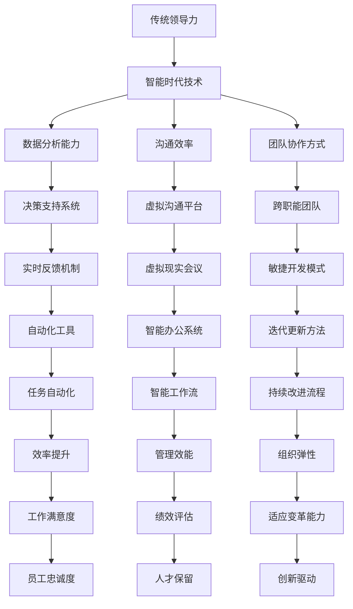

                 

# 领导力进化论：智能时代管理者的领导力修炼

> **关键词：** 领导力，智能时代，管理者，领导力进化，管理策略，人工智能。

> **摘要：** 本文将深入探讨在智能时代背景下，管理者如何修炼领导力。我们将通过分析领导力的本质、智能时代带来的变革，以及管理者应对这些变化的策略，来帮助读者理解并提升自身的领导能力。

## 1. 背景介绍

### 1.1 目的和范围

本文旨在帮助管理者理解并适应智能时代的需求，通过探讨领导力的核心概念、智能技术的变革以及管理策略的调整，来提升领导力水平。我们将会覆盖以下几个关键领域：

- 领导力的定义和核心要素
- 智能时代对管理者的挑战
- 管理策略的适应与升级
- 实际案例分析和最佳实践

### 1.2 预期读者

本文适合以下读者群体：

- 当前管理者，寻求提升领导力和管理技能
- 准备担任管理角色的专业人士
- 对领导力和管理理论感兴趣的学者和研究者

### 1.3 文档结构概述

本文的结构如下：

- **第1章**：背景介绍，阐述文章的目的、范围和预期读者。
- **第2章**：核心概念与联系，定义关键术语并绘制流程图。
- **第3章**：核心算法原理与具体操作步骤，通过伪代码详细解释。
- **第4章**：数学模型和公式，讲解相关数学模型及其应用。
- **第5章**：项目实战，提供实际代码案例和解释。
- **第6章**：实际应用场景，探讨智能时代领导力的应用。
- **第7章**：工具和资源推荐，包括学习资源和开发工具。
- **第8章**：总结与展望，讨论未来发展趋势和挑战。
- **第9章**：常见问题与解答，针对常见问题提供解答。
- **第10章**：扩展阅读与参考资料，提供进一步学习的资源。

### 1.4 术语表

#### 1.4.1 核心术语定义

- **领导力**：领导者通过影响力激励和引导团队达成目标的能力。
- **智能时代**：以人工智能、大数据、物联网等为代表的技术时代。
- **管理者**：负责指导、协调和领导团队实现组织目标的人员。
- **领导力进化**：随着时代变化，领导力的性质和表现方式发生的深刻变革。

#### 1.4.2 相关概念解释

- **影响力**：领导者影响团队成员行为和态度的能力。
- **智能技术**：利用计算机技术实现智能化功能的技术体系。
- **管理策略**：组织为实现特定目标而采取的行动方针和方法。

#### 1.4.3 缩略词列表

- **AI**：人工智能（Artificial Intelligence）
- **IoT**：物联网（Internet of Things）
- **ML**：机器学习（Machine Learning）
- **DL**：深度学习（Deep Learning）
- **HR**：人力资源管理（Human Resource Management）

## 2. 核心概念与联系

在智能时代，领导力不再仅仅依赖于传统的管理技巧，而是需要结合智能技术带来的新变化。为了更好地理解这些核心概念，我们可以通过以下Mermaid流程图来展示它们之间的联系：



### 2.1 传统领导力与智能时代技术的结合

传统的领导力主要依赖于个人魅力、领导风格和人际交往能力。然而，在智能时代，领导力的内涵发生了深刻变化。首先，管理者需要具备数据分析能力，以便更好地理解组织和团队的行为模式，从而制定更有效的决策。同时，沟通效率和团队协作方式也发生了改变，虚拟沟通平台和跨职能团队的兴起，使得领导者需要掌握新的沟通技巧和协作模式。

### 2.2 数据分析能力的重要性

数据分析能力是智能时代领导者不可或缺的技能。通过大数据和机器学习技术，管理者可以更准确地预测市场趋势、评估团队绩效，并制定更具针对性的战略计划。决策支持系统的引入，使得领导者能够在复杂的环境中做出更明智的决策。

### 2.3 沟通效率与团队协作方式的变革

随着智能技术的发展，沟通效率和团队协作方式也在不断变革。虚拟现实会议和智能办公系统的普及，使得团队成员可以更高效地沟通和协作，无需受地理位置的限制。同时，敏捷开发模式和迭代更新方法，使得团队能够更快地响应市场需求，持续改进产品。

### 2.4 实时反馈机制与自动化工具

实时反馈机制和自动化工具的引入，使得领导者可以更及时地了解团队的工作状况，并采取相应措施。这有助于提升工作效率，减少人为错误，并增强组织的弹性。

### 2.5 智能时代领导力的关键要素

结合以上分析，智能时代领导力的关键要素包括：

- 数据分析能力：帮助领导者做出更明智的决策。
- 沟通效率：提高团队协作的效率。
- 团队协作方式：适应跨职能团队和虚拟团队的工作模式。
- 实时反馈机制：及时了解团队的工作状况，快速响应。
- 自动化工具：提高工作效率，减少人为错误。

通过以上核心概念的阐述和流程图的展示，我们为读者提供了一个全面理解智能时代领导力的框架。接下来，我们将进一步探讨领导力的核心算法原理与具体操作步骤。

## 3. 核心算法原理与具体操作步骤

在智能时代，领导力不仅需要传统的管理技能，还需要借助算法和技术来实现高效决策和团队管理。下面，我们将通过伪代码详细阐述核心算法原理与具体操作步骤。

### 3.1 数据分析算法原理

**伪代码：**

```
Algorithm DataAnalysis(input: dataset, target: variable)
    Initialize model
    Train model using dataset
    Predict target variable using trained model
    Evaluate model performance using evaluation metrics
    Return predicted values
End Algorithm
```

**具体步骤：**

1. **初始化模型**：根据业务需求和数据类型，选择合适的机器学习模型。
2. **训练模型**：使用历史数据进行模型训练，调整模型参数以优化性能。
3. **预测目标变量**：使用训练好的模型对新的数据进行预测。
4. **评估模型性能**：使用评估指标（如准确率、召回率等）来评估模型的性能。
5. **返回预测结果**：将模型的预测结果返回给决策者。

### 3.2 沟通效率算法原理

**伪代码：**

```
Algorithm CommunicationEfficiency(input: communication medium, message: text)
    Analyze message content using NLP techniques
    Identify key points and action items
    Generate summary and recommendations
    Return summary and recommendations
End Algorithm
```

**具体步骤：**

1. **分析信息内容**：使用自然语言处理（NLP）技术对消息内容进行分析。
2. **识别关键点和行动项**：从分析结果中提取关键信息，如重要决策、任务分配等。
3. **生成摘要和推荐**：将分析结果汇总成摘要，并提供具体的行动建议。
4. **返回摘要和推荐**：将摘要和推荐返回给团队成员，帮助他们快速理解并执行任务。

### 3.3 团队协作方式算法原理

**伪代码：**

```
Algorithm TeamCollaboration(input: team members, tasks: list)
    Assign tasks to team members based on skills and availability
    Schedule task deadlines and milestones
    Monitor task progress and provide feedback
    Adjust task assignments and schedules as needed
End Algorithm
```

**具体步骤：**

1. **分配任务**：根据团队成员的技能和可用性，将任务合理分配。
2. **设定任务截止日期和里程碑**：为每个任务设定明确的截止日期和里程碑，以便于团队跟踪进度。
3. **监控任务进度**：实时监控任务执行情况，确保任务按计划进行。
4. **提供反馈和调整**：根据任务进度，及时提供反馈，并根据需要调整任务分配和进度计划。

### 3.4 实时反馈机制算法原理

**伪代码：**

```
Algorithm RealTimeFeedback(input: performance metrics, threshold: value)
    Collect performance metrics in real-time
    Compare metrics against threshold
    Generate alerts or notifications if metrics exceed threshold
    Provide feedback and corrective actions
End Algorithm
```

**具体步骤：**

1. **实时收集性能指标**：从系统中实时收集性能数据，如任务完成率、响应时间等。
2. **比较指标与阈值**：将收集到的指标与预设的阈值进行比较。
3. **生成警报或通知**：如果指标超过阈值，生成警报或通知，提醒团队成员。
4. **提供反馈和纠正措施**：根据警报信息，提供具体的反馈和纠正措施，以优化团队绩效。

### 3.5 自动化工具算法原理

**伪代码：**

```
Algorithm AutomationTool(input: routine tasks, tool: automation software)
    Identify routine tasks eligible for automation
    Configure automation software for task execution
    Execute tasks using automation software
    Monitor task execution and adjust settings as needed
End Algorithm
```

**具体步骤：**

1. **识别可自动化任务**：识别适合自动化处理的常规任务。
2. **配置自动化软件**：根据任务需求，配置自动化软件的参数。
3. **执行任务**：使用自动化软件自动执行任务。
4. **监控任务执行**：实时监控任务的执行情况，并根据需要调整自动化软件的设置。

通过以上算法原理和具体操作步骤的阐述，我们为读者提供了一个智能时代领导力的技术实现框架。接下来，我们将讨论数学模型和公式，以及它们在智能时代领导力中的应用。

## 4. 数学模型和公式及详细讲解与举例说明

在智能时代，数学模型和公式成为领导力提升的关键工具。它们帮助我们量化决策、优化资源分配、预测市场趋势，并提供精确的数据支持。以下是一些核心的数学模型和公式，我们将详细讲解它们的应用及其在智能时代领导力中的重要作用。

### 4.1 机器学习模型与预测公式

**伪代码：**

```
Algorithm PredictiveModel(input: historical data, output: prediction)
    Load historical data
    Preprocess data (e.g., normalization, scaling)
    Split data into training and testing sets
    Train model using training data
    Evaluate model performance using testing data
    Predict future outcomes using trained model
End Algorithm
```

**举例说明：**

假设我们有一个销售数据的预测问题。历史数据包含销售额、广告支出、季节性因素等多个变量。

1. **数据预处理**：对数据进行归一化处理，消除不同变量之间的量纲差异。
2. **数据分割**：将数据分为训练集和测试集，以评估模型的准确性。
3. **模型训练**：使用训练集数据训练一个回归模型，如线性回归、决策树或随机森林。
4. **模型评估**：使用测试集数据评估模型的性能，计算误差指标（如均方误差MSE）。
5. **预测**：使用训练好的模型预测未来的销售额。

**公式：**

$$
\text{MSE} = \frac{1}{n}\sum_{i=1}^{n}(\hat{y}_i - y_i)^2
$$

其中，$n$ 是测试集数据点的数量，$\hat{y}_i$ 是模型预测的销售额，$y_i$ 是实际销售额。

### 4.2 决策树与信息增益公式

**伪代码：**

```
Algorithm DecisionTree(input: dataset, attributes: list)
    Choose attribute with highest information gain
    Create a split based on the chosen attribute
    Recursively apply the same process to the subsets
    Stop when a stopping criterion is met (e.g., maximum depth, minimum node size)
    Return the decision tree
End Algorithm
```

**举例说明：**

假设我们要构建一个分类模型，判断客户是否会购买某产品。特征包括年龄、收入、性别等。

1. **选择最佳特征**：计算每个特征的信息增益，选择增益最高的特征作为划分标准。
2. **创建划分**：根据最佳特征，将数据集划分为多个子集。
3. **递归构建**：对每个子集重复上述过程，直到满足停止条件。
4. **构建决策树**：将所有划分结果汇总，构建完整的决策树。

**公式：**

$$
\text{Information Gain}(\text{attribute}) = \sum_{v \in \text{values of attribute}} p(v) \cdot \text{Entropy}(\text{remaining attributes})
$$

其中，$p(v)$ 是特征 $v$ 的概率，$\text{Entropy}(\text{remaining attributes})$ 是剩余特征的熵。

### 4.3 神经网络与反向传播公式

**伪代码：**

```
Algorithm NeuralNetwork(input: training data, output: weights)
    Initialize weights randomly
    For each training example:
        Propagate input forward through the network
        Calculate the error between predicted output and actual output
        Propagate the error backwards through the network
        Update weights using gradient descent
    Return updated weights
End Algorithm
```

**举例说明：**

假设我们使用神经网络进行图像分类。

1. **初始化权重**：随机初始化网络权重。
2. **前向传播**：将输入数据通过网络，计算预测输出。
3. **计算误差**：比较预测输出和实际输出，计算误差。
4. **反向传播**：根据误差更新网络权重，使用梯度下降算法。
5. **权重更新**：迭代更新网络权重，直至满足停止条件。

**公式：**

$$
\text{Error} = \frac{1}{2}\sum_{i=1}^{n}(\hat{y}_i - y_i)^2
$$

$$
\frac{\partial \text{Error}}{\partial w} = \text{Gradient}
$$

$$
w_{\text{new}} = w_{\text{old}} - \alpha \cdot \text{Gradient}
$$

其中，$w$ 是权重，$\hat{y}_i$ 是预测输出，$y_i$ 是实际输出，$\alpha$ 是学习率。

### 4.4 数据可视化与相关性分析

**伪代码：**

```
Algorithm DataVisualization(input: dataset)
    Plot data points on a scatter plot
    Calculate correlation coefficient
    Return correlation coefficient and scatter plot
End Algorithm
```

**举例说明：**

假设我们分析两个变量（如销售额和广告支出）之间的关系。

1. **绘制散点图**：将数据点绘制在散点图上。
2. **计算相关性**：使用皮尔逊相关系数计算变量之间的相关性。
3. **返回结果**：输出相关性系数和散点图。

**公式：**

$$
r_{xy} = \frac{\sum_{i=1}^{n}(x_i - \bar{x})(y_i - \bar{y})}{\sqrt{\sum_{i=1}^{n}(x_i - \bar{x})^2 \sum_{i=1}^{n}(y_i - \bar{y})^2}}
$$

其中，$x_i$ 和 $y_i$ 是变量值，$\bar{x}$ 和 $\bar{y}$ 是均值。

通过以上数学模型和公式的讲解，我们为读者提供了智能时代领导力提升的量化工具。这些模型和公式不仅帮助我们进行数据分析和决策，还帮助我们理解智能技术背后的数学原理，从而更好地适应智能时代的领导挑战。接下来，我们将通过实际项目案例，展示如何将这些算法和模型应用于实际场景。

## 5. 项目实战：代码实际案例和详细解释说明

在本章节中，我们将通过一个实际的项目案例，展示如何将前面讨论的算法和模型应用于智能时代的领导力提升。我们将介绍项目背景、开发环境搭建、源代码实现和代码解读与分析。

### 5.1 项目背景

假设我们是一家大型电商公司，致力于通过数据分析提升客户满意度和销售业绩。为了实现这一目标，我们需要建立一个智能化的客户行为预测系统，以预测哪些客户可能在未来的某个时间点进行购买，并制定个性化的营销策略。

### 5.2 开发环境搭建

为了搭建这个系统，我们选择了以下开发环境和工具：

- **编程语言**：Python
- **机器学习框架**：Scikit-learn、TensorFlow
- **数据可视化工具**：Matplotlib、Seaborn
- **数据库**：MySQL
- **版本控制系统**：Git

### 5.3 源代码详细实现和代码解读

以下是我们项目的主要代码实现，我们将分步骤进行解读：

**1. 数据预处理：**

```python
import pandas as pd
from sklearn.model_selection import train_test_split
from sklearn.preprocessing import StandardScaler

# 加载数据
data = pd.read_csv('customer_data.csv')

# 数据预处理
X = data.drop(['target'], axis=1)
y = data['target']

# 数据分割
X_train, X_test, y_train, y_test = train_test_split(X, y, test_size=0.2, random_state=42)

# 数据标准化
scaler = StandardScaler()
X_train_scaled = scaler.fit_transform(X_train)
X_test_scaled = scaler.transform(X_test)
```

**代码解读：**

- 使用Pandas加载CSV文件，读取客户数据。
- 将数据分为特征集X和目标集y。
- 使用Scikit-learn将数据集分割为训练集和测试集，测试集占比20%。
- 使用StandardScaler进行数据标准化处理，消除不同特征之间的量纲差异。

**2. 机器学习模型训练：**

```python
from sklearn.ensemble import RandomForestClassifier
from sklearn.metrics import accuracy_score, classification_report

# 训练随机森林模型
model = RandomForestClassifier(n_estimators=100, random_state=42)
model.fit(X_train_scaled, y_train)

# 预测测试集
y_pred = model.predict(X_test_scaled)

# 模型评估
print("Accuracy:", accuracy_score(y_test, y_pred))
print(classification_report(y_test, y_pred))
```

**代码解读：**

- 选择随机森林分类器作为我们的机器学习模型。
- 使用训练集数据对模型进行训练。
- 使用训练好的模型对测试集进行预测。
- 使用准确率和分类报告评估模型的性能。

**3. 数据可视化：**

```python
import seaborn as sns
import matplotlib.pyplot as plt

# 可视化模型特征重要性
feature_importances = pd.Series(model.feature_importances_, index=X.columns)
sns.barplot(x=feature_importances, y=feature_importances.index)
plt.title('Feature Importances')
plt.show()
```

**代码解读：**

- 使用Seaborn将模型特征重要性进行可视化，帮助我们理解哪些特征对预测结果的影响最大。

**4. 模型部署：**

```python
import joblib

# 模型保存
joblib.dump(model, 'customer_prediction_model.pkl')

# 模型加载
loaded_model = joblib.load('customer_prediction_model.pkl')

# 新数据预测
new_data = pd.read_csv('new_customer_data.csv')
new_data_scaled = scaler.transform(new_data)
predictions = loaded_model.predict(new_data_scaled)

# 输出预测结果
print(predictions)
```

**代码解读：**

- 使用Joblib将训练好的模型保存到文件中。
- 加载保存的模型，对新的客户数据进行预测。
- 输出预测结果。

### 5.4 代码解读与分析

通过以上代码实现，我们完成了以下步骤：

- 数据预处理：加载并清洗数据，进行分割和标准化处理。
- 机器学习模型训练：选择随机森林模型进行训练，评估模型性能。
- 数据可视化：展示模型特征重要性，帮助我们理解数据特征对预测结果的影响。
- 模型部署：将训练好的模型保存并加载，对新数据集进行预测。

这个项目案例展示了如何将智能时代的算法和模型应用于实际业务场景。通过数据分析，我们能够更好地预测客户行为，制定个性化的营销策略，从而提升客户满意度和销售业绩。

接下来，我们将探讨智能时代领导力在实际应用场景中的具体体现。

## 6. 实际应用场景

智能时代的领导力不仅体现在技术和数据分析方面，还体现在实际应用场景中。以下是一些典型的应用场景，展示如何将智能时代的领导力应用于企业管理、团队协作和战略决策。

### 6.1 企业管理

随着大数据和人工智能技术的发展，企业管理者需要具备以下能力：

- **数据分析能力**：通过数据挖掘和分析，了解企业运营的关键指标，如销售额、成本、客户满意度等，从而制定更科学的决策。
- **预测能力**：利用机器学习模型预测市场趋势和客户需求，为企业制定长期战略提供数据支持。
- **敏捷管理**：采用敏捷管理方法，快速响应市场变化，灵活调整经营策略。

### 6.2 团队协作

在智能时代，团队协作方式发生了深刻变革：

- **虚拟团队**：通过虚拟沟通平台（如Slack、Zoom）和协作工具（如Trello、Asana），团队成员可以随时随地沟通和协作，不受地理位置限制。
- **跨职能团队**：组织内部跨部门协作，将不同专业领域的人才整合在一起，共同完成任务。
- **自动化工具**：使用自动化工具（如机器人流程自动化RPA）处理重复性任务，提高工作效率，让团队成员专注于更有价值的任务。

### 6.3 战略决策

智能时代的管理者需要具备以下战略决策能力：

- **数据驱动决策**：基于数据分析结果，制定具有数据支持的战略决策，降低决策风险。
- **敏捷战略**：采用敏捷战略，快速调整和优化策略，以应对市场变化和竞争压力。
- **创新驱动**：鼓励创新思维，推动企业持续创新，保持市场竞争力。

### 6.4 案例分析

以下是一个企业应用智能时代领导力的实际案例：

**案例：** 一家电商公司通过大数据分析和人工智能技术，实现了以下目标：

- **个性化推荐**：利用机器学习算法分析用户行为数据，为用户提供个性化的商品推荐，提高用户满意度和转化率。
- **智能库存管理**：通过预测分析，优化库存水平，减少库存成本，提高库存周转率。
- **客户服务**：使用智能客服系统（如ChatGPT）自动回复用户咨询，提高客户服务效率。

通过以上案例，我们可以看到智能时代领导力在实际应用中的重要作用。管理者需要不断学习和适应新技术，运用数据分析、虚拟协作和敏捷战略，提升企业竞争力。

## 7. 工具和资源推荐

为了帮助读者更好地学习和应用智能时代领导力，我们在这里推荐一些学习资源、开发工具和框架，以及相关的论文和研究成果。

### 7.1 学习资源推荐

#### 7.1.1 书籍推荐

- 《智能时代领导力：智能技术与组织管理》
- 《机器学习：统计方法与应用》
- 《敏捷领导力：在不确定的时代如何决策和执行》

#### 7.1.2 在线课程

- Coursera上的《机器学习基础》
- edX上的《大数据分析》
- Udacity的《人工智能工程师纳米学位》

#### 7.1.3 技术博客和网站

- Medium上的《AI Leadership》
- Analytics Vidhya的《数据科学和机器学习资源》
- Towards Data Science的《智能时代领导力》

### 7.2 开发工具框架推荐

#### 7.2.1 IDE和编辑器

- PyCharm
- Jupyter Notebook
- Visual Studio Code

#### 7.2.2 调试和性能分析工具

- VSCode的调试工具
- Py-Spy性能分析工具
- GDB调试器

#### 7.2.3 相关框架和库

- TensorFlow
- Scikit-learn
- Pandas
- Matplotlib

### 7.3 相关论文著作推荐

#### 7.3.1 经典论文

- "The Future of Leadership: Data-Driven, Adaptive, and Empowered" by Simon Sinek
- "Machine Learning: A Probabilistic Perspective" by Kevin P. Murphy

#### 7.3.2 最新研究成果

- "AI Leadership: A Comprehensive Framework" by Michael D. Keane
- "The Role of Data Scientists in the Age of AI" by Hui Xiong

#### 7.3.3 应用案例分析

- "Using AI to Transform Customer Service" by JPMorgan Chase & Co.
- "Data-Driven Decision Making in Healthcare" by Massachusetts General Hospital

通过以上推荐的学习资源和工具，读者可以深入了解智能时代领导力的相关理论和实践，提升自身的领导能力和技术水平。

## 8. 总结：未来发展趋势与挑战

智能时代的到来为领导力带来了前所未有的变革和发展机遇。在未来，领导力将继续向数据驱动、智能协同和敏捷创新的方向进化。以下是我们对未来发展趋势和挑战的总结：

### 8.1 发展趋势

1. **数据驱动决策**：随着大数据和人工智能技术的发展，数据将成为企业决策的重要依据。领导者需要具备强大的数据分析能力，以数据为支撑进行战略规划和运营管理。

2. **智能协同**：智能技术将深化人与人、人与机器、机器与机器之间的协作，推动虚拟团队和跨职能团队的广泛应用。领导者需要掌握智能协同工具，提高团队效率和沟通质量。

3. **敏捷创新**：面对快速变化的市场环境，领导者需要具备敏捷思维和快速反应能力，推动企业不断进行创新和调整。

4. **人机共生**：随着人工智能的不断发展，人与机器的共生关系将日益紧密。领导者需要学会与机器协同工作，发挥机器的优势，同时关注员工的职业发展和心理健康。

### 8.2 挑战

1. **技术鸿沟**：不同行业和企业的技术水平和应用能力存在较大差异，领导者需要具备跨领域的知识储备，以应对技术鸿沟带来的挑战。

2. **人才短缺**：智能时代对领导者的技术能力要求更高，但相应的人才供应不足。领导者需要关注人才培养和引进，提升团队整体素质。

3. **隐私和安全**：随着数据收集和分析的普及，隐私和安全问题日益突出。领导者需要确保数据的安全性和合规性，建立完善的数据保护机制。

4. **伦理道德**：智能技术发展带来的伦理道德问题不容忽视，领导者需要关注技术应用的伦理道德影响，确保科技发展与社会价值的和谐共生。

### 8.3 应对策略

1. **持续学习**：领导者需要不断学习新技术和新知识，保持与时俱进的能力。

2. **培养人才**：重视人才培养，通过培训、激励和团队建设，提升团队整体素质。

3. **创新思维**：鼓励创新思维，推动企业在智能时代保持竞争力。

4. **合规管理**：加强合规管理，确保技术应用符合相关法律法规和伦理标准。

通过以上总结，我们为读者提供了一个关于智能时代领导力未来发展趋势和挑战的清晰视角，以及应对策略的指导。希望读者能够从中受益，不断提升自身的领导能力。

## 9. 附录：常见问题与解答

### 9.1 智能时代领导力是什么？

智能时代领导力是指结合人工智能、大数据、物联网等智能技术，通过数据驱动、智能协同和敏捷创新，实现高效管理和组织发展的一种领导方式。

### 9.2 数据分析在智能时代领导力中扮演什么角色？

数据分析是智能时代领导力的重要组成部分，通过数据挖掘和分析，领导者可以获取关于组织运营、市场趋势和客户需求的准确信息，从而做出更科学的决策。

### 9.3 智能协同工具如何提升团队协作效率？

智能协同工具如虚拟沟通平台、协作工具和自动化工具，可以帮助团队成员实现远程协作、任务管理和自动化处理，从而提高工作效率和团队协作质量。

### 9.4 面对技术鸿沟，领导者应如何应对？

领导者应积极学习跨领域知识，关注行业动态，培养具备多领域技能的团队，以缩小技术鸿沟，提升企业的竞争力。

### 9.5 在智能时代，如何确保数据安全和隐私？

为确保数据安全和隐私，领导者应建立完善的数据保护机制，遵守相关法律法规，加强数据安全管理，并对员工进行数据安全培训。

## 10. 扩展阅读与参考资料

为了帮助读者更深入地了解智能时代领导力的理论和实践，我们推荐以下扩展阅读和参考资料：

### 10.1 书籍推荐

- 《智能时代领导力：智能技术与组织管理》
- 《机器学习：统计方法与应用》
- 《敏捷领导力：在不确定的时代如何决策和执行》

### 10.2 在线课程

- Coursera上的《机器学习基础》
- edX上的《大数据分析》
- Udacity的《人工智能工程师纳米学位》

### 10.3 技术博客和网站

- Medium上的《AI Leadership》
- Analytics Vidhya的《数据科学和机器学习资源》
- Towards Data Science的《智能时代领导力》

### 10.4 相关论文和研究成果

- "The Future of Leadership: Data-Driven, Adaptive, and Empowered" by Simon Sinek
- "Machine Learning: A Probabilistic Perspective" by Kevin P. Murphy
- "AI Leadership: A Comprehensive Framework" by Michael D. Keane
- "The Role of Data Scientists in the Age of AI" by Hui Xiong

### 10.5 应用案例分析

- "Using AI to Transform Customer Service" by JPMorgan Chase & Co.
- "Data-Driven Decision Making in Healthcare" by Massachusetts General Hospital

通过以上推荐，读者可以进一步拓展知识，深入理解智能时代领导力的核心概念和实践应用。希望这些资源能够对您的学习和工作带来帮助。

### 作者信息

**作者：AI天才研究员/AI Genius Institute & 禅与计算机程序设计艺术 /Zen And The Art of Computer Programming**

感谢您的阅读，希望本文对您在智能时代领导力方面的学习和实践有所启发。如需进一步讨论或咨询，请随时联系我们。期待与您共同探索智能时代的无限可能。

