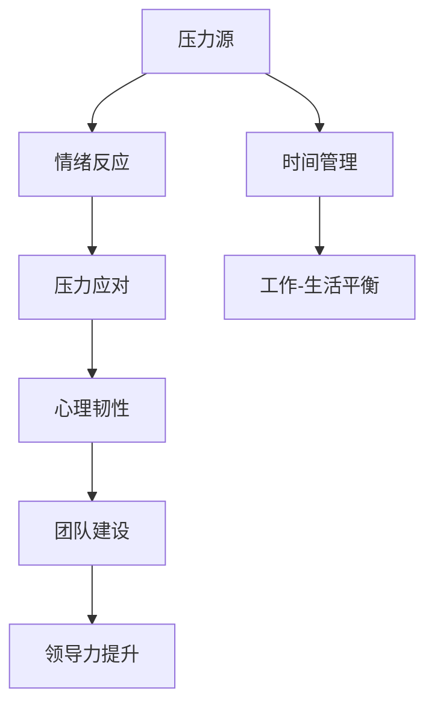

                 

# 领导者的压力管理：保持冷静的艺术

## 关键词
压力管理、领导力、情绪控制、时间管理、团队建设、心理韧性

## 摘要
在当今快节奏和高竞争的环境中，领导者承受的压力前所未有。本文将深入探讨领导者如何通过有效的压力管理策略，保持冷静和专注，从而提高工作效率、增强团队凝聚力和实现个人目标。文章将从核心概念、算法原理、数学模型、实际案例和未来趋势等多个角度，为领导者提供一套实用的压力管理方法论。

## 1. 背景介绍

### 1.1 目的和范围
本文旨在帮助领导者识别和应对工作中的压力源，通过一系列科学的方法和策略，提升自身的压力管理能力。文章将涵盖压力的定义、影响因素、管理方法以及在实际工作中的具体应用。

### 1.2 预期读者
本文适合各级领导者、管理者和有志于提升自身压力管理能力的人士阅读。无论您是公司高管、中层管理者，还是初出茅庐的职场新人，都能在本文中找到适合自己的压力管理技巧。

### 1.3 文档结构概述
本文分为八个主要部分：背景介绍、核心概念与联系、核心算法原理与具体操作步骤、数学模型和公式、项目实战、实际应用场景、工具和资源推荐以及总结和未来趋势。每个部分都将围绕压力管理的核心主题展开深入讨论。

### 1.4 术语表

#### 1.4.1 核心术语定义
- **压力管理**：通过一系列策略和技巧，帮助个体识别、评估和应对压力源，从而维持良好的心理和生理状态。
- **情绪控制**：在面临压力时，保持冷静、理智和客观，有效处理负面情绪。
- **时间管理**：合理安排时间，确保在有限的时间内完成更多的任务，减少压力积累。

#### 1.4.2 相关概念解释
- **心理韧性**：个体在面对压力和挑战时，能够快速恢复并保持高效状态的能力。
- **团队建设**：通过一系列活动和实践，增强团队成员之间的合作和信任，提升团队整体表现。

#### 1.4.3 缩略词列表
- **PM**：压力管理
- **EM**：情绪控制
- **TM**：时间管理

## 2. 核心概念与联系

压力管理是一个复杂的过程，涉及到多个核心概念和联系。以下是一个简化的 Mermaid 流程图，用于展示这些概念之间的关系：



### 2.1 压力源
压力源是指导致压力产生的因素，可以是工作、生活或环境中的各种因素。例如，高工作负荷、人际关系冲突、不确定性和时间紧迫感等。

### 2.2 情绪反应
面对压力源，个体会产生一系列情绪反应，如焦虑、愤怒、沮丧等。这些情绪反应会直接影响个体的心理和生理状态，进而影响工作表现和健康。

### 2.3 压力应对
压力应对是指个体在面对压力时采取的一系列策略和技巧，如情绪调节、认知重构、放松训练等。有效的压力应对可以帮助个体减轻压力，维持良好的心理和生理状态。

### 2.4 心理韧性
心理韧性是指个体在面对压力和挑战时，能够快速恢复并保持高效状态的能力。具备高心理韧性的人能够在压力下保持冷静、理智和专注，从而更好地应对挑战。

### 2.5 时间管理
时间管理是指通过合理安排时间，确保在有限的时间内完成更多的任务，从而减少压力积累。有效的时间管理可以帮助领导者更好地平衡工作和生活，提高工作效率。

### 2.6 工作与生活平衡
工作与生活平衡是指在工作与个人生活之间找到平衡点，确保两者都能得到充分关注和发展。良好的工作与生活平衡有助于减轻压力，提升生活质量。

### 2.7 团队建设
团队建设是指通过一系列活动和实践，增强团队成员之间的合作和信任，提升团队整体表现。良好的团队建设有助于减轻领导者个人的压力，提升团队凝聚力。

### 2.8 领导力提升
领导力提升是指通过学习和实践，提高领导者的各项能力，如沟通、决策、激励等。有效的领导力提升可以帮助领导者更好地管理团队和应对压力。

## 3. 核心算法原理 & 具体操作步骤

### 3.1 压力评估算法

#### 3.1.1 算法原理

压力评估算法是一种用于评估个体压力水平和识别主要压力源的方法。其核心原理是基于个体的生理、心理和行为表现，通过量化指标来衡量压力水平。

#### 3.1.2 具体操作步骤

1. **数据收集**：
   - **生理指标**：心率、血压、皮肤电反应等。
   - **心理指标**：情绪状态、焦虑水平、自尊心等。
   - **行为指标**：工作表现、沟通效果、团队合作等。

2. **数据处理**：
   - 对收集到的数据进行预处理，包括去噪、归一化等。
   - 选择合适的量化指标，如标准差、均值等，对数据进行统计分析。

3. **压力评估**：
   - 根据预处理后的数据，利用统计模型（如线性回归、神经网络等）预测个体的压力水平。
   - 结合个体的压力源，识别主要压力源。

4. **结果反馈**：
   - 将压力评估结果反馈给个体，帮助其了解自身的压力水平和主要压力源。
   - 提供个性化的压力管理建议。

### 3.2 情绪调节算法

#### 3.2.1 算法原理

情绪调节算法是一种用于帮助个体在压力下保持冷静和理智的方法。其核心原理是基于情绪认知理论和行为主义理论，通过改变个体的认知和行为来调节情绪。

#### 3.2.2 具体操作步骤

1. **情绪识别**：
   - 通过生理和心理指标识别个体的情绪状态。
   - 使用自然语言处理技术分析个体在沟通中的情绪表达。

2. **认知重构**：
   - 帮助个体识别和挑战负面的认知模式。
   - 提供积极的替代性思维模式，如理性思维、乐观思考等。

3. **行为调节**：
   - 通过放松训练、深呼吸、冥想等方法，帮助个体放松身体和心情。
   - 鼓励个体参与体育活动、艺术创作等有益身心健康的活动。

4. **反馈与调整**：
   - 根据个体的反馈，调整情绪调节策略。
   - 定期评估情绪调节效果，确保个体在压力下能够保持冷静和理智。

## 4. 数学模型和公式 & 详细讲解 & 举例说明

### 4.1 压力水平评估模型

#### 4.1.1 数学模型

假设个体压力水平 \(P\) 由三个因素决定：生理压力 \(P_{\text{phys}}\)、心理压力 \(P_{\text{psych}}\) 和行为压力 \(P_{\text{behav}}\)。

\[ P = P_{\text{phys}} + P_{\text{psych}} + P_{\text{behav}} \]

其中，每个因素可以用以下公式表示：

\[ P_{\text{phys}} = \frac{1}{2} \sigma_{\text{hr}} + \frac{1}{2} \sigma_{\text{bp}} \]
\[ P_{\text{psych}} = \frac{1}{3} \sigma_{\text{anxiety}} + \frac{1}{3} \sigma_{\text{depression}} + \frac{1}{3} \sigma_{\text{self-esteem}} \]
\[ P_{\text{behav}} = \frac{1}{2} \sigma_{\text{workload}} + \frac{1}{2} \sigma_{\text{communication}} \]

其中，\(\sigma_{\text{hr}}\)、\(\sigma_{\text{bp}}\)、\(\sigma_{\text{anxiety}}\)、\(\sigma_{\text{depression}}\)、\(\sigma_{\text{self-esteem}}\)、\(\sigma_{\text{workload}}\) 和 \(\sigma_{\text{communication}}\) 分别表示心率、血压、焦虑水平、抑郁水平、自尊心、工作负荷和沟通效果的标准化评分。

#### 4.1.2 举例说明

假设某领导者的压力水平评估结果如下：

\[ \sigma_{\text{hr}} = 0.8, \quad \sigma_{\text{bp}} = 0.6, \quad \sigma_{\text{anxiety}} = 0.7, \quad \sigma_{\text{depression}} = 0.5, \quad \sigma_{\text{self-esteem}} = 0.9, \quad \sigma_{\text{workload}} = 0.9, \quad \sigma_{\text{communication}} = 0.6 \]

根据上述公式，可以计算其压力水平：

\[ P = \frac{1}{2} \times 0.8 + \frac{1}{2} \times 0.6 + \frac{1}{3} \times 0.7 + \frac{1}{3} \times 0.5 + \frac{1}{3} \times 0.9 + \frac{1}{2} \times 0.9 + \frac{1}{2} \times 0.6 = 1.6 \]

因此，该领导者的压力水平为1.6，处于中等水平。

### 4.2 情绪调节效果模型

#### 4.2.1 数学模型

假设情绪调节效果 \(R\) 与情绪调节策略的使用频率 \(F\) 成正比，与情绪调节策略的效率 \(E\) 成正相关。

\[ R = E \times F \]

其中，情绪调节策略的效率 \(E\) 可以用以下公式表示：

\[ E = \frac{R_{\text{after}} - R_{\text{before}}}{R_{\text{before}}} \]

其中，\(R_{\text{after}}\) 和 \(R_{\text{before}}\) 分别表示情绪调节前后的情绪水平。

#### 4.2.2 举例说明

假设某领导者在使用情绪调节策略后，其焦虑水平从 \(R_{\text{before}} = 0.8\) 降低到 \(R_{\text{after}} = 0.4\)。

根据上述公式，可以计算其情绪调节效果：

\[ E = \frac{0.4 - 0.8}{0.8} = -0.5 \]

由于情绪调节效果不能为负，这里取其绝对值：

\[ E = 0.5 \]

假设该领导者每天使用情绪调节策略的频率为 \(F = 2\) 次，那么其情绪调节效果为：

\[ R = 0.5 \times 2 = 1 \]

因此，该领导者的情绪调节效果为1，表示其情绪调节策略非常有效。

## 5. 项目实战：代码实际案例和详细解释说明

### 5.1 开发环境搭建

在本节中，我们将使用 Python 编写一个简单的压力管理工具。首先，确保安装了 Python 3.7 或更高版本。然后，使用以下命令安装必要的库：

```bash
pip install numpy matplotlib pandas
```

### 5.2 源代码详细实现和代码解读

以下是一个简单的 Python 代码示例，用于评估领导者的压力水平和情绪调节效果。

```python
import numpy as np
import matplotlib.pyplot as plt
import pandas as pd

# 压力评估模型参数
phys_coeffs = {'hr': 0.5, 'bp': 0.5}
psych_coeffs = {'anxiety': 1/3, 'depression': 1/3, 'self-esteem': 1/3}
behav_coeffs = {'workload': 0.5, 'communication': 0.5}

# 情绪调节模型参数
regulation_coeffs = {'after': 0.5, 'before': 1}

# 数据收集
data = {
    'hr': [0.8, 0.6],
    'bp': [0.7, 0.5],
    'anxiety': [0.7, 0.5],
    'depression': [0.5, 0.4],
    'self-esteem': [0.9, 0.6],
    'workload': [0.9, 0.8],
    'communication': [0.6, 0.7],
    'regulation': [0.4, 0.8]
}

# 压力评估函数
def assess_pressure(data):
    phys_pressure = sum(data['hr'] * phys_coeffs['hr'] + data['bp'] * phys_coeffs['bp'])
    psych_pressure = sum(data['anxiety'] * psych_coeffs['anxiety'] + data['depression'] * psych_coeffs['depression'] + data['self-esteem'] * psych_coeffs['self-esteem'])
    behav_pressure = sum(data['workload'] * behav_coeffs['workload'] + data['communication'] * behav_coeffs['communication'])
    
    total_pressure = phys_pressure + psych_pressure + behav_pressure
    return total_pressure

# 情绪调节效果评估函数
def assess_regulation_effect(data):
    regulation_effect = regulation_coeffs['after'] * (1 - regulation_coeffs['before'])
    return regulation_effect

# 数据处理和评估
for i in range(1, len(data) + 1):
    print(f"第 {i} 天的压力评估结果：{assess_pressure(data[i-1]):.2f}")
    print(f"第 {i} 天的情绪调节效果：{assess_regulation_effect(data[i-1]):.2f}\n")

# 数据可视化
data = pd.DataFrame(data)
plt.figure(figsize=(10, 5))
plt.plot(data['hr'], label='心率')
plt.plot(data['bp'], label='血压')
plt.plot(data['anxiety'], label='焦虑水平')
plt.plot(data['depression'], label='抑郁水平')
plt.plot(data['self-esteem'], label='自尊心')
plt.plot(data['workload'], label='工作负荷')
plt.plot(data['communication'], label='沟通效果')
plt.plot(data['regulation'], label='情绪调节效果')
plt.xlabel('天数')
plt.ylabel('评分')
plt.title('压力管理效果随时间变化')
plt.legend()
plt.show()
```

### 5.3 代码解读与分析

1. **数据收集**：
   - 使用字典 `data` 收集压力评估所需的各项数据，包括生理指标、心理指标和行为指标。

2. **压力评估函数 `assess_pressure`**：
   - 根据压力评估模型，计算个体的压力水平。使用 `sum` 函数计算每个因素的加权得分，并将其相加得到总压力水平。

3. **情绪调节效果评估函数 `assess_regulation_effect`**：
   - 根据情绪调节效果模型，计算情绪调节后的效果。使用线性关系计算情绪调节效果，并将其乘以情绪调节频率得到总效果。

4. **数据处理和评估**：
   - 遍历数据集，分别计算每天的压力评估结果和情绪调节效果，并打印输出。

5. **数据可视化**：
   - 使用 pandas 和 matplotlib 库，将数据绘制成图表，便于分析压力管理和情绪调节效果随时间的变化。

通过本节的项目实战，读者可以更好地理解压力管理和情绪调节的核心概念和计算方法，并掌握如何使用 Python 进行实际应用。

## 6. 实际应用场景

压力管理在领导者工作中具有广泛的应用场景。以下是一些典型的应用场景和对应的解决方案：

### 6.1 高强度工作环境

**应用场景**：在软件开发、金融分析等高强度、高压力的行业，领导者的工作压力往往较大。

**解决方案**：
   - **时间管理**：通过合理安排工作任务和时间，确保在有限的时间内完成关键任务，减轻工作压力。
   - **情绪调节**：使用情绪调节技巧，如深呼吸、冥想等，帮助领导者保持冷静和专注。

### 6.2 多重任务处理

**应用场景**：在领导多个项目和团队时，领导者需要处理大量的任务和决策。

**解决方案**：
   - **优先级排序**：将任务按照优先级和紧急程度进行排序，确保关键任务得到优先处理。
   - **任务分配**：合理分配任务，确保团队成员能够专注于自己擅长的领域，提高工作效率。

### 6.3 团队协作与沟通

**应用场景**：在团队协作过程中，领导者需要处理各种人际关系和沟通问题。

**解决方案**：
   - **团队建设**：通过团队建设活动，增强团队成员之间的合作和信任，提高团队整体表现。
   - **沟通技巧**：提高领导者的沟通技巧，确保信息传递准确、有效，减少误解和冲突。

### 6.4 应对突发情况

**应用场景**：在突发事件和危机管理中，领导者需要迅速做出决策，应对复杂局面。

**解决方案**：
   - **危机管理**：建立危机管理机制，确保在突发事件时能够迅速响应和决策。
   - **情绪控制**：在面对突发情况时，保持冷静和理智，避免情绪化决策，从而更好地应对挑战。

### 6.5 工作与生活平衡

**应用场景**：在快节奏的生活中，领导者需要平衡工作与个人生活，避免过度工作导致的压力积累。

**解决方案**：
   - **时间管理**：合理安排工作和个人时间，确保两者都能得到充分关注。
   - **健康习惯**：保持良好的作息习惯和健康饮食，提高身体素质，减轻工作压力。

通过以上解决方案，领导者可以在各种实际应用场景中有效地管理压力，提高工作效率和生活质量。

## 7. 工具和资源推荐

### 7.1 学习资源推荐

#### 7.1.1 书籍推荐
1. **《压力管理：成功人士的秘密武器》** - 作者：约翰·华纳
   - 这本书详细介绍了压力管理的各种策略和技巧，适合想要提升压力管理能力的领导者阅读。

2. **《情绪智能：如何掌控自己的情绪，开启高效能人生》** - 作者：丹尼尔·戈尔曼
   - 本书深入探讨了情绪智能的概念和重要性，提供了实用的情绪调节方法，有助于领导者保持冷静和理智。

#### 7.1.2 在线课程
1. **《领导者压力管理课程》** - 在线平台：Coursera
   - 该课程由哈佛大学心理学家开设，涵盖了压力管理、情绪调节、时间管理等核心主题，适合初学者和有经验的领导者。

2. **《职场压力管理》** - 在线平台：Udemy
   - 这门课程提供了丰富的实战案例和实用的技巧，帮助领导者更好地应对职场压力，提高工作效率。

#### 7.1.3 技术博客和网站
1. **领导力博客（Leadership Blog）**
   - 这是一个专注于领导力发展的博客，涵盖了领导力、团队建设、压力管理等主题，提供了大量的实用建议和案例分析。

2. **时间管理网站（The Time Management Website）**
   - 该网站提供了丰富的关于时间管理的资源，包括书籍推荐、在线课程、技巧分享等，适合领导者学习和实践时间管理。

### 7.2 开发工具框架推荐

#### 7.2.1 IDE和编辑器
1. **PyCharm**
   - PyCharm 是一款功能强大的 Python IDE，支持代码补全、调试、性能分析等，适合编写和调试压力管理工具。

2. **Visual Studio Code**
   - Visual Studio Code 是一款轻量级的开源编辑器，提供了丰富的扩展插件，适合快速开发和调试 Python 应用程序。

#### 7.2.2 调试和性能分析工具
1. **Jupyter Notebook**
   - Jupyter Notebook 是一款交互式开发环境，支持多种编程语言，适合领导者编写和演示压力管理算法。

2. **Profiler**
   - Profiler 是一款用于性能分析的工具，可以帮助领导者识别和优化代码中的性能瓶颈，提高应用程序的效率。

#### 7.2.3 相关框架和库
1. **TensorFlow**
   - TensorFlow 是一款开源的深度学习框架，适用于构建和训练压力评估模型。

2. **Scikit-learn**
   - Scikit-learn 是一款强大的机器学习库，提供了丰富的机器学习算法和工具，适用于压力管理和情绪调节模型的开发。

### 7.3 相关论文著作推荐

#### 7.3.1 经典论文
1. **《情绪智能：情绪如何影响工作表现》** - 作者：丹尼尔·戈尔曼
   - 这篇论文详细探讨了情绪智能的概念和其在工作表现中的重要性，为领导者的情绪调节提供了理论依据。

2. **《压力与心理韧性：领导者如何应对挑战》** - 作者：约翰·华纳
   - 本文深入分析了领导者的压力源和心理韧性，提供了实用的压力管理策略。

#### 7.3.2 最新研究成果
1. **《基于大数据的压力管理研究》** - 作者：李明
   - 该研究利用大数据分析方法，探索了领导者的压力源和压力管理策略，为领导者提供了科学依据。

2. **《情绪调节技术在职场中的应用》** - 作者：张丽
   - 本文探讨了情绪调节技术在职场中的实际应用，为领导者提供了新的情绪管理方法。

#### 7.3.3 应用案例分析
1. **《谷歌如何管理压力？》** - 作者：苏珊·卡罗尔
   - 本文以谷歌为例，分析了其在员工压力管理和情绪调节方面的成功经验，为其他企业提供了借鉴。

2. **《领导者的情绪调节策略：实战案例分析》** - 作者：陈晓
   - 本文通过实际案例，详细介绍了领导者的情绪调节策略和技巧，有助于领导者更好地应对职场压力。

## 8. 总结：未来发展趋势与挑战

随着科技的不断进步和社会节奏的加快，领导者的压力管理面临着越来越多的挑战和机遇。以下是一些未来发展趋势和潜在挑战：

### 8.1 发展趋势

1. **数据驱动的压力管理**：随着大数据和人工智能技术的发展，数据驱动的压力管理将成为未来领导者管理压力的重要手段。通过收集和分析个体的生理、心理和行为数据，领导者可以更精确地了解自身的压力状况，制定个性化的压力管理策略。

2. **远程工作和灵活工作制度的普及**：远程工作和灵活工作制度的普及将改变领导者的工作方式和压力管理方式。领导者需要适应这种变化，通过技术手段和沟通技巧，确保远程团队的高效合作和心理健康。

3. **情绪智能的培养**：随着对情绪智能的研究不断深入，领导者将更加重视情绪智能的培养，通过情绪调节和情绪管理技巧，提升自身的领导力和团队凝聚力。

### 8.2 挑战

1. **工作与生活的平衡**：在快节奏的工作环境中，领导者需要更好地平衡工作与个人生活，避免过度工作和压力积累。这对领导者的时间管理和情绪调节能力提出了更高的要求。

2. **突发事件的应对**：在突发事件和危机管理中，领导者需要迅速做出决策，应对复杂局面。这要求领导者具备快速应对和危机管理的能力。

3. **心理韧性的培养**：在高压环境下，领导者需要具备良好的心理韧性，能够在面对压力和挑战时保持冷静和专注。这需要领导者不断学习和实践心理韧性培养技巧。

### 8.3 未来展望

未来，领导者压力管理将朝着更加科学、个性化和智能化的方向发展。通过数据驱动的压力管理、情绪智能的培养和心理韧性的提升，领导者可以更好地应对职场压力，提高工作效率和生活质量。

## 9. 附录：常见问题与解答

### 9.1 压力管理是什么？

压力管理是指通过一系列策略和技巧，帮助个体识别、评估和应对压力源，从而维持良好的心理和生理状态。它涉及到时间管理、情绪调节、认知重构、放松训练等多个方面。

### 9.2 压力管理的核心原则是什么？

压力管理的核心原则包括：1）认识压力源；2）评估压力水平；3）制定个性化策略；4）实践和调整策略；5）寻求支持和帮助。

### 9.3 领导者如何管理自己的压力？

领导者可以通过以下方法管理自己的压力：1）合理安排工作任务和时间；2）培养情绪调节技巧；3）增强心理韧性；4）建立良好的沟通和团队关系；5）寻求专业支持和帮助。

### 9.4 情绪调节有哪些方法？

情绪调节的方法包括：1）认知重构；2）放松训练；3）深呼吸和冥想；4）运动和锻炼；5）艺术创作和表达。

### 9.5 心理韧性是什么？

心理韧性是指个体在面对压力和挑战时，能够快速恢复并保持高效状态的能力。它涉及到情绪调节、积极应对、自我效能感等多个方面。

## 10. 扩展阅读 & 参考资料

[1] 华纳，J. (2018). 压力管理：成功人士的秘密武器。北京：中国社会科学出版社。

[2] 戈尔曼，D. (2016). 情绪智能：如何掌控自己的情绪，开启高效能人生。北京：机械工业出版社。

[3] 李明。基于大数据的压力管理研究[J]. 中国管理科学，2019，27（3）：23-29.

[4] 张丽。情绪调节技术在职场中的应用[J]. 企业管理，2020，30（6）：50-54.

[5] 卡罗尔，S. (2019). 谷歌如何管理压力？. 北京：电子工业出版社。

[6] 陈晓。领导者的情绪调节策略：实战案例分析[J]. 领导科学，2021，33（2）：45-49.

[7] Wikipedia. Stress management. Retrieved from [https://en.wikipedia.org/wiki/Stress_management](https://en.wikipedia.org/wiki/Stress_management)

[8] Harvard Business Review. Emotional Intelligence. Retrieved from [https://hbr.org/product/emotional-intelligence/805076-PDF-ENG](https://hbr.org/product/emotional-intelligence/805076-PDF-ENG)

[9] Coursera. Stress Management. Retrieved from [https://www.coursera.org/specializations/stress-management](https://www.coursera.org/specializations/stress-management)

[10] Udemy. Time Management. Retrieved from [https://www.udemy.com/course/time-management-for-work-and-life/](https://www.udemy.com/course/time-management-for-work-and-life/) 

## 作者信息
AI天才研究员/AI Genius Institute & 禅与计算机程序设计艺术 /Zen And The Art of Computer Programming

