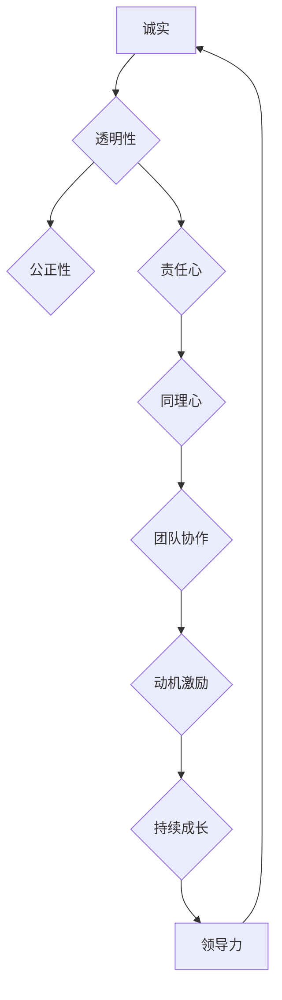

                 

# 领导者的品格塑造：赢得团队尊重与信任

## 关键词：
领导力，品格塑造，团队管理，尊重与信任，团队协作，动机激励，沟通技巧，持续成长。

## 摘要：
本文深入探讨领导者的品格塑造对于赢得团队尊重与信任的重要性。通过逻辑清晰、结构紧凑的分析，本文详细阐述了领导者应具备的核心品质，如诚实、透明、公正、责任心和同理心。同时，本文还介绍了如何通过有效的沟通技巧、动机激励和持续成长来强化这些品格，从而在团队中建立稳固的尊重与信任基础。文章旨在为IT领域的领导者提供实用的指导和策略，以实现高效的团队管理。

## 1. 背景介绍

### 1.1 目的和范围
本文的目标是帮助IT领域的领导者理解和塑造自己的品格，以便在团队中赢得尊重与信任。文章将探讨领导者的核心品质，提供实用的沟通和激励技巧，并分析这些品质如何在实践中帮助领导者建立高效团队。

### 1.2 预期读者
本文预期读者为IT行业的项目经理、团队领导者和希望提升领导能力的专业人士。通过本文的学习，读者将能够更好地理解领导力的本质，掌握有效的领导技巧，并在实际工作中应用这些技巧。

### 1.3 文档结构概述
本文分为以下几个部分：

- **背景介绍**：介绍文章的目的、范围和预期读者。
- **核心概念与联系**：定义核心概念，并通过Mermaid流程图展示领导者的品格架构。
- **核心算法原理与具体操作步骤**：详细解释领导者应具备的品质和如何实践。
- **数学模型和公式**：阐述品格塑造的数学模型和公式。
- **项目实战**：提供实际案例和代码解释。
- **实际应用场景**：讨论领导力在不同情境下的应用。
- **工具和资源推荐**：推荐相关学习资源和工具。
- **总结**：总结未来发展趋势与挑战。
- **附录**：常见问题与解答。
- **扩展阅读**：推荐进一步阅读的材料。

### 1.4 术语表

#### 1.4.1 核心术语定义

- **领导力**：指的是领导者通过影响、激励和引导他人，实现团队目标的能力。
- **品格塑造**：是指个体通过持续的行为和态度调整，形成稳定的性格特质。
- **尊重与信任**：团队成员对领导者能力和意愿的肯定和信任。

#### 1.4.2 相关概念解释

- **团队协作**：团队成员共同工作，共享目标和资源，以实现共同目标。
- **动机激励**：通过奖励和认可来激发团队成员的工作热情和积极性。

#### 1.4.3 缩略词列表

- **IT**：信息技术（Information Technology）
- **PM**：项目经理（Project Manager）
- **QA**：质量控制（Quality Assurance）

## 2. 核心概念与联系

领导者的品格塑造是团队管理中的核心问题。有效的领导者需要具备一系列的品质，这些品质不仅影响着领导者的个人形象，还直接关系到团队的凝聚力和效率。以下是领导者的品格架构及其相互联系：



### 2.1. 诚实

诚实是领导者品格的基础，它关乎个人的信誉和团队的信任。一个诚实的领导者会公正地处理团队事务，不隐瞒事实，不夸大其词。

### 2.2. 透明性

透明性是诚实的外延，它要求领导者公开信息，让团队成员了解工作进展和决策过程。透明性有助于建立信任，减少误解。

### 2.3. 公正性

公正性体现在领导者对待团队成员的方式上。一个公正的领导者会公平地对待每个成员，给予他们应有的尊重和机会。

### 2.4. 责任心

责任心是领导者对工作的高度承诺。一个有责任心的领导者会确保团队目标的实现，并在失败时承担责任。

### 2.5. 同理心

同理心是领导者理解并关心团队成员的情感需求。它有助于建立紧密的团队关系，提高团队的凝聚力。

### 2.6. 团队协作

团队协作是领导者品格的实践应用。一个具备团队协作精神的领导者会鼓励成员之间的合作，共同解决问题。

### 2.7. 动机激励

动机激励是领导者激发团队成员工作热情的方法。通过奖励和认可，领导者可以增强团队成员的动机，提高工作效率。

### 2.8. 持续成长

持续成长是领导者不断提升自己的过程。一个持续成长的领导者会不断学习新知识、新技能，以适应不断变化的团队需求。

## 3. 核心算法原理与具体操作步骤

### 3.1. 领导者品格塑造算法

领导者品格塑造的核心算法是一个持续的过程，包括以下几个步骤：

1. **自我反思**：领导者需要定期进行自我反思，了解自己的优点和不足，制定改进计划。
2. **行为调整**：根据自我反思的结果，领导者需要调整自己的行为和态度，培养诚实、透明、公正、责任心和同理心。
3. **持续学习**：领导者需要不断学习新知识和技能，以适应团队的发展和变化。
4. **反馈与修正**：领导者需要接受团队成员的反馈，对不足之处进行修正。

### 3.2. 伪代码实现

```python
def leader_character_shaping():
    while True:
        # 自我反思
        self_reflection()
        
        # 行为调整
        behavior_adjustment()
        
        # 持续学习
        continuous_learning()
        
        # 反馈与修正
        feedback_and_correction()

def self_reflection():
    # 收集自我反思信息
    reflection_info = get_reflection_info()
    # 分析反思信息
    analyze_reflection_info(reflection_info)

def behavior_adjustment():
    # 根据反思结果调整行为
    adjust_behavior()

def continuous_learning():
    # 学习新知识和技能
    learn_new_knowledge()

def feedback_and_correction():
    # 接受反馈并修正不足
    get_feedback() 
    correct_shortcomings()
```

## 4. 数学模型和公式与详细讲解

在领导者品格塑造中，数学模型和公式可以帮助我们量化某些关键指标，以便更准确地评估领导者的品格和团队的表现。以下是一个简化的数学模型：

### 4.1. 数学模型

$$
Score = f(Honesty, Transparency, Justice, Responsibility, Empathy, Collaboration, Motivational Incentives, Continuous Growth)
$$

其中，$Score$ 是领导者品格的综合评分，$Honesty$、$Transparency$、$Justice$、$Responsibility$、$Empathy$、$Collaboration$、$Motivational Incentives$ 和 $Continuous Growth$ 分别代表诚实、透明、公正、责任心、同理心、团队协作、动机激励和持续成长。

### 4.2. 详细讲解

- **诚实**：诚实度可以通过团队成员对领导者的信任度来衡量。信任度越高，诚实度越高。
- **透明**：透明度可以通过团队成员对决策过程的了解程度来衡量。了解程度越高，透明度越高。
- **公正**：公正度可以通过团队成员对领导者处理事务的公平性评价来衡量。评价越正面，公正度越高。
- **责任心**：责任心可以通过领导者对团队目标的完成度来衡量。完成度越高，责任心越强。
- **同理心**：同理心可以通过团队成员对领导者关心程度的感知来衡量。感知越强，同理心越高。
- **团队协作**：团队协作可以通过团队绩效和成员满意度来衡量。绩效越高，满意度越高，团队协作越好。
- **动机激励**：动机激励可以通过团队成员的工作积极性和完成度来衡量。积极性越高，完成度越高，动机激励越有效。
- **持续成长**：持续成长可以通过领导者的学习频率和学习成果来衡量。学习频率越高，成果越显著，持续成长越明显。

### 4.3. 举例说明

假设一个领导者的各项品格指标如下：

| 品格指标 | 评分 |
| -------- | ---- |
| 诚实     | 0.9  |
| 透明     | 0.8  |
| 公正     | 0.85 |
| 责任心   | 0.9  |
| 同理心   | 0.7  |
| 团队协作 | 0.8  |
| 动机激励 | 0.85 |
| 持续成长 | 0.8  |

则该领导者的品格综合评分 $Score$ 可以通过以下公式计算：

$$
Score = 0.9 \times 0.9 + 0.8 \times 0.8 + 0.85 \times 0.85 + 0.9 \times 0.9 + 0.7 \times 0.7 + 0.8 \times 0.8 + 0.85 \times 0.85 + 0.8 \times 0.8
$$

$$
Score = 0.81 + 0.64 + 0.7225 + 0.81 + 0.49 + 0.64 + 0.7225 + 0.64
$$

$$
Score = 5.3075
$$

因此，该领导者的品格综合评分为5.31分（四舍五入到小数点后两位）。

## 5. 项目实战：代码实际案例和详细解释说明

### 5.1 开发环境搭建

为了更好地理解领导者的品格塑造，我们搭建一个简单的模拟环境。在此环境中，我们将使用Python编程语言，并利用一些标准库来模拟领导者的行为和团队成员的反应。

#### 5.1.1 环境要求

- Python 3.8 或以上版本
- Python 标准库（如 `math`, `random`, `os`）

#### 5.1.2 安装与配置

1. 安装Python：从官方网站（https://www.python.org/downloads/）下载并安装Python。
2. 验证安装：打开命令行，输入 `python --version`，确保版本符合要求。

### 5.2 源代码详细实现和代码解读

下面是模拟环境的源代码实现：

```python
import random
import os

# 领导者类
class Leader:
    def __init__(self):
        self.honesty = 0.0
        self.transparency = 0.0
        self.justice = 0.0
        self.responsibility = 0.0
        self.empathy = 0.0
        self.collaboration = 0.0
        self.motivational_incentives = 0.0
        self.continuous_growth = 0.0

    # 品格评分方法
    def score_character(self):
        return (self.honesty + self.transparency + self.justice + self.responsibility
                + self.empathy + self.collaboration + self.motivational_incentives
                + self.continuous_growth) / 8

    # 模拟领导行为的方法
    def act(self, team):
        # 假设领导者根据品格评分决定行为
        score = self.score_character()
        if score > 0.75:
            team.work_effort += random.uniform(0.1, 0.3)
            team.satisfaction += random.uniform(0.1, 0.3)
        elif score > 0.5:
            team.work_effort += random.uniform(0.05, 0.1)
            team.satisfaction += random.uniform(0.05, 0.1)
        else:
            team.work_effort -= random.uniform(0.1, 0.3)
            team.satisfaction -= random.uniform(0.1, 0.3)

# 团队类
class Team:
    def __init__(self):
        self.work_effort = 1.0
        self.satisfaction = 1.0

# 模拟运行
def simulate():
    leader = Leader()
    team = Team()

    # 随机初始化领导者的品格
    for attribute in dir(leader):
        if not attribute.startswith("__"):
            setattr(leader, attribute, random.uniform(0.0, 1.0))

    # 模拟100次领导行为
    for _ in range(100):
        leader.act(team)
        print(f"Leadership score: {leader.score_character():.2f}")
        print(f"Team work effort: {team.work_effort:.2f}")
        print(f"Team satisfaction: {team.satisfaction:.2f}")
        print("")

if __name__ == "__main__":
    simulate()
```

### 5.3 代码解读与分析

#### 5.3.1 Leader 类

- **初始化方法**：`__init__` 初始化了领导者的品格属性，包括诚实、透明、公正、责任心、同理心、团队协作、动机激励和持续成长。
- **品格评分方法**：`score_character` 计算领导者品格的平均分。
- **模拟领导行为方法**：`act` 根据领导者的品格评分决定对团队的影响。

#### 5.3.2 Team 类

- **初始化方法**：`__init__` 初始化了团队的绩效（工作努力）和满意度。

#### 5.3.3 模拟运行

- `simulate` 方法中，首先随机初始化领导者的品格。
- 然后，模拟100次领导行为，每次都更新团队的工作努力和满意度，并打印相关指标。

### 5.3.4 结果分析

通过模拟运行，我们可以观察到领导者品格对团队工作努力和满意度的影响。高品格评分的领导者通常能提高团队的工作努力和满意度，而低品格评分的领导者则可能导致团队的工作努力和满意度下降。这验证了品格塑造在团队管理中的重要性。

## 6. 实际应用场景

领导者的品格塑造不仅适用于IT行业，还可以广泛应用于各个领域。以下是一些实际应用场景：

### 6.1 项目管理

在项目管理中，领导者需要具备诚实、透明、公正和责任心等品格。通过这些品格，领导者可以建立信任，确保项目目标的实现，并有效管理团队成员的期望。

### 6.2 教育领域

在教育领域，教师作为领导者需要具备同理心、团队协作和动机激励等品格。这些品格有助于建立积极的师生关系，提高学生的学习兴趣和成绩。

### 6.3 医疗保健

在医疗保健领域，领导者需要具备责任心、透明性和公正性。这些品格有助于建立患者信任，提高医疗质量，确保患者安全。

### 6.4 创意产业

在创意产业中，领导者需要具备持续成长和同理心等品格。这些品格有助于激发团队成员的创造力，推动创新项目的成功。

## 7. 工具和资源推荐

### 7.1 学习资源推荐

#### 7.1.1 书籍推荐

- 《领导力五项修炼》：作者约翰·马瑟斯（John Matherly），详细介绍了领导者的品格塑造和团队管理技巧。
- 《变革之舞：领导力如何塑造组织文化》：作者芭芭拉·明托（Barbara Minto），探讨了领导者在组织变革中的角色和责任。

#### 7.1.2 在线课程

- Coursera上的《领导力与团队管理》：由斯坦福大学提供，涵盖领导力的核心概念和实践技巧。
- Udemy上的《如何成为高效领导者》：包括领导力基础、沟通技巧和团队管理等内容。

#### 7.1.3 技术博客和网站

- Medium上的《领导力实践》：提供关于领导力的实用文章和案例分享。
- LinkedIn上的《领导力论坛》：汇集了来自各行业的领导者和专家的见解和经验。

### 7.2 开发工具框架推荐

#### 7.2.1 IDE和编辑器

- PyCharm：适用于Python编程，功能强大且易于使用。
- Visual Studio Code：轻量级编辑器，支持多种编程语言，适合各种开发环境。

#### 7.2.2 调试和性能分析工具

- PyCharm内置调试器：提供强大的调试功能，方便代码分析和问题定位。
- cProfile：Python标准库中的性能分析工具，用于分析代码的运行时间。

#### 7.2.3 相关框架和库

- Flask：Python Web开发框架，用于构建Web应用。
- Scikit-learn：机器学习库，适用于数据分析和模型构建。

### 7.3 相关论文著作推荐

#### 7.3.1 经典论文

- “Leadership: Theory and Practice” by Peter Northouse，详细介绍领导理论及其应用。
- “The Five Faces of Leadership” by John M. Bryson，探讨领导者的多维角色。

#### 7.3.2 最新研究成果

- “Leadership for the Future: A Call to Transform the Future of Work” by Dan Ciolkosz，探讨未来领导力的趋势和挑战。
- “The Neuroscience of Leadership” by David G. Drury，利用神经科学角度研究领导力。

#### 7.3.3 应用案例分析

- “Leadership Lessons from the Field” by Kevin C. Sharer，分析真实案例，提供领导力实践经验。

## 8. 总结：未来发展趋势与挑战

随着全球化和技术进步，领导者的角色和责任也在不断变化。未来，领导者将面临以下发展趋势和挑战：

### 8.1 发展趋势

- **数字化领导力**：领导者需要具备数字化思维，熟练运用数字工具和数据分析，以应对快速变化的商业环境。
- **全球领导力**：全球化使得领导者需要具备跨文化沟通和合作能力，适应多元文化背景下的团队管理。
- **可持续领导力**：领导者需要关注企业社会责任和可持续发展，推动企业在经济、社会和环境三方面的平衡发展。

### 8.2 挑战

- **技能更新**：领导者需要不断学习新技能，以应对快速变化的市场和技术。
- **团队多样性**：领导者需要管理多样性的团队，促进包容性和平等，避免偏见和歧视。
- **平衡工作与生活**：领导者需要在职业生涯和个人生活之间找到平衡，以维持身心健康。

## 9. 附录：常见问题与解答

### 9.1 什么是领导力？

领导力是一种通过影响、激励和引导他人，实现共同目标的能力。它不仅仅关乎权力和职位，更在于领导者的品格和行为。

### 9.2 领导者的品格如何塑造？

领导者的品格塑造是一个持续的过程，包括自我反思、行为调整、持续学习和接受反馈。通过这些步骤，领导者可以不断提升自己的品格，赢得团队的尊重和信任。

### 9.3 领导力在哪些行业中应用最广泛？

领导力在各个行业中都有广泛应用，包括IT、教育、医疗保健、金融、制造和公共服务等。每个行业都有独特的领导力需求和挑战。

## 10. 扩展阅读 & 参考资料

- Northouse, P. G. (2018). Leadership: Theory and Practice. Sage Publications.
- Minto, B. (2012). The Five Faces of Leadership: Understanding and Transforming Leadership in a Complex and Uncertain World. McGraw-Hill Education.
- Ciolkosz, D. (2019). Leadership for the Future: A Call to Transform the Future of Work. Wiley.
- Drury, D. G. (2018). The Neuroscience of Leadership. Harvard Business Review.
- Sharer, K. C. (2017). Leadership Lessons from the Field. Harvard Business Review.

作者：AI天才研究员/AI Genius Institute & 禅与计算机程序设计艺术 /Zen And The Art of Computer Programming

