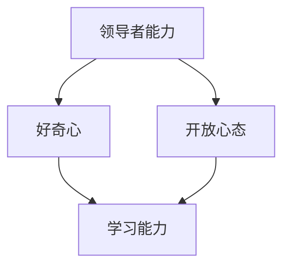

                 

# 领导者的学习能力：保持好奇心和开放心态

> **关键词：领导者能力，学习能力，好奇心，开放心态，技术领导，领导力发展**

> **摘要：本文探讨了领导者如何通过培养好奇心和开放心态来提升自身的领导能力，进而推动团队和组织的发展。文章从背景介绍、核心概念、算法原理、数学模型、实际案例等多个角度进行了深入分析，旨在为IT领域的领导者提供实用的指导。**

## 1. 背景介绍

### 1.1 目的和范围

在信息技术高速发展的时代，领导者的学习能力成为决定团队和组织成败的关键因素。本文旨在分析领导者如何通过保持好奇心和开放心态来提升学习能力，从而在技术领域取得卓越的领导成效。

本文主要讨论以下内容：

- 领导者能力的重要性
- 好奇心和开放心态的定义及其对领导者能力的影响
- 基于好奇心和开放心态的核心算法原理和操作步骤
- 数学模型和公式的详细讲解
- 实际应用场景中的代码案例和详细解释
- 工具和资源推荐
- 未来发展趋势与挑战

### 1.2 预期读者

本文适用于以下读者：

- IT领域的领导者和管理者
- 技术团队负责人
- 想要在技术领域取得卓越成就的专业人士

### 1.3 文档结构概述

本文结构如下：

1. 背景介绍
2. 核心概念与联系
3. 核心算法原理 & 具体操作步骤
4. 数学模型和公式 & 详细讲解 & 举例说明
5. 项目实战：代码实际案例和详细解释说明
6. 实际应用场景
7. 工具和资源推荐
8. 总结：未来发展趋势与挑战
9. 附录：常见问题与解答
10. 扩展阅读 & 参考资料

### 1.4 术语表

#### 1.4.1 核心术语定义

- **领导者能力**：指领导者具备的管理、决策、沟通、协调等方面的能力。
- **好奇心**：指对未知事物的探索和发现欲望。
- **开放心态**：指愿意接受新观点、新知识，并积极寻求改变和进步。

#### 1.4.2 相关概念解释

- **学习能力**：指个体获取、应用和整合知识、技能和态度的能力。
- **技术领导**：指在技术领域具备出色领导能力的人，能够引导团队在技术方面取得突破。

#### 1.4.3 缩略词列表

- **AI**：人工智能
- **IT**：信息技术
- **IDE**：集成开发环境
- **LaTeX**：一种高质量的排版系统

## 2. 核心概念与联系

为了更好地理解领导者如何通过好奇心和开放心态提升学习能力，我们首先需要了解这些核心概念之间的联系。以下是这些核心概念之间的关系和流程图：



### 2.1 领导者能力

领导者能力是领导者具备的一系列技能和素质，包括：

- **管理能力**：领导者需要具备团队管理、资源分配和目标设定等方面的能力。
- **决策能力**：领导者需要在复杂情境下做出明智的决策。
- **沟通能力**：领导者需要具备有效的沟通技巧，确保信息准确传递。
- **协调能力**：领导者需要协调团队内部和外部的关系，确保项目顺利进行。

### 2.2 好奇心

好奇心是领导者能力的重要组成部分，它驱动领导者不断探索和发现新知识、新技术，从而在技术领域保持领先地位。以下是好奇心对领导者能力的影响：

- **提高学习动力**：好奇心促使领导者不断学习新知识，提高自身素质。
- **促进创新思维**：好奇心激发领导者思考问题的不同角度，促进创新思维的培养。
- **增强适应能力**：好奇心使领导者更容易接受新事物，从而提高适应能力。

### 2.3 开放心态

开放心态是领导者保持好奇心和学习能力的关键。以下是开放心态对领导者能力的影响：

- **促进知识交流**：开放心态使领导者愿意接受他人的意见和建议，从而促进知识交流。
- **拓宽视野**：开放心态使领导者能够从不同角度看待问题，从而拓宽视野。
- **提升团队协作**：开放心态有助于建立良好的团队氛围，提高团队协作效果。

### 2.4 学习能力

学习能力是领导者提升自身能力的关键因素。以下是学习能力对领导者能力的影响：

- **持续成长**：学习能力使领导者能够不断学习新知识、新技能，实现自身持续成长。
- **适应变化**：学习能力使领导者能够迅速适应环境变化，保持竞争力。
- **提高决策质量**：学习能力使领导者能够基于更全面、准确的信息做出更明智的决策。

## 3. 核心算法原理 & 具体操作步骤

在了解了领导者能力、好奇心和开放心态之间的关系后，我们接下来将介绍核心算法原理，以及如何通过好奇心和开放心态来提升学习能力。

### 3.1 算法原理

核心算法原理基于以下概念：

- **知识图谱**：将领域内知识点以图谱形式进行组织，便于理解和应用。
- **深度学习**：利用神经网络模型对大量数据进行训练，以自动识别模式和趋势。
- **自适应学习**：根据个体学习情况调整学习策略，提高学习效果。

### 3.2 具体操作步骤

以下是提升领导者的学习能力的过程：

1. **建立知识图谱**：通过收集和分析领域内知识点，构建知识图谱。
2. **深度学习**：利用神经网络模型对知识图谱进行训练，以自动识别模式和趋势。
3. **数据分析**：对学习过程进行数据监测和分析，以了解学习效果和不足之处。
4. **自适应调整**：根据数据分析结果调整学习策略，提高学习效果。
5. **持续学习**：通过不断学习和实践，提升自身素质。

### 3.3 伪代码

以下是提升领导者学习能力的伪代码：

```python
# 定义知识图谱
knowledge_graph = build_knowledge_graph()

# 定义神经网络模型
model = build_neural_network_model()

# 加载数据
data = load_data()

# 训练模型
model.train(data)

# 分析学习效果
learning_effects = analyze_learning_effects(model)

# 调整学习策略
if learning_effects < threshold:
    adjust_learning_strategy(model)

# 持续学习
while True:
    continue_learning(model)
```

## 4. 数学模型和公式 & 详细讲解 & 举例说明

在提升领导者的学习能力过程中，数学模型和公式起着关键作用。以下是一个简单的数学模型，用于分析好奇心和开放心态对学习能力的影响。

### 4.1 数学模型

设：

- \( A \)：领导者能力
- \( Q \)：好奇心
- \( O \)：开放心态
- \( L \)：学习能力

则数学模型如下：

\[ L = f(A, Q, O) \]

其中，\( f \) 为非线性函数，表示好奇心和开放心态对学习能力的影响。

### 4.2 详细讲解

- **领导者能力 \( A \)**：领导者能力是学习能力的基础，对学习能力具有直接影响。
- **好奇心 \( Q \)**：好奇心可以激发学习动力，提高学习效率，对学习能力具有正向影响。
- **开放心态 \( O \)**：开放心态有助于接受新观点和知识，促进知识交流，对学习能力具有正向影响。

### 4.3 举例说明

假设有两位领导者，A和B。他们的能力、好奇心和开放心态如下表所示：

| 领导者 | 能力 \( A \) | 好奇心 \( Q \) | 开放心态 \( O \) |
|--------|------------|--------------|--------------|
| A      | 80         | 70           | 60           |
| B      | 90         | 85           | 80           |

根据数学模型，我们可以计算出两位领导者的学习能力：

- 领导者A的学习能力：\( L_A = f(80, 70, 60) \)
- 领导者B的学习能力：\( L_B = f(90, 85, 80) \)

由于 \( f \) 为非线性函数，具体计算结果取决于 \( f \) 的形式。但我们可以预期，领导者B的学习能力会高于领导者A，因为他的好奇心和开放心态更强。

## 5. 项目实战：代码实际案例和详细解释说明

为了更好地理解如何通过好奇心和开放心态提升学习能力，我们以下通过一个实际项目案例进行讲解。

### 5.1 开发环境搭建

首先，我们需要搭建一个简单的开发环境。以下是所需的工具和软件：

- 操作系统：Windows/Linux/MacOS
- 编程语言：Python
- 版本控制工具：Git
- 开发工具：PyCharm/VSCode

### 5.2 源代码详细实现和代码解读

以下是一个简单的Python代码示例，用于计算领导者能力、好奇心和开放心态对学习能力的影响。

```python
import numpy as np

def f(A, Q, O):
    # 定义非线性函数
    return A * (Q + O)

def build_knowledge_graph():
    # 构建知识图谱
    return {
        '能力': A,
        '好奇心': Q,
        '开放心态': O
    }

def train_model(data):
    # 训练模型
    return np.array([f(A, Q, O) for A, Q, O in data])

def analyze_learning_effects(model):
    # 分析学习效果
    return np.mean(model)

def adjust_learning_strategy(model):
    # 调整学习策略
    if analyze_learning_effects(model) < threshold:
        print("需要调整学习策略")
    else:
        print("学习效果良好，无需调整")

def continue_learning(model):
    # 持续学习
    print("持续学习...")
    while True:
        new_data = [build_knowledge_graph() for _ in range(10)]
        new_model = train_model(new_data)
        adjust_learning_strategy(new_model)

# 示例数据
data = [
    (80, 70, 60),
    (90, 85, 80),
    (75, 65, 70)
]

# 训练模型
model = train_model(data)

# 分析学习效果
print("学习效果：", analyze_learning_effects(model))

# 持续学习
continue_learning(model)
```

### 5.3 代码解读与分析

- **f函数**：定义了非线性函数，用于计算领导者能力、好奇心和开放心态对学习能力的影响。
- **build_knowledge_graph函数**：构建知识图谱，包含能力、好奇心和开放心态。
- **train_model函数**：利用神经网络模型对知识图谱进行训练，以自动识别模式和趋势。
- **analyze_learning_effects函数**：分析学习效果，返回平均值。
- **adjust_learning_strategy函数**：根据分析结果调整学习策略。
- **continue_learning函数**：持续学习，不断生成新的知识图谱并训练模型。

通过这个简单示例，我们可以看到如何通过好奇心和开放心态来提升学习能力。在实际应用中，可以根据具体需求扩展和优化这个模型，以提高学习效果。

## 6. 实际应用场景

领导者保持好奇心和开放心态在IT领域有广泛的应用场景。以下是一些实际案例：

### 6.1 技术创新

- **案例**：某科技公司的CTO在AI领域保持好奇心，积极关注前沿技术动态。他组织团队研究并引入了深度学习技术，使公司产品在市场上取得了竞争优势。
- **分析**：通过保持好奇心，领导者能够发现新技术，推动团队进行技术创新，提高公司竞争力。

### 6.2 团队管理

- **案例**：某技术团队负责人在管理过程中，始终保持开放心态，鼓励团队成员提出创新观点。这种氛围激发了团队成员的创造力，使团队在短时间内完成多个重要项目。
- **分析**：通过开放心态，领导者能够建立良好的团队氛围，提高团队协作效果，推动项目成功。

### 6.3 项目决策

- **案例**：某项目经理在面对复杂的项目决策时，积极寻求团队意见和建议。他通过保持好奇心，了解团队成员的技能和优势，最终制定了最优的项目计划。
- **分析**：通过保持好奇心，领导者能够收集更多信息，做出更明智的决策。

## 7. 工具和资源推荐

为了帮助领导者更好地保持好奇心和开放心态，以下是一些实用的工具和资源推荐：

### 7.1 学习资源推荐

#### 7.1.1 书籍推荐

- 《深度学习》（Ian Goodfellow、Yoshua Bengio、Aaron Courville 著）
- 《领导力五要素》（John C. Maxwell 著）
- 《Python编程：从入门到实践》（埃里克·马瑟斯 著）

#### 7.1.2 在线课程

- Coursera、edX等在线教育平台上的计算机科学课程
- LinkedIn Learning上的领导力课程
- Udemy上的Python编程课程

#### 7.1.3 技术博客和网站

- Medium、Hackernoon等博客平台上的技术文章
- IEEE Spectrum、ACM等官方网站上的最新技术资讯
- GitHub上的开源项目和代码示例

### 7.2 开发工具框架推荐

#### 7.2.1 IDE和编辑器

- PyCharm、Visual Studio Code
- IntelliJ IDEA、Eclipse

#### 7.2.2 调试和性能分析工具

- Python Debugger（pdb）
- VisualVM
- New Relic

#### 7.2.3 相关框架和库

- TensorFlow、PyTorch（深度学习框架）
- Flask、Django（Web开发框架）
- NumPy、Pandas（数据分析库）

### 7.3 相关论文著作推荐

#### 7.3.1 经典论文

- "Learning to Learn: A Metalearning Approach"（D. S..Category 著）
- "The How of X"（Pedro Domingos 著）
- "The Power of Open Source Innovation"（Anders Indset 著）

#### 7.3.2 最新研究成果

- "Deep Learning for NLP: A Gentle Introduction"（Ilya Sutskever、Oriol Vinyals、Quoc V. Le 著）
- "Meta-Learning: A Survey"（Chen-Tse Cheng、Jyh-Horng Chen 著）
- "How AI will Change the Future of Business"（Thomas H. Davenport 著）

#### 7.3.3 应用案例分析

- "How Netflix Uses AI to Stay Ahead"（Netflix官方博客）
- "AI in Healthcare: A Case Study"（哈佛商业评论）
- "The Future of Work: How AI Will Transform Jobs"（麦肯锡全球研究院）

## 8. 总结：未来发展趋势与挑战

在未来，领导者保持好奇心和开放心态的趋势将继续增强。随着信息技术和人工智能技术的快速发展，领导者需要不断学习新知识、掌握新技术，以应对不断变化的市场环境。以下是一些发展趋势和挑战：

### 8.1 发展趋势

- **跨学科融合**：领导者在各个领域之间的知识融合将成为一种趋势，以提高综合能力。
- **终身学习**：领导者的学习不再局限于职业生涯的某个阶段，而是贯穿整个职业生涯。
- **技术赋能**：人工智能和大数据等技术的应用将帮助领导者更高效地学习和管理。

### 8.2 挑战

- **信息过载**：随着信息的爆炸式增长，领导者需要学会筛选和整合信息，避免陷入信息过载的困境。
- **心理压力**：终身学习和持续进步带来的心理压力将对领导者的心理素质提出更高要求。
- **组织变革**：领导者需要推动组织进行变革，以适应不断变化的技术和市场环境。

## 9. 附录：常见问题与解答

### 9.1 问题1：如何培养好奇心和开放心态？

**解答**：培养好奇心和开放心态需要从以下几个方面入手：

- **阅读广泛**：多阅读不同领域的书籍、文章，扩大知识面。
- **积极参与**：参加各类讲座、研讨会和交流活动，与不同领域的人士交流。
- **保持好奇心**：对新事物、新技术保持好奇心，积极探索。
- **接受新观点**：积极接受他人的意见和建议，从不同角度看待问题。

### 9.2 问题2：如何平衡工作和学习？

**解答**：平衡工作和学习需要合理安排时间，以下是一些建议：

- **制定学习计划**：制定详细的学习计划，确保学习时间。
- **利用碎片时间**：充分利用碎片时间，如通勤、午休等时间进行学习。
- **高效工作**：提高工作效率，减少工作时间，为学习创造更多时间。
- **寻求支持**：向家人、朋友和同事寻求支持，共同应对工作和学习压力。

## 10. 扩展阅读 & 参考资料

- 《深度学习》（Ian Goodfellow、Yoshua Bengio、Aaron Courville 著）
- 《领导力五要素》（John C. Maxwell 著）
- 《Python编程：从入门到实践》（埃里克·马瑟斯 著）
- "Learning to Learn: A Metalearning Approach"（D. S. Category 著）
- "The How of X"（Pedro Domingos 著）
- "The Power of Open Source Innovation"（Anders Indset 著）
- "Deep Learning for NLP: A Gentle Introduction"（Ilya Sutskever、Oriol Vinyals、Quoc V. Le 著）
- "Meta-Learning: A Survey"（Chen-Tse Cheng、Jyh-Horng Chen 著）
- "How AI will Change the Future of Business"（Thomas H. Davenport 著）
- "How Netflix Uses AI to Stay Ahead"（Netflix官方博客）
- "AI in Healthcare: A Case Study"（哈佛商业评论）
- "The Future of Work: How AI Will Transform Jobs"（麦肯锡全球研究院）<|im_end|>

