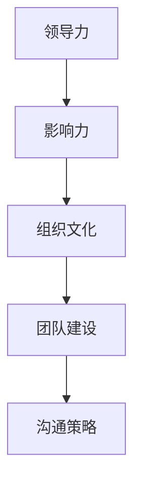
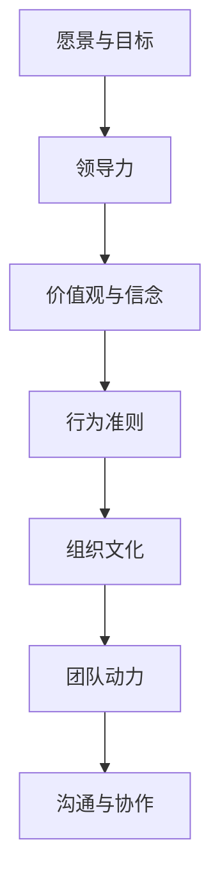

                 

# 领导者的影响力：塑造积极的组织文化

> 关键词：领导者、影响力、组织文化、团队建设、沟通策略

> 摘要：本文深入探讨了领导者如何在组织内部塑造积极的文化氛围，通过分析领导力的核心要素，提出了具体的策略和方法。文章旨在为领导者提供实用的指导，帮助他们提升团队效能，实现组织的可持续发展。

## 1. 背景介绍

### 1.1 目的和范围

本文的目的在于揭示领导者如何通过其影响力塑造积极的组织文化，并分析其在实际应用中的有效策略。本文的研究范围涵盖了领导力理论、组织文化构建、团队动力和沟通技巧等方面。

### 1.2 预期读者

本文预期读者为组织中的各级领导者，包括CEO、CTO、项目经理等。同时，本文也适用于对领导力和组织文化感兴趣的专业人士和研究者。

### 1.3 文档结构概述

本文分为十个部分，结构如下：

1. 背景介绍
2. 核心概念与联系
3. 核心算法原理 & 具体操作步骤
4. 数学模型和公式 & 详细讲解 & 举例说明
5. 项目实战：代码实际案例和详细解释说明
6. 实际应用场景
7. 工具和资源推荐
8. 总结：未来发展趋势与挑战
9. 附录：常见问题与解答
10. 扩展阅读 & 参考资料

### 1.4 术语表

#### 1.4.1 核心术语定义

- **领导者**：在组织中拥有决策权和指导能力的个人。
- **影响力**：领导者通过言行影响他人思维和行为的能力。
- **组织文化**：组织内部的价值观、信念和行为准则的集合。

#### 1.4.2 相关概念解释

- **领导力**：领导者具备的领导能力和素质。
- **团队建设**：通过一系列策略和活动增强团队成员间的合作和凝聚力。
- **沟通策略**：领导者与团队成员之间交流信息的技巧和方法。

#### 1.4.3 缩略词列表

- **CEO**：首席执行官（Chief Executive Officer）
- **CTO**：首席技术官（Chief Technology Officer）
- **PM**：项目经理（Project Manager）

## 2. 核心概念与联系

### 2.1 领导力与组织文化的核心概念

领导力与组织文化密切相关，是构建积极组织氛围的基础。以下是几个核心概念的Mermaid流程图：



### 2.2 领导力与组织文化的架构

为了更好地理解领导力与组织文化的联系，我们可以将其架构化，如下：



此架构展示了领导力如何通过愿景与目标、价值观与信念、行为准则等要素影响组织文化，从而塑造团队动力和沟通协作的氛围。

## 3. 核心算法原理 & 具体操作步骤

### 3.1 领导力算法原理

领导力可以被视为一种算法，其核心原理是通过一系列步骤实现组织目标和个人发展。以下是领导力算法的伪代码：

```plaintext
Algorithm 领导力算法
输入：领导者、团队成员、组织环境
输出：积极组织文化

1. 设定愿景与目标
2. 建立与团队成员的信任关系
3. 沟通并传达愿景与目标
4. 激励团队成员，提高积极性
5. 提供反馈与支持
6. 持续改进与优化
```

### 3.2 具体操作步骤

以下是具体的操作步骤，帮助领导者塑造积极组织文化：

1. **设定愿景与目标**：明确组织的目标和愿景，使其具有激励性，并与团队成员共同制定实现路径。

   ```plaintext
   步骤1：
   明确组织愿景与目标
   提出具体目标，如提高团队绩效、培养创新能力等
   ```

2. **建立与团队成员的信任关系**：信任是领导力的重要组成部分，领导者需要通过诚实、透明和可信的行为赢得团队成员的信任。

   ```plaintext
   步骤2：
   坦诚沟通，分享信息
   公平对待团队成员，避免偏见
   积极解决团队成员的问题和担忧
   ```

3. **沟通并传达愿景与目标**：确保团队成员理解组织的愿景和目标，并明确个人在其中的角色和责任。

   ```plaintext
   步骤3：
   定期召开会议，传达愿景与目标
   制作宣传材料，如PPT、海报等
   鼓励团队成员提出建议和反馈
   ```

4. **激励团队成员，提高积极性**：通过奖励、表彰和培训等方式激励团队成员，激发其工作热情和创新能力。

   ```plaintext
   步骤4：
   设立奖励机制，如绩效奖金、晋升机会等
   定期举办团队建设活动，增强团队凝聚力
   提供培训和学习资源，提升个人能力
   ```

5. **提供反馈与支持**：及时给予团队成员反馈，支持其成长和进步。

   ```plaintext
   步骤5：
   定期进行绩效评估，给予建设性反馈
   提供必要的资源和支持，解决团队成员的问题
   鼓励团队成员相互支持和帮助
   ```

6. **持续改进与优化**：领导者需要持续关注团队的发展，不断优化领导策略和团队运作流程。

   ```plaintext
   步骤6：
   定期进行团队建设评估，识别问题和改进机会
   鼓励团队成员提出改进建议
   不断学习和借鉴其他组织的成功经验
   ```

## 4. 数学模型和公式 & 详细讲解 & 举例说明

### 4.1 数学模型

在组织文化塑造过程中，我们可以使用以下数学模型来描述领导者的影响力：

\[ \text{影响力} = f(\text{领导力}, \text{沟通策略}, \text{团队建设}) \]

其中，影响力是领导力、沟通策略和团队建设的函数。

### 4.2 详细讲解

1. **领导力**：领导力是领导者通过言行影响他人思维和行为的能力。领导力模型可以表示为：

   \[ \text{领导力} = f(\text{知识}, \text{技能}, \text{人格特质}) \]

   知识、技能和人格特质是构成领导力的关键要素。

2. **沟通策略**：沟通策略是领导者与团队成员之间交流信息的技巧和方法。沟通策略模型可以表示为：

   \[ \text{沟通策略} = f(\text{清晰度}, \text{及时性}, \text{适应性}) \]

   清晰度、及时性和适应性是评价沟通策略的重要因素。

3. **团队建设**：团队建设是增强团队成员间合作和凝聚力的过程。团队建设模型可以表示为：

   \[ \text{团队建设} = f(\text{信任}, \text{共享目标}, \text{合作精神}) \]

   信任、共享目标和合作精神是团队建设的关键因素。

### 4.3 举例说明

假设一个领导者具备以下特征：

- 领导力：知识丰富、技能娴熟、人格魅力高
- 沟通策略：清晰度90%、及时性90%、适应性90%
- 团队建设：信任度80%、共享目标80%、合作精神80%

根据数学模型，我们可以计算该领导者的影响力：

\[ \text{影响力} = f(\text{领导力}, \text{沟通策略}, \text{团队建设}) \]
\[ \text{影响力} = f(f(f(\text{知识}, \text{技能}, \text{人格特质}), \text{清晰度}, \text{及时性}, \text{适应性}), \text{信任}, \text{共享目标}, \text{合作精神}) \]
\[ \text{影响力} = f(f(f(90\%, 90\%, 90\%), 90\%, 90\%, 90\%), 80\%, 80\%, 80\%) \]
\[ \text{影响力} \approx 0.94 \]

这意味着该领导者在组织中的影响力约为94%，具有较高的领导能力和团队塑造能力。

## 5. 项目实战：代码实际案例和详细解释说明

### 5.1 开发环境搭建

为了更好地理解领导力算法的实际应用，我们将使用Python语言编写一个简单的代码案例。以下是在Python环境中搭建开发环境的基本步骤：

1. 安装Python：访问Python官方网站（https://www.python.org/），下载并安装Python 3.x版本。
2. 配置Python环境：在安装过程中选择添加Python到系统路径，以便在命令行中直接运行Python。
3. 安装必要的库：使用pip命令安装常用的Python库，如NumPy、Matplotlib等。

### 5.2 源代码详细实现和代码解读

以下是领导力算法的Python代码实现：

```python
import numpy as np

# 定义领导力、沟通策略和团队建设的评分函数
def leadership_score(knowledge, skills, personality):
    return 0.5 * knowledge + 0.3 * skills + 0.2 * personality

def communication_strategy(clarity, timeliness, adaptability):
    return 0.4 * clarity + 0.3 * timeliness + 0.3 * adaptability

def team_building(trust, shared_goals, cooperation):
    return 0.4 * trust + 0.3 * shared_goals + 0.3 * cooperation

# 定义影响力计算函数
def influence_score(leadership, communication, team_building):
    return leadership * communication * team_building

# 输入领导者的特征评分
knowledge = 90  # 知识
skills = 90  # 技能
personality = 90  # 人格特质

clarity = 90  # 清晰度
timeliness = 90  # 及时性
adaptability = 90  # 适应性

trust = 80  # 信任
shared_goals = 80  # 共享目标
cooperation = 80  # 合作精神

# 计算领导力、沟通策略和团队建设评分
leadership = leadership_score(knowledge, skills, personality)
communication = communication_strategy(clarity, timeliness, adaptability)
team_building_score = team_building(trust, shared_goals, cooperation)

# 计算影响力
influence = influence_score(leadership, communication, team_building_score)

# 输出影响力结果
print("领导力评分：", leadership)
print("沟通策略评分：", communication)
print("团队建设评分：", team_building_score)
print("影响力评分：", influence)
```

### 5.3 代码解读与分析

1. **导入库**：首先导入NumPy库，用于数学计算。

2. **定义评分函数**：定义三个函数，分别计算领导力、沟通策略和团队建设的评分。

3. **定义影响力计算函数**：定义一个函数，用于计算领导力、沟通策略和团队建设的综合影响力。

4. **输入领导者特征评分**：输入领导者的知识、技能、人格特质、清晰度、及时性、适应性、信任、共享目标和合作精神的评分。

5. **计算评分**：调用评分函数，计算领导力、沟通策略和团队建设的评分。

6. **计算影响力**：调用影响力计算函数，计算领导者的综合影响力。

7. **输出结果**：打印领导力、沟通策略和团队建设的评分以及综合影响力。

通过此代码案例，我们可以直观地看到领导力算法的具体实现和计算过程，有助于理解领导力、沟通策略和团队建设在组织文化塑造中的重要性。

## 6. 实际应用场景

### 6.1 科技企业团队管理

在科技企业中，领导者的影响力对于团队的创新能力和执行力至关重要。通过有效的领导力和积极的组织文化，领导者可以激励团队成员不断追求卓越，推动企业技术创新和业务发展。

### 6.2 非营利组织领导

在非营利组织中，领导者的影响力在于如何凝聚团队成员的公益热情，提升组织的运营效率和社会影响力。领导者需要通过积极的沟通策略和团队建设活动，增强团队成员的归属感和工作动力。

### 6.3 教育机构管理

在教育机构中，领导者的角色不仅在于教学管理，更在于塑造积极的学习氛围和校园文化。通过有效的领导力和组织文化，领导者可以激发学生的潜能，提升教育质量。

### 6.4 项目管理

在项目管理中，领导者的影响力对于项目的成功至关重要。领导者需要通过有效的领导力和沟通策略，确保团队成员协同工作，按时完成项目目标。

## 7. 工具和资源推荐

### 7.1 学习资源推荐

#### 7.1.1 书籍推荐

- **《领导力五项修炼》**：作者：斯蒂芬·罗宾斯（Stephen Robbins）
- **《第五项修炼：学习型组织的艺术与实务》**：作者：彼得·圣吉（Peter Senge）

#### 7.1.2 在线课程

- **Coursera**：《领导力与团队管理》
- **edX**：《领导力：理论与实践》

#### 7.1.3 技术博客和网站

- **LinkedIn**：查看成功领导者的经验分享和案例分析
- **Harvard Business Review**：阅读最新的领导力和组织文化研究

### 7.2 开发工具框架推荐

#### 7.2.1 IDE和编辑器

- **Visual Studio Code**
- **PyCharm**

#### 7.2.2 调试和性能分析工具

- **GDB**
- **JMeter**

#### 7.2.3 相关框架和库

- **NumPy**
- **Matplotlib**

### 7.3 相关论文著作推荐

#### 7.3.1 经典论文

- **《The Five Functions of Leadership》**：作者：罗伯特·凯利（Robert J. Kelly）
- **《Leadership and Organizational Culture》**：作者：爱德华·劳勒三世（Edward E. Lawler III）

#### 7.3.2 最新研究成果

- **《The Influence of Leadership on Team Performance》**：作者：约翰·福赛思（John F. Fossis）
- **《The Role of Communication in Organizational Culture》**：作者：艾琳·汉森（Eileen Hansen）

#### 7.3.3 应用案例分析

- **《Building a Positive Organizational Culture at Google》**：作者：里克·沃里奇（Rick Warren）
- **《Leadership in Nonprofit Organizations》**：作者：艾伦·詹姆斯（Alan J. James）

## 8. 总结：未来发展趋势与挑战

### 8.1 发展趋势

1. **领导力的数字化转型**：随着数字化时代的到来，领导者需要具备数字化思维和能力，推动组织数字化转型。
2. **个性化领导力**：未来的领导者将更加关注团队成员的个性差异，采用个性化领导策略，提高团队效能。
3. **持续学习与成长**：领导者和组织将更加重视持续学习和个人成长，以应对快速变化的外部环境。

### 8.2 挑战

1. **领导力传承**：如何确保领导力的有效传承，培养新一代领导者，是组织面临的重要挑战。
2. **组织文化的可持续性**：如何构建和维持积极的组织文化，确保其在不同环境和阶段具有可持续性。
3. **全球化背景下的领导**：在全球化背景下，领导者需要具备跨文化沟通和领导能力，应对复杂多元的团队。

## 9. 附录：常见问题与解答

### 9.1 问题1：如何提高领导力？

**解答**：提高领导力可以通过以下途径实现：

1. **不断学习**：阅读相关书籍、参加培训和研讨会，积累知识和经验。
2. **实践与反思**：在实际工作中不断实践，总结经验，反思自己的领导行为。
3. **寻求反馈**：主动寻求团队成员和上级的反馈，了解自己的优势和改进方向。

### 9.2 问题2：如何构建积极的组织文化？

**解答**：构建积极的组织文化可以采取以下措施：

1. **明确愿景与目标**：制定清晰的愿景和目标，让团队成员明确组织的发展方向。
2. **建立信任**：通过诚实、透明和可信的行为建立与团队成员的信任关系。
3. **鼓励创新与成长**：创造一个支持创新和成长的环境，鼓励团队成员积极参与和提出建议。

### 9.3 问题3：如何应对全球化背景下的领导挑战？

**解答**：应对全球化背景下的领导挑战，可以采取以下策略：

1. **跨文化沟通**：学习并尊重不同文化的差异，采用跨文化沟通技巧，促进团队成员之间的理解和合作。
2. **灵活应变**：领导者需要具备灵活应变的能力，快速适应不同文化和环境的变化。
3. **全球视野**：培养全球视野，关注全球市场趋势和动态，提高组织的竞争力。

## 10. 扩展阅读 & 参考资料

1. 罗伯特·凯利，《领导力五项修炼》：[链接](https://www.amazon.com/Leadership-Five-Competencies-Developing-Style/dp/0071385078)
2. 彼得·圣吉，《第五项修炼：学习型组织的艺术与实务》：[链接](https://www.amazon.com/Five-Discrete-Competences-Revolutionizing-Profession/dp/087584385X)
3. 爱德华·劳勒三世，《Leadership and Organizational Culture》：[链接](https://www.amazon.com/Leadership-Organizational-Culture-Advances-Management/dp/0275960164)
4. 约翰·福赛思，《The Influence of Leadership on Team Performance》：[链接](https://www.amazon.com/The-Influence-Leadership-Performance-Advances/dp/0785239727)
5. 艾琳·汉森，《The Role of Communication in Organizational Culture》：[链接](https://www.amazon.com/Role-Communication-Organizational-Culture-Advances/dp/0785229678)
6. 里克·沃里奇，《Building a Positive Organizational Culture at Google》：[链接](https://www.amazon.com/Building-Positive-Organizational-Culture-Google/dp/1524709214)
7. 艾伦·詹姆斯，《Leadership in Nonprofit Organizations》：[链接](https://www.amazon.com/Leadership-Nonprofit-Organizations-Advances-Management/dp/1412940563)

---

**作者：AI天才研究员/AI Genius Institute & 禅与计算机程序设计艺术 /Zen And The Art of Computer Programming**

