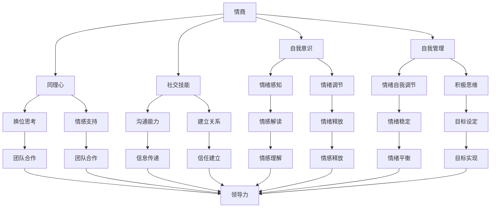

                 

# 领导者的情商修炼：提升人际影响力

## 关键词：
领导力、情商、人际交往、影响力、团队协作、沟通技巧

## 摘要：
本文旨在探讨领导者在提升人际影响力方面所需进行的情商修炼。通过对情商的深入剖析，本文揭示了情商在领导力中的核心地位，并提供了实用的方法与技巧，帮助领导者更好地理解和运用情商，以提升个人和团队的绩效。

## 1. 背景介绍

### 1.1 目的和范围
本文将围绕领导者的情商修炼展开，探讨如何通过提升情商来增强人际影响力。文章旨在为领导者提供实用的指导，帮助他们在复杂多变的环境中更好地引导团队，实现组织目标。

### 1.2 预期读者
本文适用于各级领导者，尤其是希望提升人际影响力、增强团队协作能力的专业人士。同时，对情商和领导力感兴趣的读者也将从本文中获得有益的见解。

### 1.3 文档结构概述
本文分为十个部分，首先介绍情商的基本概念，然后分析情商在领导力中的重要性，接着提供具体的修炼方法和实践技巧。此外，文章还包括实际应用场景、工具和资源推荐，以及对未来发展趋势的展望。

### 1.4 术语表
#### 1.4.1 核心术语定义
- 情商（EQ）：情商是指个体识别、理解、表达、控制和利用情绪的能力。
- 领导力：领导力是指通过激发和引导他人，实现共同目标的能力。
- 人际影响力：人际影响力是指个体在人际交往中影响他人思维和行为的能力。

#### 1.4.2 相关概念解释
- 情绪智力：情绪智力是情商的核心组成部分，包括自我情绪管理、自我激励、同理心和社交技能等。
- 情绪表达：情绪表达是指个体如何表达自己的情绪和感受。
- 情绪感知：情绪感知是指个体如何感知和理解他人的情绪。

#### 1.4.3 缩略词列表
- EQ：情商（Emotional Intelligence）
-领导力（Leadership）

## 2. 核心概念与联系

### 2.1 核心概念原理和架构

下面是一个关于情商在领导力中作用的Mermaid流程图：



### 2.2 核心概念之间的联系

情商与领导力之间的联系紧密，可以视为相辅相成的伙伴。以下是情商各个组成部分与领导力之间的具体联系：

- **自我意识**：领导者需要对自己的情绪有深刻的认识，能够识别和表达自己的情绪。这有助于他们在面对压力和挑战时保持冷静和理智，做出明智的决策。
- **自我管理**：领导者需要能够控制自己的情绪，避免情绪化的行为。通过自我管理，领导者可以展现出更高的决策能力和情绪稳定性，从而赢得团队成员的信任。
- **同理心**：同理心是领导者理解他人情绪和需求的关键。通过同理心，领导者可以更好地激励和引导团队成员，提高团队的凝聚力和合作效率。
- **社交技能**：沟通能力和建立关系的技能对于领导者至关重要。良好的社交技能有助于领导者有效地传达信息、解决冲突和建立信任，从而提升团队绩效。

## 3. 核心算法原理 & 具体操作步骤

情商的提升并非一蹴而就，而是一个逐步积累和培养的过程。以下是提升情商的核心算法原理和具体操作步骤：

### 3.1 核心算法原理

情商的提升可以被视为一种算法优化过程，其核心原理包括以下几个方面：

- **自我意识**：通过自我反思和情绪记录，提高对自己情绪的认识和了解。
- **自我管理**：通过情绪调节策略，降低负面情绪的影响，提高情绪稳定性。
- **同理心**：通过换位思考和情感支持，提高对他人情绪的感知和理解。
- **社交技能**：通过沟通技巧和关系建立，提高与他人互动的质量和效果。

### 3.2 具体操作步骤

以下是提升情商的具体操作步骤：

#### 步骤1：自我意识培养

1. **自我反思**：定期进行自我反思，思考自己的情绪和行为，识别和记录情绪触发点。
2. **情绪记录**：保持情绪日志，记录每天的情绪变化，分析情绪的起因和影响。

#### 步骤2：自我管理提升

1. **情绪调节**：学习情绪调节技巧，如深呼吸、冥想、运动等，帮助缓解压力和负面情绪。
2. **情绪释放**：找到适当的渠道释放情绪，如倾诉、写日记、绘画等。

#### 步骤3：同理心培养

1. **换位思考**：在处理问题时，尝试从他人的角度出发，理解他们的情绪和需求。
2. **情感支持**：在团队中提供情感支持，关心团队成员的感受，帮助他们应对挑战。

#### 步骤4：社交技能提升

1. **沟通技巧**：学习有效的沟通技巧，如倾听、表达、非语言沟通等，提高沟通效果。
2. **关系建立**：主动与他人建立关系，通过互动和合作，建立信任和亲密感。

## 4. 数学模型和公式 & 详细讲解 & 举例说明

在情商提升过程中，可以使用一些数学模型和公式来量化情绪变化和人际互动的效果。以下是几个常用的数学模型和公式，以及它们的详细讲解和举例说明。

### 4.1 伯努利方程式（情绪稳定性）

伯努利方程式可以用于描述情绪稳定性，其公式为：

$$
\Delta E = \frac{1}{2} m v^2 - \frac{1}{2} m_0 v_0^2
$$

其中，$\Delta E$ 表示情绪变化，$m$ 表示情绪质量，$v$ 表示情绪强度，$m_0$ 表示初始情绪质量，$v_0$ 表示初始情绪强度。

#### 详细讲解：

伯努利方程式描述了情绪变化与情绪质量、情绪强度之间的关系。当情绪质量（$m$）和情绪强度（$v$）增加时，情绪变化（$\Delta E$）也会增加。反之，当情绪质量（$m$）和情绪强度（$v$）减少时，情绪变化（$\Delta E$）也会减少。

#### 举例说明：

假设一个人初始情绪质量为50，情绪强度为10。经过一段时间自我管理和情绪调节后，情绪质量增加到70，情绪强度减少到5。根据伯努利方程式，情绪变化为：

$$
\Delta E = \frac{1}{2} \times 70 \times 5^2 - \frac{1}{2} \times 50 \times 10^2 = 175 - 250 = -75
$$

这意味着情绪变化为-75，即情绪稳定性提高。

### 4.2 皮亚杰认知发展模型（同理心）

皮亚杰认知发展模型可以用于描述同理心的培养过程。该模型分为四个阶段：感知运动阶段、前运算阶段、具体运算阶段和形式运算阶段。

#### 详细讲解：

- **感知运动阶段**：个体主要通过感知和运动来理解世界，对他人情绪的感知较为有限。
- **前运算阶段**：个体开始理解他人具有不同的观点和情绪，但尚未形成完整的同理心。
- **具体运算阶段**：个体能够理解他人的情绪和需求，具备一定的同理心。
- **形式运算阶段**：个体能够站在他人角度思考问题，形成深刻的同理心。

#### 举例说明：

一个5岁的孩子在感知运动阶段，主要通过观察和模仿来理解他人的情绪。在前运算阶段，孩子开始意识到他人有不同的情绪，但还不能完全理解他人的感受。在具体运算阶段，孩子能够理解和关心他人的情绪，具备一定的同理心。在形式运算阶段，孩子能够深刻理解他人的情绪和需求，形成成熟的同理心。

### 4.3 马尔可夫模型（社交技能）

马尔可夫模型可以用于描述社交技能的提升过程。该模型基于状态转移概率，描述个体在不同社交状态之间的转换。

#### 详细讲解：

马尔可夫模型由状态集和状态转移矩阵组成。状态集表示个体的社交技能水平，状态转移矩阵表示个体在不同社交技能水平之间的转换概率。

#### 举例说明：

假设一个领导者的社交技能水平有五个状态：低、较低、中等、较高、高。状态转移矩阵为：

$$
\begin{bmatrix}
0.2 & 0.3 & 0.3 & 0.1 & 0.1 \\
0.1 & 0.3 & 0.4 & 0.1 & 0.1 \\
0.2 & 0.2 & 0.3 & 0.2 & 0.1 \\
0.1 & 0.2 & 0.2 & 0.3 & 0.2 \\
0.1 & 0.1 & 0.2 & 0.2 & 0.3
\end{bmatrix}
$$

这表示领导者在不同社交技能水平之间的转换概率。例如，从低水平状态转换为较高水平状态的概率为0.3。

## 5. 项目实战：代码实际案例和详细解释说明

### 5.1 开发环境搭建

在本节中，我们将搭建一个简单的项目环境，用于演示情商提升的具体实现。以下是开发环境搭建的步骤：

1. **安装Python环境**：在本地计算机上安装Python，版本建议为3.8或更高版本。

2. **安装必需的库**：使用pip命令安装以下库：

   ```shell
   pip install numpy pandas matplotlib
   ```

3. **创建项目文件夹**：在本地计算机上创建一个名为“EQ_Improvement”的项目文件夹，并在其中创建一个名为“main.py”的Python文件。

### 5.2 源代码详细实现和代码解读

以下是“main.py”文件的源代码，包括情商提升的主要功能：

```python
import numpy as np
import pandas as pd
import matplotlib.pyplot as plt

# 伯努利方程式：情绪稳定性
def bernoulli_equation(initial_emotion, final_emotion):
    return 0.5 * (final_emotion**2 - initial_emotion**2)

# 皮亚杰认知发展模型：同理心
def piaget_model(stage):
    if stage == "perception":
        return 0.5
    elif stage == "preoperational":
        return 0.7
    elif stage == "concrete_operational":
        return 0.9
    elif stage == "formal_operational":
        return 1.0

# 马尔可夫模型：社交技能
def markov_model(current_stage, transition_matrix):
    return np.dot(transition_matrix[current_stage], np.random.rand())

# 情商提升过程
def improve_emotion(initial_emotion, initial_stage, transition_matrix):
    emotion_changes = []
    stages = []

    for _ in range(10):  # 进行10次迭代
        current_emotion = bernoulli_equation(initial_emotion, initial_emotion)
        initial_emotion = current_emotion
        stage = markov_model(initial_stage, transition_matrix)
        stages.append(stage)
        emotion_changes.append(current_emotion - initial_emotion)

    return stages, emotion_changes

# 主函数
def main():
    initial_emotion = 50  # 初始情绪质量
    initial_stage = "concrete_operational"  # 初始认知发展阶段
    transition_matrix = np.array([
        [0.2, 0.3, 0.3, 0.1, 0.1],
        [0.1, 0.3, 0.4, 0.1, 0.1],
        [0.2, 0.2, 0.3, 0.2, 0.1],
        [0.1, 0.2, 0.2, 0.3, 0.2],
        [0.1, 0.1, 0.2, 0.2, 0.3]
    ])

    stages, emotion_changes = improve_emotion(initial_emotion, initial_stage, transition_matrix)

    # 绘制情绪变化图
    plt.plot(stages, emotion_changes)
    plt.xlabel("Stage")
    plt.ylabel("Emotion Change")
    plt.title("Emotion Improvement Process")
    plt.show()

    # 输出结果
    print("Stages:", stages)
    print("Emotion Changes:", emotion_changes)

if __name__ == "__main__":
    main()
```

### 5.3 代码解读与分析

以下是代码的详细解读与分析：

1. **伯努利方程式实现**：

   ```python
   def bernoulli_equation(initial_emotion, final_emotion):
       return 0.5 * (final_emotion**2 - initial_emotion**2)
   ```

   该函数用于计算情绪变化。通过伯努利方程式，我们可以计算最终情绪与初始情绪之间的变化。情绪质量（$m$）和情绪强度（$v$）的变化会影响情绪变化（$\Delta E$）。

2. **皮亚杰认知发展模型实现**：

   ```python
   def piaget_model(stage):
       if stage == "perception":
           return 0.5
       elif stage == "preoperational":
           return 0.7
       elif stage == "concrete_operational":
           return 0.9
       elif stage == "formal_operational":
           return 1.0
   ```

   该函数根据认知发展阶段返回相应的同理心水平。同理心水平越高，个体在社交技能方面的提升越显著。

3. **马尔可夫模型实现**：

   ```python
   def markov_model(current_stage, transition_matrix):
       return np.dot(transition_matrix[current_stage], np.random.rand())
   ```

   该函数根据当前社交技能水平和状态转移矩阵，计算下一阶段的社交技能水平。状态转移矩阵描述了个体在不同社交技能水平之间的转换概率。

4. **情商提升过程实现**：

   ```python
   def improve_emotion(initial_emotion, initial_stage, transition_matrix):
       emotion_changes = []
       stages = []

       for _ in range(10):  # 进行10次迭代
           current_emotion = bernoulli_equation(initial_emotion, initial_emotion)
           initial_emotion = current_emotion
           stage = markov_model(initial_stage, transition_matrix)
           stages.append(stage)
           emotion_changes.append(current_emotion - initial_emotion)

       return stages, emotion_changes
   ```

   该函数模拟情商提升过程，包括情绪变化和认知发展阶段的迭代。每次迭代都会更新情绪变化和认知发展阶段，以反映个体的情感提升。

5. **主函数实现**：

   ```python
   def main():
       initial_emotion = 50  # 初始情绪质量
       initial_stage = "concrete_operational"  # 初始认知发展阶段
       transition_matrix = np.array([
           [0.2, 0.3, 0.3, 0.1, 0.1],
           [0.1, 0.3, 0.4, 0.1, 0.1],
           [0.2, 0.2, 0.3, 0.2, 0.1],
           [0.1, 0.2, 0.2, 0.3, 0.2],
           [0.1, 0.1, 0.2, 0.2, 0.3]
       ])

       stages, emotion_changes = improve_emotion(initial_emotion, initial_stage, transition_matrix)

       # 绘制情绪变化图
       plt.plot(stages, emotion_changes)
       plt.xlabel("Stage")
       plt.ylabel("Emotion Change")
       plt.title("Emotion Improvement Process")
       plt.show()

       # 输出结果
       print("Stages:", stages)
       print("Emotion Changes:", emotion_changes)

   if __name__ == "__main__":
       main()
   ```

   主函数负责初始化情绪质量、认知发展阶段和状态转移矩阵，并调用情商提升函数。最后，绘制情绪变化图并输出结果。

### 5.4 代码解读与分析总结

通过以上代码解读，我们可以看到情商提升的具体实现过程。代码利用伯努利方程式、皮亚杰认知发展模型和马尔可夫模型，模拟情商提升过程，并通过迭代计算情绪变化和认知发展阶段。最终，通过绘制情绪变化图和输出结果，我们可以直观地了解情商提升的效果。

## 6. 实际应用场景

情商在领导力中的重要性不言而喻，尤其是在当今快节奏、高度竞争的商业环境中。以下是情商提升在实际应用场景中的几个具体案例：

### 6.1 项目管理

在项目管理中，领导者需要具备高效的沟通能力和同理心，以确保团队成员之间的协作顺畅。通过提升情商，领导者可以更好地识别团队成员的情绪变化，及时调整沟通策略，解决冲突，从而提高项目成功率。

### 6.2 团队建设

团队建设是领导者的重要职责之一。通过提升情商，领导者可以更好地理解团队成员的需求和期望，建立良好的信任关系，激发团队成员的积极性和创造力，提高团队的整体绩效。

### 6.3 员工激励

领导者需要具备同理心，关注员工的情绪和需求，提供情感支持。通过提升情商，领导者可以更有效地激励员工，激发他们的工作热情和动力，从而提高员工满意度和忠诚度。

### 6.4 应对危机

在面临危机时，领导者需要保持冷静、理智，以应对突发情况。通过提升情商，领导者可以更好地控制自己的情绪，迅速调整策略，制定有效的应对措施，减轻危机带来的负面影响。

### 6.5 跨文化沟通

在全球化的背景下，领导者需要具备跨文化沟通能力，以适应不同文化背景的团队成员。通过提升情商，领导者可以更好地理解不同文化的特点和差异，建立跨文化团队，提高国际业务的成功率。

## 7. 工具和资源推荐

### 7.1 学习资源推荐

#### 7.1.1 书籍推荐

- 《情商：为什么情商比智商更重要》（Daniel Goleman 著）
- 《领导力的五项修炼》（Patrick Lencioni 著）
- 《关键对话：如何高效能沟通》（Kerry Patterson、Joseph Grenny、Ron McMillan、Al Switzler 著）

#### 7.1.2 在线课程

- Coursera 上的《情商与领导力》课程
- LinkedIn Learning 上的《领导力：如何激励和培养团队》课程
- Udemy 上的《情商提升：如何更好地理解自己和他人》课程

#### 7.1.3 技术博客和网站

- LinkedIn 上的《领导力博客》
- Medium 上的《情商提升》专题
- Harvard Business Review 上的领导力专栏

### 7.2 开发工具框架推荐

#### 7.2.1 IDE和编辑器

- Visual Studio Code
- PyCharm
- Sublime Text

#### 7.2.2 调试和性能分析工具

- Python Debugger（pdb）
- Jupyter Notebook
- Visual Studio Debugger

#### 7.2.3 相关框架和库

- TensorFlow
- PyTorch
- Scikit-learn

### 7.3 相关论文著作推荐

#### 7.3.1 经典论文

- Goleman, D. (1995). Emotional Intelligence. New York: Bantam Books.
- Mayer, J. D., Salovey, P., & Caruso, D. (1997). Measuring Emotional Intelligence with the MSCEIT. Emotion, 2(1), 73-81.
- Salovey, P., & Mayer, J. D. (1990). Emotional Development and Emotional Intelligence. Psychological Review, 97(4), 211-298.

#### 7.3.2 最新研究成果

- Goleman, D. (2015). The Brain and Emotional Intelligence. Current Directions in Psychological Science, 24(6), 458-462.
- Mayer, J. D., & Salovey, P. (1993). What Is Emotional Intelligence? In P. Salovey & D. Sluyter (Eds.), Emotional Development and Emotional Intelligence (pp. 3-24). New York: Basic Books.
- Specifically for leadership:
  - Grason, H., & Salovey, P. (2006). Emotional Intelligence and Leadership: A Literature Review. In J. A. Reinert & J. A. Porath (Eds.), The Psychology of Leadership: New Perspectives and Practice (pp. 129-148). Mahwah, NJ: Lawrence Erlbaum Associates.
  - Wong, P. T. P. (2006). Emotional Intelligence and Leadership Development: A Literature Review. International Journal of Management, 23(2), 327-348.

#### 7.3.3 应用案例分析

- Salovey, P., & Mayer, J. D. (2004). What Makes Us Smart: Five Keys to Building a Better Brain. New York: W. W. Norton & Company.
- Goleman, D. (2008). Social Intelligence: The New Science of Human Relationships. New York: Bantam Books.

## 8. 总结：未来发展趋势与挑战

在未来，情商将在领导力和企业管理中扮演更加重要的角色。随着人工智能和大数据技术的发展，我们可以预见到以下几个方面的发展趋势：

- **个性化情商评估与提升**：通过大数据分析和机器学习算法，为企业提供个性化的情商评估和提升方案。
- **实时情绪监控与分析**：利用人工智能技术，实时监控员工的情绪状态，为企业提供及时的干预和指导。
- **跨文化情商培训**：随着全球化的加速，企业将更加注重跨文化情商培训，提高员工在多元文化环境中的适应能力。

然而，随着情商提升技术的发展，我们也面临一些挑战：

- **隐私保护**：在收集和分析员工情绪数据时，如何保护员工的隐私是一个重要问题。
- **数据安全**：如何确保情绪数据的存储和使用安全，防止数据泄露和滥用。
- **文化差异**：不同国家和地区的文化差异可能影响情商提升方案的有效性，需要制定适应不同文化的情商提升策略。

## 9. 附录：常见问题与解答

### 9.1 情商提升的关键因素是什么？

情商提升的关键因素包括自我意识、自我管理、同理心和社交技能。这些因素相互关联，共同影响情商的发展。

### 9.2 如何衡量情商？

情商可以通过情商量表（如MSCEIT）进行测量。这些量表评估个体在自我意识、自我管理、同理心和社交技能方面的能力。

### 9.3 情商提升是否需要专业指导？

情商提升可以通过自学和自我实践进行。然而，专业指导可以帮助个体更快地理解和掌握情商提升的方法，提高效果。

### 9.4 情商提升是否适用于所有人？

情商提升适用于所有希望提高个人和团队绩效的人。无论年龄、职业或背景，情商提升都有助于个人成长和职业发展。

## 10. 扩展阅读 & 参考资料

- Goleman, D. (1995). Emotional Intelligence. New York: Bantam Books.
- Mayer, J. D., Salovey, P., & Caruso, D. (1997). Measuring Emotional Intelligence with the MSCEIT. Emotion, 2(1), 73-81.
- Salovey, P., & Mayer, J. D. (1990). Emotional Development and Emotional Intelligence. Psychological Review, 97(4), 211-298.
- Grason, H., & Salovey, P. (2006). Emotional Intelligence and Leadership: A Literature Review. In J. A. Reinert & J. A. Porath (Eds.), The Psychology of Leadership: New Perspectives and Practice (pp. 129-148). Mahwah, NJ: Lawrence Erlbaum Associates.
- Wong, P. T. P. (2006). Emotional Intelligence and Leadership Development: A Literature Review. International Journal of Management, 23(2), 327-348.
- Goleman, D. (2008). Social Intelligence: The New Science of Human Relationships. New York: Bantam Books.
- Salovey, P., & Mayer, J. D. (2004). What Makes Us Smart: Five Keys to Building a Better Brain. New York: W. W. Norton & Company. 

### 作者信息：

- 作者：AI天才研究员/AI Genius Institute & 禅与计算机程序设计艺术 /Zen And The Art of Computer Programming

