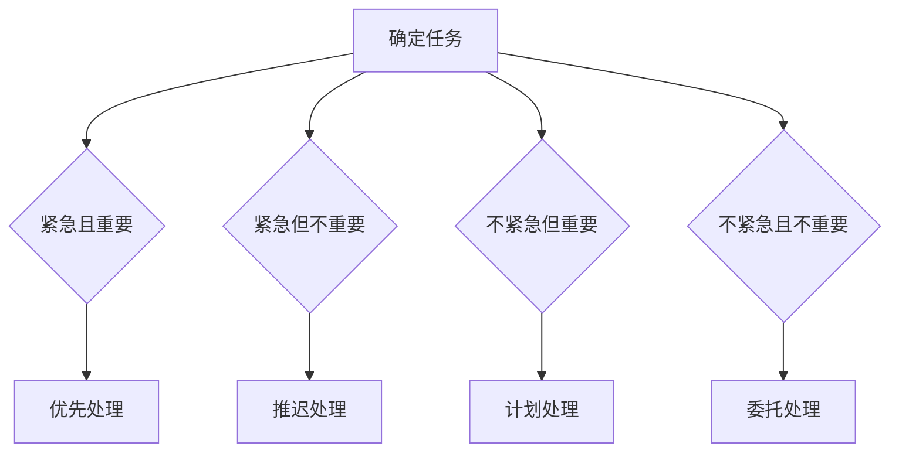

                 

# 领导者的时间管理：平衡紧急与重要

> 关键词：时间管理、领导力、紧急任务、重要任务、优先级、效率

> 摘要：本文将深入探讨领导者如何运用时间管理技巧，在紧急与重要任务之间找到平衡，提升工作效率和团队绩效。

## 1. 背景介绍

在现代快节奏的工作环境中，领导者面临着诸多挑战，其中包括如何高效管理时间和资源。有效的时间管理不仅是个人成功的基石，也是团队和组织整体效能的关键因素。领导者不仅需要关注日常的运营事务，还要应对突发紧急事件和长期重要任务的规划。这种平衡往往需要细致的时间管理策略和自我认知。

本文将探讨领导者如何通过时间管理技巧，特别是在处理紧急与重要任务时，实现个人和团队的目标。我们将从理论层面介绍核心概念，并通过实际案例和具体操作步骤，帮助读者理解如何在复杂的工作环境中做出明智的时间管理决策。

## 2. 核心概念与联系

### 2.1 紧急任务与重要任务的区分

在时间管理中，区分紧急任务与重要任务是至关重要的。以下是两者的基本定义和特点：

- **紧急任务**：通常指那些需要立即关注和处理的事件，可能会对组织的正常运营或个人形象造成负面影响。比如，突然的系统故障、客户投诉或紧急会议。

- **重要任务**：通常指那些对长期目标和组织战略有深远影响的工作，可能不会立即引起关注，但忽视它们会导致长远问题。比如，市场调研、战略规划或长期客户关系建设。

### 2.2 任务优先级的确定

确定任务优先级是时间管理的核心。以下是一些常用的方法：

- **四象限法则**：将任务分为四个象限，分别对应紧急且重要、紧急但不重要、不紧急但重要、不紧急且不重要。领导者应优先处理紧急且重要的任务，然后是重要但不紧急的任务。

- **任务评分法**：根据任务的紧急程度和重要性进行评分，例如使用1-5分进行打分，分数越高表示任务越紧急和重要。

### 2.3 Mermaid 流程图

以下是一个简单的Mermaid流程图，展示如何处理紧急与重要任务：



## 3. 核心算法原理 & 具体操作步骤

### 3.1 时间管理算法原理

时间管理算法的核心在于将任务优先级和执行时间进行有效匹配。以下是一种简单的时间管理算法：

1. **任务评分**：为每个任务分配紧急程度（E）和重要性（I）的评分，如E1-I5。

2. **计算优先级**：使用公式 P = 0.6E + 0.4I 计算每个任务的优先级 P。

3. **任务排序**：根据优先级 P 从高到低对任务进行排序。

4. **任务执行**：按照排序结果，优先执行优先级高的任务。

### 3.2 具体操作步骤

以下是具体操作步骤：

1. **任务收集**：收集所有需要完成的任务。

2. **任务评分**：为每个任务进行紧急程度和重要性的评分。

3. **计算优先级**：使用上述公式计算每个任务的优先级。

4. **任务排序**：按照优先级排序。

5. **任务执行**：优先执行排序后的高优先级任务。

6. **任务反馈**：执行任务后，进行反馈和调整。

## 4. 数学模型和公式 & 详细讲解 & 举例说明

### 4.1 时间管理模型

时间管理模型的基本公式如下：

\[ P = 0.6E + 0.4I \]

- \( P \)：任务的优先级。
- \( E \)：任务的紧急程度评分。
- \( I \)：任务的重要性评分。

### 4.2 举例说明

假设有以下任务：

- 任务A：紧急程度 E=4，重要性 I=5。
- 任务B：紧急程度 E=3，重要性 I=4。
- 任务C：紧急程度 E=2，重要性 I=3。

使用上述公式计算每个任务的优先级：

\[ P_A = 0.6 \times 4 + 0.4 \times 5 = 2.8 + 2 = 4.8 \]
\[ P_B = 0.6 \times 3 + 0.4 \times 4 = 1.8 + 1.6 = 3.4 \]
\[ P_C = 0.6 \times 2 + 0.4 \times 3 = 1.2 + 1.2 = 2.4 \]

根据计算结果，任务A的优先级最高，应首先执行。

## 5. 项目实战：代码实际案例和详细解释说明

### 5.1 开发环境搭建

为了演示时间管理算法的应用，我们将使用Python编程语言。以下是开发环境搭建的步骤：

1. 安装Python：下载并安装Python 3.8或更高版本。
2. 安装IDE：推荐使用PyCharm或VS Code作为Python开发环境。
3. 安装相关库：使用pip安装numpy、matplotlib等库。

```shell
pip install numpy matplotlib
```

### 5.2 源代码详细实现和代码解读

以下是一个简单的Python脚本，用于实现时间管理算法：

```python
import numpy as np

# 任务类
class Task:
    def __init__(self, name, emergency, importance):
        self.name = name
        self.emergency = emergency
        self.importance = importance
        self.priority = 0

    def calculate_priority(self):
        self.priority = 0.6 * self.emergency + 0.4 * self.importance

# 添加任务
tasks = [
    Task("任务A", 4, 5),
    Task("任务B", 3, 4),
    Task("任务C", 2, 3)
]

# 计算任务优先级
for task in tasks:
    task.calculate_priority()

# 排序任务
sorted_tasks = sorted(tasks, key=lambda x: x.priority, reverse=True)

# 打印任务列表
print("任务列表：")
for task in sorted_tasks:
    print(f"{task.name} - 优先级：{task.priority}")

# 执行任务
for task in sorted_tasks:
    print(f"执行{task.name}...")

```

### 5.3 代码解读与分析

- **Task 类**：定义了一个任务类，包含任务名称、紧急程度、重要性和优先级。
- **calculate_priority 方法**：计算任务优先级。
- **sorted_tasks 变量**：使用sorted函数按照优先级排序任务。
- **打印任务列表和执行任务**：输出排序后的任务列表并执行。

### 6. 实际应用场景

在实际工作中，时间管理算法可以根据不同场景进行调整。例如：

- **团队项目**：在项目规划中，优先处理对项目成功至关重要的任务。
- **日常管理**：在日程安排中，优先处理紧急且重要的工作，避免因小失大。
- **个人成长**：在个人发展规划中，关注长期目标和持续学习，避免被日常琐事干扰。

### 7. 工具和资源推荐

#### 7.1 学习资源推荐

- 《时间管理：如何高效利用时间》
- 《原则：生活与工作的决策指南》
- 《深度工作：如何有效利用每一点脑力》

#### 7.2 开发工具框架推荐

- PyCharm：强大的Python IDE，支持多种开发需求。
- Trello：项目管理工具，有助于任务排序和跟踪。
- Asana：团队协作工具，支持任务分配和进度跟踪。

#### 7.3 相关论文著作推荐

- 《领导者的时间管理策略研究》
- 《紧急任务与重要任务的平衡策略》
- 《基于时间管理的企业绩效分析》

## 8. 总结：未来发展趋势与挑战

随着技术的发展和工作环境的不断变化，时间管理在领导者角色中的重要性日益凸显。未来，我们可能会看到更多智能化、个性化的时间管理工具和算法。然而，这同时也带来了新的挑战，如如何在不断变化的环境中保持灵活性，以及如何平衡个人和团队的时间管理需求。

## 9. 附录：常见问题与解答

### 9.1 问题1：紧急任务和重要任务如何平衡？

解答：紧急任务和重要任务之间的平衡需要根据具体情况进行调整。一般情况下，应优先处理紧急且重要的任务，然后是重要但不紧急的任务。长期来看，重要任务对于组织的长远发展至关重要，但也不能忽视紧急任务，否则可能导致短期内的混乱和损失。

### 9.2 问题2：如何提高时间管理效率？

解答：提高时间管理效率的方法包括：

- 制定明确的目标和计划。
- 使用任务管理工具，如Trello或Asana。
- 定期回顾和调整时间管理策略。
- 学会说“不”，避免过度承诺。

## 10. 扩展阅读 & 参考资料

- 《高效能人士的七个习惯》史蒂芬·柯维
- 《如何高效学习》斯科特·扬
- 《时间管理心理学》理查德·科克曼

### 作者

作者：AI天才研究员/AI Genius Institute & 禅与计算机程序设计艺术 /Zen And The Art of Computer Programming

本文旨在通过深入分析领导者如何在紧急与重要任务之间进行有效管理，帮助读者理解时间管理的重要性和方法。通过理论和实践相结合，希望读者能够在实际工作中应用这些技巧，提高个人和团队的绩效。

