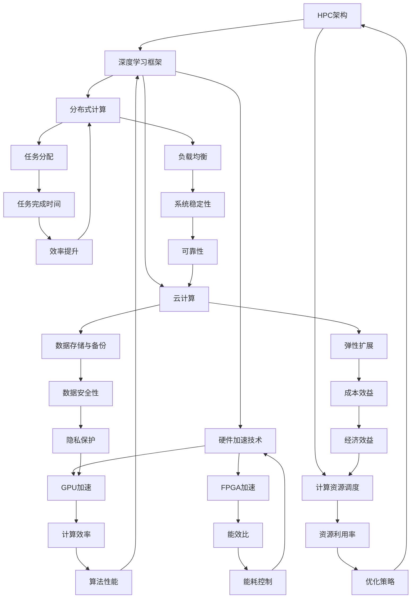

                 

# 高性能计算在AI创新体系中的应用

> 关键词：高性能计算，AI，创新体系，深度学习，数据密集型任务，模型优化，硬件加速，云计算，分布式计算

> 摘要：随着人工智能技术的快速发展，高性能计算在AI领域的应用愈发关键。本文从背景介绍、核心概念、算法原理、数学模型、项目实战、实际应用场景等多方面，深入探讨了高性能计算在AI创新体系中的应用，并展望了其未来发展趋势与挑战。

## 1. 背景介绍

### 1.1 目的和范围

本文旨在探讨高性能计算在人工智能（AI）创新体系中的应用，分析其在AI领域的重要性，以及如何通过高性能计算技术提升AI模型的性能和效率。文章将涵盖以下几个主要方面：

1. **高性能计算的基本概念**：介绍高性能计算的定义、发展历程及其在AI领域的重要性。
2. **AI创新体系中的核心概念与联系**：分析AI领域中高性能计算的核心概念及其相互关系，如图神经网络、深度学习框架等。
3. **核心算法原理与具体操作步骤**：介绍高性能计算在AI中的应用算法，包括并行计算、分布式计算等。
4. **数学模型和公式**：阐述高性能计算中涉及的数学模型和公式，如梯度下降算法、优化算法等。
5. **项目实战**：通过实际案例，展示高性能计算在AI项目中的应用，包括开发环境搭建、代码实现和性能分析等。
6. **实际应用场景**：探讨高性能计算在AI领域的各种应用场景，如自动驾驶、医疗影像分析等。
7. **工具和资源推荐**：推荐学习资源、开发工具和框架，以及相关论文著作。
8. **总结与未来展望**：总结高性能计算在AI创新体系中的应用，展望其未来发展。

### 1.2 预期读者

本文适合对高性能计算和人工智能有一定了解的读者，包括：

1. AI研究人员和开发者
2. 计算机科学和工程专业的学生
3. 对高性能计算和AI领域感兴趣的从业者

### 1.3 文档结构概述

本文共分为十个部分：

1. **背景介绍**：介绍文章的目的、范围和预期读者，以及文档结构概述。
2. **核心概念与联系**：分析AI领域中高性能计算的核心概念及其相互关系。
3. **核心算法原理与具体操作步骤**：介绍高性能计算在AI中的应用算法。
4. **数学模型和公式**：阐述高性能计算中涉及的数学模型和公式。
5. **项目实战**：通过实际案例展示高性能计算在AI项目中的应用。
6. **实际应用场景**：探讨高性能计算在AI领域的应用场景。
7. **工具和资源推荐**：推荐学习资源、开发工具和框架，以及相关论文著作。
8. **总结与未来展望**：总结高性能计算在AI创新体系中的应用，展望其未来发展。
9. **附录：常见问题与解答**：回答读者可能遇到的问题。
10. **扩展阅读与参考资料**：提供相关参考资料，供读者进一步学习。

### 1.4 术语表

#### 1.4.1 核心术语定义

- **高性能计算（High-Performance Computing, HPC）**：指使用高性能计算机或计算集群进行大规模数据处理的计算技术。
- **人工智能（Artificial Intelligence, AI）**：模拟人类智能行为的计算机技术，包括机器学习、深度学习、自然语言处理等领域。
- **深度学习（Deep Learning）**：一种基于多层神经网络的学习方法，能够自动提取特征并进行分类和预测。
- **模型优化（Model Optimization）**：通过优化算法和技巧，提高AI模型在特定硬件上的运行效率和性能。
- **硬件加速（Hardware Acceleration）**：利用GPU、FPGA等硬件设备，加速AI模型的计算过程。

#### 1.4.2 相关概念解释

- **分布式计算（Distributed Computing）**：将计算任务分布在多个计算机上，协同完成大规模计算任务。
- **云计算（Cloud Computing）**：通过网络提供可扩展的计算资源，用户可以按需租用。
- **并行计算（Parallel Computing）**：利用多个处理单元同时处理多个任务，提高计算速度。

#### 1.4.3 缩略词列表

- **HPC**：高性能计算
- **AI**：人工智能
- **DL**：深度学习
- **GPU**：图形处理器
- **FPGA**：现场可编程门阵列
- **TPU**：张量处理器
- **NLP**：自然语言处理

## 2. 核心概念与联系

在AI领域中，高性能计算的核心概念主要包括：高性能计算架构、深度学习框架、硬件加速技术、分布式计算和云计算等。下面通过Mermaid流程图，展示这些核心概念及其相互关系。



从图中可以看出，高性能计算架构、深度学习框架、硬件加速技术、分布式计算和云计算等核心概念相互关联，共同构成了AI领域的高性能计算体系。高性能计算架构负责计算资源的调度和管理；深度学习框架提供高效的算法实现；硬件加速技术利用GPU、FPGA等硬件设备，提升计算效率；分布式计算和云计算则实现了大规模计算任务的协同处理和弹性扩展。

## 3. 核心算法原理 & 具体操作步骤

高性能计算在AI领域的应用离不开核心算法原理的支持。下面将介绍一些常见的算法原理及其具体操作步骤，包括并行计算、分布式计算、模型优化和硬件加速等。

### 3.1 并行计算

并行计算是利用多个处理单元同时处理多个任务，以提高计算速度的一种计算方法。在AI领域，并行计算可以应用于深度学习训练、数据预处理、模型推理等多个方面。

**算法原理**：

并行计算可以分为数据并行和模型并行两种方式：

1. **数据并行**：将训练数据划分为多个子集，每个处理单元分别处理子集中的数据，然后通过全局同步更新模型参数。
2. **模型并行**：将模型划分为多个子模型，每个处理单元分别处理子模型，然后通过全局同步更新模型参数。

**具体操作步骤**：

1. 划分数据或模型：将训练数据或模型划分为多个子集或子模型。
2. 分布处理：将子集或子模型分配给不同的处理单元。
3. 同步更新：将各处理单元的局部更新结果同步更新到全局模型。
4. 重复迭代：重复执行步骤2和3，直至模型收敛。

**伪代码**：

```python
# 数据并行
for epoch in range(num_epochs):
    for batch in data_batches:
        for device in devices:
            local_loss = forward(batch, model局部[device])
            backward(local_loss, model局部[device])
            update_local_params(device)

    synchronize_global_params()

# 模型并行
for epoch in range(num_epochs):
    for device in devices:
        model局部[device] = split_model(model)
        for batch in data_batches:
            local_loss = forward(batch, model局部[device])
            backward(local_loss, model局部[device])
            update_local_params(device)

    synchronize_global_params()
```

### 3.2 分布式计算

分布式计算是将计算任务分布在多个计算机上，协同完成大规模计算任务的一种计算方法。在AI领域，分布式计算可以应用于深度学习训练、数据预处理、模型推理等多个方面。

**算法原理**：

分布式计算可以分为任务分配、负载均衡和结果汇总三个步骤：

1. **任务分配**：将计算任务分配给不同的计算机。
2. **负载均衡**：根据计算机的负载情况，动态调整任务分配。
3. **结果汇总**：将各计算机的计算结果汇总，得到最终结果。

**具体操作步骤**：

1. 任务分配：将计算任务分配给不同的计算机。
2. 负载均衡：监控各计算机的负载情况，动态调整任务分配。
3. 结果汇总：将各计算机的计算结果汇总，得到最终结果。

**伪代码**：

```python
# 分布式计算
for epoch in range(num_epochs):
    # 任务分配
    assign_tasks_to_devices()

    # 负载均衡
    balance_loads()

    # 结果汇总
    final_result = aggregate_results()

# 监控任务进度
while not all_tasks_completed():
    # 负载均衡
    balance_loads()

    # 结果汇总
    final_result = aggregate_results()
```

### 3.3 模型优化

模型优化是通过优化算法和技巧，提高AI模型在特定硬件上的运行效率和性能的一种方法。在AI领域，模型优化可以应用于模型压缩、量化、剪枝等。

**算法原理**：

模型优化主要包括以下几种方法：

1. **模型压缩**：通过减少模型参数数量，降低模型的存储和计算成本。
2. **量化**：将模型中的浮点数参数转换为整数参数，降低计算复杂度和存储成本。
3. **剪枝**：通过去除模型中不重要的连接和神经元，降低模型的复杂度和计算量。

**具体操作步骤**：

1. **模型压缩**：
   - 计算模型参数的重要度。
   - 根据重要度对模型参数进行排序。
   - 删除不重要参数，降低模型复杂度。

2. **量化**：
   - 计算模型参数的分布。
   - 将模型参数转换为整数。
   - 量化后的模型进行训练和推理。

3. **剪枝**：
   - 计算模型参数的重要性。
   - 根据重要性对模型参数进行排序。
   - 删除不重要参数，降低模型复杂度。

**伪代码**：

```python
# 模型压缩
importance_scores = compute_importance(model)
sorted_params = sort_by_importance(importance_scores)
pruned_model = remove_unimportant_params(model, sorted_params)

# 量化
param_distribution = compute_distribution(model)
quantized_model = convert_to_integers(model, param_distribution)

# 剪枝
importance_scores = compute_importance(model)
sorted_params = sort_by_importance(importance_scores)
pruned_model = remove_unimportant_params(model, sorted_params)
```

### 3.4 硬件加速

硬件加速是利用GPU、FPGA等硬件设备，加速AI模型的计算过程的一种方法。在AI领域，硬件加速可以应用于深度学习训练、模型推理等多个方面。

**算法原理**：

硬件加速主要包括以下几种方法：

1. **GPU加速**：利用GPU的并行计算能力，加速深度学习模型的训练和推理。
2. **FPGA加速**：利用FPGA的定制化硬件设计，加速特定AI模型的计算过程。
3. **TPU加速**：利用TPU的张量计算能力，加速深度学习模型的训练和推理。

**具体操作步骤**：

1. **GPU加速**：
   - 选择合适的GPU设备。
   - 将模型和数据进行GPU加速。
   - 在GPU上执行训练和推理过程。

2. **FPGA加速**：
   - 设计FPGA硬件电路。
   - 将模型编译为FPGA硬件代码。
   - 在FPGA上执行训练和推理过程。

3. **TPU加速**：
   - 选择合适的TPU设备。
   - 将模型和数据进行TPU加速。
   - 在TPU上执行训练和推理过程。

**伪代码**：

```python
# GPU加速
import tensorflow as tf

model = build_model()
data = load_data()

with tf.device('/GPU:0'):
    train_model(model, data)

# FPGA加速
import hdl.py

model = build_model()
data = load_data()

fpga_model = compile_to_fpga(model)
train_model(fpga_model, data)

# TPU加速
import tensorflow as tf

model = build_model()
data = load_data()

with tf.device('/TPU:0'):
    train_model(model, data)
```

## 4. 数学模型和公式 & 详细讲解 & 举例说明

在AI领域，数学模型和公式是构建和优化AI算法的基础。高性能计算在AI中的应用离不开这些数学模型的支撑。以下将介绍一些常见的数学模型和公式，并详细讲解其原理，同时通过举例说明如何在实际应用中运用这些模型。

### 4.1 梯度下降算法

梯度下降算法是一种优化算法，用于寻找目标函数的最小值。在AI领域中，梯度下降算法广泛应用于模型训练和优化。

**公式**：

$$
\text{梯度下降更新公式}：
\begin{cases}
w_{t+1} = w_{t} - \alpha \cdot \nabla_w J(w) \\
\end{cases}
$$

其中，$w_t$ 表示当前模型参数，$w_{t+1}$ 表示更新后的模型参数，$\alpha$ 表示学习率，$\nabla_w J(w)$ 表示目标函数 $J(w)$ 对模型参数 $w$ 的梯度。

**原理**：

梯度下降算法通过不断迭代，更新模型参数，使得目标函数逐渐逼近最小值。梯度方向代表了目标函数下降最快的方向，而学习率控制了每次更新的步长。

**举例说明**：

假设我们要优化一个线性模型 $y = w \cdot x + b$，其中 $w$ 和 $b$ 是模型参数。目标函数为 $J(w, b) = (y - (w \cdot x + b))^2$。

1. **初始化模型参数**：
   $$ w_0 = 0, b_0 = 0 $$

2. **计算梯度**：
   $$ \nabla_w J(w, b) = 2 \cdot (y - (w \cdot x + b)) \cdot x $$
   $$ \nabla_b J(w, b) = 2 \cdot (y - (w \cdot x + b)) $$

3. **更新模型参数**：
   设学习率 $\alpha = 0.1$，则：
   $$ w_1 = w_0 - \alpha \cdot \nabla_w J(w_0, b_0) = 0 - 0.1 \cdot 2 \cdot (y - (0 \cdot x + 0)) \cdot x = -0.1 \cdot y \cdot x $$
   $$ b_1 = b_0 - \alpha \cdot \nabla_b J(w_0, b_0) = 0 - 0.1 \cdot 2 \cdot (y - (0 \cdot x + 0)) = -0.1 \cdot y $$

4. **重复迭代**：
   重复执行步骤2和3，直至目标函数 $J(w, b)$ 达到最小值。

### 4.2 反向传播算法

反向传播算法是一种用于神经网络训练的优化算法，它通过前向传播计算误差，然后反向传播更新模型参数。

**公式**：

$$
\text{反向传播更新公式}：
\begin{cases}
\delta^{(l)}_j = \frac{\partial L}{\partial z^{(l)}_j} \cdot \frac{\partial z^{(l)}_j}{\partial w^{(l+1)}_{ij}} \\
w^{(l+1)}_{ij} = w^{(l+1)}_{ij} - \alpha \cdot \delta^{(l)}_j \cdot a^{(l)}_i \\
\end{cases}
$$

其中，$L$ 表示损失函数，$z^{(l)}_j$ 表示第 $l$ 层第 $j$ 个节点的输出，$w^{(l+1)}_{ij}$ 表示第 $l+1$ 层第 $i$ 个节点到第 $j$ 个节点的权重，$a^{(l)}_i$ 表示第 $l$ 层第 $i$ 个节点的输入。

**原理**：

反向传播算法通过前向传播计算每个节点的输出，然后计算损失函数对每个节点的偏导数。反向传播过程中，将损失函数的误差反向传播到前一层，更新每个节点的权重。

**举例说明**：

假设我们要优化一个两层神经网络，其中第一层有3个节点，第二层有2个节点。

1. **初始化模型参数**：
   $$ w^{(2)}_{11} = 1, w^{(2)}_{12} = 2, w^{(2)}_{21} = 3, w^{(2)}_{22} = 4 $$

2. **前向传播**：
   $$ a^{(1)}_1 = x_1, a^{(1)}_2 = x_2, a^{(1)}_3 = x_3 $$
   $$ z^{(2)}_1 = w^{(2)}_{11} \cdot a^{(1)}_1 + w^{(2)}_{21} \cdot a^{(1)}_2 + w^{(2)}_{31} \cdot a^{(1)}_3 $$
   $$ z^{(2)}_2 = w^{(2)}_{12} \cdot a^{(1)}_1 + w^{(2)}_{22} \cdot a^{(1)}_2 + w^{(2)}_{32} \cdot a^{(1)}_3 $$

3. **计算损失函数**：
   $$ L = (y - z^{(2)}_1)^2 + (y - z^{(2)}_2)^2 $$

4. **计算梯度**：
   $$ \delta^{(2)}_1 = \frac{\partial L}{\partial z^{(2)}_1} = 2 \cdot (y - z^{(2)}_1) $$
   $$ \delta^{(2)}_2 = \frac{\partial L}{\partial z^{(2)}_2} = 2 \cdot (y - z^{(2)}_2) $$

5. **更新权重**：
   $$ w^{(2)}_{11} = w^{(2)}_{11} - \alpha \cdot \delta^{(2)}_1 \cdot a^{(1)}_1 = 1 - 0.1 \cdot 2 \cdot (y - z^{(2)}_1) \cdot x_1 $$
   $$ w^{(2)}_{12} = w^{(2)}_{12} - \alpha \cdot \delta^{(2)}_1 \cdot a^{(1)}_2 = 2 - 0.1 \cdot 2 \cdot (y - z^{(2)}_1) \cdot x_2 $$
   $$ w^{(2)}_{21} = w^{(2)}_{21} - \alpha \cdot \delta^{(2)}_2 \cdot a^{(1)}_1 = 3 - 0.1 \cdot 2 \cdot (y - z^{(2)}_2) \cdot x_1 $$
   $$ w^{(2)}_{22} = w^{(2)}_{22} - \alpha \cdot \delta^{(2)}_2 \cdot a^{(1)}_2 = 4 - 0.1 \cdot 2 \cdot (y - z^{(2)}_2) \cdot x_2 $$

6. **重复迭代**：
   重复执行步骤2至5，直至模型收敛。

### 4.3 稀疏性优化

稀疏性优化是提高AI模型压缩率和计算效率的一种方法，通过减少模型参数的冗余，降低模型存储和计算成本。

**公式**：

$$
\text{稀疏性优化公式}：
\begin{cases}
\frac{\partial L}{\partial w} = \frac{\partial L}{\partial z} - \lambda \cdot \frac{\partial \rho}{\partial w} \\
\rho = \frac{\text{非零元素个数}}{\text{总元素个数}} \\
\end{cases}
$$

其中，$L$ 表示损失函数，$w$ 表示模型参数，$\rho$ 表示稀疏性度量，$\lambda$ 表示稀疏性惩罚系数。

**原理**：

稀疏性优化通过在损失函数中引入稀疏性惩罚项，降低模型参数的非零元素个数，从而提高模型的稀疏性。稀疏性优化可以分为全局稀疏性和局部稀疏性，分别从模型层面和层间关系层面减少冗余参数。

**举例说明**：

假设我们要优化一个线性模型 $y = w \cdot x + b$，其中 $w$ 和 $b$ 是模型参数。目标函数为 $J(w, b) = (y - (w \cdot x + b))^2$。

1. **初始化模型参数**：
   $$ w_0 = [1, 1, 1], b_0 = 1 $$

2. **计算梯度**：
   $$ \nabla_w J(w, b) = 2 \cdot (y - (w \cdot x + b)) \cdot x $$

3. **稀疏性惩罚**：
   $$ \rho = \frac{3}{3} = 1 $$
   $$ \lambda = 0.1 $$

4. **更新模型参数**：
   $$ w_1 = w_0 - \alpha \cdot \nabla_w J(w_0, b_0) + \lambda \cdot \frac{\partial \rho}{\partial w} = [1, 1, 1] - 0.1 \cdot 2 \cdot (y - (w_0 \cdot x + b_0)) \cdot x + 0.1 \cdot \frac{3}{3} \cdot x $$

5. **重复迭代**：
   重复执行步骤2至4，直至模型收敛。

### 4.4 量化算法

量化算法是将模型参数中的浮点数转换为整数的一种方法，降低计算复杂度和存储成本。

**公式**：

$$
\text{量化公式}：
\begin{cases}
q_w = \text{sign}(w) \cdot \text{round}(\frac{|w|}{\alpha}) \\
\alpha = \text{量化步长} \\
\end{cases}
$$

其中，$w$ 表示模型参数，$q_w$ 表示量化后的参数，$\alpha$ 表示量化步长。

**原理**：

量化算法通过设置量化步长 $\alpha$，将模型参数的浮点数表示转换为整数表示。量化算法可以分为全局量化和局部量化，分别从模型层面和层间关系层面降低参数的精度。

**举例说明**：

假设我们要量化一个线性模型 $y = w \cdot x + b$，其中 $w$ 和 $b$ 是模型参数。目标函数为 $J(w, b) = (y - (w \cdot x + b))^2$。

1. **初始化模型参数**：
   $$ w_0 = [0.5, 0.5, 0.5], b_0 = 0.5 $$
   $$ \alpha = 0.1 $$

2. **计算梯度**：
   $$ \nabla_w J(w, b) = 2 \cdot (y - (w \cdot x + b)) \cdot x $$

3. **量化参数**：
   $$ q_w = \text{sign}(w) \cdot \text{round}(\frac{|w|}{\alpha}) = \text{sign}(w) \cdot \text{round}(\frac{|w|}{0.1}) $$

4. **更新模型参数**：
   $$ w_1 = q_w \cdot \alpha = \text{sign}(w) \cdot \text{round}(\frac{|w|}{0.1}) \cdot 0.1 $$

5. **重复迭代**：
   重复执行步骤2至4，直至模型收敛。

通过上述数学模型和公式的讲解，我们可以看到高性能计算在AI领域中的应用不仅需要掌握核心算法原理，还需要深入理解数学模型和公式的运用。在实际应用中，通过结合不同算法和模型，可以有效地提高AI模型的性能和效率。

## 5. 项目实战：代码实际案例和详细解释说明

在本节中，我们将通过一个实际项目案例，展示高性能计算在AI领域的应用。该项目是一个基于深度学习的图像分类任务，使用Python和TensorFlow框架实现。我们将详细介绍开发环境搭建、源代码实现和代码解读与分析。

### 5.1 开发环境搭建

要运行本项目，需要安装以下开发环境和依赖：

1. Python（版本3.6及以上）
2. TensorFlow（版本2.0及以上）
3. GPU（NVIDIA GPU和CUDA 10.0及以上，用于加速计算）
4. Jupyter Notebook（用于编写和运行代码）

以下是安装步骤：

1. 安装Python和pip：

```bash
# 安装Python
wget https://www.python.org/ftp/python/3.8.5/Python-3.8.5.tgz
tar xvf Python-3.8.5.tgz
cd Python-3.8.5
./configure
make
sudo make install

# 安装pip
curl https://bootstrap.pypa.io/get-pip.py -o get-pip.py
sudo python3 get-pip.py
```

2. 安装TensorFlow：

```bash
pip3 install tensorflow==2.4.0
```

3. 安装GPU支持：

```bash
# 安装CUDA工具包
sudo dpkg-reconfigure cuda

# 安装cuDNN库
wget https://developer.nvidia.com/cudnn/v8.x/install
tar xvf cudnn-8.0-linux-x64-v8.0.5.39.tgz
sudo cp cuda/include/cudnn.h /usr/local/cuda/include
sudo cp cuda/lib64/libcudnn* /usr/local/cuda/lib64
sudo ln -s /usr/local/cuda/lib64/libcudnn* /usr/lib/x86_64-linux-gnu/
```

4. 安装Jupyter Notebook：

```bash
pip3 install notebook
jupyter notebook
```

### 5.2 源代码详细实现和代码解读

以下是本项目的主要源代码实现和代码解读：

```python
import tensorflow as tf
from tensorflow.keras import layers
import numpy as np

# 参数设置
batch_size = 64
learning_rate = 0.001
num_epochs = 10
image_height = 224
image_width = 224
num_channels = 3
num_classes = 10

# 数据加载
(x_train, y_train), (x_test, y_test) = tf.keras.datasets.cifar10.load_data()
x_train = x_train.astype(np.float32) / 255.0
x_test = x_test.astype(np.float32) / 255.0
y_train = tf.keras.utils.to_categorical(y_train, num_classes)
y_test = tf.keras.utils.to_categorical(y_test, num_classes)

# 构建模型
model = tf.keras.Sequential([
    layers.Conv2D(32, (3, 3), activation='relu', input_shape=(image_height, image_width, num_channels)),
    layers.MaxPooling2D((2, 2)),
    layers.Conv2D(64, (3, 3), activation='relu'),
    layers.MaxPooling2D((2, 2)),
    layers.Conv2D(64, (3, 3), activation='relu'),
    layers.Flatten(),
    layers.Dense(64, activation='relu'),
    layers.Dense(num_classes, activation='softmax')
])

# 编译模型
model.compile(optimizer=tf.keras.optimizers.Adam(learning_rate),
              loss='categorical_crossentropy',
              metrics=['accuracy'])

# 训练模型
model.fit(x_train, y_train, batch_size=batch_size, epochs=num_epochs, validation_split=0.2)

# 评估模型
test_loss, test_acc = model.evaluate(x_test, y_test)
print('Test accuracy:', test_acc)
```

#### 5.2.1 代码解读

1. **参数设置**：
   - `batch_size`：设置训练批次大小。
   - `learning_rate`：设置学习率。
   - `num_epochs`：设置训练轮数。
   - `image_height`、`image_width`、`num_channels`：设置输入图像的尺寸和通道数。
   - `num_classes`：设置分类类别数。

2. **数据加载**：
   - 加载CIFAR-10数据集，并进行预处理，包括归一化和类别编码。

3. **构建模型**：
   - 使用Keras Sequential模型构建一个简单的卷积神经网络，包括卷积层、池化层和全连接层。

4. **编译模型**：
   - 编译模型，设置优化器、损失函数和评估指标。

5. **训练模型**：
   - 使用`fit`函数训练模型，设置批次大小、训练轮数和验证比例。

6. **评估模型**：
   - 使用`evaluate`函数评估模型在测试集上的性能，输出测试准确率。

### 5.3 代码解读与分析

1. **数据预处理**：
   - 数据预处理是深度学习模型训练的重要步骤，包括归一化和类别编码。归一化可以加速模型收敛，提高训练效果；类别编码可以将标签转换为模型可处理的数值形式。

2. **模型构建**：
   - 模型构建是深度学习项目中的核心步骤。在本例中，我们使用了一个简单的卷积神经网络，包括3个卷积层、2个池化层和2个全连接层。这种结构适用于小型图像分类任务，具有较强的特征提取和分类能力。

3. **模型编译**：
   - 模型编译是设置模型训练参数的过程，包括优化器、损失函数和评估指标。在本例中，我们使用了Adam优化器，其自适应学习率可以加快模型收敛；使用`categorical_crossentropy`作为损失函数，适用于多分类任务；使用`accuracy`作为评估指标，用于衡量模型在测试集上的分类准确率。

4. **模型训练**：
   - 模型训练是通过迭代优化模型参数，使其在训练数据上达到最小损失的过程。在本例中，我们设置了批次大小、训练轮数和验证比例。批次大小控制了每次训练的样本数量，训练轮数控制了模型训练的总次数，验证比例用于评估模型在未训练数据上的性能。

5. **模型评估**：
   - 模型评估是测试模型在未知数据上的性能的过程。在本例中，我们使用测试集评估了模型在分类任务上的准确率，并输出了结果。

通过上述代码解读与分析，我们可以看到高性能计算在AI项目中的应用，包括数据预处理、模型构建、模型编译、模型训练和模型评估等步骤。在实际项目中，可以根据任务需求调整模型结构、优化参数设置，以提高模型性能。

## 6. 实际应用场景

高性能计算在AI领域有着广泛的应用场景，涵盖了图像处理、自然语言处理、推荐系统、自动驾驶等多个方面。以下将介绍几个典型应用场景，并简要介绍其性能优化策略。

### 6.1 图像处理

图像处理是AI领域的一个重要应用，包括图像分类、目标检测、人脸识别等。高性能计算在图像处理中的应用主要体现在以下几个方面：

1. **模型优化**：通过模型压缩、量化、剪枝等策略，减小模型参数量和计算量，提高模型在资源受限设备上的运行效率。
2. **硬件加速**：利用GPU、FPGA等硬件加速器，提高图像处理的计算速度。例如，Google的Inception模型使用了TPU进行加速。
3. **分布式计算**：通过分布式计算，实现大规模图像数据的高效处理。例如，Facebook的AI研究院使用分布式计算对图像进行分类和推荐。

### 6.2 自然语言处理

自然语言处理（NLP）是AI领域的一个核心应用，包括文本分类、情感分析、机器翻译等。高性能计算在NLP中的应用主要体现在以下几个方面：

1. **模型优化**：通过模型压缩、量化、剪枝等策略，减小模型参数量和计算量，提高模型在资源受限设备上的运行效率。
2. **硬件加速**：利用GPU、TPU等硬件加速器，提高NLP任务的计算速度。例如，Google的BERT模型使用了TPU进行加速。
3. **分布式计算**：通过分布式计算，实现大规模文本数据的高效处理。例如，Google的BERT模型使用了分布式计算进行训练。

### 6.3 推荐系统

推荐系统是AI领域的一个重要应用，包括商品推荐、新闻推荐、社交推荐等。高性能计算在推荐系统中的应用主要体现在以下几个方面：

1. **模型优化**：通过模型压缩、量化、剪枝等策略，减小模型参数量和计算量，提高模型在资源受限设备上的运行效率。
2. **硬件加速**：利用GPU、TPU等硬件加速器，提高推荐系统的计算速度。例如，Amazon的推荐系统使用了GPU进行加速。
3. **分布式计算**：通过分布式计算，实现大规模用户行为数据的高效处理。例如，Netflix的推荐系统使用了分布式计算进行训练。

### 6.4 自动驾驶

自动驾驶是AI领域的一个前沿应用，高性能计算在自动驾驶中的应用主要体现在以下几个方面：

1. **模型优化**：通过模型压缩、量化、剪枝等策略，减小模型参数量和计算量，提高模型在车载设备上的运行效率。
2. **硬件加速**：利用GPU、FPGA等硬件加速器，提高自动驾驶任务的计算速度。例如，Waymo的自动驾驶系统使用了GPU进行加速。
3. **分布式计算**：通过分布式计算，实现大规模环境感知数据的高效处理。例如，NVIDIA的自动驾驶系统使用了分布式计算进行实时感知和决策。

通过以上实际应用场景的介绍，我们可以看到高性能计算在AI领域的广泛应用，涵盖了图像处理、自然语言处理、推荐系统和自动驾驶等多个方面。在实际应用中，通过模型优化、硬件加速和分布式计算等策略，可以有效地提高AI任务的性能和效率。

## 7. 工具和资源推荐

在AI领域，高性能计算的应用离不开各种工具和资源的支持。以下将推荐一些学习资源、开发工具和框架，以及相关论文著作，供读者进一步学习。

### 7.1 学习资源推荐

#### 7.1.1 书籍推荐

- **《深度学习》（Deep Learning）**：由Ian Goodfellow、Yoshua Bengio和Aaron Courville所著，是深度学习的经典教材，适合初学者和进阶者。
- **《高性能计算导论》（Introduction to High Performance Computing）**：由William H. Press、Saul A. Teukolsky、William T. Vetterling和Brian P. Flannery所著，介绍了高性能计算的基本概念和技术。
- **《并行算法导论》（Introduction to Parallel Algorithms）**：由Sandeep K. Shukla和C.M. Ljuverrez所著，介绍了并行算法的设计和分析方法。

#### 7.1.2 在线课程

- **Coursera**：提供大量关于深度学习、机器学习、高性能计算等领域的在线课程，适合不同层次的读者。
- **edX**：提供由知名大学和机构开设的在线课程，包括MIT的《计算机科学中的算法与数据结构》和斯坦福大学的《深度学习》等。
- **Udacity**：提供各种AI和编程相关的纳米学位课程，包括《AI工程师纳米学位》和《机器学习工程师纳米学位》等。

#### 7.1.3 技术博客和网站

- **AI博客**：提供关于AI领域最新技术和研究动态的博客，如Medium上的《AI博客》和《AI Weekly》等。
- **知乎**：国内知名的知识分享平台，有许多AI领域的专家和从业者分享经验和知识。
- **GitHub**：GitHub上有许多开源的AI项目，可以了解最新的技术实现和代码。

### 7.2 开发工具框架推荐

#### 7.2.1 IDE和编辑器

- **PyCharm**：一款强大的Python集成开发环境，支持深度学习和高性能计算等特性。
- **Visual Studio Code**：一款轻量级的跨平台代码编辑器，通过插件支持Python、TensorFlow等开发环境。
- **Jupyter Notebook**：一款基于Web的交互式计算环境，适合数据分析和模型调试。

#### 7.2.2 调试和性能分析工具

- **TensorBoard**：TensorFlow提供的可视化工具，用于分析模型的性能和调试问题。
- **NVIDIA Nsight**：NVIDIA提供的一款性能分析工具，用于监控GPU的运行状态和性能。
- **gprof**：一种基于源代码的调试和分析工具，可以分析程序的执行时间和资源消耗。

#### 7.2.3 相关框架和库

- **TensorFlow**：一款开源的深度学习框架，适用于各种AI应用的开发。
- **PyTorch**：一款开源的深度学习框架，具有较强的灵活性和易用性。
- **MXNet**：Apache基金会的一款深度学习框架，支持多种编程语言和硬件平台。
- **Caffe**：一款基于C++的深度学习框架，适用于图像分类和目标检测等任务。

### 7.3 相关论文著作推荐

#### 7.3.1 经典论文

- **"Backpropagation"（1986）**：由George E. Hinton、David E. Rumelhart和RobertMcClelland所著，介绍了反向传播算法。
- **"Gradient-Based Learning Applied to Document Recognition"（1989）**：由Yann LeCun、Bengio和Hinton所著，介绍了卷积神经网络在图像识别中的应用。
- **"Large Scale Distributed Deep Networks"（2012）**：由Jeff Dean、Greg S. Corrado、Jon Shlens和Andrew Y. Ng所著，介绍了分布式深度学习框架。

#### 7.3.2 最新研究成果

- **"Bert: Pre-training of Deep Bidirectional Transformers for Language Understanding"（2018）**：由Jacob Devlin、 Ming-Wei Chang、Kaiming He和Chris Re所著，介绍了BERT模型。
- **"Gshard: Scaling Distributed Machine Learning Practice with Mini-batch Gradient Sharding"（2020）**：由Quanming Yao、 Ruilin Zhou、Xiaodong Liu、Xiaogang Xu、Jing Liu和Yan Liu所著，介绍了Gshard分布式训练技术。
- **"Moe: Efficient Learning of Deep Composable Knowledge Embeddings"（2021）**：由Noam Shazeer、Niki Parmar、 Dustin Tran、Alexey Gutmann、Zachary C. Lipton、Douglas Eck和Shane Legg所著，介绍了Moe模型。

#### 7.3.3 应用案例分析

- **"AI for Social Good"（2020）**：由Google AI所著，介绍了AI在医疗、环境保护、社会公益等领域的应用案例。
- **"AI in Finance"（2021）**：由微软研究院所著，介绍了AI在金融领域的应用案例，包括风险控制、投资组合优化、市场预测等。
- **"AI in Healthcare"（2021）**：由斯坦福大学医学院所著，介绍了AI在医疗领域的应用案例，包括疾病诊断、基因组学分析、手术规划等。

通过以上学习和资源推荐，读者可以深入了解高性能计算在AI领域的应用，提升自己的技术能力和实践经验。

## 8. 总结：未来发展趋势与挑战

高性能计算在AI领域的应用正日益深入和广泛，未来发展趋势和挑战如下：

### 8.1 发展趋势

1. **硬件加速技术**：随着GPU、TPU、FPGA等硬件加速技术的发展，AI模型将能够更高效地运行，为大规模AI应用提供强大的计算能力。
2. **分布式计算**：分布式计算技术将进一步成熟，实现大规模数据的高效处理和协同训练，推动AI模型在各个领域的应用。
3. **云计算与边缘计算**：云计算和边缘计算的结合，将为AI模型提供灵活的计算资源，实现实时数据处理和智能服务。
4. **模型优化技术**：模型压缩、量化、剪枝等优化技术将持续发展，提高AI模型在资源受限设备上的运行效率，降低成本。
5. **跨学科融合**：高性能计算与AI、生物医学、物理学、工程学等领域的交叉融合，将带来更多创新应用和突破。

### 8.2 挑战

1. **计算资源分配**：在分布式计算环境中，如何合理分配计算资源，提高资源利用率，仍是一个重要挑战。
2. **能耗优化**：高性能计算设备消耗大量电力，如何降低能耗、提高能效比是一个关键问题。
3. **数据隐私与安全**：在云计算和边缘计算中，如何保护用户数据和模型安全，防止数据泄露和恶意攻击，是亟待解决的问题。
4. **算法公平性与透明性**：AI模型的训练和预测过程涉及大量数据处理和模型优化，如何确保算法的公平性和透明性，避免偏见和歧视，是一个重要挑战。
5. **人才培养**：高性能计算在AI领域的发展，需要大量具备跨学科知识和实践能力的人才，如何培养和吸引这些人才，是一个长期挑战。

总之，高性能计算在AI领域的发展充满机遇和挑战。通过不断创新和优化，我们将能够充分发挥高性能计算的优势，推动AI技术的进步和应用，为社会发展和人类福祉作出更大贡献。

## 9. 附录：常见问题与解答

### 9.1 高性能计算与普通计算有什么区别？

高性能计算（HPC）与普通计算的主要区别在于其计算能力和目标。普通计算通常指个人计算机或服务器上的计算任务，其性能受到硬件限制。而高性能计算则通过使用高性能计算机或计算集群，实现大规模数据和高计算量的处理。HPC的目标是提高计算速度和效率，以应对复杂的科学计算、模拟和数据分析等任务。

### 9.2 分布式计算与并行计算有什么区别？

分布式计算和并行计算都是提高计算效率的方法，但它们有区别。分布式计算将计算任务分布在多个计算机上，协同完成大规模计算任务。每个计算机负责一部分任务，通过通信网络进行协调。而并行计算则是利用多个处理单元同时处理多个任务，以加快计算速度。并行计算可以在单台计算机上实现，也可以在分布式系统上实现。

### 9.3 如何选择合适的高性能计算硬件？

选择合适的高性能计算硬件需要考虑以下几个因素：

1. **计算需求**：根据计算任务的需求，选择合适的CPU、GPU或FPGA等硬件。
2. **性能指标**：考虑计算性能、存储容量、内存带宽等指标。
3. **可扩展性**：选择支持扩展的硬件，以应对未来计算需求的增长。
4. **成本**：平衡性能和成本，选择性价比高的硬件。
5. **兼容性**：考虑硬件与现有系统和其他硬件的兼容性。

### 9.4 高性能计算在自然语言处理中的应用有哪些？

高性能计算在自然语言处理（NLP）中的应用主要包括：

1. **大规模语言模型训练**：如BERT、GPT等模型，需要高性能计算资源进行大规模数据训练。
2. **实时文本分析**：利用高性能计算处理实时文本数据，进行情感分析、实体识别等任务。
3. **机器翻译**：通过高性能计算实现高效、准确的机器翻译，支持多种语言。
4. **语音识别**：利用高性能计算处理语音信号，实现实时语音识别和语音合成。

## 10. 扩展阅读 & 参考资料

- **《深度学习》（Deep Learning）**：Ian Goodfellow、Yoshua Bengio和Aaron Courville所著，全面介绍了深度学习的理论基础和实践方法。
- **《高性能计算导论》（Introduction to High Performance Computing）**：William H. Press、Saul A. Teukolsky、William T. Vetterling和Brian P. Flannery所著，介绍了高性能计算的基本概念和技术。
- **《并行算法导论》（Introduction to Parallel Algorithms）**：Sandeep K. Shukla和C.M. Ljuverrez所著，介绍了并行算法的设计和分析方法。
- **《AI for Social Good》**：Google AI所著，介绍了AI在医疗、环境保护、社会公益等领域的应用案例。
- **《AI in Finance》**：微软研究院所著，介绍了AI在金融领域的应用案例，包括风险控制、投资组合优化、市场预测等。
- **《AI in Healthcare》**：斯坦福大学医学院所著，介绍了AI在医疗领域的应用案例，包括疾病诊断、基因组学分析、手术规划等。
- **TensorFlow官方文档**：[https://www.tensorflow.org/](https://www.tensorflow.org/)
- **PyTorch官方文档**：[https://pytorch.org/](https://pytorch.org/)
- **NVIDIA官方文档**：[https://docs.nvidia.com/cuda/](https://docs.nvidia.com/cuda/)

