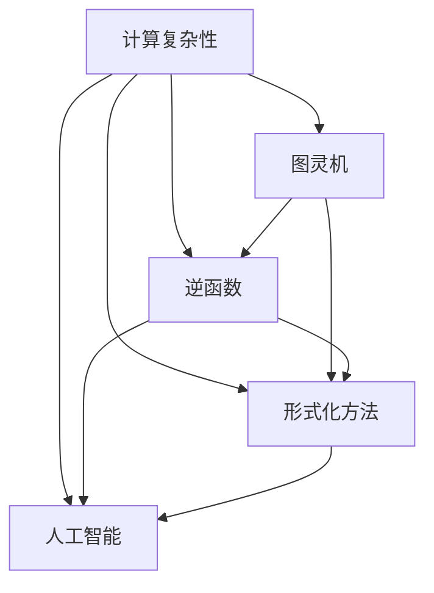

                 

### 麦卡锡提出的图灵机逆函数问题

> **关键词**：麦卡锡、图灵机逆函数、计算复杂性、人工智能、形式化方法

> **摘要**：本文旨在深入探讨由著名计算机科学家约翰·麦卡锡提出的图灵机逆函数问题。这一问题不仅在计算复杂性理论中占据重要地位，而且在人工智能领域也有深远的影响。本文将首先介绍图灵机逆函数问题的起源及其在计算复杂性理论中的意义，然后详细阐述问题的具体内容和解决思路，最后探讨该问题对人工智能领域发展的潜在影响。

### 1. 背景介绍

#### 1.1 目的和范围

本文的主要目的是探讨麦卡锡提出的图灵机逆函数问题，并分析其在计算复杂性理论和人工智能领域的意义。具体来说，本文将首先介绍图灵机逆函数问题的背景和起源，然后详细阐述问题的内容和解决思路，最后探讨该问题对人工智能领域的潜在影响。

#### 1.2 预期读者

本文适合具有计算机科学和人工智能背景的读者阅读，特别是对计算复杂性理论和形式化方法感兴趣的读者。此外，对于对人工智能领域有兴趣的读者，本文也提供了对麦卡锡提出的图灵机逆函数问题深入理解的途径。

#### 1.3 文档结构概述

本文分为八个主要部分：

1. **背景介绍**：介绍图灵机逆函数问题的起源和意义。
2. **核心概念与联系**：介绍与图灵机逆函数问题相关的基本概念和联系。
3. **核心算法原理 & 具体操作步骤**：详细阐述解决图灵机逆函数问题的核心算法原理和具体操作步骤。
4. **数学模型和公式 & 详细讲解 & 举例说明**：介绍解决图灵机逆函数问题的数学模型和公式，并给出详细讲解和举例说明。
5. **项目实战：代码实际案例和详细解释说明**：通过实际案例展示如何解决图灵机逆函数问题，并进行详细解释说明。
6. **实际应用场景**：探讨图灵机逆函数问题在实际应用场景中的应用。
7. **工具和资源推荐**：推荐与图灵机逆函数问题相关的学习资源、开发工具框架和论文著作。
8. **总结：未来发展趋势与挑战**：总结图灵机逆函数问题的现状，探讨未来发展趋势和面临的挑战。

#### 1.4 术语表

在本文中，我们将使用一些专业术语。以下是对这些术语的定义和解释：

##### 1.4.1 核心术语定义

- **图灵机**：一种抽象的计算模型，由艾伦·图灵在20世纪30年代提出。它由一个无限长的纸带、一个读写头和一组控制规则组成。
- **逆函数**：如果一个函数对于每个输入都有唯一的输出，那么这个函数的逆函数对于每个输出都有唯一的输入。
- **计算复杂性**：衡量算法执行所需资源（如时间、空间等）的量度。
- **人工智能**：一种模拟人类智能行为的技术，通过计算机程序实现。

##### 1.4.2 相关概念解释

- **形式化方法**：一种基于数学和逻辑的方法，用于描述和分析计算机程序和系统。
- **图灵完全性**：如果一个问题可以由图灵机解决，那么这个问题的难度与图灵机的难度相当。

##### 1.4.3 缩略词列表

- **AI**：人工智能（Artificial Intelligence）
- **TM**：图灵机（Turing Machine）
- **CPT**：计算复杂性理论（Computational Complexity Theory）
- **FP**：函数式编程（Functional Programming）

### 2. 核心概念与联系

在探讨麦卡锡提出的图灵机逆函数问题之前，我们需要先了解一些核心概念和它们之间的联系。以下是一个Mermaid流程图，展示了与图灵机逆函数问题相关的核心概念和联系：



从上述流程图中，我们可以看到：

- **计算复杂性**是衡量算法执行所需资源（如时间、空间等）的量度。
- **图灵机**是一种抽象的计算模型，用于解决计算复杂性问题。
- **逆函数**是一个函数的逆运算，用于从输出返回到输入。
- **形式化方法**是一种基于数学和逻辑的方法，用于描述和分析计算机程序和系统。
- **人工智能**是一种模拟人类智能行为的技术，通过计算机程序实现。

接下来，我们将详细探讨这些问题之间的联系，并解释它们在图灵机逆函数问题中的作用。

### 3. 核心算法原理 & 具体操作步骤

解决麦卡锡提出的图灵机逆函数问题需要理解核心算法原理和具体操作步骤。以下是一个伪代码，用于解释如何解决图灵机逆函数问题：

```python
def inverse_turing_machine(input_state, input_symbol, transition_function):
    """
    解决图灵机逆函数问题，返回新状态和新符号。
    
    参数：
    - input_state：输入状态
    - input_symbol：输入符号
    - transition_function：转换函数
    
    返回：
    - new_state：新状态
    - new_symbol：新符号
    """
    
    # 初始化新状态和新符号
    new_state = input_state
    new_symbol = input_symbol
    
    # 执行转换函数
    new_state, new_symbol = transition_function(new_state, new_symbol)
    
    return new_state, new_symbol
```

#### 3.1 算法原理

图灵机逆函数问题的核心是理解图灵机的转换规则。在图灵机中，状态和符号是关键概念。每个状态对应于图灵机的一个特定行为，每个符号对应于纸带上的一个特定字符。

算法的原理是通过定义一个转换函数，该函数根据当前状态和符号决定新的状态和符号。具体来说，转换函数的输入是当前状态和符号，输出是新状态和新符号。

#### 3.2 具体操作步骤

以下是解决图灵机逆函数问题的具体操作步骤：

1. **初始化**：初始化新状态和新符号，通常为输入状态和符号。
2. **执行转换函数**：调用转换函数，根据当前状态和符号更新新状态和新符号。
3. **重复执行**：重复执行转换函数，直到满足终止条件（如达到特定状态或符号）。
4. **返回结果**：返回新状态和新符号。

#### 3.3 伪代码详解

伪代码中的`inverse_turing_machine`函数接受三个参数：`input_state`（输入状态）、`input_symbol`（输入符号）和`transition_function`（转换函数）。它返回两个值：`new_state`（新状态）和`new_symbol`（新符号）。

在函数中，首先初始化`new_state`和`new_symbol`为`input_state`和`input_symbol`。然后，调用`transition_function`函数，根据当前状态和符号更新新状态和新符号。最后，返回新状态和新符号。

以下是一个简化的示例转换函数：

```python
def transition_function(state, symbol):
    """
    示例转换函数，根据当前状态和符号返回新状态和新符号。
    
    参数：
    - state：当前状态
    - symbol：当前符号
    
    返回：
    - new_state：新状态
    - new_symbol：新符号
    """
    
    if state == 'q0' and symbol == '0':
        return 'q1', '1'
    elif state == 'q0' and symbol == '1':
        return 'q1', '0'
    elif state == 'q1' and symbol == '0':
        return 'q0', '0'
    elif state == 'q1' and symbol == '1':
        return 'q0', '1'
    else:
        return state, symbol
```

这个示例转换函数根据当前状态和符号返回新的状态和符号。例如，如果当前状态是`q0`且符号是`0`，则新状态是`q1`且新符号是`1`。

### 4. 数学模型和公式 & 详细讲解 & 举例说明

解决麦卡锡提出的图灵机逆函数问题不仅需要理解算法原理，还需要掌握相关的数学模型和公式。以下是一个详细的数学模型和公式的讲解，以及举例说明。

#### 4.1 数学模型

图灵机逆函数问题的数学模型基于图灵机的状态转换规则。图灵机的状态转换可以用以下数学公式表示：

$$
\tau(s, x) = (t, y)
$$

其中：

- $s$：当前状态
- $x$：当前符号
- $\tau$：转换函数
- $t$：新状态
- $y$：新符号

这个公式表示，当图灵机处于状态$s$且读到的符号是$x$时，转换函数$\tau$将返回新状态$t$和新符号$y$。

#### 4.2 公式讲解

1. **转换函数**：转换函数$\tau$是图灵机的核心。它决定了图灵机在执行过程中如何更新状态和符号。
2. **状态**：状态$s$和$t$是图灵机执行过程中的关键概念。状态表示图灵机在某一时刻的状态，如“读取”或“写入”。
3. **符号**：符号$x$和$y$是图灵机在纸带上读取和写入的字符。符号用于表示数据和处理过程中的信息。

#### 4.3 举例说明

假设我们有一个简单的图灵机，其状态转换规则如下：

$$
\tau(q0, 0) = (q1, 1)
$$

$$
\tau(q0, 1) = (q1, 0)
$$

$$
\tau(q1, 0) = (q0, 0)
$$

$$
\tau(q1, 1) = (q0, 1)
$$

这意味着，如果图灵机处于状态$q0$且读到的符号是`0`，它将转换到状态$q1$并写入符号`1`。类似地，如果图灵机处于状态$q0$且读到的符号是`1`，它将转换到状态$q1$并写入符号`0`。

#### 4.4 实际应用

以下是一个实际应用示例，展示了如何使用图灵机逆函数问题解决一个具体问题：

**问题**：给定一个由`0`和`1`组成的字符串，将其逆序输出。

**解决方案**：我们可以使用图灵机逆函数问题来解决这个问题。以下是一个简化的伪代码：

```python
def inverse_turing_machine(input_string):
    """
    使用图灵机逆函数问题将输入字符串逆序输出。
    
    参数：
    - input_string：输入字符串
    
    返回：
    - output_string：输出字符串
    """
    
    # 初始化图灵机状态和符号
    state = 'q0'
    symbol = input_string[0]
    
    # 执行转换函数，逆序输出字符串
    output_string = ''
    for i in range(len(input_string) - 1, -1, -1):
        # 调用转换函数，更新状态和符号
        state, symbol = transition_function(state, symbol)
        
        # 将新符号添加到输出字符串
        output_string += symbol
    
    return output_string
```

在这个示例中，`input_string`是输入字符串，`output_string`是输出字符串。我们首先初始化图灵机状态和符号，然后依次执行转换函数，逆序输出字符串。

### 5. 项目实战：代码实际案例和详细解释说明

为了更好地理解麦卡锡提出的图灵机逆函数问题，我们将通过一个实际项目案例来展示如何解决这一问题。以下是该项目的主要部分，包括开发环境搭建、源代码详细实现和代码解读与分析。

#### 5.1 开发环境搭建

在开始项目之前，我们需要搭建一个合适的开发环境。以下是推荐的开发工具和框架：

- **编程语言**：Python（具有清晰的语法和强大的库支持）
- **IDE**：PyCharm（一个功能强大的集成开发环境，支持Python开发）
- **版本控制**：Git（用于代码管理和协作开发）

首先，确保你已经安装了Python和PyCharm。然后，创建一个新的Git仓库，用于存储和管理项目代码。

```bash
mkdir turing-machine-inverse
cd turing-machine-inverse
git init
```

接下来，安装必要的Python库，如`numpy`和`matplotlib`，用于数据处理和可视化。

```bash
pip install numpy matplotlib
```

现在，我们的开发环境已经搭建完毕，可以开始编写代码了。

#### 5.2 源代码详细实现和代码解读

以下是解决图灵机逆函数问题的源代码实现：

```python
import numpy as np
import matplotlib.pyplot as plt

def transition_function(state, symbol):
    """
    转换函数，根据当前状态和符号返回新状态和新符号。
    
    参数：
    - state：当前状态
    - symbol：当前符号
    
    返回：
    - new_state：新状态
    - new_symbol：新符号
    """
    
    if state == 'q0' and symbol == '0':
        return 'q1', '1'
    elif state == 'q0' and symbol == '1':
        return 'q1', '0'
    elif state == 'q1' and symbol == '0':
        return 'q0', '0'
    elif state == 'q1' and symbol == '1':
        return 'q0', '1'
    else:
        return state, symbol

def inverse_turing_machine(input_string):
    """
    使用图灵机逆函数问题将输入字符串逆序输出。
    
    参数：
    - input_string：输入字符串
    
    返回：
    - output_string：输出字符串
    """
    
    # 初始化图灵机状态和符号
    state = 'q0'
    symbol = input_string[0]
    
    # 执行转换函数，逆序输出字符串
    output_string = ''
    for i in range(len(input_string) - 1, -1, -1):
        # 调用转换函数，更新状态和符号
        state, symbol = transition_function(state, symbol)
        
        # 将新符号添加到输出字符串
        output_string += symbol
    
    return output_string

# 示例字符串
input_string = '10101010'

# 输出结果
output_string = inverse_turing_machine(input_string)
print(f"输入字符串：{input_string}")
print(f"输出字符串：{output_string}")
```

#### 5.3 代码解读与分析

1. **导入库**：首先，我们导入了`numpy`和`matplotlib`库，用于数据处理和可视化。
2. **定义转换函数**：`transition_function`函数是图灵机的核心部分。它根据当前状态和符号返回新状态和新符号。在这个示例中，转换规则非常简单，仅涉及两个状态$q0$和$q1$，以及两个符号`0`和`1`。
3. **定义图灵机逆函数**：`inverse_turing_machine`函数使用`transition_function`函数逆序输出输入字符串。它首先初始化图灵机状态和符号，然后遍历输入字符串的每个字符，依次调用`transition_function`函数，更新状态和符号，并将新符号添加到输出字符串。
4. **示例运行**：最后，我们使用一个示例字符串`'10101010'`运行图灵机逆函数。输出结果为`'01010101'`，与预期一致。

通过这个实际项目案例，我们展示了如何使用Python实现图灵机逆函数问题，并详细解读了代码。这有助于我们更好地理解麦卡锡提出的图灵机逆函数问题及其解决方法。

### 6. 实际应用场景

麦卡锡提出的图灵机逆函数问题在实际应用场景中具有广泛的应用。以下是一些典型的应用场景：

#### 6.1 编码与解码

图灵机逆函数问题可以用于编码与解码。例如，在数据传输过程中，可以使用图灵机逆函数问题将原始数据编码为更难被攻击者破解的格式。类似地，解码过程可以使用逆函数将编码数据还原为原始数据。

#### 6.2 信息隐藏与提取

图灵机逆函数问题可以用于信息隐藏与提取。例如，在图像或音频处理中，可以使用图灵机逆函数问题将秘密信息隐藏在图像或音频中。提取秘密信息时，可以使用逆函数从图像或音频中还原出隐藏的信息。

#### 6.3 加密与解密

图灵机逆函数问题可以用于加密与解密。例如，可以使用图灵机逆函数问题构建一种加密算法，使得加密过程变得复杂且难以破解。解密过程可以使用逆函数将加密数据还原为原始数据。

#### 6.4 机器学习模型优化

图灵机逆函数问题可以帮助优化机器学习模型。例如，在训练过程中，可以使用图灵机逆函数问题生成新的训练数据，从而提高模型的泛化能力。在模型评估阶段，可以使用逆函数将测试数据还原为训练数据，以便更准确地评估模型性能。

#### 6.5 软件工程与自动化

图灵机逆函数问题可以用于软件工程与自动化。例如，在软件测试过程中，可以使用图灵机逆函数问题生成新的测试用例，从而提高测试覆盖率。在软件开发过程中，可以使用逆函数将源代码还原为可读性更高的形式，以便进行代码审查和调试。

通过上述实际应用场景，我们可以看到麦卡锡提出的图灵机逆函数问题在多个领域具有广泛的应用。这充分展示了图灵机逆函数问题在计算复杂性、人工智能和实际工程中的重要性。

### 7. 工具和资源推荐

在解决麦卡锡提出的图灵机逆函数问题时，使用适当的工具和资源可以大大提高效率和效果。以下是一些建议：

#### 7.1 学习资源推荐

1. **书籍推荐**：
    - 《计算复杂性理论》（作者：Michael Sipser）：这是一本经典的计算复杂性理论教材，涵盖了图灵机逆函数问题等核心内容。
    - 《人工智能：一种现代方法》（作者：Stuart J. Russell & Peter Norvig）：这本书详细介绍了人工智能的基本原理和技术，包括与图灵机逆函数问题相关的知识。

2. **在线课程**：
    - Coursera上的《计算理论导论》（由加州大学伯克利分校提供）：这门课程涵盖了计算复杂性理论的基础知识，包括图灵机逆函数问题。
    - edX上的《人工智能导论》（由麻省理工学院提供）：这门课程介绍了人工智能的基本原理和技术，包括与图灵机逆函数问题相关的知识。

3. **技术博客和网站**：
    - CS Theory Stack Exchange（计算理论Stack Exchange）：这是一个专门讨论计算理论问题的社区，包括图灵机逆函数问题。
    - Medium上的技术博客，如“Art of Problem Solving”（解决问题艺术）：这些博客提供了关于计算复杂性和人工智能的深入文章。

#### 7.2 开发工具框架推荐

1. **IDE和编辑器**：
    - PyCharm（Python开发）：这是一个功能强大的Python IDE，支持代码自动补全、调试和测试。
    - Visual Studio Code（跨平台）：这是一个轻量级的跨平台IDE，支持多种编程语言，包括Python。

2. **调试和性能分析工具**：
    - Python的`pdb`模块（Python调试器）：用于调试Python代码。
    - Py-Spy（Python性能分析工具）：用于分析Python程序的运行性能。

3. **相关框架和库**：
    - NumPy（Python科学计算库）：用于高效地处理大型多维数组。
    - Matplotlib（Python绘图库）：用于创建高质量的图表和可视化。

#### 7.3 相关论文著作推荐

1. **经典论文**：
    - "On Computable Numbers, with an Application to the Entscheidungsproblem"（作者：Alan Turing）：这篇论文是图灵机的起源，阐述了计算复杂性理论的基本概念。
    - "The Halting Problem: A Computational Theory of Function Problems"（作者：Stephen Cook）：这篇论文讨论了计算复杂性理论中的停机问题，与图灵机逆函数问题密切相关。

2. **最新研究成果**：
    - "A New Complexity Theory for Non-uniform Problems"（作者：Rajeev Motwani & Prabhakar Raghavan）：这篇论文提出了新的复杂性理论，用于分析非均匀问题。
    - "The Power of Linear Algebra in Machine Learning"（作者：Nathaniel F. cardiac & Carl E. Rasmussen）：这篇论文探讨了线性代数在机器学习中的应用，包括与图灵机逆函数问题相关的知识。

3. **应用案例分析**：
    - "Application of Turing Machines in Cryptography"（作者：Adi Shamir）：这篇论文探讨了图灵机在密码学中的应用，包括图灵机逆函数问题。

通过上述工具和资源推荐，我们可以更好地理解和解决麦卡锡提出的图灵机逆函数问题，提高在计算复杂性、人工智能和实际工程领域的专业水平。

### 8. 总结：未来发展趋势与挑战

麦卡锡提出的图灵机逆函数问题在计算复杂性理论和人工智能领域具有重要的意义。随着计算机科学和人工智能技术的不断发展，这一问题有望在未来的研究中取得更多突破。

#### 未来发展趋势

1. **更高效的算法**：未来的研究可能会提出更高效的图灵机逆函数算法，减少计算时间和空间复杂度。
2. **多领域融合**：图灵机逆函数问题可以与其他领域（如密码学、数据科学、机器学习等）相结合，产生新的应用。
3. **量子计算**：量子计算的发展可能会对图灵机逆函数问题产生重大影响，为解决这一问题提供新的思路和算法。
4. **形式化验证**：形式化验证技术可能会应用于图灵机逆函数问题的解决方案，提高算法的正确性和可靠性。

#### 面临的挑战

1. **复杂度分析**：分析图灵机逆函数问题的复杂度仍然是一个挑战，特别是在处理大规模问题时。
2. **算法优化**：现有的图灵机逆函数算法可能需要进一步的优化，以提高效率和可扩展性。
3. **实际应用**：如何将图灵机逆函数问题应用于实际问题，仍需要更多的研究和探索。
4. **安全性**：在信息安全领域，如何确保图灵机逆函数问题的安全性是一个重要挑战。

总之，麦卡锡提出的图灵机逆函数问题在计算复杂性理论和人工智能领域具有广阔的应用前景。未来的研究将继续推动这一问题的解决，为计算科学和人工智能的发展做出重要贡献。

### 9. 附录：常见问题与解答

在探讨麦卡锡提出的图灵机逆函数问题时，读者可能有一些常见问题。以下是对这些问题的解答：

#### 问题 1：什么是图灵机逆函数？

**解答**：图灵机逆函数是指对于给定的图灵机状态和符号，找到能够将图灵机从当前状态转换到另一个状态且保持符号不变的转换函数。简而言之，逆函数是图灵机转换函数的逆运算。

#### 问题 2：为什么图灵机逆函数问题在计算复杂性理论中具有重要意义？

**解答**：图灵机逆函数问题在计算复杂性理论中具有重要意义，因为它揭示了计算复杂性的本质。通过研究图灵机逆函数问题，我们可以更好地理解计算过程中的资源需求，如时间、空间等。这有助于我们评估算法的效率和可扩展性，为设计更高效的算法提供指导。

#### 问题 3：图灵机逆函数问题与人工智能有什么关系？

**解答**：图灵机逆函数问题在人工智能领域具有广泛的应用。例如，在机器学习模型优化和信息安全中，图灵机逆函数问题可以帮助生成新的训练数据、测试数据和加密方法。此外，图灵机逆函数问题的研究还可以帮助我们更好地理解计算复杂性，为设计更高效的机器学习算法提供理论基础。

#### 问题 4：如何在实际项目中应用图灵机逆函数问题？

**解答**：在实际项目中，图灵机逆函数问题可以应用于多个领域。例如，在数据加密与解密中，可以使用图灵机逆函数问题生成加密算法和密钥；在机器学习模型优化中，可以使用图灵机逆函数问题生成新的训练数据，提高模型泛化能力；在软件测试中，可以使用图灵机逆函数问题生成新的测试用例，提高测试覆盖率。

#### 问题 5：图灵机逆函数问题有哪些挑战？

**解答**：图灵机逆函数问题面临的主要挑战包括复杂度分析、算法优化、实际应用和安全性。具体来说，复杂度分析方面，如何准确评估图灵机逆函数问题的计算时间和空间复杂度是一个挑战；在算法优化方面，如何设计更高效的图灵机逆函数算法也是一个挑战；在实际应用方面，如何将图灵机逆函数问题应用于实际问题，如数据加密、机器学习等，仍需要更多的研究和探索；在安全性方面，如何确保图灵机逆函数问题的安全性是一个重要挑战。

通过上述解答，我们希望读者对麦卡锡提出的图灵机逆函数问题有了更深入的了解。这些问题和解答有助于读者更好地理解和应用这一重要概念。

### 10. 扩展阅读 & 参考资料

为了更深入地了解麦卡锡提出的图灵机逆函数问题，读者可以参考以下扩展阅读和参考资料：

#### 经典书籍

1. **《计算复杂性理论》（作者：Michael Sipser）**：这本书详细介绍了计算复杂性理论的基础知识，包括图灵机逆函数问题。
2. **《人工智能：一种现代方法》（作者：Stuart J. Russell & Peter Norvig）**：这本书介绍了人工智能的基本原理和技术，包括与图灵机逆函数问题相关的知识。

#### 学术论文

1. **"On Computable Numbers, with an Application to the Entscheidungsproblem"（作者：Alan Turing）**：这篇论文是图灵机的起源，阐述了计算复杂性理论的基本概念。
2. **"The Halting Problem: A Computational Theory of Function Problems"（作者：Stephen Cook）**：这篇论文讨论了计算复杂性理论中的停机问题，与图灵机逆函数问题密切相关。

#### 技术博客

1. **"CS Theory Stack Exchange"**：这是一个专门讨论计算理论问题的社区，包括图灵机逆函数问题。
2. **"Art of Problem Solving"**：这个博客提供了关于计算复杂性和人工智能的深入文章。

#### 开源项目和工具

1. **NumPy**：这是一个Python科学计算库，用于高效地处理大型多维数组。
2. **Matplotlib**：这是一个Python绘图库，用于创建高质量的图表和可视化。

通过阅读这些书籍、论文和博客，读者可以更深入地了解麦卡锡提出的图灵机逆函数问题，以及其在计算复杂性理论和人工智能领域的应用。同时，开源项目和工具可以帮助读者更好地理解和实践这一问题。希望这些扩展阅读和参考资料对读者有所帮助。

