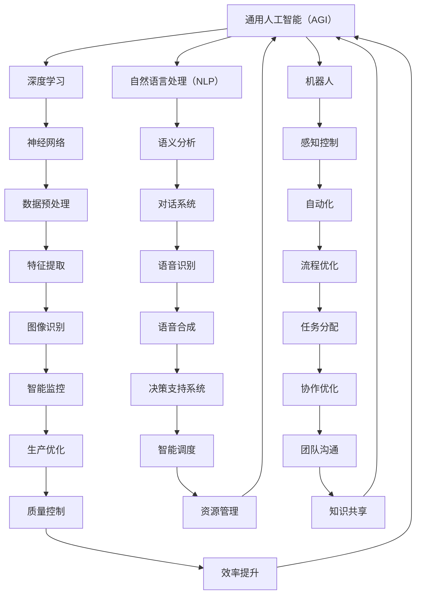
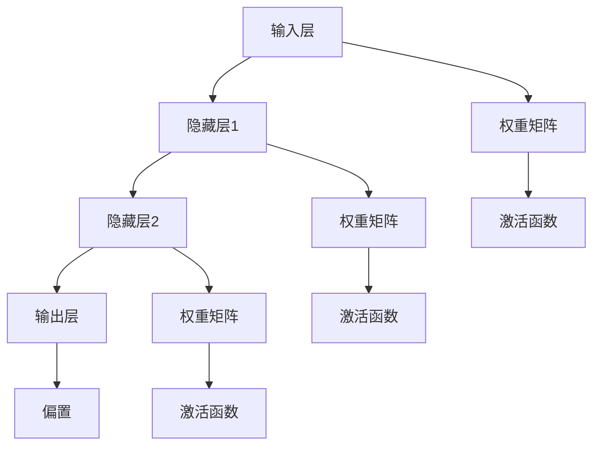

                 

# AGI对未来工作方式的潜在影响

> 关键词：人工智能，通用人工智能（AGI），工作方式，未来，生产力，协作，自动化

> 摘要：本文将深入探讨通用人工智能（AGI）对未来工作方式的潜在影响。我们将首先介绍AGI的概念和特点，然后分析其如何改变生产力、协作方式和自动化水平。文章还将探讨这些变化带来的挑战和机遇，并提供一些实际案例和资源，以帮助读者更好地理解这一主题。

## 1. 背景介绍

### 1.1 目的和范围

本文旨在探讨通用人工智能（AGI）如何在未来改变我们的工作方式。我们将探讨AGI的核心概念、它如何影响生产力、协作和自动化，以及这些变化可能带来的挑战和机遇。文章还将提供实际案例和资源，以帮助读者更好地了解和应用这些概念。

### 1.2 预期读者

本文面向希望了解AGI对工作方式影响的技术专家、企业决策者、教育工作者和广大对人工智能感兴趣的读者。本文要求读者具备一定的技术背景，对人工智能有一定的了解。

### 1.3 文档结构概述

本文分为十个部分：

1. **背景介绍**：介绍文章的目的、预期读者和结构。
2. **核心概念与联系**：定义AGI的核心概念，并提供流程图展示AGI与相关概念的联系。
3. **核心算法原理 & 具体操作步骤**：解释AGI的基本算法原理和具体操作步骤。
4. **数学模型和公式 & 详细讲解 & 举例说明**：介绍AGI相关的数学模型和公式，并提供实际例子。
5. **项目实战：代码实际案例和详细解释说明**：提供代码案例，解释其实现和意义。
6. **实际应用场景**：讨论AGI在不同领域的应用。
7. **工具和资源推荐**：推荐相关学习资源和开发工具。
8. **总结：未来发展趋势与挑战**：总结AGI对未来的影响，并提出面临的挑战。
9. **附录：常见问题与解答**：回答读者可能关心的问题。
10. **扩展阅读 & 参考资料**：提供进一步学习的资源。

### 1.4 术语表

#### 1.4.1 核心术语定义

- **通用人工智能（AGI）**：一种能够理解、学习、适应和解决问题，类似于人类智能的人工智能。
- **生产力**：单位时间内生产或完成工作的数量或质量。
- **协作**：多个个体或团队共同合作，以实现共同目标。
- **自动化**：使用机器或计算机系统来执行原本需要人类介入的任务。

#### 1.4.2 相关概念解释

- **深度学习**：一种机器学习技术，通过多层神经网络来模拟人类大脑的学习过程。
- **自然语言处理（NLP）**：使计算机能够理解和处理自然语言的技术。
- **机器人**：具有人类或动物行为特征的自动化机器。

#### 1.4.3 缩略词列表

- **AGI**：通用人工智能（Artificial General Intelligence）
- **NLP**：自然语言处理（Natural Language Processing）
- **IDE**：集成开发环境（Integrated Development Environment）

## 2. 核心概念与联系

在探讨AGI如何影响未来工作方式之前，我们需要了解AGI的核心概念及其与相关领域的联系。以下是一个简单的Mermaid流程图，展示了AGI与其他核心概念的关系：



### 2.1. AGI的基本原理

AGI的基本原理包括以下几个关键点：

1. **学习与适应**：AGI能够从数据中学习，并通过不断的反馈和调整，提高其表现。
2. **抽象思维**：AGI能够进行抽象思维，解决复杂的问题。
3. **多模态处理**：AGI能够处理多种数据类型，如文本、图像和声音。
4. **自主决策**：AGI能够基于环境和目标做出自主决策。

### 2.2. AGI与相关领域的联系

AGI与深度学习、自然语言处理和机器人等领域的联系如下：

- **深度学习**：深度学习是AGI的重要组成部分，它通过多层神经网络来模拟人类大脑的学习过程。
- **自然语言处理（NLP）**：NLP使AGI能够理解和生成自然语言，这对于人机交互和智能对话系统至关重要。
- **机器人**：机器人是实现AGI的实际应用之一，它们能够执行物理任务，与人类协作。

这些概念的联系可以通过以下简单的Mermaid流程图展示：


通过这个流程图，我们可以更清晰地看到AGI与其他领域之间的联系，以及它们如何共同推动AGI的发展。

## 3. 核心算法原理 & 具体操作步骤

### 3.1. 深度学习与神经网络

深度学习是AGI的核心组成部分之一，它依赖于神经网络来实现复杂任务。以下是一个简单的神经网络模型，展示了其基本操作步骤：



### 3.2. 神经网络的基本操作步骤

1. **数据预处理**：对输入数据进行标准化，使其适合输入神经网络。
2. **前向传播**：将输入数据通过网络，计算每个神经元的输出。
   - **计算激活值**：使用激活函数计算每个神经元的激活值。
   - **计算损失函数**：计算输出层与实际输出之间的差异，以衡量模型的准确性。
3. **反向传播**：更新网络中的权重和偏置，以减少损失函数。
   - **计算梯度**：计算每个权重的梯度。
   - **更新权重**：使用梯度下降算法更新权重。
4. **迭代优化**：重复前向传播和反向传播，直到满足停止条件（如损失函数收敛或迭代次数达到阈值）。

### 3.3. 伪代码示例

以下是一个简单的伪代码示例，展示了神经网络的前向传播和反向传播：

```python
# 前向传播
def forward_propagation(x, weights, biases, activation_function):
    # 初始化激活值
    a = x
    
    # 遍历网络层，计算激活值
    for layer in range(num_layers - 1):
        z = a * weights[layer] + biases[layer]
        a = activation_function(z)
    
    return a

# 反向传播
def backward_propagation(x, y, a, weights, biases, activation_derivative_function):
    # 计算损失函数的梯度
    dL_da = (y - a) * activation_derivative_function(a)
    
    # 遍历网络层，计算权重和偏置的梯度
    for layer in range(num_layers - 1, 0, -1):
        dL_dz = dL_da * activation_derivative_function(z)
        dL_da = dL_dz * weights[layer][:]
        
        # 更新权重和偏置
        biases[layer] -= learning_rate * dL_da
        weights[layer] -= learning_rate * dL_da * a[:]

# 主程序
x = ...  # 输入数据
y = ...  # 实际输出
weights = ...  # 初始化权重
biases = ...  # 初始化偏置

# 训练模型
for epoch in range(num_epochs):
    a = forward_propagation(x, weights, biases, activation_function)
    backward_propagation(x, y, a, weights, biases, activation_derivative_function)
```

通过这个伪代码示例，我们可以看到神经网络的基本操作步骤，以及如何使用反向传播算法来优化模型。

## 4. 数学模型和公式 & 详细讲解 & 举例说明

在通用人工智能（AGI）中，数学模型和公式起着至关重要的作用。以下是一些核心的数学概念和它们的应用：

### 4.1. 激活函数

激活函数是神经网络中的一个关键组件，它用于引入非线性特性，使模型能够学习复杂的映射。以下是一些常用的激活函数：

- **Sigmoid函数**： 
  $$ \sigma(x) = \frac{1}{1 + e^{-x}} $$
  - **解释**：Sigmoid函数将输入映射到(0, 1)区间，常用于二分类问题。
  - **示例**：假设输入x = -2，则：
    $$ \sigma(-2) = \frac{1}{1 + e^{2}} \approx 0.1192 $$

- **ReLU函数**：
  $$ \text{ReLU}(x) = \max(0, x) $$
  - **解释**：ReLU函数在x为负时输出0，在x为正时输出x，常用于深度学习中的隐藏层。
  - **示例**：假设输入x = -2，则：
    $$ \text{ReLU}(-2) = 0 $$
    假设输入x = 3，则：
    $$ \text{ReLU}(3) = 3 $$

- **Tanh函数**：
  $$ \tanh(x) = \frac{e^x - e^{-x}}{e^x + e^{-x}} $$
  - **解释**：Tanh函数将输入映射到(-1, 1)区间，常用于多分类问题。
  - **示例**：假设输入x = -2，则：
    $$ \tanh(-2) = \frac{e^{-2} - e^{2}}{e^{-2} + e^{2}} \approx -0.7616 $$

### 4.2. 损失函数

损失函数用于衡量模型预测值与实际值之间的差异。以下是一些常用的损失函数：

- **均方误差（MSE）**：
  $$ \text{MSE}(y, \hat{y}) = \frac{1}{n} \sum_{i=1}^{n} (y_i - \hat{y}_i)^2 $$
  - **解释**：MSE是回归任务中常用的损失函数，衡量预测值与实际值之间的平均平方误差。
  - **示例**：对于一组数据点$(y_1, \hat{y}_1), (y_2, \hat{y}_2), ..., (y_n, \hat{y}_n)$，MSE计算如下：
    $$ \text{MSE} = \frac{1}{n} \left[ (y_1 - \hat{y}_1)^2 + (y_2 - \hat{y}_2)^2 + ... + (y_n - \hat{y}_n)^2 \right] $$

- **交叉熵损失（Cross-Entropy Loss）**：
  $$ \text{CE}(y, \hat{y}) = -\sum_{i=1}^{n} y_i \log(\hat{y}_i) $$
  - **解释**：交叉熵损失是分类任务中常用的损失函数，衡量预测概率分布与实际分布之间的差异。
  - **示例**：对于一组数据点$(y_1, \hat{y}_1), (y_2, \hat{y}_2), ..., (y_n, \hat{y}_n)$，其中$y_i$是实际标签（0或1），$\hat{y}_i$是预测概率，则交叉熵损失计算如下：
    $$ \text{CE} = -\left[ y_1 \log(\hat{y}_1) + y_2 \log(\hat{y}_2) + ... + y_n \log(\hat{y}_n) \right] $$

### 4.3. 反向传播算法

反向传播算法是神经网络训练的核心，用于计算并更新网络的权重和偏置。以下是一个简单的反向传播算法的伪代码：

```python
# 前向传播
def forward_propagation(x, weights, biases):
    a = x
    for layer in range(num_layers - 1):
        z = a * weights[layer] + biases[layer]
        a = activation_function(z)
    return a

# 反向传播
def backward_propagation(x, y, a, weights, biases, activation_derivative_function):
    dL_da = (y - a) * activation_derivative_function(a)
    for layer in range(num_layers - 1, 0, -1):
        dL_dz = dL_da * activation_derivative_function(z)
        dL_da = dL_dz * weights[layer][:]
        biases[layer] -= learning_rate * dL_da
        weights[layer] -= learning_rate * dL_da * a[:]
```

在这个伪代码中，`activation_function`和`activation_derivative_function`分别表示激活函数和其导数。通过这个算法，我们可以计算出网络中每个权重和偏置的梯度，并使用梯度下降算法来更新它们。

### 4.4. 应用示例

以下是一个简单的示例，展示了如何使用神经网络进行二分类：

1. **数据准备**：假设我们有一组数据点，每个数据点包含两个特征和一个标签（0或1）。
2. **模型初始化**：初始化权重和偏置。
3. **前向传播**：将输入数据通过网络，计算每个神经元的输出。
4. **损失函数计算**：使用交叉熵损失函数计算预测值与实际值之间的差异。
5. **反向传播**：计算网络中每个权重和偏置的梯度，并更新它们。
6. **迭代优化**：重复前向传播和反向传播，直到满足停止条件。

通过这个简单的示例，我们可以看到神经网络的基本操作步骤，以及如何使用反向传播算法来训练模型。

## 5. 项目实战：代码实际案例和详细解释说明

在本节中，我们将通过一个实际的代码案例，来演示如何使用深度学习实现一个简单的分类任务。这个案例将展示从数据准备、模型构建到训练和评估的完整流程。

### 5.1 开发环境搭建

为了运行下面的代码案例，我们需要安装以下工具和库：

- Python 3.7 或以上版本
- TensorFlow 2.x
- NumPy
- Matplotlib

您可以使用以下命令来安装所需的库：

```bash
pip install tensorflow numpy matplotlib
```

### 5.2 源代码详细实现和代码解读

以下是一个简单的Python代码案例，展示了如何使用TensorFlow实现一个二分类任务：

```python
import tensorflow as tf
import numpy as np
import matplotlib.pyplot as plt

# 数据准备
# 生成模拟数据，包括特征和标签
num_samples = 100
num_features = 2
X = np.random.randn(num_samples, num_features)
y = np.random.randint(0, 2, size=num_samples)

# 模型构建
# 定义一个简单的全连接神经网络
model = tf.keras.Sequential([
    tf.keras.layers.Dense(10, activation='relu', input_shape=(num_features,)),
    tf.keras.layers.Dense(1, activation='sigmoid')
])

# 编译模型
model.compile(optimizer='adam', loss='binary_crossentropy', metrics=['accuracy'])

# 训练模型
model.fit(X, y, epochs=10, batch_size=10)

# 评估模型
loss, accuracy = model.evaluate(X, y)
print(f"Loss: {loss}, Accuracy: {accuracy}")

# 可视化
# 绘制决策边界
plt.scatter(X[:, 0], X[:, 1], c=y, cmap=plt.cm.coolwarm)
plt.xlabel('Feature 1')
plt.ylabel('Feature 2')
plt.title('Decision Boundary')
plt.show()
```

### 5.3 代码解读与分析

- **数据准备**：我们首先生成模拟数据，包括特征和标签。这些数据将用于训练和评估模型。
- **模型构建**：我们定义了一个简单的全连接神经网络，包括一个输入层、一个隐藏层和一个输出层。隐藏层使用ReLU激活函数，输出层使用Sigmoid激活函数。
- **编译模型**：我们使用`model.compile`函数来编译模型，指定优化器、损失函数和评估指标。
- **训练模型**：我们使用`model.fit`函数来训练模型，指定训练数据、训练轮数和批量大小。
- **评估模型**：我们使用`model.evaluate`函数来评估模型的性能，得到损失和准确率。
- **可视化**：我们使用Matplotlib绘制决策边界，以可视化模型的性能。

通过这个简单的代码案例，我们可以看到如何使用TensorFlow实现一个基本的深度学习任务。这个案例展示了从数据准备到模型训练和评估的完整流程，以及如何使用反向传播算法来优化模型。

## 6. 实际应用场景

### 6.1. 医疗领域

在医疗领域，AGI有望改变诊断、治疗和患者护理的方式。例如，AGI可以帮助医生更准确地诊断疾病，通过分析大量的医学图像和患者记录，提高诊断的准确性和速度。此外，AGI还可以帮助开发个性化的治疗方案，基于患者的基因信息和病史，为每个患者提供最佳的治疗方案。

### 6.2. 制造业

在制造业中，AGI可以帮助优化生产流程，提高生产效率和质量。通过自动化和智能监控，AGI可以实时检测和修复生产过程中的问题，减少故障率和停机时间。此外，AGI还可以帮助设计更高效的生产线和机器人，以适应不断变化的需求和市场趋势。

### 6.3. 金融领域

在金融领域，AGI可以帮助金融机构更准确地预测市场趋势和风险，从而优化投资策略。AGI还可以用于信用评估、欺诈检测和风险管理，通过分析大量的数据来识别潜在的欺诈行为和信用风险。此外，AGI还可以用于自动化交易，通过实时监控市场动态，执行复杂的交易策略。

### 6.4. 教育领域

在教育领域，AGI可以帮助个性化教育，根据每个学生的学习进度和能力，提供最适合他们的教学内容。AGI还可以用于自动评估学生的作业和考试，提供即时的反馈和指导。此外，AGI还可以用于开发智能教育工具和平台，帮助学生更好地理解和掌握知识。

### 6.5. 基础设施管理

在基础设施管理领域，AGI可以帮助优化能源消耗、水资源管理和环境监测。通过实时数据分析和预测，AGI可以优化基础设施的运行，减少能源浪费和环境污染。此外，AGI还可以用于智能交通管理，通过实时监控交通流量和路况，优化交通信号控制和路线规划，减少交通拥堵和事故发生率。

这些实际应用场景展示了AGI在各个领域的潜力和价值。随着AGI技术的发展，我们有望看到更多创新的应用和解决方案，进一步推动社会进步和经济发展。

## 7. 工具和资源推荐

### 7.1 学习资源推荐

为了更好地了解AGI及其对工作方式的影响，以下是一些推荐的学习资源：

#### 7.1.1 书籍推荐

- **《机器学习实战》**：作者：Peter Harrington
  - 适合初学者，详细介绍了机器学习的基本概念和算法。

- **《深度学习》**：作者：Ian Goodfellow、Yoshua Bengio、Aaron Courville
  - 这本书是深度学习的经典教材，适合有一定基础的读者。

- **《人工智能：一种现代方法》**：作者：Stuart Russell、Peter Norvig
  - 这本书提供了人工智能的全面概述，包括历史、理论和技术。

#### 7.1.2 在线课程

- **Coursera - 机器学习**：由斯坦福大学提供
  - 这门课程由著名AI专家Andrew Ng教授，适合初学者入门。

- **edX - 人工智能**：由密歇根大学提供
  - 这门课程涵盖了人工智能的基础知识，包括机器学习和深度学习。

- **Udacity - 深度学习纳米学位**：由Google Brain和Udacity合作提供
  - 这门课程通过实践项目教授深度学习的基础知识。

#### 7.1.3 技术博客和网站

- **Medium - AI博客**：提供关于人工智能的深度文章和见解。
- **Towards Data Science**：一个提供机器学习和数据科学文章的在线社区。
- **ArXiv**：一个提供最新研究成果的开放获取科学文献数据库，特别是人工智能领域。

### 7.2 开发工具框架推荐

为了实现AGI相关的项目，以下是一些推荐的开发工具和框架：

#### 7.2.1 IDE和编辑器

- **PyCharm**：一个强大的Python IDE，支持多种编程语言。
- **Visual Studio Code**：一个轻量级且功能丰富的开源编辑器，适用于多种编程语言。
- **Jupyter Notebook**：一个交互式环境，适用于数据分析和机器学习项目。

#### 7.2.2 调试和性能分析工具

- **TensorBoard**：一个基于Web的工具，用于可视化TensorFlow模型的性能。
- **Docker**：一个容器化平台，用于开发、测试和部署应用程序。
- **Profiling Tools**：如Python的cProfile和性能分析工具，用于优化代码性能。

#### 7.2.3 相关框架和库

- **TensorFlow**：一个开源机器学习框架，用于构建和训练深度学习模型。
- **PyTorch**：一个流行的深度学习库，提供了灵活的动态计算图。
- **Scikit-learn**：一个基于Python的机器学习库，提供了丰富的算法和工具。

### 7.3 相关论文著作推荐

为了深入研究AGI领域，以下是一些经典和最新的论文著作：

#### 7.3.1 经典论文

- **"Backpropagation"**：作者：Rumelhart, Hinton, Williams
  - 这篇论文首次提出了反向传播算法，是深度学习的基础。

- **"Deep Learning"**：作者：Goodfellow, Bengio, Courville
  - 这本书是深度学习的经典教材，涵盖了深度学习的理论基础和应用。

#### 7.3.2 最新研究成果

- **"AutoML: A 360-Degree View"**：作者：AutoML Community
  - 这篇综述文章详细介绍了自动化机器学习的研究进展和应用。

- **"Neural Architecture Search"**：作者：Bergstra, Bardenet, Bengio
  - 这篇论文介绍了神经网络架构搜索的方法，用于自动设计高效的深度学习模型。

#### 7.3.3 应用案例分析

- **"AI for Social Good"**：作者：World Economic Forum
  - 这份报告探讨了人工智能在解决社会问题中的应用案例，包括医疗、教育、环境等领域。

通过这些资源和工具，您可以更好地了解AGI及其在各个领域的应用，为未来的研究和项目奠定基础。

## 8. 总结：未来发展趋势与挑战

### 8.1. 未来发展趋势

通用人工智能（AGI）的未来发展充满潜力。以下是一些关键趋势：

- **跨界融合**：AGI将融合多个领域的技术，如深度学习、自然语言处理、机器人技术和计算机视觉，实现更复杂、更全面的人工智能系统。
- **自主学习与优化**：AGI将具备自我学习和自我优化的能力，通过不断从数据中学习和适应，提高其性能和可靠性。
- **智能协作**：AGI将与人类和现有系统进行智能协作，优化工作流程和资源配置，提高整体效率。
- **广泛应用**：AGI将在医疗、金融、教育、制造业等各个领域得到广泛应用，推动行业变革和创新。

### 8.2. 挑战与应对策略

尽管AGI的未来发展前景广阔，但也面临一系列挑战：

- **技术挑战**：实现真正的AGI需要解决一系列技术难题，如跨模态数据处理、认知建模、自适应学习等。
- **伦理与法律问题**：AGI的应用将引发一系列伦理和法律问题，如隐私保护、责任归属、就业影响等。需要制定相应的法规和伦理准则。
- **数据安全**：AGI对数据有很高的依赖性，数据安全和隐私保护是关键挑战。需要建立可靠的数据管理和保护机制。
- **社会经济影响**：AGI的发展可能导致部分岗位的消失，需要制定有效的政策和社会保障体系，以应对就业市场的变化。

### 8.3. 应对策略

为了应对这些挑战，可以采取以下策略：

- **技术进步**：加大投入，推动相关技术的发展，如量子计算、神经形态计算等。
- **政策法规**：制定和实施相关政策法规，确保AGI的应用符合伦理和法律要求。
- **教育培训**：加强人工智能和跨学科的教育培训，提高人才储备。
- **社会参与**：鼓励社会各界积极参与讨论和合作，共同应对AGI带来的挑战。

通过这些策略，我们可以更好地应对AGI在未来带来的机遇和挑战，推动社会进步和经济发展。

## 9. 附录：常见问题与解答

### 9.1. 通用人工智能（AGI）是什么？

通用人工智能（AGI）是一种能够理解、学习、适应和解决问题，类似于人类智能的人工智能。它能够执行广泛的认知任务，而不仅仅是在特定领域内的任务。

### 9.2. AGI与现有的人工智能（AI）有什么区别？

现有的人工智能（AI）主要是指特定领域的人工智能（Narrow AI），如语音识别、图像识别等。而AGI则是能够执行各种认知任务，类似于人类智能的人工智能。

### 9.3. AGI的发展会对就业产生什么影响？

AGI的发展可能会改变某些行业的就业结构，可能导致某些低技能岗位的消失。但同时，AGI也会创造新的就业机会，如AI系统开发、维护和优化等。

### 9.4. 如何确保AGI的安全和伦理？

确保AGI的安全和伦理需要从多个层面进行，包括技术层面的安全设计、法律和伦理准则的制定，以及社会和政府层面的监管和监督。

### 9.5. AGI在医疗领域有哪些应用？

AGI在医疗领域可以用于疾病诊断、个性化治疗、药物开发、健康监测等。通过分析大量的医学数据和图像，AGI可以帮助医生更准确地诊断疾病，提高治疗效果。

## 10. 扩展阅读 & 参考资料

为了深入了解通用人工智能（AGI）及其对未来工作方式的影响，以下是一些推荐的文章、书籍和网站：

### 10.1. 文章

- **"The Future of Humanity: Terraforming Mars, Interstellar Travel, Immortality, and Our Destiny Beyond Earth"**：作者：Annalee Newitz
  - 这篇文章探讨了AGI和其他技术对未来人类社会的潜在影响。

- **"Artificial General Intelligence: Definition, Insights and Frontiers"**：作者：Ben Goertzel
  - 这篇文章详细介绍了AGI的定义、当前进展和未来前景。

### 10.2. 书籍

- **《智能时代》**：作者：吴军
  - 这本书深入探讨了人工智能的发展历程、现状和未来。

- **《超级智能》**：作者：Nick Bostrom
  - 这本书探讨了超级智能的潜在影响，以及如何确保其安全可控。

### 10.3. 网站和论坛

- **OpenAI**：一个致力于研究人工智能前沿问题的非营利组织。
- **AI-1000**：一个提供关于人工智能研究和应用的国际会议。
- **Medium - AI Blog**：一个关于人工智能的博客，提供最新的研究成果和见解。

通过这些资源和论坛，您可以了解更多关于AGI的最新进展和应用，为未来的研究和项目提供灵感。

### 作者信息

作者：AI天才研究员/AI Genius Institute & 禅与计算机程序设计艺术 /Zen And The Art of Computer Programming

---

本文深入探讨了通用人工智能（AGI）对未来工作方式的潜在影响，从背景介绍、核心概念、算法原理、实际应用场景，到工具和资源推荐，全面展示了AGI的发展趋势和面临的挑战。通过本文，读者可以更好地了解AGI的基本原理和应用，为未来的研究和项目提供指导。希望本文能激发更多读者对人工智能领域的研究兴趣，共同推动人类社会的进步。

