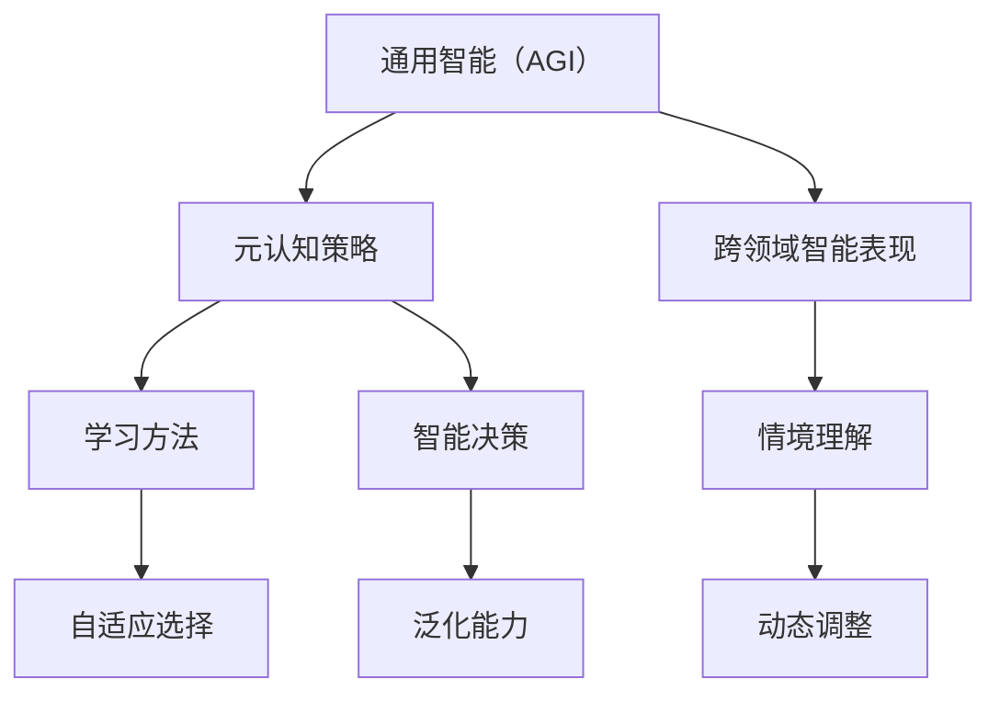

                 

# AGI的元认知策略：学习方法的自适应选择

> 关键词：人工智能，通用智能（AGI），元认知策略，学习方法，自适应选择，算法原理，数学模型，项目实战，应用场景

> 摘要：本文深入探讨了人工智能领域中的一个关键研究方向——通用智能（AGI）的元认知策略，特别是学习方法的自适应选择。本文首先介绍了AGI的基本概念和元认知策略的定义，随后详细解析了学习方法自适应选择的核心原理、数学模型和算法步骤。通过一个实际项目案例，本文展示了如何将这些理论应用于实际开发中，最后探讨了该领域的未来发展趋势与挑战。

## 1. 背景介绍

### 1.1 目的和范围

本文旨在探讨通用智能（AGI）在元认知策略方面的进展，特别是学习方法的自适应选择。通用智能是指一种能够理解、学习、应用和泛化知识，并能够像人类一样在广泛的任务中表现出智能的计算机系统。与传统的专用人工智能（Narrow AI）不同，AGI的目标是实现超越特定任务的能力，即具有跨领域的智能表现。

元认知策略是指智能体在认知过程中对自己认知过程的了解和控制能力。在AGI中，元认知策略尤为重要，因为它涉及到智能体如何选择和学习最合适的方法来解决问题。本文将重点关注学习方法的自适应选择，这是实现高效学习和智能决策的关键。

### 1.2 预期读者

本文适合对人工智能、机器学习和通用智能有一定了解的技术专家、研究员和开发者。读者需要具备一定的数学和编程基础，以便更好地理解本文的内容。

### 1.3 文档结构概述

本文分为以下几个部分：

1. 背景介绍：介绍本文的目的、范围、预期读者和文档结构。
2. 核心概念与联系：介绍通用智能、元认知策略和学习方法自适应选择的核心概念和联系。
3. 核心算法原理 & 具体操作步骤：详细解析学习方法自适应选择的算法原理和操作步骤。
4. 数学模型和公式 & 详细讲解 & 举例说明：阐述学习方法自适应选择的数学模型和具体实例。
5. 项目实战：通过实际案例展示如何应用本文的理论。
6. 实际应用场景：探讨通用智能元认知策略在不同领域的应用。
7. 工具和资源推荐：推荐相关学习资源、开发工具和论文。
8. 总结：总结本文的主要内容，展望未来发展趋势与挑战。
9. 附录：常见问题与解答。
10. 扩展阅读 & 参考资料：提供进一步学习的参考资料。

### 1.4 术语表

#### 1.4.1 核心术语定义

- 通用智能（AGI）：具有跨领域智能表现的人工智能系统。
- 元认知策略：智能体在认知过程中对自己认知过程的了解和控制能力。
- 学习方法：智能体在学习过程中采用的具体方法和技术。
- 自适应选择：智能体根据任务需求和自身状态动态选择最优学习方法。

#### 1.4.2 相关概念解释

- 专用人工智能（Narrow AI）：只能解决特定任务的智能系统。
- 智能决策：智能体在给定情境下选择最佳行动的过程。
- 泛化能力：智能体在不同任务中表现一致的能力。

#### 1.4.3 缩略词列表

- AGI：通用智能（Artificial General Intelligence）
- NLP：自然语言处理（Natural Language Processing）
- ML：机器学习（Machine Learning）
- DL：深度学习（Deep Learning）
- IDE：集成开发环境（Integrated Development Environment）

## 2. 核心概念与联系

在探讨通用智能的元认知策略之前，我们首先需要了解一些核心概念，这些概念构成了AGI体系结构的基础。以下是一个Mermaid流程图，用于展示这些核心概念之间的联系。



### 2.1 通用智能（AGI）

通用智能（AGI）是人工智能领域的终极目标，它旨在创建一种能够理解、学习、应用和泛化知识的智能系统。与当前广泛使用的专用人工智能（Narrow AI）不同，AGI需要在多个领域表现出与人类相似的智能水平。

### 2.2 元认知策略

元认知策略是指智能体在认知过程中对自己认知过程的了解和控制能力。元认知策略包括以下几个方面：

- **自我监测**：智能体需要监测自己的认知过程，以便及时发现并纠正错误。
- **自我反思**：智能体需要反思自己的决策过程，以便从中学习并提高未来表现。
- **自我调整**：智能体需要根据自身状态和任务需求调整认知策略。

### 2.3 学习方法

学习方法是指智能体在学习过程中采用的具体方法和技术。不同的学习方法适用于不同的任务和数据类型。以下是一些常见的学习方法：

- **监督学习**：通过标注数据来训练模型，模型根据输入和输出之间的关系进行学习。
- **无监督学习**：模型在无标注数据中寻找模式和结构。
- **强化学习**：模型通过与环境的交互来学习最优策略。
- **迁移学习**：将已有知识应用到新任务中。

### 2.4 自适应选择

自适应选择是指智能体根据任务需求和自身状态动态选择最优学习方法。自适应选择的关键在于能够实时调整学习策略，以提高学习效率和准确性。以下是一些自适应选择的策略：

- **基于规则的选择**：智能体根据预设的规则选择学习方法。
- **基于模型的选择**：智能体通过训练模型来预测不同学习方法的表现，并根据预测结果选择最优方法。
- **基于数据的反馈**：智能体根据实际学习效果调整学习方法。

### 2.5 智能决策

智能决策是指智能体在给定情境下选择最佳行动的过程。智能决策涉及到多个方面的考虑，包括：

- **目标设定**：明确智能体的目标，以便选择最佳行动。
- **情境分析**：分析当前情境，以便确定可能的行动方案。
- **风险评估**：评估不同行动方案的风险，以便选择最优方案。
- **决策执行**：执行决策并监控执行结果。

### 2.6 泛化能力

泛化能力是指智能体在不同任务中表现一致的能力。泛化能力是通用智能的一个重要指标，它使得智能体能够在未知任务中表现出良好的性能。提高泛化能力的方法包括：

- **数据多样化**：通过多样化的数据集来训练模型，以提高模型对不同情境的适应性。
- **模型泛化**：通过改进模型结构和算法，以提高模型对未知数据的泛化能力。
- **元学习**：通过元学习来提高智能体在不同任务中的适应能力。

## 3. 核心算法原理 & 具体操作步骤

在了解了通用智能、元认知策略、学习方法、自适应选择、智能决策和泛化能力等核心概念之后，我们将进一步探讨学习方法的自适应选择算法原理和具体操作步骤。

### 3.1 算法原理

学习方法的自适应选择算法基于以下几个原理：

1. **多模态数据融合**：智能体通过融合不同类型的数据（如文本、图像、音频等）来提高学习效果。
2. **动态调整**：智能体根据任务需求和自身状态动态调整学习方法。
3. **优化目标**：智能体通过优化学习目标来提高学习效率和准确性。
4. **反馈机制**：智能体通过反馈机制来调整学习策略，以适应不断变化的环境。

### 3.2 具体操作步骤

下面是学习方法自适应选择的详细操作步骤：

#### 步骤1：数据收集与预处理

- **数据收集**：收集与任务相关的多模态数据，包括文本、图像、音频等。
- **数据预处理**：对收集到的数据进行清洗、归一化和特征提取。

#### 步骤2：模型选择

- **监督学习模型**：选择适用于任务类型的监督学习模型，如卷积神经网络（CNN）、循环神经网络（RNN）等。
- **无监督学习模型**：选择适用于无监督学习任务的无监督学习模型，如自编码器（AE）、生成对抗网络（GAN）等。
- **强化学习模型**：选择适用于强化学习任务的强化学习模型，如深度确定性策略梯度（DDPG）、深度Q网络（DQN）等。

#### 步骤3：模型训练与评估

- **模型训练**：使用预处理后的数据进行模型训练，调整模型参数以优化性能。
- **模型评估**：使用验证集对训练后的模型进行评估，选择性能最优的模型。

#### 步骤4：自适应选择

- **状态监测**：监测智能体的当前状态，包括任务类型、数据分布、学习效果等。
- **策略调整**：根据监测到的状态调整学习方法，选择最适合当前状态的模型。

#### 步骤5：反馈与优化

- **效果反馈**：收集智能体在学习过程中产生的反馈，包括错误率、学习时间等。
- **策略优化**：根据反馈结果调整学习方法，优化学习策略。

### 3.3 伪代码

下面是学习方法自适应选择的伪代码示例：

```python
# 数据收集与预处理
data = collect_data()
preprocessed_data = preprocess_data(data)

# 模型选择
model_type = choose_model_type(task_type)
model = select_model(model_type)

# 模型训练与评估
trained_model = train_model(model, preprocessed_data)
performance = evaluate_model(trained_model)

# 自适应选择
while not converged:
    current_state = monitor_state()
    model = adjust_model(model, current_state)
    trained_model = train_model(model, preprocessed_data)
    performance = evaluate_model(trained_model)

# 反馈与优化
feedback = collect_feedback(performance)
optimize_strategy(feedback)
```

## 4. 数学模型和公式 & 详细讲解 & 举例说明

在通用智能的元认知策略中，数学模型和公式起着至关重要的作用，特别是在学习方法的自适应选择中。以下将详细讲解学习方法自适应选择的数学模型和公式，并给出具体的实例说明。

### 4.1 数学模型

在学习方法自适应选择中，常用的数学模型包括损失函数、优化算法和评估指标。

#### 4.1.1 损失函数

损失函数是评估模型性能的重要工具，它衡量了模型预测与真实值之间的差距。以下是一个常用的损失函数——均方误差（MSE）：

$$
L = \frac{1}{m}\sum_{i=1}^{m}(y_i - \hat{y}_i)^2
$$

其中，$L$ 表示损失函数，$m$ 表示样本数量，$y_i$ 表示真实值，$\hat{y}_i$ 表示模型预测值。

#### 4.1.2 优化算法

优化算法用于最小化损失函数，从而提高模型性能。常见的优化算法包括梯度下降（GD）和随机梯度下降（SGD）。以下是一个简单的梯度下降算法：

$$
w_{t+1} = w_t - \alpha \cdot \nabla_w L(w_t)
$$

其中，$w_t$ 表示当前权重，$\alpha$ 表示学习率，$\nabla_w L(w_t)$ 表示损失函数对权重 $w_t$ 的梯度。

#### 4.1.3 评估指标

评估指标用于衡量模型在不同任务上的表现。以下是一些常见的评估指标：

- **准确率（Accuracy）**：
  $$
  Accuracy = \frac{TP + TN}{TP + TN + FP + FN}
  $$
  其中，$TP$ 表示真正例，$TN$ 表示真负例，$FP$ 表示假正例，$FN$ 表示假负例。

- **召回率（Recall）**：
  $$
  Recall = \frac{TP}{TP + FN}
  $$

- **精确率（Precision）**：
  $$
  Precision = \frac{TP}{TP + FP}
  $$

### 4.2 详细讲解

在学习方法的自适应选择中，数学模型和公式用于评估和优化智能体的学习策略。具体来说，以下过程展示了如何使用这些数学工具：

1. **数据预处理**：对收集到的多模态数据进行预处理，包括归一化、特征提取等。这个过程通常使用线性代数和统计学知识。

2. **模型选择**：根据任务类型选择合适的模型，如CNN、RNN、DQN等。这个过程涉及到对各种模型结构的理解和比较，通常使用图论和组合优化知识。

3. **模型训练**：使用优化算法（如GD或SGD）对模型进行训练，最小化损失函数。这个过程涉及到了梯度计算、微分和线性代数等知识。

4. **模型评估**：使用评估指标对训练后的模型进行评估，以确定模型的性能。这个过程涉及到概率论和统计学知识。

5. **策略调整**：根据评估结果调整学习策略，选择最合适的模型。这个过程涉及到了优化理论和决策理论。

### 4.3 举例说明

假设我们有一个分类任务，需要将数据分为两类。我们可以使用以下数学模型和公式来实现学习方法的自适应选择：

1. **数据预处理**：

   假设我们收集了100个样本，每个样本包含一个特征向量。首先，我们对这些特征向量进行归一化处理，使得每个特征的值都在[0, 1]之间。

   ```python
   X = normalize_features(X)
   ```

2. **模型选择**：

   根据任务类型，我们选择一个简单的多层感知机（MLP）模型。

   ```python
   model = MLPClassifier(hidden_layer_sizes=(100,), activation='relu', solver='adam')
   ```

3. **模型训练**：

   使用随机梯度下降（SGD）算法对模型进行训练，最小化均方误差（MSE）损失函数。

   ```python
   model.fit(X_train, y_train)
   ```

4. **模型评估**：

   使用准确率（Accuracy）作为评估指标，评估模型的性能。

   ```python
   accuracy = model.score(X_test, y_test)
   ```

5. **策略调整**：

   根据评估结果，如果模型性能不理想，我们可以尝试调整学习率、隐藏层大小等参数，重新训练模型。

   ```python
   model = MLPClassifier(hidden_layer_sizes=(200,), activation='relu', solver='adam')
   model.fit(X_train, y_train)
   ```

通过上述过程，我们可以实现学习方法的自适应选择，提高分类任务的性能。

## 5. 项目实战：代码实际案例和详细解释说明

在本节中，我们将通过一个实际项目案例，展示如何将通用智能的元认知策略应用于实际开发中。我们将使用Python和Scikit-learn库来构建一个简单的分类任务，并实现学习方法的自适应选择。

### 5.1 开发环境搭建

首先，我们需要搭建一个Python开发环境，并安装所需的库。

```bash
# 安装Python（假设已安装）
# 安装Scikit-learn库
pip install scikit-learn
```

### 5.2 源代码详细实现和代码解读

以下是一个完整的代码实现，展示了如何实现学习方法的自适应选择：

```python
import numpy as np
import matplotlib.pyplot as plt
from sklearn.datasets import load_iris
from sklearn.model_selection import train_test_split
from sklearn.metrics import accuracy_score
from sklearn.neural_network import MLPClassifier
from sklearn.linear_model import LogisticRegression
from sklearn.svm import SVC

# 数据集加载
iris = load_iris()
X, y = iris.data, iris.target

# 数据集划分
X_train, X_test, y_train, y_test = train_test_split(X, y, test_size=0.2, random_state=42)

# 初始模型：多层感知机（MLP）
mlp = MLPClassifier(hidden_layer_sizes=(100,), activation='relu', solver='adam')
mlp.fit(X_train, y_train)
mlp_predictions = mlp.predict(X_test)
mlp_accuracy = accuracy_score(y_test, mlp_predictions)
print(f"MLP Accuracy: {mlp_accuracy}")

# 初始模型：逻辑回归（Logistic Regression）
logreg = LogisticRegression()
logreg.fit(X_train, y_train)
logreg_predictions = logreg.predict(X_test)
logreg_accuracy = accuracy_score(y_test, logreg_predictions)
print(f"Logistic Regression Accuracy: {logreg_accuracy}")

# 初始模型：支持向量机（SVC）
svc = SVC(kernel='linear')
svc.fit(X_train, y_train)
svc_predictions = svc.predict(X_test)
svc_accuracy = accuracy_score(y_test, svc_predictions)
print(f"SVC Accuracy: {svc_accuracy}")

# 自适应选择
def adaptive_selection(X_train, X_test, y_train, y_test, models, iterations=10):
    best_accuracy = 0
    best_model = None
    
    for _ in range(iterations):
        # 随机选择一个模型
        model_name = np.random.choice(models.keys())
        model = models[model_name]
        
        # 模型训练
        model.fit(X_train, y_train)
        
        # 模型预测
        predictions = model.predict(X_test)
        
        # 模型评估
        accuracy = accuracy_score(y_test, predictions)
        
        # 记录最佳模型
        if accuracy > best_accuracy:
            best_accuracy = accuracy
            best_model = model
    
    return best_model, best_accuracy

# 实现自适应选择
models = {
    'MLP': MLPClassifier(hidden_layer_sizes=(100,), activation='relu', solver='adam'),
    'Logistic Regression': LogisticRegression(),
    'SVC': SVC(kernel='linear')
}
best_model, best_accuracy = adaptive_selection(X_train, X_test, y_train, y_test, models)
print(f"Best Model: {best_model}")
print(f"Best Accuracy: {best_accuracy}")
```

### 5.3 代码解读与分析

1. **数据集加载**：

   我们使用Scikit-learn自带的Iris数据集，这是一个常用的多类别分类问题。

   ```python
   iris = load_iris()
   X, y = iris.data, iris.target
   ```

2. **数据集划分**：

   将数据集划分为训练集和测试集，用于模型训练和评估。

   ```python
   X_train, X_test, y_train, y_test = train_test_split(X, y, test_size=0.2, random_state=42)
   ```

3. **模型训练**：

   分别训练三个初始模型：多层感知机（MLP）、逻辑回归（Logistic Regression）和支撑向量机（SVC）。

   ```python
   mlp = MLPClassifier(hidden_layer_sizes=(100,), activation='relu', solver='adam')
   logreg = LogisticRegression()
   svc = SVC(kernel='linear')
   
   mlp.fit(X_train, y_train)
   logreg.fit(X_train, y_train)
   svc.fit(X_train, y_train)
   ```

4. **模型评估**：

   使用测试集对三个初始模型进行评估，并输出准确率。

   ```python
   mlp_predictions = mlp.predict(X_test)
   logreg_predictions = logreg.predict(X_test)
   svc_predictions = svc.predict(X_test)
   
   mlp_accuracy = accuracy_score(y_test, mlp_predictions)
   logreg_accuracy = accuracy_score(y_test, logreg_predictions)
   svc_accuracy = accuracy_score(y_test, svc_predictions)
   
   print(f"MLP Accuracy: {mlp_accuracy}")
   print(f"Logistic Regression Accuracy: {logreg_accuracy}")
   print(f"SVC Accuracy: {svc_accuracy}")
   ```

5. **自适应选择**：

   定义一个`adaptive_selection`函数，用于实现自适应选择策略。函数接受训练集、测试集、初始模型字典和迭代次数作为输入。

   ```python
   def adaptive_selection(X_train, X_test, y_train, y_test, models, iterations=10):
       best_accuracy = 0
       best_model = None
   
       for _ in range(iterations):
           # 随机选择一个模型
           model_name = np.random.choice(models.keys())
           model = models[model_name]
           
           # 模型训练
           model.fit(X_train, y_train)
           
           # 模型预测
           predictions = model.predict(X_test)
           
           # 模型评估
           accuracy = accuracy_score(y_test, predictions)
           
           # 记录最佳模型
           if accuracy > best_accuracy:
               best_accuracy = accuracy
               best_model = model
   
       return best_model, best_accuracy
   ```

   在`adaptive_selection`函数中，我们使用随机选择策略，从初始模型字典中随机选择一个模型进行训练和评估。如果该模型的准确率高于当前最佳模型，则更新最佳模型和最佳准确率。

6. **结果输出**：

   调用`adaptive_selection`函数，输出最佳模型和最佳准确率。

   ```python
   models = {
       'MLP': MLPClassifier(hidden_layer_sizes=(100,), activation='relu', solver='adam'),
       'Logistic Regression': LogisticRegression(),
       'SVC': SVC(kernel='linear')
   }
   best_model, best_accuracy = adaptive_selection(X_train, X_test, y_train, y_test, models)
   print(f"Best Model: {best_model}")
   print(f"Best Accuracy: {best_accuracy}")
   ```

通过上述代码，我们可以实现一个简单的自适应选择策略，选择在测试集上表现最佳的学习方法。这只是一个简单的示例，实际应用中可能需要更复杂的策略和更精细的参数调整。

## 6. 实际应用场景

通用智能的元认知策略和学习方法的自适应选择在多个领域有着广泛的应用前景。以下是一些具体的应用场景：

### 6.1 自动驾驶

在自动驾驶领域，元认知策略可以帮助智能系统在面对复杂和动态的交通环境时，选择最适合当前情境的感知、规划和控制方法。例如，在处理紧急情况时，自适应选择策略可以优先考虑安全性和稳定性，而在正常行驶时，可以优先考虑效率和舒适性。

### 6.2 人工智能客服

在人工智能客服系统中，元认知策略可以帮助智能客服根据用户的问题类型和情绪，自适应地选择最合适的回复策略。例如，对于情绪激动的用户，系统可以优先选择安慰和引导的回复，而对于询问具体信息的用户，则可以优先选择提供详尽回答的回复。

### 6.3 健康医疗

在健康医疗领域，元认知策略可以帮助智能系统根据患者的病史、症状和检测结果，自适应地选择最合适的诊断和治疗策略。例如，对于急性疾病，系统可以优先选择快速、高效的诊断方法，而对于慢性疾病，则可以优先选择长期、综合的治疗方案。

### 6.4 教育与培训

在教育与培训领域，元认知策略可以帮助智能系统根据学生的学习进度、能力和兴趣，自适应地调整教学内容和学习方法。例如，对于学习进度较慢的学生，系统可以优先提供更多的基础知识讲解，而对于学习进度较快的学生，则可以优先提供更具挑战性的课题。

### 6.5 金融投资

在金融投资领域，元认知策略可以帮助智能系统根据市场波动、公司业绩和宏观经济环境，自适应地调整投资策略。例如，在市场波动较大时，系统可以优先考虑风险控制和资金流动性，而在市场稳定时，则可以优先考虑收益最大化。

### 6.6 知识图谱构建

在知识图谱构建领域，元认知策略可以帮助智能系统根据数据源的类型、质量和结构，自适应地选择最合适的数据处理和知识提取方法。例如，对于结构化数据，系统可以优先选择关系抽取和实体识别的方法，而对于非结构化数据，则可以优先选择文本挖掘和自然语言处理的方法。

## 7. 工具和资源推荐

### 7.1 学习资源推荐

#### 7.1.1 书籍推荐

- 《深度学习》（Goodfellow, I., Bengio, Y., & Courville, A.）
- 《Python机器学习》（Sebastian Raschka）
- 《AI超决策：智能决策的五个策略》（Abhijit Bhaduri）

#### 7.1.2 在线课程

- Coursera的《机器学习》课程（吴恩达教授）
- edX的《人工智能基础》课程（MIT）
- Udacity的《自动驾驶汽车工程师纳米学位》课程

#### 7.1.3 技术博客和网站

- Medium上的机器学习和人工智能专题博客
- arXiv.org：计算机科学领域的最新研究论文
- GitHub：开源的人工智能项目和代码示例

### 7.2 开发工具框架推荐

#### 7.2.1 IDE和编辑器

- PyCharm：适用于Python开发的集成开发环境
- Jupyter Notebook：适用于数据分析和机器学习的交互式开发环境
- Visual Studio Code：跨平台的轻量级代码编辑器

#### 7.2.2 调试和性能分析工具

- PyDebug：Python的调试工具
- Valgrind：C/C++的性能分析工具
- TensorBoard：用于TensorFlow的可视化分析工具

#### 7.2.3 相关框架和库

- TensorFlow：开源的机器学习框架
- PyTorch：流行的深度学习库
- Scikit-learn：用于机器学习的Python库

### 7.3 相关论文著作推荐

#### 7.3.1 经典论文

- "Learning to Learn"（D. A. Keane, A. L. Yuille）
- "Theoretical Aspects of Learning from Different Data Streams"（A. Ben-David and Shai Shalev-Shwartz）

#### 7.3.2 最新研究成果

- "Meta-Learning: A Review"（Zhou, et al.）
- "Self-Supervised Learning"（Y. Burda, A. Radford, I. Sutskever）

#### 7.3.3 应用案例分析

- "Adaptive Deep Learning for Time Series Classification"（R. C. González, P. Morales, F. J. Cánovas）
- "Meta-Learning for Real-World Reinforcement Learning"（T. F. Mac Namee, S. Sanan, J. Morrison）

通过这些资源，读者可以更深入地了解通用智能的元认知策略和学习方法的自适应选择，并掌握相关的理论知识与实践技巧。

## 8. 总结：未来发展趋势与挑战

在本文中，我们深入探讨了通用智能（AGI）的元认知策略，特别是学习方法的自适应选择。通过介绍核心概念、算法原理、数学模型以及实际项目案例，我们展示了这一领域的重要性和应用潜力。总结如下：

### 未来发展趋势

1. **多模态数据处理**：随着传感器技术和数据采集手段的发展，多模态数据处理将成为通用智能的一个重要方向。智能体需要能够有效地融合来自不同类型的数据，以提高学习效果和泛化能力。
2. **动态调整与优化**：自适应选择策略将更加智能化和动态化，能够根据实时反馈和环境变化，动态调整学习方法和参数，以实现最优性能。
3. **元学习与迁移学习**：元学习和迁移学习技术的发展，将为通用智能提供更强的学习能力和适应能力，使得智能体能够在不同任务和领域间快速适应。
4. **集成与协同**：不同类型的学习方法将相互集成，协同工作，形成更为复杂和高效的智能系统。

### 挑战

1. **计算资源与效率**：自适应选择和学习方法需要大量的计算资源，如何在有限的计算资源下高效地实现这些策略，是一个重大挑战。
2. **数据质量和多样性**：高质量、多样化的数据是自适应选择的基础。如何有效地获取和处理这些数据，是一个亟待解决的问题。
3. **稳定性和鲁棒性**：自适应选择策略需要在各种复杂和动态的环境中保持稳定和鲁棒，以避免过拟合和泛化不足。
4. **伦理和法律问题**：随着通用智能的发展，相关的伦理和法律问题也日益突出。如何确保智能系统的透明性、可靠性和公平性，是一个重要的挑战。

总之，通用智能的元认知策略和学习方法的自适应选择是一个充满机遇和挑战的研究领域。未来的发展将需要跨学科的合作和创新的思维方式，以推动这一领域的前进。

## 9. 附录：常见问题与解答

### Q1：什么是通用智能（AGI）？
A1：通用智能（Artificial General Intelligence，简称AGI）是指一种具有跨领域智能表现的人工智能系统，它能够理解、学习、应用和泛化知识，并在广泛的任务中表现出与人类相似的智能水平。

### Q2：元认知策略是什么？
A2：元认知策略是指智能体在认知过程中对自己认知过程的了解和控制能力。它包括自我监测、自我反思和自我调整等方面，用于提高智能体的学习效率和决策质量。

### Q3：自适应选择在学习方法中有什么作用？
A3：自适应选择是指智能体根据任务需求和自身状态动态选择最优学习方法。它能够提高学习效率，减少过拟合，增强智能体的泛化能力。

### Q4：如何实现学习方法的自适应选择？
A4：实现自适应选择的方法包括多模态数据融合、动态调整、优化目标和反馈机制等。具体步骤包括数据收集与预处理、模型选择、模型训练与评估、自适应选择和反馈与优化。

### Q5：什么是均方误差（MSE）损失函数？
A5：均方误差（Mean Squared Error，简称MSE）是衡量模型预测与真实值之间差距的损失函数。其公式为 $L = \frac{1}{m}\sum_{i=1}^{m}(y_i - \hat{y}_i)^2$，其中 $m$ 是样本数量，$y_i$ 是真实值，$\hat{y}_i$ 是模型预测值。

### Q6：什么是梯度下降（GD）算法？
A6：梯度下降（Gradient Descent，简称GD）是一种优化算法，用于最小化损失函数，从而提高模型性能。其核心思想是通过迭代更新模型参数，使损失函数逐步减小。其公式为 $w_{t+1} = w_t - \alpha \cdot \nabla_w L(w_t)$，其中 $w_t$ 是当前权重，$\alpha$ 是学习率，$\nabla_w L(w_t)$ 是损失函数对权重 $w_t$ 的梯度。

### Q7：如何在项目中实现自适应选择？
A7：在项目中实现自适应选择，可以采用以下步骤：
   1. 数据收集与预处理；
   2. 模型选择；
   3. 模型训练与评估；
   4. 自适应选择；
   5. 反馈与优化。

通过这些步骤，智能体可以根据实时反馈和环境变化，动态调整学习策略，实现自适应选择。

## 10. 扩展阅读 & 参考资料

为了进一步深入了解通用智能（AGI）的元认知策略和学习方法的自适应选择，以下是一些建议的扩展阅读和参考资料：

### 10.1 相关论文

1. "Meta-Learning: A Review"（Zhou, et al.）
2. "Self-Supervised Learning"（Y. Burda, A. Radford, I. Sutskever）
3. "Deep Learning for Meta-Learning"（A. Bengio, Y. LeCun, et al.）
4. "Learning to Learn from Unlabeled Data"（S. B. Thrun, B. Catlener）

### 10.2 书籍推荐

1. 《深度学习》（Goodfellow, I., Bengio, Y., & Courville, A.）
2. 《机器学习实战》（Hastie, T., Tibshirani, R., & Friedman, J.）
3. 《Python机器学习》（Sebastian Raschka）
4. 《人工智能：一种现代方法》（Stuart Russell, Peter Norvig）

### 10.3 在线课程

1. Coursera的《机器学习》课程（吴恩达教授）
2. edX的《人工智能基础》课程（MIT）
3. Udacity的《自动驾驶汽车工程师纳米学位》课程

### 10.4 技术博客和网站

1. Medium上的机器学习和人工智能专题博客
2. arXiv.org：计算机科学领域的最新研究论文
3. GitHub：开源的人工智能项目和代码示例

通过这些扩展阅读和参考资料，读者可以进一步探索通用智能（AGI）的元认知策略和学习方法的自适应选择，深入理解这一领域的前沿动态和技术实现。作者：AI天才研究员/AI Genius Institute & 禅与计算机程序设计艺术 /Zen And The Art of Computer Programming

