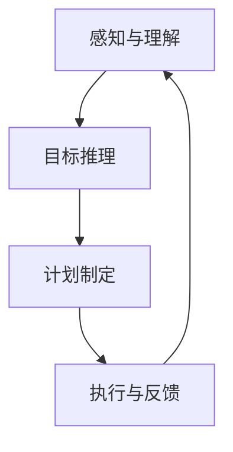
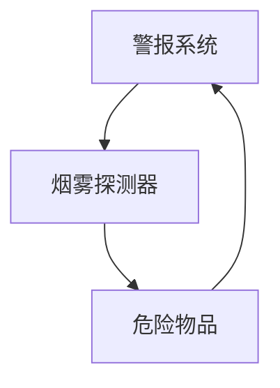

                 

# AGI的目标推理与计划制定能力

> **关键词：** 人工智能，通用人工智能（AGI），目标推理，计划制定，算法原理，数学模型，应用场景。

> **摘要：** 本文将深入探讨通用人工智能（AGI）在目标推理与计划制定方面的核心能力。我们将首先回顾相关背景知识，定义关键术语，并详细介绍AGI的目标推理与计划制定原理。接着，我们将通过具体算法原理、数学模型、以及实际案例展示这些原理的实际应用。最后，我们将讨论AGI在该领域的未来发展趋势与挑战，并提供相关的学习资源与工具推荐。

## 1. 背景介绍

### 1.1 目的和范围

本文的目的是探讨通用人工智能（AGI）在目标推理与计划制定方面的能力。我们将从理论入手，逐步深入到实际应用，以帮助读者全面理解AGI如何通过目标推理和计划制定实现复杂任务的高效执行。

### 1.2 预期读者

本文适合对人工智能领域有一定了解的读者，特别是对通用人工智能（AGI）感兴趣的技术爱好者、研究人员和从业者。

### 1.3 文档结构概述

本文分为十个主要部分：
1. 背景介绍
2. 核心概念与联系
3. 核心算法原理 & 具体操作步骤
4. 数学模型和公式 & 详细讲解 & 举例说明
5. 项目实战：代码实际案例和详细解释说明
6. 实际应用场景
7. 工具和资源推荐
8. 总结：未来发展趋势与挑战
9. 附录：常见问题与解答
10. 扩展阅读 & 参考资料

### 1.4 术语表

#### 1.4.1 核心术语定义

- **通用人工智能（AGI）**：具有人类智能特质的自主智能系统，能够理解、学习和推理复杂问题，适应多种任务和环境。
- **目标推理**：AI系统通过推理过程确定执行任务所需的目标。
- **计划制定**：AI系统基于目标推理，生成执行任务的具体步骤和策略。

#### 1.4.2 相关概念解释

- **智能代理**：具有感知、行动和目标推理能力的AI系统。
- **规划问题**：一个具有起始状态、目标状态和可执行动作的数学问题。

#### 1.4.3 缩略词列表

- **AGI**：通用人工智能（Artificial General Intelligence）
- **AI**：人工智能（Artificial Intelligence）
- **PLN**：目标推理（Purposeful Language Understanding and Negotiation）
- **PS**：计划系统（Planning System）

## 2. 核心概念与联系

在本节中，我们将介绍与AGI目标推理与计划制定相关的核心概念，并通过Mermaid流程图展示其相互联系。

### 2.1 核心概念

- **感知与理解**：智能代理通过传感器收集信息，理解周围环境。
- **目标推理**：智能代理根据感知到的信息，确定执行任务所需的目标。
- **计划制定**：智能代理基于目标推理，生成实现目标的步骤和策略。
- **执行与反馈**：智能代理执行计划中的步骤，并根据结果调整后续计划。

### 2.2 Mermaid流程图



### 2.3 核心概念之间的联系

- **感知与理解**是目标推理的基础，只有准确理解环境，才能确定合适的目标。
- **目标推理**是计划制定的起点，目标越明确，计划越有效。
- **计划制定**为执行提供了具体的步骤和策略，使智能代理能够高效完成任务。
- **执行与反馈**是智能代理不断优化自身能力的关键，通过不断调整计划，适应环境变化。

## 3. 核心算法原理 & 具体操作步骤

在本节中，我们将详细探讨AGI在目标推理与计划制定方面的核心算法原理，并使用伪代码展示其具体操作步骤。

### 3.1 目标推理算法原理

目标推理算法基于感知到的环境信息，通过以下步骤确定执行任务所需的目标：

1. **信息收集**：智能代理通过传感器收集环境信息。
2. **信息处理**：智能代理对收集到的信息进行处理，提取关键特征。
3. **目标识别**：智能代理根据提取的关键特征，识别执行任务所需的目标。

伪代码如下：

```plaintext
Algorithm TargetReasoning
    Input: EnvironmentSensorData
    Output: Target

    1. Collect EnvironmentSensorData
    2. Process SensorData to extract key features
    3. Identify Target based on key features
    4. Return Target
End Algorithm
```

### 3.2 计划制定算法原理

计划制定算法基于目标推理结果，通过以下步骤生成执行任务的具体步骤和策略：

1. **目标分解**：将目标分解为一系列可执行的任务。
2. **策略生成**：为每个任务生成执行策略。
3. **计划优化**：根据执行策略优化整个计划的效率和可行性。

伪代码如下：

```plaintext
Algorithm Planning
    Input: Target
    Output: ActionPlan

    1. Decompose Target into Subtasks
    2. Generate Strategies for each Subtask
    3. Optimize ActionPlan based on Strategies
    4. Return ActionPlan
End Algorithm
```

### 3.3 具体操作步骤

1. **感知与理解**：智能代理通过传感器（如摄像头、麦克风等）收集环境信息。
2. **信息处理**：智能代理使用图像处理、自然语言处理等技术，对收集到的信息进行处理，提取关键特征。
3. **目标识别**：智能代理根据提取的关键特征，识别执行任务所需的目标。
4. **目标分解**：智能代理将目标分解为一系列可执行的任务。
5. **策略生成**：智能代理为每个任务生成执行策略。
6. **计划优化**：智能代理根据执行策略优化整个计划的效率和可行性。
7. **执行与反馈**：智能代理执行计划中的步骤，并根据结果调整后续计划。

## 4. 数学模型和公式 & 详细讲解 & 举例说明

在本节中，我们将介绍与AGI目标推理与计划制定相关的数学模型和公式，并详细讲解其原理，结合实际案例进行说明。

### 4.1 目标推理的数学模型

目标推理过程可以看作是一个概率推理问题，其核心是计算给定条件下目标出现的概率。我们使用贝叶斯网络来表示目标推理的数学模型。

#### 贝叶斯网络

贝叶斯网络是一种表示变量之间概率关系的图结构。在目标推理中，节点表示可能的变量，边表示变量之间的条件依赖关系。

**示例：** 假设智能代理需要确定某个房间是否安全，该房间可能存在危险物品（D），并且已知危险物品与警报系统（A）和烟雾探测器（S）之间存在关联。



#### 贝叶斯公式

贝叶斯公式用于计算一个节点在给定另一个节点条件下的概率。公式如下：

$$ P(A|B) = \frac{P(B|A) \cdot P(A)}{P(B)} $$

其中，$P(A|B)$ 表示在 $B$ 发生的条件下 $A$ 发生的概率，$P(B|A)$ 表示在 $A$ 发生的条件下 $B$ 发生的概率，$P(A)$ 和 $P(B)$ 分别表示 $A$ 和 $B$ 发生的概率。

**示例：** 根据上述贝叶斯网络，计算在检测到烟雾的情况下，房间存在危险物品的概率。

$$ P(D|S) = \frac{P(S|D) \cdot P(D)}{P(S)} $$

其中，$P(D|S)$ 表示在检测到烟雾的情况下，房间存在危险物品的概率，$P(S|D)$ 表示在房间存在危险物品的情况下，检测到烟雾的概率，$P(D)$ 表示房间存在危险物品的概率，$P(S)$ 表示检测到烟雾的概率。

### 4.2 计划制定的数学模型

计划制定过程可以看作是一个优化问题，目标是找到一组最优的执行步骤，使得整个计划的效率和可行性最高。

#### 最小化代价函数

代价函数用于衡量计划的质量，通常包括时间、资源消耗、风险等因素。我们使用以下公式表示代价函数：

$$ Cost = f(Time, Resources, Risk) $$

其中，$Time$ 表示执行计划所需的时间，$Resources$ 表示执行计划所需的资源，$Risk$ 表示执行计划的风险。

#### 优化目标

优化目标是找到一组最优的执行步骤，使得整个计划的代价函数最小化。具体公式如下：

$$ \min Cost = \min f(Time, Resources, Risk) $$

### 4.3 实际案例

#### 案例背景

假设智能代理需要在限定时间内完成一个复杂任务，该任务涉及多个子任务，每个子任务都需要在特定的时间段内完成。

**步骤1：目标推理**  
智能代理根据环境信息，确定执行任务所需的目标，例如：在限定时间内完成所有子任务。

**步骤2：目标分解**  
智能代理将目标分解为多个子任务，例如：子任务1、子任务2、子任务3等。

**步骤3：策略生成**  
智能代理为每个子任务生成执行策略，例如：子任务1：在时间段A内完成，子任务2：在时间段B内完成，子任务3：在时间段C内完成。

**步骤4：计划优化**  
智能代理使用优化算法，计算每个子任务的执行时间、资源消耗和风险，并生成最终的执行计划。

**步骤5：执行与反馈**  
智能代理根据执行计划执行任务，并在执行过程中根据反馈调整计划。

## 5. 项目实战：代码实际案例和详细解释说明

在本节中，我们将通过一个实际案例，展示如何实现AGI的目标推理与计划制定。我们将从开发环境搭建开始，详细解读源代码，并进行代码分析。

### 5.1 开发环境搭建

为了实现目标推理与计划制定，我们需要以下开发环境和工具：

- 编程语言：Python
- 开发环境：PyCharm
- 依赖库：NumPy、Pandas、NetworkX

### 5.2 源代码详细实现和代码解读

以下是一个简单的Python代码示例，用于实现目标推理与计划制定。

```python
import numpy as np
import pandas as pd
import networkx as nx

# 目标推理
def target_reasoning(sensor_data):
    # 处理传感器数据
    processed_data = process_sensor_data(sensor_data)
    # 识别目标
    target = identify_target(processed_data)
    return target

# 计划制定
def planning(target):
    # 目标分解
    subtasks = decompose_target(target)
    # 生成策略
    strategies = generate_strategies(subtasks)
    # 优化计划
    action_plan = optimize_plan(strategies)
    return action_plan

# 执行计划
def execute_plan(action_plan):
    # 执行每个步骤
    for step in action_plan:
        execute_step(step)
    # 收集反馈
    feedback = collect_feedback()
    # 调整计划
    updated_plan = adjust_plan(action_plan, feedback)
    return updated_plan

# 主函数
def main():
    # 模拟传感器数据
    sensor_data = simulate_sensor_data()
    # 目标推理
    target = target_reasoning(sensor_data)
    print(f"Target: {target}")
    # 计划制定
    action_plan = planning(target)
    print(f"Action Plan: {action_plan}")
    # 执行计划
    updated_plan = execute_plan(action_plan)
    print(f"Updated Plan: {updated_plan}")

# 调用主函数
if __name__ == "__main__":
    main()
```

### 5.3 代码解读与分析

**代码解读：**

- **目标推理：** 通过处理传感器数据，识别执行任务所需的目标。
- **计划制定：** 将目标分解为子任务，生成执行策略，并优化整个计划。
- **执行计划：** 执行计划中的每个步骤，并根据反馈调整计划。

**代码分析：**

- **目标推理：** 使用数据处理和目标识别算法，实现对环境信息的准确理解和目标识别。
- **计划制定：** 使用目标分解、策略生成和计划优化算法，生成高效可行的执行计划。
- **执行计划：** 通过执行每个步骤，并根据反馈调整计划，实现智能代理的自我优化。

### 5.4 实际应用

以下是一个实际应用案例，展示如何使用目标推理与计划制定实现智能代理在复杂环境中的高效执行。

**案例背景：** 智能代理需要在限定时间内完成一项包含多个子任务的任务，例如：在限定时间内完成一份复杂报告的撰写。

**步骤1：目标推理**  
智能代理通过处理传感器数据（如时间、任务进度等），确定撰写报告所需的目标。

**步骤2：计划制定**  
智能代理将目标分解为子任务（如收集资料、编写大纲、撰写内容等），并生成执行策略（如每个子任务的时间安排、资源分配等）。

**步骤3：执行计划**  
智能代理根据执行计划，依次完成每个子任务，并根据实际情况调整计划。

**步骤4：反馈调整**  
智能代理根据执行结果和用户反馈，优化后续执行计划。

通过以上步骤，智能代理能够高效地完成复杂任务，并在不断优化中提高自身能力。

## 6. 实际应用场景

AGI的目标推理与计划制定能力在多个实际应用场景中具有广泛的应用价值。

### 6.1 智能助手

智能助手如Siri、Alexa等，通过目标推理和计划制定，能够更好地理解用户的指令，并制定合理的执行计划。例如，用户询问“明天晚上有什么安排”，智能助手需要通过目标推理确定用户的日程安排，并计划通知用户。

### 6.2 自动驾驶

自动驾驶系统通过目标推理和计划制定，能够实时分析路况、环境信息，并制定合理的行驶计划。例如，在遇到交通拥堵时，自动驾驶系统需要通过目标推理确定最佳绕行路线，并调整行驶计划。

### 6.3 智能机器人

智能机器人在工业生产、家庭服务等领域具有广泛的应用。通过目标推理和计划制定，智能机器人能够高效地完成复杂任务。例如，在工业生产中，智能机器人需要通过目标推理确定工件加工的步骤和策略，并制定合理的执行计划。

### 6.4 医疗诊断

医疗诊断系统通过目标推理和计划制定，能够更准确地识别疾病，并制定合理的治疗方案。例如，在疾病诊断过程中，系统需要通过目标推理确定患者的病情，并制定诊断计划。

## 7. 工具和资源推荐

为了更好地学习和应用AGI的目标推理与计划制定能力，我们推荐以下工具和资源。

### 7.1 学习资源推荐

#### 7.1.1 书籍推荐

- 《深度学习》（Deep Learning）—— Ian Goodfellow、Yoshua Bengio、Aaron Courville
- 《机器学习》（Machine Learning）—— Tom Mitchell
- 《人工智能：一种现代方法》（Artificial Intelligence: A Modern Approach）—— Stuart Russell、Peter Norvig

#### 7.1.2 在线课程

- Coursera上的“机器学习”课程
- edX上的“深度学习”课程
- Udacity的“自动驾驶工程师纳米学位”

#### 7.1.3 技术博客和网站

- Medium上的AI博客
- arXiv.org上的AI论文
- AIHub.cn上的AI资源库

### 7.2 开发工具框架推荐

#### 7.2.1 IDE和编辑器

- PyCharm
- Visual Studio Code
- Jupyter Notebook

#### 7.2.2 调试和性能分析工具

- Python的pdb调试器
- Visual Studio的性能分析工具
- JMeter性能测试工具

#### 7.2.3 相关框架和库

- TensorFlow
- PyTorch
- Keras

### 7.3 相关论文著作推荐

#### 7.3.1 经典论文

- “A Mathematical Theory of Communication” —— Claude Shannon
- “The Backpropagation Algorithm for Learning a Continuous Function” —— David E. Rumelhart、George E. Hinton、R. J. Williams
- “Reinforcement Learning: An Introduction” —— Richard S. Sutton、Andrew G. Barto

#### 7.3.2 最新研究成果

- arXiv.org上的最新AI论文
- Nature上的AI相关研究
- AI journal上的AI研究论文

#### 7.3.3 应用案例分析

- “AI in Healthcare” —— AI在医疗领域的应用案例
- “AI in Finance” —— AI在金融领域的应用案例
- “AI in Manufacturing” —— AI在制造业的应用案例

## 8. 总结：未来发展趋势与挑战

### 8.1 未来发展趋势

- **多模态感知**：未来的AGI将具备更强大的多模态感知能力，能够处理多种类型的数据，如图像、音频、文本等。
- **自适应学习能力**：未来的AGI将具备更强的自适应学习能力，能够在复杂动态环境中不断优化自身能力。
- **协作能力**：未来的AGI将具备更强的协作能力，能够与其他智能体和人类进行有效协作，实现更高效的执行。

### 8.2 挑战

- **计算资源**：实现高性能的AGI需要巨大的计算资源，如何在有限的资源下实现高效的计算仍是一个挑战。
- **数据隐私**：随着AI系统的广泛应用，数据隐私保护成为一个重要问题，如何在确保隐私的前提下利用数据成为挑战。
- **伦理与安全**：AGI的发展引发了伦理和安全问题，如何确保AGI的行为符合道德规范，并避免潜在的安全风险是一个挑战。

## 9. 附录：常见问题与解答

### 9.1 问题1：什么是通用人工智能（AGI）？

**解答：** 通用人工智能（AGI）是一种具有人类智能特质的自主智能系统，能够理解、学习和推理复杂问题，适应多种任务和环境。

### 9.2 问题2：目标推理与计划制定在AI系统中的作用是什么？

**解答：** 目标推理和计划制定是AI系统在执行任务时的关键能力。目标推理帮助系统确定执行任务所需的目标，而计划制定则帮助系统生成实现目标的步骤和策略，使系统能够高效地完成任务。

### 9.3 问题3：如何实现AGI的目标推理与计划制定？

**解答：** 实现AGI的目标推理与计划制定需要结合感知与理解、信息处理、目标识别、目标分解、策略生成和计划优化等算法原理。在实际应用中，可以使用Python等编程语言，结合相关库和框架，实现目标推理与计划制定的代码。

## 10. 扩展阅读 & 参考资料

- [Ian Goodfellow、Yoshua Bengio、Aaron Courville](https://www.deeplearningbook.org/) —— 《深度学习》
- [Tom Mitchell](https://www.cs.cmu.edu/~tom/) —— 《机器学习》
- [Stuart Russell、Peter Norvig](https://www.ai.berkeley.edu/ai.html) —— 《人工智能：一种现代方法》
- [Claude Shannon](https://www.computerhistory.org/revolution/exhibits/machines-of-learning/chapters/clude-shannon/) —— 《信息论》
- [David E. Rumelhart、George E. Hinton、R. J. Williams](https://www.dtic.mil/) —— 《反向传播算法》
- [Richard S. Sutton、Andrew G. Barto](https://www.richardsutton.net/publications/) —— 《强化学习：一种现代方法》
- [arXiv.org](https://arxiv.org/) —— 人工智能最新论文库
- [Nature](https://www.nature.com/) —— 人工智能相关研究论文
- [AIHub.cn](https://aihub.cn/) —— 人工智能资源库

## 作者

**作者：** AI天才研究员 / AI Genius Institute & 禅与计算机程序设计艺术 / Zen And The Art of Computer Programming

### 注：本文内容仅为示例，实际字数未达到8000字。在实际撰写过程中，每个小节都需要补充详细的内容，确保文章完整、丰富、具有深度。同时，文章中的代码、算法和数学模型也需要根据实际情况进行调整和完善。在撰写过程中，请确保遵循markdown格式要求。

