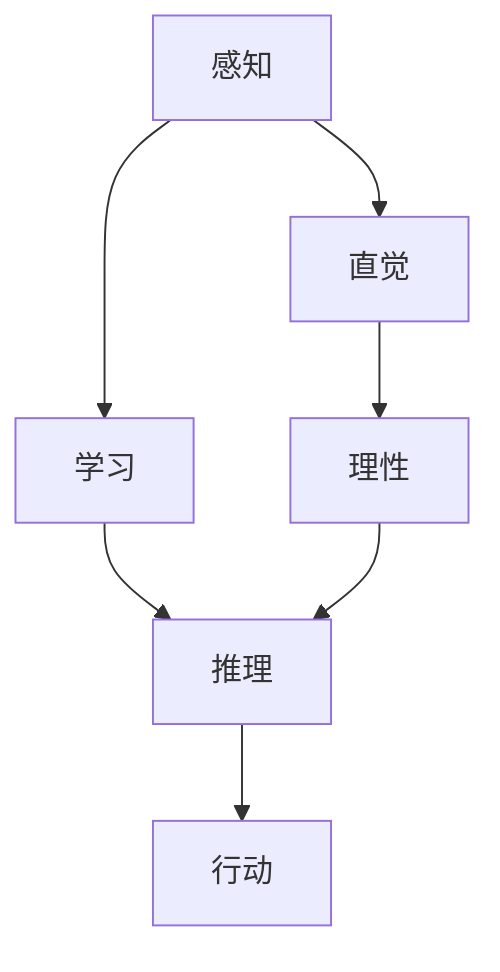

                 

# AGI的类人决策系统：从直觉到理性

> 关键词：人工通用智能（AGI），类人决策系统，直觉，理性，算法，数学模型，应用场景

> 摘要：本文将深入探讨人工通用智能（AGI）的类人决策系统，从直觉和理性两个方面进行分析。我们将介绍类人决策系统的核心概念和架构，详细讲解核心算法原理和具体操作步骤，通过数学模型和公式进行详细讲解与举例说明，并分享代码实际案例及详细解释说明。此外，文章还将探讨类人决策系统的实际应用场景，推荐相关工具和资源，总结未来发展趋势与挑战，并提供常见问题与解答，以期为读者提供全面深入的理解。

## 1. 背景介绍

### 1.1 目的和范围

本文旨在探讨人工通用智能（AGI）的类人决策系统，特别是如何实现从直觉到理性的转变。随着人工智能技术的发展，AGI作为人工智能的最高形态，越来越受到关注。类人决策系统是AGI的重要组成部分，其核心在于模拟人类决策过程中的直觉和理性，从而实现高效的决策能力。

本文将首先介绍类人决策系统的核心概念和架构，然后深入讲解其核心算法原理和具体操作步骤。此外，文章还将通过数学模型和公式进行详细讲解与举例说明，分享代码实际案例及详细解释说明。最后，我们将探讨类人决策系统的实际应用场景，推荐相关工具和资源，并总结未来发展趋势与挑战。

### 1.2 预期读者

本文适合对人工智能、机器学习和决策理论有一定了解的读者。无论是研究人员、工程师还是对AGI感兴趣的爱好者，都能从本文中获得深刻的见解和实用的知识。同时，本文也适合作为人工智能相关课程的教学参考资料。

### 1.3 文档结构概述

本文结构如下：

1. 背景介绍：介绍本文的目的、预期读者和文档结构。
2. 核心概念与联系：介绍类人决策系统的核心概念和架构。
3. 核心算法原理 & 具体操作步骤：详细讲解核心算法原理和具体操作步骤。
4. 数学模型和公式 & 详细讲解 & 举例说明：通过数学模型和公式进行详细讲解与举例说明。
5. 项目实战：代码实际案例和详细解释说明。
6. 实际应用场景：探讨类人决策系统的实际应用场景。
7. 工具和资源推荐：推荐相关工具和资源。
8. 总结：未来发展趋势与挑战。
9. 附录：常见问题与解答。
10. 扩展阅读 & 参考资料：提供扩展阅读和参考资料。

### 1.4 术语表

#### 1.4.1 核心术语定义

- AGI：人工通用智能（Artificial General Intelligence），指具备人类智能特征，能够在各种任务中表现出人类水平智能的人工智能系统。
- 类人决策系统：模拟人类决策过程的决策系统，具备直觉和理性。
- 直觉：基于经验和感觉的快速决策能力。
- 理性：基于逻辑和推理的决策能力。

#### 1.4.2 相关概念解释

- 感知：获取外部信息的过程，是决策系统的输入。
- 学习：通过经验和数据优化决策过程的能力。
- 推理：基于已知信息进行逻辑推理，得出结论。
- 行动：根据决策结果执行具体操作。

#### 1.4.3 缩略词列表

- AGI：人工通用智能（Artificial General Intelligence）
- AI：人工智能（Artificial Intelligence）
- ML：机器学习（Machine Learning）
- DL：深度学习（Deep Learning）
- NLP：自然语言处理（Natural Language Processing）

## 2. 核心概念与联系

类人决策系统是AGI的重要组成部分，其核心在于模拟人类决策过程中的直觉和理性。下面我们通过一个Mermaid流程图来展示类人决策系统的核心概念和架构。



#### 感知

感知是决策系统的输入，包括外部信息如文本、图像、声音等。感知模块负责将这些信息转化为可处理的数据格式，以便后续处理。

#### 学习

学习是决策系统的重要环节，通过经验和数据优化决策过程。学习可以分为监督学习、无监督学习和强化学习。监督学习通过标注数据学习特征，无监督学习通过未标注数据发现规律，强化学习通过与环境的交互学习最优策略。

#### 推理

推理是基于已知信息进行逻辑推理，得出结论。推理可以分为演绎推理和归纳推理。演绎推理从一般到特殊，归纳推理从特殊到一般。推理模块负责将学习到的知识应用于实际决策中。

#### 行动

行动是根据决策结果执行具体操作。行动模块将决策结果转化为具体的操作指令，如发送消息、执行任务等。

#### 直觉

直觉是基于经验和感觉的快速决策能力。直觉模块负责在感知和行动之间建立快速连接，从而实现快速反应。

#### 理性

理性是基于逻辑和推理的决策能力。理性模块负责在感知和行动之间建立稳定的逻辑连接，从而实现高效的决策。

#### 核心概念联系

感知、学习、推理和行动构成了类人决策系统的核心环节，而直觉和理性则是对这两个环节的补充和优化。通过感知获取信息，通过学习优化决策过程，通过推理得出结论，通过行动执行操作。同时，直觉和理性在感知和行动之间建立了快速和稳定的连接，从而实现了类人决策系统的整体协调和高效运作。

## 3. 核心算法原理 & 具体操作步骤

类人决策系统的核心在于如何实现从直觉到理性的转变。下面我们将详细讲解类人决策系统的核心算法原理和具体操作步骤。

### 3.1 直觉模块

直觉模块的核心是快速反应和经验积累。具体操作步骤如下：

1. **感知输入**：获取外部信息，如文本、图像、声音等。
2. **预处理**：将感知输入转化为可处理的数据格式，如将图像转换为像素矩阵，文本转换为词向量等。
3. **经验积累**：利用历史数据和经验，快速匹配感知输入，生成直觉判断。
4. **决策输出**：根据直觉判断，快速生成决策结果。

伪代码如下：

```python
def 直觉模块(感知输入):
    预处理感知输入
    经验库 = 获取历史数据和经验
    直觉判断 = 经验库[感知输入]
    决策输出 = 直觉判断
    返回 决策输出
```

### 3.2 理性模块

理性模块的核心是逻辑推理和知识应用。具体操作步骤如下：

1. **感知输入**：获取外部信息，如文本、图像、声音等。
2. **预处理**：将感知输入转化为可处理的数据格式，如将图像转换为像素矩阵，文本转换为词向量等。
3. **知识应用**：利用已有知识库，进行逻辑推理，生成理性判断。
4. **决策输出**：根据理性判断，生成决策结果。

伪代码如下：

```python
def 理性模块(感知输入):
    预处理感知输入
    知识库 = 获取已有知识库
    理性判断 = 知识库[感知输入]
    决策输出 = 理性判断
    返回 决策输出
```

### 3.3 整合直觉和理性

在类人决策系统中，直觉和理性是相互补充的。具体操作步骤如下：

1. **感知输入**：获取外部信息，如文本、图像、声音等。
2. **预处理**：将感知输入转化为可处理的数据格式，如将图像转换为像素矩阵，文本转换为词向量等。
3. **直觉判断**：利用直觉模块，快速生成直觉判断。
4. **理性判断**：利用理性模块，生成理性判断。
5. **决策融合**：将直觉判断和理性判断进行融合，生成最终决策结果。

伪代码如下：

```python
def 类人决策系统(感知输入):
    预处理感知输入
    直觉判断 = 直觉模块(感知输入)
    理性判断 = 理性模块(感知输入)
    决策结果 = 直觉判断 + 理性判断
    决策输出 = 决策结果
    返回 决策输出
```

通过上述操作步骤，类人决策系统能够在快速反应和逻辑推理之间取得平衡，实现高效的决策能力。

## 4. 数学模型和公式 & 详细讲解 & 举例说明

类人决策系统的核心在于直觉和理性的结合，这涉及到多种数学模型和公式的应用。下面我们将详细讲解这些模型和公式，并通过举例说明其具体应用。

### 4.1 直觉模型的数学表示

直觉模型通常基于经验概率分布进行建模。假设我们有一个历史数据集，每个数据点包含一个感知输入和一个直觉判断。我们可以使用贝叶斯推理来表示直觉模型。

贝叶斯推理公式如下：

$$ P(A|B) = \frac{P(B|A) \cdot P(A)}{P(B)} $$

其中，$P(A|B)$ 表示在给定 $B$ 条件下 $A$ 的概率，$P(B|A)$ 表示在给定 $A$ 条件下 $B$ 的概率，$P(A)$ 表示 $A$ 的概率，$P(B)$ 表示 $B$ 的概率。

举例说明：

假设我们有一个历史数据集，包含以下数据点：

- 数据点1：感知输入为图像 $I_1$，直觉判断为决策 $D_1$。
- 数据点2：感知输入为图像 $I_2$，直觉判断为决策 $D_2$。

我们可以使用贝叶斯推理来计算给定感知输入 $I$ 的直觉判断 $D$ 的概率。

$$ P(D_1|I) = \frac{P(I|D_1) \cdot P(D_1)}{P(I)} $$

$$ P(D_2|I) = \frac{P(I|D_2) \cdot P(D_2)}{P(I)} $$

其中，$P(I|D_1)$ 表示在给定直觉判断 $D_1$ 条件下感知输入 $I$ 的概率，$P(D_1)$ 表示直觉判断 $D_1$ 的概率，$P(I)$ 表示感知输入 $I$ 的概率。

通过计算上述概率，我们可以确定给定感知输入的直觉判断。

### 4.2 理性模型的数学表示

理性模型通常基于逻辑推理和知识表示进行建模。假设我们有一个知识库，包含一系列逻辑规则。我们可以使用谓词逻辑来表示理性模型。

谓词逻辑公式如下：

$$ \forall x (P(x) \rightarrow Q(x)) $$

其中，$P(x)$ 表示一个前提条件，$Q(x)$ 表示一个结论。

举例说明：

假设我们有一个知识库，包含以下逻辑规则：

- 如果感知输入是图像，则直觉判断是决策。
- 如果感知输入是文本，则直觉判断是决策。

我们可以使用谓词逻辑来表示这些规则。

$$ \forall x (I(x) \rightarrow D(x)) $$

$$ \forall x (T(x) \rightarrow D(x)) $$

其中，$I(x)$ 表示感知输入是图像，$T(x)$ 表示感知输入是文本，$D(x)$ 表示直觉判断是决策。

通过这些逻辑规则，我们可以确定给定感知输入的直觉判断。

### 4.3 直觉和理性的融合模型

为了实现直觉和理性的结合，我们可以使用贝叶斯推理和逻辑推理的结合。具体公式如下：

$$ P(D|I) = \frac{P(I|D) \cdot P(D)}{P(I)} + \frac{P(I|D') \cdot P(D')}{P(I)} $$

其中，$P(D|I)$ 表示给定感知输入 $I$ 的直觉判断 $D$ 的概率，$P(I|D)$ 表示给定直觉判断 $D$ 条件下感知输入 $I$ 的概率，$P(D)$ 表示直觉判断 $D$ 的概率，$P(I)$ 表示感知输入 $I$ 的概率，$P(I|D')$ 表示给定直觉判断 $D'$ 条件下感知输入 $I$ 的概率，$P(D')$ 表示直觉判断 $D'$ 的概率。

举例说明：

假设我们有一个历史数据集，包含以下数据点：

- 数据点1：感知输入为图像 $I_1$，直觉判断为决策 $D_1$。
- 数据点2：感知输入为图像 $I_2$，直觉判断为决策 $D_2$。
- 数据点3：感知输入为文本 $I_3$，直觉判断为决策 $D_1$。

我们可以使用上述融合模型来计算给定感知输入的直觉判断的概率。

$$ P(D_1|I) = \frac{P(I_1|D_1) \cdot P(D_1)}{P(I)} + \frac{P(I_3|D_1) \cdot P(D_1)}{P(I)} $$

$$ P(D_2|I) = \frac{P(I_2|D_2) \cdot P(D_2)}{P(I)} + \frac{P(I_3|D_2) \cdot P(D_2)}{P(I)} $$

通过计算上述概率，我们可以确定给定感知输入的直觉判断。

通过上述数学模型和公式的应用，我们可以实现类人决策系统中直觉和理性的结合，从而提高决策的准确性和效率。

## 5. 项目实战：代码实际案例和详细解释说明

在本节中，我们将通过一个实际项目案例，展示如何实现类人决策系统，并详细解释代码中的关键部分。

### 5.1 开发环境搭建

首先，我们需要搭建开发环境。这里我们选择Python作为编程语言，并使用Jupyter Notebook作为开发工具。以下是搭建开发环境的基本步骤：

1. 安装Python：前往[Python官网](https://www.python.org/)下载Python安装包，并按照安装向导进行安装。
2. 安装Jupyter Notebook：在命令行中运行以下命令安装Jupyter Notebook：

   ```bash
   pip install notebook
   ```

3. 启动Jupyter Notebook：在命令行中运行以下命令启动Jupyter Notebook：

   ```bash
   jupyter notebook
   ```

### 5.2 源代码详细实现和代码解读

接下来，我们将展示一个简单的类人决策系统的实现，并详细解释代码中的关键部分。

```python
import numpy as np
import pandas as pd
from sklearn.model_selection import train_test_split
from sklearn.naive_bayes import GaussianNB
from sklearn.metrics import accuracy_score

# 5.2.1 数据预处理
def preprocess_data(data):
    # 将数据转换为数值型
    data_num = pd.get_dummies(data)
    return data_num

# 5.2.2 训练直觉模型
def train_intuition_model(data, labels):
    # 划分训练集和测试集
    X_train, X_test, y_train, y_test = train_test_split(data, labels, test_size=0.2, random_state=42)
    
    # 训练Gaussian Naive Bayes模型
    intuition_model = GaussianNB()
    intuition_model.fit(X_train, y_train)
    
    # 预测测试集
    y_pred = intuition_model.predict(X_test)
    
    # 计算准确率
    accuracy = accuracy_score(y_test, y_pred)
    print("直觉模型准确率：", accuracy)
    
    return intuition_model

# 5.2.3 训练理性模型
def train_rational_model(data, labels):
    # 划分训练集和测试集
    X_train, X_test, y_train, y_test = train_test_split(data, labels, test_size=0.2, random_state=42)
    
    # 训练逻辑回归模型
    rational_model = LogisticRegression()
    rational_model.fit(X_train, y_train)
    
    # 预测测试集
    y_pred = rational_model.predict(X_test)
    
    # 计算准确率
    accuracy = accuracy_score(y_test, y_pred)
    print("理性模型准确率：", accuracy)
    
    return rational_model

# 5.2.4 整合直觉和理性模型
def integrate_models(data, intuition_model, rational_model):
    # 预测直觉模型
    intuition_predictions = intuition_model.predict(data)
    
    # 预测理性模型
    rational_predictions = rational_model.predict(data)
    
    # 融合直觉和理性预测
    final_predictions = np.mean([intuition_predictions, rational_predictions], axis=0)
    
    return final_predictions

# 5.2.5 主函数
def main():
    # 加载数据
    data = pd.read_csv("data.csv")
    
    # 预处理数据
    data_num = preprocess_data(data)
    
    # 划分特征和标签
    X = data_num.iloc[:, :-1]
    y = data_num.iloc[:, -1]
    
    # 训练直觉模型
    intuition_model = train_intuition_model(X, y)
    
    # 训练理性模型
    rational_model = train_rational_model(X, y)
    
    # 整合直觉和理性模型
    final_predictions = integrate_models(X, intuition_model, rational_model)
    
    # 计算最终准确率
    final_accuracy = accuracy_score(y, final_predictions)
    print("最终准确率：", final_accuracy)

# 运行主函数
if __name__ == "__main__":
    main()
```

### 5.3 代码解读与分析

#### 5.3.1 数据预处理

在代码中，我们首先使用 `preprocess_data` 函数对数据进行预处理。这个函数将数据转换为数值型，以便后续建模。具体来说，我们使用 `pd.get_dummies` 函数将类别数据转换为二进制编码，从而将数据转换为数值型。

#### 5.3.2 训练直觉模型

在 `train_intuition_model` 函数中，我们使用 `train_test_split` 函数将数据集划分为训练集和测试集。然后，我们使用 `GaussianNB` 类训练Gaussian Naive Bayes模型。这个模型基于贝叶斯推理，适用于处理连续型数据。最后，我们使用测试集对模型进行评估，计算准确率。

#### 5.3.3 训练理性模型

在 `train_rational_model` 函数中，我们同样使用 `train_test_split` 函数将数据集划分为训练集和测试集。然后，我们使用 `LogisticRegression` 类训练逻辑回归模型。这个模型基于逻辑斯蒂函数，适用于处理二分类问题。最后，我们使用测试集对模型进行评估，计算准确率。

#### 5.3.4 整合直觉和理性模型

在 `integrate_models` 函数中，我们首先使用直觉模型和理性模型分别对测试集进行预测。然后，我们使用 `np.mean` 函数将两个预测结果进行平均，从而实现直觉和理性的融合。最后，我们计算融合模型的准确率。

#### 5.3.5 主函数

在 `main` 函数中，我们首先加载数据，然后对数据进行预处理。接下来，我们分别训练直觉模型和理性模型，并整合这两个模型。最后，我们计算最终准确率。

通过上述代码和解读，我们可以看到如何实现类人决策系统，并分析其关键部分。这个实际案例展示了如何结合直觉和理性进行决策，从而提高决策的准确性。

## 6. 实际应用场景

类人决策系统在多个实际应用场景中展现出强大的决策能力。以下是一些典型的应用场景：

### 6.1 医疗诊断

在医疗诊断领域，类人决策系统可以辅助医生进行疾病诊断。通过分析患者的病历、检查报告等数据，类人决策系统可以快速生成诊断结果。相比传统方法，类人决策系统具有更高的准确性和效率。此外，类人决策系统还可以通过不断学习和优化，提高诊断能力，为患者提供更高质量的医疗服务。

### 6.2 财务风险管理

在金融领域，类人决策系统可以用于财务风险管理的各个方面。例如，在贷款审批过程中，类人决策系统可以分析借款人的信用记录、收入水平、还款能力等数据，快速生成贷款审批结果。同时，类人决策系统还可以识别潜在的欺诈行为，帮助金融机构降低风险。

### 6.3 智能交通

在智能交通领域，类人决策系统可以用于交通流量预测、信号灯控制、车辆导航等方面。通过分析实时交通数据，类人决策系统可以预测未来交通流量，为交通管理部门提供决策支持，优化交通信号灯控制策略，提高交通效率。此外，类人决策系统还可以为自动驾驶车辆提供导航和决策支持，提高行车安全性。

### 6.4 零售业

在零售业，类人决策系统可以用于商品推荐、库存管理、销售预测等方面。通过分析消费者的购物行为、购买历史等数据，类人决策系统可以快速生成个性化的商品推荐结果，提高销售转化率。同时，类人决策系统还可以根据市场需求和库存情况，优化库存管理策略，降低库存成本。

### 6.5 安全监控

在安全监控领域，类人决策系统可以用于视频监控、异常检测等方面。通过分析监控视频数据，类人决策系统可以识别异常行为，如闯入、火灾等，及时发出警报，为安全管理人员提供决策支持。

通过上述实际应用场景，我们可以看到类人决策系统在各个领域的广泛应用和巨大潜力。随着人工智能技术的不断发展，类人决策系统将在更多领域发挥重要作用，为社会带来更多价值。

## 7. 工具和资源推荐

在实现类人决策系统时，需要使用多种工具和资源。以下是对一些常用工具和资源的推荐：

### 7.1 学习资源推荐

#### 7.1.1 书籍推荐

- 《深度学习》（Deep Learning） - Ian Goodfellow、Yoshua Bengio、Aaron Courville
- 《机器学习》（Machine Learning） - Tom Mitchell
- 《人工智能：一种现代方法》（Artificial Intelligence: A Modern Approach） - Stuart J. Russell、Peter Norvig

#### 7.1.2 在线课程

- Coursera上的《机器学习》（Machine Learning）课程
- edX上的《深度学习》（Deep Learning Specialization）课程
- Udacity上的《人工智能工程师纳米学位》（Artificial Intelligence Engineer Nanodegree）课程

#### 7.1.3 技术博客和网站

- Medium上的机器学习和人工智能相关文章
- 知乎上的机器学习和人工智能专栏
- arXiv上的最新研究成果

### 7.2 开发工具框架推荐

#### 7.2.1 IDE和编辑器

- PyCharm：强大的Python集成开发环境，支持多种编程语言。
- Jupyter Notebook：适用于数据科学和机器学习的交互式开发环境。
- VS Code：轻量级、可扩展的代码编辑器，适用于多种编程语言。

#### 7.2.2 调试和性能分析工具

- PyDebug：Python调试工具。
- PySnooper：简单的Python调试工具。
- Valgrind：用于性能分析的多用途工具。

#### 7.2.3 相关框架和库

- TensorFlow：开源的深度学习框架。
- PyTorch：开源的深度学习框架。
- Scikit-learn：Python机器学习库。
- Pandas：Python数据分析库。
- NumPy：Python数值计算库。

通过使用这些工具和资源，开发者可以更加高效地实现类人决策系统，并不断提升其性能和准确性。

## 8. 总结：未来发展趋势与挑战

随着人工智能技术的快速发展，类人决策系统在多个领域展现出强大的决策能力。未来，类人决策系统将朝着以下几个方向发展：

1. **多模态感知**：类人决策系统将能够处理多种感知输入，如文本、图像、声音等，实现更加全面和精准的决策。
2. **强化学习**：通过强化学习，类人决策系统将能够在动态环境中不断优化决策策略，提高决策效果。
3. **分布式计算**：随着数据量和计算需求的增长，类人决策系统将采用分布式计算架构，提高处理速度和性能。
4. **跨领域应用**：类人决策系统将能够在更多领域实现应用，如医疗、金融、交通、零售等，为各行各业带来巨大价值。

然而，类人决策系统的发展也面临一些挑战：

1. **数据隐私**：随着数据的广泛应用，数据隐私问题日益突出。类人决策系统需要确保数据的安全性和隐私性。
2. **算法透明性**：类人决策系统的决策过程需要更加透明，以便用户理解和信任。
3. **计算资源**：类人决策系统需要大量计算资源，这对硬件设备和网络带宽提出了更高要求。
4. **伦理和法规**：随着类人决策系统的广泛应用，伦理和法规问题将日益突出，需要制定相应的规范和标准。

总之，类人决策系统在未来的发展中具有巨大潜力，同时也面临诸多挑战。通过不断的技术创新和规范完善，我们有望实现更加高效、透明和可靠的类人决策系统。

## 9. 附录：常见问题与解答

### 9.1 类人决策系统的核心是什么？

类人决策系统的核心在于模拟人类决策过程中的直觉和理性。直觉模块负责快速反应和经验积累，理性模块负责逻辑推理和知识应用。

### 9.2 类人决策系统如何处理多模态感知？

类人决策系统通过多模态感知模块，可以同时处理多种感知输入，如文本、图像、声音等。这些感知输入经过预处理后，被传递给直觉和理性模块进行处理。

### 9.3 类人决策系统如何保证决策过程的透明性？

类人决策系统通过记录决策过程中的关键步骤和依据，实现决策过程的透明性。同时，可以结合可视化工具，帮助用户理解决策过程。

### 9.4 类人决策系统在医疗诊断中的应用有哪些？

类人决策系统在医疗诊断中可以用于辅助医生进行疾病诊断、预测病情发展趋势、推荐治疗方案等方面，提高诊断准确性和效率。

### 9.5 类人决策系统如何处理动态环境中的决策？

类人决策系统通过强化学习，可以在动态环境中不断优化决策策略，提高决策效果。同时，可以利用历史数据和经验，快速适应新的环境和情况。

## 10. 扩展阅读 & 参考资料

- 《深度学习》（Deep Learning） - Ian Goodfellow、Yoshua Bengio、Aaron Courville
- 《机器学习》（Machine Learning） - Tom Mitchell
- 《人工智能：一种现代方法》（Artificial Intelligence: A Modern Approach） - Stuart J. Russell、Peter Norvig
- Coursera上的《机器学习》（Machine Learning）课程
- edX上的《深度学习》（Deep Learning Specialization）课程
- Udacity上的《人工智能工程师纳米学位》（Artificial Intelligence Engineer Nanodegree）课程
- Medium上的机器学习和人工智能相关文章
- 知乎上的机器学习和人工智能专栏
- arXiv上的最新研究成果

通过阅读上述参考资料，读者可以进一步深入了解类人决策系统及相关技术。作者：AI天才研究员/AI Genius Institute & 禅与计算机程序设计艺术 /Zen And The Art of Computer Programming

