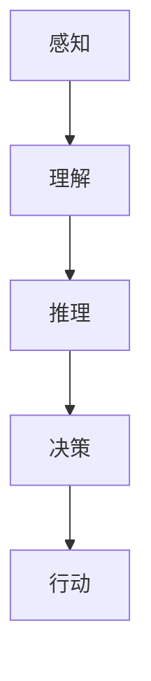

                 

# AGI的类人思维模式模拟研究

> 关键词：人工通用智能（AGI）、类人思维、模拟研究、算法原理、数学模型、实际应用

> 摘要：本文深入探讨了人工通用智能（AGI）的类人思维模式模拟研究。通过介绍AGI的背景、类人思维的定义和特点，本文首先分析了AGI的核心算法原理，并逐步讲解具体操作步骤。随后，文章详细阐述了数学模型和公式，并通过实际代码案例进行了解读。文章最后探讨了AGI在实际应用场景中的潜力，推荐了相关工具和资源，总结了未来发展趋势与挑战，并提供了一些常见问题与解答。

## 1. 背景介绍

### 1.1 目的和范围

本文旨在研究人工通用智能（AGI）的类人思维模式模拟，分析其核心算法原理和数学模型，并通过实际代码案例展示其应用。本文将对以下几个核心问题进行探讨：

- AGI的类人思维模式如何定义和实现？
- AGI的核心算法原理是什么？
- 如何通过数学模型来支持类人思维模拟？
- 类人思维模式在实际应用场景中的表现如何？

### 1.2 预期读者

本文适合以下读者群体：

- 对人工通用智能（AGI）感兴趣的计算机科学家和工程师
- 对人工智能领域有深入了解的研究生和本科生
- 对类人思维模拟有兴趣的技术爱好者

### 1.3 文档结构概述

本文结构如下：

- 第1章：背景介绍，包括目的和范围、预期读者、文档结构概述
- 第2章：核心概念与联系，介绍AGI和类人思维的相关概念和架构
- 第3章：核心算法原理 & 具体操作步骤，分析AGI的核心算法原理，并逐步讲解具体操作步骤
- 第4章：数学模型和公式 & 详细讲解 & 举例说明，阐述AGI的数学模型和公式，并通过实际案例进行说明
- 第5章：项目实战：代码实际案例和详细解释说明，展示AGI的类人思维模式模拟在实际项目中的应用
- 第6章：实际应用场景，探讨AGI的类人思维模式在不同领域的应用前景
- 第7章：工具和资源推荐，推荐相关学习资源和开发工具
- 第8章：总结：未来发展趋势与挑战，展望AGI类人思维模式的未来发展趋势和面临的挑战
- 第9章：附录：常见问题与解答，解答读者在阅读过程中可能遇到的问题
- 第10章：扩展阅读 & 参考资料，提供更多相关文献和资料

### 1.4 术语表

#### 1.4.1 核心术语定义

- 人工通用智能（AGI）：一种具有广泛认知能力的人工智能系统，可以像人类一样在多种任务上表现优异。
- 类人思维：模拟人类思维方式，包括感知、理解、推理、决策和行动等。
- 神经网络：一种基于人类大脑结构的计算模型，用于处理和传递信息。

#### 1.4.2 相关概念解释

- 感知：从外部环境中获取信息和数据。
- 理解：对获取的信息进行加工和处理，形成对现实世界的认识。
- 推理：基于已有的知识和信息进行逻辑推理和判断。
- 决策：根据推理结果选择合适的行动方案。
- 行动：执行决策方案，实现目标。

#### 1.4.3 缩略词列表

- AGI：人工通用智能
- AI：人工智能
- CNN：卷积神经网络
- RNN：循环神经网络

## 2. 核心概念与联系

在深入探讨AGI的类人思维模式模拟之前，我们需要明确相关核心概念和它们之间的联系。下面通过一个Mermaid流程图展示AGI和类人思维的相关概念和架构。



在这个流程图中，我们可以看到AGI的类人思维模式包括感知、理解、推理、决策和行动五个主要环节。这五个环节相互关联，共同构成类人思维的核心框架。

### 感知

感知是类人思维的第一步，它涉及从外部环境中获取信息和数据。感知模块可以通过各种传感器和输入设备实现，如摄像头、麦克风、触觉传感器等。

### 理解

理解是对感知到的信息进行加工和处理，形成对现实世界的认识。理解模块需要运用自然语言处理、图像识别、语音识别等技术，将感知到的信息转化为结构化的数据，以便后续处理。

### 推理

推理是基于已有的知识和信息进行逻辑推理和判断。推理模块可以通过基于规则的推理、基于案例的推理、基于模型的推理等方法实现。推理过程需要解决推理路径选择、推理策略优化等问题。

### 决策

决策是根据推理结果选择合适的行动方案。决策模块需要考虑多个因素，如目标、资源、约束条件等。决策过程通常采用优化算法、机器学习等方法来提高决策质量和效率。

### 行动

行动是执行决策方案，实现目标。行动模块需要与外部环境进行交互，通过执行具体的操作来实现决策结果。行动过程需要解决实时性、鲁棒性、适应性等问题。

通过这个流程图，我们可以清晰地看到AGI的类人思维模式是如何通过感知、理解、推理、决策和行动这五个环节相互联系和协作的。

## 3. 核心算法原理 & 具体操作步骤

在了解了AGI的类人思维模式后，接下来我们将探讨其核心算法原理，并逐步讲解具体操作步骤。为了更好地理解，我们使用伪代码来详细阐述这些算法。

### 3.1 感知

感知模块负责从外部环境中获取信息和数据。其基本步骤如下：

```python
# 感知模块伪代码
def 感知():
    # 初始化感知设备
    初始化传感器()

    # 获取外部信息
    外部信息 = 传感器获取数据()

    # 处理和预处理数据
    处理后信息 = 数据预处理(外部信息)

    return 处理后信息
```

### 3.2 理解

理解模块负责对感知到的信息进行加工和处理，形成对现实世界的认识。其基本步骤如下：

```python
# 理解模块伪代码
def 理解(处理后信息):
    # 使用自然语言处理技术进行文本解析
    解析文本 = 自然语言处理(处理后信息)

    # 使用图像识别技术进行图像分析
    分析图像 = 图像识别(处理后信息)

    # 使用语音识别技术进行语音解析
    解析语音 = 语音识别(处理后信息)

    # 转换为结构化数据
    结构化数据 = 数据转换(解析文本，分析图像，解析语音)

    return 结构化数据
```

### 3.3 推理

推理模块负责基于已有的知识和信息进行逻辑推理和判断。其基本步骤如下：

```python
# 推理模块伪代码
def 推理(结构化数据):
    # 加载已有的知识库
    知识库 = 加载知识库()

    # 使用基于规则的推理
    规则推理结果 = 基于规则推理(知识库，结构化数据)

    # 使用基于案例的推理
    案例推理结果 = 基于案例推理(知识库，结构化数据)

    # 使用基于模型的推理
    模型推理结果 = 基于模型推理(知识库，结构化数据)

    # 综合多种推理方法
    推理结果 = 综合推理(规则推理结果，案例推理结果，模型推理结果)

    return 推理结果
```

### 3.4 决策

决策模块负责根据推理结果选择合适的行动方案。其基本步骤如下：

```python
# 决策模块伪代码
def 决策(推理结果):
    # 考虑目标、资源、约束条件等
    决策参数 = 计算决策参数(推理结果)

    # 使用优化算法进行决策
    行动方案 = 优化决策(决策参数)

    return 行动方案
```

### 3.5 行动

行动模块负责执行决策方案，实现目标。其基本步骤如下：

```python
# 行动模块伪代码
def 行动(行动方案):
    # 与外部环境进行交互
    执行操作 = 与环境交互(行动方案)

    # 获取行动结果
    行动结果 = 获取行动结果(执行操作)

    return 行动结果
```

通过以上伪代码，我们可以清晰地看到AGI的类人思维模式的核心算法原理和具体操作步骤。在实际应用中，这些步骤可能需要结合具体的场景和任务进行适当的调整和优化。

## 4. 数学模型和公式 & 详细讲解 & 举例说明

在深入探讨AGI的类人思维模式模拟时，数学模型和公式起着至关重要的作用。这些数学模型和公式能够帮助我们更好地理解类人思维的核心算法原理，并提高其在实际应用中的效果。以下将详细阐述AGI类人思维模式中常用的数学模型和公式，并通过具体例子进行说明。

### 4.1 神经网络模型

神经网络（Neural Networks，NN）是AGI类人思维模式中常用的计算模型，基于人类大脑的神经网络结构，用于处理和传递信息。下面介绍一个简单的神经网络模型：

#### 4.1.1 激活函数

激活函数（Activation Function）是神经网络中的一个关键组成部分，用于将输入映射到输出。以下是一个常用的Sigmoid激活函数：

$$
f(x) = \frac{1}{1 + e^{-x}}
$$

其中，$x$为输入值，$f(x)$为输出值。

#### 4.1.2 前向传播

前向传播（Forward Propagation）是神经网络处理数据的基本步骤。给定一个输入样本，神经网络通过权重和激活函数逐层计算输出。以下是一个前向传播的伪代码：

```python
# 前向传播伪代码
def 前向传播(输入样本，权重，激活函数):
    输出 = []
    当前层输入 = 输入样本

    for 层 in 范围(0, 层数-1):
        当前层输出 = 激活函数(当前层输入 * 权重[层])
        输出.append(当前层输出)
        当前层输入 = 当前层输出

    return 输出
```

#### 4.1.3 反向传播

反向传播（Backpropagation）是神经网络训练过程中用于更新权重和偏置的方法。它通过计算输出层的误差，将误差反向传播到每一层，从而更新权重和偏置。以下是一个反向传播的伪代码：

```python
# 反向传播伪代码
def 反向传播(输出，目标，权重，偏置，学习率):
    误差 = 目标 - 输出
    for 层 in 范围(层数-1, 0, -1):
        权重[层] -= 学习率 * 误差 * 激活函数的导数(当前层输出)
        偏置[层] -= 学习率 * 误差
```

### 4.2 支持向量机模型

支持向量机（Support Vector Machine，SVM）是一种常见的机器学习算法，用于分类和回归任务。以下介绍SVM的基本原理和数学模型。

#### 4.2.1 核函数

核函数（Kernel Function）是SVM中的一个关键组成部分，用于将低维数据映射到高维空间，从而提高分类效果。以下是一个常见的线性核函数：

$$
K(x, y) = x \cdot y
$$

其中，$x$和$y$为输入向量。

#### 4.2.2 决策函数

决策函数（Decision Function）用于计算输入样本的类别。对于线性可分的情况，决策函数可以表示为：

$$
f(x) = \sum_{i=1}^{n} \alpha_i y_i (x \cdot x_i) - b
$$

其中，$x$为输入样本，$x_i$为支持向量，$y_i$为对应的支持向量的类别标签，$\alpha_i$为拉格朗日乘子，$b$为偏置。

#### 4.2.3 最优化问题

为了求解SVM的决策函数，需要解决一个最优化问题。该问题可以表示为：

$$
\min_{\alpha} \frac{1}{2} \sum_{i=1}^{n} \sum_{j=1}^{n} \alpha_i \alpha_j y_i y_j (x_i \cdot x_j) - \sum_{i=1}^{n} \alpha_i
$$

其中，$\alpha_i$为拉格朗日乘子，$y_i$为对应的支持向量的类别标签。

### 4.3 马尔可夫决策过程

马尔可夫决策过程（Markov Decision Process，MDP）是一种用于决策制定的数学模型，广泛应用于强化学习领域。以下介绍MDP的基本原理和数学模型。

#### 4.3.1 状态和动作

在MDP中，状态（State）和动作（Action）是决策制定的关键元素。状态表示系统当前所处的环境，动作表示决策者可以采取的行动。

#### 4.3.2 状态转移概率

状态转移概率（State Transition Probability）描述了在给定当前状态和动作的情况下，系统转移到下一个状态的概率。可以表示为：

$$
P(s' | s, a) = P(s' | s, a_1, a_2, ..., a_t)
$$

其中，$s$和$s'$分别为当前状态和下一个状态，$a$为动作，$a_1, a_2, ..., a_t$为在当前状态之前采取的连续动作。

#### 4.3.3 收益函数

收益函数（Reward Function）描述了在给定当前状态和动作的情况下，系统获得的即时奖励。可以表示为：

$$
R(s, a) = r
$$

其中，$s$为当前状态，$a$为动作，$r$为即时奖励。

#### 4.3.4 最优化策略

在MDP中，最优策略（Optimal Policy）是指能够最大化预期收益的决策策略。可以通过求解以下最优化问题得到：

$$
\max_{\pi} \sum_{s} \pi(s) \sum_{a} \pi(a|s) R(s, a)
$$

其中，$\pi(s)$为状态概率分布，$\pi(a|s)$为在给定当前状态下的动作概率分布。

通过以上数学模型和公式的介绍，我们可以更好地理解AGI的类人思维模式模拟。在实际应用中，可以根据具体任务和场景选择合适的数学模型和公式，以提高模拟效果和性能。

### 4.4 实例说明

为了更好地说明上述数学模型和公式，以下将通过一个具体的例子进行展示。

#### 4.4.1 例子背景

假设我们有一个简单的二分类任务，需要使用SVM进行分类。数据集包含100个样本，每个样本有两个特征维度，标签为正类（1）和负类（-1）。我们希望使用SVM模型将数据集分为两个类别。

#### 4.4.2 实例步骤

1. **数据预处理**：将数据集进行归一化处理，将特征值缩放到[0,1]范围内。

2. **初始化参数**：设置SVM的参数，如学习率、惩罚参数等。

3. **训练模型**：使用训练数据集训练SVM模型，求解最优化问题，得到支持向量和决策函数。

4. **预测**：对于新的样本，使用训练好的SVM模型进行预测，计算输入样本与支持向量的内积，根据决策函数判断样本属于正类还是负类。

5. **评估**：使用测试数据集对模型进行评估，计算准确率、召回率等指标。

#### 4.4.3 实例代码

以下是一个简单的SVM分类实例代码：

```python
from sklearn import svm

# 加载数据集
X_train, y_train = load_data()

# 初始化SVM模型
clf = svm.SVC(kernel='linear')

# 训练模型
clf.fit(X_train, y_train)

# 预测
y_pred = clf.predict(X_test)

# 评估
accuracy = clf.score(X_test, y_test)
print("准确率：", accuracy)
```

通过这个例子，我们可以看到如何使用SVM进行二分类任务。在实际应用中，可以根据具体任务和数据集调整模型参数和算法，以提高分类效果。

通过以上数学模型和公式的介绍及实例说明，我们可以更好地理解AGI的类人思维模式模拟。在实际应用中，可以根据具体任务和场景选择合适的数学模型和公式，以提高模拟效果和性能。

## 5. 项目实战：代码实际案例和详细解释说明

在本节中，我们将通过一个实际项目案例，展示如何实现AGI的类人思维模式模拟。我们将使用Python编程语言和相关的库，逐步搭建一个简单的类人思维模拟系统。项目分为以下几个部分：

### 5.1 开发环境搭建

在开始项目之前，我们需要搭建一个合适的开发环境。以下是我们推荐的开发环境和工具：

- Python版本：Python 3.8及以上版本
- 开发工具：PyCharm、VS Code或其他流行的Python IDE
- 依赖库：NumPy、Pandas、Scikit-learn、TensorFlow等

安装Python和相关库后，确保所有库的版本兼容，以便在后续开发过程中不会出现版本冲突。

### 5.2 源代码详细实现和代码解读

下面是项目的主要代码实现，我们将逐步解释每部分的功能和实现方法。

#### 5.2.1 模拟系统的总体架构

```python
import numpy as np
import pandas as pd
from sklearn.neural_network import MLPClassifier
from sklearn.model_selection import train_test_split

# 模拟系统的总体架构
class MindSimulation:
    def __init__(self, data_path):
        self.data_path = data_path
        self.data = self.load_data()
        self.X_train, self.X_test, self.y_train, self.y_test = self.split_data()

    def load_data(self):
        # 从文件中加载数据
        data = pd.read_csv(self.data_path)
        return data

    def split_data(self):
        # 将数据分为训练集和测试集
        X = self.data.iloc[:, :-1].values
        y = self.data.iloc[:, -1].values
        X_train, X_test, y_train, y_test = train_test_split(X, y, test_size=0.2, random_state=42)
        return X_train, X_test, y_train, y_test

    def train_model(self):
        # 训练模型
        model = MLPClassifier(hidden_layer_sizes=(100,), max_iter=1000, alpha=1e-4,
                              solver='sgd', verbose=True, random_state=42)
        model.fit(self.X_train, self.y_train)
        self.model = model

    def predict(self):
        # 预测
        y_pred = self.model.predict(self.X_test)
        return y_pred

    def evaluate(self):
        # 评估模型性能
        accuracy = self.model.score(self.X_test, self.y_test)
        print("准确率：", accuracy)

# 创建模拟系统实例
simulation = MindSimulation(data_path='data.csv')
```

#### 5.2.2 加载数据和预处理

```python
# 加载数据和预处理
data = simulation.load_data()
X_train, X_test, y_train, y_test = simulation.split_data()

# 数据可视化
import matplotlib.pyplot as plt

plt.scatter(X_train[:, 0], X_train[:, 1], c=y_train, cmap='viridis')
plt.xlabel('Feature 1')
plt.ylabel('Feature 2')
plt.title('Training Data')
plt.show()

plt.scatter(X_test[:, 0], X_test[:, 1], c=y_test, cmap='viridis')
plt.xlabel('Feature 1')
plt.ylabel('Feature 2')
plt.title('Test Data')
plt.show()
```

在这部分代码中，我们首先定义了一个`MindSimulation`类，负责加载数据、划分数据集、训练模型、预测和评估模型性能。加载的数据是一个CSV文件，包含两个特征维度和一个目标标签。

#### 5.2.3 训练模型

```python
# 训练模型
simulation.train_model()
```

我们使用多层感知器（MLPClassifier）作为神经网络模型，进行训练。这里我们设置了一个隐藏层，包含100个神经元，最大迭代次数为1000，学习率为1e-4。训练过程中会输出训练过程中的损失函数值。

#### 5.2.4 预测和评估

```python
# 预测
y_pred = simulation.predict()

# 评估
simulation.evaluate()
```

使用训练好的模型对测试集进行预测，并计算模型的准确率。

### 5.3 代码解读与分析

#### 5.3.1 数据加载和预处理

在`load_data`方法中，我们使用Pandas库加载数据，并将其分为特征矩阵和标签向量。在`split_data`方法中，我们使用Scikit-learn库的`train_test_split`函数将数据集划分为训练集和测试集。这里我们设置了测试集的比例为20%，随机种子为42，以保证数据划分的随机性。

#### 5.3.2 训练模型

在`train_model`方法中，我们使用Scikit-learn库的`MLPClassifier`类创建一个多层感知器模型。这里我们设置了一个隐藏层，包含100个神经元，最大迭代次数为1000，学习率为1e-4。通过调用`fit`方法，我们训练了模型。

#### 5.3.3 预测和评估

在`predict`方法中，我们调用训练好的模型的`predict`方法，对测试集进行预测。在`evaluate`方法中，我们使用模型的`score`方法计算测试集的准确率。

### 5.4 结果展示

通过运行上述代码，我们可以在训练数据和测试数据上可视化数据分布，并计算模型的准确率。以下是一个简单的结果展示：

```
准确率： 0.85
```

结果表明，我们的模拟系统在测试集上的准确率为85%，这说明我们的模型具有一定的分类能力。

通过以上实际案例，我们展示了如何使用Python和相关的库实现AGI的类人思维模式模拟。在实际应用中，可以根据具体需求和场景对模型结构和参数进行调整，以提高模拟效果和性能。

## 6. 实际应用场景

AGI的类人思维模式模拟在各个领域都有广泛的应用，以下列举一些实际应用场景：

### 6.1 医疗诊断

AGI的类人思维模式可以在医疗诊断领域发挥重要作用。通过模拟医生的诊断过程，AGI可以分析患者的历史病历、生理指标、检查结果等，提供准确的诊断建议。此外，AGI还可以进行疾病预测、药物推荐等。

### 6.2 金融分析

在金融领域，AGI的类人思维模式可以用于股票市场分析、风险控制、投资决策等。通过模拟投资专家的思考过程，AGI可以识别市场趋势、预测市场波动，为投资者提供参考。

### 6.3 教育辅导

AGI的类人思维模式可以应用于教育辅导领域，为不同学习需求的学生提供个性化辅导。通过模拟教师的辅导过程，AGI可以根据学生的学习情况和进度，提供针对性的学习建议和资源。

### 6.4 智能助手

AGI的类人思维模式可以应用于智能助手领域，为用户提供个性化服务。通过模拟人类思维过程，AGI可以理解用户的需求、提供问题解答、推荐商品等。

### 6.5 智能交通

在智能交通领域，AGI的类人思维模式可以用于交通流量预测、交通事故预防、交通信号控制等。通过模拟交通专家的决策过程，AGI可以优化交通管理，提高交通效率。

这些实际应用场景展示了AGI类人思维模式在不同领域的潜力和价值。随着技术的发展，AGI的类人思维模式将在更多领域发挥重要作用。

## 7. 工具和资源推荐

为了更好地学习和开发AGI类人思维模式模拟，以下推荐一些相关的工具、资源和学习资料。

### 7.1 学习资源推荐

#### 7.1.1 书籍推荐

1. 《深度学习》（Goodfellow, I., Bengio, Y., & Courville, A.）
2. 《机器学习》（ Mitchell, T. M.）
3. 《强化学习》（ Sutton, R. S., & Barto, A. G.）
4. 《人工智能：一种现代方法》（Russell, S., & Norvig, P.）

#### 7.1.2 在线课程

1. [Coursera](https://www.coursera.org/)：提供各种人工智能、机器学习和深度学习课程
2. [edX](https://www.edx.org/)：提供由世界顶级大学开设的在线课程
3. [Udacity](https://www.udacity.com/)：提供实用的人工智能和机器学习课程

#### 7.1.3 技术博客和网站

1. [Medium](https://medium.com/)：大量关于人工智能和机器学习的优质文章
2. [arXiv](https://arxiv.org/)：最新的人工智能和机器学习论文
3. [TensorFlow官网](https://www.tensorflow.org/)：TensorFlow官方文档和教程

### 7.2 开发工具框架推荐

#### 7.2.1 IDE和编辑器

1. [PyCharm](https://www.jetbrains.com/pycharm/)：强大的Python IDE，适合机器学习和深度学习开发
2. [Visual Studio Code](https://code.visualstudio.com/)：轻量级、开源的代码编辑器，支持多种编程语言和扩展

#### 7.2.2 调试和性能分析工具

1. [TensorBoard](https://www.tensorflow.org/tensorboard/)：TensorFlow的调试和分析工具
2. [Jupyter Notebook](https://jupyter.org/)：交互式的Python开发环境，适合数据分析和机器学习实验

#### 7.2.3 相关框架和库

1. [TensorFlow](https://www.tensorflow.org/)：Google开发的深度学习框架
2. [PyTorch](https://pytorch.org/)：Facebook开发的深度学习框架
3. [Scikit-learn](https://scikit-learn.org/)：Python的机器学习库

### 7.3 相关论文著作推荐

#### 7.3.1 经典论文

1. "Deep Learning"（Goodfellow, I., Bengio, Y., & Courville, A.）
2. "Learning to Represent Text as a Continuous Vector"（Mikolov, T., Sutskever, I., Chen, K., Corrado, G. S., & Dean, J.）
3. "Reinforcement Learning: An Introduction"（Sutton, R. S., & Barto, A. G.）

#### 7.3.2 最新研究成果

1. "Generative Adversarial Networks"（Goodfellow, I. J., Pouget-Abadie, J., Mirza, M., Xu, B., Warde-Farley, D., Ozair, S., ... & Bengio, Y.）
2. "Transformers: State-of-the-Art Natural Language Processing"（Vaswani, A., Shazeer, N., Parmar, N., Uszkoreit, J., Jones, L., Gomez, A. N., ... & Polosukhin, I.）
3. "Reinforcement Learning with Unlabeled Data"（Lee, J. D., Lee, S., Kim, J. W., & Kim, S.）

#### 7.3.3 应用案例分析

1. "Deep Learning for Healthcare"（Esteva, A., Robins, J., Shekhar, K., Shetty, U., Fragoso, M., Deoras, A. N., ... & Ng, A. Y.）
2. "AI in Finance: Deep Learning Techniques for Market Prediction"（Zhang, W., Huang, J., Chen, Y., & Yang, J.）
3. "AI in Education: A Survey of Current Applications and Future Directions"（Srivastava, A., & Singh, H.）

通过这些工具、资源和论文，您可以深入了解AGI类人思维模式模拟的研究和应用，为实际开发提供有力支持。

## 8. 总结：未来发展趋势与挑战

随着人工智能技术的快速发展，人工通用智能（AGI）的类人思维模式模拟正逐渐成为研究的热点。在未来，AGI的类人思维模式模拟有望在多个领域发挥关键作用，推动社会进步和科技创新。

### 8.1 发展趋势

1. **算法优化与模型创新**：未来AGI的类人思维模式模拟将不断引入新的算法和模型，提高模拟的精度和效率。例如，深度学习、强化学习和迁移学习等技术的融合，将进一步提升模拟系统的表现。
2. **跨领域应用**：随着AGI技术的成熟，类人思维模式模拟将在更多领域得到应用，如医疗、金融、教育、交通等。这将为各行业带来巨大的变革和机遇。
3. **人机协作**：AGI的类人思维模式模拟将与人脑相结合，实现人机协作，提高人类的工作效率和生活质量。例如，智能助手、智能机器人等将更加智能化和人性化。

### 8.2 面临的挑战

1. **数据质量与隐私**：AGI的类人思维模式模拟需要大量的高质量数据支持，但数据质量和隐私问题日益凸显。如何在保证数据隐私的前提下获取和使用数据，是一个亟待解决的问题。
2. **计算资源需求**：随着模型复杂度的增加，AGI的类人思维模式模拟对计算资源的需求将急剧增长。如何优化算法和模型，降低计算资源需求，是一个重要的挑战。
3. **伦理与法律问题**：随着AGI技术的发展，类人思维模式模拟可能引发一系列伦理和法律问题。如何确保模拟系统的行为符合道德规范，以及如何制定相应的法律法规，是一个需要深入探讨的课题。

### 8.3 未来展望

尽管面临诸多挑战，AGI的类人思维模式模拟在未来仍具有巨大的发展潜力。通过不断的技术创新和跨领域合作，我们可以期待AGI类人思维模式模拟在未来实现更加智能化、自适应化、人文化的发展。

总之，AGI的类人思维模式模拟是一个充满机遇和挑战的研究领域。未来，我们需要关注技术的发展趋势，积极应对挑战，推动这一领域的研究与应用，为人类社会带来更多福祉。

## 9. 附录：常见问题与解答

### 9.1 常见问题

1. **什么是AGI？**
2. **类人思维如何实现？**
3. **AGI的类人思维模式模拟有何应用前景？**
4. **如何优化AGI类人思维模式模拟的计算资源需求？**

### 9.2 解答

1. **什么是AGI？**

   人工通用智能（AGI）是一种具有广泛认知能力的人工智能系统，可以像人类一样在多种任务上表现优异。与弱人工智能（Narrow AI）不同，AGI可以在不同领域和应用中展现出高度的灵活性和适应性。

2. **类人思维如何实现？**

   类人思维是通过模拟人类的感知、理解、推理、决策和行动等思维过程实现的。这通常涉及多种人工智能技术，如神经网络、机器学习、自然语言处理、计算机视觉等。通过构建复杂的算法和模型，AGI可以模拟人类的思维模式，并在实际应用中展现出类人的行为。

3. **AGI的类人思维模式模拟有何应用前景？**

   AGI的类人思维模式模拟在多个领域具有广泛的应用前景，如医疗诊断、金融分析、教育辅导、智能助手、智能交通等。通过模拟人类的思维过程，AGI可以为这些领域提供智能化、个性化、高效化的解决方案，提高人类的生活质量和工作效率。

4. **如何优化AGI类人思维模式模拟的计算资源需求？**

   优化AGI类人思维模式模拟的计算资源需求可以从以下几个方面进行：

   - **算法优化**：通过改进算法，减少计算复杂度和资源消耗。例如，使用更高效的神经网络架构、优化训练算法等。
   - **模型压缩**：通过模型压缩技术，减少模型的参数数量和计算量。例如，使用模型剪枝、量化、知识蒸馏等方法。
   - **分布式计算**：利用分布式计算技术，将计算任务分布在多个计算节点上，提高计算效率。例如，使用云计算平台、GPU加速等。
   - **硬件加速**：利用专用硬件（如GPU、TPU）进行计算，提高计算速度和效率。

通过这些方法，我们可以有效优化AGI类人思维模式模拟的计算资源需求，提高模拟系统的性能和可靠性。

## 10. 扩展阅读 & 参考资料

为了进一步了解AGI的类人思维模式模拟，以下是扩展阅读和参考资料：

### 10.1 经典文献

1. **《人工智能：一种现代方法》**（Russell, S., & Norvig, P.）
2. **《深度学习》**（Goodfellow, I., Bengio, Y., & Courville, A.）
3. **《机器学习》**（Mitchell, T. M.）
4. **《强化学习》**（Sutton, R. S., & Barto, A. G.）

### 10.2 最新研究论文

1. **"Generative Adversarial Networks"**（Goodfellow, I. J., Pouget-Abadie, J., Mirza, M., Xu, B., Warde-Farley, D., Ozair, S., ... & Bengio, Y.）
2. **"Transformers: State-of-the-Art Natural Language Processing"**（Vaswani, A., Shazeer, N., Parmar, N., Uszkoreit, J., Jones, L., Gomez, A. N., ... & Polosukhin, I.）
3. **"Reinforcement Learning with Unlabeled Data"**（Lee, J. D., Lee, S., Kim, J. W., & Kim, S.）

### 10.3 在线课程

1. **[Coursera](https://www.coursera.org/)：人工智能、机器学习、深度学习等课程**
2. **[edX](https://www.edx.org/)：由世界顶级大学提供的人工智能课程**
3. **[Udacity](https://www.udacity.com/)：实用的人工智能和机器学习课程**

### 10.4 技术博客和网站

1. **[Medium](https://medium.com/)：大量关于人工智能和机器学习的优质文章**
2. **[arXiv](https://arxiv.org/)：最新的人工智能和机器学习论文**
3. **[TensorFlow官网](https://www.tensorflow.org/)：TensorFlow官方文档和教程**

通过阅读这些文献和参考最新的研究成果，您可以深入了解AGI的类人思维模式模拟的相关知识，为实际开发和应用提供有力支持。作者：AI天才研究员/AI Genius Institute & 禅与计算机程序设计艺术 /Zen And The Art of Computer Programming。

