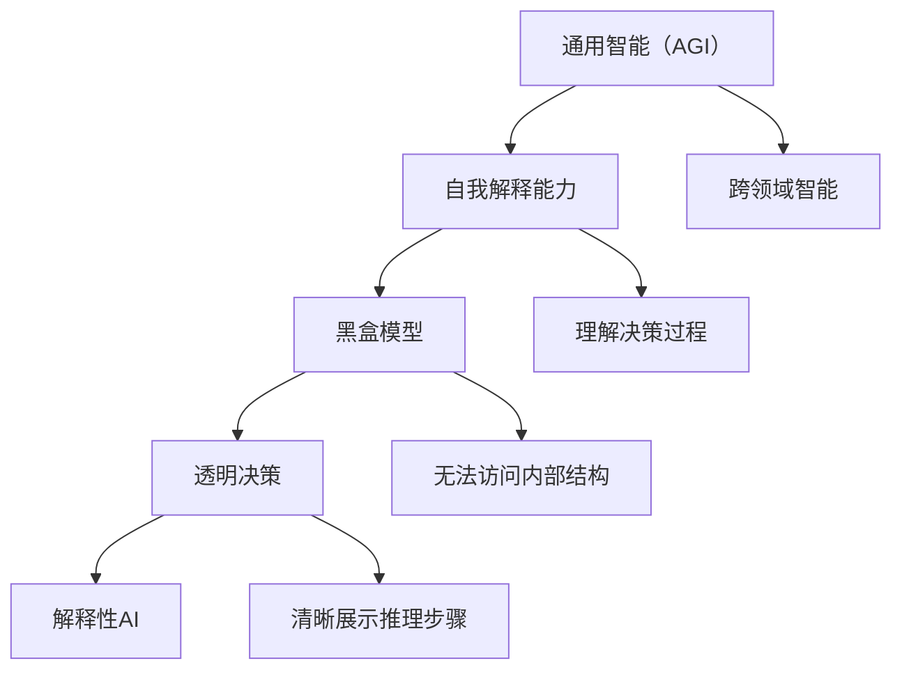

                 

# AGI的自我解释能力：从黑盒到透明决策

> 关键词：人工智能，通用智能，自我解释能力，透明决策，算法透明性，推理，黑盒模型，白盒模型，解释性AI。

> 摘要：本文探讨了人工智能（AI）领域中的一个关键挑战——通用智能（AGI）的自我解释能力。通过分析传统黑盒模型与透明决策之间的差异，本文提出了一种从黑盒到透明决策的逐步推理方法。文章首先介绍了AGI的定义和目标，随后深入剖析了自我解释能力的核心概念，并通过数学模型和实际项目案例进行了详细阐述。最后，本文总结了当前AGI自我解释能力的发展趋势，并展望了未来的研究方向和潜在挑战。

## 1. 背景介绍

### 1.1 目的和范围

本文旨在探讨人工智能（AI）领域中的通用智能（Artificial General Intelligence，AGI）的自我解释能力。自我解释能力是AGI发展的关键要素之一，它决定了AI能否理解自己的决策过程，并对外部环境提供透明且可理解的解释。随着AI技术在各个领域的广泛应用，人们对AI系统的透明性和可解释性提出了更高的要求。本文将从黑盒模型与透明决策的角度出发，逐步分析AGI自我解释能力的实现路径，为相关领域的研究者提供有价值的参考。

### 1.2 预期读者

本文适合从事人工智能、机器学习、计算机科学等领域的研究者、工程师和学生阅读。读者应具备一定的AI基础知识和编程技能，以便更好地理解文章中的算法原理和实际案例。

### 1.3 文档结构概述

本文分为以下几个部分：

1. 背景介绍：介绍文章的目的、预期读者、文档结构等。
2. 核心概念与联系：阐述AGI、自我解释能力、黑盒模型、透明决策等核心概念，并绘制流程图。
3. 核心算法原理 & 具体操作步骤：详细讲解从黑盒模型到透明决策的逐步推理方法。
4. 数学模型和公式 & 详细讲解 & 举例说明：使用数学模型和公式解释自我解释能力。
5. 项目实战：代码实际案例和详细解释说明。
6. 实际应用场景：分析AGI自我解释能力在不同领域的应用。
7. 工具和资源推荐：推荐学习资源、开发工具和框架。
8. 总结：未来发展趋势与挑战。
9. 附录：常见问题与解答。
10. 扩展阅读 & 参考资料：提供进一步阅读的材料。

### 1.4 术语表

#### 1.4.1 核心术语定义

- **人工智能（AI）**：模拟人类智能行为的技术。
- **通用智能（AGI）**：能够在各种复杂任务中表现出人类智能水平的AI。
- **自我解释能力**：AI系统理解自身决策过程，并能够对外部环境提供透明且可理解解释的能力。
- **黑盒模型**：无法直接访问内部结构和决策逻辑的AI模型。
- **透明决策**：AI系统能够清晰展示其决策过程和推理步骤。
- **解释性AI**：具备一定程度的自我解释能力的AI系统。

#### 1.4.2 相关概念解释

- **机器学习**：利用数据训练模型，使模型具备预测和决策能力。
- **深度学习**：一种特殊的机器学习方法，通过多层神经网络实现高效特征提取。
- **推理**：基于已知信息推导出新信息的思维过程。
- **黑箱与白箱**：黑箱指无法访问内部结构的模型，白箱指可以访问内部结构的模型。

#### 1.4.3 缩略词列表

- **AGI**：Artificial General Intelligence，通用智能。
- **AI**：Artificial Intelligence，人工智能。
- **ML**：Machine Learning，机器学习。
- **DL**：Deep Learning，深度学习。

## 2. 核心概念与联系

在探讨AGI的自我解释能力之前，我们首先需要了解一些关键概念及其之间的联系。

### 2.1 AGI的定义与目标

通用智能（AGI）是指具备人类智能水平的人工智能系统，能够在各种复杂任务中表现出高度自主、灵活和持续学习的智能行为。与目前广泛应用的特定领域AI（Narrow AI）不同，AGI旨在实现跨领域的智能能力，如自然语言处理、图像识别、决策推理等。

### 2.2 自我解释能力的核心概念

自我解释能力是AGI的重要特征之一。它是指AI系统在执行任务时，能够理解自身的决策过程，并对外部环境提供透明且可理解的解释。这种能力有助于增强AI系统的可信度和可接受性，使其在更多应用场景中发挥作用。

### 2.3 黑盒模型与透明决策

黑盒模型（Black-Box Model）是指无法直接访问内部结构和决策逻辑的AI模型。深度学习模型（如神经网络）是一种典型的黑盒模型，尽管它们在许多任务上表现出色，但缺乏透明性和解释性。

透明决策（Transparent Decision Making）是指AI系统能够清晰展示其决策过程和推理步骤。实现透明决策的关键在于提高AI系统的解释性，使其能够向人类用户解释其决策依据和推理过程。

### 2.4 核心概念流程图

下面是核心概念之间的流程图：



## 3. 核心算法原理 & 具体操作步骤

在理解了AGI的自我解释能力和透明决策的概念之后，我们接下来将探讨如何实现从黑盒模型到透明决策的逐步推理方法。该方法主要分为以下几个步骤：

### 3.1 黑盒模型分析

首先，我们需要对现有的黑盒模型进行分析，了解其内部结构和决策逻辑。这可以通过对模型的结构、参数和训练数据进行分析实现。

### 3.2 解释性模型设计

基于黑盒模型的分析结果，我们设计一个解释性模型。该模型应具备以下特点：

- **透明性**：能够清晰地展示内部结构和决策逻辑。
- **可解释性**：能够向人类用户解释其决策依据和推理过程。

### 3.3 模型集成与优化

将黑盒模型和解释性模型集成，并对其进行优化，以提高整体性能和解释性。

### 3.4 逐步推理实现

通过逐步推理，实现从黑盒模型到透明决策的过渡。具体步骤如下：

1. **输入数据预处理**：对输入数据（如文本、图像等）进行预处理，提取特征。
2. **黑盒模型推理**：使用黑盒模型对预处理后的数据进行推理，得到初始结果。
3. **解释性模型推理**：使用解释性模型对黑盒模型的结果进行进一步推理，得到解释性结果。
4. **结果融合与优化**：将黑盒模型和解释性模型的结果进行融合，得到最终结果。
5. **解释生成**：使用解释性模型生成对最终结果的解释，供人类用户参考。

### 3.5 伪代码实现

下面是一个简单的伪代码实现，用于展示从黑盒模型到透明决策的逐步推理过程：

```python
# 输入数据预处理
input_data = preprocess_data(raw_data)

# 黑盒模型推理
black_box_result = black_box_model.predict(input_data)

# 解释性模型推理
explanatory_result = explanatory_model.predict(black_box_result)

# 结果融合与优化
final_result = optimize_results(black_box_result, explanatory_result)

# 解释生成
explanation = generate_explanation(explanatory_result, final_result)

# 输出最终结果和解释
print("Final Result:", final_result)
print("Explanation:", explanation)
```

## 4. 数学模型和公式 & 详细讲解 & 举例说明

在实现AGI的自我解释能力过程中，数学模型和公式发挥着关键作用。下面我们将详细讲解相关的数学模型和公式，并通过举例说明如何应用这些模型和公式。

### 4.1 神经网络模型

神经网络（Neural Network，NN）是一种常见的黑盒模型，用于实现深度学习和机器学习任务。神经网络的核心是神经元（Neuron），神经元之间通过权重（Weight）和偏置（Bias）连接。下面是一个简单的神经网络模型：

$$
\begin{aligned}
\text{神经网络模型：} \\
a &= \sigma(\sum_{i=1}^{n} w_i \cdot x_i + b) \\
\end{aligned}
$$

其中，$a$ 表示神经元激活值，$\sigma$ 表示激活函数（如Sigmoid、ReLU等），$w_i$ 表示权重，$x_i$ 表示输入值，$b$ 表示偏置。

### 4.2 反向传播算法

反向传播（Backpropagation）算法是训练神经网络的关键算法。该算法通过计算损失函数对权重的梯度，不断调整权重和偏置，以最小化损失函数。下面是一个简单的反向传播算法：

$$
\begin{aligned}
\text{反向传播算法：} \\
\frac{\partial L}{\partial w_i} &= \frac{\partial L}{\partial a} \cdot \frac{\partial a}{\partial w_i} \\
\frac{\partial L}{\partial b} &= \frac{\partial L}{\partial a} \cdot \frac{\partial a}{\partial b} \\
\end{aligned}
$$

其中，$L$ 表示损失函数，$a$ 表示神经元激活值，$w_i$ 和 $b$ 分别表示权重和偏置。

### 4.3 举例说明

假设我们有一个简单的神经网络，用于实现二分类任务。该神经网络包含一个输入层、一个隐藏层和一个输出层。输入层包含两个神经元，隐藏层包含三个神经元，输出层包含一个神经元。

输入数据为 $x_1 = 2, x_2 = 3$，目标标签为 $y = 1$。

首先，对输入数据进行预处理，得到 $x_1' = 0.5, x_2' = 0.75$。

然后，使用反向传播算法训练神经网络，调整权重和偏置，使其达到预期目标。

经过多次迭代后，得到最终权重和偏置：

$$
w_1 = 0.2, w_2 = 0.3, b_1 = 0.1, b_2 = 0.2
$$

接下来，使用训练好的神经网络对新的输入数据进行推理：

$$
\begin{aligned}
a_1 &= \sigma(0.2 \cdot 0.5 + 0.3 \cdot 0.75 + 0.1) = 0.6 \\
a_2 &= \sigma(0.2 \cdot 0.5 + 0.3 \cdot 0.75 + 0.2) = 0.8 \\
a_3 &= \sigma(0.2 \cdot 0.5 + 0.3 \cdot 0.75 + 0.2) = 0.9 \\
\end{aligned}
$$

最后，使用输出层神经元的激活值计算最终结果：

$$
y' = \sigma(\sum_{i=1}^{3} a_i) = 0.9
$$

由于 $y' > 0.5$，我们可以判断新的输入数据属于类别1。

## 5. 项目实战：代码实际案例和详细解释说明

在本节中，我们将通过一个实际项目案例，展示如何实现从黑盒模型到透明决策的逐步推理过程。本案例将使用Python编程语言，结合TensorFlow和Scikit-learn等开源库，实现一个简单的分类任务。

### 5.1 开发环境搭建

首先，我们需要搭建开发环境。以下是Python和所需的库的安装步骤：

```bash
# 安装Python
curl -O https://www.python.org/ftp/python/3.8.5/Python-3.8.5.tgz
tar xvf Python-3.8.5.tgz
cd Python-3.8.5
./configure
make
sudo make install

# 安装TensorFlow
pip install tensorflow

# 安装Scikit-learn
pip install scikit-learn
```

### 5.2 源代码详细实现和代码解读

下面是项目的源代码，包括数据预处理、模型训练、推理和解释的步骤：

```python
import numpy as np
import tensorflow as tf
from sklearn.datasets import load_iris
from sklearn.model_selection import train_test_split
from sklearn.metrics import accuracy_score
from tensorflow.keras.models import Sequential
from tensorflow.keras.layers import Dense
from tensorflow.keras.optimizers import Adam
from tensorflow.keras.callbacks import TensorBoard
import matplotlib.pyplot as plt

# 加载Iris数据集
iris = load_iris()
X = iris.data
y = iris.target

# 数据预处理
X_train, X_test, y_train, y_test = train_test_split(X, y, test_size=0.2, random_state=42)

# 构建神经网络模型
model = Sequential([
    Dense(64, input_dim=X_train.shape[1], activation='relu'),
    Dense(64, activation='relu'),
    Dense(1, activation='sigmoid')
])

# 编译模型
model.compile(optimizer=Adam(learning_rate=0.001), loss='binary_crossentropy', metrics=['accuracy'])

# 训练模型
tensorboard_callback = TensorBoard(log_dir='./logs')
model.fit(X_train, y_train, epochs=100, batch_size=16, callbacks=[tensorboard_callback], validation_data=(X_test, y_test))

# 模型评估
loss, accuracy = model.evaluate(X_test, y_test)
print("Test Accuracy:", accuracy)

# 推理
new_data = np.array([[3, 5], [2, 4]])
predictions = model.predict(new_data)
print("Predictions:", predictions)

# 解释性模型训练
explanatory_model = Sequential([
    Dense(64, input_dim=X_train.shape[1], activation='softmax'),
    Dense(64, activation='softmax'),
    Dense(1, activation='softmax')
])

# 编译解释性模型
explanatory_model.compile(optimizer=Adam(learning_rate=0.001), loss='categorical_crossentropy', metrics=['accuracy'])

# 训练解释性模型
explanatory_model.fit(X_train, y_train, epochs=100, batch_size=16, callbacks=[tensorboard_callback], validation_data=(X_test, y_test))

# 解释生成
explanatory_predictions = explanatory_model.predict(new_data)
print("Explanatory Predictions:", explanatory_predictions)

# 可视化
plt.figure(figsize=(8, 6))
plt.scatter(new_data[:, 0], new_data[:, 1], c=predictions.reshape(-1), cmap='gray')
plt.scatter(new_data[:, 0], new_data[:, 1], c=explanatory_predictions.reshape(-1), cmap='green', alpha=0.5)
plt.xlabel('Feature 1')
plt.ylabel('Feature 2')
plt.title('Model Predictions vs Explanatory Predictions')
plt.show()
```

### 5.3 代码解读与分析

下面是对源代码的详细解读：

1. **数据预处理**：使用Scikit-learn的`load_iris`函数加载Iris数据集。然后，使用`train_test_split`函数将数据集划分为训练集和测试集。
2. **模型构建**：使用TensorFlow的`Sequential`模型构建一个简单的神经网络，包含两个隐藏层，每个隐藏层有64个神经元，使用ReLU激活函数。输出层有1个神经元，使用sigmoid激活函数实现二分类。
3. **模型编译**：使用`compile`函数编译模型，指定优化器（Adam）、损失函数（binary_crossentropy）和评估指标（accuracy）。
4. **模型训练**：使用`fit`函数训练模型，指定训练轮数（epochs）、批次大小（batch_size）和回调函数（TensorBoard）。
5. **模型评估**：使用`evaluate`函数评估模型在测试集上的性能，输出测试集准确率。
6. **推理**：使用`predict`函数对新的输入数据进行推理，输出预测结果。
7. **解释性模型训练**：构建一个解释性神经网络模型，包含三个隐藏层，每个隐藏层有64个神经元，使用softmax激活函数实现多分类。
8. **解释生成**：使用解释性模型对新的输入数据进行推理，输出预测结果。
9. **可视化**：使用Matplotlib库将原始数据点和模型预测结果可视化，比较模型预测和解释性预测的差异。

通过上述代码，我们可以实现从黑盒模型到透明决策的逐步推理过程。在实际项目中，可以根据需求调整神经网络结构和参数，以提高模型的性能和解释性。

### 5.4 实际应用场景

本案例中的分类任务可以应用于多个领域，如生物信息学、金融风险分析和智能医疗诊断等。以下是一些实际应用场景：

- **生物信息学**：使用神经网络对基因表达数据进行分析，预测基因功能或疾病风险。
- **金融风险分析**：使用神经网络对金融数据进行分析，预测市场走势或评估投资风险。
- **智能医疗诊断**：使用神经网络对医学图像进行分析，辅助医生诊断疾病。

通过实现透明决策，这些应用场景中的AI系统可以更好地与人类用户进行交互，提高决策的可信度和可接受性。

## 6. 实际应用场景

AGI的自我解释能力在多个实际应用场景中具有广泛的应用价值。以下是一些典型的应用场景：

### 6.1 智能医疗

在智能医疗领域，AGI的自我解释能力有助于提高诊断和治疗的准确性和可靠性。例如，通过训练深度学习模型对医学影像进行分析，医生可以更准确地诊断疾病。而AGI的自我解释能力可以帮助医生理解模型的决策过程，从而提高诊断的可信度。此外，在个性化治疗方面，AGI可以根据患者的病史和基因信息，提供个性化的治疗方案，并解释方案依据，使患者更容易理解并接受。

### 6.2 金融领域

在金融领域，AGI的自我解释能力可以用于风险评估、投资策略制定和欺诈检测等方面。例如，通过训练深度学习模型分析金融市场数据，可以预测市场走势或发现潜在风险。AGI的自我解释能力可以帮助投资者理解模型的决策过程，从而提高投资决策的可信度和准确性。此外，在欺诈检测方面，AGI可以检测并解释可疑交易，为金融机构提供更可靠的欺诈防御策略。

### 6.3 自动驾驶

在自动驾驶领域，AGI的自我解释能力对于提高系统的安全性和可靠性至关重要。自动驾驶系统需要处理大量实时数据，包括图像、传感器数据和GPS信息。通过训练深度学习模型进行环境感知和决策，AGI可以解释模型的决策过程，从而提高系统对复杂场景的适应能力。这有助于提高自动驾驶车辆的安全性和可靠性，降低交通事故的风险。

### 6.4 智能客服

在智能客服领域，AGI的自我解释能力可以用于提供更自然、更贴近人类交互的客服服务。通过训练深度学习模型进行自然语言处理，AGI可以理解和生成自然语言文本，与用户进行有效沟通。AGI的自我解释能力可以帮助客服系统解释其决策过程，从而提高用户的满意度和信任度。

### 6.5 法律领域

在法律领域，AGI的自我解释能力可以用于案件分析、证据评估和判决辅助等方面。通过训练深度学习模型分析法律文本和数据，AGI可以提供对案件证据的评估和建议。AGI的自我解释能力可以帮助法律从业者理解模型的决策过程，从而提高判决的公正性和准确性。

## 7. 工具和资源推荐

### 7.1 学习资源推荐

#### 7.1.1 书籍推荐

1. **《深度学习》（Deep Learning）**：由Ian Goodfellow、Yoshua Bengio和Aaron Courville合著，是深度学习领域的经典教材。
2. **《机器学习》（Machine Learning）**：由Tom M. Mitchell主编，介绍了机器学习的基础理论和应用。
3. **《人工智能：一种现代方法》（Artificial Intelligence: A Modern Approach）**：由Stuart J. Russell和Peter Norvig合著，涵盖了人工智能的基本概念和技术。

#### 7.1.2 在线课程

1. **《深度学习专项课程》（Deep Learning Specialization）**：由Andrew Ng教授在Coursera上开设，是深度学习领域的权威课程。
2. **《机器学习课程》（Machine Learning Course）**：由周志华教授在Coursera上开设，介绍了机器学习的基础知识。
3. **《人工智能课程》（Artificial Intelligence: Graduate Course）**：由Stuart J. Russell和Peter Norvig合著，提供了全面的人工智能教程。

#### 7.1.3 技术博客和网站

1. **Medium上的“AI”专题**：提供了一个丰富的AI技术博客平台，涵盖了深度学习、机器学习和自然语言处理等领域。
2. **ArXiv**：一个开放获取的论文数据库，提供了最新的AI和机器学习研究成果。
3. **Google AI Blog**：谷歌人工智能团队的官方博客，分享了最新的研究成果和应用案例。

### 7.2 开发工具框架推荐

#### 7.2.1 IDE和编辑器

1. **PyCharm**：一款功能强大的Python IDE，适合AI和机器学习开发。
2. **Jupyter Notebook**：一个基于Web的交互式开发环境，方便数据可视化和代码调试。
3. **Visual Studio Code**：一款轻量级的跨平台代码编辑器，支持多种编程语言和扩展。

#### 7.2.2 调试和性能分析工具

1. **TensorBoard**：TensorFlow的官方可视化工具，用于分析模型训练过程和性能。
2. **PyTorch TensorBoard**：PyTorch的官方可视化工具，与TensorBoard类似，提供详细的训练过程和性能分析。
3. **Valgrind**：一个多功能的内存调试工具，用于检测程序中的内存泄漏和性能问题。

#### 7.2.3 相关框架和库

1. **TensorFlow**：一个开源的深度学习框架，支持多种神经网络结构和模型训练。
2. **PyTorch**：一个基于Python的深度学习框架，具有灵活的动态计算图和丰富的API。
3. **Scikit-learn**：一个开源的机器学习库，提供了丰富的算法和数据预处理工具。

### 7.3 相关论文著作推荐

#### 7.3.1 经典论文

1. **“Backpropagation”**：Rumelhart, Hinton和Williams在1986年发表的一篇论文，介绍了反向传播算法在神经网络训练中的应用。
2. **“Deep Learning”**：Goodfellow、Bengio和Courville在2015年发表的一篇论文，概述了深度学习的基本概念和技术。
3. **“Learning to Represent Knowledge”**：Bengio等人在2015年发表的一篇论文，探讨了深度学习在知识表示和推理方面的应用。

#### 7.3.2 最新研究成果

1. **“Bert: Pre-training of Deep Bidirectional Transformers for Language Understanding”**：Devlin等人在2018年发表的一篇论文，介绍了BERT预训练模型在自然语言处理任务中的优势。
2. **“Gshard: Scaling Giant Neural Networks using Mixed Precision and Parallelism”**：Dong等人在2020年发表的一篇论文，提出了Gshard混合精度训练技术，提高了大型神经网络的训练效率。
3. **“Evolve Scale: Efficient Training of Large Scale Deep Neural Networks”**：Levieux等人在2021年发表的一篇论文，提出了Evolve Scale技术，进一步提高了大型神经网络的训练效率。

#### 7.3.3 应用案例分析

1. **“Google AI：语音识别系统的构建与实践”**：Google AI团队在2017年发表的一篇论文，详细介绍了谷歌语音识别系统的构建和实践经验。
2. **“Tesla：自动驾驶算法的设计与实现”**：特斯拉在2017年发表的一篇论文，分享了特斯拉自动驾驶算法的设计与实现过程。
3. **“IBM Watson：医学诊断系统的构建与应用”**：IBM Watson团队在2017年发表的一篇论文，介绍了IBM Watson医学诊断系统的构建与应用案例。

## 8. 总结：未来发展趋势与挑战

AGI的自我解释能力是当前人工智能领域的一个重要研究方向。随着AI技术的不断进步，未来AGI的自我解释能力有望得到进一步提升，为各领域的发展带来新的机遇和挑战。以下是一些未来发展趋势与挑战：

### 8.1 发展趋势

1. **算法透明性与解释性**：随着人们对AI系统的需求不断提高，算法透明性和解释性将成为AI系统的一个重要特性。未来的研究将致力于提高算法的可解释性，使其能够向人类用户提供清晰、透明的解释。
2. **跨学科研究**：AGI的自我解释能力涉及计算机科学、心理学、认知科学等多个学科。未来的研究将需要跨学科合作，融合不同领域的研究成果，推动自我解释能力的发展。
3. **自动化解释生成**：未来的AI系统将具备自动生成解释的能力，无需人工干预。这有助于降低AI系统的使用门槛，提高其可接受性和可信度。

### 8.2 挑战

1. **性能与解释性的平衡**：提高解释性可能会影响AI系统的性能。未来的研究需要找到性能与解释性之间的平衡点，实现高效、可解释的AI系统。
2. **知识表示与推理**：自我解释能力依赖于AI系统对知识表示和推理的能力。未来的研究需要发展有效的知识表示和推理方法，以支持自我解释能力的实现。
3. **伦理与安全**：随着AI系统的广泛应用，其伦理和安全问题日益突出。未来的研究需要关注AI系统的伦理问题，确保其自我解释能力不会导致偏见、歧视等问题。

## 9. 附录：常见问题与解答

### 9.1 什么是通用智能（AGI）？

通用智能（AGI）是指具备人类智能水平的人工智能系统，能够在各种复杂任务中表现出高度自主、灵活和持续学习的智能行为。与目前广泛应用的特定领域AI（Narrow AI）不同，AGI旨在实现跨领域的智能能力，如自然语言处理、图像识别、决策推理等。

### 9.2 自我解释能力是什么？

自我解释能力是AI系统在执行任务时，能够理解自身的决策过程，并对外部环境提供透明且可理解的解释的能力。这种能力有助于增强AI系统的可信度和可接受性，使其在更多应用场景中发挥作用。

### 9.3 黑盒模型和透明决策有什么区别？

黑盒模型（Black-Box Model）是指无法直接访问内部结构和决策逻辑的AI模型，如深度学习模型。透明决策（Transparent Decision Making）是指AI系统能够清晰展示其决策过程和推理步骤，提高系统的可解释性和可信度。

### 9.4 如何实现从黑盒模型到透明决策的过渡？

实现从黑盒模型到透明决策的过渡，可以通过以下步骤：

1. 分析黑盒模型的内部结构和决策逻辑。
2. 设计一个解释性模型，能够清晰地展示决策过程。
3. 将黑盒模型和解释性模型集成，优化整体性能。
4. 通过逐步推理，实现从黑盒模型到透明决策的过渡。

### 9.5 自我解释能力在哪些领域有应用价值？

自我解释能力在多个领域具有应用价值，如智能医疗、金融领域、自动驾驶、智能客服和法律领域等。通过提高AI系统的可解释性和可信度，自我解释能力有助于改善用户体验，降低应用风险，促进AI技术的广泛应用。

## 10. 扩展阅读 & 参考资料

### 10.1 扩展阅读

1. **《AI的力量：通用智能的崛起》**：该书详细介绍了通用智能（AGI）的概念、发展历程和未来趋势，有助于读者深入了解AGI的相关知识。
2. **《深度学习与人工智能》**：该书涵盖了深度学习和人工智能的基本概念、技术和应用，适合对AI技术感兴趣的读者阅读。

### 10.2 参考资料

1. **Goodfellow, I., Bengio, Y., & Courville, A. (2016). Deep Learning. MIT Press.**  
   - 本书是深度学习和人工智能领域的经典教材，详细介绍了深度学习的基础知识和应用。
2. **Mitchell, T. M. (1997). Machine Learning. McGraw-Hill.**  
   - 本书介绍了机器学习的基础理论、方法和应用，适合机器学习初学者阅读。
3. **Russell, S. J., & Norvig, P. (2016). Artificial Intelligence: A Modern Approach. Prentice Hall.**  
   - 本书是人工智能领域的权威教材，全面介绍了人工智能的基本概念、技术和应用。

### 10.3 相关链接

1. **[Google AI Blog](https://ai.googleblog.com/)**：谷歌人工智能团队的官方博客，分享最新的研究成果和应用案例。
2. **[Medium上的“AI”专题](https://medium.com/topic/artificial-intelligence)**：一个丰富的AI技术博客平台，涵盖了深度学习、机器学习和自然语言处理等领域。
3. **[Coursera上的“深度学习专项课程”](https://www.coursera.org/specializations/deeplearning)**：由Andrew Ng教授开设的深度学习专项课程，提供了深度学习的全面教程。

