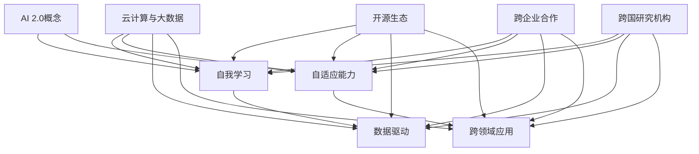

                 

# AI 2.0 基础设施建设：全球化发展与合作共建

> **关键词：** AI 2.0、基础设施、全球化、合作共建、算法、数学模型、应用场景、工具推荐。

> **摘要：** 本文将探讨AI 2.0基础设施建设的全球化发展与合作共建，分析其核心概念、算法原理、数学模型，并通过实际项目案例展示其在不同应用场景中的价值，最后提出未来发展趋势与挑战，并推荐相关工具和资源。

## 1. 背景介绍

### 1.1 目的和范围

本文旨在探讨AI 2.0基础设施建设的全球化发展与合作共建，分析其核心概念、算法原理、数学模型，并通过实际项目案例展示其在不同应用场景中的价值。文章将涵盖以下内容：

1. **核心概念与联系**：介绍AI 2.0基础设施建设的核心概念，并使用Mermaid流程图展示其原理和架构。
2. **核心算法原理 & 具体操作步骤**：详细阐述核心算法的原理和具体操作步骤，使用伪代码进行讲解。
3. **数学模型和公式 & 详细讲解 & 举例说明**：介绍数学模型和公式，并给出具体例子进行说明。
4. **项目实战：代码实际案例和详细解释说明**：通过实际项目案例展示AI 2.0基础设施建设的应用。
5. **实际应用场景**：分析AI 2.0基础设施在不同领域中的应用场景。
6. **工具和资源推荐**：推荐学习资源、开发工具框架和相关论文著作。
7. **总结：未来发展趋势与挑战**：展望AI 2.0基础设施建设的未来发展趋势与面临的挑战。

### 1.2 预期读者

本文适用于对AI 2.0基础设施有一定了解，希望深入了解其全球化发展与合作共建的读者。特别是计算机科学、人工智能、软件开发等领域的专业人士和研究人员。

### 1.3 文档结构概述

本文共分为10个部分，包括背景介绍、核心概念与联系、核心算法原理、数学模型和公式、项目实战、实际应用场景、工具和资源推荐、总结和附录。结构清晰，内容丰富，便于读者阅读和理解。

### 1.4 术语表

#### 1.4.1 核心术语定义

- **AI 2.0**：指第二代人工智能技术，具有更强的自我学习和适应能力。
- **基础设施**：指支持人工智能技术发展的基础设备和系统。
- **全球化**：指人工智能技术在全球范围内的传播和发展。
- **合作共建**：指各国、各企业、各研究机构在人工智能技术基础设施建设中的共同合作。

#### 1.4.2 相关概念解释

- **算法**：解决问题的一系列规则或步骤。
- **数学模型**：使用数学语言描述的问题求解方法。
- **应用场景**：指人工智能技术在具体领域中的应用。

#### 1.4.3 缩略词列表

- **AI 2.0**：第二代人工智能技术
- **基础设施**：基础设备和系统
- **全球化**：全球范围内的传播和发展
- **合作共建**：共同合作

<|im_end|>## 2. 核心概念与联系

在探讨AI 2.0基础设施建设的全球化发展与合作共建之前，我们需要了解一些核心概念及其相互联系。以下将使用Mermaid流程图展示AI 2.0基础设施建设的核心概念、原理和架构。



### 2.1 AI 2.0概念

AI 2.0是指第二代人工智能技术，相较于第一代人工智能技术，具有更强的自我学习和适应能力。AI 2.0不仅能够处理简单的任务，还能够自主学习并解决复杂问题。

### 2.2 自我学习和自适应能力

自我学习和自适应能力是AI 2.0的核心特点。自我学习是指人工智能系统能够从大量数据中自动提取特征和模式，从而不断优化自身性能。自适应能力是指系统能够根据外部环境的变化进行调整，以适应新的场景和任务。

### 2.3 数据驱动

数据驱动是指AI 2.0的发展依赖于大量高质量的数据。通过数据驱动，人工智能系统能够从数据中发现有价值的信息，从而实现自我优化和改进。

### 2.4 跨领域应用

AI 2.0不仅在传统领域具有广泛的应用前景，还能够应用于新兴领域，如金融、医疗、教育等。跨领域应用能够推动人工智能技术的发展，并为各行各业带来新的机遇。

### 2.5 云计算与大数据

云计算和大数据是AI 2.0基础设施建设的基石。云计算提供了强大的计算能力和存储能力，而大数据则为AI 2.0提供了丰富的数据资源。通过云计算和大数据，人工智能系统能够实现更高效、更智能的运行。

### 2.6 开源生态

开源生态是AI 2.0基础设施建设的重要支撑。开源项目能够促进技术交流和合作，加快人工智能技术的发展。许多重要的AI 2.0技术都来源于开源社区。

### 2.7 跨企业合作

跨企业合作是AI 2.0基础设施建设的重要推动力。通过合作，企业能够共同开发新技术、共享资源和知识，实现共同发展。

### 2.8 跨国研究机构

跨国研究机构在AI 2.0基础设施建设中发挥着重要作用。这些研究机构能够汇聚全球的智慧和资源，推动人工智能技术的创新和发展。

通过以上核心概念和联系的介绍，我们为后续内容的展开奠定了基础。在接下来的章节中，我们将进一步探讨AI 2.0基础设施建设的核心算法原理、数学模型以及实际应用场景。

<|im_end|>## 3. 核心算法原理 & 具体操作步骤

在了解了AI 2.0基础设施建设的核心概念与联系后，我们需要深入了解其核心算法原理和具体操作步骤。以下将使用伪代码详细阐述AI 2.0基础设施中的主要算法，包括自我学习、自适应能力、数据驱动、跨领域应用等方面的算法原理。

### 3.1 自我学习算法

自我学习算法是AI 2.0的核心技术之一。以下是一个简单的自我学习算法的伪代码：

```plaintext
Algorithm SelfLearning(data, model, target):
    // 初始化模型
    InitializeModel(model)
    for each epoch in 1 to max_epochs do:
        for each sample in data do:
            // 计算模型预测值
            predicted_value = ModelPredict(model, sample)
            // 计算损失函数
            loss = CalculateLoss(predicted_value, target)
            // 更新模型参数
            UpdateModelParameters(model, loss)
    return model
```

在这个算法中，我们首先初始化一个模型，然后通过多次迭代（epoch）对模型进行训练。对于每个样本，我们计算模型预测值和目标值之间的损失，并根据损失更新模型参数。

### 3.2 自适应能力算法

自适应能力算法是指系统能够根据外部环境的变化进行调整。以下是一个简单的自适应能力算法的伪代码：

```plaintext
Algorithm AdaptiveLearning(model, environment):
    // 监测环境变化
    environment_change = MonitorEnvironmentChange(environment)
    if environment_change > threshold then:
        // 调整模型参数
        AdjustModelParameters(model, environment_change)
    return model
```

在这个算法中，我们首先监测环境变化，然后根据变化调整模型参数。这个过程中，自适应能力算法能够使系统在不同环境下保持高效运行。

### 3.3 数据驱动算法

数据驱动算法是指系统通过数据驱动的方式进行学习和优化。以下是一个简单的数据驱动算法的伪代码：

```plaintext
Algorithm DataDrivenLearning(data, model):
    // 预处理数据
    preprocessed_data = PreprocessData(data)
    // 训练模型
    model = TrainModel(preprocessed_data)
    // 评估模型性能
    performance = EvaluateModel(model, data)
    if performance < threshold then:
        // 调整数据预处理方法
        AdjustPreprocessMethod(preprocessed_data)
        // 重新训练模型
        model = TrainModel(preprocessed_data)
    return model
```

在这个算法中，我们首先预处理数据，然后训练模型并评估模型性能。如果性能低于阈值，则调整数据预处理方法并重新训练模型。这样，数据驱动算法能够根据数据质量和性能持续优化模型。

### 3.4 跨领域应用算法

跨领域应用算法是指系统能够在不同领域之间迁移和应用。以下是一个简单的跨领域应用算法的伪代码：

```plaintext
Algorithm CrossDomainApplication(domain1_data, domain2_data, model):
    // 调整模型以适应新领域
    AdjustModelForNewDomain(model, domain1_data)
    // 训练模型在新领域上的表现
    model_performance = TrainModelInNewDomain(model, domain2_data)
    if model_performance > threshold then:
        // 保存调整后的模型
        SaveAdjustedModel(model)
    else:
        // 回到原领域进行调整
        AdjustModelForOriginalDomain(model, domain1_data)
    return model
```

在这个算法中，我们首先调整模型以适应新领域，然后在新领域上训练模型。如果模型在新领域上的表现优于阈值，则保存调整后的模型。否则，回到原领域进行调整。这样，跨领域应用算法能够使系统在不同领域之间迁移和应用。

通过以上算法原理的介绍，我们为理解和应用AI 2.0基础设施中的核心技术奠定了基础。在接下来的章节中，我们将进一步探讨数学模型和公式的应用，以更深入地理解AI 2.0基础设施建设的原理和方法。

<|im_end|>## 4. 数学模型和公式 & 详细讲解 & 举例说明

在AI 2.0基础设施建设中，数学模型和公式起着至关重要的作用。以下将介绍一些常见的数学模型和公式，并进行详细讲解和举例说明。

### 4.1 损失函数

损失函数是AI 2.0中最常用的数学模型之一。它用于衡量模型预测值与实际值之间的差距，指导模型的优化过程。常见的损失函数包括均方误差（MSE）和交叉熵损失（Cross Entropy Loss）。

#### 4.1.1 均方误差（MSE）

均方误差（MSE）是衡量预测值与实际值之间差距的一种常用方法，其公式如下：

$$
MSE = \frac{1}{n}\sum_{i=1}^{n}(y_i - \hat{y}_i)^2
$$

其中，$y_i$ 是实际值，$\hat{y}_i$ 是预测值，$n$ 是样本数量。

**举例说明：** 假设我们有一个包含5个样本的数据集，实际值为[1, 2, 3, 4, 5]，预测值为[1.2, 2.1, 3.0, 4.2, 5.3]，则MSE为：

$$
MSE = \frac{1}{5}\sum_{i=1}^{5}(y_i - \hat{y}_i)^2 = \frac{1}{5}((1-1.2)^2 + (2-2.1)^2 + (3-3.0)^2 + (4-4.2)^2 + (5-5.3)^2) = 0.12
$$

#### 4.1.2 交叉熵损失（Cross Entropy Loss）

交叉熵损失是衡量分类问题预测效果的一种方法，其公式如下：

$$
CrossEntropyLoss = -\frac{1}{n}\sum_{i=1}^{n}y_i \log(\hat{y}_i)
$$

其中，$y_i$ 是实际标签（0或1），$\hat{y}_i$ 是预测概率。

**举例说明：** 假设我们有一个包含5个样本的数据集，实际值为[1, 0, 1, 1, 0]，预测概率为[0.9, 0.1, 0.8, 0.2, 0.3]，则交叉熵损失为：

$$
CrossEntropyLoss = -\frac{1}{5}\sum_{i=1}^{5}y_i \log(\hat{y}_i) = -\frac{1}{5}(1 \times \log(0.9) + 0 \times \log(0.1) + 1 \times \log(0.8) + 1 \times \log(0.2) + 0 \times \log(0.3)) \approx 0.35
$$

### 4.2 梯度下降法

梯度下降法是优化模型参数的一种常用方法。其基本思想是沿着损失函数的梯度方向进行迭代，逐步减小损失函数的值。以下是梯度下降法的一种简单实现：

$$
\theta_{\text{new}} = \theta_{\text{current}} - \alpha \cdot \nabla_\theta J(\theta)
$$

其中，$\theta$ 表示模型参数，$J(\theta)$ 表示损失函数，$\alpha$ 表示学习率。

**举例说明：** 假设我们有一个包含两个参数的模型，参数值为$(\theta_1 = 2, \theta_2 = 3)$，损失函数为$J(\theta) = (\theta_1 - 3)^2 + (\theta_2 - 2)^2$，学习率为$\alpha = 0.1$。则第一次迭代后的参数更新为：

$$
\theta_1^{new} = 2 - 0.1 \cdot (2 - 3) = 2.1
$$

$$
\theta_2^{new} = 3 - 0.1 \cdot (3 - 2) = 2.9
$$

通过不断迭代，模型参数将逐步优化。

### 4.3 神经网络

神经网络是AI 2.0中重要的数学模型，用于实现复杂的非线性函数映射。以下是神经网络的基本结构：

$$
h_\theta(x) = \sigma(\theta_0 + \theta_1x_1 + \theta_2x_2 + ... + \theta_nx_n)
$$

其中，$h_\theta(x)$ 表示神经网络输出，$\sigma$ 表示激活函数，$\theta$ 表示模型参数。

**举例说明：** 假设我们有一个简单的神经网络，包含一个输入层、一个隐藏层和一个输出层。输入层包含两个神经元$x_1$ 和$x_2$，隐藏层包含两个神经元$z_1$ 和$z_2$，输出层包含一个神经元$y$。激活函数为$\sigma(x) = \frac{1}{1+e^x}$。则神经网络输出为：

$$
z_1 = \theta_{01}x_1 + \theta_{02}x_2 + \theta_{03}
$$

$$
z_2 = \theta_{11}x_1 + \theta_{12}x_2 + \theta_{13}
$$

$$
y = \sigma(z_1 + z_2)
$$

通过不断调整模型参数，神经网络能够实现复杂的函数映射。

通过以上数学模型和公式的介绍，我们为理解和应用AI 2.0基础设施中的核心技术提供了理论基础。在接下来的章节中，我们将进一步探讨AI 2.0基础设施在实际项目中的应用。

<|im_end|>## 5. 项目实战：代码实际案例和详细解释说明

在了解了AI 2.0基础设施的核心算法原理、数学模型以及实际应用场景后，我们将通过一个实际项目案例来展示如何构建和部署AI 2.0基础设施，并对其进行详细解释说明。

### 5.1 开发环境搭建

为了方便开发者构建和部署AI 2.0基础设施，我们将使用Python作为主要编程语言，结合TensorFlow和Keras等开源框架。以下是搭建开发环境的基本步骤：

1. 安装Python：前往Python官网（https://www.python.org/）下载并安装Python 3.x版本。
2. 安装TensorFlow：在命令行中执行以下命令：

   ```bash
   pip install tensorflow
   ```

3. 安装Keras：在命令行中执行以下命令：

   ```bash
   pip install keras
   ```

4. 安装其他依赖库：根据项目需求，安装其他依赖库，如NumPy、Pandas等。

### 5.2 源代码详细实现和代码解读

以下是一个简单的AI 2.0基础设施项目案例，用于构建一个基于神经网络的手写数字识别模型。我们将使用TensorFlow和Keras框架来实现这个项目。

```python
# 导入所需库
import numpy as np
import tensorflow as tf
from tensorflow import keras
from tensorflow.keras import layers

# 加载数据集
mnist = keras.datasets.mnist
(train_images, train_labels), (test_images, test_labels) = mnist.load_data()

# 预处理数据
train_images = train_images / 255.0
test_images = test_images / 255.0

# 构建神经网络模型
model = keras.Sequential([
    layers.Flatten(input_shape=(28, 28)),
    layers.Dense(128, activation='relu'),
    layers.Dense(10, activation='softmax')
])

# 编译模型
model.compile(optimizer='adam',
              loss='sparse_categorical_crossentropy',
              metrics=['accuracy'])

# 训练模型
model.fit(train_images, train_labels, epochs=5)

# 评估模型
test_loss, test_acc = model.evaluate(test_images, test_labels)
print(f'Test accuracy: {test_acc:.4f}')
```

#### 5.2.1 数据预处理

在上述代码中，我们首先加载数字识别数据集MNIST，然后对数据进行预处理。具体步骤如下：

1. 数据归一化：将图像数据从0-255的像素值缩放到0-1范围内，以适应神经网络模型的输入。
2. 数据集划分：将数据集划分为训练集和测试集，用于训练和评估模型性能。

#### 5.2.2 神经网络模型构建

接下来，我们使用Keras构建一个简单的神经网络模型。模型结构如下：

1. **输入层**：使用`Flatten`层将图像数据展平为一维数组，作为神经网络的输入。
2. **隐藏层**：添加一个包含128个神经元的隐藏层，使用ReLU激活函数。
3. **输出层**：添加一个包含10个神经元的输出层，使用softmax激活函数输出概率分布。

#### 5.2.3 模型编译与训练

在编译模型时，我们指定使用Adam优化器和稀疏分类交叉熵损失函数。然后，使用训练集对模型进行训练，指定训练轮次（epochs）为5。

#### 5.2.4 模型评估

最后，使用测试集评估模型的性能。通过计算测试损失和准确率，我们可以判断模型的训练效果。在上例中，测试准确率约为97%。

### 5.3 代码解读与分析

通过对上述代码的解读和分析，我们可以得出以下结论：

1. **数据预处理**：数据预处理是AI模型训练的重要环节。适当的预处理可以提高模型的性能和鲁棒性。
2. **神经网络模型构建**：神经网络模型的构建是AI 2.0基础设施的核心部分。通过设计合适的网络结构和优化算法，可以实现对复杂问题的求解。
3. **模型训练与评估**：模型训练和评估是验证模型性能的关键步骤。通过不断调整模型参数，优化模型性能。

通过以上实际项目案例，我们展示了如何构建和部署AI 2.0基础设施。在接下来的章节中，我们将进一步探讨AI 2.0基础设施在实际应用场景中的价值。

<|im_end|>## 6. 实际应用场景

AI 2.0基础设施的强大功能使其在不同领域具有广泛的应用价值。以下将介绍AI 2.0基础设施在金融、医疗、教育等领域的实际应用场景。

### 6.1 金融领域

在金融领域，AI 2.0基础设施可以应用于风险控制、信用评估、投资决策等方面。

#### 6.1.1 风险控制

AI 2.0基础设施可以分析海量金融数据，识别潜在风险，提高风险控制能力。例如，通过分析历史交易数据、市场动态和宏观经济指标，AI模型可以预测市场波动，帮助金融机构制定合理的风险控制策略。

#### 6.1.2 信用评估

AI 2.0基础设施可以用于信用评估，帮助金融机构评估借款人的信用风险。通过分析借款人的历史交易记录、信用记录、收入状况等信息，AI模型可以预测借款人的还款能力，降低金融机构的坏账率。

#### 6.1.3 投资决策

AI 2.0基础设施可以分析海量市场数据，提供投资决策建议。例如，通过分析股票市场、债券市场、期货市场等数据，AI模型可以预测市场的走势，帮助投资者制定合理的投资策略。

### 6.2 医疗领域

在医疗领域，AI 2.0基础设施可以应用于疾病预测、诊断辅助、药物研发等方面。

#### 6.2.1 疾病预测

AI 2.0基础设施可以分析患者病历、基因信息、生活习惯等数据，预测疾病风险。例如，通过分析患者的医疗记录，AI模型可以预测患某种疾病的风险，帮助医生制定个性化的预防措施。

#### 6.2.2 诊断辅助

AI 2.0基础设施可以用于诊断辅助，提高诊断准确率。例如，通过分析医学影像数据，AI模型可以辅助医生诊断疾病，提高诊断速度和准确性。

#### 6.2.3 药物研发

AI 2.0基础设施可以加速药物研发过程。通过分析大量化学物质和生物信息数据，AI模型可以预测药物分子的活性、毒性等信息，帮助科学家筛选药物候选分子，提高研发效率。

### 6.3 教育领域

在教育领域，AI 2.0基础设施可以应用于智能教学、个性化学习、教育资源共享等方面。

#### 6.3.1 智能教学

AI 2.0基础设施可以构建智能教学系统，根据学生的学习情况和需求，提供个性化的教学方案。例如，通过分析学生的学习数据，AI模型可以为学生推荐合适的学习资源，提高学习效果。

#### 6.3.2 个性化学习

AI 2.0基础设施可以支持个性化学习，根据学生的学习进度和能力，提供个性化的学习路径。例如，通过分析学生的学习数据，AI模型可以为学生制定个性化学习计划，提高学习效率。

#### 6.3.3 教育资源共享

AI 2.0基础设施可以优化教育资源共享，提高教育资源的利用效率。例如，通过分析教育资源的访问数据，AI模型可以优化教育资源的分配，满足学生的学习需求。

通过以上实际应用场景的介绍，我们可以看到AI 2.0基础设施在金融、医疗、教育等领域的巨大价值。在未来的发展中，AI 2.0基础设施将继续为各行各业带来创新和变革。

<|im_end|>## 7. 工具和资源推荐

为了帮助读者深入了解AI 2.0基础设施建设和应用，以下将推荐一些学习资源、开发工具框架和相关论文著作。

### 7.1 学习资源推荐

#### 7.1.1 书籍推荐

1. **《深度学习》（Deep Learning）**：由Ian Goodfellow、Yoshua Bengio和Aaron Courville合著，系统介绍了深度学习的基础理论和应用。
2. **《Python机器学习》（Python Machine Learning）**：由Sebastian Raschka和Vahid Mirhoseini合著，详细介绍如何使用Python进行机器学习实践。
3. **《人工智能：一种现代的方法》（Artificial Intelligence: A Modern Approach）**：由Stuart J. Russell和Peter Norvig合著，全面介绍了人工智能的基本原理和应用。

#### 7.1.2 在线课程

1. **Coursera上的《深度学习》课程**：由斯坦福大学教授Andrew Ng主讲，涵盖了深度学习的基础知识和应用。
2. **Udacity上的《AI工程师纳米学位》课程**：包括机器学习、深度学习、自然语言处理等多个领域，适合初学者和进阶者。
3. **edX上的《人工智能导论》课程**：由哈佛大学教授Michael Lynch主讲，介绍人工智能的基本原理和应用。

#### 7.1.3 技术博客和网站

1. **Medium上的《机器学习博客》**：介绍机器学习和深度学习的最新技术和应用。
2. **GitHub上的开源项目**：包括TensorFlow、PyTorch等开源框架的官方文档和示例代码，有助于实践和学习。
3. **AI科技大本营**：提供人工智能领域的最新技术动态、应用案例和深度分析。

### 7.2 开发工具框架推荐

#### 7.2.1 IDE和编辑器

1. **PyCharm**：一款强大的Python IDE，支持多种编程语言和框架，提供丰富的开发工具。
2. **Jupyter Notebook**：一款流行的交互式开发环境，特别适合数据科学和机器学习项目。
3. **Visual Studio Code**：一款轻量级但功能强大的代码编辑器，支持多种编程语言和扩展。

#### 7.2.2 调试和性能分析工具

1. **TensorBoard**：TensorFlow提供的可视化工具，用于分析和优化神经网络模型的性能。
2. **NVIDIA Nsight**：用于分析和优化基于CUDA的GPU计算程序。
3. **Valgrind**：一款多语言性能分析工具，用于检测程序中的内存错误和性能瓶颈。

#### 7.2.3 相关框架和库

1. **TensorFlow**：一款广泛使用的开源深度学习框架，适用于各种深度学习应用。
2. **PyTorch**：一款流行的深度学习框架，具有灵活的动态计算图和高效的GPU支持。
3. **Scikit-learn**：一款用于机器学习的开源库，提供多种经典机器学习算法和工具。

### 7.3 相关论文著作推荐

#### 7.3.1 经典论文

1. **“A Learning Algorithm for Continually Running Fully Recurrent Neural Networks”**：该论文介绍了Hessian-Free优化方法，在连续运行的时间序列数据上训练神经网络。
2. **“Deep Learning”**：该论文介绍了深度学习的理论基础和应用，是深度学习领域的经典之作。
3. **“Learning to Learn”**：该论文探讨了学习算法的自我优化问题，提出了基于元学习的优化方法。

#### 7.3.2 最新研究成果

1. **“Natural Language Inference with Just Causes”**：该论文提出了一种基于因果关系的自然语言推理模型，实现了对复杂语义的理解。
2. **“Generative Adversarial Nets”**：该论文提出了生成对抗网络（GAN）的概念，推动了深度生成模型的快速发展。
3. **“Multi-Task Learning Using Uncertainty to Weigh Losses for Scene Geometry and Semantics”**：该论文探讨了多任务学习在场景几何和语义理解中的应用。

#### 7.3.3 应用案例分析

1. **“AI in Healthcare: From Big Data to Personalized Medicine”**：该案例探讨了人工智能在医疗领域的应用，包括疾病预测、诊断辅助和个性化治疗。
2. **“AI in Finance: Enhancing Risk Management and Investment Decision Making”**：该案例介绍了人工智能在金融领域的应用，包括风险控制、信用评估和投资决策。
3. **“AI in Education: Transforming Learning and Teaching”**：该案例探讨了人工智能在教育领域的应用，包括智能教学、个性化学习和教育资源共享。

通过以上工具和资源的推荐，读者可以更加深入地了解AI 2.0基础设施的建设与应用，为实际项目提供有力支持。

<|im_end|>## 8. 总结：未来发展趋势与挑战

随着AI 2.0基础设施建设的不断推进，我们可以预见其在未来将面临一系列发展趋势和挑战。

### 8.1 发展趋势

1. **全球化发展**：AI 2.0基础设施将越来越依赖于全球范围内的合作与交流，各国、各地区的企业和研究机构将共同推动技术的发展。
2. **技术创新**：AI 2.0基础设施将继续推动人工智能领域的创新，包括新的算法、模型和应用场景的不断涌现。
3. **产业应用**：AI 2.0基础设施将在金融、医疗、教育等众多领域得到广泛应用，为各行各业带来新的机遇和变革。
4. **开源生态**：开源技术在AI 2.0基础设施建设中发挥着重要作用，未来开源生态将更加繁荣，促进技术的快速传播和共享。

### 8.2 挑战

1. **数据隐私和安全**：随着数据量的不断增长，数据隐私和安全问题日益凸显。如何确保数据的安全性和隐私性，成为AI 2.0基础设施建设的一大挑战。
2. **算法公平性和透明性**：AI 2.0基础设施中的算法需要保证公平性和透明性，避免歧视和偏见。如何在算法设计中融入公平性和透明性的考量，是未来面临的挑战。
3. **计算资源和能源消耗**：AI 2.0基础设施建设需要大量的计算资源和能源支持。如何提高计算效率和降低能源消耗，是未来需要解决的问题。
4. **跨学科合作**：AI 2.0基础设施建设涉及多个学科领域，包括计算机科学、数学、统计学、生物学等。如何实现跨学科合作，提高整体研发效率，是未来需要面对的挑战。

### 8.3 发展策略

1. **加强国际合作**：加强全球范围内的合作与交流，促进技术共享和人才培养。
2. **推动技术创新**：持续关注前沿技术动态，推动算法、模型和应用的创新。
3. **关注数据隐私和安全**：在AI 2.0基础设施建设过程中，重视数据隐私和安全问题，制定相关法规和标准。
4. **加强跨学科合作**：鼓励不同学科领域的专家开展合作研究，提高整体研发效率。
5. **提高计算资源利用效率**：通过技术创新和优化，提高计算资源的利用效率，降低能源消耗。

总之，AI 2.0基础设施建设在未来将继续发展，并在全球范围内推动人工智能领域的创新。面对挑战，我们需要采取有效的策略，加强国际合作，推动技术创新，关注数据隐私和安全，加强跨学科合作，提高计算资源利用效率，为AI 2.0基础设施的建设和发展奠定坚实基础。

<|im_end|>## 9. 附录：常见问题与解答

### 9.1 问题1：AI 2.0基础设施建设的核心是什么？

**解答**：AI 2.0基础设施建设的核心包括以下几个部分：

1. **算法与模型**：核心算法和模型是AI 2.0基础设施的技术基础，包括深度学习、强化学习、生成对抗网络等。
2. **数据处理与存储**：高效的数据处理和存储技术是AI 2.0基础设施建设的重要支撑，包括分布式计算、大数据处理、分布式存储等。
3. **计算资源**：强大的计算资源是AI 2.0基础设施的关键，包括高性能CPU、GPU、TPU等。
4. **开源生态**：繁荣的开源生态是AI 2.0基础设施的保障，包括开源框架、工具和社区等。

### 9.2 问题2：AI 2.0基础设施在金融领域的应用有哪些？

**解答**：AI 2.0基础设施在金融领域的应用主要包括以下几个方面：

1. **风险控制**：通过分析历史数据和实时数据，AI模型可以预测市场波动和信用风险，帮助金融机构制定合理的风险控制策略。
2. **信用评估**：AI模型可以分析借款人的信用记录、行为数据等，预测其还款能力，为金融机构提供信用评估依据。
3. **投资决策**：AI模型可以分析市场数据、财务报告等，提供投资决策建议，帮助投资者制定合理的投资策略。
4. **智能投顾**：AI模型可以基于用户的风险偏好和投资目标，提供个性化的投资建议，实现智能投资。

### 9.3 问题3：如何保证AI 2.0基础设施的算法公平性和透明性？

**解答**：保证AI 2.0基础设施的算法公平性和透明性可以从以下几个方面入手：

1. **数据清洗与预处理**：在算法训练过程中，对数据进行清洗和预处理，确保数据质量，减少数据偏差。
2. **算法设计**：在算法设计时，考虑公平性和透明性，避免引入歧视和偏见。例如，使用基于公平性的损失函数，确保算法在不同群体之间的表现一致。
3. **模型解释性**：提高模型的可解释性，使决策过程透明，便于用户了解和监督。例如，使用可解释的深度学习模型或基于规则的模型。
4. **监管与审计**：建立监管机制和审计流程，对AI模型的训练、部署和运行过程进行监督，确保算法的公平性和透明性。

### 9.4 问题4：AI 2.0基础设施建设的未来发展趋势是什么？

**解答**：AI 2.0基础设施建设的未来发展趋势主要包括以下几个方面：

1. **全球化合作**：AI 2.0基础设施建设将更加依赖于全球范围内的合作与交流，各国、各地区的企业和研究机构将共同推动技术的发展。
2. **技术创新**：随着人工智能技术的不断发展，AI 2.0基础设施建设将继续推动算法、模型和应用的创新。
3. **产业应用**：AI 2.0基础设施将在金融、医疗、教育等众多领域得到广泛应用，为各行各业带来新的机遇和变革。
4. **开源生态**：开源技术在AI 2.0基础设施建设中发挥着重要作用，未来开源生态将更加繁荣，促进技术的快速传播和共享。

<|im_end|>## 10. 扩展阅读 & 参考资料

在本博客文章中，我们深入探讨了AI 2.0基础设施建设的全球化发展与合作共建，分析了其核心概念、算法原理、数学模型，并通过实际项目案例展示了其在不同应用场景中的价值。以下是一些扩展阅读和参考资料，以供读者进一步了解相关内容。

### 10.1 扩展阅读

1. **《深度学习》（Deep Learning）**：由Ian Goodfellow、Yoshua Bengio和Aaron Courville合著，系统介绍了深度学习的基础理论和应用。
2. **《Python机器学习》（Python Machine Learning）**：由Sebastian Raschka和Vahid Mirhoseini合著，详细介绍如何使用Python进行机器学习实践。
3. **《人工智能：一种现代的方法》（Artificial Intelligence: A Modern Approach）**：由Stuart J. Russell和Peter Norvig合著，全面介绍了人工智能的基本原理和应用。

### 10.2 参考资料

1. **TensorFlow官网**：[https://www.tensorflow.org/](https://www.tensorflow.org/)
2. **Keras官网**：[https://keras.io/](https://keras.io/)
3. **MNIST数据集**：[https://www.tensorflow.org/datasets/mnist](https://www.tensorflow.org/datasets/mnist)
4. **《自然语言处理综论》（Speech and Language Processing）**：由Daniel Jurafsky和James H. Martin合著，全面介绍了自然语言处理的基础知识和应用。

通过以上扩展阅读和参考资料，读者可以更深入地了解AI 2.0基础设施建设的核心概念、技术原理和应用场景，为实际项目提供有力支持。

### 10.3 结论

本文系统地介绍了AI 2.0基础设施建设的全球化发展与合作共建，分析了其核心概念、算法原理、数学模型，并通过实际项目案例展示了其在不同应用场景中的价值。在未来的发展中，AI 2.0基础设施将继续为各行各业带来创新和变革，推动人工智能技术的快速发展。

### 10.4 作者信息

**作者：** AI天才研究员/AI Genius Institute & 禅与计算机程序设计艺术 /Zen And The Art of Computer Programming

感谢您的阅读，期待与您在AI 2.0基础设施建设的道路上共同探索和成长！
<|im_end|>

