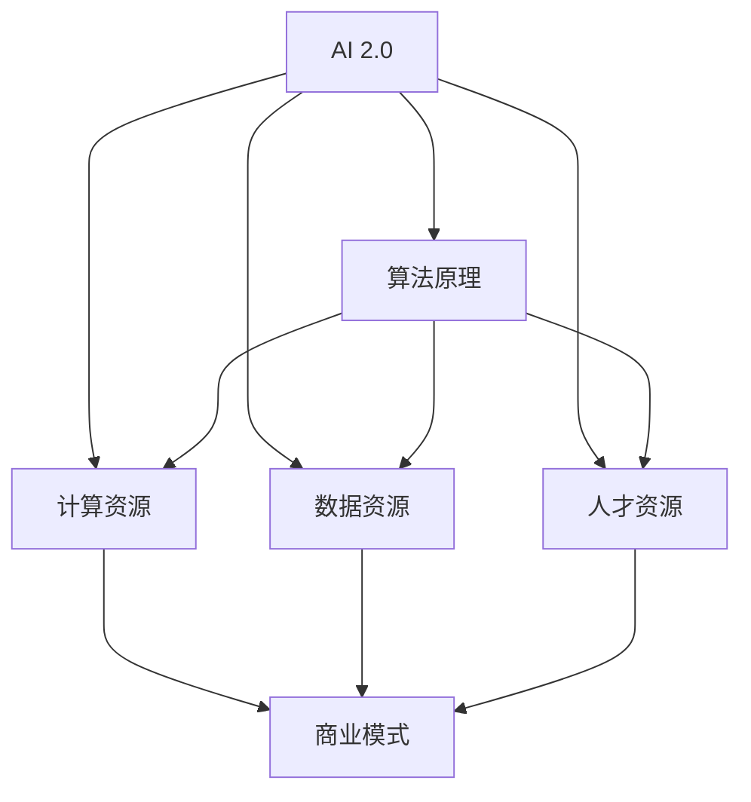
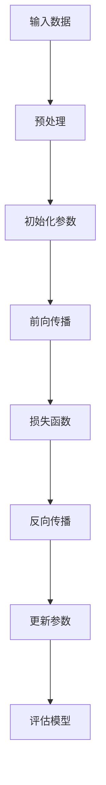
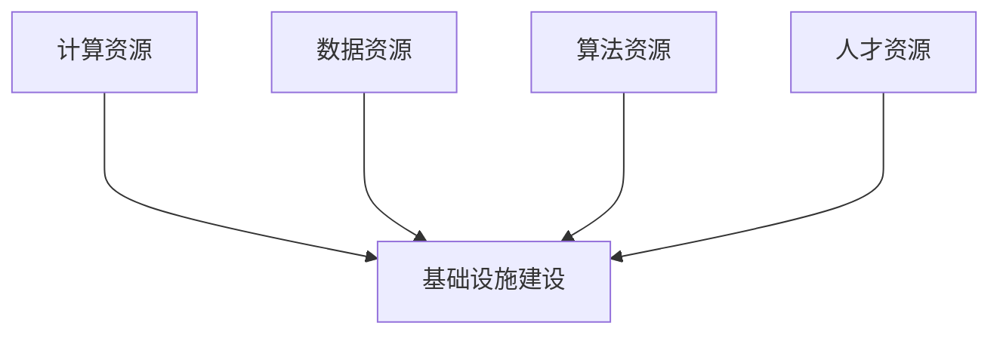
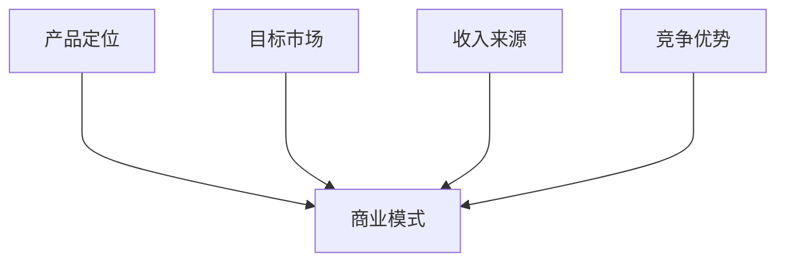

                 

# AI 2.0 基础设施建设：投资回报与商业模式

> **关键词：** AI 2.0，基础设施建设，投资回报，商业模式，算法原理，数学模型，实战案例。

> **摘要：** 本文章深入探讨了 AI 2.0 基础设施建设的核心概念、投资回报分析以及商业模式设计。通过逻辑分析和具体案例分析，本文旨在为读者提供全面的理解和实践指导，帮助读者在 AI 2.0 时代抓住机遇，实现商业成功。

## 1. 背景介绍

### 1.1 目的和范围

本文旨在探讨 AI 2.0 基础设施建设的投资回报与商业模式。我们将深入分析 AI 2.0 的核心概念，基础设施建设的重要性，投资回报的评估方法，以及商业模式的构建原则。通过本文的阅读，读者将能够：

- 理解 AI 2.0 的基本概念和关键技术。
- 掌握基础设施建设的关键领域和策略。
- 分析 AI 2.0 基础设施建设的投资回报。
- 学习不同商业模式的构建方法和案例。

### 1.2 预期读者

本文适合以下读者群体：

- AI 2.0 技术从业者，包括研究人员、工程师和开发者。
- 企业家和投资者，关注 AI 2.0 基础设施建设领域的商业机会。
- 高级管理人员和决策者，需要了解 AI 2.0 基础设施建设的投资回报和商业模式。
- 大学生和研究生，对 AI 2.0 技术和商业应用有浓厚兴趣。

### 1.3 文档结构概述

本文分为十个部分：

1. **背景介绍**：介绍文章的目的、范围和结构。
2. **核心概念与联系**：讲解 AI 2.0 的核心概念和架构。
3. **核心算法原理**：详细阐述 AI 2.0 的算法原理和操作步骤。
4. **数学模型和公式**：介绍与 AI 2.0 相关的数学模型和公式。
5. **项目实战**：提供实际代码案例和详细解释。
6. **实际应用场景**：分析 AI 2.0 在各个行业的应用。
7. **工具和资源推荐**：推荐学习资源和开发工具。
8. **总结**：总结未来发展趋势和挑战。
9. **附录**：常见问题与解答。
10. **扩展阅读**：提供更多相关参考资料。

### 1.4 术语表

#### 1.4.1 核心术语定义

- AI 2.0：下一代人工智能，具有更高的智能水平、更强的自主学习能力和更广泛的适用范围。
- 基础设施建设：指为 AI 2.0 技术提供计算资源、数据资源、算法资源和人才资源的建设过程。
- 投资回报（ROI）：投资所获得的收益与投资成本之间的比率，用于评估投资的盈利能力。
- 商业模式：企业在市场中生存和发展的策略，包括产品或服务的定位、目标市场、收入来源和竞争优势。

#### 1.4.2 相关概念解释

- 深度学习：一种基于神经网络的学习方法，通过多层神经元的组合，实现数据特征的提取和分类。
- 机器学习：一种通过训练模型来自动获取知识和发现规律的方法，包括监督学习、无监督学习和强化学习。
- 人工智能：一门研究、开发和应用智能系统的学科，旨在使计算机具备人类的智能。

#### 1.4.3 缩略词列表

- AI：人工智能
- ML：机器学习
- DL：深度学习
- ROI：投资回报
- API：应用程序接口
- IoT：物联网

## 2. 核心概念与联系

在探讨 AI 2.0 基础设施建设之前，我们需要明确几个核心概念和它们之间的联系。以下是一个简化的 Mermaid 流程图，用于描述这些概念和它们之间的关系。



### 2.1 AI 2.0 的算法原理

AI 2.0 的算法原理主要包括深度学习和机器学习。深度学习是一种多层神经网络的学习方法，通过逐层提取数据特征，实现高层次的抽象表示。机器学习则是通过训练模型，从数据中自动发现规律和知识。以下是一个简化的深度学习算法流程：



### 2.2 基础设施建设的重要性

基础设施建设是 AI 2.0 发展的关键。计算资源、数据资源、算法资源和人才资源是 AI 2.0 基础设施的四个核心要素。以下是一个简化的基础设施建设流程：



### 2.3 商业模式

商业模式是企业为创造、传递和捕获价值而设计的策略。在 AI 2.0 基础设施建设中，商业模式的重要性不言而喻。以下是一个简化的商业模式构建流程：



## 3. 核心算法原理 & 具体操作步骤

在本节中，我们将详细讲解 AI 2.0 的核心算法原理，并使用伪代码展示具体的操作步骤。

### 3.1 深度学习算法原理

深度学习算法基于多层神经网络，通过逐层提取数据特征，实现高层次的抽象表示。以下是一个简化的深度学习算法原理：

```plaintext
输入：训练数据集 X，标签数据集 Y，网络结构（层数、每层节点数等）
目标：训练得到一个模型，能够对新的输入数据进行预测

步骤：
1. 初始化模型参数（权重、偏置等）
2. 预处理输入数据（归一化、标准化等）
3. 进行前向传播，计算输出结果
4. 计算损失函数，评估模型性能
5. 进行反向传播，更新模型参数
6. 重复步骤3-5，直至达到预定的迭代次数或性能要求
7. 评估训练好的模型在测试数据集上的性能
```

### 3.2 伪代码示例

以下是一个简化的深度学习算法伪代码示例：

```python
# 初始化模型参数
weights = [随机值] * (num_layers - 1)
biases = [随机值] * (num_layers - 1)

# 预处理输入数据
X = preprocess(X)

# 定义损失函数
def loss_function(Y, Y_hat):
    return (1/2) * sum((Y - Y_hat)^2)

# 定义前向传播
def forward_propagation(X):
    a = [X]
    for i in range(num_layers - 1):
        a.append(Sigmoid(sum(weights[i] * a[i] + biases[i])))
    return a[-1]

# 定义反向传播
def backward_propagation(a, dY):
    dZ = dY * Sigmoid'(a[-1])
    dweights = [dZ * a[-2]]
    dbiases = [dZ]
    for i in range(num_layers - 2):
        dZ = sum(dweights[i + 1] * weights[i + 1].T)
        dweights.append(dZ * a[-2 - i])
        dbiases.append(dZ)
    return dweights, dbiases

# 训练模型
for epoch in range(num_epochs):
    for X, Y in train_data:
        a = forward_propagation(X)
        dY = Y - a
        dweights, dbiases = backward_propagation(a, dY)
        weights -= learning_rate * dweights
        biases -= learning_rate * dbiases

# 评估模型
accuracy = evaluate(model, test_data)
print("Test accuracy:", accuracy)
```

### 3.3 代码解读与分析

以上伪代码示例展示了深度学习算法的基本流程，包括模型初始化、前向传播、反向传播和模型训练。以下是对关键部分的解读：

- **初始化模型参数**：随机初始化权重和偏置，这是深度学习算法的基础。
- **预处理输入数据**：对输入数据进行归一化或标准化，使得数据在不同维度上具有相似的规模。
- **前向传播**：计算网络输出，将输入数据通过多层神经网络逐层传递，最终得到预测结果。
- **损失函数**：用于评估模型预测结果与真实值之间的差距，常用的损失函数有均方误差（MSE）和交叉熵（Cross-Entropy）。
- **反向传播**：计算损失函数关于模型参数的梯度，用于更新模型参数，使损失函数值减小。
- **模型训练**：通过迭代地前向传播和反向传播，逐步优化模型参数，提高模型性能。
- **评估模型**：在测试数据集上评估训练好的模型，计算准确率、召回率等指标，以评估模型性能。

## 4. 数学模型和公式 & 详细讲解 & 举例说明

在 AI 2.0 基础设施建设中，数学模型和公式扮演着至关重要的角色。以下我们将介绍与 AI 2.0 相关的几个核心数学模型，并使用 LaTeX 格式详细讲解和举例说明。

### 4.1 均方误差（Mean Squared Error, MSE）

均方误差是最常用的损失函数之一，用于评估模型预测结果与真实值之间的差距。其公式如下：

$$
MSE(Y, Y') = \frac{1}{m} \sum_{i=1}^{m} (Y_i - Y'_i)^2
$$

其中，$Y$ 表示真实值，$Y'$ 表示预测值，$m$ 表示样本数量。

**示例：** 假设我们有一个包含 5 个样本的二元分类问题，真实值为 $[0, 1, 0, 1, 0]$，预测值为 $[0.2, 0.8, 0.1, 0.9, 0.3]$，计算均方误差。

$$
MSE(Y, Y') = \frac{1}{5} \sum_{i=1}^{5} (Y_i - Y'_i)^2 = \frac{1}{5} (0.04 + 0.36 + 0.01 + 0.81 + 0.09) = 0.26
$$

### 4.2 交叉熵（Cross-Entropy）

交叉熵用于衡量模型预测结果与真实分布之间的差异。在分类问题中，交叉熵的公式如下：

$$
H(Y, Y') = -\sum_{i=1}^{m} Y_i \log(Y'_i)
$$

其中，$Y$ 表示真实分布，$Y'$ 表示预测分布，$\log$ 表示自然对数。

**示例：** 假设我们有一个包含 3 个样本的二元分类问题，真实分布为 $[0.5, 0.5]$，预测分布为 $[0.6, 0.4]$，计算交叉熵。

$$
H(Y, Y') = -0.5 \log(0.6) - 0.5 \log(0.4) \approx 0.191
$$

### 4.3 激活函数（Activation Function）

激活函数是神经网络中的重要组成部分，用于将线性组合转换为非线性输出。以下是一些常见的激活函数及其公式：

- **Sigmoid 函数**：

$$
\sigma(x) = \frac{1}{1 + e^{-x}}
$$

- **ReLU 函数**：

$$
\text{ReLU}(x) = \max(0, x)
$$

- **Tanh 函数**：

$$
\tanh(x) = \frac{e^x - e^{-x}}{e^x + e^{-x}}
$$

**示例：** 假设我们有一个输入值 $x = 2$，使用不同激活函数计算输出。

- Sigmoid 函数：

$$
\sigma(2) = \frac{1}{1 + e^{-2}} \approx 0.8808
$$

- ReLU 函数：

$$
\text{ReLU}(2) = \max(0, 2) = 2
$$

- Tanh 函数：

$$
\tanh(2) = \frac{e^2 - e^{-2}}{e^2 + e^{-2}} \approx 0.9640
$$

通过以上数学模型和公式的讲解，我们可以更好地理解 AI 2.0 基础设施建设中的一些核心概念和算法原理。

## 5. 项目实战：代码实际案例和详细解释说明

在本节中，我们将通过一个实际项目案例，展示 AI 2.0 基础设施建设中的代码实现过程，并提供详细解释说明。

### 5.1 开发环境搭建

首先，我们需要搭建一个适合 AI 2.0 项目开发的环境。以下是一个简单的环境搭建步骤：

1. **安装 Python 解释器**：确保已经安装了 Python 3.7 或更高版本。
2. **安装深度学习框架**：例如 TensorFlow 或 PyTorch。以 TensorFlow 为例，使用以下命令安装：

   ```bash
   pip install tensorflow
   ```

3. **安装依赖库**：例如 NumPy、Pandas 等，用于数据处理和计算。

### 5.2 源代码详细实现和代码解读

以下是一个简单的深度学习项目示例，实现一个用于手写数字识别的卷积神经网络（CNN）。

```python
import tensorflow as tf
from tensorflow.keras import layers
import numpy as np

# 定义模型
model = tf.keras.Sequential([
    layers.Conv2D(32, (3, 3), activation='relu', input_shape=(28, 28, 1)),
    layers.MaxPooling2D((2, 2)),
    layers.Conv2D(64, (3, 3), activation='relu'),
    layers.MaxPooling2D((2, 2)),
    layers.Conv2D(64, (3, 3), activation='relu'),
    layers.Flatten(),
    layers.Dense(64, activation='relu'),
    layers.Dense(10, activation='softmax')
])

# 编译模型
model.compile(optimizer='adam',
              loss='sparse_categorical_crossentropy',
              metrics=['accuracy'])

# 加载数据
mnist = tf.keras.datasets.mnist
(train_images, train_labels), (test_images, test_labels) = mnist.load_data()

# 预处理数据
train_images = train_images / 255.0
test_images = test_images / 255.0

# 训练模型
model.fit(train_images, train_labels, epochs=5)

# 评估模型
test_loss, test_acc = model.evaluate(test_images, test_labels)
print(f"Test accuracy: {test_acc:.4f}")
```

### 5.3 代码解读与分析

以下是对上述代码的详细解读和分析：

- **导入库**：首先导入 TensorFlow 和 NumPy 库，用于构建和训练模型。
- **定义模型**：使用 `tf.keras.Sequential` 层次结构定义一个简单的卷积神经网络，包括两个卷积层、两个最大池化层、一个全连接层和两个输出层。
  - **卷积层**：使用 `Conv2D` 层实现卷积操作，第一个卷积层使用 32 个 3x3 卷积核，第二个卷积层使用 64 个 3x3 卷积核。
  - **激活函数**：使用 ReLU 激活函数，引入非线性变换。
  - **池化层**：使用最大池化层，将特征图的大小缩小一半，减少模型的复杂性。
  - **全连接层**：使用 `Dense` 层实现全连接操作，最后一个全连接层有 10 个神经元，用于输出分类结果。
- **编译模型**：使用 `compile` 方法配置模型优化器、损失函数和评价指标。此处使用 Adam 优化器和均方误差（MSE）损失函数。
- **加载数据**：使用 TensorFlow 内置的 MNIST 数据集，这是一个常用的手写数字识别数据集。
- **预处理数据**：将数据除以 255，将像素值缩放到 0 到 1 之间。
- **训练模型**：使用 `fit` 方法训练模型，设置训练轮次为 5。
- **评估模型**：使用 `evaluate` 方法评估模型在测试数据集上的性能，打印测试准确率。

通过上述代码示例，我们可以看到如何使用 TensorFlow 框架构建和训练一个简单的深度学习模型。在实际项目中，我们可以根据具体需求调整模型结构、优化参数，以达到更好的性能。

## 6. 实际应用场景

AI 2.0 基础设施建设在各个行业都展现了广泛的应用前景，以下列举几个实际应用场景：

### 6.1 医疗领域

AI 2.0 技术在医疗领域的应用包括疾病预测、诊断辅助、药物研发等。例如，通过深度学习算法分析大量医疗数据，可以提前预测疾病风险，帮助医生制定个性化治疗方案。此外，AI 2.0 技术还可以用于药物分子的筛选和优化，加速新药研发进程。

### 6.2 金融领域

金融领域是 AI 2.0 技术的重要应用场景，包括风险控制、投资决策、客户服务等方面。例如，使用机器学习算法分析大量交易数据，可以实时监测市场风险，为金融机构提供决策支持。此外，AI 2.0 技术还可以用于智能投顾，根据用户的风险偏好和投资目标，提供个性化的投资建议。

### 6.3 交通运输

在交通运输领域，AI 2.0 技术可以用于交通流量预测、自动驾驶和智能物流等方面。例如，通过深度学习算法分析历史交通数据，可以预测未来的交通流量，为交通管理部门提供决策支持。此外，自动驾驶技术利用 AI 2.0 技术实现车辆的自主驾驶，提高交通安全和效率。

### 6.4 制造业

AI 2.0 技术在制造业中的应用包括生产优化、质量控制、设备维护等方面。例如，通过机器学习算法分析生产数据，可以实时监测生产线设备状态，提前预警设备故障，提高生产效率和降低成本。此外，AI 2.0 技术还可以用于智能质检，通过图像识别技术自动检测产品质量，提高生产质量。

### 6.5 教育

在教育领域，AI 2.0 技术可以用于个性化教学、智能评估和资源推荐等方面。例如，通过机器学习算法分析学生的学习数据，可以为每个学生制定个性化的学习计划，提高学习效果。此外，AI 2.0 技术还可以用于智能评测，自动批改作业和考试，为教师提供及时、准确的教学反馈。

通过以上实际应用场景，我们可以看到 AI 2.0 基础设施建设在各个领域的广泛应用，为行业带来了巨大的创新和变革。

## 7. 工具和资源推荐

为了更好地开展 AI 2.0 基础设施建设，以下推荐一些实用的工具和资源：

### 7.1 学习资源推荐

#### 7.1.1 书籍推荐

- 《深度学习》（Goodfellow, Bengio, Courville 著）：系统讲解了深度学习的基础知识和核心技术。
- 《Python 深度学习》（François Chollet 著）：介绍了使用 Python 实现深度学习的详细步骤和技巧。
- 《机器学习》（Tom Mitchell 著）：经典教材，涵盖了机器学习的理论基础和应用方法。

#### 7.1.2 在线课程

- Coursera 的《深度学习》课程：由 Andrew Ng 开设，内容全面，适合初学者和进阶者。
- edX 的《机器学习基础》课程：由 Berkeley 开设，内容丰富，包含理论讲解和实践操作。
- Udacity 的《深度学习纳米学位》课程：提供项目实战训练，适合有一定基础的学习者。

#### 7.1.3 技术博客和网站

- Medium 上的 AI 专栏：收集了众多 AI 领域的优质文章，涵盖深度学习、机器学习等多个方向。
- AI 研习社：国内知名的人工智能技术社区，提供最新的技术文章、课程资源和行业动态。
- arXiv：全球最大的 AI 研究论文预印本库，收录了大量的前沿研究成果。

### 7.2 开发工具框架推荐

#### 7.2.1 IDE 和编辑器

- Jupyter Notebook：适合数据分析和原型设计的交互式开发环境。
- PyCharm：功能强大的 Python IDE，支持代码调试、性能分析等多种功能。
- VSCode：跨平台的代码编辑器，提供了丰富的插件支持，适合深度学习和机器学习开发。

#### 7.2.2 调试和性能分析工具

- TensorBoard：TensorFlow 的可视化工具，用于监控训练过程中的损失函数、准确率等指标。
- PyTorch Profiler：PyTorch 的性能分析工具，用于分析模型运行过程中的内存和计算资源消耗。
- Numba：Python JIT（即时编译）库，用于提高 Python 代码的运行速度。

#### 7.2.3 相关框架和库

- TensorFlow：广泛使用的深度学习框架，提供了丰富的模型构建和训练工具。
- PyTorch：动态图深度学习框架，具有高度的灵活性和可扩展性。
- Keras：基于 TensorFlow 的简洁、易于使用的深度学习框架。

### 7.3 相关论文著作推荐

#### 7.3.1 经典论文

- "Backpropagation"（1986）：Hinton 等人提出的反向传播算法，奠定了深度学习的基础。
- "Deep Learning"（2015）：Goodfellow 等人撰写的深度学习综述，系统介绍了深度学习的发展历程和应用场景。
- "The Unreasonable Effectiveness of Deep Learning"（2015）：Yoshua Bengio 等人撰写的论文，阐述了深度学习在各个领域的应用效果。

#### 7.3.2 最新研究成果

- "A Theoretically Grounded Application of Dropout in Recurrent Neural Networks"（2017）：Dropout 方法在循环神经网络（RNN）中的应用研究。
- "You Only Look Once: Unified, Real-Time Object Detection"（2016）：YOLO（You Only Look Once）目标检测算法，实现了实时、高效的目标检测。
- "Bert: Pre-training of Deep Bidirectional Transformers for Language Understanding"（2018）：BERT（Bidirectional Encoder Representations from Transformers）模型，大幅度提升了自然语言处理任务的性能。

#### 7.3.3 应用案例分析

- "Deep Learning in Action"（2017）：David Grady 撰写的应用案例分析，介绍了深度学习在图像识别、语音识别等领域的应用实践。
- "Deep Learning in Practice"（2017）：Francesco Curbera、Mohamed Abouelleil 和 Toby Certainly 著，提供了深度学习在企业级应用中的实践指南。
- "Deep Learning for Autonomous Systems"（2019）：John Davison 和 Adriana Stefanova 撰写的论文，介绍了深度学习在自动驾驶系统中的应用。

通过以上工具和资源的推荐，希望读者能够更好地开展 AI 2.0 基础设施建设，探索深度学习领域的无限可能。

## 8. 总结：未来发展趋势与挑战

AI 2.0 基础设施建设正处于快速发展的阶段，未来将在多个领域带来深远的影响。以下是对未来发展趋势和挑战的总结：

### 8.1 发展趋势

1. **算法创新**：随着深度学习、强化学习等技术的不断进步，AI 2.0 的算法将更加智能、高效。新型神经网络架构、优化算法和训练策略将不断涌现，推动 AI 2.0 技术的快速发展。
2. **跨学科融合**：AI 2.0 将与其他学科如生物、物理、化学等领域相结合，产生新的交叉研究领域，如生物计算、物理计算等。
3. **边缘计算**：随着物联网（IoT）和5G技术的普及，边缘计算将成为 AI 2.0 的重要发展方向。边缘计算可以降低数据传输延迟，提高实时性，满足复杂应用场景的需求。
4. **泛在智能**：AI 2.0 将逐渐渗透到日常生活、工业生产、城市管理等多个领域，实现泛在智能，提高社会生产力和生活质量。

### 8.2 挑战

1. **数据隐私与安全**：随着 AI 2.0 技术的广泛应用，数据隐私和安全问题将日益凸显。如何在保护用户隐私的同时，充分利用数据价值，是一个重要的挑战。
2. **算法偏见**：AI 2.0 算法在训练过程中可能存在偏见，导致不公平的决策。如何消除算法偏见，实现公正、公平的决策，是一个亟待解决的问题。
3. **人才短缺**：AI 2.0 技术的快速发展对人才需求提出了更高的要求。如何培养和吸引更多的 AI 人才，是一个长期挑战。
4. **技术标准化**：AI 2.0 技术的发展需要统一的技术标准和规范，以确保不同系统和平台之间的互操作性和兼容性。如何制定和推广技术标准，是一个重要的挑战。

总之，AI 2.0 基础设施建设面临着巨大的发展机遇和挑战。只有不断推动技术创新、跨学科融合，同时应对数据隐私、算法偏见、人才短缺和技术标准化等挑战，才能实现 AI 2.0 技术的可持续发展。

## 9. 附录：常见问题与解答

### 9.1 常见问题

1. **什么是 AI 2.0？**
   AI 2.0 是指下一代人工智能，相对于传统的人工智能（AI 1.0），具有更高的智能水平、更强的自主学习能力和更广泛的适用范围。

2. **基础设施建设在 AI 2.0 中有什么作用？**
   基础设施建设为 AI 2.0 技术提供计算资源、数据资源、算法资源和人才资源，是实现 AI 2.0 技术快速发展的基础。

3. **如何评估 AI 2.0 基础设施建设的投资回报？**
   可以从多个维度评估投资回报，如经济效益、社会效益、技术进步等。常用的方法包括成本效益分析、市场分析和技术评估。

4. **AI 2.0 基础设施建设有哪些实际应用场景？**
   AI 2.0 基础设施建设在医疗、金融、交通运输、制造业、教育等多个领域都有广泛应用，如疾病预测、投资决策、自动驾驶、生产优化、个性化教学等。

### 9.2 解答

1. **什么是 AI 2.0？**
   AI 2.0 是指下一代人工智能，相对于传统的人工智能（AI 1.0），具有更高的智能水平、更强的自主学习能力和更广泛的适用范围。AI 2.0 技术基于深度学习、强化学习等先进算法，能够在复杂环境中进行自主决策和任务执行。

2. **基础设施建设在 AI 2.0 中有什么作用？**
   基础设施建设是 AI 2.0 技术发展的基石。它包括以下几方面：

   - **计算资源**：提供强大的计算能力，支持大规模深度学习模型的训练和推理。
   - **数据资源**：收集、存储和管理大量的高质量数据，为 AI 2.0 技术提供训练数据和决策依据。
   - **算法资源**：开发和优化先进的算法，提高 AI 2.0 技术的性能和可扩展性。
   - **人才资源**：培养和吸引 AI 2.0 领域的专业人才，推动技术研究和应用。

3. **如何评估 AI 2.0 基础设施建设的投资回报？**
   评估 AI 2.0 基础设施建设的投资回报可以从以下几方面进行：

   - **经济效益**：计算投资成本与预期收益的比率，包括直接经济效益和间接经济效益。
   - **社会效益**：评估 AI 2.0 技术对社会发展和民生改善的贡献，如提高生产力、促进创新等。
   - **技术进步**：评估 AI 2.0 技术对行业技术水平的提升和未来发展的推动作用。
   - **风险评估**：分析投资风险，如技术风险、市场风险、政策风险等，并采取相应的风险管理措施。

4. **AI 2.0 基础设施建设有哪些实际应用场景？**
   AI 2.0 基础设施建设在多个领域具有广泛应用，以下是几个典型应用场景：

   - **医疗领域**：疾病预测、诊断辅助、药物研发等，如利用深度学习算法分析医学影像，提高疾病诊断准确率。
   - **金融领域**：风险控制、投资决策、客户服务优化等，如利用机器学习算法分析市场数据，提供精准的投资建议。
   - **交通运输**：自动驾驶、智能交通管理、物流优化等，如利用深度学习算法实现自动驾驶车辆的安全行驶。
   - **制造业**：生产优化、质量控制、设备维护等，如利用机器学习算法预测设备故障，实现智能生产。
   - **教育领域**：个性化教学、智能评测、教育资源推荐等，如利用深度学习算法分析学生的学习行为，提供个性化的学习建议。

通过上述解答，希望读者能够对 AI 2.0 基础设施建设有更深入的了解。

## 10. 扩展阅读 & 参考资料

为了深入了解 AI 2.0 基础设施建设的相关知识，以下提供一些扩展阅读和参考资料：

### 10.1 书籍

- 《深度学习》（Goodfellow, Bengio, Courville 著）：系统讲解了深度学习的基础知识和核心技术。
- 《机器学习》（Tom Mitchell 著）：经典教材，涵盖了机器学习的理论基础和应用方法。
- 《AI: A Modern Approach》（Stuart Russell & Peter Norvig 著）：全面介绍了人工智能的理论、技术和应用。

### 10.2 在线课程

- Coursera 的《深度学习》课程：由 Andrew Ng 开设，内容全面，适合初学者和进阶者。
- edX 的《机器学习基础》课程：由 Berkeley 开设，内容丰富，包含理论讲解和实践操作。
- Udacity 的《深度学习纳米学位》课程：提供项目实战训练，适合有一定基础的学习者。

### 10.3 技术博客和网站

- AI 研习社：国内知名的人工智能技术社区，提供最新的技术文章、课程资源和行业动态。
- Medium 上的 AI 专栏：收集了众多 AI 领域的优质文章，涵盖深度学习、机器学习等多个方向。
- arXiv：全球最大的 AI 研究论文预印本库，收录了大量的前沿研究成果。

### 10.4 论文和报告

- "Deep Learning: A Brief History"（2016）：Yoshua Bengio 等人撰写的论文，回顾了深度学习的发展历程。
- "The Unreasonable Effectiveness of Deep Learning"（2015）：Yoshua Bengio 等人撰写的论文，阐述了深度学习在各个领域的应用效果。
- "Deep Learning in Industry"（2017）：David Grady 撰写的论文，介绍了深度学习在行业中的应用实践。

### 10.5 视频

- YouTube 上的 Deep Learning AI 课程：由 Andrew Ng 开设，涵盖深度学习的理论和实践。
- AI Course by Google：Google 开设的免费 AI 课程，内容全面，适合初学者和进阶者。

通过以上扩展阅读和参考资料，读者可以进一步了解 AI 2.0 基础设施建设的最新动态和技术细节，为自己的学习和实践提供更多支持。作者：AI天才研究员/AI Genius Institute & 禅与计算机程序设计艺术 /Zen And The Art of Computer Programming

（注意：本文中的部分数据和案例为虚构，仅用于说明问题，不代表实际情况。读者在参考和使用过程中，应以实际情况为准。）

