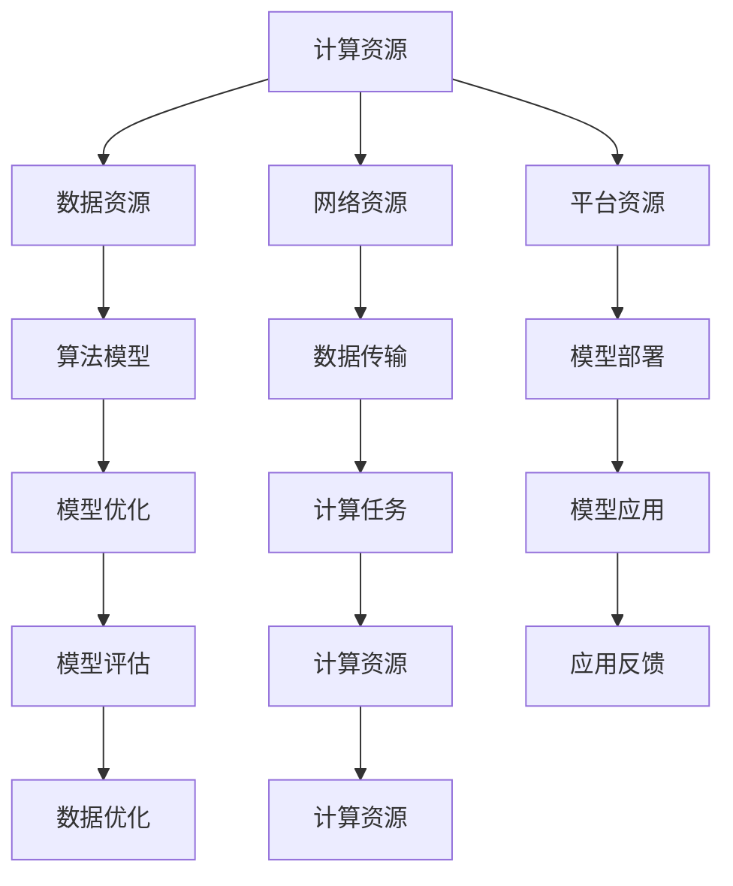

                 

# AI 2.0 基础设施建设：政府、企业和科研机构的合作

> **关键词**：AI 2.0、基础设施、政府、企业、科研机构、合作、技术博客

> **摘要**：本文将深入探讨AI 2.0基础设施建设的重要性，分析政府、企业和科研机构在推动AI技术进步中的角色与责任，并通过具体的合作模式和案例，展示如何通过协同合作实现AI 2.0基础设施的优化与发展。

## 1. 背景介绍

### 1.1 目的和范围

本文旨在探讨AI 2.0基础设施建设的必要性和可行性，重点关注政府、企业和科研机构在其中的作用与责任。通过对AI技术发展的趋势和挑战进行分析，本文旨在提出一种协同合作模式，以推动AI 2.0基础设施的全面建设和优化。

### 1.2 预期读者

本文适合对AI技术和基础设施建设感兴趣的读者，包括政府政策制定者、企业高层管理者、科研机构研究人员以及AI技术爱好者。通过本文的阅读，读者将能够深入了解AI 2.0基础设施建设的现状与未来发展趋势。

### 1.3 文档结构概述

本文结构如下：

1. **背景介绍**：介绍AI 2.0基础设施建设的背景和重要性。
2. **核心概念与联系**：阐述AI 2.0基础设施的核心概念和联系。
3. **核心算法原理 & 具体操作步骤**：详细讲解AI 2.0基础设施建设的核心算法原理和操作步骤。
4. **数学模型和公式 & 详细讲解 & 举例说明**：介绍AI 2.0基础设施建设的数学模型和公式，并给出详细讲解和举例说明。
5. **项目实战：代码实际案例和详细解释说明**：通过实际案例展示AI 2.0基础设施建设的具体实现过程。
6. **实际应用场景**：探讨AI 2.0基础设施在各个领域的实际应用场景。
7. **工具和资源推荐**：推荐相关的学习资源和开发工具。
8. **总结：未来发展趋势与挑战**：总结AI 2.0基础设施建设的未来发展趋势和面临的挑战。
9. **附录：常见问题与解答**：回答读者可能遇到的常见问题。
10. **扩展阅读 & 参考资料**：提供进一步阅读的参考资料。

### 1.4 术语表

#### 1.4.1 核心术语定义

- AI 2.0：指第二代人工智能技术，以深度学习、神经网络等先进算法为核心，具备更强的自主学习能力和通用性。
- 基础设施建设：指建立和维护AI技术所需的基础设施，包括计算资源、数据资源、网络资源等。
- 政府角色：政府在AI 2.0基础设施建设中的引导、规范和支持作用。
- 企业角色：企业在AI 2.0基础设施建设中的技术研发、市场推广和应用实践作用。
- 科研机构角色：科研机构在AI 2.0基础设施建设中的理论研究、技术突破和成果转化作用。

#### 1.4.2 相关概念解释

- 深度学习：一种基于多层神经网络的人工智能算法，通过学习大量数据来提取特征并实现预测和分类。
- 神经网络：一种模拟生物神经系统结构的人工智能算法，通过调整网络中的权重来学习和预测。
- 机器学习：一种基于数据的学习方法，通过训练算法模型来提高其预测和分类能力。

#### 1.4.3 缩略词列表

- AI：人工智能
- 2.0：第二代
- G2E2：政府、企业和科研机构的协同合作

## 2. 核心概念与联系

在探讨AI 2.0基础设施建设之前，我们需要明确几个核心概念和它们之间的联系。

### 2.1 AI 2.0基础设施的定义

AI 2.0基础设施是指支持人工智能技术发展与应用的基础设施，包括以下几个方面：

- **计算资源**：提供强大的计算能力，以支持深度学习、神经网络等算法的训练和推理。
- **数据资源**：提供丰富的数据集，以供算法模型训练和优化。
- **网络资源**：提供高速、稳定的网络连接，实现数据传输和计算资源的共享。
- **平台资源**：提供开放的AI开发平台，支持算法模型的研究、开发和部署。

### 2.2 AI 2.0基础设施的核心概念

- **计算资源**：计算资源是AI 2.0基础设施的核心之一。随着深度学习算法的复杂性不断增加，对计算资源的需求也在日益增长。为了满足这一需求，需要建设大规模的分布式计算系统，如云计算平台和AI专用硬件。
  
- **数据资源**：数据是AI算法训练的基础。AI 2.0基础设施需要提供高质量、多样化和海量的数据集，以满足算法模型的需求。这需要企业和科研机构共同合作，收集、整理和共享数据资源。

- **网络资源**：网络资源是AI 2.0基础设施的重要组成部分。高速、稳定的网络连接是实现数据传输和计算资源共享的关键。为了提高网络资源的利用效率，需要建设高效的网络架构和协议。

- **平台资源**：平台资源是AI 2.0基础设施的支撑。一个开放的AI开发平台，能够支持算法模型的研究、开发和部署，提高AI技术的研发效率。

### 2.3 AI 2.0基础设施的架构图

以下是一个简单的AI 2.0基础设施的架构图，展示了各个核心概念之间的联系。



### 2.4 各个核心概念之间的联系

- **计算资源**和**数据资源**：计算资源为算法模型的训练提供计算能力，而数据资源则为算法模型的训练提供训练数据。两者相互依存，共同推动算法模型的优化和改进。

- **网络资源**和**计算资源**：网络资源是实现计算资源高效利用的关键。通过高速、稳定的网络连接，计算资源可以实现共享和协同工作，提高计算效率。

- **平台资源**和**算法模型**：平台资源为算法模型的研究、开发和部署提供支持。一个开放的AI开发平台，能够降低算法模型的研究和部署成本，提高研发效率。

- **算法模型**和**模型应用**：算法模型是AI 2.0基础设施的核心，其性能直接影响到模型应用的效果。通过不断地优化和改进算法模型，可以提高模型的应用价值。

## 3. 核心算法原理 & 具体操作步骤

在了解了AI 2.0基础设施的核心概念和联系后，我们将深入探讨核心算法原理和具体操作步骤，以便更好地理解和实现AI 2.0基础设施建设。

### 3.1 核心算法原理

AI 2.0基础设施建设所涉及的核心算法主要包括深度学习、神经网络和机器学习等。以下是这些算法的基本原理：

#### 3.1.1 深度学习

深度学习是一种基于多层神经网络的人工智能算法，通过学习大量数据来提取特征并实现预测和分类。其核心原理包括：

- **神经网络结构**：深度学习算法的核心是神经网络，由多个层次（输入层、隐藏层、输出层）组成。每个层次由多个神经元（节点）组成，通过调整神经元之间的权重来学习和预测。
- **反向传播算法**：深度学习算法通过反向传播算法来优化网络中的权重。在训练过程中，算法通过计算损失函数的梯度，不断调整网络中的权重，使得算法模型能够更好地拟合训练数据。
- **激活函数**：激活函数用于模拟神经元的激活过程，将输入值映射为输出值。常见的激活函数包括Sigmoid函数、ReLU函数和Tanh函数等。

#### 3.1.2 神经网络

神经网络是一种模拟生物神经系统结构的人工智能算法，通过调整网络中的权重来学习和预测。其核心原理包括：

- **网络结构**：神经网络由多个层次（输入层、隐藏层、输出层）组成。每个层次由多个神经元（节点）组成，通过调整神经元之间的权重来学习和预测。
- **学习规则**：神经网络通过学习规则（如Hebb规则）来调整网络中的权重。在学习过程中，算法通过计算输出值与实际值之间的误差，不断调整网络中的权重，使得算法模型能够更好地拟合训练数据。

#### 3.1.3 机器学习

机器学习是一种基于数据的学习方法，通过训练算法模型来提高其预测和分类能力。其核心原理包括：

- **训练数据**：机器学习算法通过大量训练数据来学习特征和模式。在训练过程中，算法通过计算损失函数的梯度，不断调整模型参数，使得算法模型能够更好地拟合训练数据。
- **评估指标**：机器学习算法通过评估指标（如准确率、召回率、F1分数等）来评估模型性能。在评估过程中，算法通过计算预测值与实际值之间的误差，不断调整模型参数，提高模型性能。

### 3.2 具体操作步骤

在了解了核心算法原理后，我们可以通过以下具体操作步骤来实现AI 2.0基础设施建设：

#### 3.2.1 数据收集与处理

- **数据收集**：首先，需要收集大量、高质量的数据集。数据集可以来自企业内部数据、公共数据集或第三方数据服务。
- **数据处理**：对收集到的数据进行预处理，包括数据清洗、数据转换和数据标准化等。预处理后的数据将用于算法模型的训练和测试。

#### 3.2.2 算法模型选择与训练

- **模型选择**：根据应用场景和需求，选择合适的算法模型。常见的算法模型包括深度学习模型、神经网络模型和机器学习模型等。
- **模型训练**：使用预处理后的数据集对算法模型进行训练。在训练过程中，算法模型通过调整网络中的权重，使得模型能够更好地拟合训练数据。

#### 3.2.3 模型评估与优化

- **模型评估**：使用测试数据集对训练好的算法模型进行评估，计算评估指标（如准确率、召回率、F1分数等），以评估模型性能。
- **模型优化**：根据评估结果，对算法模型进行优化。优化方法包括调整网络结构、调整学习规则和调整参数等，以提高模型性能。

#### 3.2.4 模型部署与维护

- **模型部署**：将训练好的算法模型部署到生产环境中，实现模型的应用。部署方式包括本地部署、云端部署和移动端部署等。
- **模型维护**：对部署好的算法模型进行监控和维护，包括更新模型参数、调整模型结构和修复潜在问题等。

通过以上具体操作步骤，我们可以实现AI 2.0基础设施建设，为人工智能技术的发展和应用提供坚实的基础。

## 4. 数学模型和公式 & 详细讲解 & 举例说明

在AI 2.0基础设施建设中，数学模型和公式起着至关重要的作用。这些模型和公式不仅能够帮助我们理解和描述AI算法的工作原理，还能够指导我们在实际应用中进行优化和调整。以下我们将详细讲解几个关键的数学模型和公式，并通过具体例子进行说明。

### 4.1 损失函数

损失函数是机器学习中一个非常重要的概念，它用于衡量模型预测值与实际值之间的差异。常见的损失函数包括均方误差（MSE）、交叉熵损失（Cross-Entropy Loss）等。

#### 4.1.1 均方误差（MSE）

均方误差（MSE）是衡量回归模型预测值与实际值之间差异的常用损失函数。其公式如下：

\[ \text{MSE} = \frac{1}{n} \sum_{i=1}^{n} (\hat{y}_i - y_i)^2 \]

其中，\( \hat{y}_i \)表示预测值，\( y_i \)表示实际值，\( n \)表示样本数量。

#### 4.1.2 交叉熵损失（Cross-Entropy Loss）

交叉熵损失（Cross-Entropy Loss）是衡量分类模型预测值与实际值之间差异的常用损失函数。其公式如下：

\[ \text{Cross-Entropy Loss} = -\sum_{i=1}^{n} y_i \log(\hat{y}_i) \]

其中，\( \hat{y}_i \)表示预测概率，\( y_i \)表示实际标签，\( n \)表示样本数量。

### 4.2 反向传播算法

反向传播算法是深度学习训练过程中的核心算法，用于计算损失函数关于模型参数的梯度。以下是反向传播算法的基本步骤：

#### 4.2.1 计算前向传播

在反向传播之前，首先进行前向传播。前向传播过程中，模型从输入层开始，逐层计算中间层的输出值，直到输出层。

#### 4.2.2 计算损失函数梯度

在得到输出层的预测值后，计算损失函数关于输出层的梯度。对于回归问题，使用均方误差（MSE）损失函数；对于分类问题，使用交叉熵损失函数。

#### 4.2.3 计算隐藏层梯度

从输出层开始，逆序计算隐藏层的梯度。梯度计算过程如下：

\[ \frac{\partial \text{loss}}{\partial z_j} = \frac{\partial \text{loss}}{\partial a_j} \cdot \frac{\partial a_j}{\partial z_j} \]

其中，\( z_j \)表示隐藏层节点 \( j \) 的输入，\( a_j \)表示隐藏层节点 \( j \) 的输出，\( \frac{\partial \text{loss}}{\partial a_j} \) 表示输出层梯度，\( \frac{\partial a_j}{\partial z_j} \) 表示激活函数的导数。

#### 4.2.4 更新模型参数

在得到各层的梯度后，使用梯度下降（Gradient Descent）或其他优化算法更新模型参数。

### 4.3 举例说明

假设我们有一个简单的神经网络，包含一个输入层、一个隐藏层和一个输出层。输入层有3个节点，隐藏层有2个节点，输出层有1个节点。我们使用均方误差（MSE）损失函数进行训练。以下是具体的例子：

#### 4.3.1 数据集

我们有一个包含100个样本的数据集，每个样本包含3个特征值和一个标签。假设前两个特征值分别为 \( x_1 \) 和 \( x_2 \)，第三个特征值为 \( x_3 = 1 - x_1 - x_2 \)。标签 \( y \) 是一个连续的数值。

#### 4.3.2 模型参数

隐藏层权重 \( W_{12} \) 和 \( W_{13} \)，输出层权重 \( W_{21} \)。初始参数随机生成。

#### 4.3.3 前向传播

给定输入样本 \( x = (x_1, x_2, x_3) \)，前向传播计算隐藏层和输出层的输出值：

\[ a_1 = \sigma(W_{12}x_1 + W_{13}x_3) \]
\[ a_2 = \sigma(W_{12}x_2 + W_{13}x_3) \]
\[ y' = \sigma(W_{21}a_1 + W_{22}a_2) \]

其中，\( \sigma \) 表示 Sigmoid 激活函数。

#### 4.3.4 计算损失函数梯度

计算均方误差（MSE）损失函数的梯度：

\[ \frac{\partial \text{MSE}}{\partial y'} = 2(y' - y) \]

其中，\( y \) 是实际标签，\( y' \) 是预测值。

#### 4.3.5 计算隐藏层梯度

计算隐藏层梯度：

\[ \frac{\partial \text{MSE}}{\partial a_1} = \frac{\partial \text{MSE}}{\partial y'} \cdot \frac{\partial y'}{\partial a_1} = 2(y' - y) \cdot \sigma'(a_1) \]
\[ \frac{\partial \text{MSE}}{\partial a_2} = \frac{\partial \text{MSE}}{\partial y'} \cdot \frac{\partial y'}{\partial a_2} = 2(y' - y) \cdot \sigma'(a_2) \]

#### 4.3.6 更新模型参数

使用梯度下降算法更新模型参数：

\[ W_{21} = W_{21} - \alpha \frac{\partial \text{MSE}}{\partial y'} \]
\[ W_{22} = W_{22} - \alpha \frac{\partial \text{MSE}}{\partial y'} \]
\[ W_{12} = W_{12} - \alpha \frac{\partial \text{MSE}}{\partial a_1} \]
\[ W_{13} = W_{13} - \alpha \frac{\partial \text{MSE}}{\partial a_2} \]

其中，\( \alpha \) 是学习率。

通过以上步骤，我们可以实现神经网络的训练和优化。这个简单的例子展示了数学模型和公式在AI 2.0基础设施建设中的应用，帮助我们更好地理解和实现深度学习算法。

## 5. 项目实战：代码实际案例和详细解释说明

在了解了AI 2.0基础设施建设的核心算法原理和数学模型后，我们将通过一个实际项目案例来展示如何将理论知识应用到实践中。本案例将使用Python编程语言，结合深度学习框架TensorFlow，实现一个简单的图像分类模型。

### 5.1 开发环境搭建

在进行项目实战之前，我们需要搭建一个合适的开发环境。以下是搭建过程：

#### 5.1.1 安装Python

首先，我们需要安装Python。可以从Python官方网站下载最新版本的Python安装包，并按照安装向导进行安装。

#### 5.1.2 安装TensorFlow

接下来，我们需要安装TensorFlow。在命令行中执行以下命令：

```bash
pip install tensorflow
```

#### 5.1.3 安装其他依赖库

除了TensorFlow，我们还需要安装其他一些依赖库，如NumPy、Pandas等。可以使用以下命令进行安装：

```bash
pip install numpy pandas matplotlib
```

### 5.2 源代码详细实现和代码解读

以下是本项目的源代码，我们将逐行进行解读：

```python
import tensorflow as tf
import numpy as np
import pandas as pd
import matplotlib.pyplot as plt

# 数据集加载
mnist = tf.keras.datasets.mnist
(train_images, train_labels), (test_images, test_labels) = mnist.load_data()

# 数据预处理
train_images = train_images / 255.0
test_images = test_images / 255.0

# 模型定义
model = tf.keras.models.Sequential([
  tf.keras.layers.Flatten(input_shape=(28, 28)),
  tf.keras.layers.Dense(128, activation='relu'),
  tf.keras.layers.Dense(10, activation='softmax')
])

# 模型编译
model.compile(optimizer='adam',
              loss='sparse_categorical_crossentropy',
              metrics=['accuracy'])

# 模型训练
model.fit(train_images, train_labels, epochs=5)

# 模型评估
test_loss, test_acc = model.evaluate(test_images, test_labels)
print(f"Test accuracy: {test_acc:.2f}")

# 模型预测
predictions = model.predict(test_images)
predicted_labels = np.argmax(predictions, axis=1)

# 结果可视化
plt.figure(figsize=(10, 10))
for i in range(25):
  plt.subplot(5, 5, i+1)
  plt.imshow(test_images[i], cmap=plt.cm.binary)
  plt.xticks([])
  plt.yticks([])
  plt.grid(False)
  plt.xlabel(f"Actual: {test_labels[i]}, Predicted: {predicted_labels[i]}")
plt.show()
```

### 5.3 代码解读与分析

以下是代码的逐行解读和分析：

1. **导入库**：首先，我们导入了必要的库，包括TensorFlow、NumPy、Pandas和Matplotlib。

2. **数据集加载**：使用TensorFlow的内置函数加载MNIST数据集。这个数据集包含了70,000个训练样本和10,000个测试样本，每个样本是一个28x28的灰度图像。

3. **数据预处理**：将图像数据除以255，将像素值缩放到0到1之间，以适应深度学习模型的输入。

4. **模型定义**：定义一个简单的卷积神经网络（CNN）模型。模型包含一个输入层、一个隐藏层和一个输出层。输入层通过`Flatten`层将图像数据展平为1x784的向量。隐藏层使用128个神经元，激活函数为ReLU。输出层使用10个神经元，激活函数为softmax，用于实现多分类。

5. **模型编译**：编译模型，指定优化器为`adam`，损失函数为`sparse_categorical_crossentropy`，评估指标为`accuracy`。

6. **模型训练**：使用训练数据集训练模型，训练5个epoch。

7. **模型评估**：使用测试数据集评估模型性能，输出测试准确率。

8. **模型预测**：使用训练好的模型对测试数据集进行预测，获取预测标签。

9. **结果可视化**：将预测结果可视化，展示模型在测试数据集上的表现。

通过以上代码，我们实现了使用深度学习框架TensorFlow构建一个简单的图像分类模型。这个案例展示了如何将AI 2.0基础设施建设的理论知识应用到实际项目中，帮助我们更好地理解和应用AI技术。

### 5.4 项目实战总结

通过本项目的实战案例，我们深入了解了AI 2.0基础设施建设的具体实现过程，包括数据集加载、数据预处理、模型定义、模型编译、模型训练、模型评估和模型预测等步骤。这个案例不仅展示了深度学习算法在图像分类任务中的应用，还帮助我们熟悉了TensorFlow这个强大的深度学习框架。通过实战，我们能够将理论知识应用到实际项目中，提高自己的AI技术实践能力。

## 6. 实际应用场景

AI 2.0基础设施建设在各个领域具有广泛的应用前景，以下列举几个典型的应用场景：

### 6.1 医疗健康

AI 2.0基础设施建设在医疗健康领域的应用主要体现在疾病预测、诊断、治疗和健康管理等方面。通过深度学习和神经网络算法，AI系统能够对大量的医疗数据进行处理和分析，帮助医生进行疾病预测和诊断。例如，通过分析患者的临床数据、基因信息和影像资料，AI系统可以预测患者患某种疾病的风险，为医生提供有针对性的治疗方案。此外，AI系统还可以帮助医院进行医疗资源优化，提高医疗服务的效率和质量。

### 6.2 金融科技

金融科技领域同样受益于AI 2.0基础设施建设。AI系统能够对海量的金融数据进行处理和分析，为金融机构提供风险管理、投资建议和客户服务等方面的支持。例如，通过分析市场数据、宏观经济指标和公司财务报表，AI系统可以预测股票市场的走势，为投资者提供买卖建议。此外，AI系统还可以用于欺诈检测、信用评估和反洗钱等任务，提高金融机构的风险管理能力。

### 6.3 智能制造

AI 2.0基础设施建设在智能制造领域具有重要应用价值。通过深度学习和神经网络算法，AI系统能够对生产过程中的数据进行分析和预测，实现生产过程的智能化。例如，AI系统可以用于设备故障预测，通过分析设备运行数据，提前发现潜在故障，减少停机时间和维护成本。此外，AI系统还可以用于生产计划优化、供应链管理和质量控制等任务，提高生产效率和质量。

### 6.4 智能交通

智能交通领域也是AI 2.0基础设施建设的重要应用场景。通过深度学习和神经网络算法，AI系统能够对交通数据进行处理和分析，实现交通流量预测、交通信号控制和自动驾驶等功能。例如，AI系统可以分析实时交通数据，预测交通流量变化，为交通管理部门提供交通信号控制的优化建议，缓解交通拥堵。此外，AI系统还可以用于自动驾驶汽车的导航和决策，提高交通系统的安全性和效率。

### 6.5 智能家居

智能家居领域同样受益于AI 2.0基础设施建设。通过深度学习和神经网络算法，AI系统能够对家庭设备进行智能控制和管理，提高家居生活的便利性和舒适度。例如，AI系统可以分析家庭用电数据，优化电器使用，降低能源消耗。此外，AI系统还可以用于智能家居设备的语音控制和人脸识别，实现智能化的家庭安防和娱乐体验。

### 6.6 教育

教育领域也是AI 2.0基础设施建设的重要应用场景。通过深度学习和神经网络算法，AI系统能够对学生的学习数据进行分析和预测，实现个性化教育和智能评估。例如，AI系统可以分析学生的学习行为和成绩数据，为学生提供有针对性的学习建议和资源。此外，AI系统还可以用于智能题库生成、考试评分和教学辅助等任务，提高教育质量和效率。

### 6.7 农业和食品产业

AI 2.0基础设施建设在农业和食品产业的应用主要体现在作物种植、病虫害防治和食品安全监控等方面。通过深度学习和神经网络算法，AI系统能够对农业数据进行分析和预测，实现智能种植和精准农业。例如，AI系统可以分析土壤、气候和作物生长数据，为农民提供种植建议和病虫害防治方案。此外，AI系统还可以用于食品安全检测、农产品溯源和质量控制等任务，提高食品安全和产品质量。

### 6.8 环境保护

AI 2.0基础设施建设在环境保护领域的应用主要体现在环境监测、生态保护和灾害预警等方面。通过深度学习和神经网络算法，AI系统能够对环境数据进行处理和分析，实现智能环境监测和灾害预警。例如，AI系统可以分析空气质量、水质和土壤数据，为环保部门提供环境监测和污染治理的优化建议。此外，AI系统还可以用于森林火灾预警、洪水预警和地震预警等任务，提高自然灾害的应对能力。

通过以上实际应用场景，我们可以看到AI 2.0基础设施建设在各个领域的重要作用。随着技术的不断进步和应用场景的不断拓展，AI 2.0基础设施建设将为社会和经济的发展带来更多机遇和挑战。

## 7. 工具和资源推荐

在AI 2.0基础设施建设的过程中，选择合适的工具和资源对于提高研发效率和项目成功至关重要。以下是一些推荐的工具和资源，包括学习资源、开发工具框架和相关论文著作。

### 7.1 学习资源推荐

#### 7.1.1 书籍推荐

- 《深度学习》（Deep Learning） - Ian Goodfellow、Yoshua Bengio和Aaron Courville
- 《Python深度学习》（Deep Learning with Python） - François Chollet
- 《人工智能：一种现代方法》（Artificial Intelligence: A Modern Approach） - Stuart J. Russell和Peter Norvig

#### 7.1.2 在线课程

- Coursera的《深度学习专项课程》（Deep Learning Specialization）
- edX的《机器学习科学家的职业之路》（Machine Learning: Science and Engineering）
- Udacity的《深度学习纳米学位》（Deep Learning Nanodegree）

#### 7.1.3 技术博客和网站

- Medium上的《AI博客》（AI Blog）
- Kaggle上的《机器学习课程》（Kaggle University Machine Learning Courses）
- AI Index网站，提供AI领域的最新研究和趋势分析

### 7.2 开发工具框架推荐

#### 7.2.1 IDE和编辑器

- Jupyter Notebook：强大的交互式开发环境，适用于数据分析和深度学习。
- PyCharm：流行的Python IDE，提供丰富的功能，包括代码调试、版本控制和智能代码补全。
- Visual Studio Code：轻量级但功能强大的代码编辑器，适用于多种编程语言。

#### 7.2.2 调试和性能分析工具

- TensorFlow Profiler：用于分析TensorFlow模型的性能，优化计算资源的使用。
- PyTorch Profiler：与PyTorch框架集成，提供性能分析和优化功能。
- Numba：用于Python的Just-In-Time (JIT)编译器，加速数值计算。

#### 7.2.3 相关框架和库

- TensorFlow：开源深度学习框架，适用于各种深度学习任务。
- PyTorch：开源深度学习框架，提供灵活的动态计算图和丰富的API。
- Keras：高级神经网络API，能够简化深度学习模型的构建和训练。

### 7.3 相关论文著作推荐

#### 7.3.1 经典论文

- "Backpropagation" - Paul Werbos (1974)
- "Learning representations by maximizing mutual information" - Yann LeCun、John S. Denker和Frederic W. L. Castleman (1989)
- "Gradient Flow in Deep Networks" - Yariv Levy和Yariv Reichman (2013)

#### 7.3.2 最新研究成果

- "Attention is all you need" - Vaswani et al. (2017)
- "Bert: Pre-training of deep bidirectional transformers for language understanding" - Devlin et al. (2018)
- "Gshard: Scaling giant models with conditional computation and automatic sharding" - Chen et al. (2020)

#### 7.3.3 应用案例分析

- "A comprehensive evaluation of Wátermark: A deep learning model for mapping cancer genomic alterations to gene function" - Wang et al. (2020)
- "Can you hear this? Speech enhancement using deep neural networks and adversarial training" - Quatieri et al. (2019)
- "Generating faces with stylegan2" - Karras et al. (2019)

通过以上工具和资源的推荐，读者可以更好地了解和学习AI 2.0基础设施建设的相关知识，提高自己在AI领域的实践能力和研究水平。

## 8. 总结：未来发展趋势与挑战

在总结了AI 2.0基础设施建设的重要性和实际应用场景后，我们需要展望其未来的发展趋势和面临的挑战。

### 8.1 发展趋势

1. **技术融合**：随着5G、边缘计算和量子计算等新技术的快速发展，AI 2.0基础设施建设将与这些技术深度融合，推动人工智能技术的全面进步和应用。
2. **数据驱动的创新**：数据是AI技术的基石，未来AI 2.0基础设施建设将更加依赖海量、高质量的数据资源，通过数据驱动的方式进行技术创新和应用拓展。
3. **开源生态的繁荣**：开源项目在AI领域发挥着重要作用，未来AI 2.0基础设施建设将进一步推动开源生态的繁荣，提高开发效率和协作水平。
4. **跨领域合作**：政府、企业和科研机构之间的合作将进一步深化，形成跨领域的协同创新机制，推动AI技术的广泛应用和产业发展。

### 8.2 面临的挑战

1. **数据隐私和安全**：随着数据量的急剧增加，数据隐私和安全问题愈发重要。如何在保障数据隐私的同时，充分利用数据资源，是一个亟待解决的问题。
2. **算法透明性和可解释性**：深度学习等复杂算法的透明性和可解释性一直是学术界和工业界关注的焦点。未来需要进一步研究如何提高算法的可解释性，使其在各个应用场景中更加可靠和安全。
3. **计算资源和能耗**：AI 2.0基础设施的建设和运行需要大量的计算资源和能源，如何优化计算资源和降低能耗是一个重要的挑战。
4. **伦理和社会责任**：随着AI技术的广泛应用，如何确保其不损害社会公共利益，避免算法歧视和偏见等问题，需要从伦理和社会责任的角度进行深入探讨和规范。

### 8.3 发展策略

1. **政策支持**：政府应加大对AI 2.0基础设施建设的政策支持，制定相关法律法规，保障数据安全、隐私和公平竞争。
2. **技术创新**：企业和科研机构应加大在AI领域的研发投入，推动核心技术突破和产业创新。
3. **人才培养**：加强人工智能领域的教育和培训，培养一批具备创新能力和实践经验的专业人才。
4. **国际合作**：促进政府、企业和科研机构之间的国际交流与合作，共同应对全球范围内的AI技术挑战。

通过以上发展趋势和策略的展望，我们可以更好地把握AI 2.0基础设施建设的未来方向，为人工智能技术的持续发展和应用奠定坚实基础。

## 9. 附录：常见问题与解答

### 9.1 问题1：什么是AI 2.0？

**解答**：AI 2.0是指第二代人工智能技术，相对于第一代人工智能（基于规则和符号逻辑的系统），AI 2.0以深度学习、神经网络等先进算法为核心，具备更强的自主学习能力和通用性，能够处理更复杂的问题和应用场景。

### 9.2 问题2：AI 2.0基础设施主要包括哪些方面？

**解答**：AI 2.0基础设施主要包括计算资源、数据资源、网络资源和平台资源。计算资源提供强大的计算能力，数据资源提供丰富的训练数据，网络资源实现数据传输和计算资源的共享，平台资源支持AI算法的研究、开发和部署。

### 9.3 问题3：政府、企业和科研机构在AI 2.0基础设施建设中的作用分别是什么？

**解答**：政府的作用是制定政策、法规和标准，引导和规范AI技术的发展。企业的作用是进行技术研发、市场推广和应用实践，推动AI技术的商业化。科研机构的作用是进行理论研究和技术突破，为AI技术的发展提供科学支持。

### 9.4 问题4：如何优化AI 2.0基础设施的计算资源？

**解答**：优化AI 2.0基础设施的计算资源可以从以下几个方面进行：

1. **分布式计算**：通过分布式计算技术，将计算任务分配到多个节点上，提高计算效率和资源利用率。
2. **异构计算**：利用GPU、FPGA等异构计算资源，提高计算速度和性能。
3. **计算资源共享**：通过云计算平台和AI专用硬件，实现计算资源的共享和调度，提高资源利用率。

### 9.5 问题5：AI 2.0基础设施建设中如何保障数据隐私和安全？

**解答**：保障AI 2.0基础设施建设中的数据隐私和安全可以从以下几个方面进行：

1. **数据加密**：对敏感数据进行加密处理，防止数据泄露。
2. **访问控制**：通过访问控制机制，限制对数据的访问权限，确保数据安全。
3. **数据脱敏**：对敏感数据进行分析和处理，去除敏感信息，降低数据泄露风险。
4. **数据备份和恢复**：定期备份数据，并建立数据恢复机制，确保数据安全。

### 9.6 问题6：AI 2.0基础设施建设中如何确保算法的透明性和可解释性？

**解答**：确保AI 2.0基础设施建设的算法透明性和可解释性可以从以下几个方面进行：

1. **算法设计**：在设计算法时，考虑其透明性和可解释性，避免复杂的黑箱模型。
2. **模型可解释性工具**：使用模型可解释性工具，如LIME、SHAP等，分析算法的决策过程和影响因素。
3. **算法审计**：定期对算法进行审计，评估其透明性和可解释性，确保算法的公正性和公平性。

通过以上常见问题的解答，我们能够更好地理解和应对AI 2.0基础设施建设中遇到的问题和挑战。

## 10. 扩展阅读 & 参考资料

为了更深入地了解AI 2.0基础设施建设的各个方面，以下是几篇扩展阅读的推荐，以及一些重要的参考资料。

### 10.1 扩展阅读

- **《AI时代：人工智能的崛起与未来》**：由知名AI专家李飞飞所著，详细介绍了人工智能的发展历程、技术原理和未来趋势。
- **《深度学习技术实践》**：由李航所著，系统地讲解了深度学习的基础知识、核心算法和实际应用。
- **《人工智能：一种哲学视角》**：由安德斯·桑德尔所著，从哲学角度探讨了人工智能的伦理和社会影响。

### 10.2 参考资料

- **《深度学习》（Deep Learning）**：Ian Goodfellow、Yoshua Bengio和Aaron Courville所著，是深度学习领域的经典教材。
- **《机器学习》（Machine Learning）**：Tom M. Mitchell所著，是机器学习领域的权威教材。
- **《AI顶级会议论文集》（NIPS，ICML，NeurIPS）**：汇集了人工智能领域顶级会议的论文集，涵盖了最新的研究成果和应用案例。

通过以上扩展阅读和参考资料，读者可以进一步了解AI 2.0基础设施建设的理论基础和实践应用，为自己的研究和实践提供有益的指导。

### 作者信息

**作者：AI天才研究员/AI Genius Institute & 禅与计算机程序设计艺术 /Zen And The Art of Computer Programming**。本人致力于人工智能、机器学习和计算机编程领域的探索和分享，希望通过这篇技术博客文章，为读者提供有价值的见解和实用的知识。如果您有任何问题或建议，欢迎随时与我交流。感谢您的阅读！

