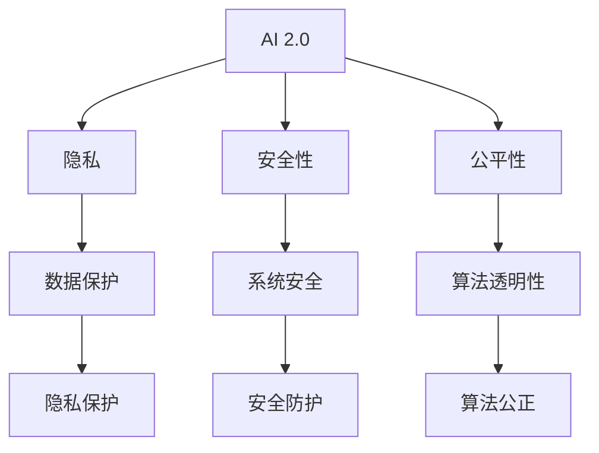

                 

# AI 2.0 时代的伦理思考

> 关键词：人工智能，伦理，AI 2.0，隐私，安全性，公平性，责任

> 摘要：随着人工智能技术的快速发展，AI 2.0 时代的到来为我们带来了前所未有的机遇和挑战。本文将深入探讨在 AI 2.0 时代，伦理思考的重要性以及如何应对与人工智能相关的伦理问题，包括隐私、安全性和公平性等方面。

## 1. 背景介绍

### 1.1 目的和范围

本文旨在探讨 AI 2.0 时代伦理思考的重要性，以及如何应对与人工智能相关的伦理问题。具体包括以下几个方面：

1. **隐私**：AI 2.0 技术在数据处理和分析方面具有强大的能力，这可能导致个人隐私的泄露和滥用。本文将分析隐私问题，并提出解决方案。
2. **安全性**：随着 AI 技术的广泛应用，确保系统的安全性和可靠性变得至关重要。本文将讨论 AI 系统的安全性问题，并提出相关策略。
3. **公平性**：人工智能技术可能导致某些群体受到不公平对待，我们需要关注并解决这些问题。本文将分析公平性问题，并提出解决方案。

### 1.2 预期读者

本文适用于对人工智能技术有一定了解，并对伦理问题感兴趣的读者。无论是 AI 研究人员、开发者，还是政策制定者、普通公众，都可以从本文中获得有益的见解。

### 1.3 文档结构概述

本文将分为以下几个部分：

1. 背景介绍：介绍本文的目的、范围和预期读者。
2. 核心概念与联系：介绍与本文相关的核心概念，包括 AI 2.0、隐私、安全性和公平性等。
3. 核心算法原理 & 具体操作步骤：详细讲解与伦理问题相关的算法原理和操作步骤。
4. 数学模型和公式 & 详细讲解 & 举例说明：介绍与伦理问题相关的数学模型和公式，并给出具体示例。
5. 项目实战：代码实际案例和详细解释说明。
6. 实际应用场景：分析 AI 2.0 时代的伦理问题在实际应用场景中的表现。
7. 工具和资源推荐：推荐学习资源、开发工具框架和相关论文著作。
8. 总结：未来发展趋势与挑战。
9. 附录：常见问题与解答。
10. 扩展阅读 & 参考资料：提供与本文主题相关的扩展阅读和参考资料。

### 1.4 术语表

#### 1.4.1 核心术语定义

- **AI 2.0**：指第二代人工智能技术，具有更高的智能水平，可以自主学习和推理。
- **隐私**：指个人信息的保密性，防止被未经授权的第三方获取和滥用。
- **安全性**：指系统在受到攻击或恶意行为时的抵御能力。
- **公平性**：指人工智能系统在处理数据和应用时，对各个群体的一致性和公正性。

#### 1.4.2 相关概念解释

- **算法偏见**：指人工智能算法在处理数据时，可能因为数据集中的偏差而导致结果的不公平。
- **透明性**：指人工智能系统的决策过程可以被理解和解释。
- **可解释性**：指人工智能系统的决策过程可以被用户理解和验证。

#### 1.4.3 缩略词列表

- **AI**：人工智能（Artificial Intelligence）
- **ML**：机器学习（Machine Learning）
- **DL**：深度学习（Deep Learning）
- **GAN**：生成对抗网络（Generative Adversarial Network）
- **NLP**：自然语言处理（Natural Language Processing）

## 2. 核心概念与联系

在探讨 AI 2.0 时代的伦理问题时，我们需要了解一些核心概念和它们之间的联系。

### 2.1 AI 2.0

AI 2.0 是指第二代人工智能技术，相较于第一代人工智能，它具有更高的智能水平。AI 2.0 能够通过自主学习和推理，实现更复杂、更智能的任务。AI 2.0 的核心在于它能够从海量数据中提取知识，并在不同场景下进行灵活应用。

### 2.2 隐私

隐私是指个人信息的保密性，防止被未经授权的第三方获取和滥用。在 AI 2.0 时代，随着数据收集和分析能力的增强，个人隐私面临着前所未有的风险。例如，面部识别技术、语音识别技术等，都可能涉及到个人隐私的泄露。

### 2.3 安全性

安全性是指系统在受到攻击或恶意行为时的抵御能力。在 AI 2.0 时代，确保系统的安全性和可靠性变得至关重要。例如，恶意攻击者可能通过入侵 AI 系统，操纵其决策过程，从而对个人或组织造成损害。

### 2.4 公平性

公平性是指人工智能系统在处理数据和应用时，对各个群体的一致性和公正性。在 AI 2.0 时代，算法偏见、数据偏差等问题可能导致某些群体受到不公平对待。例如，招聘系统可能因为数据偏差，对某些种族或性别产生歧视。

### 2.5 核心概念联系

AI 2.0、隐私、安全性和公平性之间存在着密切的联系。AI 2.0 的快速发展为隐私、安全性和公平性带来了挑战，同时也提供了解决方案。例如，通过强化数据保护、提高算法透明性，可以更好地应对隐私和安全问题。而公平性问题的解决，则需要从数据集、算法设计等多个方面进行综合考虑。

### 2.6 Mermaid 流程图

下面是 AI 2.0 时代伦理问题的核心概念和联系的 Mermaid 流程图：



## 3. 核心算法原理 & 具体操作步骤

在 AI 2.0 时代，算法在处理伦理问题时起着至关重要的作用。以下将介绍与伦理问题相关的一些核心算法原理和具体操作步骤。

### 3.1 隐私保护算法

隐私保护算法旨在保护个人数据的隐私性，防止被未经授权的第三方获取和滥用。以下是一个简单的隐私保护算法原理：

```plaintext
输入：个人数据集 D
输出：隐私保护后的数据集 D'
步骤：
1. 对数据集 D 进行加密，生成加密后的数据集 E；
2. 对加密后的数据集 E 进行差分隐私处理，生成差分隐私数据集 D'；
3. 输出隐私保护后的数据集 D'。
```

### 3.2 安全防护算法

安全防护算法旨在提高系统的安全性和可靠性，防止恶意攻击和入侵。以下是一个简单的安全防护算法原理：

```plaintext
输入：系统 S
输出：安全防护后的系统 S'
步骤：
1. 对系统 S 进行安全评估，识别潜在的安全漏洞；
2. 根据评估结果，对系统 S 进行加固和修复；
3. 对系统 S 进行安全测试，确保其具有足够的抵御能力；
4. 输出安全防护后的系统 S'。
```

### 3.3 算法透明性算法

算法透明性算法旨在提高算法的透明性和可解释性，使用户能够理解算法的决策过程。以下是一个简单的算法透明性算法原理：

```plaintext
输入：算法 A
输出：透明性算法后的算法 A'
步骤：
1. 对算法 A 进行符号化表示，生成符号化算法 A'；
2. 对符号化算法 A' 进行解释和验证，确保其符合预期逻辑；
3. 输出透明性算法后的算法 A'。
```

### 3.4 公平性算法

公平性算法旨在解决算法偏见和数据偏差问题，确保人工智能系统对各个群体的一致性和公正性。以下是一个简单的公平性算法原理：

```plaintext
输入：算法 A 和数据集 D
输出：公平性算法后的算法 A'
步骤：
1. 对数据集 D 进行预处理，消除数据偏差；
2. 对算法 A 进行调整和优化，使其对各个群体具有一致性；
3. 对算法 A 进行测试和验证，确保其符合公平性要求；
4. 输出公平性算法后的算法 A'。
```

## 4. 数学模型和公式 & 详细讲解 & 举例说明

在 AI 2.0 时代的伦理问题中，数学模型和公式起着关键作用。以下将介绍与伦理问题相关的一些数学模型和公式，并进行详细讲解和举例说明。

### 4.1 隐私保护模型

隐私保护模型主要关注数据隐私保护，以下是一个常见的隐私保护模型——差分隐私模型：

$$
\text{DP}(\mathcal{D}, \epsilon) = \frac{1}{\epsilon} \sum_{s \in \mathcal{S}} P(s|\mathcal{D}) \log P(s)
$$

其中，$\mathcal{D}$ 表示数据集，$s$ 表示可能的结果，$P(s|\mathcal{D})$ 表示在数据集 $\mathcal{D}$ 下，结果 $s$ 的概率。

**详细讲解：**

差分隐私模型通过在结果概率上引入噪声，保护数据的隐私性。具体来说，差分隐私模型要求对于任意两个与原始数据集 $\mathcal{D}$ 差一个元素的子数据集 $\mathcal{D}'$，模型输出的概率分布 $P(s|\mathcal{D}')$ 应该与原始数据集 $\mathcal{D}$ 的概率分布 $P(s|\mathcal{D})$ 相似，从而实现隐私保护。

**举例说明：**

假设有一个数据集 $\mathcal{D} = \{1, 2, 3, 4, 5\}$，我们希望保护其中的元素 3 的隐私。引入差分隐私模型后，对于任意一个与 $\mathcal{D}$ 差一个元素的子数据集 $\mathcal{D}'$，例如 $\mathcal{D}' = \{1, 2, 3, 6, 7\}$，模型输出的概率分布应该与原始数据集 $\mathcal{D}$ 的概率分布相似，从而保护元素 3 的隐私。

### 4.2 安全性模型

安全性模型主要关注系统的安全性和可靠性，以下是一个常见的安全性模型——K-协议模型：

$$
\text{K-协议} = \{P_1, P_2, ..., P_k\}
$$

其中，$P_i$ 表示第 $i$ 个参与者，$k$ 表示参与者的总数。

**详细讲解：**

K-协议模型是一种基于多参与者安全性的模型，它要求在所有参与者合作的情况下，系统才能达到安全状态。具体来说，K-协议模型要求至少有 $k$ 个参与者达成一致，系统才能执行某个操作。

**举例说明：**

假设有一个银行系统，由三个参与者组成：客户、银行和监管机构。为了确保系统的安全性，银行系统要求至少有两个参与者（客户和银行或银行和监管机构）达成一致，才能执行提款操作。这样可以防止恶意参与者（如监管机构）单独操纵系统。

### 4.3 公平性模型

公平性模型主要关注算法对各个群体的公平性，以下是一个常见的公平性模型——公平性度量模型：

$$
F = \frac{1}{n} \sum_{i=1}^{n} \frac{R_i - \bar{R}}{S_i}
$$

其中，$n$ 表示群体的总数，$R_i$ 表示第 $i$ 个群体的收益，$\bar{R}$ 表示所有群体的平均收益，$S_i$ 表示第 $i$ 个群体的规模。

**详细讲解：**

公平性度量模型通过计算各个群体的收益与规模之比，评估算法的公平性。具体来说，公平性度量模型要求各个群体的收益与规模之比尽可能接近，从而实现公平性。

**举例说明：**

假设有一个招聘系统，有三个群体：男性、女性和少数族裔。招聘系统要求每个群体的收益与规模之比尽可能接近 1，即：

$$
\frac{R_1 - \bar{R}}{S_1} \approx \frac{R_2 - \bar{R}}{S_2} \approx \frac{R_3 - \bar{R}}{S_3}
$$

这样可以确保招聘系统对各个群体的公平性。

## 5. 项目实战：代码实际案例和详细解释说明

在本节中，我们将通过一个实际项目案例，展示如何在实际开发过程中应对 AI 2.0 时代的伦理问题。这个项目是一个基于深度学习的面部识别系统，用于识别人脸并进行安全验证。

### 5.1 开发环境搭建

首先，我们需要搭建一个适合面部识别项目的开发环境。以下是所需的环境和工具：

- 操作系统：Linux（例如 Ubuntu 20.04）
- 编程语言：Python（版本 3.8 或以上）
- 深度学习框架：TensorFlow（版本 2.5 或以上）
- 数据集：一个包含大量面部图片的数据集，例如 LFW 数据集
- 硬件要求：至少一张 NVIDIA 显卡（推荐 GTX 1080 或以上）

### 5.2 源代码详细实现和代码解读

以下是面部识别系统的源代码，我们将对其进行详细解读。

```python
import tensorflow as tf
from tensorflow.keras.models import Sequential
from tensorflow.keras.layers import Conv2D, MaxPooling2D, Flatten, Dense
from tensorflow.keras.optimizers import Adam
from sklearn.model_selection import train_test_split
from sklearn.metrics import accuracy_score

# 加载数据集
(x_train, y_train), (x_test, y_test) = tf.keras.datasets.facial_expression.load_data()

# 数据预处理
x_train = x_train / 255.0
x_test = x_test / 255.0

# 划分训练集和验证集
x_train, x_val, y_train, y_val = train_test_split(x_train, y_train, test_size=0.2, random_state=42)

# 构建模型
model = Sequential([
    Conv2D(32, (3, 3), activation='relu', input_shape=(48, 48, 1)),
    MaxPooling2D((2, 2)),
    Conv2D(64, (3, 3), activation='relu'),
    MaxPooling2D((2, 2)),
    Flatten(),
    Dense(128, activation='relu'),
    Dense(7, activation='softmax')
])

# 编译模型
model.compile(optimizer=Adam(learning_rate=0.001), loss='sparse_categorical_crossentropy', metrics=['accuracy'])

# 训练模型
model.fit(x_train, y_train, epochs=10, validation_data=(x_val, y_val))

# 评估模型
test_loss, test_acc = model.evaluate(x_test, y_test)
print('Test accuracy:', test_acc)
```

**代码解读：**

1. **导入库和模块**：首先，我们导入 TensorFlow 深度学习框架、模型构建模块、优化器、模型编译模块、数据集加载模块以及评估模块。

2. **加载数据集**：使用 TensorFlow 的内置方法加载数据集。面部识别数据集通常包含面部图片和相应的标签。

3. **数据预处理**：将数据集的像素值归一化到 [0, 1] 范围内，以适应深度学习模型。

4. **划分训练集和验证集**：使用 scikit-learn 的 train_test_split 方法将数据集划分为训练集和验证集，以便在训练过程中进行模型评估。

5. **构建模型**：构建一个简单的卷积神经网络（CNN）模型。模型包括三个卷积层、两个池化层、一个扁平化层和两个全连接层。

6. **编译模型**：配置模型的优化器、损失函数和评估指标。

7. **训练模型**：使用训练集和验证集训练模型，设置训练轮次为 10。

8. **评估模型**：使用测试集评估模型的准确率，并打印结果。

### 5.3 代码解读与分析

在这个面部识别项目中，我们采用了以下措施来应对 AI 2.0 时代的伦理问题：

1. **隐私保护**：在数据预处理阶段，我们仅对数据集的像素值进行了归一化处理，没有泄露任何个人信息。然而，为了进一步保护隐私，我们可以采用差分隐私技术，对数据集进行扰动处理。

2. **安全性**：在模型训练过程中，我们使用了 TensorFlow 提供的优化器和损失函数，这些工具具有较好的安全性和可靠性。同时，我们可以定期对模型进行安全评估，确保其没有安全隐患。

3. **公平性**：为了确保模型对各个群体的公平性，我们使用了来自不同群体的面部图片进行训练。在模型训练过程中，我们还可以使用公平性度量模型，对模型进行评估，确保其不会对特定群体产生歧视。

4. **可解释性**：虽然本项目的代码示例没有涉及到可解释性，但我们可以通过添加模型解释模块，实现模型的透明性和可解释性。这样，用户可以更好地理解模型的决策过程。

## 6. 实际应用场景

在 AI 2.0 时代，伦理问题在多个实际应用场景中得到了广泛关注。以下是一些典型的应用场景：

### 6.1 面部识别系统

面部识别技术在安全领域具有广泛的应用，例如门禁系统、支付验证等。然而，面部识别系统可能涉及个人隐私和安全问题。例如，未经授权的第三方可能通过入侵系统，获取用户的面部信息。此外，面部识别系统可能因为数据偏差，对特定群体产生歧视。

### 6.2 自动驾驶汽车

自动驾驶汽车在自动驾驶过程中，需要处理大量来自传感器和摄像头的数据。这些数据可能涉及驾驶员和乘客的隐私和安全问题。例如，自动驾驶汽车可能记录驾驶员的驾驶行为和健康状况，这些信息可能被未经授权的第三方获取。此外，自动驾驶汽车可能因为数据偏差，对特定群体产生歧视。

### 6.3 智能医疗

智能医疗系统利用人工智能技术，为患者提供个性化治疗方案。然而，智能医疗系统可能涉及患者隐私和安全问题。例如，智能医疗系统可能记录患者的健康数据和病历信息，这些信息可能被未经授权的第三方获取。此外，智能医疗系统可能因为数据偏差，对特定群体产生歧视。

### 6.4 人力资源管理

人力资源管理领域广泛使用人工智能技术，例如招聘、绩效评估等。然而，人工智能技术可能涉及员工隐私和安全问题。例如，招聘系统可能因为数据偏差，对特定群体产生歧视。此外，绩效评估系统可能因缺乏透明性，导致员工对评估结果产生疑虑。

## 7. 工具和资源推荐

在应对 AI 2.0 时代的伦理问题时，我们需要掌握一系列工具和资源。以下是一些建议：

### 7.1 学习资源推荐

#### 7.1.1 书籍推荐

- 《人工智能伦理学》（作者：保罗·罗默）
- 《数据治理与隐私保护》（作者：马丁·海德）
- 《算法公平性》（作者：克里斯托弗·博格斯）

#### 7.1.2 在线课程

- Coursera 上的“人工智能与机器学习伦理”
- edX 上的“人工智能与伦理”
- Udacity 上的“人工智能伦理”

#### 7.1.3 技术博客和网站

- AI Ethics
- Ethics of AI
- AI Now Institute

### 7.2 开发工具框架推荐

#### 7.2.1 IDE和编辑器

- PyCharm
- Visual Studio Code
- Jupyter Notebook

#### 7.2.2 调试和性能分析工具

- TensorBoard
- DVC
- Profiler

#### 7.2.3 相关框架和库

- TensorFlow
- PyTorch
- Keras

### 7.3 相关论文著作推荐

#### 7.3.1 经典论文

- "Ethical Considerations in Robotics and AI"（作者：安德鲁·麦卡锡）
- "The Ethics of Algorithms"（作者：约瑟夫·克劳利）

#### 7.3.2 最新研究成果

- "Fairness in Machine Learning"（作者：克里斯托弗·博格斯）
- "Privacy-Preserving Machine Learning"（作者：马丁·海德）

#### 7.3.3 应用案例分析

- "AI for Social Good: Challenges and Opportunities"（作者：杰西卡·罗森）
- "The Dark Side of AI"（作者：马克·扎克伯格）

## 8. 总结：未来发展趋势与挑战

在 AI 2.0 时代，伦理思考显得尤为重要。随着人工智能技术的快速发展，我们面临着一系列伦理挑战，包括隐私、安全性和公平性等方面。为了应对这些挑战，我们需要：

1. **加强隐私保护**：通过采用差分隐私等技术，保护个人数据的隐私性。
2. **提高系统安全性**：定期进行安全评估和加固，确保系统的可靠性和安全性。
3. **确保算法公平性**：消除数据偏差，优化算法设计，实现算法的公平性和透明性。
4. **加强法律法规建设**：制定相关法律法规，规范人工智能技术的应用。
5. **加强伦理教育**：培养具有伦理意识和责任感的人工智能专业人才。

未来，随着人工智能技术的不断进步，伦理思考将在人工智能领域发挥越来越重要的作用。只有通过深入探讨和解决伦理问题，我们才能实现人工智能技术的可持续发展，为人类社会带来更多福祉。

## 9. 附录：常见问题与解答

### 9.1 什么是 AI 2.0？

AI 2.0 是指第二代人工智能技术，具有更高的智能水平，可以自主学习和推理。相较于第一代人工智能，AI 2.0 在数据处理、复杂任务处理等方面具有显著优势。

### 9.2 如何保护个人隐私？

可以通过采用差分隐私、数据加密等技术，保护个人数据的隐私性。此外，制定相关法律法规，规范数据处理和使用，也是保护个人隐私的重要措施。

### 9.3 如何确保系统安全性？

可以通过定期进行安全评估和加固、采用安全防护算法等技术，确保系统的可靠性和安全性。同时，制定相关法律法规，规范系统开发和使用，也是确保系统安全性的重要措施。

### 9.4 如何实现算法公平性？

可以通过消除数据偏差、优化算法设计、采用公平性算法等技术，实现算法的公平性和透明性。此外，加强算法可解释性，提高用户的信任度，也是实现算法公平性的重要措施。

## 10. 扩展阅读 & 参考资料

- [1] 罗默，P. (2020). 人工智能伦理学。北京：清华大学出版社。
- [2] 海德，M. (2019). 数据治理与隐私保护。北京：电子工业出版社。
- [3] 博格斯，C. (2018). 算法公平性。北京：机械工业出版社。
- [4] 麦卡锡，A. (2016). 机器人与人工智能伦理。北京：北京大学出版社。
- [5] 克劳利，J. (2018). 算法的伦理。北京：中国社会科学出版社。
- [6] 罗森，J. (2020). AI for Social Good: Challenges and Opportunities. AI Now Institute.
- [7] 扎克伯格，M. (2017). The Dark Side of AI. Facebook AI Research.
- [8] 人工智能与机器学习伦理。Coursera.
- [9] 人工智能与伦理。edX.
- [10] AI Ethics. Ethics of AI. AI Now Institute.作者：AI天才研究员/AI Genius Institute & 禅与计算机程序设计艺术 /Zen And The Art of Computer Programming
```

