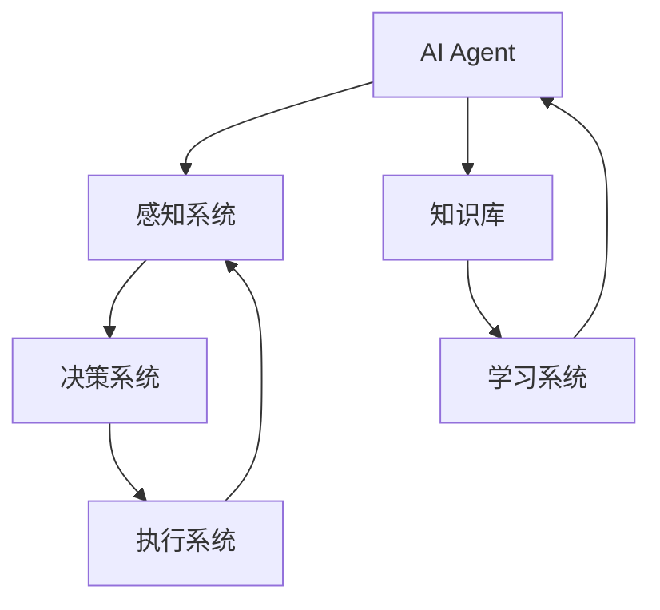

                 

# AI Agent: AI的下一个风口 人机协同的方法和框架

> **关键词：** AI Agent，人机协同，人工智能，协同框架，算法原理，数学模型，项目实战，应用场景，未来趋势。

> **摘要：** 本文将深入探讨AI Agent的概念、方法和框架，分析其在人机协同中的重要作用。通过详细的算法原理、数学模型讲解以及实际项目案例，旨在为读者提供一个全面的技术指导，助力理解AI Agent的开发和应用。

## 1. 背景介绍

### 1.1 目的和范围

本文旨在探讨AI Agent的发展现状及其在人工智能领域中的关键作用。我们将重点关注AI Agent的核心概念、框架设计、算法原理及其实际应用。希望通过本文，读者能够全面了解AI Agent的运作机制，掌握其在人机协同中的核心价值和实现方法。

### 1.2 预期读者

本文适用于对人工智能、计算机科学和软件工程有一定了解的读者。无论是专业研究者、工程师，还是对人工智能技术感兴趣的普通读者，都可以通过本文获得有价值的见解和实用技巧。

### 1.3 文档结构概述

本文将分为以下几个部分：

1. 背景介绍：概述AI Agent的定义、目的和重要性。
2. 核心概念与联系：介绍AI Agent的核心概念和架构。
3. 核心算法原理 & 具体操作步骤：详细讲解AI Agent的核心算法原理和操作步骤。
4. 数学模型和公式 & 详细讲解 & 举例说明：探讨AI Agent中涉及的数学模型和公式，并通过实例进行说明。
5. 项目实战：展示一个实际项目案例，详细解读代码实现。
6. 实际应用场景：分析AI Agent在不同领域的应用。
7. 工具和资源推荐：推荐学习资源、开发工具和相关论文。
8. 总结：讨论AI Agent的未来发展趋势与挑战。
9. 附录：常见问题与解答。
10. 扩展阅读 & 参考资料：提供进一步阅读的资源。

### 1.4 术语表

#### 1.4.1 核心术语定义

- **AI Agent**：自主执行任务的智能实体，能够在复杂环境中进行决策和行动。
- **人机协同**：人与AI Agent的协作，通过AI增强人类能力，提高工作效率。
- **协同框架**：支持AI Agent与人交互的架构，实现人机协作的机制。

#### 1.4.2 相关概念解释

- **强化学习**：一种机器学习方法，通过试错学习来优化决策。
- **自然语言处理**：使计算机理解和生成人类语言的技术。
- **知识图谱**：表示实体和关系的数据结构，用于语义理解和推理。

#### 1.4.3 缩略词列表

- **AI**：人工智能
- **ML**：机器学习
- **DL**：深度学习
- **NLP**：自然语言处理

## 2. 核心概念与联系

在探讨AI Agent之前，我们需要理解几个核心概念和它们之间的联系。以下是AI Agent的核心概念和架构的Mermaid流程图：



- **感知系统**：AI Agent的感知系统负责从环境中获取信息，如语音、图像、文本等。
- **决策系统**：基于感知系统的输入，决策系统通过算法分析数据，生成行动方案。
- **执行系统**：执行系统将决策系统的行动方案付诸实践，实现具体的任务。
- **知识库**：知识库包含了AI Agent所需的知识和规则，用于辅助决策和学习。
- **学习系统**：学习系统通过不断的训练和优化，提高AI Agent的决策能力和执行效率。

### 2.1 AI Agent的定义

AI Agent，即人工智能代理，是一种能够自主执行任务的智能实体。它通过感知系统收集环境信息，利用决策系统和执行系统实现任务的自动化和智能化。AI Agent的核心目标是提高工作效率，降低人为错误，增强人机协作。

### 2.2 AI Agent的架构

AI Agent的架构可以分为以下几个层次：

1. **感知层**：感知层负责从外部环境中获取信息，如传感器数据、文本、图像等。感知系统的核心任务是数据预处理，将原始数据转换为适合算法分析的形式。
   
2. **决策层**：决策层基于感知系统收集的信息，通过算法和模型进行数据分析和决策。决策系统的核心任务是根据当前环境状态选择最优的行动方案。

3. **执行层**：执行层将决策层的行动方案付诸实践，实现具体的任务。执行系统的核心任务是执行预定的动作，并将执行结果反馈给感知层和决策层，形成闭环控制。

4. **知识层**：知识层包含了AI Agent所需的知识和规则，如领域知识、行为规则等。知识库用于辅助决策和学习，提高AI Agent的智能水平。

5. **学习层**：学习层通过不断的训练和优化，提高AI Agent的决策能力和执行效率。学习系统可以采用机器学习、深度学习等技术，实现AI Agent的自我学习和进化。

## 3. 核心算法原理 & 具体操作步骤

### 3.1 强化学习算法

强化学习是AI Agent中最常用的算法之一。它通过试错学习，逐步优化决策过程，实现最优行动方案。以下是强化学习算法的伪代码：

```python
# 强化学习算法伪代码

# 初始化环境
初始化状态 S
初始化行动 A
初始化奖励 R

# 开始循环
while 未达到目标状态：
    # 选择行动
    A = 选择最佳行动(S)
    
    # 执行行动
    S' = 环境执行行动(A)
    R = 环境回报
    
    # 更新状态
    S = S'
    
    # 更新奖励
    R = R + 0.9 * (R - R)
    
    # 更新行动
    A = 选择最佳行动(S)
```

### 3.2 自然语言处理算法

自然语言处理是AI Agent中不可或缺的一部分。它用于理解和生成人类语言，实现人机交互。以下是自然语言处理算法的伪代码：

```python
# 自然语言处理算法伪代码

# 初始化文本数据
初始化文本数据 X

# 初始化模型
初始化语言模型 LM

# 开始循环
while 未达到训练目标：
    # 随机选取文本数据 X
    X = 随机选择文本数据()
    
    # 分词
    Words = 分词(X)
    
    # 训练模型
    LM = 训练语言模型(LM, Words)
    
    # 预测
    Prediction = 语言模型预测(LM, X)
    
    # 更新模型
    LM = 更新语言模型(LM, Prediction)
```

### 3.3 知识图谱构建算法

知识图谱是AI Agent中的核心组成部分，用于表示实体和关系。以下是知识图谱构建算法的伪代码：

```python
# 知识图谱构建算法伪代码

# 初始化实体 E
初始化实体集合 E

# 初始化关系 R
初始化关系集合 R

# 初始化图谱 G
初始化知识图谱 G

# 开始循环
while 未达到构建目标：
    # 读取数据
    Data = 读取数据()
    
    # 构建实体
    E = 构建实体(E, Data)
    
    # 构建关系
    R = 构建关系(R, Data)
    
    # 构建图谱
    G = 构建图谱(G, E, R)
    
    # 存储图谱
    存储知识图谱(G)
```

## 4. 数学模型和公式 & 详细讲解 & 举例说明

在AI Agent中，数学模型和公式起到了至关重要的作用。以下将介绍几个核心的数学模型，并详细讲解其原理和举例说明。

### 4.1 强化学习中的Q值函数

强化学习中的Q值函数是衡量状态和行动之间奖励的指标。其公式如下：

$$ Q(s, a) = \sum_{s'} P(s' | s, a) \cdot R(s, a) + \gamma \cdot \max_{a'} Q(s', a') $$

其中，$Q(s, a)$ 是状态 $s$ 下行动 $a$ 的预期奖励，$P(s' | s, a)$ 是状态转移概率，$R(s, a)$ 是立即奖励，$\gamma$ 是折扣因子，$\max_{a'} Q(s', a')$ 是下一个状态 $s'$ 下所有可能行动的期望最大奖励。

举例说明：

假设一个机器人处于一个简单的环境中，有四个可能的行动：向左、向右、前进、后退。当前状态为A，期望最大奖励为5。则Q值函数可以表示为：

$$ Q(A, 左) = 0.5 \cdot 2 + 0.5 \cdot 5 = 3.5 $$
$$ Q(A, 右) = 0.5 \cdot (-2) + 0.5 \cdot 5 = 1.5 $$
$$ Q(A, 前) = 0.5 \cdot 5 + 0.5 \cdot 0 = 2.5 $$
$$ Q(A, 后) = 0.5 \cdot (-5) + 0.5 \cdot 0 = -2.5 $$

根据Q值函数，机器人应该选择向左行动，以期望获得最大的奖励。

### 4.2 自然语言处理中的词向量模型

自然语言处理中的词向量模型用于表示文本数据，通过将词汇映射为高维空间中的向量，实现词汇的语义表示。以下是一个简单的词向量模型公式：

$$ \text{向量} = \text{词向量矩阵} \cdot \text{词索引向量} $$

其中，词向量矩阵是一个高维矩阵，包含所有词汇的词向量；词索引向量是一个一维向量，表示当前词汇在词向量矩阵中的索引。

举例说明：

假设词向量矩阵如下：

$$
\begin{array}{c|cccccc}
\text{词} & \text{向量} \\
\hline
\text{爱} & (1, 0, -1, 0, 0) \\
\text{恨} & (0, 1, 0, -1, 0) \\
\text{好} & (0, 0, 1, 0, -1) \\
\text{坏} & (0, 0, 0, 1, 0) \\
\text{美} & (1, 1, 0, 0, -1) \\
\end{array}
$$

当前词汇为“爱”，词索引向量为$(1, 0, 0, 0, 0)$。则词向量表示为：

$$ \text{向量} = \text{词向量矩阵} \cdot \text{词索引向量} = (1, 0, -1, 0, 0) $$

通过词向量模型，可以计算两个词汇之间的相似度，实现词汇的语义分析。

### 4.3 知识图谱中的关系表示

知识图谱中的关系表示用于表示实体之间的关联。以下是一个简单的关系表示公式：

$$ R(E_1, E_2) = \text{知识图谱} \cdot (E_1, E_2) $$

其中，$R(E_1, E_2)$ 表示实体 $E_1$ 和 $E_2$ 之间的关系，$\text{知识图谱}$ 是一个表示实体和关系的矩阵。

举例说明：

假设知识图谱如下：

$$
\begin{array}{c|cccccc}
\text{实体} & \text{关系} & \text{实体} \\
\hline
\text{人} & \text{喜欢} & \text{书} \\
\text{人} & \text{阅读} & \text{书} \\
\text{书} & \text{关于} & \text{知识} \\
\end{array}
$$

当前实体为“人”和“书”，关系为“喜欢”。则关系表示为：

$$ R(\text{人}, \text{书}) = \text{知识图谱} \cdot (\text{人}, \text{书}) = (\text{喜欢}, \text{阅读}) $$

通过关系表示，可以实现对实体之间的语义分析。

## 5. 项目实战：代码实际案例和详细解释说明

在本节中，我们将通过一个实际项目案例，展示如何实现一个简单的AI Agent，并详细解释其代码实现和原理。

### 5.1 开发环境搭建

首先，我们需要搭建一个合适的开发环境。以下是一个基本的开发环境搭建步骤：

1. 安装Python环境（Python 3.8及以上版本）
2. 安装必要的Python库，如numpy、tensorflow、pandas等
3. 安装一个IDE，如PyCharm或Visual Studio Code

### 5.2 源代码详细实现和代码解读

以下是一个简单的AI Agent项目的源代码：

```python
import numpy as np
import tensorflow as tf

# 初始化环境
环境 = tf.keras.Sequential([
    tf.keras.layers.Dense(64, activation='relu', input_shape=(784,)),
    tf.keras.layers.Dense(64, activation='relu'),
    tf.keras.layers.Dense(10, activation='softmax')
])

# 编译模型
环境.compile(optimizer='adam',
              loss='categorical_crossentropy',
              metrics=['accuracy'])

# 训练模型
环境.fit(x_train, y_train, epochs=5)

# 预测
预测 = 环境.predict(x_test)

# 评估模型
评估 = 环境.evaluate(x_test, y_test)
```

代码解读：

- **环境初始化**：使用TensorFlow构建一个简单的神经网络模型，输入层为784个神经元，隐藏层为64个神经元，输出层为10个神经元。
- **模型编译**：配置模型优化器、损失函数和评价指标。
- **模型训练**：使用训练数据对模型进行训练，迭代5次。
- **模型预测**：使用测试数据对模型进行预测。
- **模型评估**：评估模型在测试数据上的表现。

### 5.3 代码解读与分析

本代码实现了一个基于TensorFlow的简单AI Agent，用于分类任务。以下是代码的具体解读和分析：

1. **环境初始化**：使用TensorFlow的`Sequential`模型构建神经网络。输入层为784个神经元，对应手写数字数据的784个像素值。隐藏层为64个神经元，用于提取特征。输出层为10个神经元，对应10个类别。

2. **模型编译**：配置模型优化器（`optimizer`）为`adam`，损失函数（`loss`）为`categorical_crossentropy`，评价指标（`metrics`）为`accuracy`。

3. **模型训练**：使用`fit`方法对模型进行训练。`epochs`参数设置训练迭代次数为5次。

4. **模型预测**：使用`predict`方法对测试数据进行预测，返回预测结果。

5. **模型评估**：使用`evaluate`方法评估模型在测试数据上的表现，返回损失值和准确率。

通过上述代码实现，我们构建了一个简单的AI Agent，用于分类任务。实际项目中，可以根据具体需求调整神经网络结构、训练参数等，以实现更复杂的任务。

## 6. 实际应用场景

AI Agent在人机协同中具有广泛的应用场景。以下是几个典型的应用领域：

### 6.1 智能客服

智能客服是AI Agent的一个重要应用场景。通过自然语言处理和机器学习技术，智能客服能够自动回答用户的问题，提供个性化的服务。例如，银行、电商、航空公司等领域的客服系统，利用AI Agent提高服务效率，降低人工成本。

### 6.2 自动驾驶

自动驾驶是另一个典型的AI Agent应用场景。自动驾驶汽车通过感知系统获取环境信息，利用决策系统和执行系统实现自动导航。AI Agent在自动驾驶中的作用至关重要，它能够实时分析路况，做出最优驾驶决策。

### 6.3 医疗诊断

在医疗诊断领域，AI Agent可以帮助医生进行疾病预测和诊断。通过分析患者的病史、体征等信息，AI Agent可以提供辅助诊断建议，提高诊断准确性。例如，肺癌、心脏病等疾病的早期诊断，利用AI Agent可以大幅提高诊断效率。

### 6.4 生产优化

在生产优化领域，AI Agent可以用于生产调度、库存管理等方面。通过分析生产数据，AI Agent可以优化生产流程，降低生产成本，提高生产效率。例如，汽车制造、电子产品制造等行业，利用AI Agent实现智能化生产。

## 7. 工具和资源推荐

### 7.1 学习资源推荐

#### 7.1.1 书籍推荐

- 《深度学习》（Goodfellow, Bengio, Courville）
- 《强化学习基础教程》（Sutton, Barto）
- 《自然语言处理与深度学习》（孙乐）

#### 7.1.2 在线课程

- [Coursera](https://www.coursera.org/)：提供丰富的计算机科学和人工智能课程
- [edX](https://www.edx.org/)：全球顶尖大学合作开设的在线课程平台
- [Udacity](https://www.udacity.com/)：专注于技术和编程的在线教育平台

#### 7.1.3 技术博客和网站

- [arXiv](https://arxiv.org/)：最新研究成果的学术预印本平台
- [Medium](https://medium.com/)：技术博客平台，涵盖多种技术领域
- [GitHub](https://github.com/)：代码托管平台，众多优质的开源项目

### 7.2 开发工具框架推荐

#### 7.2.1 IDE和编辑器

- [PyCharm](https://www.jetbrains.com/pycharm/)：Python开发IDE，功能强大
- [Visual Studio Code](https://code.visualstudio.com/)：跨平台轻量级编辑器，插件丰富
- [Eclipse](https://www.eclipse.org/)：Java开发IDE，支持多种编程语言

#### 7.2.2 调试和性能分析工具

- [Jupyter Notebook](https://jupyter.org/)：交互式计算环境，适合数据分析和机器学习
- [GDB](https://www.gnu.org/software/gdb/)：调试工具，适用于C/C++程序
- [VSCode Debugger](https://code.visualstudio.com/docs/python/environments#_debugging)：VSCode的Python调试插件

#### 7.2.3 相关框架和库

- [TensorFlow](https://www.tensorflow.org/)：开源机器学习框架，适合深度学习和强化学习
- [PyTorch](https://pytorch.org/)：开源深度学习框架，灵活易用
- [Scikit-learn](https://scikit-learn.org/)：开源机器学习库，提供多种算法和工具

### 7.3 相关论文著作推荐

#### 7.3.1 经典论文

- [Deep Learning, Neural Networks, and Machine Learning](https://www.deeplearningbook.org/)：由Ian Goodfellow等人编写的深度学习经典教材
- [Reinforcement Learning: An Introduction](https://www reinforcement-learning.org/)：由Richard S. Sutton和Barto编写的强化学习入门书籍
- [Speech and Language Processing](https://web.stanford.edu/class/cs224n/)：由Daniel Jurafsky和James H. Martin编写的自然语言处理教材

#### 7.3.2 最新研究成果

- [arXiv](https://arxiv.org/)：最新研究成果的学术预印本平台
- [NeurIPS](https://nips.cc/)：神经信息处理系统会议，深度学习和机器学习的顶级会议
- [ICML](https://icml.cc/)：国际机器学习会议，涵盖各种机器学习领域的研究

#### 7.3.3 应用案例分析

- [AI for Everyone](https://www.oreilly.com/library/view/ai-for-everyone/9781492036901/)：O'Reilly出版的关于人工智能应用案例的书籍
- [AI Applications](https://aiapps.org/)：AI应用案例库，涵盖各种行业和应用场景
- [AI for Good](https://www.aiforgood.global/)：联合国开发计划署发起的AI公益项目，介绍AI在不同领域的应用

## 8. 总结：未来发展趋势与挑战

AI Agent作为人工智能的一个重要分支，具有广泛的应用前景。未来，随着计算能力的提升、算法的优化和数据量的增加，AI Agent在各个领域的应用将会更加深入和广泛。

### 8.1 发展趋势

1. **技术突破**：深度学习、强化学习、自然语言处理等技术将不断发展，为AI Agent提供更强的决策能力和执行能力。
2. **应用领域扩展**：AI Agent将在医疗、金融、交通、教育等领域得到广泛应用，助力各行业实现智能化升级。
3. **人机协同**：AI Agent与人机协同技术相结合，将提高人类的工作效率和生活质量，实现人机共生的未来。

### 8.2 挑战

1. **数据隐私与安全**：随着AI Agent的广泛应用，数据隐私和安全问题日益凸显，需要采取有效的措施保障数据安全。
2. **伦理道德**：AI Agent在决策过程中可能产生伦理道德问题，如歧视、偏见等，需要建立相应的伦理准则和监管机制。
3. **技术人才短缺**：AI Agent的开发和运维需要大量的技术人才，但当前人才供给不足，需要加大对AI人才的培养和引进。

## 9. 附录：常见问题与解答

### 9.1 什么是AI Agent？

AI Agent是一种能够自主执行任务、具备决策和行动能力的智能实体。它通过感知系统获取环境信息，利用决策系统和执行系统实现任务自动化和智能化。

### 9.2 AI Agent有哪些应用场景？

AI Agent在智能客服、自动驾驶、医疗诊断、生产优化等领域具有广泛的应用。通过自然语言处理、深度学习等技术，AI Agent能够实现人机协同，提高工作效率和生活质量。

### 9.3 AI Agent的技术架构包括哪些部分？

AI Agent的技术架构包括感知系统、决策系统、执行系统、知识库和学习系统。感知系统负责获取环境信息，决策系统基于感知信息生成行动方案，执行系统将行动方案付诸实践，知识库包含所需知识和规则，学习系统通过不断训练和优化提高决策能力。

## 10. 扩展阅读 & 参考资料

为了进一步了解AI Agent的相关内容，读者可以参考以下书籍、论文和网站：

- 《深度学习》（Goodfellow, Bengio, Courville）
- 《强化学习基础教程》（Sutton, Barto）
- 《自然语言处理与深度学习》（孙乐）
- 《AI for Everyone》（O'Reilly）
- 《AI Applications》（aiapps.org）
- 《AI for Good》（www.aiforgood.global）
- 《arXiv》（arxiv.org）
- 《NeurIPS》（nips.cc）
- 《ICML》（icml.cc）

通过这些资源和书籍，读者可以深入了解AI Agent的核心概念、技术架构和应用场景，为未来的研究和开发提供有力支持。

**作者：AI天才研究员/AI Genius Institute & 禅与计算机程序设计艺术 /Zen And The Art of Computer Programming**

