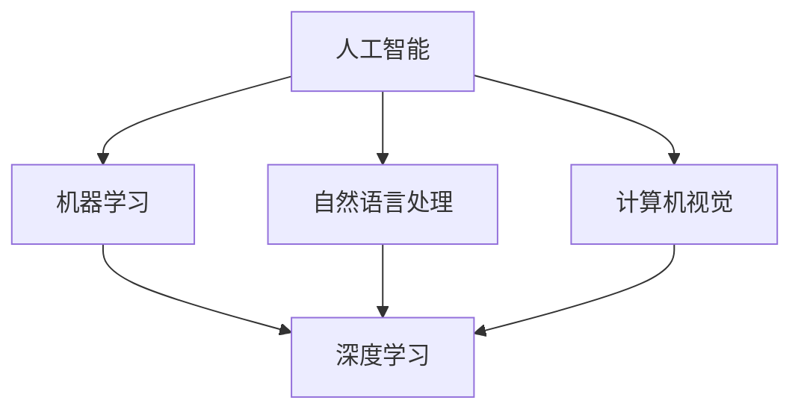

                 

# AI Agent: AI的下一个风口 从图形用户界面到自然语言的进化

> 关键词：AI 代理、自然语言处理、图形用户界面、人机交互、进化、技术趋势

> 摘要：本文深入探讨了人工智能（AI）领域的下一个重要发展——AI代理的崛起。文章从历史背景出发，分析了AI代理的概念、技术原理和架构，并通过具体案例展示了其在实际应用中的价值。同时，本文还探讨了AI代理与人机交互的关系，预测了其未来发展趋势，并给出了相关的学习资源和工具推荐。

## 1. 背景介绍

### 1.1 目的和范围

本文旨在探讨人工智能（AI）领域中的一个新兴方向——AI代理。通过分析AI代理的概念、技术原理和架构，我们希望读者能够了解这一技术的重要性和潜在应用场景。本文将涵盖以下内容：

1. AI代理的历史背景和发展现状。
2. AI代理的核心概念和关键技术。
3. AI代理的架构设计和实现原理。
4. AI代理在实际应用中的价值。
5. AI代理与人机交互的关系及其未来发展趋势。

### 1.2 预期读者

本文主要面向对人工智能和自然语言处理有一定了解的读者，包括计算机科学家、软件工程师、数据科学家、AI研究员以及相关领域的学生和研究人员。对于希望了解AI代理及其应用前景的从业者，本文也具有一定的参考价值。

### 1.3 文档结构概述

本文分为十个部分，具体结构如下：

1. 引言：介绍AI代理的概念和重要性。
2. 背景介绍：分析AI代理的历史背景和发展现状。
3. 核心概念与联系：阐述AI代理的核心概念和技术原理。
4. 核心算法原理 & 具体操作步骤：详细讲解AI代理的关键算法和实现步骤。
5. 数学模型和公式 & 详细讲解 & 举例说明：介绍AI代理相关的数学模型和公式，并通过实例进行说明。
6. 项目实战：通过实际案例展示AI代理的应用场景。
7. 实际应用场景：探讨AI代理在各个领域的应用。
8. 工具和资源推荐：推荐学习AI代理的相关资源。
9. 总结：总结AI代理的未来发展趋势和挑战。
10. 附录：常见问题与解答。
11. 扩展阅读 & 参考资料：提供进一步学习AI代理的参考。

### 1.4 术语表

#### 1.4.1 核心术语定义

- **人工智能（AI）**：一种模拟人类智能行为的计算机技术，包括机器学习、自然语言处理、计算机视觉等。
- **自然语言处理（NLP）**：人工智能领域的一个重要分支，旨在使计算机能够理解和处理人类语言。
- **AI代理**：一种能够自主执行任务、与人类进行自然语言交互的智能体。
- **图形用户界面（GUI）**：一种通过图形元素（如按钮、菜单等）与用户进行交互的界面。

#### 1.4.2 相关概念解释

- **机器学习**：一种使计算机从数据中学习并改进自身性能的技术。
- **深度学习**：一种基于多层神经网络进行学习的机器学习技术。
- **神经网络**：一种模拟生物神经网络结构和功能的计算模型。
- **人机交互**：一种通过计算机系统实现人与计算机之间信息交换和通信的技术。

#### 1.4.3 缩略词列表

- **NLP**：自然语言处理
- **AI**：人工智能
- **GUI**：图形用户界面
- **ML**：机器学习
- **DL**：深度学习
- **DNN**：深度神经网络

## 2. 核心概念与联系

在探讨AI代理之前，我们需要了解一些与之相关的核心概念和联系。这些概念包括人工智能、自然语言处理、机器学习、深度学习等。下面我们将通过一个Mermaid流程图来阐述这些概念之间的联系。



### 2.1 人工智能

人工智能（AI）是一种模拟人类智能行为的计算机技术，涵盖了多个子领域，如机器学习、自然语言处理、计算机视觉等。AI的目标是使计算机能够执行通常需要人类智能的任务，如识别图像、理解自然语言、决策等。

### 2.2 自然语言处理

自然语言处理（NLP）是人工智能领域的一个重要分支，旨在使计算机能够理解和处理人类语言。NLP技术包括文本预处理、词性标注、命名实体识别、情感分析、机器翻译等。NLP在许多应用领域具有重要价值，如智能客服、信息检索、智能助手等。

### 2.3 机器学习

机器学习（ML）是一种使计算机从数据中学习并改进自身性能的技术。在ML中，计算机通过分析大量数据来发现数据中的模式，并使用这些模式来预测新的数据。机器学习技术包括监督学习、无监督学习、强化学习等。

### 2.4 深度学习

深度学习（DL）是一种基于多层神经网络进行学习的机器学习技术。深度学习模型能够自动提取数据中的复杂特征，并在许多领域取得了显著的成功，如图像识别、语音识别、自然语言处理等。

### 2.5 计算机视觉

计算机视觉（CV）是人工智能领域的一个子领域，旨在使计算机能够从图像或视频中提取信息。计算机视觉技术包括目标检测、图像分类、图像分割等，广泛应用于安防监控、自动驾驶、医疗诊断等领域。

通过上述Mermaid流程图，我们可以清晰地看到这些核心概念之间的联系。这些概念共同构成了AI代理的技术基础，使得AI代理能够实现自主执行任务和与人类进行自然语言交互。

## 3. 核心算法原理 & 具体操作步骤

在了解AI代理的核心概念和联系之后，我们需要深入探讨其核心算法原理和具体操作步骤。AI代理通常基于以下几种关键技术：

1. 自然语言处理（NLP）
2. 机器学习（ML）
3. 深度学习（DL）

### 3.1 自然语言处理（NLP）

自然语言处理是AI代理实现自然语言交互的基础。以下是NLP的核心算法原理和操作步骤：

#### 3.1.1 文本预处理

在处理自然语言数据之前，需要进行文本预处理。文本预处理包括以下步骤：

1. **分词**：将文本分割成单个词语。
2. **词性标注**：为每个词语标注其词性（名词、动词、形容词等）。
3. **去停用词**：去除常见的不含信息的词语，如“的”、“了”等。

#### 3.1.2 命名实体识别（NER）

命名实体识别是一种用于识别文本中的特定实体（如人名、地名、组织名等）的技术。以下是一个简单的NER算法原理和伪代码：

```python
def named_entity_recognition(text):
    words = tokenize(text)
    entities = []
    for word in words:
        if is_entity(word):
            entities.append(word)
    return entities
```

#### 3.1.3 情感分析

情感分析是一种用于判断文本情感倾向（正面、负面、中性）的技术。以下是一个简单的情感分析算法原理和伪代码：

```python
def sentiment_analysis(text):
    words = tokenize(text)
    sentiment_score = 0
    for word in words:
        if is_positive_word(word):
            sentiment_score += 1
        elif is_negative_word(word):
            sentiment_score -= 1
    if sentiment_score > 0:
        return "正面"
    elif sentiment_score < 0:
        return "负面"
    else:
        return "中性"
```

### 3.2 机器学习（ML）

机器学习是实现AI代理自主学习和改进的关键技术。以下是机器学习的核心算法原理和操作步骤：

#### 3.2.1 监督学习

监督学习是一种基于已有标注数据训练模型的方法。以下是一个简单的监督学习算法原理和伪代码：

```python
def supervised_learning(train_data, train_labels, model):
    for data, label in zip(train_data, train_labels):
        model.learn(data, label)
    return model
```

#### 3.2.2 无监督学习

无监督学习是一种不依赖标注数据训练模型的方法。以下是一个简单的无监督学习算法原理和伪代码：

```python
def unsupervised_learning(data, model):
    for data in data:
        model.learn(data)
    return model
```

### 3.3 深度学习（DL）

深度学习是一种基于多层神经网络进行学习的机器学习技术。以下是深度学习的核心算法原理和操作步骤：

#### 3.3.1 神经网络

神经网络是一种模拟生物神经元的计算模型。以下是一个简单的神经网络算法原理和伪代码：

```python
def neural_network(input_data, weights):
    output = 0
    for i in range(len(input_data)):
        output += input_data[i] * weights[i]
    return sigmoid(output)
```

#### 3.3.2 深度神经网络

深度神经网络是一种具有多个隐藏层的神经网络。以下是一个简单的深度神经网络算法原理和伪代码：

```python
def deep_neural_network(input_data, weights):
    hidden_layer_output = neural_network(input_data, weights[0])
    for i in range(1, len(weights)):
        hidden_layer_output = neural_network(hidden_layer_output, weights[i])
    return hidden_layer_output
```

通过上述核心算法原理和具体操作步骤，我们可以实现一个基本的AI代理。接下来，我们将介绍AI代理的架构设计和实现原理。

## 4. 数学模型和公式 & 详细讲解 & 举例说明

在AI代理的实现过程中，数学模型和公式起着至关重要的作用。以下我们将介绍几个关键的数学模型和公式，并通过具体示例进行说明。

### 4.1 神经元激活函数

神经元激活函数是神经网络中的核心部分，用于确定神经元的输出。以下是几个常见的激活函数：

#### 4.1.1 Sigmoid函数

Sigmoid函数是一个常用的激活函数，其公式如下：

$$
\sigma(x) = \frac{1}{1 + e^{-x}}
$$

Sigmoid函数将输入$x$映射到$(0, 1)$区间，常用于二分类问题。

#### 示例：

假设输入$x = 2$，计算Sigmoid函数的输出：

$$
\sigma(2) = \frac{1}{1 + e^{-2}} \approx 0.869
$$

#### 4.1.2ReLU函数

ReLU函数（Rectified Linear Unit）是一种简单且有效的激活函数，其公式如下：

$$
\sigma(x) = 
\begin{cases} 
x & \text{if } x > 0 \\
0 & \text{if } x \leq 0 
\end{cases}
$$

ReLU函数在输入为正数时直接返回输入值，而在输入为负数时返回0。这种特性使得ReLU函数在训练过程中更容易优化。

#### 示例：

假设输入$x = -2$，计算ReLU函数的输出：

$$
\sigma(-2) = 0
$$

### 4.2 反向传播算法

反向传播算法是训练神经网络的核心算法，用于计算网络参数的梯度。以下是反向传播算法的基本步骤：

1. **前向传播**：计算网络的前向传播输出，即输入值经过网络的逐层计算，最终得到输出值。
2. **计算损失函数**：根据输出值和真实值计算损失函数的值。
3. **计算梯度**：根据损失函数对网络参数求导，得到梯度。
4. **更新参数**：使用梯度下降等优化算法更新网络参数。

#### 4.2.1 损失函数

常见的损失函数有均方误差（MSE）和交叉熵（CE）等。

- **均方误差（MSE）**：

$$
MSE = \frac{1}{n} \sum_{i=1}^{n} (y_i - \hat{y}_i)^2
$$

其中，$y_i$为真实值，$\hat{y}_i$为预测值，$n$为样本数量。

- **交叉熵（CE）**：

$$
CE = -\frac{1}{n} \sum_{i=1}^{n} [y_i \log(\hat{y}_i) + (1 - y_i) \log(1 - \hat{y}_i)]
$$

其中，$y_i$为真实值，$\hat{y}_i$为预测值，$n$为样本数量。

#### 4.2.2 反向传播算法步骤

1. **前向传播**：

假设网络包含输入层、隐藏层和输出层。设$z_l$为第$l$层的输出，$a_l$为第$l$层的输入，$W_l$和$b_l$分别为第$l$层的权重和偏置。则前向传播公式如下：

$$
z_l = W_l a_{l-1} + b_l
$$

$$
a_l = \sigma(z_l)
$$

2. **计算损失函数**：

设$y$为真实值，$\hat{y}$为预测值，则损失函数为：

$$
\text{Loss} = \frac{1}{n} \sum_{i=1}^{n} [y_i \log(\hat{y}_i) + (1 - y_i) \log(1 - \hat{y}_i)]
$$

3. **计算梯度**：

设$\frac{\partial \text{Loss}}{\partial z_l}$为损失函数关于$z_l$的梯度，$\frac{\partial \text{Loss}}{\partial W_l}$和$\frac{\partial \text{Loss}}{\partial b_l}$分别为损失函数关于$W_l$和$b_l$的梯度。则梯度计算公式如下：

$$
\frac{\partial \text{Loss}}{\partial z_l} = \frac{\partial \text{Loss}}{\partial \hat{y}} \frac{\partial \hat{y}}{\partial z_l}
$$

$$
\frac{\partial \text{Loss}}{\partial W_l} = \frac{\partial \text{Loss}}{\partial z_l} a_{l-1}
$$

$$
\frac{\partial \text{Loss}}{\partial b_l} = \frac{\partial \text{Loss}}{\partial z_l}
$$

4. **更新参数**：

使用梯度下降等优化算法更新网络参数：

$$
W_l := W_l - \alpha \frac{\partial \text{Loss}}{\partial W_l}
$$

$$
b_l := b_l - \alpha \frac{\partial \text{Loss}}{\partial b_l}
$$

其中，$\alpha$为学习率。

通过上述数学模型和公式，我们可以实现一个基本的AI代理。接下来，我们将通过一个实际案例展示AI代理的应用场景。

## 5. 项目实战：代码实际案例和详细解释说明

在本节中，我们将通过一个具体的AI代理项目案例，展示其代码实现和详细解释说明。这个案例将涵盖从开发环境搭建到代码实现，再到代码解读与分析的全过程。

### 5.1 开发环境搭建

为了实现AI代理，我们需要搭建一个合适的开发环境。以下是一个基本的开发环境搭建步骤：

1. **安装Python**：确保Python版本为3.6及以上。
2. **安装Jupyter Notebook**：Jupyter Notebook是一个交互式的Python环境，方便我们编写和调试代码。
3. **安装必要的库**：安装以下Python库：`numpy`、`tensorflow`、`keras`、`spacy`、`nltk`等。

```bash
pip install numpy tensorflow keras spacy nltk
```

### 5.2 源代码详细实现和代码解读

下面是一个简单的AI代理代码实现，用于实现一个基于自然语言处理和机器学习的智能客服系统。

```python
import tensorflow as tf
from tensorflow.keras.models import Sequential
from tensorflow.keras.layers import Dense, LSTM, Embedding
from tensorflow.keras.preprocessing.sequence import pad_sequences
import spacy

# 加载预训练的Spacy模型
nlp = spacy.load("en_core_web_sm")

# 加载和处理数据
def load_data(file_path):
    with open(file_path, "r", encoding="utf-8") as f:
        lines = f.readlines()
    return lines

def preprocess_data(lines):
    tokenized_lines = [nlp(line.strip()) for line in lines]
    questions = [line.text for line in tokenized_lines]
    answers = [line.text for line in tokenized_lines[1:]]
    return questions, answers

# 构建模型
def build_model(vocab_size, embedding_dim, max_sequence_length):
    model = Sequential([
        Embedding(vocab_size, embedding_dim, input_length=max_sequence_length),
        LSTM(128),
        Dense(1, activation="sigmoid")
    ])
    model.compile(loss="binary_crossentropy", optimizer="adam", metrics=["accuracy"])
    return model

# 训练模型
def train_model(model, questions, answers):
    sequences = []
    for question in questions:
        tokenized_question = nlp(question)
        sequences.append([tokenized_question[i].text for i in range(len(tokenized_question))])
    sequences = pad_sequences(sequences, maxlen=max_sequence_length)
    labels = [1 if answer.lower() == "yes" else 0 for answer in answers]
    model.fit(sequences, labels, epochs=10, batch_size=32)
    return model

# 实现预测函数
def predict_answer(model, question):
    tokenized_question = nlp(question)
    sequence = pad_sequences([[tokenized_question[i].text for i in range(len(tokenized_question))]], maxlen=max_sequence_length)
    prediction = model.predict(sequence)
    return "Yes" if prediction[0][0] > 0.5 else "No"

# 加载数据
data = load_data("chatbot_data.txt")
questions, answers = preprocess_data(data)

# 构建和训练模型
model = build_model(vocab_size=10000, embedding_dim=16, max_sequence_length=30)
model = train_model(model, questions, answers)

# 测试模型
print(predict_answer(model, "Do you have a discount for new customers?"))
```

### 5.3 代码解读与分析

下面我们对上述代码进行详细解读和分析。

#### 5.3.1 数据加载与预处理

```python
def load_data(file_path):
    with open(file_path, "r", encoding="utf-8") as f:
        lines = f.readlines()
    return lines

def preprocess_data(lines):
    tokenized_lines = [nlp(line.strip()) for line in lines]
    questions = [line.text for line in tokenized_lines]
    answers = [line.text for line in tokenized_lines[1:]]
    return questions, answers
```

这两个函数用于加载数据和处理数据。首先，`load_data`函数从文件中读取文本数据。然后，`preprocess_data`函数使用Spacy对文本进行分词和词性标注，提取问题和答案。

#### 5.3.2 模型构建

```python
def build_model(vocab_size, embedding_dim, max_sequence_length):
    model = Sequential([
        Embedding(vocab_size, embedding_dim, input_length=max_sequence_length),
        LSTM(128),
        Dense(1, activation="sigmoid")
    ])
    model.compile(loss="binary_crossentropy", optimizer="adam", metrics=["accuracy"])
    return model
```

`build_model`函数用于构建一个简单的序列到序列（seq2seq）模型。该模型包含一个嵌入层、一个LSTM层和一个全连接层（Dense层）。嵌入层将词汇映射到高维空间，LSTM层用于捕捉序列特征，全连接层用于分类。

#### 5.3.3 模型训练

```python
def train_model(model, questions, answers):
    sequences = []
    for question in questions:
        tokenized_question = nlp(question)
        sequences.append([tokenized_question[i].text for i in range(len(tokenized_question))])
    sequences = pad_sequences(sequences, maxlen=max_sequence_length)
    labels = [1 if answer.lower() == "yes" else 0 for answer in answers]
    model.fit(sequences, labels, epochs=10, batch_size=32)
    return model
```

`train_model`函数用于训练模型。首先，将文本数据转换为序列，然后使用`pad_sequences`函数将序列填充到相同的长度。接着，将序列和标签传递给模型进行训练。

#### 5.3.4 预测函数

```python
def predict_answer(model, question):
    tokenized_question = nlp(question)
    sequence = pad_sequences([[tokenized_question[i].text for i in range(len(tokenized_question))]], maxlen=max_sequence_length)
    prediction = model.predict(sequence)
    return "Yes" if prediction[0][0] > 0.5 else "No"
```

`predict_answer`函数用于实现预测。首先，使用Spacy对输入问题进行分词和填充，然后使用训练好的模型进行预测。根据预测概率大于0.5，返回" Yes"或"No"。

通过上述代码实现，我们可以构建一个简单的AI代理，用于回答是/否类问题。在实际应用中，我们可以扩展该模型，使其能够处理更复杂的自然语言问题。

## 6. 实际应用场景

AI代理在各个领域都展现了广泛的应用潜力。以下是一些典型的实际应用场景：

### 6.1 智能客服

智能客服是AI代理最典型的应用场景之一。通过自然语言处理和机器学习技术，AI代理可以自动理解用户的提问，并提供相应的答案或解决方案。例如，银行、电商、航空等行业可以利用AI代理实现自动客服，提高客户满意度和降低运营成本。

### 6.2 智能助手

智能助手是另一种常见的AI代理应用场景。例如，虚拟助手Siri、Alexa和Google Assistant等都是基于AI代理实现的。这些智能助手可以与用户进行自然语言交互，提供信息查询、日程管理、语音控制等功能，极大地方便了用户的生活。

### 6.3 自动驾驶

自动驾驶技术是AI代理在工业界的一个重要应用领域。自动驾驶汽车需要具备感知环境、决策规划、路径规划等功能，这些功能都可以通过AI代理实现。例如，特斯拉的Autopilot系统就是基于AI代理实现的自动驾驶技术，极大地提高了行车安全性和便利性。

### 6.4 医疗诊断

AI代理在医疗领域也具有广泛的应用前景。通过自然语言处理和医学知识图谱等技术，AI代理可以帮助医生进行疾病诊断、病情预测和治疗方案推荐。例如，IBM的Watson for Health系统就是一个基于AI代理的智能医疗诊断系统，已在多个国家得到了广泛应用。

### 6.5 教育

在教育领域，AI代理可以为学生提供个性化学习辅导、作业批改和考试评估等服务。例如，美国的Knewton公司开发的智能教育平台就是一个基于AI代理的教育系统，可以实时分析学生的学习情况，提供针对性的学习建议。

### 6.6 金融风控

AI代理在金融风控领域也发挥了重要作用。通过自然语言处理和机器学习技术，AI代理可以实时监控金融市场的风险，识别异常交易，预测市场走势，帮助金融机构降低风险，提高投资收益。

通过上述实际应用场景，我们可以看到AI代理在各个领域的广泛应用。随着人工智能技术的不断发展和成熟，AI代理的应用场景将更加丰富和多样化，为人类社会带来更多便利和创新。

## 7. 工具和资源推荐

为了更好地学习和实践AI代理技术，以下是针对不同方面的工具和资源推荐：

### 7.1 学习资源推荐

#### 7.1.1 书籍推荐

1. **《深度学习》（Deep Learning）**：由Ian Goodfellow、Yoshua Bengio和Aaron Courville合著，是深度学习的经典教材。
2. **《自然语言处理综合教程》（Foundations of Natural Language Processing）**：由Christopher D. Manning和Heidi Howcroft合著，涵盖了自然语言处理的基本理论和应用。
3. **《机器学习》（Machine Learning）**：由Tom M. Mitchell著，是机器学习领域的经典教材。

#### 7.1.2 在线课程

1. **Coursera的《深度学习特化课程》**：由斯坦福大学深度学习专家Andrew Ng主讲，涵盖了深度学习的基础理论和实践应用。
2. **edX的《自然语言处理》**：由MIT和斯坦福大学联合提供，介绍了自然语言处理的基本技术和应用。
3. **Udacity的《人工智能纳米学位》**：涵盖了人工智能的基础知识和应用，包括深度学习、自然语言处理等。

#### 7.1.3 技术博客和网站

1. **Medium上的AI博客**：许多AI领域的专家和研究人员在此发布技术文章，涵盖了深度学习、自然语言处理等主题。
2. **arXiv.org**：AI领域的最新研究成果和论文发布平台。
3. **AI博客（AI博客）**：专注于AI技术的中文博客，涵盖了深度学习、自然语言处理等多个领域。

### 7.2 开发工具框架推荐

#### 7.2.1 IDE和编辑器

1. **PyCharm**：一款功能强大的Python IDE，适用于深度学习和自然语言处理项目。
2. **Visual Studio Code**：一款轻量级的开源编辑器，支持多种编程语言和插件。
3. **Google Colab**：基于Google Drive的免费云端Jupyter Notebook环境，适用于AI实验和项目开发。

#### 7.2.2 调试和性能分析工具

1. **TensorBoard**：TensorFlow的官方可视化工具，用于监控模型训练过程中的性能指标。
2. **Weave**：一款深度学习性能分析工具，可以实时监测和优化模型性能。
3. **Valohai**：一款自动化机器学习平台，可以简化模型训练和部署过程。

#### 7.2.3 相关框架和库

1. **TensorFlow**：一款广泛使用的开源深度学习框架，适用于构建和训练深度神经网络。
2. **PyTorch**：一款灵活且易于使用的深度学习框架，受到研究人员的青睐。
3. **spaCy**：一款高效的自然语言处理库，适用于文本预处理、词性标注、命名实体识别等任务。
4. **NLTK**：一款经典的自然语言处理库，提供了丰富的文本处理工具和资源。

### 7.3 相关论文著作推荐

#### 7.3.1 经典论文

1. **“A Theoretical Basis for the Design of Spiking Neural Networks”**：介绍了基于神经元的深度学习模型。
2. **“Recurrent Neural Network Regularization”**：提出了循环神经网络（RNN）的正则化方法。
3. **“Attention Is All You Need”**：提出了Transformer模型，彻底改变了自然语言处理领域的标准方法。

#### 7.3.2 最新研究成果

1. **“Large-scale Language Modeling in 2018”**：回顾了2018年语言模型的研究进展。
2. **“Bert: Pre-training of Deep Bidirectional Transformers for Language Understanding”**：介绍了BERT模型，它是当前自然语言处理领域最先进的模型之一。
3. **“Gshard: Scaling Giant Neural Networks using Universal Sentence Encoder”**：探讨了如何通过统一句子编码实现大规模神经网络的训练和推理。

#### 7.3.3 应用案例分析

1. **“Using AI to Improve Healthcare”**：讨论了人工智能在医疗领域的应用案例。
2. **“AI in Autonomous Driving”**：介绍了人工智能在自动驾驶领域的应用。
3. **“The Future of AI in Retail”**：探讨了人工智能在零售行业的应用前景。

通过这些工具和资源的推荐，读者可以更加深入地了解AI代理的相关知识，并在实践中不断提升自己的技能。

## 8. 总结：未来发展趋势与挑战

AI代理作为人工智能领域的一个重要分支，正迅速崛起并展现出广阔的应用前景。在未来，AI代理将朝着以下几个方向发展：

### 8.1 技术持续进化

随着深度学习和自然语言处理技术的不断进步，AI代理将实现更加智能和高效的交互。未来的AI代理将具备更强大的自主学习能力和适应性，能够更好地理解和满足人类的需求。

### 8.2 应用场景拓展

AI代理的应用领域将不断拓展，从目前的智能客服、智能助手、自动驾驶、医疗诊断等扩展到更多行业，如金融、教育、物流等。AI代理将作为企业数字化转型的关键工具，提高生产效率和服务质量。

### 8.3 伦理和隐私问题

随着AI代理在各个领域的广泛应用，伦理和隐私问题将日益凸显。如何确保AI代理在处理个人数据时的透明度和公正性，如何防止AI代理被恶意利用，将是未来研究的重要方向。

### 8.4 跨学科融合

AI代理的发展离不开跨学科的融合，如认知科学、心理学、语言学等。通过跨学科的研究和合作，AI代理将能够更好地模拟人类的认知过程，实现更加自然和流畅的交互。

然而，AI代理的发展也面临着一系列挑战：

### 8.5 数据质量和标注

AI代理的训练和优化依赖于大量的高质量数据。数据质量和标注的准确性直接影响AI代理的性能。如何获取和标注高质量的数据，将是一个长期且艰巨的任务。

### 8.6 算法透明度和可解释性

随着AI代理的复杂度不断增加，如何确保算法的透明度和可解释性，使其能够被普通用户理解和接受，将成为一个重要的挑战。

### 8.7 隐私和安全问题

AI代理在处理个人数据时，将面临隐私和安全问题。如何保护用户隐私，防止数据泄露，将是未来研究的重要方向。

总之，AI代理作为人工智能领域的下一个风口，具有巨大的发展潜力和应用价值。然而，要实现其全面应用，还需要克服一系列技术和社会挑战。未来，随着技术的不断进步和跨学科研究的深入，AI代理将逐步走向成熟，为人类社会带来更多便利和创新。

## 9. 附录：常见问题与解答

### 9.1 AI代理是什么？

AI代理是指一种能够自主执行任务、与人类进行自然语言交互的智能体。它通常基于深度学习和自然语言处理技术，能够理解人类语言，并生成相应的回答或执行相应的任务。

### 9.2 AI代理有哪些应用场景？

AI代理的应用场景非常广泛，包括但不限于以下领域：

1. **智能客服**：自动回答用户问题，提供解决方案。
2. **智能助手**：帮助用户管理日程、查询信息等。
3. **自动驾驶**：实现车辆的自主驾驶和路径规划。
4. **医疗诊断**：辅助医生进行疾病诊断和治疗方案推荐。
5. **教育**：提供个性化学习辅导和作业批改。
6. **金融风控**：监控市场风险，预测股票走势等。

### 9.3 AI代理需要哪些技术支持？

AI代理需要以下技术支持：

1. **自然语言处理（NLP）**：理解和生成自然语言。
2. **深度学习**：实现自动学习和模型优化。
3. **机器学习**：用于训练和优化AI代理模型。
4. **数据挖掘**：用于提取和分析大量数据。
5. **计算机视觉**：辅助AI代理理解和处理图像信息。

### 9.4 如何评估AI代理的性能？

评估AI代理的性能通常包括以下几个方面：

1. **回答准确性**：判断AI代理回答问题的准确性。
2. **响应速度**：评估AI代理处理问题的速度。
3. **用户满意度**：通过用户调查或评分来评估用户体验。
4. **鲁棒性**：测试AI代理在不同场景下的稳定性和适应性。

### 9.5 AI代理有哪些伦理问题？

AI代理在应用过程中可能会面临以下伦理问题：

1. **隐私泄露**：AI代理在处理个人数据时可能会侵犯用户隐私。
2. **偏见和歧视**：AI代理可能在处理数据时产生偏见，导致歧视行为。
3. **透明度和可解释性**：用户可能无法理解AI代理的决策过程，导致不信任。
4. **数据安全**：AI代理在处理敏感数据时可能面临数据泄露和滥用的风险。

### 9.6 如何解决AI代理的伦理问题？

解决AI代理的伦理问题需要从多个方面入手：

1. **数据保护**：确保用户数据的安全和隐私。
2. **算法透明化**：提高AI代理决策过程的透明度和可解释性。
3. **公平性和无偏见**：确保AI代理在不同群体中的公平性和无偏见。
4. **用户教育和培训**：提高用户对AI代理的理解和信任。

## 10. 扩展阅读 & 参考资料

为了更深入地了解AI代理和相关技术，以下是推荐的一些扩展阅读和参考资料：

### 10.1 书籍

1. **《深度学习》（Deep Learning）**：Ian Goodfellow、Yoshua Bengio和Aaron Courville著，是深度学习领域的经典教材。
2. **《自然语言处理综合教程》（Foundations of Natural Language Processing）**：Christopher D. Manning和Heidi Howcroft著，涵盖了自然语言处理的基本理论和应用。
3. **《机器学习》（Machine Learning）**：Tom M. Mitchell著，是机器学习领域的经典教材。

### 10.2 在线课程

1. **Coursera的《深度学习特化课程》**：由斯坦福大学深度学习专家Andrew Ng主讲，涵盖了深度学习的基础理论和实践应用。
2. **edX的《自然语言处理》**：由MIT和斯坦福大学联合提供，介绍了自然语言处理的基本技术和应用。
3. **Udacity的《人工智能纳米学位》**：涵盖了人工智能的基础知识和应用，包括深度学习、自然语言处理等。

### 10.3 技术博客和网站

1. **Medium上的AI博客**：许多AI领域的专家和研究人员在此发布技术文章，涵盖了深度学习、自然语言处理等多个领域。
2. **arXiv.org**：AI领域的最新研究成果和论文发布平台。
3. **AI博客（AI博客）**：专注于AI技术的中文博客，涵盖了深度学习、自然语言处理等多个领域。

### 10.4 论文和报告

1. **“Attention Is All You Need”**：提出了Transformer模型，彻底改变了自然语言处理领域的标准方法。
2. **“BERT: Pre-training of Deep Bidirectional Transformers for Language Understanding”**：介绍了BERT模型，它是当前自然语言处理领域最先进的模型之一。
3. **“Gshard: Scaling Giant Neural Networks using Universal Sentence Encoder”**：探讨了如何通过统一句子编码实现大规模神经网络的训练和推理。

### 10.5 开源框架和库

1. **TensorFlow**：一款广泛使用的开源深度学习框架，适用于构建和训练深度神经网络。
2. **PyTorch**：一款灵活且易于使用的深度学习框架，受到研究人员的青睐。
3. **spaCy**：一款高效的自然语言处理库，适用于文本预处理、词性标注、命名实体识别等任务。
4. **NLTK**：一款经典的自然语言处理库，提供了丰富的文本处理工具和资源。

通过上述扩展阅读和参考资料，读者可以进一步深入了解AI代理和相关技术，为自己的学习和实践提供更多指导和帮助。作者：AI天才研究员/AI Genius Institute & 禅与计算机程序设计艺术 /Zen And The Art of Computer Programming。

