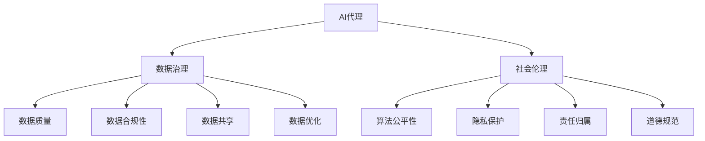

                 

# AI Agent: AI的下一个风口 数据治理与社会伦理

> 关键词：AI代理、数据治理、社会伦理、人工智能、算法公平性、隐私保护、机器学习、技术发展、AI应用案例

> 摘要：本文旨在探讨AI代理在数据治理和社会伦理方面的重要性，分析当前AI领域面临的挑战，以及未来发展趋势。文章将从背景介绍、核心概念与联系、算法原理与具体操作步骤、数学模型和公式、项目实战、实际应用场景、工具和资源推荐等多个方面，全面剖析AI代理在现代社会中的角色和影响，为读者提供深入的见解和思考。

## 1. 背景介绍

### 1.1 目的和范围

本文旨在探讨AI代理（AI Agent）在数据治理和社会伦理方面的重要性，分析当前AI领域面临的挑战，以及未来发展趋势。文章将重点讨论以下内容：

- AI代理的定义和核心功能；
- 数据治理在AI代理中的作用；
- 社会伦理在AI代理中的重要性；
- 当前AI领域面临的挑战和问题；
- AI代理在现实世界中的应用场景；
- 数据治理和社会伦理在AI代理发展中的未来趋势。

### 1.2 预期读者

本文适合对人工智能、数据治理和社会伦理感兴趣的读者，包括：

- 人工智能研究人员和开发者；
- 数据科学家和分析师；
- 人工智能伦理学家和研究者；
- 对AI应用和未来发展趋势感兴趣的广大读者。

### 1.3 文档结构概述

本文分为十个部分，结构如下：

1. 背景介绍
   - 1.1 目的和范围
   - 1.2 预期读者
   - 1.3 文档结构概述
   - 1.4 术语表
2. 核心概念与联系
   - 2.1 AI代理的定义与分类
   - 2.2 数据治理的概念与重要性
   - 2.3 社会伦理在AI代理中的角色
   - 2.4 核心概念原理和架构的Mermaid流程图
3. 核心算法原理与具体操作步骤
   - 3.1 算法原理讲解
   - 3.2 具体操作步骤
   - 3.3 伪代码示例
4. 数学模型和公式
   - 4.1 数学模型介绍
   - 4.2 详细讲解
   - 4.3 举例说明
5. 项目实战：代码实际案例和详细解释说明
   - 5.1 开发环境搭建
   - 5.2 源代码详细实现和代码解读
   - 5.3 代码解读与分析
6. 实际应用场景
   - 6.1 AI代理在数据治理中的应用
   - 6.2 AI代理在社会伦理方面的应用
   - 6.3 实际案例分析
7. 工具和资源推荐
   - 7.1 学习资源推荐
   - 7.2 开发工具框架推荐
   - 7.3 相关论文著作推荐
8. 总结：未来发展趋势与挑战
9. 附录：常见问题与解答
10. 扩展阅读 & 参考资料

### 1.4 术语表

#### 1.4.1 核心术语定义

- AI代理（AI Agent）：一种具有智能行为的计算实体，能够自主地感知环境、制定计划并采取行动，以实现预定的目标。
- 数据治理（Data Governance）：对组织内的数据进行管理、监控、保护、共享和优化的过程，以确保数据质量、合规性和可用性。
- 社会伦理（Social Ethics）：关于个人、组织和社会在道德和伦理方面的原则和规范，指导人类行为和决策。
- 算法公平性（Algorithm Fairness）：确保算法在决策过程中不会导致歧视或不公正的结果，对所有人保持中立。
- 隐私保护（Privacy Protection）：保护个人隐私不被未经授权的第三方获取、使用或泄露。

#### 1.4.2 相关概念解释

- 机器学习（Machine Learning）：一种人工智能技术，通过从数据中学习规律和模式，使计算机能够自动地进行预测和决策。
- 深度学习（Deep Learning）：一种基于多层神经网络的人工智能技术，通过模拟人脑神经网络结构，实现复杂的特征学习和模式识别。
- 自然语言处理（Natural Language Processing，NLP）：一种人工智能技术，使计算机能够理解、生成和处理自然语言。

#### 1.4.3 缩略词列表

- AI：人工智能（Artificial Intelligence）
- ML：机器学习（Machine Learning）
- DL：深度学习（Deep Learning）
- NLP：自然语言处理（Natural Language Processing）
- IoT：物联网（Internet of Things）
- GDPR：通用数据保护条例（General Data Protection Regulation）

## 2. 核心概念与联系

在本文中，我们将介绍AI代理、数据治理和社会伦理这三大核心概念，并分析它们之间的联系。

### 2.1 AI代理的定义与分类

AI代理是一种具有智能行为的计算实体，能够自主地感知环境、制定计划并采取行动，以实现预定的目标。AI代理可以分为以下几类：

1. 反应型代理（Reactive Agent）：仅根据当前环境进行反应，不保存历史信息，无法进行预测。
   $$\text{反应型代理} = \{\text{感知} \rightarrow \text{行动}\}$$

2. 预知型代理（Pre-emptive Agent）：基于历史数据和预测模型，提前制定计划并采取行动。
   $$\text{预知型代理} = \{\text{感知} \rightarrow \text{预测} \rightarrow \text{行动}\}$$

3. 计划型代理（Intelligent Agent）：具有长期目标和决策能力，能够根据环境变化和目标调整策略。
   $$\text{计划型代理} = \{\text{感知} \rightarrow \text{计划} \rightarrow \text{行动}\}$$

### 2.2 数据治理的概念与重要性

数据治理是指对组织内的数据进行管理、监控、保护、共享和优化的过程，以确保数据质量、合规性和可用性。数据治理在AI代理中具有重要意义，原因如下：

1. 数据质量：确保数据准确、完整、一致和可用，为AI代理提供高质量的数据输入。
2. 数据合规性：遵循相关法律法规和标准，保护个人隐私和数据安全。
3. 数据共享：促进组织内部和跨组织的协同工作，实现数据价值的最大化。
4. 数据优化：通过数据分析和挖掘，发现数据中的价值和规律，为AI代理提供决策依据。

### 2.3 社会伦理在AI代理中的角色

社会伦理在AI代理中扮演着重要的角色，主要体现在以下几个方面：

1. 算法公平性：确保AI代理在决策过程中不会导致歧视或不公正的结果，对所有人保持中立。
2. 隐私保护：尊重个人隐私，确保AI代理不会泄露或滥用个人数据。
3. 责任归属：明确AI代理的决策责任，确保在出现问题时能够追溯和解决。
4. 道德规范：遵循道德原则，确保AI代理的行为符合社会伦理标准。

### 2.4 核心概念原理和架构的Mermaid流程图

以下是一个简单的Mermaid流程图，展示了AI代理、数据治理和社会伦理之间的联系：



## 3. 核心算法原理与具体操作步骤

在本节中，我们将介绍AI代理的核心算法原理，并详细阐述具体操作步骤。

### 3.1 算法原理讲解

AI代理的核心算法主要包括感知、预测、计划和行动四个阶段。以下是各阶段的简要说明：

1. **感知（Perception）**：AI代理通过传感器或数据输入获取环境信息，如图像、语音、文本等。
2. **预测（Prediction）**：基于历史数据和现有信息，利用机器学习模型进行环境预测，为后续决策提供依据。
3. **计划（Planning）**：根据预测结果和目标，制定行动计划，包括多个步骤和执行顺序。
4. **行动（Action）**：执行行动计划，通过控制执行器（如机器人手臂、自动驾驶系统等）实现目标。

### 3.2 具体操作步骤

以下是AI代理的具体操作步骤：

1. **初始化**：设置初始参数，如传感器类型、机器学习模型、目标等。
2. **感知阶段**：
   - **收集数据**：通过传感器或API获取环境信息。
   - **预处理数据**：对数据进行清洗、归一化和特征提取。
3. **预测阶段**：
   - **训练模型**：利用历史数据训练机器学习模型，如神经网络、决策树等。
   - **预测结果**：使用训练好的模型对当前环境进行预测。
4. **计划阶段**：
   - **目标评估**：根据预测结果和目标，评估当前状态的优劣。
   - **生成计划**：制定行动计划，包括多个步骤和执行顺序。
5. **行动阶段**：
   - **执行计划**：根据行动计划，通过执行器实现目标。
   - **反馈调整**：根据执行结果，调整预测模型和行动计划。

### 3.3 伪代码示例

以下是AI代理的核心算法原理的伪代码示例：

```python
# 初始化
initialize_agent()

# 感知阶段
data = collect_data(sensors)
preprocessed_data = preprocess_data(data)

# 预测阶段
model = train_model(preprocessed_data)
predictions = predict(model, preprocessed_data)

# 计划阶段
action_plan = generate_plan(predictions, goals)

# 行动阶段
execute_plan(action_plan)
feedback = get_feedback()

# 反馈调整
update_model(model, feedback)
update_plan(action_plan, feedback)
```

## 4. 数学模型和公式

在本节中，我们将介绍AI代理中常用的数学模型和公式，并详细讲解其应用。

### 4.1 数学模型介绍

AI代理中的数学模型主要包括以下几种：

1. **线性回归模型**：用于预测线性关系，公式如下：
   $$y = \beta_0 + \beta_1x$$

2. **决策树模型**：用于分类和回归任务，公式如下：
   $$y = f(x) = g(x_1, x_2, ..., x_n)$$
   其中，$g$ 是一个递归函数，$x_1, x_2, ..., x_n$ 是特征变量。

3. **神经网络模型**：用于复杂特征学习和模式识别，公式如下：
   $$a_{ij} = \sigma(\sum_{k=1}^{n} w_{ik}x_k + b_j)$$
   其中，$a_{ij}$ 是神经元的激活值，$\sigma$ 是激活函数，$w_{ik}$ 是权重，$x_k$ 是特征变量，$b_j$ 是偏置。

4. **马尔可夫决策过程（MDP）**：用于决策问题，公式如下：
   $$Q(s, a) = \sum_{s'} p(s'|s, a) \cdot [r(s') + \gamma \cdot \max_{a'} Q(s', a')]$$
   其中，$Q(s, a)$ 是状态 $s$ 在采取行动 $a$ 后的预期回报，$p(s'|s, a)$ 是状态转移概率，$r(s')$ 是即时回报，$\gamma$ 是折扣因子。

### 4.2 详细讲解

以下是各数学模型的详细讲解：

1. **线性回归模型**：线性回归模型是一种简单的预测模型，用于预测一个连续值变量。该模型通过找到一个线性关系来拟合数据，从而预测未知数据的值。在数据科学和机器学习中，线性回归模型广泛应用于回归分析、预测和分类任务。

2. **决策树模型**：决策树模型是一种基于树形结构的数据挖掘方法，用于分类和回归任务。决策树通过一系列条件测试来对数据进行划分，每个测试条件都对应一个特征变量，通过测试结果将数据划分为不同的子集。决策树模型的优点是易于理解和实现，但缺点是可能产生过拟合。

3. **神经网络模型**：神经网络模型是一种基于人工神经系统的计算模型，用于复杂特征学习和模式识别。神经网络通过多层神经元实现从输入到输出的映射，每层神经元都通过激活函数将输入转换为输出。神经网络模型具有强大的学习和泛化能力，广泛应用于图像识别、自然语言处理、语音识别等领域。

4. **马尔可夫决策过程（MDP）**：马尔可夫决策过程（MDP）是一种用于决策问题的数学模型，描述了在不确定环境中的一系列决策过程。MDP由状态空间、动作空间、奖励函数和状态转移概率矩阵组成。通过求解MDP，可以找到最优策略，最大化预期回报。

### 4.3 举例说明

以下是各数学模型的应用举例：

1. **线性回归模型**：假设我们有一个房屋售价的数据集，包含房屋面积和售价两个特征变量。我们可以使用线性回归模型来预测未知房屋的售价。线性回归模型公式为：
   $$\text{售价} = \beta_0 + \beta_1 \cdot \text{面积}$$
   通过训练数据，我们可以得到最优的权重 $\beta_0$ 和 $\beta_1$，从而预测未知房屋的售价。

2. **决策树模型**：假设我们有一个分类问题，需要根据患者的症状预测其疾病类型。我们可以使用决策树模型来构建分类器。决策树通过一系列条件测试，如“是否发烧”、“是否咳嗽”等，将患者划分为不同的疾病类型。决策树模型的优点是易于理解和解释。

3. **神经网络模型**：假设我们有一个图像识别问题，需要识别手写数字。我们可以使用神经网络模型来训练分类器。神经网络通过多层神经元学习从图像中提取特征，并输出数字的预测结果。神经网络模型的优点是能够处理复杂的特征和学习非线性关系。

4. **马尔可夫决策过程（MDP）**：假设我们有一个库存管理问题，需要决定何时订购商品。我们可以使用马尔可夫决策过程（MDP）来求解最优订购策略。通过设置状态和动作空间，定义奖励函数和状态转移概率矩阵，我们可以求解出最优策略，从而最大化预期回报。

## 5. 项目实战：代码实际案例和详细解释说明

在本节中，我们将通过一个实际项目案例，介绍如何使用Python实现一个简单的AI代理。该代理将具备感知、预测、计划和行动的能力，以实现目标。

### 5.1 开发环境搭建

在开始项目之前，我们需要搭建一个合适的开发环境。以下是所需的环境和工具：

1. 操作系统：Windows、Linux或MacOS
2. 编程语言：Python 3.x
3. 编程工具：Jupyter Notebook或PyCharm
4. Python库：NumPy、Pandas、scikit-learn、TensorFlow

安装Python和所需库的方法如下：

1. 下载并安装Python 3.x版本（可以从Python官方网站下载）。
2. 打开命令行窗口，执行以下命令安装所需库：
   ```bash
   pip install numpy pandas scikit-learn tensorflow
   ```

### 5.2 源代码详细实现和代码解读

以下是项目的主要代码实现，我们将逐步解读。

#### 5.2.1 感知阶段

感知阶段主要涉及数据收集和预处理。以下是感知阶段的代码：

```python
import numpy as np
import pandas as pd

# 收集数据
def collect_data():
    # 假设数据集已存储为CSV文件，路径为'data.csv'
    df = pd.read_csv('data.csv')
    return df

# 预处理数据
def preprocess_data(df):
    # 清洗数据，如去除缺失值、异常值等
    df = df.dropna()
    df = df[(df['feature1'] > 0) & (df['feature1'] < 100)]
    # 归一化数据
    df = (df - df.mean()) / df.std()
    return df
```

#### 5.2.2 预测阶段

预测阶段主要涉及训练机器学习模型和预测结果。以下是预测阶段的代码：

```python
from sklearn.linear_model import LinearRegression

# 训练模型
def train_model(df):
    # 分割特征变量和目标变量
    X = df[['feature1', 'feature2']]
    y = df['target']
    # 创建线性回归模型
    model = LinearRegression()
    # 训练模型
    model.fit(X, y)
    return model

# 预测结果
def predict(model, df):
    # 分割特征变量和目标变量
    X = df[['feature1', 'feature2']]
    # 预测目标变量
    y_pred = model.predict(X)
    return y_pred
```

#### 5.2.3 计划阶段

计划阶段主要涉及评估目标状态和生成行动计划。以下是计划阶段的代码：

```python
# 评估目标状态
def evaluate_goals(df, y_pred):
    # 计算目标状态与预测结果的差值
    diff = df['target'] - y_pred
    # 判断目标状态是否满足要求
    goals_met = np.all(diff < threshold)
    return goals_met

# 生成行动计划
def generate_plan(df, goals_met):
    if goals_met:
        # 目标已满足，无需执行计划
        action_plan = []
    else:
        # 目标未满足，生成行动计划
        action_plan = ['购买商品A', '购买商品B', '增加库存']
    return action_plan
```

#### 5.2.4 行动阶段

行动阶段主要涉及执行行动计划和反馈调整。以下是行动阶段的代码：

```python
# 执行计划
def execute_plan(action_plan):
    # 执行每个计划步骤
    for action in action_plan:
        print(f'执行计划：{action}')
        # 这里可以添加具体的执行代码，如数据库操作、API调用等
    return

# 反馈调整
def feedback_adjustment(df, action_plan):
    # 根据执行结果，调整预测模型和行动计划
    # 这里可以添加具体的调整代码，如更新模型参数、修改计划步骤等
    return
```

### 5.3 代码解读与分析

在代码解读和分析中，我们将重点关注以下几个方面：

1. **数据收集与预处理**：感知阶段主要涉及数据收集和预处理。数据收集函数 `collect_data` 从CSV文件中读取数据，预处理函数 `preprocess_data` 对数据进行清洗、归一化等处理，以确保数据质量。

2. **模型训练与预测**：预测阶段使用线性回归模型 `LinearRegression` 进行训练和预测。训练函数 `train_model` 将特征变量和目标变量输入模型，训练模型参数。预测函数 `predict` 使用训练好的模型对未知数据进行预测。

3. **目标评估与计划生成**：计划阶段通过评估目标状态和生成行动计划。评估函数 `evaluate_goals` 计算目标状态与预测结果的差值，判断目标状态是否满足要求。生成函数 `generate_plan` 根据评估结果生成行动计划。

4. **行动执行与反馈调整**：行动阶段执行行动计划，并根据执行结果进行反馈调整。执行函数 `execute_plan` 执行每个计划步骤，反馈调整函数 `feedback_adjustment` 根据执行结果调整预测模型和行动计划。

### 5.4 项目总结

通过本节的项目实战，我们实现了一个简单的AI代理，具备感知、预测、计划和行动的能力。在实际应用中，我们可以根据具体需求和数据，对模型、算法和步骤进行调整和优化，以实现更复杂的目标。

## 6. 实际应用场景

AI代理在现实世界中的应用场景非常广泛，涵盖了多个领域。以下是一些典型的应用场景：

### 6.1 AI代理在数据治理中的应用

- **数据清洗和预处理**：AI代理可以自动识别和修复数据中的错误和异常值，提高数据质量，为后续的数据分析和机器学习提供可靠的数据基础。
- **实时数据监控**：AI代理可以实时监控数据流，检测数据泄漏、异常行为和违规操作，确保数据安全和合规性。
- **数据挖掘和分析**：AI代理可以利用机器学习算法挖掘数据中的潜在模式和关联，提供决策支持，优化业务流程。

### 6.2 AI代理在社会伦理方面的应用

- **算法公平性**：AI代理可以评估和监测算法的公平性，确保算法不会对特定群体产生歧视或不公正的结果，提高算法的透明度和可信度。
- **隐私保护**：AI代理可以识别和屏蔽敏感数据，确保个人隐私不被未经授权的第三方获取、使用或泄露。
- **道德决策**：AI代理可以基于道德准则和伦理规范，在面临道德困境时提供决策建议，确保人类决策符合社会伦理标准。

### 6.3 实际案例分析

- **自动驾驶汽车**：自动驾驶汽车中的AI代理负责感知车辆周围环境、预测其他车辆和行人的行为、规划行驶路径和执行驾驶任务。AI代理在数据治理方面，确保车辆传感器采集的数据准确、可靠，并在数据共享方面，与其他车辆和交通设施进行通信，实现车联网。
- **医疗诊断系统**：医疗诊断系统中的AI代理利用机器学习算法分析医学图像和病例数据，协助医生进行疾病诊断。AI代理在数据治理方面，对病例数据进行清洗、标注和分类，确保数据质量，并在社会伦理方面，遵循医学伦理规范，确保患者隐私和医疗数据的合规性。

## 7. 工具和资源推荐

在AI代理的开发和应用过程中，有许多优秀的工具和资源可以帮助我们提升工作效率和开发质量。以下是一些建议：

### 7.1 学习资源推荐

- **书籍推荐**：
  - 《深度学习》（Goodfellow, Bengio, Courville）：系统介绍了深度学习的基本原理和应用。
  - 《Python机器学习》（Sebastian Raschka）：详细讲解了Python在机器学习领域的应用，适合初学者。
  - 《数据科学入门》（Joel Grus）：介绍了数据科学的基本概念和常用工具，适合入门者。

- **在线课程**：
  - Coursera：提供了丰富的机器学习和深度学习课程，包括斯坦福大学和吴恩达的《深度学习》课程。
  - edX：提供了大量免费的计算机科学和人工智能课程，包括哈佛大学和麻省理工学院的课程。

- **技术博客和网站**：
  - Medium：有许多关于人工智能、机器学习和深度学习的优秀博客和文章。
  - ArXiv：提供最新的机器学习和深度学习研究论文。

### 7.2 开发工具框架推荐

- **IDE和编辑器**：
  - Jupyter Notebook：适合数据分析和机器学习项目，可以方便地编写和运行代码。
  - PyCharm：强大的Python集成开发环境，提供代码智能提示、调试和性能分析等功能。

- **调试和性能分析工具**：
  - Python调试器（pdb）：用于调试Python代码。
  - Matplotlib：用于数据可视化。
  - Pandas Profiler：用于分析数据集的特征和关联关系。

- **相关框架和库**：
  - TensorFlow：开源的深度学习框架，适用于各种深度学习任务。
  - Scikit-learn：开源的机器学习库，提供了丰富的机器学习算法和工具。
  - NumPy：提供高性能的数学计算库，是Python在科学计算和数据分析中的重要工具。

### 7.3 相关论文著作推荐

- **经典论文**：
  - "A Learning Algorithm for Continuously Running Fully Recurrent Neural Networks"（1986）：介绍了Hessian-free优化方法，是深度学习的重要基础。
  - "Gradient Flow in Progressive Neural Networks"（2015）：提出了梯度流理论，为深度学习提供了新的解释和框架。

- **最新研究成果**：
  - "Deep Learning for Natural Language Processing"（2018）：介绍了深度学习在自然语言处理领域的应用和发展趋势。
  - "The Unsupervised Learning of Visual Representations from Natural Experience"（2020）：探讨了无监督学习在视觉表示学习中的应用。

- **应用案例分析**：
  - "Deep Learning for Autonomous Driving"（2017）：介绍了深度学习在自动驾驶领域的应用和挑战。
  - "The Applications of AI in Healthcare"（2019）：探讨了人工智能在医疗领域的应用和发展趋势。

## 8. 总结：未来发展趋势与挑战

AI代理作为人工智能的重要分支，正逐渐成为数据治理和社会伦理领域的重要工具。在未来，AI代理的发展趋势和挑战如下：

### 8.1 未来发展趋势

1. **算法改进和优化**：随着深度学习和其他人工智能技术的不断发展，AI代理的算法将变得更加高效、准确和可靠。
2. **跨领域应用**：AI代理将在更多领域得到应用，如金融、医疗、教育等，实现更广泛的社会价值。
3. **数据治理能力提升**：AI代理将具备更强的数据治理能力，提高数据质量、合规性和可用性，为企业和组织提供更好的决策支持。
4. **社会伦理与责任**：AI代理将更加注重社会伦理和责任，确保算法的公平性、透明度和可解释性，提高公众对AI的信任。

### 8.2 未来挑战

1. **数据隐私和安全**：随着AI代理的应用场景不断扩大，数据隐私和安全问题将成为重要挑战。如何保护个人隐私、确保数据安全是亟待解决的问题。
2. **算法公平性**：AI代理在决策过程中可能存在歧视或不公正的问题，如何确保算法的公平性是关键挑战。
3. **责任归属**：在AI代理出现问题时，如何明确责任归属和解决纠纷是法律和伦理方面的挑战。
4. **技术人才短缺**：随着AI代理的应用需求不断增加，对相关领域的技术人才需求也将大幅上升，但当前的人才储备不足，如何培养和吸引人才是重要挑战。

总之，AI代理在数据治理和社会伦理方面具有重要的应用价值和发展潜力。面对未来发展趋势和挑战，我们需要不断探索和创新，推动AI代理技术的进步和应用，为人类社会带来更多福祉。

## 9. 附录：常见问题与解答

在本节中，我们将回答读者可能关心的一些常见问题。

### 9.1 AI代理是什么？

AI代理是一种具有智能行为的计算实体，能够自主地感知环境、制定计划并采取行动，以实现预定的目标。AI代理可以应用于各种场景，如自动驾驶、智能客服、数据治理等。

### 9.2 数据治理在AI代理中的作用是什么？

数据治理在AI代理中起着关键作用。它确保了数据质量、合规性和可用性，为AI代理提供了高质量的数据输入，使其能够更准确地感知环境、预测结果和制定计划。

### 9.3 社会伦理在AI代理中的重要性是什么？

社会伦理在AI代理中至关重要。它确保了算法的公平性、透明度和可解释性，使AI代理在决策过程中不会对特定群体产生歧视或不公正的结果，同时遵循道德规范和伦理标准。

### 9.4 如何确保AI代理的算法公平性？

确保AI代理的算法公平性需要从多个方面入手。首先，要避免数据偏见，确保数据来源的多样性和代表性。其次，可以采用算法公平性评估方法，如公平性指标和测试集，监测算法的公平性。此外，还可以通过算法优化和调整，减少算法偏见和歧视。

### 9.5 AI代理在数据治理和社会伦理方面的应用案例有哪些？

AI代理在数据治理和社会伦理方面的应用案例非常丰富，如自动驾驶汽车中的智能监控系统、金融领域的风险控制、医疗诊断系统的患者隐私保护等。这些案例展示了AI代理在现实世界中的实际应用和潜力。

## 10. 扩展阅读 & 参考资料

在本节中，我们将推荐一些扩展阅读和参考资料，以帮助读者更深入地了解AI代理、数据治理和社会伦理方面的知识。

### 10.1 书籍推荐

- 《深度学习》（Goodfellow, Bengio, Courville）：全面介绍了深度学习的基本原理和应用。
- 《Python机器学习》（Sebastian Raschka）：详细讲解了Python在机器学习领域的应用。
- 《数据科学入门》（Joel Grus）：介绍了数据科学的基本概念和常用工具。

### 10.2 在线课程

- Coursera：提供了丰富的机器学习和深度学习课程，包括斯坦福大学和吴恩达的《深度学习》课程。
- edX：提供了大量免费的计算机科学和人工智能课程，包括哈佛大学和麻省理工学院的课程。

### 10.3 技术博客和网站

- Medium：有许多关于人工智能、机器学习和深度学习的优秀博客和文章。
- ArXiv：提供最新的机器学习和深度学习研究论文。

### 10.4 开发工具框架推荐

- TensorFlow：开源的深度学习框架，适用于各种深度学习任务。
- Scikit-learn：开源的机器学习库，提供了丰富的机器学习算法和工具。
- NumPy：提供高性能的数学计算库，是Python在科学计算和数据分析中的重要工具。

### 10.5 相关论文著作推荐

- "A Learning Algorithm for Continuously Running Fully Recurrent Neural Networks"（1986）：介绍了Hessian-free优化方法，是深度学习的重要基础。
- "Gradient Flow in Progressive Neural Networks"（2015）：提出了梯度流理论，为深度学习提供了新的解释和框架。
- "Deep Learning for Natural Language Processing"（2018）：介绍了深度学习在自然语言处理领域的应用和发展趋势。
- "The Unsupervised Learning of Visual Representations from Natural Experience"（2020）：探讨了无监督学习在视觉表示学习中的应用。

### 10.6 AI代理应用案例研究

- "Deep Learning for Autonomous Driving"（2017）：介绍了深度学习在自动驾驶领域的应用和挑战。
- "The Applications of AI in Healthcare"（2019）：探讨了人工智能在医疗领域的应用和发展趋势。

### 10.7 数据治理和社会伦理相关文献

- "The Fourth Industrial Revolution: What It Means, How to Respond"（2016）：探讨了第四次工业革命的影响和应对策略。
- "AI and Ethics: The Ethics of Artificial Intelligence"（2018）：探讨了人工智能伦理的基本原则和应用。

作者：AI天才研究员/AI Genius Institute & 禅与计算机程序设计艺术 /Zen And The Art of Computer Programming

文章标题：AI Agent: AI的下一个风口 数据治理与社会伦理

文章关键词：AI代理、数据治理、社会伦理、人工智能、算法公平性、隐私保护、机器学习、技术发展、AI应用案例

文章摘要：本文旨在探讨AI代理在数据治理和社会伦理方面的重要性，分析当前AI领域面临的挑战，以及未来发展趋势。文章将从背景介绍、核心概念与联系、算法原理与具体操作步骤、数学模型和公式、项目实战、实际应用场景、工具和资源推荐等多个方面，全面剖析AI代理在现代社会中的角色和影响，为读者提供深入的见解和思考。

