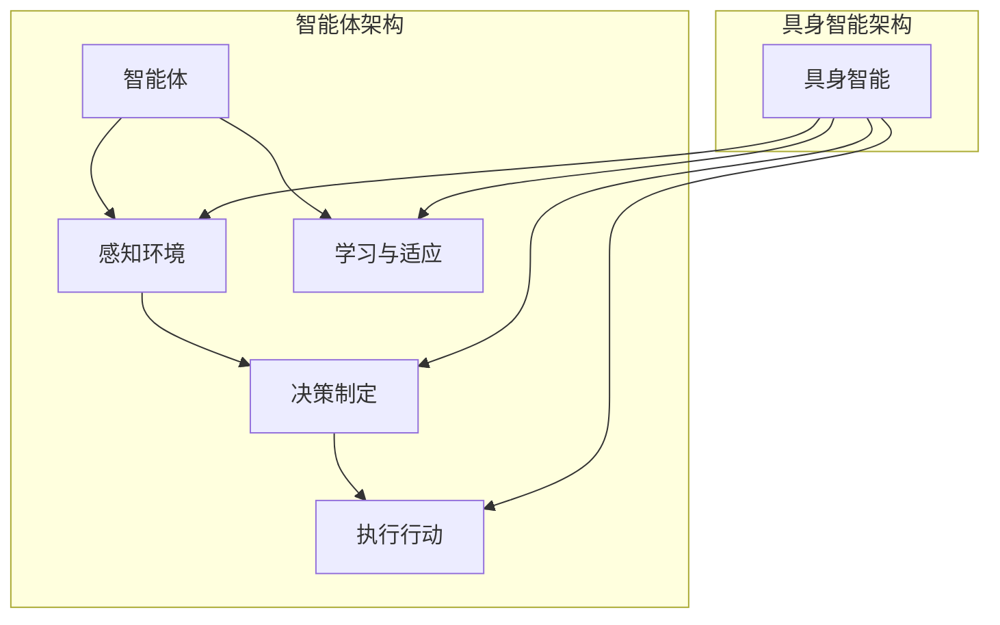
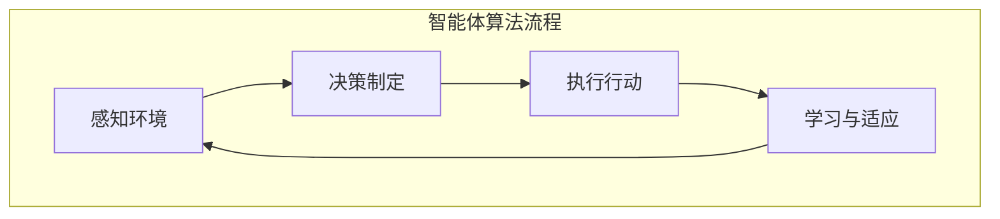

                 

# AI Agent: AI的下一个风口 智能体与具身智能的区别

> **关键词**：人工智能，智能体，具身智能，分布式计算，深度学习，强化学习
>
> **摘要**：本文将深入探讨人工智能领域的两个关键概念——智能体与具身智能，分析它们的区别、原理及其在未来的发展趋势。通过对核心概念的详细解析和实际应用场景的探讨，本文旨在为读者提供对人工智能更深入的理解。

## 1. 背景介绍

### 1.1 目的和范围

本文旨在揭示人工智能（AI）领域的两个重要概念——智能体与具身智能，探讨它们在技术发展和实际应用中的区别与联系。本文将结合分布式计算、深度学习和强化学习等核心算法，分析智能体的原理和架构，同时解释具身智能的概念及其实现方式。通过本文的阅读，读者将更好地理解人工智能的技术进步和应用前景。

### 1.2 预期读者

本文面向对人工智能有兴趣的读者，包括计算机科学专业学生、软件工程师、AI研究员以及对AI技术感兴趣的技术爱好者。特别地，本文将为那些希望深入了解智能体和具身智能技术原理的专业人士提供有价值的参考。

### 1.3 文档结构概述

本文结构如下：

1. **背景介绍**：介绍文章的目的和预期读者，概述文章的结构和核心内容。
2. **核心概念与联系**：详细阐述智能体和具身智能的定义、原理和相互关系，并使用Mermaid流程图展示核心架构。
3. **核心算法原理 & 具体操作步骤**：通过伪代码详细讲解智能体的算法原理和操作步骤。
4. **数学模型和公式 & 详细讲解 & 举例说明**：介绍与智能体相关的数学模型和公式，并给出具体的例子说明。
5. **项目实战：代码实际案例和详细解释说明**：通过实际代码案例展示智能体的实现和应用。
6. **实际应用场景**：探讨智能体和具身智能在各个领域的应用场景。
7. **工具和资源推荐**：推荐学习资源和开发工具，包括书籍、在线课程、技术博客、IDE、调试工具和相关框架。
8. **总结：未来发展趋势与挑战**：总结文章的主要观点，探讨未来发展趋势和面临的挑战。
9. **附录：常见问题与解答**：回答读者可能遇到的问题。
10. **扩展阅读 & 参考资料**：提供进一步的阅读材料和参考资料。

### 1.4 术语表

#### 1.4.1 核心术语定义

- **智能体（Agent）**：在环境中能够自主行动、感知环境并做出决策的实体。
- **具身智能（Embodied Intelligence）**：与物理世界互动的智能体，通过感知和行动获得对世界的理解。
- **分布式计算**：将计算任务分配到多个计算节点上，通过协同工作实现高效计算。
- **深度学习**：一种基于神经网络的学习方法，通过多层神经网络实现数据的自动特征提取。
- **强化学习**：一种通过试错和奖励机制学习策略的机器学习方法。

#### 1.4.2 相关概念解释

- **神经网络**：由大量神经元互联组成的计算模型，能够模拟人脑的感知和学习过程。
- **强化信号**：用于指导智能体行为的学习信号，通常由外部环境提供。
- **多智能体系统（MAS）**：由多个智能体组成的系统，通过相互协作实现复杂任务。

#### 1.4.3 缩略词列表

- **AI**：人工智能（Artificial Intelligence）
- **RL**：强化学习（Reinforcement Learning）
- **DL**：深度学习（Deep Learning）
- **MAS**：多智能体系统（Multi-Agent System）

## 2. 核心概念与联系

在讨论智能体与具身智能之前，我们需要先了解它们的基本概念及其相互联系。

### 2.1 智能体的定义与作用

**智能体**是一个能够感知环境、采取行动并为了实现特定目标自主决策的实体。在人工智能领域，智能体通常被看作是具有自主性和智能性的系统。智能体可以是一个机器人、一个软件程序或者一个虚拟代理。

智能体的主要作用包括：

1. **感知环境**：智能体通过传感器感知周围环境的信息，如视觉、听觉、触觉等。
2. **决策制定**：智能体根据感知到的信息，通过算法和策略制定相应的行动方案。
3. **执行行动**：智能体执行决策，改变其状态或环境状态。

智能体在人工智能领域有着广泛的应用，例如在机器人控制、自动驾驶、智能客服等领域发挥着重要作用。

### 2.2 具身智能的概念与实现

**具身智能**是指智能体通过与物理世界的直接交互获取对世界的理解，并在此基础上进行决策和学习。与传统的基于数据驱动的智能体不同，具身智能强调与环境的实时互动和反馈。

实现具身智能的关键要素包括：

1. **感知**：智能体通过传感器获取物理世界的实时信息。
2. **执行**：智能体通过执行器与环境进行交互，如执行移动、抓取等动作。
3. **学习**：智能体通过感知和执行过程中的反馈不断优化自己的行为和策略。

### 2.3 智能体与具身智能的关系

智能体与具身智能密切相关，但又有区别。智能体是一种广义的概念，它强调自主决策和行动；而具身智能则是智能体的一种特殊形式，强调与物理世界的直接互动。

两者的联系主要体现在：

1. **感知与执行**：智能体的感知和执行能力是实现具身智能的基础。
2. **学习与适应**：智能体通过感知和执行过程中的学习，不断提高自身对环境的适应能力。

### 2.4 Mermaid流程图展示

下面是智能体和具身智能的基本架构的Mermaid流程图：



## 3. 核心算法原理 & 具体操作步骤

智能体的核心算法通常包括感知、决策、执行和学习。下面，我们将使用伪代码详细讲解智能体的算法原理和操作步骤。

### 3.1 感知环境

```python
# 感知环境的伪代码
def sense_environment():
    # 使用传感器获取环境信息
    sensor_data = get_sensor_data()
    # 对感知到的数据进行预处理
    preprocessed_data = preprocess_data(sensor_data)
    return preprocessed_data
```

### 3.2 决策制定

```python
# 决策制定的伪代码
def make_decision(perceived_data):
    # 根据感知数据，使用决策算法制定行动方案
    action_plan = decision_algorithm(perceived_data)
    return action_plan
```

### 3.3 执行行动

```python
# 执行行动的伪代码
def execute_action(action_plan):
    # 根据行动方案，执行相应的动作
    execute_action_plan(action_plan)
```

### 3.4 学习与适应

```python
# 学习与适应的伪代码
def learn_and_adapt(perceived_data, action_plan, reward_signal):
    # 根据感知数据、行动方案和奖励信号，更新智能体的策略
    updated_strategy = learning_algorithm(perceived_data, action_plan, reward_signal)
    return updated_strategy
```

### 3.5 智能体算法流程



## 4. 数学模型和公式 & 详细讲解 & 举例说明

在智能体的设计和实现中，数学模型和公式起到了至关重要的作用。以下，我们将详细介绍智能体相关的数学模型和公式，并给出具体的例子说明。

### 4.1 强化学习中的数学模型

强化学习是智能体领域中的一种关键算法，其核心概念包括状态（$S$）、动作（$A$）、奖励（$R$）和价值函数（$V$）。以下是强化学习中的基本数学模型：

#### 4.1.1 状态值函数（$V^*(s)$）

$$
V^*(s) = \sum_{a} \gamma \cdot \pi(a|s) \cdot Q^*(s, a)
$$

其中，$V^*(s)$是智能体在状态$s$下的最优价值函数，$\gamma$是折扣因子，$\pi(a|s)$是智能体在状态$s$下采取动作$a$的策略，$Q^*(s, a)$是状态-action值函数。

#### 4.1.2 状态-action值函数（$Q^*(s, a)$）

$$
Q^*(s, a) = \sum_{s'} p(s' | s, a) \cdot [R(s, a, s') + \gamma \cdot V^*(s')]
$$

其中，$Q^*(s, a)$是智能体在状态$s$下采取动作$a$后到达状态$s'$并获得的累积奖励。

#### 4.1.3 举例说明

假设智能体在一个简单的迷宫环境中，状态空间为{“起点”、“路径1”、“路径2”、“终点”}，动作空间为{“前进”、“后退”}。折扣因子$\gamma$设为0.9。现在，我们使用Q-learning算法计算状态-action值函数。

初始时，所有$Q(s, a)$值设为0。智能体从起点开始，采取前进动作，到达路径1。接下来，智能体在路径1采取前进动作，到达路径2。由于路径2通向终点，因此获得奖励$R(s, a, s') = 10$。然后，智能体在路径2采取前进动作，到达终点。在终点，智能体再次采取前进动作，回到起点。

经过多次迭代后，状态-action值函数$Q^*(s, a)$将逐渐收敛到最优值。

### 4.2 深度学习中的数学模型

深度学习是智能体领域中的重要算法，其核心概念包括神经元、神经网络和反向传播算法。以下是深度学习中的基本数学模型：

#### 4.2.1 神经元模型

$$
a_i = \sigma(\sum_j w_{ij} \cdot x_j + b)
$$

其中，$a_i$是第$i$个神经元的激活值，$x_j$是输入特征，$w_{ij}$是权重，$b$是偏置项，$\sigma$是激活函数。

#### 4.2.2 神经网络模型

神经网络由多个层次组成，包括输入层、隐藏层和输出层。神经网络模型可以用以下公式表示：

$$
\begin{align*}
\text{输出层}:\quad y = \sigma(\sum_j w_{ij} \cdot a_j + b) \\
\text{隐藏层}:\quad a_j = \sigma(\sum_k w_{jk} \cdot x_k + b)
\end{align*}
$$

其中，$y$是输出层激活值，$a_j$是隐藏层激活值，$w_{ij}$和$w_{jk}$分别是权重，$b$是偏置项。

#### 4.2.3 举例说明

假设我们使用一个简单的三层神经网络进行手写数字识别。输入层有784个神经元，对应手写数字的像素值；隐藏层有128个神经元；输出层有10个神经元，对应10个数字。激活函数$\sigma$使用ReLU函数。

输入一个手写数字图像后，首先经过输入层传递到隐藏层。隐藏层通过权重$w_{jk}$和偏置项$b$计算激活值$a_j$。然后，隐藏层的激活值传递到输出层，通过权重$w_{ij}$和偏置项$b$计算输出层激活值$y$。

通过反向传播算法，根据输出层的目标标签和实际输出，计算梯度并更新权重和偏置项，从而优化神经网络模型。

## 5. 项目实战：代码实际案例和详细解释说明

在本节中，我们将通过一个实际项目案例，展示如何实现一个简单的智能体，并详细解释其代码实现和运行过程。

### 5.1 开发环境搭建

为了实现智能体项目，我们首先需要搭建一个合适的开发环境。以下是推荐的开发环境和工具：

- **编程语言**：Python
- **开发环境**：Jupyter Notebook 或 PyCharm
- **依赖库**：TensorFlow、Keras、NumPy、Pandas

确保在开发环境中安装以上依赖库，以便后续代码实现和调试。

### 5.2 源代码详细实现和代码解读

下面是一个简单的智能体项目案例，该智能体使用深度强化学习算法在迷宫环境中进行导航。代码实现如下：

```python
import numpy as np
import pandas as pd
import matplotlib.pyplot as plt
from keras.models import Sequential
from keras.layers import Dense
from keras.optimizers import Adam

# 游戏环境类
class GameEnvironment:
    def __init__(self, size=5):
        self.size = size
        self.state = (0, 0)  # 初始状态
        self.goal = (size-1, size-1)  # 目标状态

    def step(self, action):
        # 执行动作，更新状态
        if action == 0:  # 向上移动
            new_state = (max(self.state[0]-1, 0), self.state[1])
        elif action == 1:  # 向右移动
            new_state = (self.state[0], min(self.state[1]+1, self.size-1))
        elif action == 2:  # 向下移动
            new_state = (min(self.state[0]+1, self.size-1), self.state[1])
        elif action == 3:  # 向左移动
            new_state = (self.state[0], max(self.state[1]-1, 0))
        
        # 判断是否到达终点
        if new_state == self.goal:
            reward = 100  # 到达终点，奖励100
        else:
            reward = -1  # 未到达终点，惩罚-1

        # 更新状态
        self.state = new_state
        return self.state, reward

    def render(self):
        # 绘制游戏环境
        grid = np.zeros((self.size, self.size))
        grid[self.state[0], self.state[1]] = 1
        grid[self.goal[0], self.goal[1]] = 2
        plt.imshow(grid, cmap='gray')
        plt.show()

# 智能体类
class Agent:
    def __init__(self, env):
        self.env = env
        self.model = self.build_model()

    def build_model(self):
        # 构建神经网络模型
        model = Sequential()
        model.add(Dense(64, input_dim=self.env.size, activation='relu'))
        model.add(Dense(64, activation='relu'))
        model.add(Dense(self.env.size, activation='softmax'))
        model.compile(loss='categorical_crossentropy', optimizer=Adam(), metrics=['accuracy'])
        return model

    def get_action(self, state):
        # 获取动作
        action_probs = self.model.predict(state.reshape(1, -1))
        action = np.argmax(action_probs)
        return action

    def train(self, episodes=1000):
        # 训练智能体
        for episode in range(episodes):
            state = self.env.state
            done = False
            while not done:
                action = self.get_action(state)
                next_state, reward = self.env.step(action)
                self.model.fit(state.reshape(1, -1), action_probs, epochs=1, verbose=0)
                state = next_state
                if reward == 100:
                    done = True
            if episode % 100 == 0:
                print(f"Episode {episode}: Reward = {reward}")

# 主程序
if __name__ == "__main__":
    env = GameEnvironment(size=5)
    agent = Agent(env)
    agent.train()
    env.render()
```

### 5.3 代码解读与分析

上述代码实现了一个简单的智能体，用于在迷宫环境中进行导航。以下是代码的详细解读：

- **GameEnvironment类**：定义了游戏环境的基本属性和方法。游戏环境是一个大小为5x5的迷宫，初始状态和目标状态分别位于左下角和右上角。step()方法用于执行动作，更新状态，并返回新的状态和奖励。render()方法用于绘制游戏环境。
- **Agent类**：定义了智能体的基本属性和方法。智能体使用一个神经网络模型来获取动作。get_action()方法用于根据当前状态获取动作概率，并返回一个动作。train()方法用于训练智能体。在训练过程中，智能体通过深度强化学习算法不断优化神经网络模型。
- **主程序**：创建游戏环境和智能体实例，调用智能体的train()方法进行训练，并使用render()方法绘制训练完成的智能体在迷宫环境中的导航过程。

通过上述代码实现，我们展示了如何使用深度强化学习算法构建一个简单的智能体，并在迷宫环境中进行导航。这为我们提供了一个基本的智能体实现框架，可以进一步扩展和优化，以适应更复杂的游戏环境。

## 6. 实际应用场景

智能体和具身智能在各个领域都有着广泛的应用。以下是一些典型的实际应用场景：

### 6.1 自动驾驶

自动驾驶是智能体和具身智能的重要应用领域。自动驾驶车辆通过感知环境（如摄像头、激光雷达和雷达）获取实时信息，并使用智能体算法进行路径规划和决策。例如，特斯拉的Autopilot系统使用智能体算法来控制车辆的自动驾驶功能，包括车道保持、自动变道和自动驾驶等。

### 6.2 机器人控制

机器人控制是智能体和具身智能的另一个重要应用领域。智能机器人通过感知和执行能力，能够完成复杂的任务，如制造、物流、医疗等。例如，亚马逊的Kiva机器人使用智能体算法来优化仓库管理，提高物流效率。

### 6.3 智能客服

智能客服系统利用智能体和具身智能与用户进行交互，提供24/7的在线服务。智能客服系统可以通过自然语言处理和语音识别技术理解用户的问题，并使用智能体算法提供准确的回答。例如，苹果公司的Siri和亚马逊的Alexa都是基于智能体和具身智能的智能客服系统。

### 6.4 智能推荐系统

智能推荐系统使用智能体和具身智能分析用户的行为和偏好，提供个性化的推荐服务。例如，亚马逊和Netflix等在线平台使用智能体算法来推荐商品和电影，提高用户的满意度和留存率。

### 6.5 金融风控

金融风控领域使用智能体和具身智能来识别和防范金融风险。智能体算法可以实时分析市场数据，检测异常交易和潜在风险，为金融机构提供决策支持。

### 6.6 医疗诊断

智能体和具身智能在医疗诊断领域也有着重要的应用。智能体算法可以分析医学影像数据，辅助医生进行诊断。例如，谷歌的DeepMind开发了一种基于智能体算法的AI系统，用于分析眼科疾病影像，提高诊断准确率。

通过上述实际应用场景，我们可以看到智能体和具身智能在提高自动化水平、优化决策过程和提升用户体验方面的重要作用。随着技术的不断进步，智能体和具身智能将在更多领域发挥关键作用。

## 7. 工具和资源推荐

为了更好地学习和实践智能体和具身智能技术，以下是一些推荐的工具和资源。

### 7.1 学习资源推荐

#### 7.1.1 书籍推荐

1. **《深度学习》（Deep Learning）**：由Ian Goodfellow、Yoshua Bengio和Aaron Courville所著，是深度学习的经典教材，适合初学者和专业人士。
2. **《强化学习：原理与实践》（Reinforcement Learning: An Introduction）**：由Richard S. Sutton和Barto和Anderson所著，详细介绍了强化学习的基本原理和算法。
3. **《机器人学：运动学和动力学》（Robotics: Modelling, Planning and Control）**：由Mark W. Weber所著，涵盖了机器人学的基础知识和算法。

#### 7.1.2 在线课程

1. **Coursera的“深度学习”（Deep Learning Specialization）**：由吴恩达教授主讲，涵盖深度学习的核心概念和技术。
2. **Udacity的“强化学习纳米学位”（Reinforcement Learning Nanodegree）**：提供强化学习的实战项目，适合有基础知识的读者。
3. **edX的“机器人学导论”（Introduction to Robotics）**：由麻省理工学院教授主讲，介绍机器人学的基本原理和算法。

#### 7.1.3 技术博客和网站

1. **Medium上的“AI”话题**：提供各种关于人工智能的文章和案例，涵盖深度学习、强化学习和机器人学等领域。
2. **Reddit的/r/MachineLearning和/r/Robotics**：两个活跃的Reddit社区，讨论最新的研究成果和应用案例。
3. **ArXiv**：提供最新的机器学习和机器人学论文，可以了解最新的研究动态。

### 7.2 开发工具框架推荐

#### 7.2.1 IDE和编辑器

1. **PyCharm**：适合Python开发的IDE，提供丰富的调试和自动化工具。
2. **Visual Studio Code**：轻量级且高度可扩展的代码编辑器，适用于多种编程语言。
3. **Jupyter Notebook**：适合数据科学和机器学习的交互式开发环境，方便进行实验和演示。

#### 7.2.2 调试和性能分析工具

1. **TensorBoard**：用于深度学习的可视化工具，可以分析神经网络的学习过程和性能。
2. **Valgrind**：用于内存和性能分析的调试工具，可以帮助发现代码中的性能瓶颈和内存泄漏。
3. **Intel VTune Amplifier**：用于硬件性能分析和优化，可以帮助提高机器学习的运行效率。

#### 7.2.3 相关框架和库

1. **TensorFlow**：Google开发的开源深度学习框架，支持多种机器学习和深度学习算法。
2. **PyTorch**：由Facebook AI研究院开发的深度学习框架，具有灵活的动态图计算能力。
3. **OpenAI Gym**：一个开源的环境库，提供了多种用于机器学习和强化学习实验的环境。

### 7.3 相关论文著作推荐

#### 7.3.1 经典论文

1. **“Learning to Navigate in a Unknown Environment”**：介绍了一种基于深度强化学习的导航算法，为智能体在未知环境中的探索提供了理论基础。
2. **“Deep Q-Network”**：提出了一种基于深度学习的Q网络算法，为深度强化学习奠定了基础。
3. **“Unsupervised Learning of Visual Representations by Solving Jigsaw Puzzles”**：通过解决拼图游戏学习视觉表示，为无监督学习提供了一种新的方法。

#### 7.3.2 最新研究成果

1. **“Transformers for Reinforcement Learning”**：探讨了如何将Transformer架构应用于强化学习，为智能体提供了新的算法思路。
2. **“Unifying Policy Gradients and Value Functions with Deep Networks”**：提出了一种统一的深度网络架构，可以同时学习策略和价值函数。
3. **“Meta-Learning for Autonomous Driving”**：研究了如何通过元学习提高自动驾驶系统的泛化能力。

#### 7.3.3 应用案例分析

1. **“Learning to Drive by Imagination and Inspiration”**：介绍了DeepMind的自动驾驶系统，通过模拟和灵感驱动实现高效导航。
2. **“How We Built ChatGPT”**：OpenAI分享的ChatGPT开发经验，展示了大型语言模型的应用前景。
3. **“The Future of Humanity: Terraforming Mars”**：探讨了人工智能在火星改造和人类未来生存中的应用。

通过这些工具和资源，读者可以深入了解智能体和具身智能技术，并掌握相关的开发技能。希望这些推荐能对您的研究和实践提供有益的帮助。

## 8. 总结：未来发展趋势与挑战

在总结本文内容时，我们首先回顾了智能体和具身智能的定义、原理以及它们在人工智能领域中的重要性。通过逐步分析核心算法原理、数学模型和实际应用案例，我们展示了智能体的实现过程和运行机制。此外，我们还探讨了智能体和具身智能在自动驾驶、机器人控制、智能客服等多个领域的实际应用场景。

展望未来，智能体和具身智能的发展趋势主要集中在以下几个方面：

1. **更高效的学习算法**：随着计算能力的提升，未来的智能体将能够通过更高效的算法学习复杂的任务。特别是深度学习和强化学习的结合，将为智能体提供更强的自主学习和决策能力。

2. **跨领域的应用**：智能体和具身智能将在更多领域得到应用，如智能制造、智能医疗、智能城市等。这些跨领域应用将推动智能体技术的普及和发展。

3. **人机协同**：智能体将不仅仅是一个独立工作的系统，而是与人类共同协作的伙伴。通过人机交互技术，智能体将更好地理解人类需求，提供个性化服务。

然而，智能体和具身智能的发展也面临着一些挑战：

1. **数据隐私和安全性**：随着智能体在各个领域的大量应用，数据隐私和安全问题变得越来越重要。如何保护用户隐私、防止数据泄露和恶意攻击是智能体发展过程中需要解决的关键问题。

2. **伦理和道德问题**：智能体在决策过程中可能会面临道德困境，如自动驾驶车辆在紧急情况下如何选择。建立合适的伦理和道德框架，确保智能体行为符合人类价值观，是未来发展的重要方向。

3. **可解释性和透明性**：智能体的决策过程往往复杂且难以解释。提高智能体的可解释性和透明性，使其决策过程更加清晰易懂，是提高用户信任和接受度的关键。

总之，智能体和具身智能作为人工智能领域的核心技术，具有巨大的发展潜力和广泛的应用前景。通过不断的技术创新和解决面临的挑战，我们期待智能体和具身智能在未来能够为人类社会带来更多便利和进步。

## 9. 附录：常见问题与解答

### 9.1 智能体与具身智能的区别

**Q：智能体和具身智能有什么区别？**
**A：智能体是指具有自主决策和行动能力的系统，它可以感知环境、制定决策并执行相应的行动。而具身智能则是智能体的一个特殊形式，强调与物理世界的直接互动。具身智能通过感知和执行过程获得对世界的理解，并通过不断学习来优化自身行为。简而言之，智能体是广义的概念，而具身智能是智能体在物理世界中的具体应用。**

### 9.2 智能体算法的核心原理

**Q：智能体算法的核心原理是什么？**
**A：智能体算法的核心原理包括感知环境、决策制定、执行行动和学习与适应。首先，智能体通过传感器感知环境信息。然后，根据感知到的信息，智能体使用算法和策略制定相应的行动方案。接下来，智能体执行这些行动，改变其状态或环境状态。最后，智能体通过学习过程中的反馈不断优化自身的策略，以提高适应能力。**

### 9.3 如何实现智能体

**Q：如何实现一个智能体？**
**A：实现智能体需要以下步骤：
1. **定义环境和目标**：明确智能体需要解决的具体问题和目标，如迷宫导航或自动驾驶。
2. **感知环境**：使用传感器（如摄像头、激光雷达）获取环境信息。
3. **决策制定**：设计决策算法（如深度学习、强化学习）来制定行动方案。
4. **执行行动**：执行决策方案，通过执行器（如电机、机械臂）与环境进行交互。
5. **学习与适应**：通过感知和执行过程中的反馈，不断优化智能体的策略和模型。**

### 9.4 智能体在现实世界中的应用

**Q：智能体在现实世界中有哪些应用？**
**A：智能体在现实世界中有广泛的应用，包括：
1. **自动驾驶**：智能体用于自动驾驶汽车，实现自动导航和避障。
2. **机器人控制**：智能体用于控制机器人执行复杂的任务，如制造、医疗和救援。
3. **智能客服**：智能体通过自然语言处理与用户交互，提供在线服务和支持。
4. **智能推荐系统**：智能体分析用户行为和偏好，提供个性化的推荐和服务。
5. **金融风控**：智能体用于监控金融市场，识别异常交易和潜在风险。
6. **医疗诊断**：智能体分析医学影像，辅助医生进行诊断和治疗。

通过这些应用，智能体在提高效率、优化决策和提升用户体验方面发挥着重要作用。**

## 10. 扩展阅读 & 参考资料

### 10.1 相关书籍推荐

1. **《深度学习》（Deep Learning）**：作者 Ian Goodfellow、Yoshua Bengio 和 Aaron Courville，是深度学习的经典教材，适合初学者和专业人士。
2. **《强化学习：原理与实践》（Reinforcement Learning: An Introduction）**：作者 Richard S. Sutton、Andrew G. Barto 和 Christopher J. Anderson，详细介绍了强化学习的基本原理和算法。
3. **《机器人学：运动学和动力学》（Robotics: Modelling, Planning and Control）**：作者 Mark W. Weber，涵盖了机器人学的基础知识和算法。

### 10.2 在线课程推荐

1. **Coursera的“深度学习”（Deep Learning Specialization）**：由吴恩达教授主讲，涵盖深度学习的核心概念和技术。
2. **Udacity的“强化学习纳米学位”（Reinforcement Learning Nanodegree）**：提供强化学习的实战项目，适合有基础知识的读者。
3. **edX的“机器人学导论”（Introduction to Robotics）**：由麻省理工学院教授主讲，介绍机器人学的基本原理和算法。

### 10.3 技术博客和网站推荐

1. **Medium上的“AI”话题**：提供各种关于人工智能的文章和案例，涵盖深度学习、强化学习和机器人学等领域。
2. **Reddit的/r/MachineLearning和/r/Robotics**：两个活跃的Reddit社区，讨论最新的研究成果和应用案例。
3. **ArXiv**：提供最新的机器学习和机器人学论文，可以了解最新的研究动态。

### 10.4 相关论文著作推荐

1. **“Learning to Navigate in a Unknown Environment”**：介绍了一种基于深度强化学习的导航算法，为智能体在未知环境中的探索提供了理论基础。
2. **“Deep Q-Network”**：提出了一种基于深度学习的Q网络算法，为深度强化学习奠定了基础。
3. **“Unsupervised Learning of Visual Representations by Solving Jigsaw Puzzles”**：通过解决拼图游戏学习视觉表示，为无监督学习提供了一种新的方法。

### 10.5 最新研究成果和应用案例分析

1. **“Transformers for Reinforcement Learning”**：探讨了如何将Transformer架构应用于强化学习，为智能体提供了新的算法思路。
2. **“Unifying Policy Gradients and Value Functions with Deep Networks”**：提出了一种统一的深度网络架构，可以同时学习策略和价值函数。
3. **“Meta-Learning for Autonomous Driving”**：研究了如何通过元学习提高自动驾驶系统的泛化能力。

通过阅读这些扩展材料和参考书籍，读者可以深入了解智能体和具身智能的最新研究进展和应用案例，为自身的研究和实践提供更多的参考和灵感。

