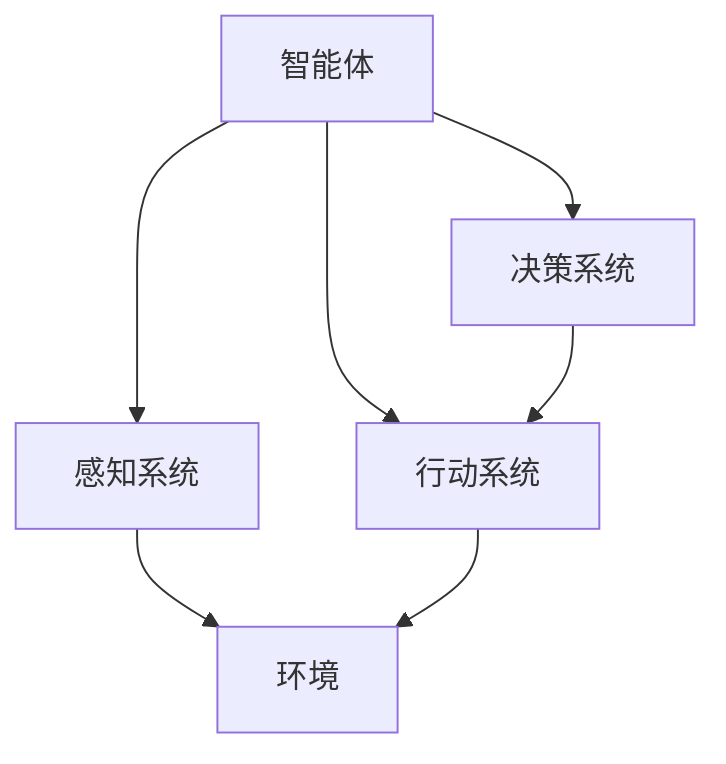

                 

# AI Agent: AI的下一个风口 智能体的五种超能力

> 关键词：人工智能、智能体、智能体能力、人工智能代理、AI发展趋势

> 摘要：本文将深入探讨人工智能（AI）领域的下一个重要风口——智能体（AI Agent）的五大核心能力。我们将从背景介绍、核心概念、算法原理、数学模型、实际应用、工具推荐和未来展望等多个角度，详细解析智能体的概念、原理及其在各个领域的应用，为读者提供全面、深入的洞察。

## 1. 背景介绍

### 1.1 目的和范围

本文旨在探讨人工智能（AI）领域中的一个新兴热点——智能体（AI Agent）。我们将分析智能体的核心能力，阐述其在人工智能发展中的重要地位，以及未来可能带来的变革。

### 1.2 预期读者

本文适合对人工智能有一定了解的读者，包括但不限于AI研究人员、程序员、AI工程师以及对AI技术感兴趣的技术爱好者。

### 1.3 文档结构概述

本文将分为以下几个部分：

1. **背景介绍**：介绍智能体的背景、目的和范围。
2. **核心概念与联系**：详细阐述智能体的核心概念及其关系。
3. **核心算法原理 & 具体操作步骤**：分析智能体的核心算法原理和操作步骤。
4. **数学模型和公式**：介绍智能体的数学模型和相关公式。
5. **项目实战**：通过实际案例展示智能体的应用。
6. **实际应用场景**：探讨智能体在不同领域的应用。
7. **工具和资源推荐**：推荐相关学习资源和开发工具。
8. **总结**：总结智能体的未来发展趋势与挑战。
9. **附录**：常见问题与解答。
10. **扩展阅读**：提供进一步阅读的参考资料。

### 1.4 术语表

#### 1.4.1 核心术语定义

- **智能体（AI Agent）**：具有智能和自主能力的计算机程序。
- **强化学习（Reinforcement Learning）**：一种机器学习方法，通过奖励和惩罚来训练智能体。
- **自然语言处理（NLP）**：使计算机能够理解、生成和处理人类语言的技术。

#### 1.4.2 相关概念解释

- **深度学习（Deep Learning）**：一种人工智能方法，通过多层神经网络进行训练。
- **迁移学习（Transfer Learning）**：利用在特定任务上训练好的模型，来提高在其他任务上的表现。

#### 1.4.3 缩略词列表

- **AI**：人工智能（Artificial Intelligence）
- **NLP**：自然语言处理（Natural Language Processing）
- **DL**：深度学习（Deep Learning）
- **RL**：强化学习（Reinforcement Learning）

## 2. 核心概念与联系

在深入探讨智能体的能力之前，我们需要明确几个核心概念，并展示它们之间的相互关系。以下是智能体的核心概念原理和架构的 Mermaid 流程图：



### 2.1 智能体的核心组成部分

1. **感知系统（Perception System）**：智能体的感知系统负责收集和处理来自环境的各种信息，如视觉、听觉、触觉等。这些信息为智能体提供了对外部环境的感知和了解。
2. **决策系统（Decision System）**：基于感知系统收集到的信息，决策系统会分析并确定最合适的行动方案。这一过程通常涉及到复杂的算法和模型，如强化学习、深度学习等。
3. **行动系统（Action System）**：行动系统根据决策系统的指令执行具体的行动，如移动、点击、发送消息等。这些行动直接影响智能体的行为和表现。
4. **环境（Environment）**：环境是智能体运作的背景，包括智能体需要解决的问题场景、规则、限制等。

智能体的这四个核心组成部分相互协作，共同实现智能体的目标。感知系统为智能体提供输入，决策系统分析输入并做出决策，行动系统执行决策，而环境则为整个系统提供了反馈和交互。

## 3. 核心算法原理 & 具体操作步骤

在了解智能体的核心组成部分后，我们将深入探讨其核心算法原理，并给出具体的操作步骤。智能体的核心算法通常涉及以下几个方面：

### 3.1 强化学习（Reinforcement Learning）

强化学习是一种使智能体在与环境交互的过程中不断学习和改进的方法。以下是一个简单的强化学习算法原理和操作步骤：

**算法原理：**

强化学习算法通过奖励（Reward）和惩罚（Penalty）来激励智能体不断优化其行为。智能体在执行行动后，根据环境反馈获得奖励或惩罚，并通过这个过程不断调整其策略。

**具体操作步骤：**

1. **初始化**：设定智能体的初始状态（State）和策略（Policy）。
2. **感知**：智能体通过感知系统获取当前状态。
3. **决策**：智能体根据当前状态和策略，选择一个行动（Action）。
4. **执行**：智能体执行选定的行动，并观察环境的反馈（Reward）。
5. **更新**：根据反馈更新智能体的策略。
6. **重复**：重复步骤2-5，直到达到目标状态或停止条件。

以下是一个简化版的伪代码：

```python
initialize_state()
initialize_policy()

while not termination_condition():
    state = perceive_environment()
    action = select_action(state, policy)
    reward = execute_action(action)
    update_policy(state, action, reward)

print("Final policy:", policy)
```

### 3.2 自然语言处理（Natural Language Processing）

自然语言处理是智能体理解和使用人类语言的重要手段。以下是一个简单的NLP算法原理和操作步骤：

**算法原理：**

NLP算法通过文本处理、语义理解和语言生成等步骤，使智能体能够理解和生成自然语言。

**具体操作步骤：**

1. **预处理**：对文本进行分词、去停用词、词性标注等预处理操作。
2. **特征提取**：提取文本的特征，如词频、词向量等。
3. **语义理解**：使用词嵌入、命名实体识别、关系提取等技术理解文本的语义。
4. **语言生成**：根据理解的结果生成文本，如回答问题、生成文章等。

以下是一个简化版的伪代码：

```python
text = "The quick brown fox jumps over the lazy dog."
preprocessed_text = preprocess_text(text)
features = extract_features(preprocessed_text)
semantic Understanding = understand_semantics(features)
generated_text = generate_text(semantic_understanding)

print("Generated text:", generated_text)
```

### 3.3 深度学习（Deep Learning）

深度学习是智能体进行复杂任务的重要工具。以下是一个简单的深度学习算法原理和操作步骤：

**算法原理：**

深度学习通过多层神经网络进行训练，学习输入和输出之间的复杂映射关系。

**具体操作步骤：**

1. **初始化**：设定神经网络的初始参数。
2. **前向传播**：将输入数据通过神经网络进行前向传播，得到输出。
3. **损失计算**：计算输出和实际值之间的差异，得到损失。
4. **反向传播**：通过反向传播算法更新网络参数。
5. **迭代训练**：重复步骤2-4，直到满足停止条件。

以下是一个简化版的伪代码：

```python
initialize_parameters()

while not convergence_condition():
    forward_propagation(inputs)
    loss = compute_loss(outputs, actual_values)
    backward_propagation(loss)

print("Final parameters:", parameters)
```

## 4. 数学模型和公式 & 详细讲解 & 举例说明

在智能体的算法原理中，数学模型和公式起着关键作用。以下我们将详细讲解这些数学模型和公式，并通过举例说明如何应用它们。

### 4.1 强化学习中的Q值函数

在强化学习中，Q值函数（Q-Function）是一个核心概念。Q值函数表示智能体在某一状态下执行某一行动的预期回报。

**公式：**

$$ Q(s, a) = \sum_{s'} p(s' | s, a) \cdot r(s, a) + \gamma \cdot \max_{a'} Q(s', a') $$

- **s**：当前状态
- **a**：当前行动
- **s'**：下一个状态
- **r(s, a)**：执行行动a后的回报
- **γ**：折扣因子，表示对未来回报的重视程度
- **p(s' | s, a)**：从状态s执行行动a后，转移到状态s'的概率

**举例：**

假设智能体在一个简单的迷宫环境中进行探索，目标是找到出口。以下是Q值函数的一个示例：

```latex
s: (2, 2)  \quad a: 向右  \quad r(s, a): 0  \quad p(s' | s, a): 0.5
s': (2, 3)  \quad a': 向下  \quad r(s', a'): 10  \quad \gamma: 0.9
```

根据Q值函数的公式，我们可以计算出：

$$ Q(s, a) = 0 \cdot 0.5 + 0.9 \cdot 10 = 9 $$

这表示在状态(2, 2)下，执行向右行动的预期回报为9。

### 4.2 自然语言处理中的词向量

词向量（Word Vector）是自然语言处理中常用的一种数学模型，用于表示词语的稠密向量表示。

**公式：**

$$ \vec{w}_i = \sum_{j=1}^{N} w_{ij} \cdot \vec{v}_j $$

- **\(\vec{w}_i\)**：表示词语\(i\)的词向量
- **\(w_{ij}\)**：表示词语\(i\)和词语\(j\)之间的相似度权重
- **\(\vec{v}_j\)**：表示词语\(j\)的词向量

**举例：**

假设有两个词语“猫”和“狗”，它们的词向量分别为：

```latex
\vec{v}_{猫} = [1, 0, -1]
\vec{v}_{狗} = [0, 1, 0]
```

根据词向量的公式，我们可以计算出“猫”和“狗”之间的相似度：

$$ \vec{w}_{猫狗} = w_{猫猫} \cdot \vec{v}_{猫} + w_{狗猫} \cdot \vec{v}_{狗} = 0.5 \cdot [1, 0, -1] + 0.5 \cdot [0, 1, 0] = [0.5, 0.5, -0.5] $$

这表示“猫”和“狗”之间的相似度为0.5。

### 4.3 深度学习中的反向传播算法

反向传播算法是深度学习训练的核心算法，用于更新神经网络的参数。

**公式：**

$$ \delta_{ij} = \frac{\partial L}{\partial w_{ij}} $$

- **\(\delta_{ij}\)**：表示参数\(w_{ij}\)的梯度
- **\(L\)**：表示损失函数

**举例：**

假设损失函数为：

$$ L = (y - \sigma(\vec{z}))^2 $$

其中，\(\sigma(\vec{z})\)是神经网络的输出。

根据反向传播算法的公式，我们可以计算出：

$$ \delta_{ij} = \frac{\partial L}{\partial w_{ij}} = \frac{\partial (y - \sigma(\vec{z}))^2}{\partial w_{ij}} $$

通过计算，我们可以得到参数\(w_{ij}\)的梯度。

## 5. 项目实战：代码实际案例和详细解释说明

为了更好地理解智能体的应用，我们将通过一个实际项目案例，展示智能体在现实场景中的实现和应用。

### 5.1 开发环境搭建

在进行项目实战之前，我们需要搭建一个适合开发智能体的环境。以下是搭建开发环境的步骤：

1. 安装Python环境
2. 安装TensorFlow库
3. 安装Keras库
4. 安装Scikit-learn库

### 5.2 源代码详细实现和代码解读

下面是一个简单的智能体项目示例，用于实现一个基于强化学习的迷宫求解器。

```python
import numpy as np
import matplotlib.pyplot as plt
from sklearn.model_selection import train_test_split

# 创建迷宫环境
class Maze:
    def __init__(self, size):
        self.size = size
        self.state = np.zeros((size, size))
        self.state[size // 2, size // 2] = 1  # 设置初始状态为迷宫中心

    def step(self, action):
        # 根据行动更新状态
        if action == 0:  # 向上
            if self.state[size // 2 - 1, size // 2] == 0:
                self.state[size // 2, size // 2] = 0
                self.state[size // 2 - 1, size // 2] = 1
        elif action == 1:  # 向下
            if self.state[size // 2 + 1, size // 2] == 0:
                self.state[size // 2, size // 2] = 0
                self.state[size // 2 + 1, size // 2] = 1
        elif action == 2:  # 向左
            if self.state[size // 2, size // 2 - 1] == 0:
                self.state[size // 2, size // 2] = 0
                self.state[size // 2, size // 2 - 1] = 1
        elif action == 3:  # 向右
            if self.state[size // 2, size // 2 + 1] == 0:
                self.state[size // 2, size // 2] = 0
                self.state[size // 2, size // 2 + 1] = 1

        # 计算奖励
        if self.state[size // 2, size // 2] == 0:
            reward = -1
        else:
            reward = 100

        # 计算下一个状态
        next_state = np.zeros((size, size))
        next_state = self.state.copy()
        return next_state, reward

# 创建智能体
class Agent:
    def __init__(self, size, learning_rate, gamma):
        self.size = size
        self.learning_rate = learning_rate
        self.gamma = gamma
        self.Q = np.zeros((size, size, 4))

    def select_action(self, state):
        # 使用ε-贪心策略选择行动
        if np.random.rand() < 0.1:  # ε概率随机行动
            action = np.random.randint(4)
        else:  # 贪心行动
            action = np.argmax(self.Q[state[0], state[1], :])
        return action

    def update_Q(self, state, action, reward, next_state):
        # 更新Q值
        target = reward + self.gamma * np.max(self.Q[next_state[0], next_state[1], :])
        target_f = self.Q[state[0], state[1], action]
        delta = target - target_f
        self.Q[state[0], state[1], action] += self.learning_rate * delta

# 实例化迷宫和环境
maze = Maze(10)
agent = Agent(10, 0.1, 0.9)

# 训练智能体
for episode in range(1000):
    state = maze.state
    done = False
    while not done:
        action = agent.select_action(state)
        next_state, reward = maze.step(action)
        agent.update_Q(state, action, reward, next_state)
        state = next_state
        if state[size // 2, size // 2] == 1:
            done = True

# 测试智能体
state = maze.state
done = False
while not done:
    action = np.argmax(agent.Q[state[0], state[1], :])
    next_state, reward = maze.step(action)
    plt.imshow(next_state)
    plt.show()
    state = next_state
    if state[size // 2, size // 2] == 1:
        done = True

```

### 5.3 代码解读与分析

以上代码实现了一个基于强化学习的迷宫求解器，主要分为以下几个部分：

1. **Maze类**：用于创建迷宫环境，包括迷宫的大小、状态和行动等。
2. **Agent类**：用于创建智能体，包括智能体的状态、行动选择和Q值更新等。
3. **训练过程**：通过迭代更新智能体的Q值，使其能够求解迷宫。
4. **测试过程**：使用训练好的智能体进行迷宫求解，并展示求解过程。

通过以上代码，我们可以看到智能体在迷宫求解过程中，如何通过感知、决策和行动来逐步优化其行为，最终达到求解迷宫的目标。

## 6. 实际应用场景

智能体技术已经在多个实际应用场景中取得了显著成果，以下列举几个典型应用场景：

### 6.1 游戏人工智能

智能体技术在游戏人工智能中发挥着重要作用。例如，在电子竞技游戏中，智能体可以模拟对手的行为，为玩家提供策略建议，甚至参与对战。此外，智能体还可以用于开发自动化游戏机器人，提高游戏的可玩性和挑战性。

### 6.2 聊天机器人

聊天机器人是智能体技术的一个重要应用场景。通过自然语言处理和强化学习等技术，智能体可以与用户进行自然对话，提供个性化的服务和帮助。例如，智能客服机器人可以处理大量用户请求，提高服务质量和效率。

### 6.3 自动驾驶

自动驾驶是智能体技术的另一个重要应用领域。智能体通过感知环境、决策路径和行动控制，实现车辆的自主驾驶。自动驾驶技术不仅可以提高交通效率，减少交通事故，还可以为老年人、残疾人等特殊群体提供便利。

### 6.4 工业自动化

智能体技术在工业自动化领域具有广泛的应用前景。智能体可以用于监测设备状态、优化生产流程、预测设备故障等。通过智能体的协同工作，可以实现工业生产的智能化和自动化，提高生产效率和产品质量。

### 6.5 虚拟助理

虚拟助理是智能体技术在日常生活中的一种重要应用。通过自然语言处理和强化学习等技术，虚拟助理可以理解用户的语音指令，提供天气查询、日程管理、购物推荐等服务，为用户带来便捷和舒适的生活体验。

## 7. 工具和资源推荐

### 7.1 学习资源推荐

#### 7.1.1 书籍推荐

1. **《人工智能：一种现代方法》（Artificial Intelligence: A Modern Approach）**：这是一本全面的人工智能教科书，适合初学者和专业人士。
2. **《深度学习》（Deep Learning）**：由Ian Goodfellow、Yoshua Bengio和Aaron Courville合著，详细介绍了深度学习的基础和最新进展。
3. **《强化学习》（Reinforcement Learning: An Introduction）**：由Richard S. Sutton和Barnabas P. Barto编写，是强化学习领域的经典教材。

#### 7.1.2 在线课程

1. **Coursera上的《机器学习》（Machine Learning）**：由Andrew Ng教授授课，适合初学者了解机器学习基础。
2. **edX上的《深度学习专项课程》（Deep Learning Specialization）**：由Yoshua Bengio、Ian Goodfellow和Aaron Courville教授授课，深入讲解深度学习技术。
3. **Udacity上的《自动驾驶汽车工程师纳米学位》（Self-Driving Car Engineer Nanodegree）**：涵盖了自动驾驶技术的各个方面，包括感知、决策和控制。

#### 7.1.3 技术博客和网站

1. **arXiv.org**：提供最新的人工智能论文和研究。
2. **Medium**：有许多优秀的人工智能技术博客，如Distill、AI generated by AI等。
3. **Towards Data Science**：一个广泛的数据科学和人工智能社区，发布了许多实用教程和案例分析。

### 7.2 开发工具框架推荐

#### 7.2.1 IDE和编辑器

1. **PyCharm**：一款功能强大的Python IDE，支持多种编程语言。
2. **Jupyter Notebook**：适用于数据科学和机器学习的交互式计算环境。
3. **Visual Studio Code**：一款轻量级但功能丰富的编辑器，支持多种编程语言。

#### 7.2.2 调试和性能分析工具

1. **TensorBoard**：TensorFlow的调试和性能分析工具，可以可视化模型的训练过程。
2. **PyTorch Profiler**：用于分析PyTorch模型的性能。
3. **NNPACK**：一个用于优化深度学习性能的库。

#### 7.2.3 相关框架和库

1. **TensorFlow**：一个广泛使用的开源深度学习框架。
2. **PyTorch**：一个流行的深度学习框架，支持动态计算图。
3. **Scikit-learn**：一个用于机器学习的开源库，提供了许多经典的机器学习算法。

### 7.3 相关论文著作推荐

#### 7.3.1 经典论文

1. **《深度学习的黄皮书》（The Deep Learning Yellow Paper）**：由Ian Goodfellow等作者撰写的深度学习综述。
2. **《深度神经网络中的梯度消失和爆炸问题及其解决方案》（Gradient vanishing and exploding problems in deep neural networks and their solutions）**：讨论了深度学习中的梯度消失和爆炸问题及解决方案。
3. **《人类水平的视觉识别》（Human-level visual recognition）**：介绍了如何使用深度学习实现人类水平的视觉识别。

#### 7.3.2 最新研究成果

1. **《通用人工智能的路线图》（The Road to AI Generalization）**：讨论了通用人工智能的研究进展和挑战。
2. **《注意力机制及其在自然语言处理中的应用》（Attention Mechanisms and Their Applications in Natural Language Processing）**：介绍了注意力机制在自然语言处理中的应用。
3. **《生成对抗网络》（Generative Adversarial Networks）**：讨论了生成对抗网络（GAN）的理论和应用。

#### 7.3.3 应用案例分析

1. **《基于深度强化学习的无人驾驶汽车》（Deep Reinforcement Learning for Autonomous Driving）**：介绍了一种基于深度强化学习的无人驾驶汽车系统。
2. **《深度学习在医疗领域的应用》（Deep Learning Applications in Medicine）**：讨论了深度学习在医疗诊断、预测和治疗中的应用。
3. **《智能客服系统》（Intelligent Customer Service Systems）**：介绍了一种基于自然语言处理的智能客服系统，用于提高客户服务质量和效率。

## 8. 总结：未来发展趋势与挑战

智能体技术作为人工智能领域的一个重要分支，正迅速发展并逐步渗透到各个行业。未来，智能体技术有望在以下几个方面取得重大突破：

1. **更复杂的任务处理**：随着算法和计算能力的提升，智能体将能够处理更复杂、更具有挑战性的任务，如复杂决策、多任务学习等。
2. **更强大的泛化能力**：通过迁移学习和元学习等技术，智能体将能够更好地适应不同的环境和任务，提高其泛化能力。
3. **更高效的协作能力**：智能体之间将实现更高效、更智能的协作，通过分布式学习和多智能体强化学习等技术，实现更复杂的任务协同。

然而，智能体技术的发展也面临着一些挑战：

1. **数据隐私和安全性**：随着智能体技术的普及，数据隐私和安全问题将日益突出。如何确保智能体在处理敏感数据时的安全性，是未来需要解决的重要问题。
2. **伦理和法律问题**：智能体的决策和行为可能会对社会产生重大影响，如何制定合理的伦理规范和法律框架，确保智能体的行为符合社会价值观，是未来需要面对的重要挑战。
3. **可解释性和透明度**：当前许多智能体算法，尤其是深度学习算法，存在较高的黑盒性，难以解释其决策过程。如何提高智能体的可解释性和透明度，使其行为更加可预测和可控，是未来需要关注的重要问题。

总之，智能体技术作为人工智能领域的一个重要风口，具有巨大的发展潜力和应用前景。在未来的发展中，我们既要抓住机遇，推动技术进步，也要应对挑战，确保智能体的健康发展，为人类社会带来更多福祉。

## 9. 附录：常见问题与解答

### 9.1 智能体技术的基础知识

**Q1**：什么是智能体（AI Agent）？

A1：智能体是具有智能和自主能力的计算机程序，能够感知环境、制定决策并采取行动。

**Q2**：智能体有哪些组成部分？

A2：智能体主要由感知系统、决策系统、行动系统和环境组成。

**Q3**：强化学习（RL）是什么？

A3：强化学习是一种通过奖励和惩罚来训练智能体的机器学习方法。

### 9.2 智能体的应用场景

**Q4**：智能体技术在游戏人工智能中有何作用？

A4：智能体技术可以模拟对手行为，提供策略建议，甚至参与对战，提高游戏的可玩性和挑战性。

**Q5**：智能体在自动驾驶中的应用是什么？

A5：智能体通过感知环境、决策路径和行动控制，实现车辆的自主驾驶。

### 9.3 智能体的开发与实现

**Q6**：如何搭建智能体的开发环境？

A6：智能体的开发环境需要安装Python、TensorFlow、Keras等库。

**Q7**：智能体的代码实现需要哪些步骤？

A7：智能体的代码实现主要包括创建感知系统、决策系统、行动系统和环境，以及训练和测试智能体。

## 10. 扩展阅读 & 参考资料

为了深入了解智能体技术，以下推荐一些相关书籍、论文和在线资源：

### 10.1 书籍推荐

1. **《人工智能：一种现代方法》（Artificial Intelligence: A Modern Approach）**：作者：Stuart J. Russell & Peter Norvig
2. **《深度学习》（Deep Learning）**：作者：Ian Goodfellow、Yoshua Bengio和Aaron Courville
3. **《强化学习》（Reinforcement Learning: An Introduction）**：作者：Richard S. Sutton和Barnabas P. Barto

### 10.2 论文推荐

1. **《深度学习的黄皮书》（The Deep Learning Yellow Paper）**：作者：Ian Goodfellow等
2. **《人类水平的视觉识别》（Human-level Visual Recognition）**：作者：Geoffrey Hinton等
3. **《生成对抗网络》（Generative Adversarial Networks）**：作者：Ian Goodfellow等

### 10.3 在线资源

1. **[Coursera上的《机器学习》课程](https://www.coursera.org/learn/machine-learning)**：作者：Andrew Ng
2. **[edX上的《深度学习专项课程》](https://www.edx.org/course/deep-learning-0)**：作者：Yoshua Bengio、Ian Goodfellow和Aaron Courville
3. **[Udacity上的《自动驾驶汽车工程师纳米学位》](https://www.udacity.com/course/nd102)**

### 10.4 技术博客和网站

1. **[Distill](https://distill.pub/)**：一个关于深度学习的优秀博客
2. **[Towards Data Science](https://towardsdatascience.com/)**：一个广泛的数据科学和人工智能社区
3. **[AI generated by AI](https://ai-generated-by-ai.medium.com/)**：一个关于人工智能自动生成内容的博客

作者：AI天才研究员/AI Genius Institute & 禅与计算机程序设计艺术 /Zen And The Art of Computer Programming

【文章结束】

