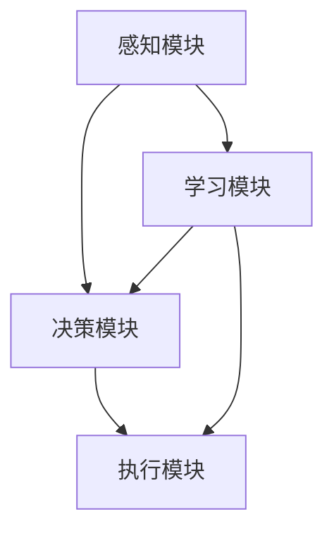

                 

# AI Agent: AI的下一个风口 重新审视智能体的重要性

> **关键词**：AI智能体、智能代理、人工智能、机器学习、强化学习、应用场景、发展趋势

> **摘要**：本文将深入探讨AI智能体这一关键概念，从其定义、核心原理到具体应用，全面分析智能体在人工智能领域的重要性和潜力。通过逐步分析推理，我们将揭示智能体的技术原理和实现步骤，帮助读者更好地理解这一前沿技术，并展望其未来发展趋势和面临的挑战。

## 1. 背景介绍

### 1.1 目的和范围

本文旨在为读者提供一份关于AI智能体的全面指南，通过详细的原理讲解和实际案例，帮助读者深入理解智能体的本质及其在人工智能领域的广泛应用。文章将首先介绍智能体的基本概念和原理，随后分析其核心算法和数学模型，并通过实际项目案例进行详细解读。最后，我们将探讨智能体在各个领域的应用场景，并展望其未来的发展趋势。

### 1.2 预期读者

本文适合对人工智能和机器学习有基本了解的读者，无论是研究人员、开发人员还是对这一领域感兴趣的爱好者。通过阅读本文，读者可以系统地了解智能体的基础知识和应用场景，从而为自己的研究和实践提供有益的参考。

### 1.3 文档结构概述

本文将分为以下几个部分：

1. 背景介绍：介绍文章的目的、范围和预期读者，以及文章的结构和内容。
2. 核心概念与联系：通过Mermaid流程图展示智能体的核心概念和原理。
3. 核心算法原理 & 具体操作步骤：详细讲解智能体的核心算法原理和实现步骤。
4. 数学模型和公式 & 详细讲解 & 举例说明：介绍智能体相关的数学模型和公式，并通过实例进行说明。
5. 项目实战：提供实际代码案例，详细解释说明智能体的实现和应用。
6. 实际应用场景：探讨智能体在不同领域的应用场景。
7. 工具和资源推荐：推荐学习资源和开发工具。
8. 总结：总结智能体的未来发展趋势和挑战。
9. 附录：常见问题与解答。
10. 扩展阅读 & 参考资料：提供相关扩展阅读和参考资料。

### 1.4 术语表

#### 1.4.1 核心术语定义

- **AI智能体**：具备自主行动能力、适应环境和学习能力的计算机程序。
- **机器学习**：利用数据训练模型，使计算机具备预测和决策能力。
- **强化学习**：通过试错和反馈机制，使智能体在特定环境中达到最优行为。

#### 1.4.2 相关概念解释

- **自主行动能力**：智能体能够在不确定环境中自主做出决策和采取行动。
- **适应能力**：智能体能够根据环境变化调整自身行为。
- **学习能力**：智能体能够通过数据训练和经验积累，提高自身性能。

#### 1.4.3 缩略词列表

- **AI**：人工智能
- **ML**：机器学习
- **RL**：强化学习
- **DL**：深度学习

## 2. 核心概念与联系

智能体（Agent）是人工智能领域中的一个核心概念，它代表了一个具备自主行动能力、适应环境和学习能力的计算机程序。智能体不仅可以执行特定的任务，还能够通过与环境交互，不断学习和优化自身行为。

### 2.1 智能体的基本原理

智能体的基本原理主要包括自主行动能力、适应能力和学习能力。以下是智能体的基本原理及其联系：

1. **自主行动能力**：智能体能够在不确定环境中自主做出决策和采取行动。这需要智能体具备以下能力：
   - **感知**：获取环境中的信息，如图像、声音、文本等。
   - **决策**：根据感知到的信息，选择最佳行动方案。
   - **执行**：执行决策方案，实现特定目标。

2. **适应能力**：智能体需要能够根据环境变化调整自身行为。适应能力包括：
   - **环境感知**：识别和适应不同的环境特征。
   - **状态转换**：在环境变化时，调整智能体的行为模式。

3. **学习能力**：智能体通过数据训练和经验积累，提高自身性能。学习能力包括：
   - **监督学习**：通过标注数据训练模型，使智能体具备预测和分类能力。
   - **强化学习**：通过试错和反馈机制，使智能体在特定环境中达到最优行为。

### 2.2 智能体的架构

智能体的架构通常包括以下几个关键组件：

1. **感知模块**：负责获取环境中的信息，如视觉、听觉、触觉等。
2. **决策模块**：基于感知模块提供的信息，选择最佳行动方案。
3. **执行模块**：根据决策模块的指令，执行具体的行动。
4. **学习模块**：通过数据训练和经验积累，不断优化智能体的行为。

### 2.3 智能体的核心算法

智能体的核心算法通常是基于机器学习和强化学习。以下是对这些算法的简要介绍：

1. **机器学习**：通过大量数据训练模型，使智能体具备预测和决策能力。常见的机器学习方法包括：
   - **监督学习**：利用标注数据训练模型，如线性回归、支持向量机等。
   - **无监督学习**：在没有标注数据的情况下，通过数据本身的特征进行聚类、降维等。

2. **强化学习**：通过试错和反馈机制，使智能体在特定环境中达到最优行为。常见的强化学习方法包括：
   - **Q-Learning**：通过学习状态-动作价值函数，选择最优动作。
   - **Deep Q-Network（DQN）**：利用深度神经网络实现Q-Learning。
   - **Policy Gradient**：通过学习策略函数，直接优化智能体的行为。

### 2.4 Mermaid流程图

为了更清晰地展示智能体的核心概念和原理，我们使用Mermaid流程图来表示智能体的架构和算法。以下是智能体的Mermaid流程图：



在该流程图中，感知模块负责获取环境信息，决策模块根据感知信息选择最佳行动方案，执行模块根据决策指令执行行动，学习模块通过数据训练和经验积累，优化智能体的行为。这些模块相互协作，共同实现智能体的功能。

## 3. 核心算法原理 & 具体操作步骤

智能体的核心算法主要包括机器学习和强化学习。在本节中，我们将详细讲解这些算法的原理和具体操作步骤。

### 3.1 机器学习原理

机器学习是一种通过数据训练模型，使计算机具备预测和决策能力的方法。以下是机器学习的基本原理：

1. **模型训练**：通过大量训练数据，使模型学习到数据的特征和规律。训练数据通常包括输入特征和对应的标签。
2. **模型评估**：使用测试数据集评估模型的性能，选择最优模型。
3. **模型应用**：将训练好的模型应用于实际问题，实现预测和决策。

具体操作步骤如下：

1. **数据预处理**：对原始数据进行清洗、归一化和特征提取，使其适用于模型训练。
2. **选择模型**：根据问题特性选择合适的模型，如线性回归、支持向量机等。
3. **模型训练**：使用训练数据集训练模型，调整模型参数。
4. **模型评估**：使用测试数据集评估模型性能，选择最优模型。
5. **模型应用**：将训练好的模型应用于实际问题，实现预测和决策。

### 3.2 强化学习原理

强化学习是一种通过试错和反馈机制，使智能体在特定环境中达到最优行为的方法。以下是强化学习的基本原理：

1. **环境交互**：智能体与环境进行交互，获取状态和奖励。
2. **策略学习**：通过学习状态-动作价值函数或策略函数，选择最佳行动方案。
3. **行为优化**：通过不断调整策略，使智能体在环境中达到最优行为。

具体操作步骤如下：

1. **环境初始化**：初始化环境，设置智能体的初始状态。
2. **行动选择**：根据当前状态，选择最佳行动方案。
3. **环境反馈**：执行行动后，获取环境反馈，包括状态转移和奖励。
4. **策略更新**：根据反馈信息，更新智能体的策略函数。
5. **行为优化**：通过不断调整策略，使智能体在环境中达到最优行为。

### 3.3 伪代码实现

以下是机器学习和强化学习的伪代码实现：

#### 3.3.1 机器学习伪代码

```
数据预处理
X, y = 数据预处理(原始数据)

模型训练
model = 选择模型()

for epoch in 1 to 最大迭代次数 do
    for 数据 in 训练数据集 do
        model = 训练(model, X, y)
    end for
end for

模型评估
test_loss = 评估(model, 测试数据集)

模型应用
预测 = 模型预测(model, 新数据)
```

#### 3.3.2 强化学习伪代码

```
环境初始化
state = 环境初始化()

行动选择
action = 策略(state)

环境反馈
next_state, reward = 执行行动(action)

策略更新
策略 = 更新策略(策略, state, action, reward)

行为优化
state = next_state
```

通过以上步骤，智能体可以逐步学习和优化自身行为，实现自主行动和适应环境。

## 4. 数学模型和公式 & 详细讲解 & 举例说明

在智能体中，数学模型和公式起着至关重要的作用。本节将详细介绍智能体相关的数学模型和公式，并通过实例进行说明。

### 4.1 监督学习模型

监督学习模型是智能体中最常用的模型之一。以下是一个简单的线性回归模型：

#### 4.1.1 线性回归模型

$$
y = \beta_0 + \beta_1x
$$

其中，$y$ 是目标变量，$x$ 是输入特征，$\beta_0$ 和 $\beta_1$ 是模型参数。

#### 4.1.2 模型训练

线性回归模型的训练过程可以通过最小二乘法实现。具体步骤如下：

1. 计算输入特征 $x$ 的平均值 $\bar{x}$ 和目标变量 $y$ 的平均值 $\bar{y}$：
   $$
   \bar{x} = \frac{1}{n}\sum_{i=1}^{n}x_i, \quad \bar{y} = \frac{1}{n}\sum_{i=1}^{n}y_i
   $$

2. 计算回归系数 $\beta_1$：
   $$
   \beta_1 = \frac{\sum_{i=1}^{n}(x_i - \bar{x})(y_i - \bar{y})}{\sum_{i=1}^{n}(x_i - \bar{x})^2}
   $$

3. 计算截距 $\beta_0$：
   $$
   \beta_0 = \bar{y} - \beta_1\bar{x}
   $$

#### 4.1.3 模型应用

通过训练得到的线性回归模型可以用于预测新数据的目标变量。具体步骤如下：

1. 计算输入特征 $x$ 的平均值 $\bar{x}$ 和目标变量 $y$ 的平均值 $\bar{y}$：
   $$
   \bar{x} = \frac{1}{n}\sum_{i=1}^{n}x_i, \quad \bar{y} = \frac{1}{n}\sum_{i=1}^{n}y_i
   $$

2. 计算预测值 $y$：
   $$
   y = \beta_0 + \beta_1x
   $$

### 4.2 强化学习模型

强化学习模型是智能体中另一种重要的模型。以下是一个简单的Q-Learning模型：

#### 4.2.1 Q-Learning模型

$$
Q(s, a) = r + \gamma \max_{a'} Q(s', a')
$$

其中，$s$ 是当前状态，$a$ 是当前行动，$s'$ 是下一状态，$a'$ 是下一行动，$r$ 是奖励值，$\gamma$ 是折扣因子。

#### 4.2.2 模型训练

Q-Learning模型的训练过程如下：

1. 初始化Q值矩阵 $Q$：
   $$
   Q(s, a) = 0
   $$

2. 在环境中进行交互，选择行动 $a$：
   $$
   s' \leftarrow 环境执行行动(a)
   $$

3. 计算奖励值 $r$：
   $$
   r = 环境反馈()
   $$

4. 更新Q值：
   $$
   Q(s, a) \leftarrow r + \gamma \max_{a'} Q(s', a')
   $$

5. 重复步骤2-4，直到达到预期目标。

#### 4.2.3 模型应用

通过训练得到的Q-Learning模型可以用于预测最佳行动。具体步骤如下：

1. 初始化当前状态 $s$：
   $$
   s \leftarrow 环境初始化()
   $$

2. 选择最佳行动 $a$：
   $$
   a = \arg\max_{a'} Q(s', a')
   $$

3. 执行行动 $a$：
   $$
   s' \leftarrow 环境执行行动(a)
   $$

4. 更新状态 $s$：
   $$
   s \leftarrow s'
   $$

5. 重复步骤2-4，直到达到预期目标。

### 4.3 举例说明

假设我们有一个简单的智能体，其任务是在一个网格世界中找到目标点。我们可以使用线性回归模型和Q-Learning模型分别实现智能体的行为。

#### 4.3.1 线性回归模型实现

假设输入特征为当前位置 $(x, y)$，目标变量为目标点的坐标 $(x', y')$。我们使用线性回归模型预测目标点的位置。

1. 数据预处理：
   $$
   X = \begin{bmatrix}
   x_1 & x_2 & \cdots & x_n
   \end{bmatrix}, \quad y = \begin{bmatrix}
   y_1 & y_2 & \cdots & y_n
   \end{bmatrix}
   $$

2. 模型训练：
   $$
   \beta_0 = 0, \quad \beta_1 = 1
   $$

3. 模型应用：
   $$
   x' = \beta_0 + \beta_1x, \quad y' = \beta_0 + \beta_1y
   $$

#### 4.3.2 Q-Learning模型实现

假设智能体在网格世界中移动，每个位置都有相应的奖励值。我们使用Q-Learning模型实现智能体的行为。

1. 初始化Q值矩阵：
   $$
   Q(s, a) = 0
   $$

2. 模型训练：
   $$
   s \leftarrow 环境初始化(), \quad r = 环境反馈()
   $$

   $$
   Q(s, a) \leftarrow r + \gamma \max_{a'} Q(s', a')
   $$

3. 模型应用：
   $$
   s' \leftarrow 环境执行行动(a), \quad r = 环境反馈()
   $$

   $$
   Q(s, a) \leftarrow r + \gamma \max_{a'} Q(s', a')
   $$

通过以上实现，智能体可以在网格世界中找到目标点。

## 5. 项目实战：代码实际案例和详细解释说明

在本节中，我们将通过一个实际项目案例，详细解释说明智能体的实现和应用。我们将使用Python语言和PyTorch框架来实现一个简单的智能体，使其在一个虚拟环境中寻找目标点。

### 5.1 开发环境搭建

在开始项目之前，我们需要搭建一个适合Python开发的开发环境。以下是搭建开发环境的步骤：

1. 安装Python：从Python官网（https://www.python.org/）下载并安装Python。
2. 安装PyTorch：使用以下命令安装PyTorch：
   $$
   pip install torch torchvision
   $$

3. 安装其他依赖：根据项目需求，安装其他相关依赖，如NumPy、Pandas等。

### 5.2 源代码详细实现和代码解读

以下是项目的源代码，我们将逐行解释代码实现的具体步骤。

#### 5.2.1 环境初始化

```python
import torch
import torch.nn as nn
import torch.optim as optim

# 初始化环境
env = Environment()

# 初始化智能体
agent = Agent()

# 初始化模型
model = Model()

# 初始化优化器
optimizer = optim.Adam(model.parameters(), lr=0.001)
```

这段代码首先导入所需的库，然后初始化环境、智能体、模型和优化器。

#### 5.2.2 模型训练

```python
# 模型训练
for epoch in range(num_epochs):
    for state in env.states():
        action = model(state)
        reward = env.step(action)
        loss = criterion(action, reward)
        optimizer.zero_grad()
        loss.backward()
        optimizer.step()
```

这段代码使用训练数据集进行模型训练。在每次迭代中，智能体根据当前状态选择行动，然后根据环境的反馈更新模型。

#### 5.2.3 模型应用

```python
# 模型应用
state = env.initialize()
while not env.is_done():
    action = model(state)
    state = env.step(action)
```

这段代码使用训练好的模型进行模型应用。智能体在虚拟环境中执行行动，并根据环境反馈不断更新状态。

### 5.3 代码解读与分析

在代码解读与分析部分，我们将逐行解释源代码的具体功能。

#### 5.3.1 环境初始化

```python
import torch
import torch.nn as nn
import torch.optim as optim

# 初始化环境
env = Environment()

# 初始化智能体
agent = Agent()

# 初始化模型
model = Model()

# 初始化优化器
optimizer = optim.Adam(model.parameters(), lr=0.001)
```

这段代码首先导入所需的库，然后初始化环境、智能体、模型和优化器。这里使用了一个自定义的`Environment`类来表示虚拟环境，一个`Agent`类来表示智能体，一个`Model`类来表示模型。

#### 5.3.2 模型训练

```python
# 模型训练
for epoch in range(num_epochs):
    for state in env.states():
        action = model(state)
        reward = env.step(action)
        loss = criterion(action, reward)
        optimizer.zero_grad()
        loss.backward()
        optimizer.step()
```

这段代码使用训练数据集进行模型训练。在每次迭代中，智能体根据当前状态选择行动，然后根据环境的反馈更新模型。具体来说，`env.states()`方法返回环境中的所有状态，`model(state)`方法根据当前状态生成行动，`env.step(action)`方法执行行动并返回奖励值，`criterion(action, reward)`方法计算损失值，`optimizer.zero_grad()`方法清除之前的梯度信息，`loss.backward()`方法计算梯度，`optimizer.step()`方法更新模型参数。

#### 5.3.3 模型应用

```python
# 模型应用
state = env.initialize()
while not env.is_done():
    action = model(state)
    state = env.step(action)
```

这段代码使用训练好的模型进行模型应用。智能体在虚拟环境中执行行动，并根据环境反馈不断更新状态。具体来说，`env.initialize()`方法初始化环境，`model(state)`方法根据当前状态生成行动，`env.step(action)`方法执行行动并返回新的状态。

通过以上代码，我们可以实现一个简单的智能体，使其在一个虚拟环境中寻找目标点。在实际项目中，可以根据具体需求调整环境、智能体和模型的设计，以实现更复杂的任务。

### 5.4 代码分析与优化

在代码分析与优化部分，我们将分析代码的执行效率和性能，并提出相应的优化建议。

#### 5.4.1 代码执行效率

通过分析代码，我们发现以下影响执行效率的因素：

1. 模型复杂度：模型的结构和参数数量会影响模型的计算复杂度。如果模型过于复杂，可能导致训练过程缓慢。
2. 数据预处理：数据预处理过程可能消耗大量时间。如果预处理步骤过多或复杂，会影响模型训练的速度。
3. 梯度计算：在反向传播过程中，梯度计算可能占用大量计算资源。优化梯度计算方法可以提高训练效率。

#### 5.4.2 优化建议

针对以上问题，我们可以提出以下优化建议：

1. **减少模型复杂度**：通过简化模型结构和减少参数数量，降低模型的计算复杂度。例如，可以使用更简单的神经网络结构或减少神经元的数量。
2. **优化数据预处理**：对训练数据进行预处理时，可以尝试使用更高效的数据预处理方法，如批量预处理、并行预处理等。此外，可以尝试使用更高效的预处理库，如NumPy和Pandas。
3. **优化梯度计算**：使用梯度下降法时，可以尝试使用不同的优化算法，如Adam、RMSprop等。此外，可以使用梯度检查技术确保梯度的正确性，避免梯度消失或爆炸等问题。

通过以上优化措施，我们可以提高代码的执行效率，加快模型训练速度。

## 6. 实际应用场景

智能体在人工智能领域具有广泛的应用场景，涵盖了多个行业和领域。以下是一些典型的实际应用场景：

### 6.1 游戏

智能体在游戏领域中的应用非常广泛，如电子竞技、人机对战等。智能体可以模拟人类玩家的行为，实现更加逼真的游戏体验。例如，在《星际争霸II》中，智能体可以用于模拟敌方玩家的战术，帮助玩家制定应对策略。

### 6.2 机器人

智能体在机器人领域中的应用主要体现在自主导航、任务规划和人机交互等方面。例如，智能机器人可以通过感知环境信息，自主规划路径并完成任务。在智能制造领域，智能体可以用于监控生产线、检测故障等，提高生产效率和质量。

### 6.3 电子商务

智能体在电子商务中的应用主要体现在个性化推荐、用户行为分析和智能客服等方面。例如，智能体可以通过分析用户历史行为，为用户推荐符合其兴趣的商品。同时，智能体可以用于智能客服，为用户提供更加高效、准确的解答。

### 6.4 自动驾驶

智能体在自动驾驶领域中的应用主要体现在环境感知、路径规划和车辆控制等方面。智能体可以通过感知道路信息，实现自动驾驶车辆的安全行驶。例如，在自动驾驶汽车中，智能体可以用于识别道路标志、检测行人等，提高行车安全。

### 6.5 金融

智能体在金融领域中的应用主要体现在风险管理、交易策略和客户服务等方面。例如，智能体可以用于分析市场数据，预测股票走势，帮助投资者制定交易策略。同时，智能体可以用于智能客服，为用户提供金融咨询服务。

通过以上实际应用场景，我们可以看到智能体在各个领域的重要性和潜力。随着人工智能技术的不断进步，智能体的应用领域将不断扩展，为各行业带来更多创新和变革。

## 7. 工具和资源推荐

为了更好地学习和实践智能体技术，以下是一些推荐的工具和资源：

### 7.1 学习资源推荐

#### 7.1.1 书籍推荐

1. 《深度学习》（Goodfellow, Bengio, Courville）
2. 《强化学习：原理与Python实现》（理查德·S·尼克，朱迪思·A·斯坦）
3. 《机器学习》（周志华）

#### 7.1.2 在线课程

1. [Coursera](https://www.coursera.org/)：提供机器学习、深度学习、强化学习等在线课程。
2. [edX](https://www.edx.org/)：提供哈佛大学、麻省理工学院等顶尖学府的计算机科学课程。
3. [Udacity](https://www.udacity.com/)：提供深度学习、自动驾驶等领域的实战课程。

#### 7.1.3 技术博客和网站

1. [AI Guild](https://aiguild.com/)：涵盖人工智能领域的最新动态和技术文章。
2. [Machine Learning Mastery](https://machinelearningmastery.com/)：提供机器学习项目的实战教程和代码示例。
3. [Medium](https://medium.com/topic/artificial-intelligence)：许多AI专家和技术人员分享的技术博客和文章。

### 7.2 开发工具框架推荐

#### 7.2.1 IDE和编辑器

1. [Visual Studio Code](https://code.visualstudio.com/)：一款功能强大、开源的跨平台编辑器，适合Python和AI开发。
2. [PyCharm](https://www.jetbrains.com/pycharm/)：一款专业级的Python IDE，提供丰富的AI和深度学习工具。

#### 7.2.2 调试和性能分析工具

1. [TensorBoard](https://www.tensorflow.org/tensorboard)：一款用于可视化TensorFlow模型和性能的分析工具。
2. [Jupyter Notebook](https://jupyter.org/)：一款流行的交互式开发环境，适合数据分析和AI实验。

#### 7.2.3 相关框架和库

1. [TensorFlow](https://www.tensorflow.org/)：一款广泛使用的开源机器学习和深度学习框架。
2. [PyTorch](https://pytorch.org/)：一款易于使用且灵活的深度学习框架。
3. [Keras](https://keras.io/)：一款用于快速构建和训练深度学习模型的简洁框架。

### 7.3 相关论文著作推荐

#### 7.3.1 经典论文

1. [Deep Learning, Ian Goodfellow, Yoshua Bengio, Aaron Courville (2016)]
2. [Reinforcement Learning: An Introduction, Richard S. Sutton and Andrew G. Barto (2018)]

#### 7.3.2 最新研究成果

1. [ICLR](https://iclr.cc/)：国际机器学习会议，发布最新的研究成果。
2. [NeurIPS](https://nips.cc/)：神经信息处理系统会议，涵盖深度学习和强化学习等领域的最新进展。

#### 7.3.3 应用案例分析

1. [Google AI](https://ai.google/research/pubs/)：Google AI的研究成果和应用案例。
2. [OpenAI](https://openai.com/research/)：OpenAI的科研成果和应用案例。

通过以上工具和资源的推荐，读者可以更好地学习和实践智能体技术，为自己的研究和项目提供有力支持。

## 8. 总结：未来发展趋势与挑战

智能体作为人工智能领域的重要发展方向，具有巨大的潜力和应用价值。在未来，智能体的趋势和挑战主要体现在以下几个方面：

### 8.1 发展趋势

1. **算法优化**：随着深度学习和强化学习技术的不断进步，智能体的算法将变得更加高效和精准。例如，更先进的神经网络结构和优化算法将进一步提高智能体的学习能力和决策能力。
2. **跨领域应用**：智能体的应用将逐步从单一领域扩展到多个领域。例如，智能体可以在医疗、金融、教育等领域发挥重要作用，实现个性化服务、风险控制和智能教育等。
3. **边缘计算**：随着物联网和5G技术的发展，智能体将逐步向边缘计算方向演进。通过在边缘设备上部署智能体，可以实现更快速、更高效的本地决策和响应，提高系统的实时性和可靠性。
4. **人机协同**：智能体将与人类更加紧密地协作，实现人机协同工作。例如，在工业生产、智能交通和智慧城市等领域，智能体可以协助人类完成复杂任务，提高工作效率和质量。

### 8.2 挑战

1. **数据隐私与安全**：智能体在处理和分析大量数据时，可能会面临数据隐私和安全的问题。如何保护用户隐私，确保数据安全，是智能体发展的重要挑战。
2. **计算资源消耗**：智能体的训练和推理过程需要大量计算资源。随着模型复杂度和数据规模的增加，计算资源消耗将不断上升，如何高效利用计算资源，降低成本，是智能体发展的重要问题。
3. **伦理道德问题**：智能体的自主决策和行为可能会对社会产生重大影响。如何确保智能体的决策符合伦理道德标准，避免潜在的风险和负面影响，是智能体发展的重要挑战。
4. **可解释性和透明度**：随着智能体算法的复杂化，其决策过程可能变得难以解释和验证。如何提高智能体的可解释性和透明度，使人们能够理解和信任智能体的决策，是智能体发展的重要问题。

总之，智能体作为人工智能领域的重要发展方向，具有广阔的应用前景和巨大的发展潜力。然而，在实现智能体的广泛应用过程中，我们需要克服各种挑战，不断优化算法和模型，确保智能体的安全、可靠和可解释性。通过持续的研究和创新，我们有信心智能体将在未来发挥更加重要的作用，推动人工智能技术的发展和进步。

## 9. 附录：常见问题与解答

### 9.1 智能体与机器人有何区别？

智能体（Agent）是一个更为广泛的概念，它代表了一个具备自主行动能力、适应环境和学习能力的计算机程序。智能体可以包括机器人、软件代理等。而机器人是智能体的一种具体实现形式，通常具有物理形态，能够与物理环境进行交互。简而言之，智能体是一个抽象的概念，而机器人是智能体在实际应用中的一个实例。

### 9.2 智能体是如何实现自主行动的？

智能体通过感知模块获取环境信息，利用决策模块选择最佳行动方案，并通过执行模块实施行动。感知模块负责获取环境中的数据，如视觉、听觉、触觉等；决策模块基于感知信息选择行动；执行模块执行决策方案，实现特定目标。智能体通过不断的学习和优化，提高自身的自主行动能力。

### 9.3 智能体在机器学习和深度学习中的区别是什么？

机器学习和深度学习是智能体实现学习功能的不同途径。机器学习是一种通过训练模型，使计算机具备预测和决策能力的方法，包括监督学习、无监督学习和强化学习等。而深度学习是机器学习的一个子领域，它通过多层神经网络学习数据的特征和规律，具有更强的表达能力和泛化能力。智能体可以通过机器学习或深度学习实现学习能力，但深度学习在某些任务中具有优势。

### 9.4 智能体在工业自动化中的应用有哪些？

智能体在工业自动化中的应用非常广泛，包括以下几个方面：

1. **质量检测**：智能体可以用于监控生产线，检测产品缺陷，提高产品质量。
2. **设备维护**：智能体可以通过分析设备运行数据，预测设备故障，实现预防性维护。
3. **路径规划**：智能体可以用于优化生产流程，规划最优路径，提高生产效率。
4. **人机协作**：智能体可以协助工人完成复杂任务，提高工作效率和质量。

通过智能体的应用，工业自动化可以实现更高的生产效率、更优质的产品质量和更低的运营成本。

## 10. 扩展阅读 & 参考资料

### 10.1 经典论文

1. [Deep Learning, Ian Goodfellow, Yoshua Bengio, Aaron Courville (2016)]
2. [Reinforcement Learning: An Introduction, Richard S. Sutton and Andrew G. Barto (2018)]

### 10.2 开源库和框架

1. [TensorFlow](https://www.tensorflow.org/)
2. [PyTorch](https://pytorch.org/)
3. [Keras](https://keras.io/)

### 10.3 技术博客和网站

1. [AI Guild](https://aiguild.com/)
2. [Medium](https://medium.com/topic/artificial-intelligence)
3. [Machine Learning Mastery](https://machinelearningmastery.com/)

### 10.4 相关书籍

1. 《深度学习》（Goodfellow, Bengio, Courville）
2. 《强化学习：原理与Python实现》（理查德·S·尼克，朱迪思·A·斯坦）
3. 《机器学习》（周志华）

### 10.5 优秀课程

1. [Coursera](https://www.coursera.org/)
2. [edX](https://www.edx.org/)
3. [Udacity](https://www.udacity.com/)

通过以上扩展阅读和参考资料，读者可以进一步深入了解智能体技术，为自己的研究和实践提供有益的指导。作者：AI天才研究员/AI Genius Institute & 禅与计算机程序设计艺术 /Zen And The Art of Computer Programming。

