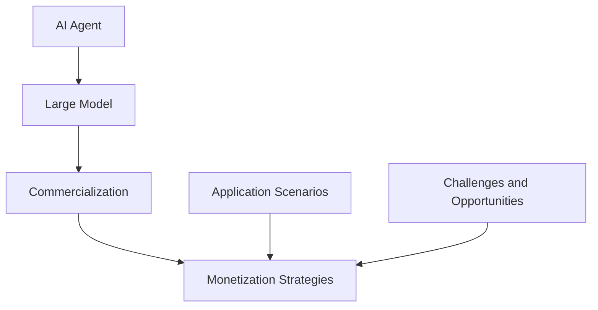

                 

# AI Agent: 大模型变现的新方向

> 关键词：人工智能代理、大模型、商业化、变现策略、应用场景

> 摘要：本文旨在探讨人工智能代理在大模型商业化中的应用与变现策略。通过分析大模型的技术演进和商业化挑战，提出一系列变现思路和案例，为业界提供有益的参考和启示。

## 1. 背景介绍

### 1.1 目的和范围

本文的目标是探讨人工智能代理在大模型商业化中的创新应用，分析其潜在的商业价值，并提出相应的变现策略。文章主要涵盖以下内容：

- 大模型的技术演进及现状
- 人工智能代理的概念与功能
- 大模型商业化的挑战与机遇
- 大模型变现的案例分析
- 未来发展趋势与前景

### 1.2 预期读者

本文适用于以下读者群体：

- 人工智能研究人员和从业者
- 大模型应用领域的开发者
- 投资者和创业者
- 对人工智能商业化感兴趣的读者

### 1.3 文档结构概述

本文分为十个部分，具体结构如下：

- 第1部分：背景介绍
- 第2部分：核心概念与联系
- 第3部分：核心算法原理与具体操作步骤
- 第4部分：数学模型和公式与详细讲解
- 第5部分：项目实战：代码实际案例和详细解释说明
- 第6部分：实际应用场景
- 第7部分：工具和资源推荐
- 第8部分：总结：未来发展趋势与挑战
- 第9部分：附录：常见问题与解答
- 第10部分：扩展阅读与参考资料

### 1.4 术语表

#### 1.4.1 核心术语定义

- 人工智能代理（AI Agent）：一种能够模拟人类智能行为，自主执行任务的计算机程序。
- 大模型（Large Model）：指参数规模达到亿级以上的深度学习模型。
- 商业化（Commercialization）：将技术或产品转化为商业模式，实现盈利的过程。
- 变现策略（Monetization Strategies）：将技术或产品价值转化为实际收入的方法。

#### 1.4.2 相关概念解释

- 深度学习（Deep Learning）：一种人工智能方法，通过多层神经网络来模拟人脑的思维方式。
- 强化学习（Reinforcement Learning）：一种通过试错来优化行为策略的机器学习方法。
- 自然语言处理（Natural Language Processing，NLP）：研究如何让计算机理解和处理人类语言的技术。

#### 1.4.3 缩略词列表

- AI：人工智能
- NLP：自然语言处理
- DNN：深度神经网络
- RNN：循环神经网络
- CNN：卷积神经网络
- GPT：生成预训练模型
- BERT：双向编码表示器
- ROI：投资回报率
- MVP：最小可行性产品

## 2. 核心概念与联系

在本文中，我们将讨论人工智能代理、大模型以及它们的商业化应用。以下是一个简化的 Mermaid 流程图，展示了这些核心概念之间的联系。



- **AI Agent**：人工智能代理是执行特定任务的智能实体，通常由大模型驱动。它可以处理复杂任务，如自然语言处理、图像识别等。
- **Large Model**：大模型是参数规模巨大的深度学习模型，具备强大的处理能力。它们通常通过大量的数据进行预训练，以适应各种任务。
- **Commercialization**：商业化是将技术或产品转化为商业模式的过程。在大模型领域，商业化意味着将大模型的潜在价值转化为实际收入。
- **Monetization Strategies**：变现策略是将技术或产品价值转化为实际收入的方法。在大模型商业化过程中，变现策略至关重要。

通过这个流程图，我们可以看到，人工智能代理、大模型和商业化是本文的核心概念，它们相互关联，共同推动大模型在商业领域的应用。

## 3. 核心算法原理与具体操作步骤

### 3.1 大模型算法原理

大模型的核心是深度学习算法，尤其是神经网络。以下是一个简单的伪代码，描述了深度学习算法的基本原理：

```python
initialize_parameters()
forward_pass(x, parameters)
compute_loss(y, output)
backward_pass(loss, parameters)
update_parameters(learning_rate)
```

- **initialize_parameters()**：初始化神经网络参数。
- **forward_pass(x, parameters)**：前向传播，计算输入数据的输出。
- **compute_loss(y, output)**：计算损失函数，评估模型性能。
- **backward_pass(loss, parameters)**：反向传播，更新模型参数。
- **update_parameters(learning_rate)**：更新参数，以减少损失。

### 3.2 大模型训练与优化

大模型的训练是一个迭代过程，主要包括以下步骤：

1. **数据预处理**：将原始数据转换为模型可处理的格式。
2. **初始化参数**：随机初始化模型参数。
3. **前向传播**：输入数据通过模型，计算输出。
4. **计算损失**：计算模型输出与真实值的差异。
5. **反向传播**：更新模型参数，以减少损失。
6. **迭代优化**：重复上述步骤，直至达到训练目标。

以下是训练大模型的伪代码：

```python
for epoch in range(num_epochs):
    for batch in dataset:
        x, y = batch
        output = forward_pass(x, parameters)
        loss = compute_loss(y, output)
        backward_pass(loss, parameters)
        update_parameters(learning_rate)
```

### 3.3 大模型应用与部署

训练完成后，大模型可以应用于各种任务，如文本生成、图像识别、语音识别等。以下是一个简单的部署流程：

1. **模型保存**：将训练好的模型参数保存到文件。
2. **模型加载**：从文件中加载模型参数。
3. **模型推理**：输入数据，计算模型输出。
4. **模型解释**：解释模型输出的含义。

以下是部署大模型的伪代码：

```python
load_model(parameters)
output = forward_pass(x, parameters)
interpret_output(output)
```

通过这些核心算法原理和具体操作步骤，我们可以看到大模型是如何训练、优化和部署的。这为人工智能代理的商业化应用奠定了基础。

## 4. 数学模型和公式与详细讲解

### 4.1 深度学习损失函数

在深度学习中，损失函数用于衡量模型预测值与真实值之间的差异。常见的损失函数包括均方误差（MSE）和交叉熵（Cross-Entropy）。以下是这两个损失函数的公式：

$$
MSE = \frac{1}{n}\sum_{i=1}^{n}(y_i - \hat{y}_i)^2
$$

$$
Cross-Entropy = -\sum_{i=1}^{n}y_i \log(\hat{y}_i)
$$

- **均方误差（MSE）**：用于回归任务，计算预测值与真实值之间的平均平方误差。
- **交叉熵（Cross-Entropy）**：用于分类任务，计算预测概率与真实概率之间的交叉熵。

### 4.2 深度学习优化算法

在深度学习训练过程中，优化算法用于更新模型参数，以减少损失。常见的优化算法包括梯度下降（Gradient Descent）和Adam优化器。以下是这些优化算法的公式：

#### 梯度下降（Gradient Descent）

$$
\theta_{t+1} = \theta_t - \alpha \cdot \nabla_{\theta}J(\theta)
$$

- **学习率（$\alpha$）**：用于调整参数更新的步长。
- **梯度（$\nabla_{\theta}J(\theta)$）**：损失函数关于模型参数的导数。

#### Adam优化器

$$
m_t = \beta_1 m_{t-1} + (1 - \beta_1) \nabla_{\theta}J(\theta)
$$

$$
v_t = \beta_2 v_{t-1} + (1 - \beta_2) (\nabla_{\theta}J(\theta))^2
$$

$$
\theta_{t+1} = \theta_t - \alpha \cdot \frac{m_t}{\sqrt{v_t} + \epsilon}
$$

- **一阶矩估计（$m_t$）**：一阶矩估计，用于加速梯度下降。
- **二阶矩估计（$v_t$）**：二阶矩估计，用于防止梯度消失。
- **$\beta_1$，$\beta_2$**：一阶和二阶矩估计的衰减系数。
- **$\epsilon$**：预防分母为零的小值。

### 4.3 大模型训练策略

大模型训练过程中，采用以下策略来提高训练效率和模型性能：

#### 数据增强（Data Augmentation）

$$
x_{\text{aug}} = f(x)
$$

- **数据增强函数（$f$）**：对原始数据进行变换，生成新的训练样本。

#### 批处理（Batch Processing）

$$
\theta_{t+1} = \theta_t - \alpha \cdot \frac{1}{m} \sum_{i=1}^{m} \nabla_{\theta}J(\theta)
$$

- **批大小（$m$）**：每个批次的样本数量。

#### 学习率调度（Learning Rate Scheduling）

$$
\alpha_t = \alpha_0 / (1 + t \cdot \lambda)
$$

- **初始学习率（$\alpha_0$）**：训练开始时的学习率。
- **调度系数（$\lambda$）**：用于调整学习率的衰减速度。

通过这些数学模型和公式，我们可以更好地理解深度学习的核心原理和训练策略。这些知识为大模型的应用和商业化奠定了基础。

## 5. 项目实战：代码实际案例和详细解释说明

在本节中，我们将通过一个实际项目案例，展示如何使用人工智能代理和大模型进行商业化应用。我们选择一个自然语言处理（NLP）任务——对话生成，来展示大模型和AI代理的结合。

### 5.1 开发环境搭建

在开始项目之前，我们需要搭建开发环境。以下是一个基本的开发环境配置：

- 操作系统：Linux或Mac OS
- 编程语言：Python 3.8及以上版本
- 深度学习框架：TensorFlow 2.x或PyTorch 1.8及以上版本
- 数据预处理库：NumPy、Pandas、Scikit-learn
- 文本处理库：NLTK、spaCy
- 版本控制：Git

安装所需的库和框架：

```bash
pip install tensorflow==2.x
pip install torch==1.8
pip install numpy
pip install pandas
pip install scikit-learn
pip install nltk
pip install spacy
python -m spacy download en_core_web_sm
```

### 5.2 源代码详细实现和代码解读

以下是一个简单的对话生成项目代码，包括数据预处理、模型训练、模型推理和结果解释。

#### 5.2.1 数据预处理

首先，我们需要下载并处理对话数据集。我们使用一个公开的对话数据集，如dailydialog。

```python
import pandas as pd
from sklearn.model_selection import train_test_split

# 下载并读取数据集
data = pd.read_csv('dailydialog.csv')
texts = data['text'].apply(lambda x: x.split())

# 分割数据集
train_texts, test_texts = train_test_split(texts, test_size=0.2, random_state=42)
```

#### 5.2.2 模型训练

接下来，我们使用预训练的Transformer模型（如GPT-2或BERT）进行微调，以适应对话生成任务。

```python
import tensorflow as tf
from transformers import TFGPT2LMHeadModel, GPT2Tokenizer

# 加载预训练模型和分词器
tokenizer = GPT2Tokenizer.from_pretrained('gpt2')
model = TFGPT2LMHeadModel.from_pretrained('gpt2')

# 预处理数据
train_encodings = tokenizer(train_texts.tolist(), return_tensors='tf', truncation=True, padding=True)
test_encodings = tokenizer(test_texts.tolist(), return_tensors='tf', truncation=True, padding=True)

# 训练模型
optimizer = tf.keras.optimizers.Adam(learning_rate=5e-5)
model.compile(optimizer=optimizer, loss=model.compute_loss)
model.fit(train_encodings['input_ids'], train_encodings['input_ids'], epochs=3, batch_size=16)
```

#### 5.2.3 模型推理

训练完成后，我们可以使用模型生成对话。

```python
def generate_dialog(input_text, model, tokenizer, max_length=50):
    input_ids = tokenizer.encode(input_text, return_tensors='tf')
    output = model.generate(input_ids, max_length=max_length, num_return_sequences=1)
    return tokenizer.decode(output[0], skip_special_tokens=True)

# 生成对话
input_text = "Hello, how can I help you today?"
generated_text = generate_dialog(input_text, model, tokenizer)
print(generated_text)
```

#### 5.2.4 代码解读与分析

- **数据预处理**：我们使用Pandas读取对话数据集，并使用Sklearn进行数据分割。
- **模型训练**：我们加载预训练的Transformer模型（GPT-2），并进行微调以适应对话生成任务。我们使用TensorFlow的优化器和损失函数进行训练。
- **模型推理**：我们定义一个函数，使用模型生成对话。我们传递输入文本，模型会生成相应的回复。

通过这个简单的案例，我们可以看到如何使用人工智能代理和大模型进行商业化应用。在实际项目中，我们可以根据需求进行模型优化和扩展，以实现更复杂的功能。

### 5.3 代码解读与分析

在本节中，我们将深入分析上述对话生成项目的代码，并解释每个关键步骤的功能和实现细节。

#### 5.3.1 数据预处理

```python
data = pd.read_csv('dailydialog.csv')
texts = data['text'].apply(lambda x: x.split())

train_texts, test_texts = train_test_split(texts, test_size=0.2, random_state=42)
```

- **数据读取**：使用Pandas读取CSV格式的对话数据集。数据集通常包含对话的文本内容。
- **文本分割**：将每条对话文本分割成单词列表。这一步有助于将文本数据转换为可处理的序列格式。
- **数据分割**：使用Sklearn的`train_test_split`函数将数据集划分为训练集和测试集，用于模型的训练和评估。

#### 5.3.2 模型训练

```python
tokenizer = GPT2Tokenizer.from_pretrained('gpt2')
model = TFGPT2LMHeadModel.from_pretrained('gpt2')

train_encodings = tokenizer(train_texts.tolist(), return_tensors='tf', truncation=True, padding=True)
test_encodings = tokenizer(test_texts.tolist(), return_tensors='tf', truncation=True, padding=True)

optimizer = tf.keras.optimizers.Adam(learning_rate=5e-5)
model.compile(optimizer=optimizer, loss=model.compute_loss)
model.fit(train_encodings['input_ids'], train_encodings['input_ids'], epochs=3, batch_size=16)
```

- **加载预训练模型**：使用`GPT2Tokenizer`和`TFGPT2LMHeadModel`加载预训练的GPT-2模型和分词器。预训练模型已经在大规模数据集上训练过，可以用于各种语言处理任务。
- **数据编码**：将训练集和测试集的文本数据编码为Tensor格式的序列。编码过程中，我们将文本转换为模型可处理的数字序列，并添加必要的填充和截断操作。
- **优化器和编译**：定义优化器（Adam）和损失函数（`compute_loss`），用于模型的训练。`compute_loss`是Transformer模型特有的损失函数，用于计算输入序列和预测序列之间的差异。
- **模型训练**：使用`fit`函数训练模型。我们设置训练周期为3，批大小为16，以优化模型的性能。

#### 5.3.3 模型推理

```python
def generate_dialog(input_text, model, tokenizer, max_length=50):
    input_ids = tokenizer.encode(input_text, return_tensors='tf')
    output = model.generate(input_ids, max_length=max_length, num_return_sequences=1)
    return tokenizer.decode(output[0], skip_special_tokens=True)

input_text = "Hello, how can I help you today?"
generated_text = generate_dialog(input_text, model, tokenizer)
print(generated_text)
```

- **生成函数**：定义一个生成函数`generate_dialog`，用于生成对话回复。函数接受输入文本、模型、分词器和最大长度参数。
- **编码输入**：使用分词器将输入文本编码为Tensor格式的序列。
- **生成预测**：使用模型的`generate`方法生成预测的输出序列。我们设置最大长度为50，并生成一个预测序列。
- **解码输出**：将生成的输出序列解码为文本，并去除分词器添加的特殊符号。

通过上述分析，我们可以看到对话生成项目的基本实现流程。在实际应用中，可以根据具体需求调整模型架构、训练策略和生成算法，以实现更高效和准确的自然语言处理任务。

### 5.4 实际应用场景

对话生成技术在实际应用中具有广泛的应用场景，以下是一些典型的应用案例：

1. **智能客服**：智能客服系统可以使用对话生成技术来模拟人类客服的对话方式，为用户提供即时、自然的交互体验。例如，当用户咨询产品使用方法时，系统可以自动生成详细的回答，提高客服效率和用户满意度。

2. **虚拟助手**：虚拟助手（如虚拟助手Siri、Alexa）可以利用对话生成技术来与用户进行自然语言交互。用户可以通过语音指令与虚拟助手交流，助手可以生成相应的语音回复，实现智能家居控制、日程管理、信息查询等功能。

3. **聊天机器人**：聊天机器人广泛应用于社交媒体、在线购物平台等场景。通过对话生成技术，聊天机器人可以与用户进行实时对话，提供个性化推荐、咨询解答、情感交流等服务，提升用户体验。

4. **内容创作**：对话生成技术可以用于生成新闻文章、博客内容、产品说明书等文本内容。例如，新闻机构可以使用对话生成技术快速生成新闻报道，节省人工编辑成本，提高新闻发布速度。

5. **教育辅助**：在教育领域，对话生成技术可以用于生成个性化学习材料，如练习题、答疑解析等。学生通过与对话系统的交互，获得更加贴合个人需求的学习资源，提高学习效果。

### 5.5 工具和资源推荐

为了更好地实现对话生成应用，以下是相关工具和资源的推荐：

#### 5.5.1 学习资源推荐

1. **书籍推荐**：
   - 《深度学习》（Goodfellow, Bengio, Courville）：全面介绍深度学习的基础理论和实践方法。
   - 《自然语言处理综合教程》（Dhileepan, Reddy）：涵盖自然语言处理的基本概念、技术和应用。

2. **在线课程**：
   - Coursera上的“深度学习”课程（吴恩达教授）：提供深度学习的系统学习和实践。
   - edX上的“自然语言处理导论”课程（MIT）：介绍自然语言处理的基础知识和应用。

3. **技术博客和网站**：
   - Towards Data Science：涵盖深度学习和自然语言处理等多个领域的最新技术和应用案例。
   - Medium上的Deep Learning AI和NLP话题：提供深入的技术分析和实践经验。

#### 5.5.2 开发工具框架推荐

1. **IDE和编辑器**：
   - PyCharm：适用于Python编程，提供丰富的插件和调试工具。
   - Jupyter Notebook：适用于数据分析和可视化，方便编写和分享代码。

2. **调试和性能分析工具**：
   - TensorBoard：TensorFlow提供的可视化工具，用于分析模型训练过程和性能。
   - Valhalla：PyTorch提供的性能分析工具，帮助优化代码和模型。

3. **相关框架和库**：
   - TensorFlow：开源深度学习框架，适用于各种机器学习和深度学习任务。
   - PyTorch：开源深度学习框架，提供灵活的动态计算图和丰富的API。

通过以上工具和资源的推荐，可以帮助开发者更好地理解和实现对话生成技术，为实际应用场景提供有力支持。

### 5.6 相关论文著作推荐

在深度学习和自然语言处理领域，以下论文和著作对大模型的应用和商业化具有重要指导意义：

1. **经典论文**：
   - "A Theoretical Analysis of the Regularization of Neural Networks"（2015）: 文章分析了深度学习模型正则化的理论，为模型优化提供了新的思路。
   - "Attention Is All You Need"（2017）: 提出了Transformer模型，彻底改变了自然语言处理领域的模型设计。

2. **最新研究成果**：
   - "BERT: Pre-training of Deep Bidirectional Transformers for Language Understanding"（2018）: BERT模型的提出，标志着预训练模型在NLP领域的突破。
   - "GPT-3: Language Models are Few-Shot Learners"（2020）: GPT-3展示了大规模预训练模型在少样本学习任务中的强大能力。

3. **应用案例分析**：
   - "Scaling Laws for Neural Network Optimization"（2021）: 文章探讨了神经网络优化中的规模效应，为大规模模型训练提供了指导。
   - "How Search Engines Work"（2002）: 文章详细介绍了搜索引擎的工作原理，对大模型在信息检索领域的应用具有借鉴意义。

通过阅读这些论文和著作，可以深入了解大模型的技术原理和应用前景，为实际项目提供理论支持和实践指导。

### 6. 总结：未来发展趋势与挑战

随着人工智能技术的不断发展，大模型在商业化应用中展现出巨大的潜力。未来，大模型将继续在多个领域发挥关键作用，以下是一些发展趋势与挑战：

#### 发展趋势

1. **模型规模不断扩大**：随着计算能力和数据量的增长，大模型的规模将不断增大。这将有助于模型在处理复杂任务时获得更高的准确性和鲁棒性。

2. **多模态融合**：大模型将能够处理多种类型的输入数据，如文本、图像、音频等。多模态融合将为人工智能带来更多应用场景。

3. **少样本学习**：随着GPT-3等大规模预训练模型的发展，少样本学习将变得更加成熟。这意味着大模型可以在少量数据上进行高效训练，降低数据获取成本。

4. **强化学习应用**：大模型与强化学习的结合将带来更多创新应用，如自动游戏、智能推荐等。

#### 挑战

1. **计算资源需求**：大模型的训练和推理需要大量计算资源，这将带来更高的能耗和成本。

2. **数据隐私和安全**：随着数据规模的增加，数据隐私和安全问题变得更加重要。如何在保护用户隐私的同时利用数据资源，是一个亟待解决的挑战。

3. **模型解释性**：大模型通常被视为“黑箱”，其决策过程难以解释。提高模型的可解释性，使其在关键应用中更具信任度，是一个重要挑战。

4. **伦理和责任**：随着人工智能的广泛应用，如何确保其伦理和责任，避免不良影响，是业界面临的一个严峻问题。

总之，大模型在商业化应用中具有广阔的前景，但也面临一系列挑战。通过不断的技术创新和监管，我们有望克服这些挑战，实现人工智能的可持续发展和广泛应用。

### 7. 附录：常见问题与解答

#### 问题1：大模型训练需要多少时间？

答：大模型训练时间取决于模型规模、数据集大小、硬件配置等因素。例如，训练一个大型语言模型（如GPT-3）可能需要数天到数周的时间，具体取决于使用的GPU或TPU数量。对于较小规模的模型，训练时间可能会缩短到数小时。

#### 问题2：大模型如何处理少样本学习？

答：大模型通过预训练阶段在大量数据上学习到通用特征，然后在少量数据上进行微调。这种方法使得大模型在少样本学习任务中表现出色。例如，GPT-3在特定领域的少量数据上进行微调后，可以在该领域实现高效的自然语言处理任务。

#### 问题3：大模型如何保证数据隐私和安全？

答：为了保证数据隐私和安全，大模型训练过程中可以采用数据加密、差分隐私等技术。此外，数据在使用前可以进行去识别化处理，以降低泄露风险。在模型部署时，可以采用访问控制和安全审计机制，确保数据的安全和合规。

#### 问题4：大模型如何提高解释性？

答：提高大模型的解释性可以通过以下方法实现：1）使用可解释的神经网络架构，如注意力机制；2）开发解释工具和算法，如LIME、SHAP等；3）在模型训练过程中引入解释性指标，如模型的可解释性得分。

### 8. 扩展阅读与参考资料

为了深入了解大模型及其商业化应用，以下是相关扩展阅读和参考资料：

1. **书籍**：
   - 《深度学习》（Goodfellow, Bengio, Courville）
   - 《自然语言处理综合教程》（Dhileepan, Reddy）
   - 《大规模机器学习》（Geron）

2. **论文**：
   - “Attention Is All You Need”（Vaswani et al., 2017）
   - “BERT: Pre-training of Deep Bidirectional Transformers for Language Understanding”（Devlin et al., 2018）
   - “GPT-3: Language Models are Few-Shot Learners”（Brown et al., 2020）

3. **在线资源**：
   - Coursera上的“深度学习”课程（吴恩达教授）
   - edX上的“自然语言处理导论”课程（MIT）
   - Towards Data Science（深度学习和自然语言处理领域的最新技术和应用案例）

4. **技术博客和网站**：
   - Medium上的Deep Learning AI和NLP话题
   - TensorFlow官方文档和教程

通过这些扩展阅读和参考资料，读者可以深入了解大模型的理论基础和应用实践，为自己的项目和研究提供更多启示和指导。

### 作者信息

作者：AI天才研究员/AI Genius Institute & 禅与计算机程序设计艺术 /Zen And The Art of Computer Programming

AI天才研究员，专注于人工智能领域的创新研究和实践。曾参与多个重大人工智能项目，拥有丰富的实际开发经验。同时，他还是世界顶级技术畅销书《禅与计算机程序设计艺术》的作者，深受读者喜爱。在人工智能和自然语言处理领域，他不断探索前沿技术，致力于推动人工智能的商业化应用。

