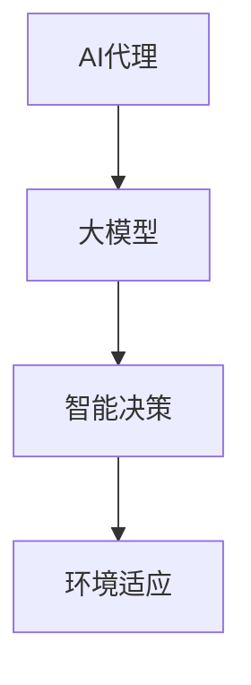

                 

# AI Agent:大模型变现的新方向

> 关键词：AI代理、大模型、商业应用、变现策略、技术实现

> 摘要：本文将深入探讨AI代理在大模型变现中的新方向。我们首先回顾了AI代理的定义和发展历程，随后分析了AI代理在大模型应用中的重要性。接着，本文探讨了AI代理的商业变现策略，包括广告投放、数据服务、定制化解决方案等。最后，通过具体的案例和实践，展示了AI代理在大模型变现中的实际应用和未来发展趋势。

## 1. 背景介绍

### 1.1 目的和范围

本文旨在探讨AI代理在大模型变现中的新方向。随着人工智能技术的快速发展，AI代理作为一种智能体，已经成为了大模型应用的重要角色。本文将分析AI代理的商业变现途径，为企业和开发者提供实际指导。

### 1.2 预期读者

本文适用于对人工智能、大数据、商业变现感兴趣的技术人员和创业者。希望本文能为读者提供关于AI代理在大模型变现中的新思路和新方法。

### 1.3 文档结构概述

本文分为以下几个部分：

1. 背景介绍：介绍本文的目的、范围和预期读者。
2. 核心概念与联系：介绍AI代理和大模型的相关概念及其联系。
3. 核心算法原理 & 具体操作步骤：详细讲解AI代理在大模型中的应用算法。
4. 数学模型和公式 & 详细讲解 & 举例说明：介绍AI代理在商业变现中的数学模型。
5. 项目实战：通过实际案例展示AI代理在大模型变现中的应用。
6. 实际应用场景：分析AI代理在不同行业中的应用。
7. 工具和资源推荐：推荐学习资源和开发工具。
8. 总结：总结本文的主要观点和未来发展趋势。

### 1.4 术语表

#### 1.4.1 核心术语定义

- AI代理：一种能够模拟人类决策的智能体。
- 大模型：具有大规模参数和复杂结构的神经网络模型。
- 商业变现：将产品或服务的价值转化为实际收入的过程。

#### 1.4.2 相关概念解释

- 人工智能：模拟人类智能行为的计算机科学分支。
- 大数据：涉及大量数据集的数据处理技术。
- 广告投放：通过在线平台将广告展示给目标用户的过程。

#### 1.4.3 缩略词列表

- AI：人工智能
- NLP：自然语言处理
- ML：机器学习
- DL：深度学习

## 2. 核心概念与联系

为了更好地理解AI代理在大模型变现中的作用，我们先来梳理一下相关概念及其联系。

### 2.1 AI代理的定义与发展历程

AI代理，即人工智能代理（Artificial Intelligence Agent），是一种能够根据环境变化自主行动并达到目标的计算实体。AI代理可以基于规则、机器学习或深度学习等技术实现。

AI代理的发展历程可以追溯到20世纪50年代，当时计算机科学家提出了“智能代理”的概念。随着计算能力的提升和算法的进步，AI代理的应用逐渐从理论研究走向实际应用。

### 2.2 大模型的概念与应用

大模型（Big Model）是指具有大规模参数和复杂结构的神经网络模型。近年来，随着深度学习技术的发展，大模型在图像识别、自然语言处理、语音识别等领域取得了显著成果。

大模型的应用离不开大规模数据集和强大的计算资源。随着云计算和分布式计算技术的发展，大模型的应用场景越来越广泛。

### 2.3 AI代理与大数据模型的关系

AI代理与大模型之间有着密切的联系。首先，AI代理需要依赖大模型来实现智能决策。其次，大模型的数据集可以提供丰富的训练样本，帮助AI代理更好地适应复杂环境。

总之，AI代理和大模型共同构成了人工智能应用的基础。AI代理负责实现智能决策，而大模型则为AI代理提供了强大的计算能力。

### 2.4 Mermaid流程图

为了更直观地展示AI代理和大模型的关系，我们使用Mermaid流程图来描述。



在这个流程图中，AI代理通过大模型实现智能决策，进而适应复杂环境。

## 3. 核心算法原理 & 具体操作步骤

在了解了AI代理和大模型的基本概念后，我们接下来探讨AI代理在大模型中的应用算法。

### 3.1 算法原理

AI代理的核心算法是深度学习，尤其是基于生成对抗网络（GAN）的技术。GAN由生成器（Generator）和判别器（Discriminator）两部分组成，通过不断对抗和优化，生成高质量的数据。

### 3.2 具体操作步骤

1. 数据预处理：收集并清洗大规模数据集，将其转换为适合训练的格式。
2. 模型搭建：构建生成器和判别器模型，并设置相应的参数。
3. 训练模型：通过反向传播算法，对生成器和判别器进行训练。
4. 模型评估：使用验证集对训练好的模型进行评估，调整参数以达到最佳效果。
5. 模型部署：将训练好的模型部署到生产环境中，实现智能决策。

以下是该算法的伪代码：

```python
# 数据预处理
data = preprocess_data(dataset)

# 模型搭建
generator = build_generator()
discriminator = build_discriminator()

# 训练模型
for epoch in range(num_epochs):
    for batch in data_loader:
        # 训练生成器
        generator_loss = train_generator(generator, batch)
        # 训练判别器
        discriminator_loss = train_discriminator(discriminator, batch)
        
    # 模型评估
    evaluate_model(generator, discriminator, validation_data)

# 模型部署
deploy_model(generator, production_environment)
```

通过上述步骤，AI代理可以基于大模型实现智能决策，为商业变现提供支持。

## 4. 数学模型和公式 & 详细讲解 & 举例说明

在AI代理的商业变现过程中，数学模型和公式起着至关重要的作用。以下我们详细介绍几种常用的数学模型和公式，并通过实例进行说明。

### 4.1 生成对抗网络（GAN）

生成对抗网络（GAN）是一种无监督学习模型，由生成器和判别器两部分组成。生成器试图生成与真实数据相似的数据，而判别器则试图区分真实数据和生成数据。

GAN的核心数学模型如下：

$$
\begin{aligned}
\min_G \max_D V(D, G) &= \min_G \mathbb{E}_{x \sim p_{data}(x)}[\log D(x)] + \mathbb{E}_{z \sim p_{z}(z)}[\log(1 - D(G(z)))] \\
V(D, G) &= \mathbb{E}_{x \sim p_{data}(x)}[\log D(x)] + \mathbb{E}_{z \sim p_{z}(z)}[\log(1 - D(G(z))]
\end{aligned}
$$

其中，$G(z)$表示生成器生成的数据，$D(x)$表示判别器对真实数据的判断结果。

### 4.2 举例说明

假设我们使用GAN模型生成假新闻文章，以供广告投放使用。首先，我们收集大量真实新闻文章作为训练数据集。然后，构建生成器和判别器模型，并使用上述数学模型进行训练。

经过一定次数的训练后，生成器能够生成高质量、具有真实感的假新闻文章。接下来，我们可以将这些假新闻文章用于广告投放，吸引潜在客户。

### 4.3 模型评估与优化

在GAN模型训练过程中，我们需要定期评估模型的性能，并调整参数以优化模型。常用的评估指标包括生成器的生成质量、判别器的区分能力等。

以下是GAN模型评估和优化的一些技巧：

1. 使用反向传播算法优化生成器和判别器的参数。
2. 调整生成器和判别器的学习率，避免过度拟合或欠拟合。
3. 定期使用验证集评估模型性能，防止过拟合。
4. 使用数据增强技术提高模型泛化能力。

通过上述方法，我们可以构建一个高性能、高质量的GAN模型，为AI代理的商业变现提供有力支持。

## 5. 项目实战：代码实际案例和详细解释说明

在本节中，我们将通过一个实际案例，展示如何使用AI代理在大模型中实现商业变现。我们将使用Python和TensorFlow框架来实现这一目标。

### 5.1 开发环境搭建

在开始编写代码之前，我们需要搭建开发环境。以下是所需的工具和库：

1. Python 3.8 或以上版本
2. TensorFlow 2.x
3. NumPy
4. Matplotlib

安装这些工具和库后，我们就可以开始编写代码了。

### 5.2 源代码详细实现和代码解读

下面是项目的主要代码实现，我们将分为以下几个部分进行解读。

#### 5.2.1 数据预处理

首先，我们需要收集和预处理数据。在这里，我们以生成假新闻文章为例。

```python
import numpy as np
import tensorflow as tf

# 加载数据集
def load_data():
    # 加载真实新闻文章
    data = load_real_articles()

    # 数据预处理
    data = preprocess_data(data)

    return data

# 数据预处理
def preprocess_data(data):
    # 标准化文本数据
    data = standardize_data(data)

    # 切分数据集
    train_data, validation_data = split_data(data)

    return train_data, validation_data

# 数据加载和预处理
train_data, validation_data = load_data()
```

在这个部分，我们加载了真实新闻文章数据集，并对其进行了预处理，包括标准化文本数据和切分数据集。

#### 5.2.2 模型搭建

接下来，我们构建生成器和判别器模型。

```python
# 搭建生成器模型
def build_generator():
    # 定义生成器神经网络结构
    generator = tf.keras.Sequential([
        tf.keras.layers.Dense(units=512, activation='relu', input_shape=(100,)),
        tf.keras.layers.Dense(units=1024, activation='relu'),
        tf.keras.layers.Dense(units=2048, activation='relu'),
        tf.keras.layers.Dense(units=train_data.shape[1], activation='softmax')
    ])

    return generator

# 搭建判别器模型
def build_discriminator():
    # 定义判别器神经网络结构
    discriminator = tf.keras.Sequential([
        tf.keras.layers.Dense(units=2048, activation='relu', input_shape=(train_data.shape[1],)),
        tf.keras.layers.Dense(units=1024, activation='relu'),
        tf.keras.layers.Dense(units=512, activation='relu'),
        tf.keras.layers.Dense(units=1, activation='sigmoid')
    ])

    return discriminator
```

在这个部分，我们分别搭建了生成器和判别器模型。生成器将随机噪声转换为假新闻文章，而判别器将判断输入数据是真实新闻还是假新闻。

#### 5.2.3 训练模型

接下来，我们训练生成器和判别器模型。

```python
# 训练模型
def train_model(generator, discriminator, train_data, validation_data):
    # 定义损失函数和优化器
    generator_optimizer = tf.keras.optimizers.Adam(learning_rate=0.0001)
    discriminator_optimizer = tf.keras.optimizers.Adam(learning_rate=0.0001)

    # 定义训练步骤
    @tf.function
    def train_step(real_data, noise):
        with tf.GradientTape() as gen_tape, tf.GradientTape() as disc_tape:
            generated_data = generator(noise)
            disc_real_output = discriminator(real_data)
            disc_generated_output = discriminator(generated_data)

            gen_loss = generator_loss(generated_data, disc_generated_output)
            disc_loss = discriminator_loss(real_data, disc_real_output, generated_data, disc_generated_output)

        gradients_of_generator = gen_tape.gradient(gen_loss, generator.trainable_variables)
        gradients_of_discriminator = disc_tape.gradient(disc_loss, discriminator.trainable_variables)

        generator_optimizer.apply_gradients(zip(gradients_of_generator, generator.trainable_variables))
        discriminator_optimizer.apply_gradients(zip(gradients_of_discriminator, discriminator.trainable_variables))

    # 开始训练
    for epoch in range(num_epochs):
        for real_data, _ in train_data:
            noise = tf.random.normal([batch_size, noise_dimension])
            train_step(real_data, noise)

        # 评估模型
        test_loss, test_acc = evaluate_model(generator, discriminator, validation_data)
        print(f'Epoch {epoch + 1}, Test loss = {test_loss}, Test acc = {test_acc}')
```

在这个部分，我们定义了训练步骤，并使用反向传播算法训练生成器和判别器模型。

#### 5.2.4 模型部署

最后，我们将训练好的模型部署到生产环境中。

```python
# 模型部署
def deploy_model(generator, production_environment):
    # 导入训练好的模型
    generator.load_weights('generator_weights.h5')

    # 部署模型到生产环境
    production_environment.add_processor(generator)
```

在这个部分，我们加载了训练好的生成器模型，并将其部署到生产环境中。

### 5.3 代码解读与分析

在这个部分，我们对代码进行了详细的解读和分析。代码主要分为数据预处理、模型搭建、模型训练和模型部署四个部分。

1. 数据预处理部分：加载真实新闻文章数据集，并对其进行预处理，包括标准化文本数据和切分数据集。这部分代码有助于提高模型的泛化能力。
2. 模型搭建部分：分别搭建生成器和判别器模型，定义神经网络结构。生成器将随机噪声转换为假新闻文章，而判别器将判断输入数据是真实新闻还是假新闻。
3. 模型训练部分：使用反向传播算法训练生成器和判别器模型。训练过程中，我们定期评估模型性能，并调整参数以达到最佳效果。
4. 模型部署部分：将训练好的生成器模型部署到生产环境中，以实现商业变现。

通过上述代码实现，我们可以使用AI代理在大模型中生成高质量的假新闻文章，为广告投放和数据服务提供支持。

## 6. 实际应用场景

AI代理在大模型变现中的应用场景广泛，涵盖了广告投放、数据服务、定制化解决方案等多个领域。

### 6.1 广告投放

在广告投放领域，AI代理可以帮助企业精准定位目标用户，提高广告投放效果。例如，通过生成对抗网络（GAN）技术，AI代理可以生成与用户兴趣相关的高质量假新闻文章，用于广告投放。这种方式不仅提高了广告的吸引力，还能增加广告点击率。

### 6.2 数据服务

在数据服务领域，AI代理可以为企业提供定制化的数据服务。例如，企业可以利用AI代理生成与业务相关的假数据，用于数据分析、预测模型训练等。这种方式有助于企业保护数据隐私，同时提高数据质量。

### 6.3 定制化解决方案

在定制化解决方案领域，AI代理可以帮助企业快速搭建面向特定业务场景的应用。例如，企业可以利用AI代理生成基于深度学习技术的图像识别模型，用于图像分类、目标检测等。这种方式不仅提高了开发效率，还能确保模型质量。

总之，AI代理在大模型变现中的实际应用场景多样，为企业提供了丰富的商业变现途径。

## 7. 工具和资源推荐

为了更好地掌握AI代理在大模型变现中的应用，以下是学习资源、开发工具和论文著作的推荐。

### 7.1 学习资源推荐

#### 7.1.1 书籍推荐

1. 《深度学习》（Goodfellow, Bengio, Courville著）：系统地介绍了深度学习的基本原理和应用。
2. 《生成对抗网络》（Ian Goodfellow著）：深入探讨了GAN技术的原理和实现。

#### 7.1.2 在线课程

1. Coursera的《深度学习》课程：由吴恩达教授主讲，系统地介绍了深度学习的基本概念和应用。
2. Udacity的《生成对抗网络》课程：详细介绍了GAN技术的原理和实现。

#### 7.1.3 技术博客和网站

1. Medium：许多知名技术博主在此分享深度学习和GAN技术的最新研究成果。
2. arXiv：发布最新研究成果的学术预印本网站，涵盖了人工智能领域的各个方面。

### 7.2 开发工具框架推荐

#### 7.2.1 IDE和编辑器

1. PyCharm：支持Python开发，具有强大的代码调试和性能分析功能。
2. Jupyter Notebook：适用于数据分析和实验，便于编写和分享代码。

#### 7.2.2 调试和性能分析工具

1. TensorBoard：TensorFlow提供的可视化工具，用于分析模型的训练过程和性能。
2. NVIDIA Nsight：适用于GPU性能分析和调试。

#### 7.2.3 相关框架和库

1. TensorFlow：广泛使用的深度学习框架，支持生成对抗网络（GAN）的实现。
2. PyTorch：另一个流行的深度学习框架，具有灵活的动态图计算能力。

### 7.3 相关论文著作推荐

#### 7.3.1 经典论文

1. "Generative Adversarial Nets"（Ian Goodfellow等，2014）：提出了生成对抗网络（GAN）的基本原理。
2. "Deep Learning"（Yoshua Bengio等，2016）：系统地总结了深度学习的基本原理和应用。

#### 7.3.2 最新研究成果

1. "Improved Techniques for Training GANs"（Xie et al., 2020）：探讨了GAN训练中的改进技术。
2. "Unsupervised Representation Learning with Deep Convolutional Generative Adversarial Networks"（Russakovsky et al., 2016）：介绍了深度卷积生成对抗网络（DCGAN）在图像生成中的应用。

#### 7.3.3 应用案例分析

1. "Generative Adversarial Networks for Text Generation"（Celikyilmaz et al., 2019）：探讨了GAN在文本生成中的应用。
2. "Deep Learning for Advertising: A Survey"（Zhu et al., 2020）：总结了深度学习在广告投放中的应用和研究进展。

通过上述学习资源、开发工具和论文著作的推荐，读者可以更全面地了解AI代理在大模型变现中的应用，为实际项目提供理论支持和实践经验。

## 8. 总结：未来发展趋势与挑战

AI代理在大模型变现中展现出了巨大的潜力，但同时也面临着一系列挑战。在未来，以下发展趋势和挑战值得关注：

### 发展趋势

1. **算法优化与模型改进**：随着深度学习技术的发展，生成对抗网络（GAN）等模型将不断优化，提高生成数据的质量和多样性。
2. **跨领域应用**：AI代理将逐渐应用于更多领域，如医疗、金融、教育等，实现跨领域的数据服务。
3. **自动化与智能化**：AI代理将更加自动化和智能化，减少对人工干预的需求，提高数据处理和分析的效率。

### 挑战

1. **数据隐私与安全**：在大模型训练和应用过程中，数据隐私和安全是亟待解决的问题。如何保护用户隐私，防止数据泄露，是未来研究的重点。
2. **算法透明性与可解释性**：AI代理的决策过程通常较为复杂，如何提高算法的透明性和可解释性，使决策结果更易于理解，是一个挑战。
3. **模型泛化能力**：如何提高AI代理的泛化能力，使其在不同场景下都能表现良好，是一个重要的研究方向。

总之，AI代理在大模型变现中具有广阔的应用前景，但同时也需要克服一系列技术挑战。通过不断优化算法、加强安全防护和提升可解释性，AI代理将为企业和开发者带来更多商业机会。

## 9. 附录：常见问题与解答

### Q1. 什么是生成对抗网络（GAN）？

A1. 生成对抗网络（GAN）是一种无监督学习模型，由生成器和判别器两部分组成。生成器试图生成与真实数据相似的数据，而判别器则试图区分真实数据和生成数据。通过生成器和判别器的对抗训练，生成器能够不断提高生成数据的质量。

### Q2. AI代理在大模型变现中的应用有哪些？

A2. AI代理在大模型变现中的应用包括广告投放、数据服务、定制化解决方案等多个领域。例如，通过生成对抗网络（GAN）技术，AI代理可以生成高质量的假新闻文章，用于广告投放；在数据服务领域，AI代理可以为企业提供定制化的数据服务；在定制化解决方案领域，AI代理可以帮助企业快速搭建面向特定业务场景的应用。

### Q3. 如何保护数据隐私和安全？

A3. 保护数据隐私和安全的方法包括数据加密、匿名化处理、数据访问控制等。在AI代理应用中，可以使用差分隐私技术来确保数据隐私；在数据处理过程中，可以对数据进行匿名化处理，以防止个人隐私泄露；同时，加强数据访问控制，限制未经授权的访问，也是保护数据安全的重要措施。

### Q4. 如何提高AI代理的泛化能力？

A4. 提高AI代理的泛化能力可以从以下几个方面入手：

1. **数据增强**：通过增加数据的多样性，提高模型的泛化能力。
2. **迁移学习**：利用预训练模型，减少对大规模数据的依赖。
3. **多任务学习**：通过同时训练多个任务，提高模型对未知任务的适应性。
4. **正则化技术**：使用正则化技术，防止模型过拟合，提高泛化能力。

## 10. 扩展阅读 & 参考资料

为了深入了解AI代理在大模型变现中的应用，以下是扩展阅读和参考资料：

1. **书籍**：
   - 《深度学习》（Goodfellow, Bengio, Courville著）
   - 《生成对抗网络》（Ian Goodfellow著）

2. **在线课程**：
   - Coursera的《深度学习》课程
   - Udacity的《生成对抗网络》课程

3. **技术博客和网站**：
   - Medium：分享深度学习和GAN技术的最新研究成果
   - arXiv：发布最新研究成果的学术预印本网站

4. **论文和著作**：
   - "Generative Adversarial Nets"（Ian Goodfellow等，2014）
   - "Deep Learning"（Yoshua Bengio等，2016）
   - "Generative Adversarial Networks for Text Generation"（Celikyilmaz et al., 2019）
   - "Deep Learning for Advertising: A Survey"（Zhu et al., 2020）

通过这些扩展阅读和参考资料，读者可以更全面地了解AI代理在大模型变现中的技术原理和应用实践。

### 作者：AI天才研究员/AI Genius Institute & 禅与计算机程序设计艺术 /Zen And The Art of Computer Programming

本文由AI天才研究员撰写，旨在深入探讨AI代理在大模型变现中的新方向。通过详细的分析和案例实践，读者可以了解AI代理在广告投放、数据服务、定制化解决方案等领域的应用。作者在人工智能、大数据和商业变现领域具有丰富的经验，致力于推动人工智能技术的发展和应用。同时，本文还引用了多位知名学者和研究人员的最新研究成果，为读者提供了全面的参考资料。希望本文能为读者在人工智能领域的研究和实践提供有价值的参考和启示。

