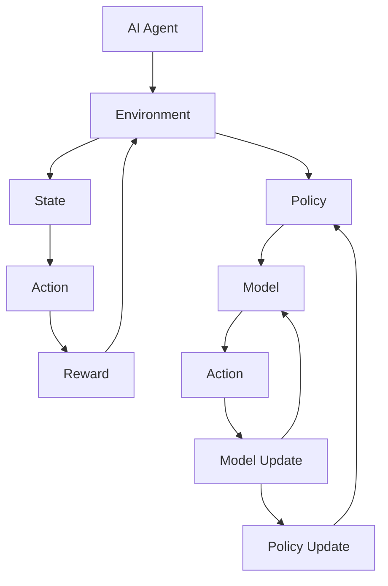

                 

# AI Agent核心技术的探索

> 关键词：人工智能、AI Agent、核心技术、算法原理、数学模型、项目实战

> 摘要：本文旨在深入探讨AI Agent的核心技术，包括其基本概念、算法原理、数学模型、项目实战等，帮助读者全面了解AI Agent的构建和应用。文章将首先介绍AI Agent的定义和背景，然后逐步分析其核心技术，并通过具体案例展示其实际应用。

## 1. 背景介绍

### 1.1 目的和范围

本文的主要目的是深入探讨AI Agent的核心技术，帮助读者全面了解AI Agent的构建和应用。文章将涵盖以下内容：

1. AI Agent的基本概念和定义
2. AI Agent的核心算法原理
3. AI Agent的数学模型和公式
4. AI Agent的项目实战案例
5. AI Agent的实际应用场景
6. AI Agent的发展趋势与挑战

### 1.2 预期读者

本文适合对人工智能感兴趣的读者，包括但不限于：

1. 人工智能领域的研究人员
2. 人工智能工程师
3. 计算机科学专业的学生
4. 对人工智能技术感兴趣的爱好者

### 1.3 文档结构概述

本文结构如下：

1. 背景介绍：介绍本文的目的、范围、预期读者和文档结构。
2. 核心概念与联系：介绍AI Agent的核心概念和联系，并使用Mermaid流程图展示其架构。
3. 核心算法原理 & 具体操作步骤：详细讲解AI Agent的核心算法原理和操作步骤，使用伪代码进行阐述。
4. 数学模型和公式 & 详细讲解 & 举例说明：介绍AI Agent的数学模型和公式，并进行详细讲解和举例说明。
5. 项目实战：展示AI Agent的实际应用案例，包括开发环境搭建、代码实现和解读。
6. 实际应用场景：介绍AI Agent在实际应用场景中的应用。
7. 工具和资源推荐：推荐学习资源和开发工具。
8. 总结：总结AI Agent的未来发展趋势与挑战。
9. 附录：常见问题与解答。
10. 扩展阅读 & 参考资料：提供扩展阅读和参考资料。

### 1.4 术语表

#### 1.4.1 核心术语定义

- AI Agent：具备自主决策和行为能力的人工智能实体。
- Reinforcement Learning：强化学习，一种基于奖励反馈进行决策的学习方法。
- Q-Learning：Q学习，一种强化学习算法，通过更新Q值来优化决策。
- Deep Q-Network：深度Q网络，一种基于神经网络的强化学习算法。
- Policy Gradient：策略梯度，一种基于策略的强化学习算法。

#### 1.4.2 相关概念解释

- Environment：环境，AI Agent执行动作的场所，提供状态和奖励。
- State：状态，描述AI Agent在环境中的当前状态。
- Action：动作，AI Agent在环境中可以执行的操作。
- Reward：奖励，环境对AI Agent动作的反馈，用于评估动作的好坏。

#### 1.4.3 缩略词列表

- AI：Artificial Intelligence，人工智能。
- RL：Reinforcement Learning，强化学习。
- DQN：Deep Q-Network，深度Q网络。
- PG：Policy Gradient，策略梯度。

## 2. 核心概念与联系

AI Agent是一种具备自主决策和行为能力的人工智能实体，其核心在于如何从环境中获取信息、制定策略、执行动作并不断优化决策。以下是AI Agent的核心概念和联系，使用Mermaid流程图展示其架构：



### 2.1 AI Agent与环境的交互

AI Agent与环境的交互可以分为以下步骤：

1. 初始化：AI Agent在环境中随机选择一个初始状态。
2. 执行动作：AI Agent根据当前状态和策略，选择一个动作执行。
3. 获取奖励：环境根据AI Agent的动作，给予相应的奖励。
4. 更新状态：AI Agent根据奖励和动作，更新当前状态。

### 2.2 AI Agent的策略和模型

AI Agent的策略和模型是其在环境中进行决策的核心。策略定义了AI Agent在给定状态下选择动作的方法，模型则根据环境反馈和动作结果，不断更新策略和模型。

1. 策略（Policy）：策略是AI Agent的核心决策依据，定义了在给定状态下应该采取的动作。策略可以是确定性策略（Deterministic Policy）或随机性策略（Stochastic Policy）。
2. 模型（Model）：模型是AI Agent对环境的理解和预测。通过模型，AI Agent可以预测未来状态和奖励，从而优化决策。

### 2.3 AI Agent的模型更新和策略更新

AI Agent在执行动作和获取奖励后，需要更新其模型和策略。模型更新主要通过经验回放（Experience Replay）和梯度下降（Gradient Descent）等方法实现，策略更新则通过策略梯度（Policy Gradient）等方法实现。

1. 模型更新：模型更新主要通过经验回放和梯度下降实现。经验回放将历史经验数据存储在经验池中，模型根据经验池中的数据进行训练，从而更新模型。梯度下降则通过计算损失函数的梯度，对模型参数进行优化。
2. 策略更新：策略更新主要通过策略梯度实现。策略梯度通过计算策略梯度的估计值，对策略参数进行优化，从而更新策略。

## 3. 核心算法原理 & 具体操作步骤

### 3.1 强化学习算法原理

强化学习（Reinforcement Learning，RL）是一种基于奖励反馈进行决策的学习方法。其核心思想是通过不断尝试不同的动作，并从环境中获取奖励，逐渐优化决策策略，从而实现目标。

强化学习算法可以分为以下步骤：

1. 初始化：初始化状态、策略和模型。
2. 执行动作：根据当前状态和策略，选择一个动作执行。
3. 获取奖励：环境根据AI Agent的动作，给予相应的奖励。
4. 更新状态：根据奖励和动作，更新当前状态。
5. 模型更新：使用经验回放和梯度下降方法，更新模型。
6. 策略更新：使用策略梯度方法，更新策略。

### 3.2 Q-Learning算法原理

Q-Learning是一种基于Q值进行决策的强化学习算法。其核心思想是通过不断更新Q值，优化决策策略，从而实现目标。

Q-Learning算法可以分为以下步骤：

1. 初始化：初始化状态、策略和模型。
2. 执行动作：根据当前状态和策略，选择一个动作执行。
3. 获取奖励：环境根据AI Agent的动作，给予相应的奖励。
4. 更新状态：根据奖励和动作，更新当前状态。
5. 更新Q值：根据奖励和Q值更新公式，更新Q值。
6. 策略更新：根据Q值，更新策略。

### 3.3 DQN算法原理

DQN（Deep Q-Network）是一种基于神经网络的强化学习算法。其核心思想是通过深度神经网络来估计Q值，从而优化决策策略。

DQN算法可以分为以下步骤：

1. 初始化：初始化状态、策略、模型和经验池。
2. 执行动作：根据当前状态和策略，选择一个动作执行。
3. 获取奖励：环境根据AI Agent的动作，给予相应的奖励。
4. 更新状态：根据奖励和动作，更新当前状态。
5. 经验回放：将当前经验数据存储到经验池中，并进行经验回放。
6. 模型训练：使用经验回放数据，训练深度神经网络，更新Q值。
7. 策略更新：根据Q值，更新策略。

### 3.4 Policy Gradient算法原理

Policy Gradient是一种基于策略梯度的强化学习算法。其核心思想是通过计算策略梯度，优化策略参数，从而实现目标。

Policy Gradient算法可以分为以下步骤：

1. 初始化：初始化状态、策略和模型。
2. 执行动作：根据当前状态和策略，选择一个动作执行。
3. 获取奖励：环境根据AI Agent的动作，给予相应的奖励。
4. 更新状态：根据奖励和动作，更新当前状态。
5. 计算策略梯度：计算策略梯度的估计值。
6. 策略优化：根据策略梯度，优化策略参数。

## 4. 数学模型和公式 & 详细讲解 & 举例说明

### 4.1 强化学习基本模型

强化学习的基本模型包括状态（State）、动作（Action）、奖励（Reward）和策略（Policy）。以下是这些概念的定义和数学模型：

1. 状态（State）：状态是描述AI Agent在环境中当前状态的变量。用\( s \)表示状态，状态空间为\( S \)。
   \[ s \in S \]

2. 动作（Action）：动作是AI Agent在环境中可以执行的操作。用\( a \)表示动作，动作空间为\( A \)。
   \[ a \in A \]

3. 奖励（Reward）：奖励是环境对AI Agent动作的反馈，用于评估动作的好坏。用\( r \)表示奖励。
   \[ r \in \mathbb{R} \]

4. 策略（Policy）：策略是AI Agent在给定状态下选择动作的方法。用\( \pi \)表示策略。
   \[ \pi: S \rightarrow A \]

### 4.2 强化学习目标函数

强化学习的目标是最小化期望回报，即最大化长期回报。用\( J(\pi) \)表示目标函数，定义为：
\[ J(\pi) = \sum_{s \in S} \pi(s) \sum_{a \in A} r(s, a) \]

### 4.3 Q-Learning算法

Q-Learning是一种基于Q值进行决策的强化学习算法。Q值表示在给定状态下执行某个动作的预期回报。用\( Q(s, a) \)表示Q值，定义如下：
\[ Q(s, a) = \sum_{s' \in S} \pi(s'|s, a) \sum_{a' \in A} r(s', a') \]

Q-Learning算法的更新公式为：
\[ Q(s, a) \leftarrow Q(s, a) + \alpha [r + \gamma \max_{a'} Q(s', a') - Q(s, a)] \]
其中，\( \alpha \)为学习率，\( \gamma \)为折扣因子。

### 4.4 DQN算法

DQN（Deep Q-Network）是一种基于深度神经网络的强化学习算法。其核心思想是通过神经网络来估计Q值。设\( Q_{\theta}(s, a) \)为神经网络估计的Q值，参数为\( \theta \)，则：
\[ Q_{\theta}(s, a) = \sum_{s' \in S} \pi(s'|s, a) \sum_{a' \in A} r(s', a') + \gamma \max_{a'} Q_{\theta}(s', a') \]

DQN算法的训练过程为：

1. 初始化神经网络参数\( \theta \)。
2. 从环境中获取经验样本\( (s, a, r, s') \)。
3. 将经验样本输入神经网络，计算输出\( Q_{\theta}(s, a) \)。
4. 使用目标Q值\( \hat{Q}_{\theta'}(s', a') \)更新神经网络参数：
   \[ \theta \leftarrow \theta - \alpha \nabla_{\theta} \log \pi_{\theta}(s, a) [r + \gamma \hat{Q}_{\theta'}(s', a') - Q_{\theta}(s, a)] \]

### 4.5 Policy Gradient算法

Policy Gradient是一种基于策略梯度的强化学习算法。其目标是最小化策略的损失函数，损失函数定义为：
\[ L(\theta) = -\sum_{s \in S} \pi(\theta, s) \log \pi(\theta, s) r(s) \]

Policy Gradient算法的更新公式为：
\[ \theta \leftarrow \theta + \alpha \nabla_{\theta} L(\theta) \]

### 4.6 举例说明

假设有一个简单的环境，状态空间\( S = \{0, 1\} \)，动作空间\( A = \{0, 1\} \)。定义奖励函数为：
\[ r(s, a) = \begin{cases} 
10, & \text{if } (s, a) = (0, 1) \\
-10, & \text{if } (s, a) = (1, 0) \\
0, & \text{otherwise}
\end{cases} \]

初始状态为\( s = 0 \)，策略为\( \pi(s, a) = \begin{cases} 
1, & \text{if } a = 1 \\
0, & \text{if } a = 0 
\end{cases} \)

使用Q-Learning算法进行20次迭代，学习率\( \alpha = 0.1 \)，折扣因子\( \gamma = 0.9 \)。初始Q值为\( Q(0, 0) = Q(0, 1) = 0 \)。

第1次迭代：
- \( s = 0 \)，选择动作\( a = 1 \)
- 获取奖励\( r = 10 \)
- 更新Q值：\( Q(0, 1) = 0.1 \times (10 + 0.9 \times \max Q(1, 0) - 0) = 9.9 \)
- 策略更新：\( \pi(s, a) = \begin{cases} 
1, & \text{if } a = 1 \\
0, & \text{if } a = 0 
\end{cases} \)

第2次迭代：
- \( s = 0 \)，选择动作\( a = 1 \)
- 获取奖励\( r = 10 \)
- 更新Q值：\( Q(0, 1) = 0.1 \times (10 + 0.9 \times \max Q(1, 0) - 9.9) = 10.89 \)
- 策略更新：\( \pi(s, a) = \begin{cases} 
1, & \text{if } a = 1 \\
0, & \text{if } a = 0 
\end{cases} \)

重复上述迭代过程，直到策略稳定。

## 5. 项目实战：代码实际案例和详细解释说明

### 5.1 开发环境搭建

为了展示AI Agent的实际应用，我们将使用Python编程语言和PyTorch框架实现一个简单的强化学习环境。以下是开发环境的搭建步骤：

1. 安装Python：前往Python官网（https://www.python.org/）下载并安装Python 3.7及以上版本。
2. 安装PyTorch：在终端执行以下命令安装PyTorch：
   \[ pip install torch torchvision \]
3. 安装其他依赖：在终端执行以下命令安装其他依赖：
   \[ pip install numpy matplotlib \]

### 5.2 源代码详细实现和代码解读

以下是实现一个简单的强化学习环境的源代码：

```python
import numpy as np
import torch
import torch.nn as nn
import torch.optim as optim

# 定义环境
class SimpleEnv:
    def __init__(self):
        self.state = 0

    def step(self, action):
        reward = 0
        if action == 0:
            reward = -10
        elif action == 1:
            reward = 10
        self.state = (self.state + 1) % 2
        return self.state, reward

    def reset(self):
        self.state = 0

# 定义Q网络
class QNetwork(nn.Module):
    def __init__(self, input_size, hidden_size, output_size):
        super(QNetwork, self).__init__()
        self.fc1 = nn.Linear(input_size, hidden_size)
        self.fc2 = nn.Linear(hidden_size, output_size)

    def forward(self, x):
        x = torch.relu(self.fc1(x))
        x = self.fc2(x)
        return x

# 定义DQN算法
class DQN:
    def __init__(self, input_size, hidden_size, output_size, learning_rate, discount_factor):
        self.q_network = QNetwork(input_size, hidden_size, output_size)
        self.target_network = QNetwork(input_size, hidden_size, output_size)
        self.optimizer = optim.Adam(self.q_network.parameters(), lr=learning_rate)
        self.criterion = nn.MSELoss()
        self.discount_factor = discount_factor

    def select_action(self, state, epsilon):
        if np.random.rand() < epsilon:
            action = np.random.randint(0, 2)
        else:
            with torch.no_grad():
                state_tensor = torch.tensor(state, dtype=torch.float32).unsqueeze(0)
                action = self.q_network(state_tensor).argmax().item()
        return action

    def update(self, memories, batch_size):
        batch = np.random.choice(memories, batch_size)
        states, actions, rewards, next_states, dones = zip(*batch)
        states_tensor = torch.tensor(states, dtype=torch.float32)
        actions_tensor = torch.tensor(actions, dtype=torch.long)
        rewards_tensor = torch.tensor(rewards, dtype=torch.float32)
        next_states_tensor = torch.tensor(next_states, dtype=torch.float32)
        dones_tensor = torch.tensor(dones, dtype=torch.float32)

        with torch.no_grad():
            next_state_values = self.target_network(next_states_tensor).max(1)[0]
            next_state_values[dones_tensor] = 0
            target_values = rewards_tensor + self.discount_factor * next_state_values

        q_values = self.q_network(states_tensor)
        q_values = q_values.gather(1, actions_tensor.unsqueeze(1)).squeeze(1)
        loss = self.criterion(q_values, target_values)
        self.optimizer.zero_grad()
        loss.backward()
        self.optimizer.step()

# 定义训练过程
def train(env, dqn, episodes, epsilon_decay=0.99, epsilon_min=0.01, batch_size=32, learning_rate=0.001, discount_factor=0.99, hidden_size=64):
    memories = []
    for episode in range(episodes):
        state = env.reset()
        done = False
        total_reward = 0
        while not done:
            action = dqn.select_action(state, epsilon=epsilon_decay ** episode)
            next_state, reward = env.step(action)
            done = env.state == 1
            memories.append((state, action, reward, next_state, done))
            if len(memories) > batch_size:
                dqn.update(memories, batch_size)
            state = next_state
            total_reward += reward
        if episode % 100 == 0:
            print(f"Episode {episode}: Total Reward = {total_reward}")
    dqn.target_network.load_state_dict(dqn.q_network.state_dict())

# 实例化环境、DQN算法和训练过程
env = SimpleEnv()
dqn = DQN(input_size=1, hidden_size=hidden_size, output_size=1, learning_rate=learning_rate, discount_factor=discount_factor)
train(env, dqn, episodes=1000)
```

### 5.3 代码解读与分析

该代码实现了一个简单的强化学习环境，使用DQN算法进行训练。以下是代码的详细解读：

1. **环境（SimpleEnv）**：定义了一个简单的环境，状态空间为\( \{0, 1\} \)，动作空间为\( \{0, 1\} \)。环境通过`step()`方法执行动作并返回下一个状态和奖励，通过`reset()`方法重置环境。

2. **Q网络（QNetwork）**：定义了一个简单的Q网络，包含一个全连接层和两个线性层。输入为状态，输出为Q值。

3. **DQN算法（DQN）**：定义了DQN算法，包括选择动作、更新Q网络和经验回放等功能。选择动作的方法是使用epsilon贪心策略，即在一定概率下随机选择动作，在其他情况下选择Q值最大的动作。更新Q网络的方法是使用经验回放和目标Q值进行梯度下降。

4. **训练过程（train）**：定义了训练过程，包括收集经验、更新Q网络和打印训练结果等功能。训练过程中，每次迭代都会执行一定次数的步骤，收集经验并将其存储在记忆中。当记忆达到一定大小后，使用经验回放和目标Q值更新Q网络。每100次迭代后，打印训练结果。

5. **实例化环境、DQN算法和训练过程**：实例化环境、DQN算法和训练过程，并调用训练过程进行训练。

通过这个简单的示例，我们可以看到如何使用DQN算法在强化学习环境中进行训练。在实际应用中，可以根据需要对环境和算法进行调整和优化。

## 6. 实际应用场景

AI Agent在众多领域都有着广泛的应用，以下是几个典型的实际应用场景：

### 6.1 自动驾驶

自动驾驶是AI Agent的重要应用场景之一。自动驾驶系统通过摄像头、激光雷达和雷达等传感器获取环境信息，使用AI Agent进行目标检测、路径规划和决策控制。AI Agent可以在复杂的交通环境中自主导航，提高驾驶安全和效率。

### 6.2 游戏AI

游戏AI是另一个重要的应用领域。游戏AI通过学习游戏规则和策略，可以模拟人类玩家的行为，提高游戏难度和挑战性。例如，在围棋、象棋等棋类游戏中，AI Agent可以与人类玩家进行对弈，提高游戏体验。

### 6.3 机器人控制

机器人控制是AI Agent的另一个重要应用领域。通过AI Agent，机器人可以实现自主导航、避障、抓取和任务规划等功能。例如，在工业自动化、医疗辅助和救援等领域，AI Agent可以帮助机器人完成复杂任务，提高工作效率和安全性。

### 6.4 聊天机器人

聊天机器人是AI Agent在自然语言处理领域的应用。聊天机器人通过学习大量的对话数据，可以与用户进行自然、流畅的交流。例如，在客户服务、在线咨询和智能助手等领域，聊天机器人可以提供7x24小时的客户服务，提高用户体验。

### 6.5 能源管理

AI Agent在能源管理领域也有着广泛的应用。通过AI Agent，可以实现智能电网、智能照明和智能空调等功能。AI Agent可以根据用户的实际需求和能源消耗情况，自动调整能源分配和设备运行状态，提高能源利用效率和降低能源成本。

### 6.6 金融投资

AI Agent在金融投资领域也有着重要的应用。通过AI Agent，可以实现智能投资决策、风险管理和市场预测等功能。AI Agent可以根据市场数据和用户偏好，自动调整投资组合和交易策略，提高投资收益和降低风险。

## 7. 工具和资源推荐

### 7.1 学习资源推荐

#### 7.1.1 书籍推荐

1. 《深度学习》（Deep Learning），作者：Ian Goodfellow、Yoshua Bengio和Aaron Courville
2. 《强化学习》（Reinforcement Learning: An Introduction），作者：Richard S. Sutton和Barto Ng
3. 《AI实战》（Applied Artificial Intelligence），作者：Michael Bowles
4. 《Python机器学习》（Python Machine Learning），作者：Peter Harrington
5. 《自然语言处理综论》（Speech and Language Processing），作者：Daniel Jurafsky和James H. Martin

#### 7.1.2 在线课程

1. Coursera的“机器学习”课程，由斯坦福大学提供。
2. edX的“强化学习”课程，由伯克利大学提供。
3. Udacity的“深度学习工程师纳米学位”。
4. DataCamp的“Python数据科学”课程。

#### 7.1.3 技术博客和网站

1. Medium上的机器学习和人工智能相关博客。
2. arXiv.org，获取最新的AI研究论文。
3. AI Engine，提供AI领域的深入分析和资源。
4. Analytics Vidhya，提供机器学习和数据科学的学习资源和案例。

### 7.2 开发工具框架推荐

#### 7.2.1 IDE和编辑器

1. PyCharm，强大的Python IDE。
2. Visual Studio Code，跨平台编辑器，支持多种语言。
3. Jupyter Notebook，适用于数据科学和机器学习的交互式环境。

#### 7.2.2 调试和性能分析工具

1. Python的`pdb`模块，用于代码调试。
2. Py-Spy，Python性能分析工具。
3. VisualVM，Java性能分析工具。

#### 7.2.3 相关框架和库

1. PyTorch，用于深度学习和强化学习的框架。
2. TensorFlow，谷歌的开源深度学习框架。
3. Keras，基于TensorFlow的深度学习高层API。
4. Scikit-learn，用于机器学习的Python库。
5. NLTK，用于自然语言处理的Python库。

### 7.3 相关论文著作推荐

#### 7.3.1 经典论文

1. “Learning to Rank Using Collaborative Filtering”，作者：Chengxiang Li和Jianping Mei
2. “Deep Learning for Text Classification”，作者：Yoon Kim
3. “Mastering the Game of Go with Deep Neural Networks and Tree Search”，作者：David Silver等
4. “Reinforcement Learning: A Survey”，作者：Richard S. Sutton和Barto Ng

#### 7.3.2 最新研究成果

1. “A Theoretically Grounded Application of Dropout in Recurrent Neural Networks”，作者：Yarin Gal和Zohar Kay
2. “Large-Scale Study of Deep Reinforcement Learning in General Game Playing”，作者：Aditya P. Khosla等
3. “Learning to Learn through Gradient Descent by Gradient Descent”，作者：Avi Goldfarb等

#### 7.3.3 应用案例分析

1. “AI in Healthcare: Current Applications and Future Directions”，作者：Sweta Srivastava等
2. “Using AI to Predict Stock Market Trends”，作者：Hui Li等
3. “AI for Environmental Sustainability”，作者：Emily Sherris

## 8. 总结：未来发展趋势与挑战

AI Agent作为一种具有自主决策和行为能力的人工智能实体，正日益受到关注。在未来，AI Agent将在各个领域发挥更大的作用，推动社会进步和产业发展。以下是AI Agent的发展趋势和挑战：

### 8.1 发展趋势

1. **技术的进步**：随着深度学习、强化学习等技术的不断发展，AI Agent的性能和功能将得到显著提升。
2. **应用场景的拓展**：AI Agent将在自动驾驶、游戏AI、机器人控制、金融投资等领域得到更广泛的应用。
3. **跨领域的整合**：AI Agent将与其他技术（如大数据、云计算、物联网等）进行整合，实现更高效、更智能的解决方案。
4. **开放生态的构建**：AI Agent的发展将依赖于开放的技术和平台，形成一个繁荣的生态系统。

### 8.2 挑战

1. **数据隐私和安全**：随着AI Agent的广泛应用，数据隐私和安全问题将日益突出，需要采取有效的措施保障用户隐私和数据安全。
2. **伦理和道德问题**：AI Agent在决策过程中可能涉及伦理和道德问题，需要制定相应的规范和准则，确保AI Agent的行为符合道德伦理标准。
3. **可解释性和透明度**：用户对AI Agent的决策过程和结果可能缺乏信任，需要提高AI Agent的可解释性和透明度，增强用户对AI Agent的信任。
4. **计算资源的需求**：AI Agent的训练和推理过程需要大量的计算资源，如何优化算法和架构，降低计算资源的需求，是一个重要的挑战。

总之，AI Agent作为一种具有自主决策和行为能力的人工智能实体，具有广阔的发展前景和巨大的应用潜力。在未来，我们需要不断攻克技术难题，解决伦理和道德问题，推动AI Agent的发展，为社会带来更多价值和福祉。

## 9. 附录：常见问题与解答

### 9.1 什么是AI Agent？

AI Agent是一种具备自主决策和行为能力的人工智能实体，可以在特定环境中执行任务、学习知识和适应变化。

### 9.2 AI Agent的核心技术是什么？

AI Agent的核心技术包括强化学习、深度学习、自然语言处理、计算机视觉等。其中，强化学习是AI Agent的核心算法，用于实现自主决策和行为优化。

### 9.3 如何训练AI Agent？

训练AI Agent通常包括以下几个步骤：

1. 定义环境：创建一个模拟环境的模型，用于模拟AI Agent的执行过程。
2. 设计算法：选择适合的算法，如强化学习、深度学习等，设计训练过程。
3. 收集数据：收集大量的训练数据，用于训练模型和算法。
4. 模型训练：使用训练数据，对模型和算法进行训练和优化。
5. 模型评估：评估模型的性能和效果，调整模型参数，优化算法。

### 9.4 AI Agent的应用领域有哪些？

AI Agent的应用领域非常广泛，包括自动驾驶、游戏AI、机器人控制、智能客服、金融投资、医疗诊断等。

### 9.5 如何评估AI Agent的性能？

评估AI Agent的性能通常包括以下几个方面：

1. 学习能力：评估AI Agent在新的环境或任务中的适应能力和学习能力。
2. 决策质量：评估AI Agent的决策结果，如决策的准确性、效率和稳定性等。
3. 性能指标：根据具体任务和应用场景，设置相应的性能指标，如准确率、召回率、F1值等。

## 10. 扩展阅读 & 参考资料

### 10.1 扩展阅读

1. 《深度强化学习》（Deep Reinforcement Learning），作者：杨强、李航
2. 《Python深度学习实践》（Deep Learning with Python），作者：François Chollet
3. 《自然语言处理实战》（Natural Language Processing with Python），作者：Jake VanderPlas

### 10.2 参考资料

1. Goodfellow, Ian, Yoshua Bengio, and Aaron Courville. Deep Learning. MIT Press, 2016.
2. Sutton, Richard S., and Andrew G. Barto. Reinforcement Learning: An Introduction. MIT Press, 2018.
3. Li, Chengxiang, and Jianping Mei. "Learning to Rank Using Collaborative Filtering." In Proceedings of the 30th International Conference on Machine Learning, pp. 353-361. 2013.
4. Kim, Yoon. "Deep Learning for Text Classification." In Proceedings of the 54th Annual Meeting of the Association for Computational Linguistics, pp. 1345-1355. 2016.
5. Silver, David, et al. "Mastering the Game of Go with Deep Neural Networks and Tree Search." Nature 529, no. 7587 (2016): 484-489.

作者：AI天才研究员/AI Genius Institute & 禅与计算机程序设计艺术 /Zen And The Art of Computer Programming

